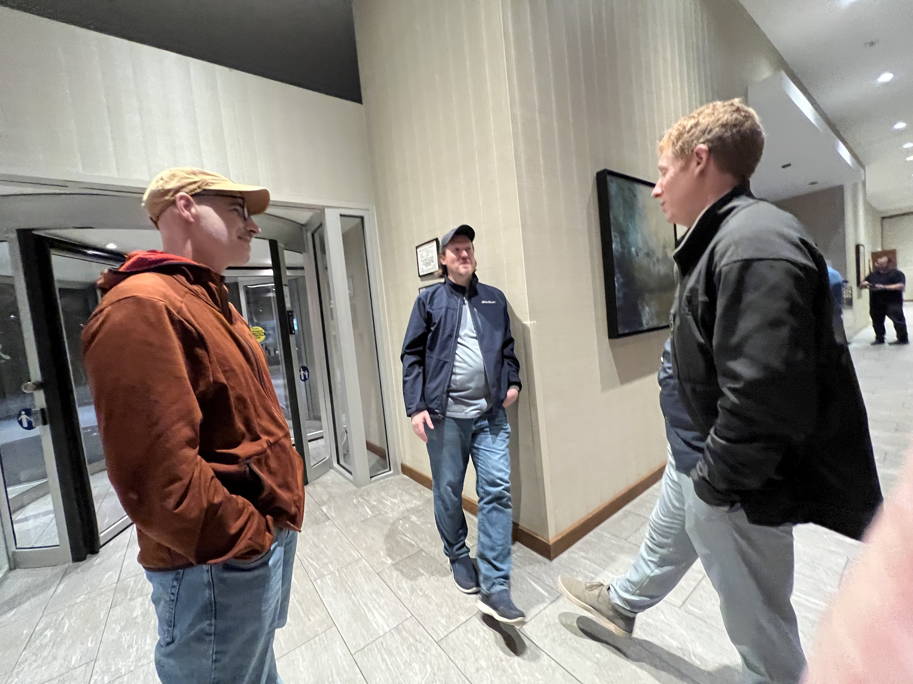

# Recap of DjangoCon US 2023

## Intro

DjangoCon US 2023 took place from October 16-20 in Durham, North Carolina. It was the sixth DjangoCon US I've had the privilege of attending, and in my opinion, the best one yet. 

"This makes me smile. ❤️ We are nowhere near where we want to be on diversity, but making big strides. I think this was the most fun DjangoCon US I've been to so far, and the growing diversity played a big part in that."

<!--
https://fosstodon.org/@kati/111276680465247885
https://blackpythondevs.github.io/2023-10-20-djangoconus/
-->

## Saturday

Things got off to a great start with a DEFNA Board dinner at [Parizade](https://www.parizadedurham.com/menus/) on Saturday night. 

According to every person I spoke to who had eaten there before, you can't go wrong. Everything is so good. I'd never eaten linguini and clams before, but it sounded really good. I decided to be adventurous and try it. If you won't do something new on the eve of DjangoCon US, when will you? I chose well.  

It was a rare opportunity to spend time in person with other board members and enjoy a perfect meal. 

Amazing ambiance

Wow...

Apple Pie Mezcal Margarita ("Del Maguey Vida Mezcal, triple sec, lime juice, apple pie syrup, salted rim")

Linguini and clams ("chorizo, cherry tomatoes, toasted garlic, white wine sauce, tarragon bread crumbs")

Cookie and ice cream desert

"Thank you to our DEFNA President Peter Grandstaff and Two Rock Software for treating fellow DEFNA Board Members in Durham for DjangoCon US to a magical dinner last night at Parizade. The apple pie mezcal margarita, linguini and clams, cookie and ice cream dessert, and company were stellar."

<!--
https://www.linkedin.com/posts/katherinemichel_thank-you-to-our-defna-president-peter-grandstaff-activity-7119291550492233728-wBC5?utm_source=share&utm_medium=member_desktop
-->

## Sunday

I love a good cup of coffee. On Sunday, I ventured to nearby [Cocoa Cinnamon](https://littlewaves.coffee/pages/old-north-durham) coffee shop. I had a Dr. Durham Latte ([organizer recommended](https://2023.djangocon.us/venue/#places)). 

Cocoa Cinnamon Coffee Shop

Dr. Durham Latte ("House made vanilla bean syrup, maca root, and ginger topped with black lava salt")

It was comically on brand that with coffee in hand, I was looking for the [Durham Convention Center](https://www.durhamconventioncenter.com/) to help with organizing, got lost, and serendipitously stumbled upon the [Django Girls](https://djangogirls.org/en/durham/) Workshop hosted at the office of our wonderful, longtime partners [Caktus Group](https://www.caktusgroup.com/). I was reunited with my friends Dawn Wages, Jay Miller, Jason Judkins, Rebecca Conway, and Tim Allen. It was a great time at an event where lives are changed. The event featured a majority of black participants! While at the workshop, I enjoyed food from [Neomonde Mediterranean](https://www.neomonde.com/mediterranean-restaurant-durham/) ([organizer recommended](https://2023.djangocon.us/venue/#places)), caught up with my friends, and picked up some swag! 

So good to be welcomed in by my friend Tim :)

Django Girls lunch from Neomonde Mediterranean

I've always wanted one of these shirts! 

I eventually made it to the Durham Convention Center for swag stuffing! Many hands make light work. A wonderful conference partner [Discover Durham](https://www.discoverdurham.com/) also generously provided city guides for swag bags and gift boxes by [City Box Durham](https://cityboxdurham.com/) for organizers and speakers. 

Swag stuffing operation (I spy a [DEFNA](https://www.defna.org/) sticker!)

City Box Durham gift boxes

Later that night, I attended Django Social at [Ponysaurus](https://www.ponysaurusbrewing.com/taproom). The event was hosted by Jason Judkins, DjangoCon US Organizer, and Jon Gould of [Foxley Talent](https://foxleytalent.com/about/), DjangoCon US Sponsors. 

Jon and company have started a network of Django meetups in the UK called Django Social. Jason is starting a [Raleigh-Durham chapter](https://www.meetup.com/djangosocial-raleighdurham/) and this was the kickoff. 

Not being a fan of beer, I had a Ponysaurus signature [Beer Cocktail](https://www.ponysaurusbrewing.com/taproom-menu) called a Gosé Margarita (lime juice, triple sec, & tequila, topped with Gosé beer). 

Gosé Margarita 

During the event, I happened to find myself having a conversation with a woman who really knew a lot about open source and events! It turned out to be the new [Python Software Foundation Executive Director Deb Nicholson](https://www.python.org/psf/records/staff/). Serendity strikes again. I love it when that happens. :) She was accessible throughout the conference, and it was a wonderful place to get to know her. Check out her Monday talk about meetups. 

Me and PSF Executive Director Deb Nicholson later in the week 

"Thank you to Jason Judkins and Jon Gould for generously hosting a wonderful Django Social event tonight on the eve of DjangoCon US. I enjoyed meeting and getting to know the new Python Software Foundation Executive Director Deb Nicholson, spending time with two of my favorite Python/Django authors Eric Matthes and William Vincent, and catching up with my wonderful Revsys friends Frank and Jeff, among many interesting conversations."

Hanging out with favorite Python/Django authors Eric Matthes and William Vincent, and my wonderful Revsys friend and fellow DEFNA Board Member Jeff

## Monday

On Monday, I ate breakfast with our new [Django Fellow Natalia Bidart](https://www.djangoproject.com/weblog/2023/mar/31/welcome-our-new-fellow-natalia-bidart/). I was thrilled to meet her! We talked about our work, what her experience has been like so far as a Django Fellow, and she introduced me to the art of drinking [maté](https://en.wikipedia.org/wiki/Mate_(drink)).

Kojo Idressa kicked of the conference with the the kind of [Orientation and Welcome](https://2023.djangocon.us/talks/orientation-and-welcome/) that only he can deliver. 

Kojo on stage- sorry for the fuzzy pic, Kojo! 

Thank you Kojo for setting the stage for a wonderful conference. 

“All of you are beyond welcome and we are thrilled you are here.”

Kojo also educated the audience about the concept of a Self Care Sprint. It's important to take time for yourself, as needed. 

Self Care Sprint

During the Opening Remarks, Peter Grandstaff asked everyone to be kind and make this conference a great place for everyone else. "If you see someone engaging in inappropriate behavior, here's a phrase you can use, 'Hey, we don't do that here.'"

A powerful tool borrowed from PyCon Australia and written about by Eric Holscher of [Read the Docs](https://about.readthedocs.com/) and [Write the Docs](https://www.writethedocs.org/) for setting norms: "[Hey, we don't do that here.](https://www.ericholscher.com/blog/2023/feb/10/we-dont-do-that-here/)"

Abigail Mesrenyame Dogbe delivered the keynote [Finding Purpose in Open Source Through Community Building](https://2023.djangocon.us/talks/keynote-finding-purpose-in-open-source-through-community-building/). 

<!--
Summary
-->

"Don’t have stats, but this feels like the most diverse DjangoCon US I’ve ever been to. Particularly excited at how many Africans we have speaking and attending, starting with Abigail Mesrenyame Dogbe‘s inspiring keynote “Finding Purpose in Open Source Through Community Building.” #DjangoConUS"

Me and Abigail

[HTML-ivating your Django web app's experience with HTMX, AlpineJS, and streaming HTML](https://2023.djangocon.us/talks/html-ivating-your-django-web-app-s-experience-with-htmx-alpinejs-and-streaming-html/)

<!--
Summary
-->

[Meet-ups: A Grand Vision for a Humble Endeavor](https://2023.djangocon.us/talks/meet-ups-a-grand-vision-for-a-humble-endeavor/)

<!--
Summary
-->

At lunch... trying a fried green tomato for the first time!

[Using database triggers to reliably track model history](https://2023.djangocon.us/talks/using-database-triggers-to-reliably-track-model-history/)

<!--
Summary
-->

<!--
AWS Cloud Practitioner
https://2023.djangocon.us/talks/hosting-and-devops-for-django/

https://2023.djangocon.us/talks/afropython-using-django-to-change-black-people-life-in-brazil/
-->

[What Can the DSF Do for Me? What Can I Do for the DSF?](https://2023.djangocon.us/talks/what-can-the-dsf-i-do-for-me-the-dsf/)

<!--
Summary
-->

<!--
Shout out to Catherine

Accessible
Jacob Kaplan-Moss
-->

Jacob talking to attendees about the new DSF Working Groups initiative

<!--
Jacob updated DEP process docs
https://github.com/django/deps/pull/81#discussion_r1367950389

https://www.djangoproject.com/weblog/2023/oct/13/announcing-dsf-working-groups/
https://github.com/django/dsf-working-groups
-->

That night, I walked with a group of fellow conference-goers to [Parts and Labor](https://partsnlabor.com/). 

Parts and Labor margarita

Afterward, I had a scoop of chocolate ice cream from [The Parlour](https://theparlour.co/) ([organizer recommended](https://2023.djangocon.us/venue/#places)). 

The Parlour

Parlour flavors

Chocolate ice cream... yum!

<!--
Back at the hotel
Pic with Paola

Authors
Eric Matthes
Will Vincent
-->

## Tuesday

Hallway track

<!--
https://2023.djangocon.us/talks/keynote-django-the-dinosaur/
https://2023.djangocon.us/talks/mixing-reliability-with-celery-for-delicious-async-tasks/
https://2023.djangocon.us/talks/postgres-performance-from-slow-to-pro/
-->

On Monday, I was fortunate to come into the possession of one of Foxley Talent's highly coveted Django Social T-shirts. I couldn't resist wearing it on Tuesday. Jon and I took a picture together at the Foxley Talent booth. :) 

<!--
"Couldn’t resist wearing this super cute Django Social shirt from Jon and company. I’ve been to a Django Social in Durham now. Hoping to make it to one in the U.K. eventually!"

-->

Me wearing my Django Social T-shirt with Django Social Organizer and Foxley Talent Principal Jon Gould

<!--
Two members of our party had founded a startup called Coherence. 
https://www.withcoherence.com/
-->

Coherence table

Coherence demo

<!--
I was intrigued about the subject

Marc Gibbons
Lymphoma
-->

[Empathetic testing: Developing with compassion and humility](https://2023.djangocon.us/talks/empathetic-testing-developing-with-compassion-and-humility/)

<!--
Summary
-->

At the end of his talk, Marc revealed that just days before the conference, he'd gotten a clean bill of health. I ate lunch with Marc and had the opportunity to learn more about his journey and how his perspective on life has changed over time. Thank you for sharing, Marc! 

<!--
https://2023.djangocon.us/talks/decoding-ddd-a-three-tiered-approach-to-django-projects/
-->

[Navigating Django's Future: Djangonaut Space](https://2023.djangocon.us/talks/navigating-djangos-future-djangonaut-space/)

<!--
Summary
-->

Djangonaut Space is now [accepting appications](https://www.djangoproject.com/weblog/2023/oct/19/djangonaut-space-now-accepting-applications/)! 

<!--
Many Django careers have been started through [Django Girls](https://djangogirls.org/en/). 

"Love to see Dawn Wages and Rachell Calhoun killing it on stage and keeping it real. Great talk!"

-->

Dawn and Rachell killing it on stage and keeping it real :) 

The magic of Django Girls... Dawn and Rachell are alumnae

While [DjangoCon US 2022 Chair Logan Kilpatrick](https://2022.djangocon.us/news/introducing-conference-chair-logan/), first DevRel hire at OpenAI, is busy getting OpenAI's first developer conference [OpenAI DevDay](https://openai.com/blog/announcing-openai-devday) off the ground, Tim Allen, gave an impassioned talk [Don't Buy the "AI" Hype](https://2023.djangocon.us/talks/dont-buy-the-ai-hype/) the he had put together at the last minute to fill an open slot. 

<!--
Summary
-->

Tim on stage

<!--
Ice cream for afternoon snack

https://2023.djangocon.us/talks/all-about-djangoproject-com/

YupGup
https://2023.djangocon.us/talks/managing-content-with-django/

https://2023.djangocon.us/talks/an-approach-to-lightweight-tenancy-management-using-django-rest-framework/
-->

After the conference activities and group photo, I attended the complimentary speaker and organizer dinner at [The Pit](https://www.thepit-durham.com/). The food was really good! 

The Pit dining room

The Pit bar

Another delicious southern-style meal! 

## Wednesday

<!--
https://2023.djangocon.us/talks/how-to-schedule-tasks-with-celery-and-django/
https://2023.djangocon.us/talks/one-database-table-one-model-many-behaviours-proxy-model/
https://2023.djangocon.us/talks/back-to-the-future-of-hypermedia-in-django/
https://2023.djangocon.us/talks/panel-discussion-who-put-me-in-charge/
-->

My friend Andrew "Pandy" Knight delivered the Wednesday morning keynote [Testing Modern Web Apps Like a Champion](https://2023.djangocon.us/talks/keynote-testing-modern-web-apps-like-a-champion/). Afterward, I had the chance to catch up with him. His talk has rekindled my desire to get better at testing and reminded me of what a great resource Test Automation University is. He gave me a card resource too! 

<!--
Summary
-->

<!--
"Another high level endorsement of HTMX: “HTMX is a great way to democratize front-end development.” Andrew Knight"

-->

A gift from my friend Andy

This year, along the lines of my fellow DEFNA board member Jeff Triplett's annual [DjangoCon US Talks I'd Like to See](https://jefftriplett.com/2023/djangocon-us-talks-i-d-like-to-see-2023-edition/) list, I created my own [Talk Topic Ideas List](https://github.com/KatherineMichel/portfolio/blob/master/conference-blog-posts/topic-ideas-djangocon-us-2023.md) and posted it on social media. Tim Schilling, who has done an incredible job of taking over my former role of DEFNA Corporate Secretary, tooted to Natalia on Fosstodon. 

 

On Wednesday, Natalia gave the talk [Inside Out: My Journey of Understanding Inclusion](https://2023.djangocon.us/talks/inside-out-my-journey-of-understanding-inclusion)

<!--
Summary
-->

<!--
https://fosstodon.org/@nessita/110340749235756274
-->

Thank you to Natalia for embracing our community and asking for reflection about an important subject. I hope she found our conference to be very welcoming in return. We have certainly made progress. 

“I had to stand in line at the women's bathroom. I’ve never had to do that before at a conference.” -Natalia Bidart during her talk

<!--
https://twitter.com/KatiMichel/status/1714679106510434533
-->

I don't take the time that Natalie spent on her talk lightly. I've chatted with women recently about the additional overhead women and other underrepresented people often have from doing extra work to change the system. It can be exhausting. I am looking forward to getting to know Natalia's development work. 

<!--
DjangoCon Africa
Daniele

Africans
Richard Ackon
Abigail Afi Gbadago
Ntalie Geofrey
Noah
Benedict Kofi Amofah
Sheena O'Connell
Ron Maravanyika
Abigail

Hunar, Libya, Africa
-->

"This is what we do. This is how we are."

DjangoCon Africa Organizers

[DjangoCon Africa 2023](https://2023.djangocon.africa/) will take place in Tanzania, Africa in November and [DjangoCon Europe 2024](https://www.djangoproject.com/weblog/2023/oct/14/djangocon-europe-2024/) will take place in Vigo, Spain in June 2024. I hope to go to both someday. 

"Is 2024 the year that I finally make it to DjangoCon Europe? 👀 😘"

After conference activities, as usual, hanging around in the lobby led to a great adventure. Hanging around in a lobby once led to me sitting next to Guido at an impromptu group dinner and chatting with him about the early days of Python. 

On this night, I ended up having dinner with Jacob Kaplan-Moss, Andrew Godwin (Django Core Dev, Django Async Architect, South creator, and the only person who has attended every DjangoCon US), Frank Wiles (Revsys Founder and Partner, and former DSF President), and Tim and and Charles of the Wharton School, my past client. 

You know you're in good company when someone in your party is wearing this :) 

We ate at a restaurant called [It's a Southern Thing](https://getsouthernfood.com/). The food was high quality and the service was great. I had the Crispy Catfish. 

Crispy Catfish ("Crispy cornmeal fried catfish served over a bed of red beans & rice; made with beef sausage, holy trinity, creole spices, finished with a creole mustard aioli")

Our table after an incredible meal!

Afterward, led by Tim, we had ice cream at a novel ice cream shop called [Simon Says Dip This](https://www.simonssaysdipthis.com/). Tim said he's never seen an ice cream shop like this anywhere else. 

Simon Says Dip This Counter

Dip being poured on

Toppings to choose from

Final product... wow! (vanilla soft serve, chocolate core, bourbon dip, and strawberry topping)

<!--
White Coat Captioning
Anne Beeman

Simon
-->

## Sight Seeing and More Food!

I consider getting to know the host city to be an important part of the conference experience. 

### Sight Seeing

After doing a bit of research, I chose the [Sarah P. Duke Gardens](https://gardens.duke.edu/) as my top priority for sight seeing. After spending time there, I can personally report that if you are in Durham, it is an absolute must see. Some of the scenes there were simply stunning! 

<!--
Sarah P. Duke Gardens pics
-->

After visiting the gardens, I made the quick walk over to the [Duke Chapel](https://chapel.duke.edu/). Not only was the chapel gorgeous, but the [Conference for North Carolina Chapter of the American Choral Directors Association](https://chapel.duke.edu/events/conference-north-carolina-chapter-american-choral-directors-association-1697169600) was taking place. A choir that must have been made up of elite children singers happened to be practicing. I've stumbled into some jaw-dropping experiences while traveling. This was another one. Together, the music and surroundings were magical. Take a listen. 

<!--
Duke Chapel pics
Video
-->

I also visited the [Museum of Life and Science](lifeandscience.org/). The [Butterfly House](https://www.lifeandscience.org/explore/butterfly-house/) in particular was a really special experience. I was also happy to have a second change to see lemurs. Duke University has the largest population of lemurs in the world outside of Madagascar, but unfortunately, its tours were booked through the rest of the year. The Museum of Life and Science has a [Lemur Exhibit](https://www.lifeandscience.org/explore/lemurs-and-tortoises/). I enjoyed observing these beautiful animals. [The Farmyard](https://www.lifeandscience.org/explore/the-farmyard/), [Insectarium](https://www.lifeandscience.org/explore/insectarium/), and [Aerospace](https://www.lifeandscience.org/explore/aerospace/) exhibits were also really fun and interesting. 

Butterfly House butterfly

Unfortunately, the [train](https://www.lifeandscience.org/explore/train/) that takes passengers around the museum's 84 acres was not in operation at the time of my visit. I know I would have really enjoyed it. 

<!--
Butterfly pics
Lemur pics
-->

Museum of Life and Science lemurs

### Food

After having read rave reviews about [Loaf](https://www.loafdurham.com/) bakery, I had to pay a visit. It did not disappoint. I ordered a ham and gruyere croissant, a walnut sea salt brownie, a pain au chocolat, and 5 pumpkin chocolate chip cookies. 

Ham and gruyere croissant

Walnut sea salt brownie

For dinner one night, I ordered takeaway from [Pizzeria Toro](https://www.pizzeriatoro.com/), right around the corner from the Marriott. I had a mouthwatering red-sauce pizza with shredded mozzarella, black olives, mixed mushrooms, and fennel sausage. 

Cool atmosphere! 

Yum! 

After having read rave reviews about [Press Coffee, Crepe, and Cocktails](https://pressccc.com/locations/durham/) at the [American Tobacco Campus](https://americantobacco.co/), I simply had to visit. I was keen to have a seasonal Black Forest Latte. I finally had the opportunity on sprint day morning. The atmosphere was bright and cute. The food was excellent. I think this was the first time that I've ever had a savory crepe. 

Coffee Bar

Bar bar 

Black Forest Latte... the foam was silky smooth. Delicious! ("a combination of our house-made chocolate-sauce and cherry syrup")

The Down Home breakfast crepe ("bacon with scrambled eggs and hoop cheese")

The inside 

## In Closing

My sixth DjangoCon US

"As usual, I've tried to squeeze every last bit of experience out of DjangoCon US and have done about as much as I humanly can. 🤣 Today is a day for relaxed sprinting, catching up with a few more people, and flying back to Plano. I'll write up a proper blog post soon with thoughts about talks, the people I met, sightseeing, and food. For the moment, suffice it to say, this conference just gets better every year and that is because of the people. Everyone is welcome and everyone makes it a better place. This community is changing the world for the better through shared humanity and technology. And, it's not a coincidence that it started in wonderful Lawrence, Kansas."

I came away from Durham with some new friends, new hope, and some amazing swag. 

New friends... beautiful on the inside and out!

Prized possessions 

Proud to be a DEFNA Board Member and DjangoCon US Organizer

<!--
https://2023.djangocon.us/talks/closing-remarks/

Durham

As Jeff said, it was one hell of a year
https://fosstodon.org/@webology@mastodon.social/111270062215335417
-->

Standing ovation for organizers

Can't wait for next year! :)

djurham

