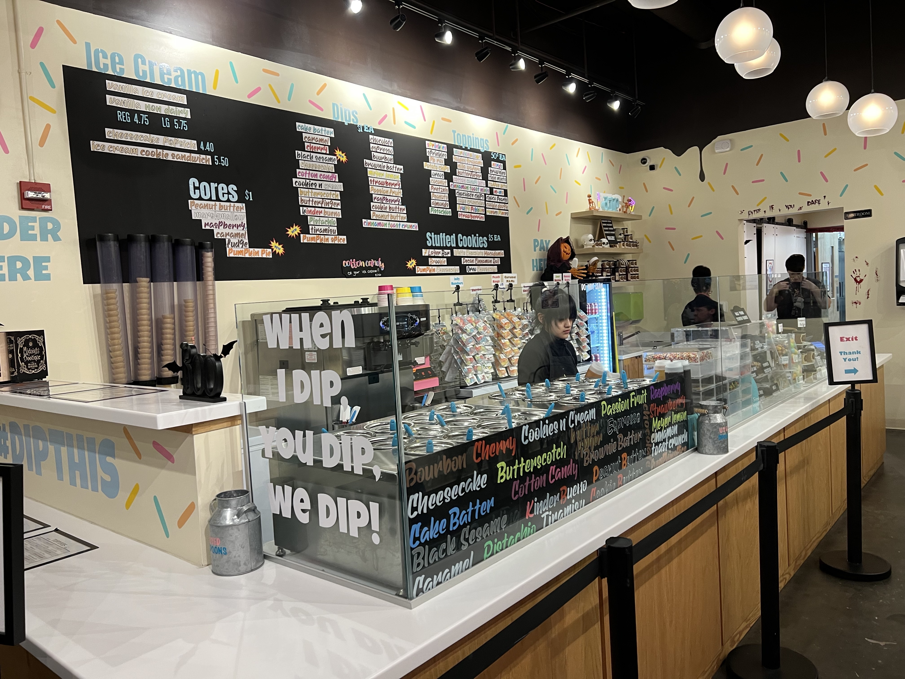

## Saturday

<!--
https://www.parizadedurham.com/menus/

"Thank you to our DEFNA President Peter Grandstaff and Two Rock Software for treating fellow DEFNA Board Members in Durham for DjangoCon US to a magical dinner last night at Parizade. The apple pie mezcal margarita, linguini and clams, cookie and ice cream dessert, and company were stellar."
https://www.linkedin.com/posts/katherinemichel_thank-you-to-our-defna-president-peter-grandstaff-activity-7119291550492233728-wBC5?utm_source=share&utm_medium=member_desktop

Victor
Nichole
-->

It was a rare opportunity to spend time in person with other board members and enjoy some incredible food. 

<!--
I asked several people for recommendations about what to order there. They all said you can't go wrong. Everything is so good. I decided to be adventurous and order something that sounded good, but that I'd never had before: linguini and clams. I chose well. It was one of the most delicious meals that I've ever had.
-->

Amazing ambiance

Wow...

Apple Pie Mezcal Margarita ("Del Maguey Vida Mezcal, triple sec, lime juice, apple pie syrup, salted rim")

Linguini and clams ("chorizo, cherry tomatoes, toasted garlic, white wine sauce, tarragon bread crumbs")

Cookie and ice cream desert

## Sunday

I love a good cup of coffee. On Sunday, I ventured to nearby [Cocoa Cinnamon](https://littlewaves.coffee/pages/old-north-durham) coffee shop. I had a Dr. Durham Latte ([organizer recommended](https://2023.djangocon.us/venue/#places)). 

Cocoa Cinnamon Coffee Shop

Dr. Durham Latte ("House made vanilla bean syrup, maca root, and ginger topped with black lava salt")

It was comically on brand that with coffee in hand, I was looking for the Durham Convention Center to help with organizing, got lost, and serendipitously stumbled upon the [Django Girls](https://djangogirls.org/en/durham/) Workshop hosted at the office of our wonderful, longtime partners [Caktus Group](https://www.caktusgroup.com/). I was reunited with my friends Dawn Wages, Jay Miller, Jason Judkins, Rebecca Conway, and Tim Allen. It was a great time and lives were changed. Many Django careers have been started through Django Girls. While there, I enjoyed food from [Neomonde Mediterranean](https://www.neomonde.com/mediterranean-restaurant-durham/) ([organizer recommended](https://2023.djangocon.us/venue/#places)), caught up with my friends, and picked up some swag! 

So good to be welcomed in by my friend Tim :)

Django Girls lunch from Neomonde Mediterranean

I've always wanted one of these shirts! 

I eventually made it to the Durham Convention Center for swag stuffing! [Discover Durham](https://www.discoverdurham.com/) also generously provided gift boxes by [City Box Durham](https://cityboxdurham.com/).

Swag stuffing operation

City Box Durham gift boxes

<!--
Explain what Django Social is

Jason Judkins
John Gould
-->

Later that night, I attended Django Social at [Ponysaurus](https://www.ponysaurusbrewing.com/taproom). Not being a fan of beer, I had one of their signature [Beer Cocktails](https://www.ponysaurusbrewing.com/taproom-menu) a Gosé Margarita (lime juice, triple sec, & tequila, topped with Gosé beer). 

Gosé Margarita 

During the event, I happened to find myself having a conversation with a woman who really knew a lot about open source and events! It turned out to be the new [Python Software Foundation Executive Director Deb Nicholson](https://www.python.org/psf/records/staff/). Serendity strikes again. I love it when that happens. :) She was accessible throughout the conference, and it was a wonderful place to get to know her. Check out her Monday talk about meetups. 

Me and PSF Executive Director Deb Nicholson later in the week 

<!--

-->

## Monday

On Monday, I ate breakfast with our new [Django Fellow Natalia Bidart](https://www.djangoproject.com/weblog/2023/mar/31/welcome-our-new-fellow-natalia-bidart/). I was thrilled to meet her! 

Abigail Mesrenyame Dogbe delivered the keynote [Finding Purpose in Open Source Through Community Building](https://2023.djangocon.us/talks/keynote-finding-purpose-in-open-source-through-community-building/). It was inspiring. 

Me and Abigail

<!--
https://2023.djangocon.us/talks/meet-ups-a-grand-vision-for-a-humble-endeavor/

https://2023.djangocon.us/talks/html-ivating-your-django-web-app-s-experience-with-htmx-alpinejs-and-streaming-html/

https://2023.djangocon.us/talks/using-database-triggers-to-reliably-track-model-history/

AWS Cloud Practitioner
https://2023.djangocon.us/talks/hosting-and-devops-for-django/

https://2023.djangocon.us/talks/afropython-using-django-to-change-black-people-life-in-brazil/

Jacob, DSF Working Groups
https://2023.djangocon.us/talks/what-can-the-dsf-i-do-for-me-the-dsf/
-->

That night, I walked with a group of fellow conference-goers to [Parts and Labor](https://partsnlabor.com/). 

Parts and Labor margarita

Afterward, I had a scoop of chocolate ice cream from [The Parlor](https://theparlour.co/) ([organizer recommended](https://2023.djangocon.us/venue/#places)). 

The Parlour

Chocolate ice cream... yum!

<!--
Back at the hotel

Pic with Paola

Authors
Eric Matthes
Will Vincent
-->

## Tuesday

<!--
https://2023.djangocon.us/talks/keynote-django-the-dinosaur/
https://2023.djangocon.us/talks/mixing-reliability-with-celery-for-delicious-async-tasks/
https://2023.djangocon.us/talks/postgres-performance-from-slow-to-pro/
-->

On Monday, I was fortunate to come into the possession of one of [Foxley Talent](https://foxleytalent.com/about/)'s highly coveted Django Social T-shirts. I couldn't resist wearing it on Tuesday. Jon and I took a picture together at the Foxley Talent booth. :) 

Me wearing my Django Social T-shirt with Django Social Organizer and Foxley Talent Principal Jon Gould

<!--
https://2023.djangocon.us/talks/empathetic-testing-developing-with-compassion-and-humility/

Marc Gibbons
Lymphoma
At the end of his talk, Marc revealed that days before the conference, he'd gotten a clean bill of health. 
At lunch, I had the opportunity to learn more
-->

<!--
https://2023.djangocon.us/talks/decoding-ddd-a-three-tiered-approach-to-django-projects/

https://2023.djangocon.us/talks/navigating-djangos-future-djangonaut-space/
-->

While [DjangoCon US 2022 Chair Logan Kilpatrick](https://2022.djangocon.us/news/introducing-conference-chair-logan/), first DevRel hire at OpenAI, is busy getting OpenAI's first developer conference [OpenAI DevDay](https://openai.com/blog/announcing-openai-devday) off the ground, Tim Allen, gave an impassioned talk "Don't Buy the AI Hype" the he had put together at the last minute to fill an open slot. 

Tim on stage

<!--
https://2023.djangocon.us/talks/all-about-djangoproject-com/

YupGup
https://2023.djangocon.us/talks/managing-content-with-django/

https://2023.djangocon.us/talks/an-approach-to-lightweight-tenancy-management-using-django-rest-framework/
-->

After the conference and group photo, I attended the complimentary speaker/organizer dinner at [The Pit](https://www.thepit-durham.com/). The food was really good! 

The Pit dining room

The Pit bar

Another delicious southern-style meal! 

## Wednesday

<!--
https://2023.djangocon.us/talks/how-to-schedule-tasks-with-celery-and-django/
https://2023.djangocon.us/talks/one-database-table-one-model-many-behaviours-proxy-model/
https://2023.djangocon.us/talks/back-to-the-future-of-hypermedia-in-django/
https://2023.djangocon.us/talks/panel-discussion-who-put-me-in-charge/
-->

My friend Andrew "Pandy" Knight delivered the Wednesday morning keynote [Testing Modern Web Apps Like a Champion](https://2023.djangocon.us/talks/keynote-testing-modern-web-apps-like-a-champion/). Afterward, I had the chance to catch up with him. His talk has rekindled my desire to get better at testing and reminded me of what a great resource Test Automation University is. He gave me a card resource too! 

A gift from my friend Andy

This year, along the lines of my fellow DEFNA board member Jeff Triplett's annual [DjangoCon US Talks I'd Like to See](https://jefftriplett.com/2023/djangocon-us-talks-i-d-like-to-see-2023-edition/) list, I decided to create my own [Talk Topic Ideas List](https://github.com/KatherineMichel/portfolio/blob/master/conference-blog-posts/topic-ideas-djangocon-us-2023.md). Tim Schilling, who has done an incredible job of taking over my former role of DEFNA Corporate Secretary, tooted to Natalia on Fosstodon. 

Ask and you shall receive. 

On Wednesday, Natalia gave the talk [Inside Out: My Journey of Understanding Inclusion](https://2023.djangocon.us/talks/inside-out-my-journey-of-understanding-inclusion)

<!--
https://fosstodon.org/@nessita/110340749235756274
-->

Thank you to Natalia for embracing our community and asking for reflection about an important subject.

I hope she found our conference to be very welcoming in return. We have certainly made progress. 

“I had to stand in line at the women's bathroom. I’ve never had to do that before at a conference.” Natalia Bidart at #DjangoConUS"

<!--
https://twitter.com/KatiMichel/status/1714679106510434533

DjangoCon Europe
Daniele
-->

As usual, hanging around in the lobby led a great adventure. 

<!--
Guido
-->

<!--
Dinner
Frank, Jacob, Andrew, Verda, Charles, Tim, me

Wharton
-->

You know you're in a good place when you see this :) 

We ate at a restaurant called [It's a Southern Thing](https://getsouthernfood.com/). The food was high quality and the service was great. I had the Crispy Catfish. 

Crispy Catfish ("Crispy cornmeal fried catfish served over a bed of red beans & rice; made with beef sausage, holy trinity, creole spices, finished with a creole mustard aioli")

Our table after an incredible meal!

Afterward, led by Tim, we had ice cream at a novel ice cream shop called [Simon Says Dip This](https://www.simonssaysdipthis.com/). Tim said he's never seen an ice cream shop like this anywhere else. 

Simon Says Dip This Counter

Dip being poured on

Toppings to choose from

Final product... wow! (vanilla soft serve, chocolate core, bourbon dip, and strawberry topping)

## Sight Seeing and More Food!

I consider getting to know the host city to be an important part of the conference experience. 

### Sight Seeing

After doing a bit of research, I chose the [Sarah P. Duke Gardens](https://gardens.duke.edu/) as my top priority for sight seeing. After spending time there, I can personally report that if you are in Durham, it is an absolute must see. Some of the scenes there were simply stunning! 

<!--
Sarah P. Duke Gardens pics
-->

After visiting the gardens, I made the quick walk over to the [Duke Chapel](https://chapel.duke.edu/). Not only was the chapel gorgeous, but the [Conference for North Carolina Chapter of the American Choral Directors Association](https://chapel.duke.edu/events/conference-north-carolina-chapter-american-choral-directors-association-1697169600) was taking place. A choir that must have been made up of elite children singers happened to be practicing. I've stumbled into some jaw-dropping experiences while traveling. This was another one. Together, the music and surroundings were magical. Take a listen. 

<!--
Duke Chapel pics
Video
-->

I also visited the [Museum of Life and Science](lifeandscience.org/). The [Butterfly House](https://www.lifeandscience.org/explore/butterfly-house/) in particular was a really special experience. I was also happy to have a second change to see lemurs. Duke University has the largest sanctuary for lemurs in the world, but unfortunately, its tours were booked through the rest of the year. The Museum of Life and Science has a [Lemur Exhibit](https://www.lifeandscience.org/explore/lemurs-and-tortoises/). I enjoyed observing these beautiful animals. [The Farmyard](https://www.lifeandscience.org/explore/the-farmyard/), [Insectarium](https://www.lifeandscience.org/explore/insectarium/), and [Aerospace](https://www.lifeandscience.org/explore/aerospace/) exhibits were also really fun and interesting. 

Butterfly House butterfly

Unfortunately, the [train](https://www.lifeandscience.org/explore/train/) that takes passengers around the museum's 84 acres was not in operation at the time of my visit. I know I would have really enjoyed it. 

<!--
Butterfly pics
Lemur pics
-->

Museum of Life and Science lemurs

### Food

After having read rave reviews about [Loaf](https://www.loafdurham.com/) bakery, I had to pay a visit. It did not disappoint. I ordered a ham and gruyere croissant, a walnut sea salt brownie, a pain au chocolat, and 5 pumpkin chocolate chip cookies. 

Ham and gruyere croissant

Walnut sea salt brownie

For dinner one night, I ordered takeaway from [Pizzeria Toro](https://www.pizzeriatoro.com/), right around the corner from the Marriott. I had a mouthwatering red-sauce pizza with shredded mozzarella, black olives, mixed mushrooms, and fennel sausage. 

Cool atmosphere! 

Yum! 

After having read rave reviews about [Press Coffee, Crepe, and Cocktails](https://pressccc.com/locations/durham/) at the [American Tobacco Campus](https://americantobacco.co/), I simply had to visit. I was keen to have a seasonal Black Forest Latte. I finally had the opportunity on sprint day morning. The atmosphere was bright and cute. The food was excellent. I think this was the first time that I've ever had a savory crepe. 

Coffee Bar

Bar bar 

Black Forest Latte... the foam was silky smooth. Delicious! ("a combination of our house-made chocolate-sauce and cherry syrup")

The Down Home breakfast crepe ("bacon with scrambled eggs and hoop cheese")

The inside 

## In Closing

DjangoCon US 2023 marked my sixth DjangoCon US

My sixth DjangoCon US

I came away from Durham with some new friends and new hope. 

Prized possessions 

Proud to be a DEFNA Board Member and DjangoCon US Organizer

<!--
https://2023.djangocon.us/talks/closing-remarks/

Durham

As Jeff said, this was a hell of a year
-->

Can't wait for next year! :)

<!--
When as this?

Two members of our party had founded a startup called Coherence. 

White Coat Captioning
Anne Beeman
-->

<!--
Africans
Richard Ackon
Abigail Afi Gbadago
Ntalie Geofrey
Noah
Benedict Kofi Amofah
Sheena O'Connell
Ron Maravanyika
Abigail
 

-->

