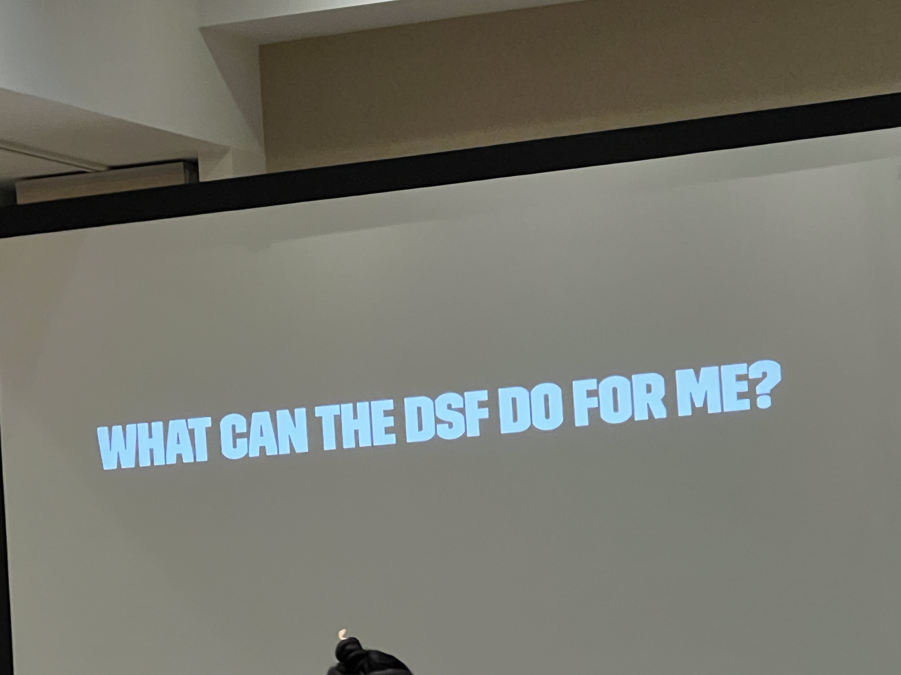
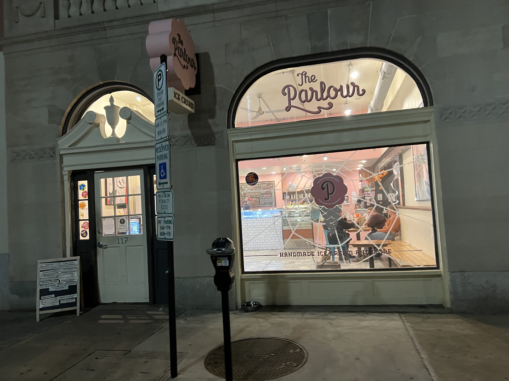
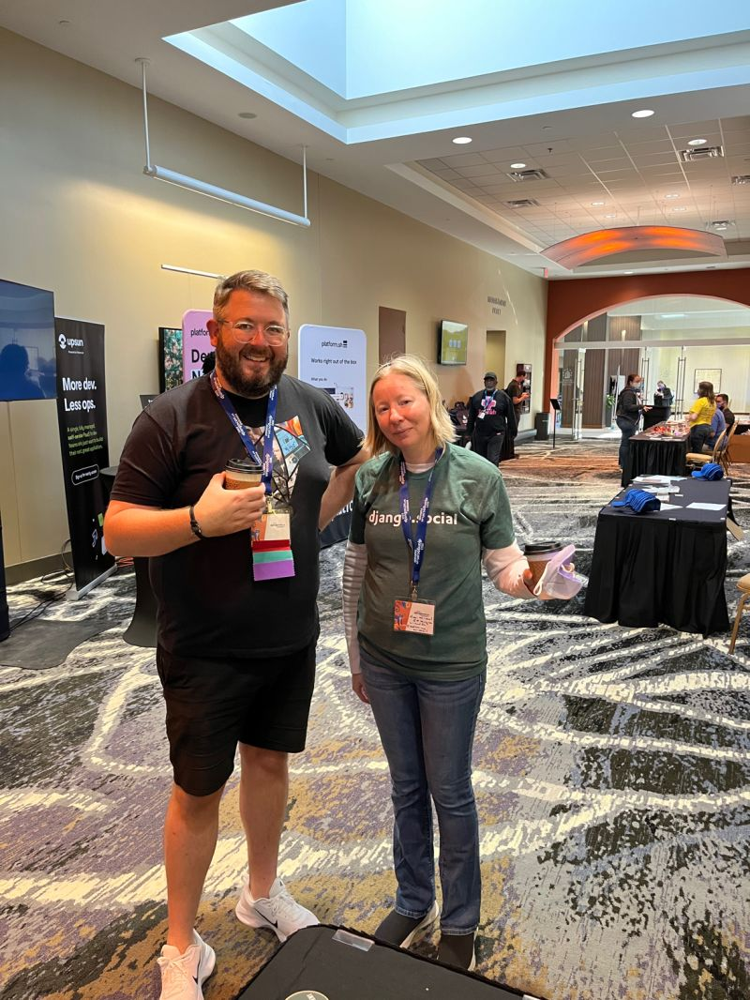
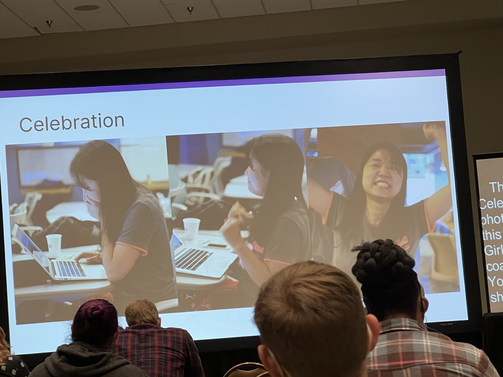
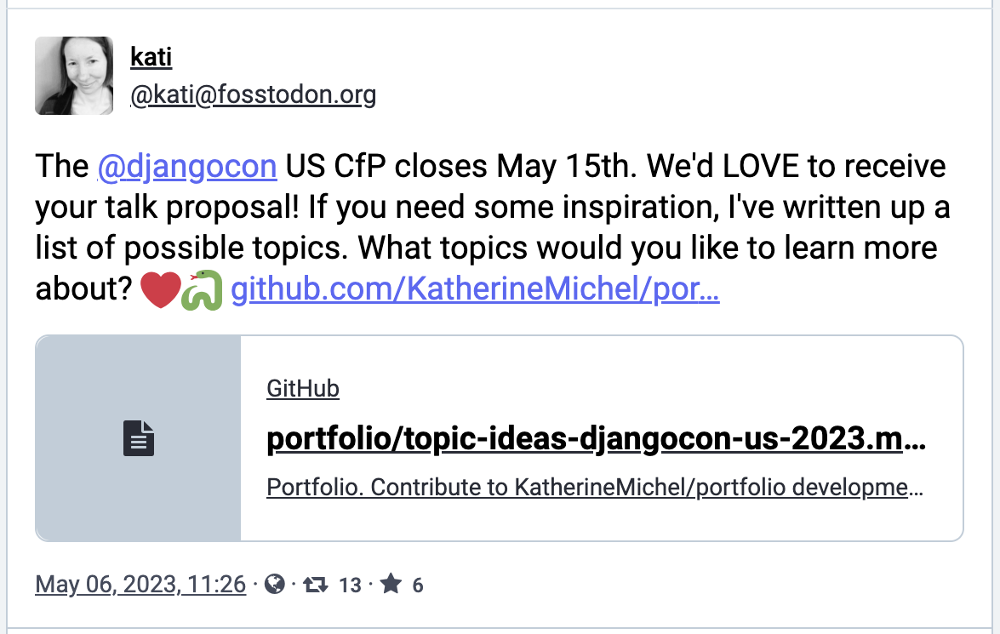
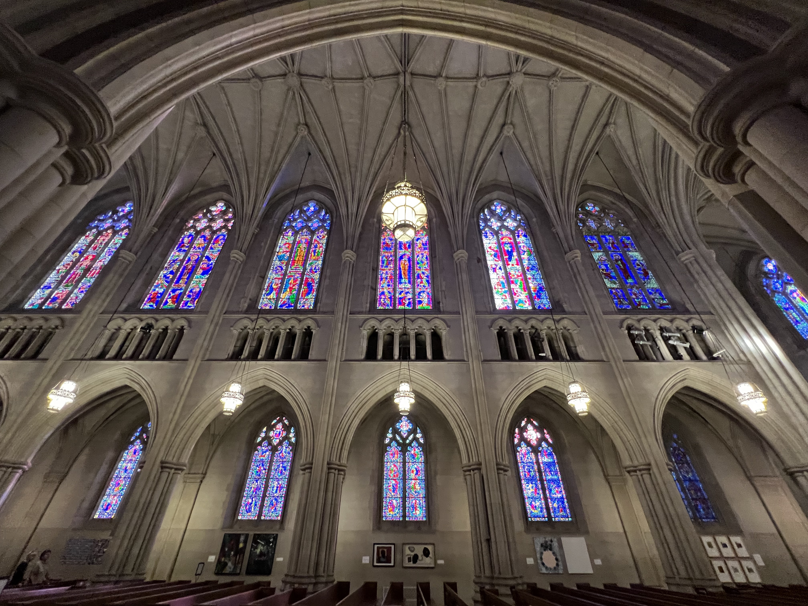
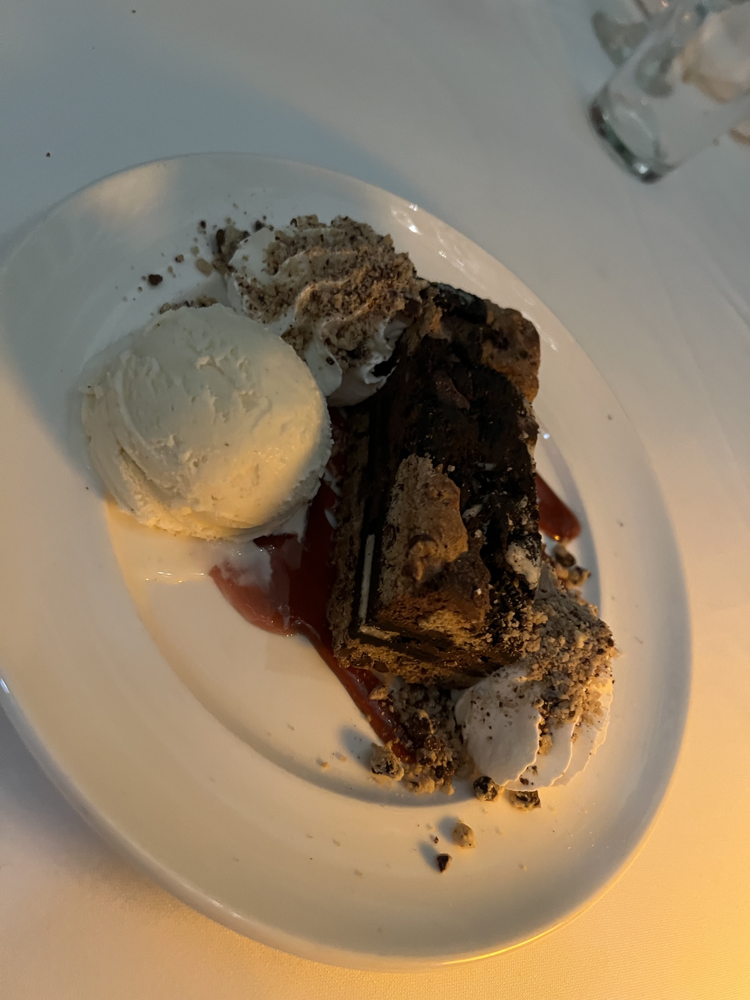

# Recap of DjangoCon US 2023

Table of Contents
-----------------

- [Pre-Conference Activities](#pre-conference-activities)
    - [Board Dinner](#board-dinner)
    - [Django Girls Workshop](#django-girls-workshop)
    - [Swag Stuffing](#swag-stuffing)
    - [Django Social](#django-social)
        - [Meeting the New PSF Executive Director Deb Nicholson](#meeting-the-new-psf-executive-director-deb-nicholson)
        - [A Chance to Hang Out with Old Friends and Make New Friends](#a-chance-to-hang-out-with-old-friends-and-make-new-friends)
- [Monday](#monday)
    - [Meeting the New Django Fellow Natalia Bidart](#meeting-the-new-django-fellow-natalia-bidard)
    - [Kojo Idressa and Peter Grandstaff Kick Off the Conference](#kojo-idress-and-peter-grandstaff-kick-off-the-conference) 
- [Tuesday](#tuesday)
- [Wednesday](#wednesday)
    - [DjangoCon Africa](#djangocon-africa)
    - [Another Great Adventure](#another-great-adventure)
    - [Conference Conclusion](#conference-conclusion)
- [Sight Seeing and More Food](#sight-seeing-and-more-food)
    - [Sarah P. Duke Gardens](#sarah-p-duke-gardens)
    - [Duke Chapel](#duke-chapel)
    - [Museum of Life and Science](#museum-of-life-and-science)
    - [Parizade](#parizade)
    - [Loaf](#loaf)
    - [Pizzeria Toro](#pizzeria-toro)
    - [Simon Says Dip This](#simon-says-dip-this)
    - [Press Coffee, Crepes, and Cocktails](#press-coffee-crepesand-cocktails)
- [In Closing](#in-closing)

## Intro

DjangoCon US 2023 took place from October 16-20 in Durham, North Carolina. It was the sixth DjangoCon US I've had the privilege of attending, and in my opinion, the best one yet. 

Attendee photo (photo credit: Bartek Pawlik (https://bartpawlik.format.com/))

<!--
© 2023 Bartek Pawlik CC BY-NC-SA
CC BY-SA 4.0
-->

## Pre-Conference Activities

### Board Dinner

Things got off to a great start with a DEFNA Board dinner at [Parizade](https://www.parizadedurham.com/menus/) on Saturday night. 

According to every person I spoke to who had eaten there before, you can't go wrong. Everything is so good. I'd never eaten linguini and clams before, but it sounded really good. I decided to be adventurous and try it. If you won't do something new on the eve of DjangoCon US, when will you? I chose well.  

It was a rare opportunity to spend time in person with other board members and enjoy a perfect meal. 

Wow...

Apple Pie Mezcal Margarita ("Del Maguey Vida Mezcal, triple sec, lime juice, apple pie syrup, salted rim")

Linguini and clams ("chorizo, cherry tomatoes, toasted garlic, white wine sauce, tarragon bread crumbs")

<!--
https://www.linkedin.com/posts/katherinemichel_thank-you-to-our-defna-president-peter-grandstaff-activity-7119291550492233728-wBC5?utm_source=share&utm_medium=member_desktop
-->

### Django Girls Workshop

I love a good cup of coffee. On Sunday, I ventured to nearby [Cocoa Cinnamon](https://littlewaves.coffee/pages/old-north-durham) coffee shop. I had a Dr. Durham Latte ([organizer recommended](https://2023.djangocon.us/venue/#places)). 

Cocoa Cinnamon Coffee Shop

Dr. Durham Latte ("House made vanilla bean syrup, maca root, and ginger topped with black lava salt")

With coffee in hand, I was looking for the [Durham Convention Center](https://www.durhamconventioncenter.com/) to help with organizing, got lost, and serendipitously stumbled upon the [Django Girls](https://djangogirls.org/en/durham/) Workshop hosted at the office of our wonderful, longtime partners [Caktus Group](https://www.caktusgroup.com/). I was reunited with my friends Dawn Wages, Jay Miller, Jason Judkins, Rebecca Conway, and Tim Allen. It was a great time at an event where lives are changed. The event featured a majority of Black participants! While at the workshop, I enjoyed food from [Neomonde Mediterranean](https://www.neomonde.com/mediterranean-restaurant-durham/) ([organizer recommended](https://2023.djangocon.us/venue/#places)), caught up with my friends, and picked up some swag! 

So good to be welcomed in by my friend Tim :)

Django Girls lunch from Neomonde Mediterranean

I've always wanted one of these shirts! 

### Swag Stuffing

I eventually made it to the Durham Convention Center for swag stuffing! Many hands make light work.

Swag stuffing operation (I spy a [DEFNA](https://www.defna.org/) sticker!)

### Django Social

Later that night, I attended Django Social at [Ponysaurus](https://www.ponysaurusbrewing.com/taproom). The event was hosted by Jason Judkins, DjangoCon US Organizer, and Jon Gould of [Foxley Talent](https://foxleytalent.com/about/), DjangoCon US Sponsors. 

Jon and company have started a network of Django meetups in the UK called Django Social. Jason is starting a [Raleigh-Durham chapter](https://www.meetup.com/djangosocial-raleighdurham/) and this was the kickoff. 

Not being a fan of beer, I had a Ponysaurus signature [Beer Cocktail](https://www.ponysaurusbrewing.com/taproom-menu) called a Gosé Margarita (lime juice, triple sec, & tequila, topped with Gosé beer). 

Gosé Margarita 

#### Meeting the New PSF Executive Director Deb Nicholson

During the event, I happened to find myself having a conversation with a woman who really knew a lot about open source and events! It turned out to be the new [Python Software Foundation Executive Director Deb Nicholson](https://www.python.org/psf/records/staff/). Serendity strikes again. I love it when that happens. :) She was accessible throughout the conference, and it was a wonderful place to get to know her. Check out her Monday talk [Meet-ups: A Grand Vision for a Humble Endeavor](https://2023.djangocon.us/talks/meet-ups-a-grand-vision-for-a-humble-endeavor/). 

Me and PSF Executive Director Deb Nicholson later in the week 

#### A Chance to Hang Out with Old Friends and Make New Friends

Hanging out with favorite Python/Django authors Eric Matthes and William Vincent, and my wonderful Revsys friend and fellow DEFNA Board Member Jeff Triplett

## Monday

### Meeting the New Django Fellow Natalia Bidart

On Monday, I ate breakfast with our new [Django Fellow Natalia Bidart](https://www.djangoproject.com/weblog/2023/mar/31/welcome-our-new-fellow-natalia-bidart/). I was thrilled to meet her! We talked about our work, what her experience has been like so far as a Django Fellow, and she introduced me to the art of drinking [maté](https://en.wikipedia.org/wiki/Mate_(drink)).

### Kojo Idressa and Peter Grandstaff Kick Off the Conference

<!--
Following in the footsteps of PyCon US...
Increase in diversity
-->

DEFNA North America Ambassador Kojo Idressa kicked of the conference with the the kind of [Orientation and Welcome](https://2023.djangocon.us/talks/orientation-and-welcome/) that only he can deliver. 

Thank you Kojo for setting the stage for a wonderful conference. 

Kojo also educated the audience about the concept of a Self Care Sprint. It's important to take time for yourself, as needed. 

Self Care Sprint

During the Opening Remarks, Conference Chair Peter Grandstaff asked everyone to be kind and make this conference a great place for everyone else. "If you see someone engaging in inappropriate behavior, here's a phrase you can use, 'Hey, we don't do that here.'"

A powerful tool borrowed from PyCon Australia and written about by Eric Holscher of [Read the Docs](https://about.readthedocs.com/) and [Write the Docs](https://www.writethedocs.org/) for setting norms: "[Hey, we don't do that here.](https://www.ericholscher.com/blog/2023/feb/10/we-dont-do-that-here/)"

### Abigail

Abigail Mesrenyame Dogbe delivered the keynote [Finding Purpose in Open Source Through Community Building](https://2023.djangocon.us/talks/keynote-finding-purpose-in-open-source-through-community-building/). 

When Abigail was young, she didn't like math, science, and computers. Her parents would show her how to do a chore, then leave her to do it herself. She credits them with having taught her how to bring people into open source. That is her purpose in life. 

In 2017, after her undergraduate studies, she took part in a Django Girls workshop with DjangoCon US Organizer Noah Alorwu as her mentor. She was encouraged to give back by teaching other women how to code. She went on to be an organizer or mentor at 25 events with 500+ participants in cities and and remote areas of Ghana. She was happy to be the first female mentor, but not satisfied. She encouraged other women to become involved. 

Only two years later, at PyCon Africa Django Girls workshop in Ghana, all of the coaches were women. It was a proud moment and a result of that effort. 

Abigail told the stories of six people she had met through her open source work. Some were shy or inexperienced. Others were more established. Some were coders, some weren't. Some had a passion. Others were trying to figure out where they could fit in. She was able to get to know them and see their potential. Like her parents, she taught them how to do tasks, then left them on their own to grow into leadership and perhaps find themselves in the process. She has been able to "10x" her impact this way. 

Abigail talked about some of the challenges faced:  
* Lack of opportunities (especially for junior developers)
* Lack of paid open source work
* Lack of resources
* Travel and visa difficulties

Abigail missed out on some high profile international speaking opportunities due to visa denials. Being a US grad student has opened doors. 

Abigail talked about organizers who have grown the Africa Python/Django community, looked out for her, and pushed her outside of her comfort zone. 

She is currently on a journey to become an open source program manager, using all of her lessons learned. Contributing to open source has helped her develop resilience, embrace discomfort, achieve personal growth, and find purpose. 

Her organizer resume is impressive: Django Girls, PyLadies Ghana, PyData Ghana, PyLadies Morovia, PyLadies Zambia and other PyLadies communities, PyLadies Global, PyCon Ghana 2018, PyCon Africa, PSF internship, Everything Open Research (a non-profit she started), and DE&I research

She invited the audience to DjangoCon Africa in Zanzibar, Tanzania from November 6-11. Another PyCon Africa is also in the works. 

She asked the audience to consider how they are helping bring people into open source, especially people who do not necessarily love coding. She hopes her story will inspire others to give back to their local communities. 

Abigail and I have been following each other on social media for quite a while. I was really excited to meet her in person! 

Me and Abigail

### Chris May

[HTML-ivating your Django web app's experience with HTMX, AlpineJS, and streaming HTML](https://2023.djangocon.us/talks/html-ivating-your-django-web-app-s-experience-with-htmx-alpinejs-and-streaming-html/)

<!--
Summary
-->

### Fried Green Tomatoes :)

At lunch... trying a fried green tomato for the first time!

### Wes Kendall and Maxwell Muoto

[Using database triggers to reliably track model history](https://2023.djangocon.us/talks/using-database-triggers-to-reliably-track-model-history/)

<!--
Summary
-->

### Chaim Kirby

[What Can the DSF Do for Me? What Can I Do for the DSF?](https://2023.djangocon.us/talks/what-can-the-dsf-i-do-for-me-the-dsf/)

Chaim Kirby is DSF President. 

What can the DSF do for me? He gave a report card:
* Support development of Django by sponsoring sprints, meetups, gatherings and community events: B
* Promote the use of Django among the World Wide Web development community: D
* Project the intellectual property and the framework's long-term viability: A
* Advance the state of the art in web development: no grade

Chaim gave a special thanks to DSF Board Assistant Catherine Holmes: "Honestly, we could disappear and if Catherine sticks around, things keep going."

What can I do for the DSF?

Chaim announced two new initiatives: 
* Change to DSF membership qualification
* DSF Working Groups

In the past, DSF membership has been available to people who shared IP with the DSF- that is, literally wrote code or documentation. 

DSF membership will now go beyond code or documentation to recognize the myriad of ways that people support the Django community. It will be predicated on making meaningful contributions toward the purpose of the DSF.  

The DSF is also changing how its day-to-day work gets done by re-distributing power from the DSF Board to working groups. The working groups will be tracked in the [DSF Working Groups GitHub repo](https://github.com/django/dsf-working-groups). If you have an idea for how to better achieve a DSF goal, there is a process and template. You can nominate yourself to define a working group and the board will review, with the potential for a budget. 

Chaim gave a special thanks to Jacob Kaplan-Moss for taking the lead on the DSF Working Groups initiative. 

For more info, check out Jacob's blog post [Announcing DSF Working Groups](https://www.djangoproject.com/weblog/2023/oct/13/announcing-dsf-working-groups/).

During the sprint, Jacob also submitted a [pull request](https://github.com/django/deps/pull/81) to update the Django Enhancement Process (DEP) process docs. 

Jacob talking to attendees about the new DSF Working Groups initiative

It's great that the creators and early architects of Django continue to be engaged with and accessible to the community. Check out this DjangoCon 2008 [Schema Evolution Panel](https://fosstodon.org/@simon@simonwillison.net/111310910516740202) that Django Co-Creator Simon Willison recently unearthed featuring himself, Andrew Godwin, and Russell Keith-Magee. :)

### Parts and Labor, The Parlour, and Back to the Hotel

That night, I walked with a group of fellow conference-goers to [Parts and Labor](https://partsnlabor.com/) for light food and drinks. 

Parts and Labor margarita

Afterward, I had a scoop of chocolate ice cream from [The Parlour](https://theparlour.co/) ([organizer recommended](https://2023.djangocon.us/venue/#places)). 

The Parlour

Parlour flavors

Back at the hotel, a late night chat... great crew :) (© 2023 Paolo Melchiorre CC BY-SA 4.0)

## Tuesday

### Hallway track

Ken Whitesell at the registration desk 

#### Django Social T-Shirt

On Monday, I was fortunate to come into the possession of one of Foxley Talent's Django Social T-shirts. :) 

Me wearing my Django Social T-shirt with Django Social Organizer and Foxley Talent Principal Jon Gould

#### Coherence Demo

Two members of our party at Parts and Labor had founded a startup called [Coherence](https://www.withcoherence.com/). 

On Tuesday, I stopped by their sponsor table for a demo. 

Coherence demo

Coherence is an alternative to traditional PaaS built on top of AWS and GCP that provides:
* Full-stack previews
* Build pipelines
* Static and production environments
* Cloud IDEs
* Hosted web-based SSH tools for secure & audited access to REPL or databases in each environment
* Polished UI for admin and deployments
* Infrastructure-as-code

Check out the [docs](https://docs.withcoherence.com/)! 

Coherence brand

<!--
https://2023.djangocon.us/talks/decoding-ddd-a-three-tiered-approach-to-django-projects/
-->

### Dawn and Rachell

[Navigating Django's Future: Djangonaut Space](https://2023.djangocon.us/talks/navigating-djangos-future-djangonaut-space/)

<!--
History of trying to make DjangoCon US more diverse and increase number of contributors
Panels

Summary 
-->

Dawn and Rachell talked about their non-traditional paths to becoming Django developers and the huge impact Django Girls has had on their lives. Many Django careers have been started through [Django Girls](https://djangogirls.org/en/).

Djangonaut Space is now [accepting appications](https://www.djangoproject.com/weblog/2023/oct/19/djangonaut-space-now-accepting-applications/)! 

Dawn and Rachell killing it on stage and keeping it real :) 

The magic of Django Girls... Dawn and Rachell are alumnae

### Tim Allen

While [DjangoCon US 2022 Chair Logan Kilpatrick](https://2022.djangocon.us/news/introducing-conference-chair-logan/), first DevRel hire at OpenAI, is busy getting OpenAI's first developer conference [OpenAI DevDay](https://openai.com/blog/announcing-openai-devday) off the ground, Tim Allen, gave an impassioned talk [Don't Buy the "AI" Hype](https://2023.djangocon.us/talks/dont-buy-the-ai-hype/) the he had put together at the last minute to fill an open slot. 

Tim has been writing code since 1980. Over the years, he has seen a lot of tech trends and hype, and has been involved in some of it. He has never seen anything like what he calls the "AI" hype cycle. According to Tim, it's next level. At the risk of sounding "like an old man yelling at kids to get off my lawn," he wants to provide a warning.

Tim on stage

Tim cited a KPMG report that says that 93% of senior business leaders believe that generative AI will provide value for their businesses. He does not dispute that. 

He compared the Gartner Hype Cycle for Emerging Trends 2023 with generative AI at the peak that he calls "Mount Hype" with the Dunning-Kruger effect curve. He believes the similarity is not a coincidence. 

Tim gave an entertaining rundown of technology trends over the past 25 years. They were all useful tools in the technology toolbox, but did not live up to the hype. According to Tim, the media builds the technology up to "Mount Hype" for clickbait, then tears it apart in its descent. By blinding the world with hype and fear, it's impossible to find the true utility of these new technologies and use them to improve the human condition. 

Tim told the story of the startup he built as a web portal for Second Life virtual world. Hyped to the max, Second life was the media's darling, then became its whipping boy. 

He says among generative AI companies, it's now an arms race, and the race to the bottom "is dangerous." He puts "AI" in quotation marks, because he says it's not AI, it's machine learning models, a subset of AI. "It's not artificial and it's not intelligent." It's dangerous to give these attributes to machine learning models. By saying that models "hallucinate" (a.k.a. make things up) we are removing the responsibility of the programmer and model trainer to be ethical. 

With these falsehoods becoming part of the permanent record, we risk the line of collective truth becoming so blurred, it's invisible. 

He believes that a large portion of our population have been left behind by the education system and are easily misled. He fears that we are unprepared for the effect of generative AI on future elections. 

He doesn't have an easy answer, but says that as technologists we must be responsible stewards and do better. 

"We've got to stop falling for it."

### Eliana Rosselli

<!--
https://2023.djangocon.us/talks/an-approach-to-lightweight-tenancy-management-using-django-rest-framework/
-->

### Speaker and Organizer Dinner

After the conference activities and group photo, I attended the complimentary speaker and organizer dinner at [The Pit](https://www.thepit-durham.com/). The food was really good! 

The Pit dining room

Another delicious southern-style meal! 

A wonderful conference partner [Discover Durham](https://www.discoverdurham.com/) generously provided city guides for swag bags and gift boxes by [City Box Durham](https://cityboxdurham.com/) for organizers and speakers.

City Box Durham gift boxes

## Wednesday

### Andrew Knight

My friend Andrew "Pandy" Knight delivered the Wednesday morning keynote [Testing Modern Web Apps Like a Champion](https://2023.djangocon.us/talks/keynote-testing-modern-web-apps-like-a-champion/). Afterward, I had the chance to catch up with him. His talk has rekindled my desire to get better at testing and reminded me of what a great resource Test Automation University is. He gave me a card resource too! 

<!--
Summary
-->

Andy singing the praises of HTMX

A gift from my friend Andy

### Natalia Bidart

This year, along the lines of my fellow DEFNA board member Jeff Triplett's annual [DjangoCon US Talks I'd Like to See](https://jefftriplett.com/2023/djangocon-us-talks-i-d-like-to-see-2023-edition/) list, I created my own [Talk Topic Ideas List](https://github.com/KatherineMichel/portfolio/blob/master/conference-blog-posts/topic-ideas-djangocon-us-2023.md) and posted it on social media. 

Tim Schilling, who has done an incredible job of taking over my former role of DEFNA Corporate Secretary and driving a lot of improvement across DEFNA and DjangoCon US, tooted to me and Natalia in response. 

It kicked off a conversation that led to her giving the talk [Inside Out: My Journey of Understanding Inclusion](https://2023.djangocon.us/talks/inside-out-my-journey-of-understanding-inclusion) on Wednesday. 

Natalia gave some examples of prejudice that she has faced as a woman. Thank you Natalia for putting into words the type of that experiences I've also had, but have questioned. 

She explained what unconscious bias is and that we are unaware of it. Her hope is that we will reflect on our unconscious biases to improve the Django community as a whole. 

She then talked about the conflicting standards women are expected to meet. I personally found this to be a very powerful part of her talk. 

<!--
Summary
Ned's talk, culture book
-->

<!--
https://fosstodon.org/@nessita/110340749235756274
-->

Thank you to Natalia for embracing our community and generously asking for reflection about an important subject. I hope she found our conference to be very welcoming in return.

<!--
https://twitter.com/KatiMichel/status/1714679106510434533
-->

I've chatted with women recently about the additional overhead women and other underrepresented people often have from doing extra work to change the system. It can be exhausting. I am looking forward to getting to know Natalia's development work. 

### DjangoCon Africa

Daniele Procida has been involved in organizing and attending African PyCons for nearly a decade now. He spoke of the special challenges, including questions of safety. 

Daniele said we should not just be asking these questions about African events. We should be asking them about events in all countries, including our own. Other countries need to come with safety warnings as well. 

African PyCons are creating safe spaces through codes of conduct. It's an investment in courage. "This is what we do and this is how we are." 

He also pointed out that African PyCons and DjangoCons operate on a shoestring budget. For example, PyCon Namibia's total conference budget was less than $7,000 USD. The conference finished with a balance of just over $100 USD. 

Daniele asked DjangoCon Africa Keynoter and Organizers to come up to the stage. 

Wonderful people I am proud to call friends: Daniele Procida, Kojo Idressa, Sheena O'Connell, Abigail Mesrenyame Dogbe, Dawn Wages, Noah Alorwu

Daniele praised DjangoCon US for doing exactly the same work from another part of the world. "I haven't seen so many African and Black faces- non-white faces as a proportion at an event outside Africa." 

[DjangoCon Africa 2023](https://2023.djangocon.africa/) will take place in Tanzania, Africa in November and [DjangoCon Europe 2024](https://www.djangoproject.com/weblog/2023/oct/14/djangocon-europe-2024/) will take place in Vigo, Spain in June 2024. 

I hope to go to both someday. 

One day at lunch, I had the pleasure of eating with a table of Africans: Richard Ackon, Abigail "Afi" Gbadago, Noah Alorwu, Ntale Geofrey, and Benedict Kofi Amofah. I learned that Ghanians are laid back and Ugandians are tribal. We had the chance to speak at length about our cultures. It was a really fun conversation! 

New friends... beautiful on the inside and out! (photo courtesy of Abigail Mesrenyame Dogbe)

Later in the week, a Black attendee told me that when he attends a conference in the U.S. or Europe, he is sometimes the only Black person in attendance. DjangoCon US was a very different and wonderful experience. 

By one organizers count, we had around 10 Black speakers. 

Check out the Black Python Devs write-up about their [DjangoCon US experience](https://blackpythondevs.github.io/2023-10-20-djangoconus/). 

### Another Great Adventure

After conference activities, as usual, hanging around in the lobby led to a great adventure. Hanging around in a lobby once led to me sitting next to Guido at an impromptu group dinner and chatting with him about the early days of Python. 

On this night, I ended up having dinner with Jacob Kaplan-Moss, Andrew Godwin (Django Core Dev, Django Async Architect, South creator, and the only person who has attended every DjangoCon US), Frank Wiles (Revsys Founder and Partner, and former DSF President), and Tim and and Charles of the Wharton School, my past client. 

We ate at a restaurant called [It's a Southern Thing](https://getsouthernfood.com/). The food was high quality and the service was great. I had the Crispy Catfish. 

Crispy Catfish ("Crispy cornmeal fried catfish served over a bed of red beans & rice; made with beef sausage, holy trinity, creole spices, finished with a creole mustard aioli")

Our table after an incredible meal!

Afterward, led by Tim, we had ice cream at a novel ice cream shop called [Simon Says Dip This](https://www.simonssaysdipthis.com/). Tim said he's never seen an ice cream shop like this anywhere else. Vanilla soft serve has a core, dip, and topping of your choice. 

Simon Says Dip This Counter

Final product... wow! (chocolate core, bourbon dip, and strawberry topping)

### Conference Conclusion

I came away from Durham with many new friends, renewed optimism, and some amazing swag. 

Thank you to my employer JPMorgan Chase & Co. for sponsoring me to attend. 

Conference badge

Prized possessions 

Proud to be a DEFNA Board Member and DjangoCon US Organizer

Standing ovation for organizers

## Sight Seeing and More Food!

I consider getting to know the host city to be an important part of the conference experience. 

### Sarah P. Duke Gardens

After doing a bit of research, I chose the [Sarah P. Duke Gardens](https://gardens.duke.edu/) as my top priority for sight seeing. After spending time there, I can personally report that if you are in Durham, it is an absolute must see. Some of the scenes there were simply stunning! A local pointed out to me that it's a different garden every month depending on which plants are in bloom. 

Pink flowers

Glorious nature

H.L. Blomquist Garden of Native Plants Pavilion

Fish pool, historic terraces, and Cindy Brodhead Pergola

South Lawn

Red Bridge

Wooden Bridge

### Duke Chapel

After visiting the gardens, I made the quick walk over to the [Duke Chapel](https://chapel.duke.edu/). Not only was the chapel gorgeous, but the [Conference for North Carolina Chapter of the American Choral Directors Association](https://chapel.duke.edu/events/conference-north-carolina-chapter-american-choral-directors-association-1697169600) was taking place. A choir that must have been made up of elite children singers happened to be practicing. I've stumbled into some jaw-dropping experiences while traveling. This was another one. Together, the music and surroundings were magical. 

### Museum of Life and Science

I also visited the [Museum of Life and Science](lifeandscience.org/). The [Butterfly House](https://www.lifeandscience.org/explore/butterfly-house/) in particular was a really special experience. I was also happy to have a second change to see lemurs. Duke University has the largest population of lemurs in the world outside of Madagascar, but unfortunately, its tours were booked through the rest of the year. The Museum of Life and Science has a [Lemur Exhibit](https://www.lifeandscience.org/explore/lemurs-and-tortoises/). I enjoyed observing these beautiful animals. [The Farmyard](https://www.lifeandscience.org/explore/the-farmyard/), [Insectarium](https://www.lifeandscience.org/explore/insectarium/), and [Aerospace](https://www.lifeandscience.org/explore/aerospace/) exhibits were also really fun and interesting. 

Butterfly House butterfly

Unfortunately, the [train](https://www.lifeandscience.org/explore/train/) that takes passengers around the museum's 84 acres was not in operation at the time of my visit. I know I would have really enjoyed it. 

<!--
Butterfly pics
Lemur pics
-->

Museum of Life and Science lemurs

### Parizade

More pics from the incredible Parizade!

Amazing ambiance

Cookie and ice cream desert

### Loaf

After having read rave reviews about [Loaf](https://www.loafdurham.com/) bakery, I had to pay a visit. It did not disappoint. I ordered a ham and gruyere croissant, a walnut sea salt brownie, a pain au chocolat, and 5 pumpkin chocolate chip cookies. 

Ham and gruyere croissant

Walnut sea salt brownie

### Pizzeria Toro

For dinner one night, I ordered takeaway from [Pizzeria Toro](https://www.pizzeriatoro.com/), right around the corner from the Marriott. I had a mouthwatering red-sauce pizza with shredded mozzarella, black olives, mixed mushrooms, and fennel sausage. 

Cool atmosphere! 

Yum! 

### Simon Says Dip This

More pics from the amazing Simon Says Dip This!

Dip being poured on

Toppings to choose from

### Press Coffee, Crepes,and Cocktails

After having read rave reviews about [Press Coffee, Crepes, and Cocktails](https://pressccc.com/locations/durham/) at the [American Tobacco Campus](https://americantobacco.co/), I simply had to visit. I was keen to have a seasonal Black Forest Latte. I finally had the opportunity on the first day of sprints. The atmosphere was bright and cute. The food was excellent. I think this was the first time that I've ever had a savory crepe. 

Coffee Bar

Bar bar 

Black Forest Latte... the foam was silky smooth. Delicious! ("a combination of our house-made chocolate-sauce and cherry syrup")

The Down Home breakfast crepe ("bacon with scrambled eggs and hoop cheese")

The inside 

## In Closing

Can't wait for next year! :)

!["As usual, I've tried to squeeze every last bit of experience out of DjangoCon US and have done about as much as I humanly can. 🤣 Today is a day for relaxed sprinting, catching up with a few more people, and flying back to Plano. I'll write up a proper blog post soon with thoughts about talks, the people I met, sightseeing, and food. For the moment, suffice it to say, this conference just gets better every year and that is because of the people. Everyone is welcome and everyone makes it a better place. This community is changing the world for the better through shared humanity and technology. And, it's not a coincidence that it started in wonderful Lawrence, Kansas."](recap-of-djangocon-us-2023-images/as-usual.png)

djurham

