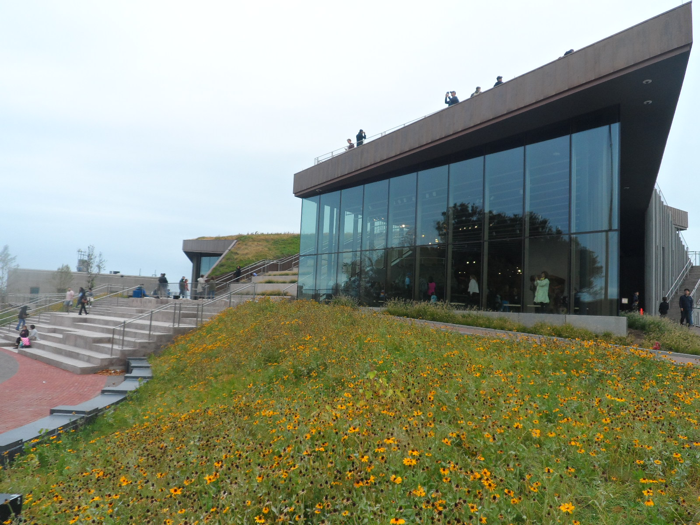
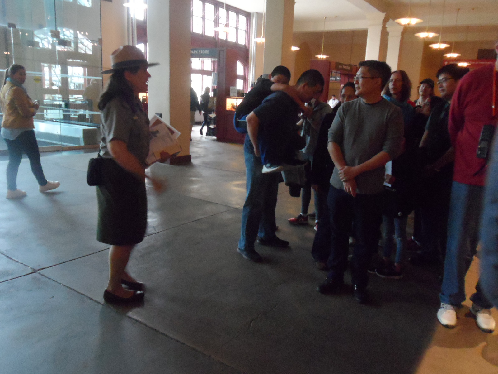
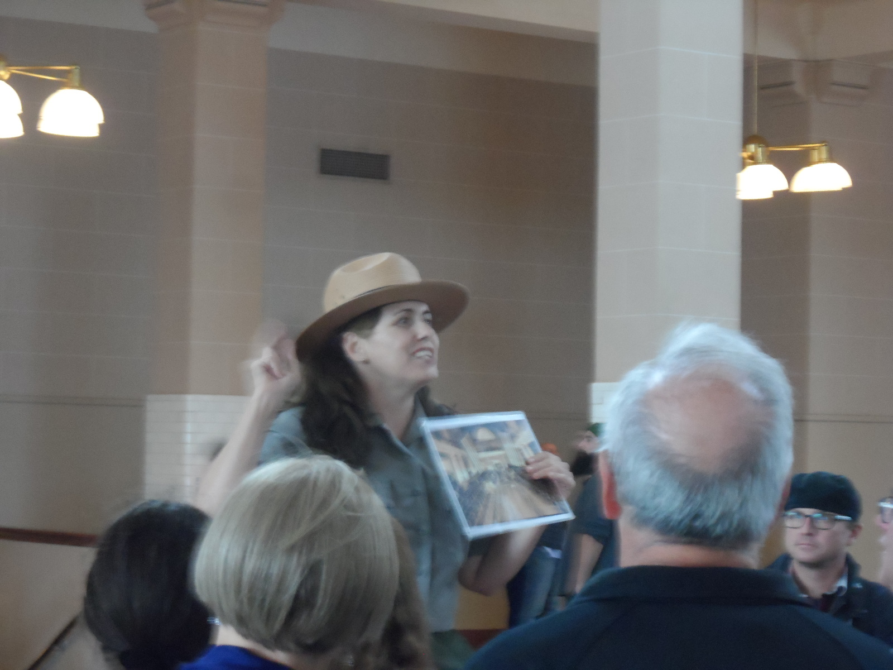

# Recap of PyGotham 2019

### A Powerful Call-to-Action

[PyGotham](https://2019.pygotham.org/), New York City's regional Python conference, took place again last October at Penn Hotel, in the heart of Manhattan. I've been fortunate to have been able to attend PyGotham every year for the past three years.

The content at PyGotham is excellent and I always find myself struggling to choose which talk to attend (fortunately, the videos are [published online](https://www.youtube.com/channel/UCTFmuFVfQA8Fl2SzKERFodQ/videos)).

But what stood out to me the most this year, was the collective call-to-action to make the tech community a place where everyone can feel a sense of belonging and thrive.

I felt this call-to-action in several ways:

In addition to open captioning, every PyGotham talk was interpeted in [American Sign Language](https://2019.pygotham.org/about/accessibility/#hearing-accessibility). 

The three keynotes, "[Python Use Spectrum](https://2019.pygotham.org/talks/keynote-the-python-use-spectrum/)" by [Kojo Idrissa](https://twitter.com/Transition), "[Accepting your successes](https://2019.pygotham.org/talks/keynote-accepting-your-successes/)" by [Piper Thunstrom](https://twitter.com/pathunstrom), and "[Because Equity: Python FTW](https://2019.pygotham.org/talks/keynote-because-equity-python-ftw/)" by [Meg Ray](https://twitter.com/teach_python), were about welcoming people on the fringes into the community and making them feel valued, for the greater good of all.

I felt inspired by a talk by [Froi Irizarry Rivera](https://twitter.com/skfroi) and [José Padilla](https://twitter.com/jpadilla_) called "[Python, Governments, and Contracts](https://2019.pygotham.org/talks/python-governments-and-contracts/)," in which they told of their feeling of helplessness as they had watched a hurricane ravage Puerto Rico and how they had spontaneously channeled their frustration into an appeal for grassroots volunteers who have now created powerful tools to root out corruption in hurricane ravaged Puerto Rico.

And during my own visit to the [Statue of Liberty](https://en.wikipedia.org/wiki/Statue_of_Liberty) and [Ellis Island](https://en.wikipedia.org/wiki/Ellis_Island), I watched Ranger Jenn re-enact the impassioned stories of people who had arrived at Ellis Island as prospective immigrants. She told of the extreme adversity many had faced to be accepted in the United States. More about that later in this blog post.

All converged into one interwoven experience that felt very fitting in such a diverse city.

### A Note About American Sign Language at PyGotham

Approximately a month before PyGotham, I attended an event at Strange Loop conference in St. Louis where a deaf woman named [Mel Chua](https://twitter.com/mchua) was a featured speaker. Mel is an electrical computer engineer with a background in FOSS, large-scale distributed engineering team collaboration, and engineering education culture. 

Mel told her story, primarily through American Sign Language. I'm embarrassed to say, this was the first time I can remember ever having seen sign language interpretation happen in real life. 

Having grown up loving math, science, and computers, Mel wanted to join the "beautiful" tech world. But she wanted to leave behind the things that made her not fit in. Cultures form in response to the people in them, she pointed out. Eventually she realized that by being her true self and becoming what tech looks like, she could make the tech community more welcoming for people like her and impact the perceptions of others.

Mel gave a call to action during her message, to see tech as one culture. "Let’s hack it together, and remake it in the image of all of us," she said.

After having heard Mel's powerful message at Strange Loop, it made me happy to see her at PyGotham, along with a group of other deaf developers, making use of the services of the American Sign Language interpreters.

[A. Jesse Jiryu Davis](https://twitter.com/jessejiryudavis) wrote "[PyGotham 2019's ASL and Live Captioning Playbook](https://emptysqua.re/blog/pygotham-2019-asl-live-captioning-playbook/)" in the hopes that it will be used to make other conferences accessible for the Deaf and hard-of-hearing.

### Friday

#### Python Use Spectrum

I was thrilled that the conference kicked off with a keynote about the "[Python Use Spectrum](https://2019.pygotham.org/talks/keynote-the-python-use-spectrum/)" by [Kojo Idrissa](https://twitter.com/Transition)!

Kojo is a [DjangoCon US](https://2019.djangocon.us/) Organizer, former [DEFNA](https://www.defna.org/) Board Member, and currently DEFNA North American Ambassador, traveling the U.S. and beyond to spread the word about DEFNA. DEFNA is the non-profit that oversees DjangoCon US (disclosure, I'm a DEFNA Board Member and DjangoCon US Website Chair). DEFNA provides small amounts of funding for Django events in North America. We also select the DjangoCon US location from year-to-year and negotiate the high-level details (DjangoCon US could come to your city... ask us how!). As a fellow organizer, Kojo extended an official "hello" and group hug to the PyGotham organizers from the DEFNA Board and DjangoCon US team. Thank you, Kojo! 

Kojo's talk was about how we, as a community, can ensure that as Python grows in use, the number of contributors and the skillset of contributors grow as well.

Photo taken by Casey Faist, used with permission

[CPython](https://github.com/python/cpython), the most popular implementation of the Python interpreter, is an open-source project developed primarily by volunteers. Burnout is a real possibility. As projects like CPython grow, they also need skills beyond coding, that are not taught in traditional CS programs. 

Kojo showed us what he calls the Python Use Spectrum. On one end of the spectrum is programmer. On the other end is software engineer. Data scientist is somewhere in the middle. 

A programmer might be working alone, using just Python to solve a problem. Perhaps he or she is a professional making a tool to improve their workplace, or a hobbyist making a video game or a website. 

On the other hand, a software engineer tends to be a member of a team, using special tools and a process to ship code professionally. The code itself is the product and might be used by other people.

Photo taken by Casey Faist, used with permission

Kojo believes that the Python community has developed a strong bias toward software engineering as the "one true way of writing code" and that this is detrimental to the community. 

In reality, everyone on the spectrum is using Python to solve problems and all are potential contributors to the Python ecosystem. One way that we can actively work to increase the number of contributors and the skill set of contributors is by embracing and valuing all members of the community, regardless of where they are on the spectrum. 

Photo taken by Casey Faist, used with permission

### Friday Talks

As a maintainer of Pinax, I find that talks I can apply to my work particularly resonate with me. There were several such talks on Friday.

[Hynek Schlawack](https://twitter.com/hynek) is a CPython Core Developer and maintainer of many open-source projects. In his talk, "[Maintaining a Python Project When It's Not Your Job](https://2019.pygotham.org/talks/maintaining-a-python-project-when-its-not-your-job/)," Hynek explained how a maintainer with limited time can publish a high quality Python package, that as much as possible leverages the contributions of others. Even though the title suggests it's for volunteer maintainers, the talk included lessons that could be useful to just about any maintainer. Hynek has made a fine science out of creating a welcoming environment for all prospective contributors, removing the fiction from the contribution process, and automating the package continuous integration and release process. This process has also been helpfully documented in an [outline on his blog](https://hynek.me/talks/python-foss/). I particularly liked that the talk went beyond a list of tips, to focus more on the psychology of motivation and time, and the tools and configurations he uses. I'd like to further study his approach and write a full blog post about it.

I found myself completely engrossed in [Mason Egger](https://twitter.com/masonegger)'s high-energy talk, "[Building Docs Like Code: Continuous Integration for Documentation](https://2019.pygotham.org/talks/building-docs-like-code-continuous-integration-for-documentation/)." Mason is a self-described "documentation fanatic" who believes that developers dislike writing code because they have to context-switch out of the code writing tools that they love in order to write docs in a workflow they don't love. Empowering developers to document within a workflow they already know and love can result in beautiful, uniform docs. Mason believes we should treat docs like code... store it in version control alongside the code it documents, write it with markup language, review and test it with the same granularity as code to ensure it is accurate and functional, and auto-publish it. Mason did a review of documentation types and tools, including [Sphinx](http://www.sphinx-doc.org/) and [MkDocs](https://www.mkdocs.org/). He also gave a case study and demo showing how he created a docs pipeline.

Going on at the same time as Mason Egger's talk was "[How I Solved my NYC Parking Problem with Python](https://2019.pygotham.org/talks/how-i-solved-my-nyc-parking-problem-with-python/)," by [Jessica Garson](https://twitter.com/jessicagarson). I was particularly interested in this talk because Jessica created a fun app to solve her own problem, something I'd like to do more of myself. Jessica lives in Brooklyn and used to have a car. Because of alternate side of the street parking restrictions, every night at 9 o'clock, she would move her car to avoid an expensive parking ticket. She was spending a lot of time looking for a new parking space, sometimes overlooking that she didn't need to, due to a holiday. So, she built an app that would let her know when she didn't need to move her car! Twice a day, a cron job runs the app. Using a Twitter Premium Search endpoint, when the words "suspended" and "tomorrow" show up in a tweet from the [NYC Alt Side Parking Twitter account](https://twitter.com/NYCASP), Twilio sends her a text message letting her know she doesn't need to re-park. Very cool! 

### Accepting Your Successes

Saturday kicked off with a keynote by [Piper Thunstrom](https://twitter.com/pathunstrom): "[Accepting your successes](https://2019.pygotham.org/talks/keynote-accepting-your-successes/)." 

Photo taken by Casey Faist, used with permission

I first heard Piper speak at PyGotham 2017 when I attended her talk "[Monkey Patching My Life- Being a Trans Python Developer](https://youtu.be/FYcwyec7HS8)." 

In Piper's own words, she's "A domestic violence survivor, a trans woman, a game developer, and a book editor that struggles with suicide ideation and loves her community."

In her keynote, Piper walked us through the difficult times in her life, and how she came out on the other side having found the Python community and achieved success.

I found it very poinant when Piper said she stands on stage vulnerable because she needed for other people to do that for her. She is reaching out to her own self of 10 or 20 years ago, "The little kid who will be going through a world of hurt." She is also doing it for her current friends who haven't reached out. 

In my opinion, her ability to be a role model and voice for other trans members of the community and victims of trauma, could be her most important form of success, and a source of healing for her.

I think Piper's own words best sum up the lessons of her talk:

"Every one of us has something to contribute to our community. If you've been around, you should look for people you don't recognize and new faces and help lift them up.

Stop treating societal expectations as success metrics: write your own success story and learn to recognize when success doesn't look like you imagine.

If you're struggling with your mental health: you're not alone. Don't be afraid to reach out to those around you."

### Python, Governments, and Contracts

On Saturday, I spent a lot of time in the "hallway track." But there was one talk I did attend that I found particularly important. It was "[Python, Governments, and Contracts](https://2019.pygotham.org/talks/python-governments-and-contracts/)," by [Froi Irizarry Rivera](https://twitter.com/skfroi) and [José Padilla](https://twitter.com/jpadilla_).

In 2017, Hurricane Maria, a category 4 storm, made landfall in Puerto Rico and devastated the island. Feeling helpless as they worried about their families back home, Froi and José decided to do something. They started the Maria Tech Brigade. In two or three weeks, through grassroots organizing, they were 300 volunteers strong.

Froi and José soon became aware of the website of the [Oficina de la Controlar de Puerto Rico](https://www.ocpr.gov.pr/). Contracts made by government entities to other government entities or contractors are published there. The Puerto Rican Power Authority has had a number of suspicious contracts over the past two years. 

Photo taken by Casey Faist, used with permission

Froi and José found that the controller website has a terrible user experience. The site data is neither open nor usable. Users have to download documents one at a time. There is no real API. The contract documents are sometimes missing. The search functionality is rudimentary. The document content is not searchable. The pagination is broken. No real insights or data visualization tools are provided.

Froi and José began to build their own tool [Contrato PRA](https://contratospr.com/) to help journalists and interested citizens investigate corruption.

The batteries included philosophy of Django and the third-party extensions in the Python and Django ecosystem enabled them to get the project up and running as quickly and cost effectively as possible. 

The project was split into two parts: a REST API built with Django REST Framework, Python, Redis, Celery, Docker, and Postgres; and a front-end, which users can access the API data through, built using a React framework called Next.

Froi and José used JSON endpoints and self-throttling to optimize data collection, without negatively affecting the controller site. In the Contrato PRA site, documents and their contents are now searchable and the data can be visualized by category.

Sadly, the work is not done, because the consequences of mismanagement and corruption are still ongoing and Puerto Rico is suffering additional natural disasters.

They intend to continue collecting the million contract documents on the website. They are considering ways to make their scraping logs and project financials transparent. They want to collect input from journalists and members of the data science community to help improve the site. They are also exploring ways to find sponsorship for the $60/month cost of running the project.

If you are interested in the project or would like to contribute, reach out to them!

### Closing Keynote

The conference closed with a keynote by [Meg Ray](https://twitter.com/teach_python): "[Because Equity: Python FTW](https://2019.pygotham.org/talks/keynote-because-equity-python-ftw/)."

Meg's keynote at PyGotham was very timely. She was recently [awarded a PSF education grant](http://pyfound.blogspot.com/2019/09/grants-awarded-for-python-in-education.html) to create an open-source, PSF landing site for Python education. Meg wants to bring together Pythonistas who are interested in education and educators interested in Python. And she's looking for contributors! Reach out to her if you are interested.

Photo taken by Casey Faist, used with permission

According to the Association for Computer Machinery report "Running on Empty in 2020," lack of access to computer science education or privileged knowledge in US K-12 schools is a significant social justice issue. 

Photo taken by Casey Faist, used with permission

Meg's talk explored ways to bring computer science education to every student.

There are a variety of obstacles that prevent students from being exposed to computer science, internal and external, physical and psychological.

Some schools are lacking the basics: reliable internet, power, technology devices, or technology device support. Some schools have made choices that affect exposure, such as restrictions on internet access or lack of the computer science courses that qualify students for college-level computer science programs. It's also difficult to find or create a curriculum that works in the classroom.

There are personal obstacles as well. Some students have visible or invisible disabilities. Others feel that they don't belong or that the subject-matter is boring.

By the time students are in high school, they tend to be either on a computer science track or not.

Speaking from her own experience, having redesigned Young Coders for PyGotham along with Barbara Shurette, as well as referencing resources such as the Gates Foundation Reboot presentation, Meg gave tips for engaging every student. 

Students need to be motivated to pursue programming. Making kids sit at computers and power through boring stuff doesn't work. When students go to stations and make take-home projects, they learn the basics, make something meaningful, and get hooked. Students also tend to retain more of the knowledge when they make something tangible.

Holistically, schools can create a longterm path for every student by offering diverse on-ramps for beginners, not one set path. A sense of belonging should be created immediately and fostered intentionally for the longterm.

Meg also gave a few tips from the "Zen of Python Education" talk she gave at PyCon. 

Photo taken by Casey Faist, used with permission

At the end of the talk, Meg gave a call to action for community members to advocate and volunteer. Ways to make a difference include: personally advocating at a state or local level for CS as a graduation requirement; professionally promoting CS education via your workplace by supporting employees in volunteering for CS education week or make events, hosting school field trips in your office, inviting high school students to shadow you for a day on take your child to work day, or recruiting a first-time intern.

### Hallway Track

As usual, the "hallway track" was yet another invaluable opportunity to network. The connections made were too numerous to list all, but here are a few highlights:

It was a pleasure to chat at length again with PSF Director [Lorena Mesa](https://twitter.com/loooorenanicole) about PSF diversity initiatives, and meet for the first time PyCon US 2019 Financial Co-chair [Jigyasa Grover](https://twitter.com/jigyasa_grover).

While mentioning to Meg Ray that perhaps there were some lessons in her talk that I could apply to my work as an open-source maintainer, we arranged for her to pick my brain about my experiences as DjangoCon Website Chair and Pinax Maintainer as she embarks on the new open-source PSF Education landing page. 

During the last few hours of PyGotham, I also serendipitiously met employees of three companies that have had a huge impact on my life, and was offered tours of the San Francisco-based headquarters of all three. Fun!

### Statue of Liberty and Ellis Island

When I attended PyGotham for the first time in 2017, it was the first time I had ever visited New York City. I had read about and seen pictures and videos of New York City all of my life, of course, but you really have to physically be in a place to understand it, in my opinion. It both was and wasn't what I had expected.

I hadn't realized ahead of time how meaningful it would be to finally experience for myself a place that is such an important part of our culture.  

When I arrived at [Penn Station](https://en.wikipedia.org/wiki/Pennsylvania_Station_(New_York_City)) in 2017, I distinctly remember emerging from the station onto bustling 7th Avenue, [Madison Square Garden](https://en.wikipedia.org/wiki/Madison_Square_Garden) behind me and [Hotel Penn](https://en.wikipedia.org/wiki/Hotel_Pennsylvania) in front of me. 

I was gobsmacked by my surroundings. Walking around the streets of New York, marveling at the landscape, I found the people to be austere in appearance, but kind. I was fascinated by the rich diversity I saw around me and the sight of people just living who they are, unapologetically. 

During that 2017 trip, I rode the [Staten Island Ferry](https://en.wikipedia.org/wiki/Staten_Island_Ferry) past the Statue of Liberty. There were so many sights on my list to see that at the time, I was satisfied with that. 

This year, I decided it was time to visit the [Statue of Liberty](https://en.wikipedia.org/wiki/Statue_of_Liberty) and [Ellis Island](https://en.wikipedia.org/wiki/Ellis_Island) for the first time. 

It's mind blowing to think that some of my own Scottish, Volga German, and Pennsylvania Dutch ancestors arriving in New York City as prospective immigrants, saw the same timeless Statue of Liberty that I did, and walked through the same hallowed halls of what is now the National Museum of Immigration on Ellis Island. 

In [Battery Park](https://en.wikipedia.org/wiki/The_Battery_(Manhattan)), I boarded the ferry and rode to [Liberty Island](https://en.wikipedia.org/wiki/Liberty_Island), home of the [Statue of Liberty](https://en.wikipedia.org/wiki/Statue_of_Liberty) and [Statue of Liberty Museum](https://en.wikipedia.org/wiki/Statue_of_Liberty_Museum).

On the island, I walked around the perimeter in front of the statue, then walked 215 steps up to the statue pedestal for a beautiful view of the Manhattan skyline and Statue of Liberty Museum. 

I then went to the Statue of Liberty Museum and saw pieces of the statue at scale, an exhibit showing how the pieces were made, and a replica of [The New Colossus](https://en.wikipedia.org/wiki/The_New_Colossus) plaque enscribed with that famous poem that begins "Give me your tired, your poor; Your huddled masses yearning to breathe free," among many other historical items. 

I then re-boarded the ferry to travel to Ellis Island, to the [National Museum of Immigration](https://www.nps.gov/elis/index.htm), where immigrants were once welcomed. 

In the Baggage Room, I joined a tour that was in process. 

Ranger Jenn gave us an impassioned depiction of what the atmosphere would have been like for new arrivals in the Baggage Room. 

We then moved onto the Registration Room. 

Standing at a registration desk, Ranger Jenn took us through a mock conversation between an official and a prospective immigrant. It was not unlike today. The officials were human life detectors, questioning the prospective immigrants, who had to answer correctly and show they were able-bodied. 

Amazingly, the green benches in the Registration Room were the same benches used when the building was in service, Ranger Jenn pointed out.

At the end of the tour, Ranger Jenn led us to the far end of the room to the "golden doors" that people passed through after being approved. 

She said to us, "May you have many golden doors in life the way Ellis Island was for them and may each of you be a golden door in this life for someone else the way this spot was for so many, personally and collectively. One third to one fourth of all Americans today can trace at least one ancestor to this little spit of land in the New York Harbor."

Remembering back to the time I spent working for U.S. Immigration, I had all the feels. 

Ranger Jenn then gave us a special viewing of the Hearing Room. 

She was keen to tell us the story of Frank Woodhull/Mary Johnson, a woman who dressed as a man, who arrived at Ellis Island in 1908 and had a hearing to determine if he/she should be allowed to enter the U.S. 

Despite having illness that could have been disqualifying, Frank Woodhull/Mary Johnson was allowed to enter the U.S. and was the only person who ever had a name change at Ellis Island.

After the tour was over, I had the chance to chat with Ranger Jenn about my time spent working for U.S. Immigration and how that experience still inspires my work today. She scribbled some thoughts down on a piece of paper, because she likes to reflect on the experiences of people she meets there, and incorporate these insights into her work. 

It was an experience of a lifetime.

### Thank You

PyGotham was yet another life-changing conference. Thank you to Conference Chair [Jon Banafato](https://twitter.com/jonafato) and all of the organizers who put so much hard work and planning into making it a wonderful event. Looking forward to next time!

Photos taken by Katherine Michel, unless other specified
