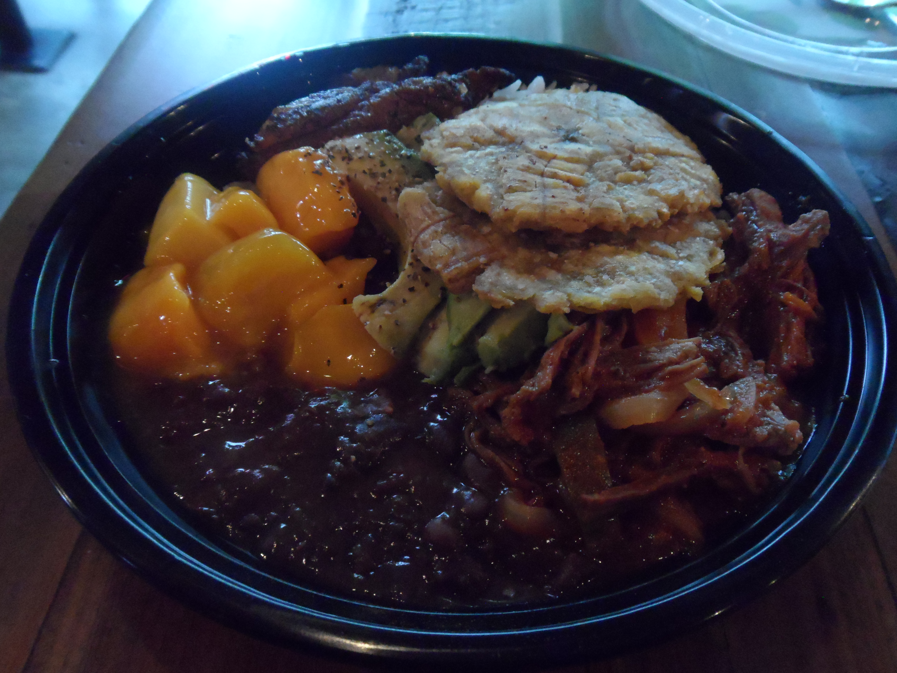
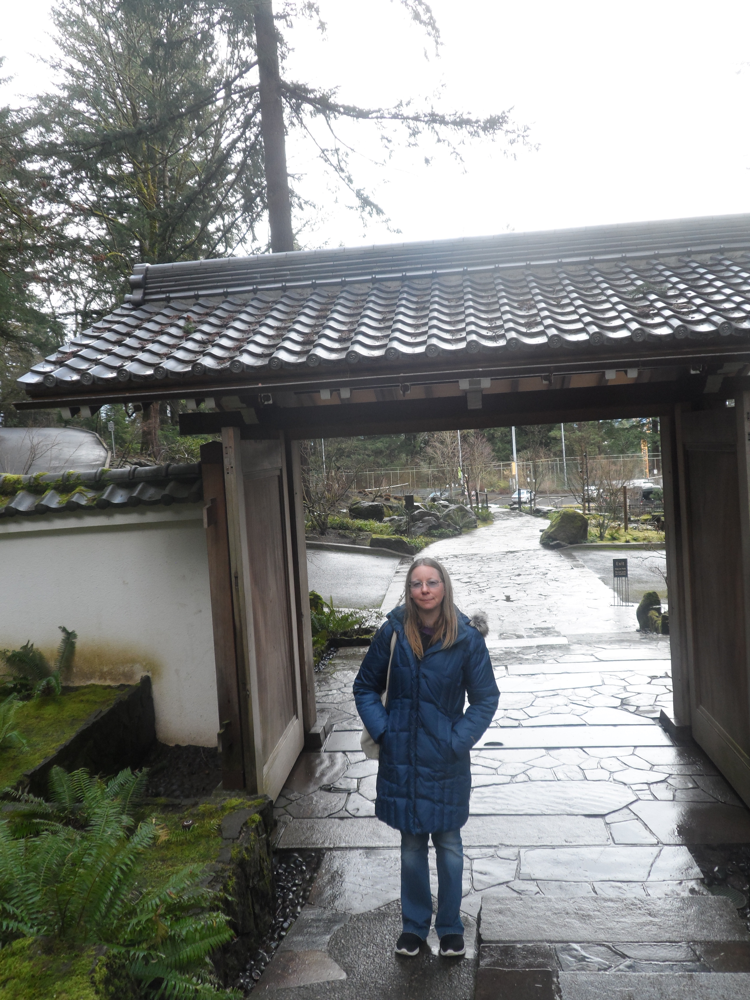

# 2020 Year in Review

Thank you to [Dawn Wages](https://twitter.com/DawnWagesSays/status/1337212013014110209) for inspiring me to do a Year in Review blog post! 

## TL;DR

This year could have been better for me, but it also could have been much worse. 

My highlights for the year have been:
* Attending PyCascades 2020 in February
* Taking part in Stanford Code in Place in April and subsequently participating in 100 Days of Code
* Completing an important Pinax release in July that was a personal and professional milestone
* Resuming public speaking in September
* Working on an amazing Wharton Business School project, Simpl game simulation framework, for the last couple of months.

Although it has been a difficult year, I've achieved some knowledge and skill "step changes" that I think have added some invaluable experience to my resume. This has helped me to cope. I can't control everything, but I can control my attitude and actions. I will give a recap of these step changes at the end of my blog post. :)

## PyCascades 2020

In early February, I attended [PyCascades 2020](https://2020.pycascades.com/) for the first time, in Portland, Oregon. At the time, there was just a handful of Covid cases in the region. For me, PyCascades will forever be a dream-like memory of normalcy and naïveté before Covid hit. 

The atmosphere at PyCascades 2020 was amazing. It was held at [Revolution Hall](https://www.revolutionhall.com/), a former high school on the east side of Portland that was renovated into an event space.

The entrance to Revolution Hall

The talks were as great as you'd expect and I enjoyed the "hallway track" too. I saw many "old" friends there and made plenty of new ones. Notably, I met a number of "famous" Python folks, too. :) 

A few memorable moments:
* Meeting [Al Sweigart](https://twitter.com/AlSweigart), one of my favorite Python authors
* Chatting with [Joanne Hastie](https://twitter.com/JoanneHastieArt) about using robots and AI to make fine art
* Getting some insight from [Moshe Zadka](https://twitter.com/moshezadka) into the success of Israeli startups
* Making a new GIS friend [Ana Leticia](https://twitter.com/AnaLeticiaGIS)
* Meeting [Scott Shawcroft](https://twitter.com/tannewt) (CircuitPython project lead), [David Lord](https://twitter.com/davidism) (Flask maintainer), and [Timothy Crosley](https://twitter.com/timothycrosley) (isort author)

One of the highlights of the conference was eating dinner with [Guido van Rossum](https://en.wikipedia.org/wiki/Guido_van_Rossum), the original author of Python, and friends at [Grassa](https://www.grassapdx.com/), a "handcrafted pasta" restaurant. Guido told us some stories from the early days of Python. It was quite an evening. 

Dinner with Guido (he's the one waving!)... what fun; photo credit: Jonan Scheffler, used with permission

While I was in Portland, I also enjoyed Cuban food at [Cubo](https://www.cuboportland.com/), Lebanese and Mediterranean food at [Nicholas Restaurant](http://nicholasrestaurant.com/), and Mexican food at [La Morenita](https://www.facebook.com/La-morenita-mexican-food-687319458053736/) food truck. All of the food was super delicious and I'd love to go back and eat it again! :) 

Ropita at Cubo: shredded beef brisket stewed with tomato, vegetables and traditional Cuban spices, served with white rice, black beans, mango, avocado, maduros and tostone

Chicken Kabob Lunch Bowl at Nicholas Restaurant: chicken breast marinated in olive oil, garlic, yogurt, paprika, and lemon, served with tzatziki and toum, saffron jasmine rice, and cabbage garbanzo salad; not pictured: yummy hummus and warm pita bread

Morenita Burrito at La Morenita Food Truck: steak, chile relleno, beans, cheese, lettuce, pico de gallo, and guacamole in a flour tortilla

I enjoyed a birdseye view of Portland while riding the [Portland Aerial Tram](https://www.ohsu.edu/visit/tram) and visited the picturesque [Portland Japanese Garden](https://japanesegarden.org/).

The view from the Portland Aerial Tram upper platform

Me at the Portland Japanese Garden... a kind stranger saw me taking photos and offered to take mine

The iconic Moon Bridge at the Portland Japanese Garden... breathtaking

The iconic Heavenly Falls at the Portland Japanese Garden... wow!

From the moment I arrived in Portland, it came across as a relaxed city full of very nice people. For instance, I was pleasantly taken aback one morning, while walking down the sidewalk, when a stranger kindly said "good morning" to me. That's something I might expect in small town Kansas, not in a city as big as Portland. I loved the food truck culture. And the city itself was quirky and beautiful. It's a potentially triggering subject, but I feel it would be remiss to not acknowledge that a KKK rally took place in the downtown during one of the conference days. During the trip, as I learned more about Oregon's history of racism, I found it to be very disturbing and a reminder of the complexities in our past and, unfortunately, present.

I've enjoyed having the opportunity to attend a few online conferences and meetups, especially ones I wouldn't normally be able to attend, but nothing takes the place of an in-person event full of interesting people in a city that you'd love to get to know better.

## Stanford Code in Place and 100 Days of Code

In late March, while I was looking through my Twitter news feed, I came across a [tweet](https://twitter.com/chrispiech/status/1244692768431038473) about a one-time [Python](https://www.python.org/) programming course called Stanford Code in Place. 

[Mehran Sahami](http://robotics.stanford.edu/users/sahami/bio.html) and [Chris Piech](https://stanford.edu/~cpiech/bio/index.html) teach Stanford's introductory Python course CS106A. Because of shelter-in-place, they decided to open the course to the public. They would teach the traditional CS106A version and public Code in Place version simultaneously.

I applied and was chosen to participate. Although I was much more familiar with Python than some of the other participants, I used it as an opportunity to reinforce concepts and kickstart making some new fun and practical apps from scratch. Although my "section" had a dedicated leader, I was also able to provide some informal mentoring to other members of the group.

I won't write much about my Stanford Code in Place experience here, because you can read about it in my [Reflections on Stanford Code in Place](https://github.com/KatherineMichel/portfolio/blob/master/regular-blog-posts/reflections-on-stanford-code-in-place.md) blog post. It was a fun and unique experience and I think I got a lot out of it, including making [Simba Friends Twitter Bot](https://github.com/KatherineMichel/stanford-code-in-place-final-project).

After Stanford Code in Place ended, I decided to keep the momentum of making apps going by participating in 100 Days of Code. The highlight has been completing several small projects and writing about the process I went through and what I learned. 

A few of my favorite 100 Days of Code project blog posts from this year: 
* [Building a Taco John's Scraper Blog Post](https://github.com/KatherineMichel/portfolio/blob/master/regular-blog-posts/building-a-taco-johns-scraper.md)
* [TIL- 100 Days of Code Version Blog Post](https://github.com/KatherineMichel/portfolio/blob/master/regular-blog-posts/til-100-days-of-code-version.md) and [GitHub Repo](https://github.com/KatherineMichel/til-100-days-of-code-version/)
* [Hacktoberfest PRs- 2020 Blog Post](https://github.com/KatherineMichel/portfolio/blob/master/regular-blog-posts/hacktoberfest-prs-2020.md)

## Pinax Release

In July, I oversaw the completion of an important [Pinax](https://github.com/pinax/) release. It was a huge milestone for me, personally and professionally. Not only did I initiate the release, but I managed the end-to-end process. I created the release plan, oversaw the work of others, updated 10 apps myself, merged all of the PRs, and tagged and published the packages. I really took the bull by the horns and learned a lot in the process, I'm happy to say. :)

It was no small task, though. Many of the original Pinax authors were Django core devs and it shows. Pinax is a large and complex library of open-source, professional quality, interdependent Django projects and apps, including sophisticated testing, packaging, and continuous integration configurations. The Pinax GitHub organization alone has around 80 repos.

One of my goals for this release was to make it easier for people to get started contributing to Pinax. I began by creating a detailed [Pinax 20.XX Release Plan](https://github.com/pinax/pinax/wiki/Pinax-20.XX-Release-Plan) that put into writing for the first time, the Pinax "way of doing things." I was thrilled that contributors were able to use this documentation to complete a large portion of the work, with occasional support from me. 

Notably, in this release, support was dropped for Python 2.7, and support was added for Python 3.6+ and Django 3.0.

A number of people contributed to the release in many different and important ways, but I couldn't have finished the release without the generous contribution of [Mfon Eti-mfon](https://twitter.com/mfonism). 

As a first time contributor, Mfon provided expertise in dropping Python 2 support, dropped and added support for Python and Django versions in 14 apps, including Django User Accounts, and created a script to automate the addition of contributors to the AUTHORS files. He also reviewed all of the code changes with me, to ensure that the best choices were made. I'm so grateful for the contributions that he made to the Pinax release and I'm thrilled that he was recently elected to the [Django Software Foundation Board](https://www.djangoproject.com/weblog/2020/dec/10/2021-dsf-board-election-results/).

### Release Highlights

Contributors, issues, and PRs since the previous release: 
* Dozens of contributors opened issues, submitted PRs, and provided support
* Over 160 issues were closed
* Over 100 PRs were merged
* Over 30 PRs were closed

Release overview:
* Around 28 Pinax apps were included
* Support was dropped for Django 1.11, 2.0, and 2.1, and Python 2,7, 3.4, and 3.5 
* Support was added for Django 2.2 and 3.0, and Python 3.6, 3.7, and 3.8
* Version testing, continuous integration, and packaging configurations were updated

Documentation and discoverability:
* The Pinax release and maintainer processes were extensively documented for the first time
* The number of files in repos was reduced and configurations standardized across repos in order to make repos more approachable and more easily documented
* Community documents were created or revised if out-of-date, and moved to central locations

Community:
* A new Community Plan created a strategy to make it easier for users and contributors to get started
* A new "Important Links" section at the top of each README.md will help people find what they need

## Public Speaking

In 2017, I became an open source maintainer for the first time, then created a talk about what I'd learned about using Git and GitHub for collaboration and code review. I gave the talk at DjangoCon US 2017 (my first ever conference and talk!), PyLadies Remote, and at a DevICT Hacktoberfest meetup. 

Me on stage giving my talk at DjangoCon US 2017, my first ever conference and talk

In September, a PyLadies Southwest Florida organizer came across the talk and asked me to give the talk virtually to an audience that would consist of members of PyLadies Southwest Florida, PyLadies Miami, SWFL Coders, SWFL Data, and FGCU SEC Meetup.

I was delighted to be asked to do it.

I had the choice to give the talk a week and a half later, or a month or more in the future. After some thought, I decided to give the talk in a week and a half. I knew that the talk would not be "better" in a month or more. Putting the talk off would just give me the opportunity to prolong any fear I might have of giving my first virtual talk to an audience of this size. Doing this kind of thing isn't easy, but it's satisfying to face my fear head on.

With Hacktoberfest beginning only a few days later, the timing of my talk could not have been better. I spent some time updating the talk to incorporate some things I had learned since 2017. You can see a copy of the slides and script in the [talk repo](https://github.com/KatherineMichel/get-a-jumpstart-on-collaboration-and-code-review-in-github-pyladies-southwest-florida).

I was extremely happy with how the talk went. The audience was fairly large for a local meetup... around 50 people had signed up to attend.

My presentation lasted for around 45 minutes, followed by questions. I was really at ease and it went very well. There were a lot of positive comments and they would like for me to return sometime.

At that time, I also got some good news about a talk proposal I had submitted to the PyCon US 2020 Maintainers Summit, which was cancelled. My talk proposal, entitled "[Bringing Pinax Back to Life](https://github.com/KatherineMichel/portfolio/blob/master/talk-proposals/pycon-us-2020-maintainers-summit.md)", had been accepted and was thought to be "excellent." Perhaps I will have the opportunity to give that talk in the future, which I would absolutely love to do. :)

## The Wharton School and Simpl

For the last couple of months, I've been working on a project for The Wharton School at the University of Pennsylvania. 

I'm a Technical Writer and Advisor for an open-source game simulation framework known as [Simpl](https://simpl.world/).

Built using Python, Django, and React, and hosted on [GitHub](https://github.com/simplworld/), Simpl has the potential to democratize game simulation access everywhere.

It's a pretty amazing initiative and I'm thrilled to be taking part.

I'm excited to watch the future of it unfold in classrooms and beyond.

## Step Changes Recap

Like I said at the beginning of this post, during this difficult year, I've achieved some knowledge and skill "step changes" that I think have added some invaluable experience to my resume. This is a work in progress. :)

My step changes have fallen under a few different categories:
* Doing things that seem scary (and they often turn out to be not that scary, actually)
* Combining skills that I'm already good at with skills that are more difficult for me, to reach new heights
* Completing projects, then writing about what I learned or achieved
* Learning from the experts around me and producing higher quality work as a result
* Doing a better job of recording information for my portfolio, resume, and doing career-related research

My major step changes this year:
* Gaining technical writing and product/market experience while working for Wharton School's Simpl game simulation project
* Initiated and oversaw an important Pinax release, managing the end-to-end process for the first time
* Kickstarted by Stanford Code in Place, spent more time making fun and useful apps and teaching others how to do it
* Wrote a number of blog posts about my projects, conferences I attended, and other learning experiences
* Gave a virtual talk to a fairly sizeable meetup audience and had another talk accepted
* Had several experts review my resume and am revising it accordingly
* Did pay rate research and sought pay rate advice from experts
* Used my people skills more, including reaching out to my connections for help more often
