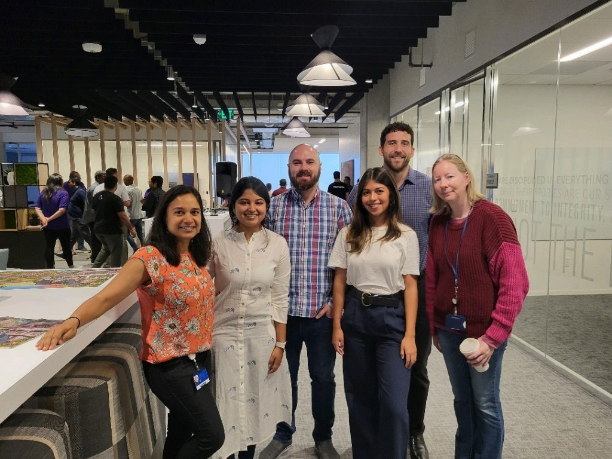

# 2024 Year in Review

<!--
Led sprint review and demo
Sprint retro
Sprint planning
Demos

Multi-tenancy
Switched teams
Work highlights- significantly reduced time, n+1
CockroachDB, dashboard, database optimization
Profiling tools
Django optimization

Cluster creation
Databus
pub/sub

Task orchestration and distributed systems engineering

Grew in capability- things once more difficult for me became day-to-day tasks
Challenges of scale and security were good for me
Working across teams, learning and sharing knowledge

PR Review
Change Management, Release management
Working with SRE
Worked with lead architect
Architecture and design, tradeoffs, cost analysis
Security, resiliency, failover, restore
Product management, roadmap
User experience

PS Connect continues
Sick 3 times
March 8
Even as it improved, it continued... 
Feel lucky to be well
Gave me an appreciation

January
https://katherinemichel.github.io/portfolio/los-angeles-2023.html
Top videos

DEFNA Contract meeting
DEFNA Hotel Contract Committee

DjangoCon US 2023 Recap 
https://katherinemichel.github.io/portfolio/2023-recap.html
https://django-news.com/issues/203#start
Featured in Django News Newsletter- was their top link for months. 
Get stats- how long at the top and how many views

March 3
https://katherinemichel.github.io/portfolio/djangocon-us-2024-topics-inspiration-list.html
Featured in Django News Newsletter along with Drew's
https://django-news.com/issues/222#start
Stats?
Along with lists by Drew and Jeff?
Talk submission stats
2024: 194
2023: 189
2022: 152

March- provided pics that helped inspire DjangoCon US website design theme
https://www.linkedin.com/posts/jonitrythall_ive-teamed-up-with-the-great-folks-at-defna-activity-7203812944940294144-6gtJ/?utm_source=share&utm_medium=member_desktop
https://fosstodon.org/@kati/112492859988088102

March- created the conference snapshot pages I'd always wanted. 
https://katherinemichel.github.io/portfolio/speaker-board-and-organizer-photos.html
https://katherinemichel.github.io/portfolio/favorite-conference-snapshots.html

March
Uncle Edward died
Smile on his face
https://www.livingstonfh.com/obituary/edward-a-markel
https://www.linkedin.com/posts/katherinemichel_obituary-for-edward-a-ed-markel-at-livingston-activity-7180368920564916225-eXsL/
https://www.linkedin.com/posts/katherinemichel_life-isnt-always-easy-but-consider-me-blessed-activity-7133546031077588992-gadV/
Bird call video

Tanganyka
https://twpark.com/
https://www.linkedin.com/posts/katherinemichel_as-a-defna-board-member-i-help-oversee-djangocon-activity-7182562538193125376-6_EG/
Visit to Lemurs- pics

April
PyTexas 2024 in Austin
Moshe
DEFNA Board Interviews

May
May the 4th Event
Featured on DjangoCon US account
Along with who else?
https://x.com/djangocon/status/1792933457183527350
https://fosstodon.org/@djangocon/112479673098056641

Worthmore session: Networking as a Woman: How to become 2.5x more successful

Databases connections

May
PyCon US 2024

Felt I was able to further grow my network and have a deeper understanding of subjects

Followed up on PyCon US connections
Facilitated communication from Jay at PyCon US to DEFNA
PyTexas sponsorship

https://katherinemichel.github.io/portfolio/pycon-us-2024-recap.html
Reached #2 on Hacker News
https://x.com/search?q=https%3A%2F%2Fnews.ycombinator.com%2Fitem%3Fid%3D40552621&src=typed_query
https://x.com/nmstoker/status/1797250668501020962
https://news.ycombinator.com/item?id=40552621
https://fosstodon.org/@HackerNewsBot@m.einverne.info/112547856756286972
https://fosstodon.org/@hn50@social.lansky.name/112547268058241519
https://fosstodon.org/@kati/112547155288841309
https://fosstodon.org/@kati/112542746775054876
https://fosstodon.org/@kati/112542145378019538
https://fosstodon.org/@kati/112509391686025715
https://fosstodon.org/@kati/112498755031272596
Kudos from Kenneth, Trey, Seth, Hugo, Lacey, etc. 
https://fosstodon.org/@lacey@hachyderm.io/112553623603409800
Many DMs
Screenshot
Cited by new Python Release Manager Hugo as must-read conference recap
https://dev.to/hugovk/pycon-us-2024-a-roundup-of-writeups-26hj
https://fosstodon.org/@kati/112612110567916246
Featured in Django News Newsletter
https://django-news.com/issues/236#start
Get stats

June
Attended DFW Pythoneers
https://www.meetup.com/dfwpython/

PyTexas Sponsorship pitch

June
Created PyCon US 2024 Recap presentation based on my blog post

September
DjangoCon US 2024

Self care
New keyboard
Gym, lifting weights
Inspired by DeAnna Troutman Anaya- grandmother (she doesn't look like any grandmother I've ever seen) who is "Liftin4Life"
Tell her story of illness to health
I'd never been in a gym before and was afraid to go
Sheldon- told me the benefits of a personal trainer

Update on how I did
Not as much as expected due to issues in first half of year
Picked up in second half of year
https://katherinemichel.github.io/portfolio/what-i-am-paying-attention-to-in-2024.html
-->
