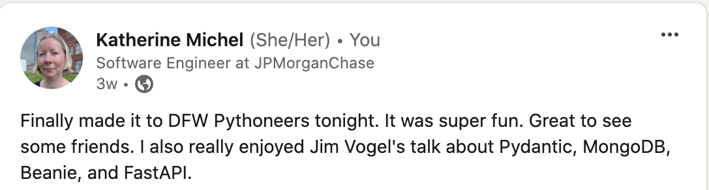

# 2024 Year in Review

<!--
Gifts for nieces
Trying to be better aunt

It takes time to build things. One thing at at time. 

Charnise

https://fosstodon.org/@kati/112283408437442848
https://www-cnbc-com.cdn.ampproject.org/c/s/www.cnbc.com/amp/2024/04/16/the-best-us-companies-to-work-for-in-2024-according-to-linkedin.html
https://www.linkedin.com/pulse/linkedin-top-companies-2024-50-best-large-workplaces-grow-hmgye%2F/

Led sprint review and demo
Sprint retro
Sprint planning
Demos

Multi-tenancy
Switched teams
Work highlights- significantly reduced time, n+1
CockroachDB, dashboard, database optimization
Profiling tools
Django optimization

Database learning, on the job, at PyCon US during personal conversations and sponsor booths, during Global Hackathon conversations

Cluster creation
Databus
pub/sub

Task orchestration and distributed systems engineering

Grew in capability- things once more difficult for me became day-to-day tasks
Challenges of scale and security were good for me
Working across teams, learning and sharing knowledge

PR Review
Change Management, Release management
Working with SRE
Worked with lead architect
Architecture and design, tradeoffs, cost analysis
Security, resiliency, failover, restore
Product management, roadmap
User experience

PS Connect continues
Sick 3 times
March 8
Even as it improved, it continued... 
Feel lucky to be well
Gave me an appreciation

January
DEFNA Contract meeting
DEFNA Hotel Contract Committee

DjangoCon US 2023 Recap was Django News Newsletter top link for months. 
Get stats- how long at the top and how many views

March 3
Featured in Django News Newsletter along with Drew's (and Jeff's?)
Stats?

I was particularly excited to see my list be posted by the DSF account and Vicky, an expert in the open source community. 
https://fosstodon.org/@djangocon/112056987398023068

https://www.linkedin.com/posts/jonitrythall_ive-teamed-up-with-the-great-folks-at-defna-activity-7203812944940294144-6gtJ/?utm_source=share&utm_medium=member_desktop
https://fosstodon.org/@kati/112492859988088102

Conference snapshost
https://fosstodon.org/@kati/112026892390626620

https://www.linkedin.com/posts/katherinemichel_obituary-for-edward-a-ed-markel-at-livingston-activity-7180368920564916225-eXsL/
https://www.linkedin.com/posts/katherinemichel_life-isnt-always-easy-but-consider-me-blessed-activity-7133546031077588992-gadV/

https://www.linkedin.com/posts/katherinemichel_as-a-defna-board-member-i-help-oversee-djangocon-activity-7182562538193125376-6_EG/

April
DEFNA Board Interviews

May
May the 4th Event

Worthmore session: Networking as a Woman: How to become 2.5x more successful

Databases connections

May
Felt I was able to further grow my network and have a deeper understanding of subjects
Followed up on PyCon US connections
Do more "heavy lifting"
Facilitated communication from Jay at PyCon US to DEFNA
PyTexas sponsorship

https://x.com/search?q=https%3A%2F%2Fnews.ycombinator.com%2Fitem%3Fid%3D40552621&src=typed_query
Who is N. M. Stoker
https://x.com/nmstoker/status/1797250668501020962
https://fosstodon.org/@HackerNewsBot@m.einverne.info/112547856756286972
https://fosstodon.org/@hn50@social.lansky.name/112547268058241519
https://fosstodon.org/@kati/112547155288841309
https://fosstodon.org/@kati/112542746775054876
https://fosstodon.org/@kati/112542145378019538
https://fosstodon.org/@kati/112509391686025715
https://fosstodon.org/@kati/112498755031272596
Many DMs
https://fosstodon.org/@kati/112612110567916246
Get Django News Newsletter stats

June
PyTexas Sponsorship pitch
-->

You can read my [2023 Recap](https://katherinemichel.github.io/portfolio/2023-recap.html) here. 

## January 

### Los Angeles 2023 Trip Recap

The dream Los Angeles trip that I took in early December 2023 turned into a [dream recap](https://katherinemichel.github.io/portfolio/los-angeles-2023.html) filled with my favorite stories, photos, and videos. 

<!--
Top videos
-->

### Kinesis Advantage360

<!--
Self care
New keyboard
Kinesis Advantage360 Split Ergonomic Keyboard
-->

### DjangoCon US 2023 Recap

<!--
https://katherinemichel.github.io/portfolio/djangocon-us-2023-recap.html
Featured in Django News Newsletter
https://django-news.com/issues/203#start
-->

## March

### DjangoCon US Talk Topics Inspiration List

Every year, Jeff Triplett publishes a list of talk topics he'd like to learn more about at DjangoCon US. He also encourages fellow DEFNA Board Members to publish their own. 

Last year, I finally got organized and created a [Talk Topics Inspiration List for DjangoCon US 2023](https://katherinemichel.github.io/portfolio/djangocon-us-2023-recap.html). This year, I created a [Talk Topics List for DjangoCon US 2024](https://katherinemichel.github.io/portfolio/djangocon-us-2024-topics-inspiration-list.html). 

Our talk submission stats since I began publishing my list: 
* 2022: 152
* 2023: 189
* 2024: 194

Given the popularity of my articles among the Python/Django community, I'm confident that my list played a major role in the increase in submissions. I am really proud of that! 

My list was featured in [Django News Newsletter](https://django-news.com/issues/222#start), along with [Jeff's list](https://micro.webology.dev/2024/04/28/djangocon-us-talks.html) and DjangoCon US Program Chair [Drew Winstel's List](https://winstel.dev/2024/03/01/talk-ideas-for-dcus-24/). 

### DjangoCon US Website Design

As a DEFNA Board Member, I help oversee DjangoCon US, including the website design. I am also an avid photographer. 

During DjangoCon US 2023, I walked around downtown Durham and took some photos of the quirky artwork there. 

Snapshots I took in downtown Durham

During the always-fun website design iteration process, I shared these photos with the website team. I am super excited that my photos helped inspire this year's theme. The website design makes me smile, and I hope it makes you smile too! 

A shoutout from our amazing designer Joni Trythall of YupGup!

### Conference Snapshots

After years of intending to do it, I created a page of my [favorite conference snapshots](https://katherinemichel.github.io/portfolio/favorite-conference-snapshots.html) and the stories behind them, as well as a page of [speaker, board, and organizer photos](https://katherinemichel.github.io/portfolio/speaker-board-and-organizer-photos.html). 

### Death in the Family

Uncle Edward and Aunt Judy were truly larger than life. It was hard to believe that they'd ever be gone. 

[Aunt Judy died](https://www.livingstonfh.com/obituary/judith-k-markel) of pancreatic cancer on April 15, 2022. My uncle's life was not so easy after that. He missed his Judy. 

Sadly, on March 29 of this year, he passed away. He died peacefully, and I am comforted by the fact that he had a smile on his face. 

You can learn more about him in his [obituary](https://www.livingstonfh.com/obituary/edward-a-markel) or the replay of his funeral. He was one-of-a-kind. 

Amazingly, my mom, his sister, provided the funeral music. 

My Uncle Edward was an avid hunter. My cousin Andrea Markel Hastings organized one last duck call for him at the cemetery by a few of his fellow hunting buddies. There's something in my eye.

<!--
My cousin pointed out that the roses were one of my uncle's favorite colors.

I think you are taking after me. 

Funeral replay video
Bird call video

https://x.com/KatiMichel/status/1727781095322562783

Flowers
https://www.facebook.com/katherine.michel.5/posts/pfbid02RbmuKTnP2kayN7QfovAG78aXT9SpbEno6wSxQPbgVNhtbEbZBZXJSPY3Q7BbSpcal
Reflection
https://www.facebook.com/katherine.michel.5/posts/pfbid0kBMQMeHtXLUCN2A8epG3xvryEXztyGQD8CXN9vfWZjWkso6oeZhvX5wW1ZZyiM5jl
-->

### Eclipse

On my way back to Plano after my uncle's funeral, I got stuck in eclipse travel. I arrived back in Plano in time for the eclipse, but hadn't had time to plan. Fortunately, JPMorganChase had me covered. Eclipse glasses were handed out around campus, and we convened outside for a watch party. It's hard to put into words what it was like to watch the eclipse with what must have been thousands of co-workers. At the moment of eclipse, as Total Eclipse of the Heart played on the loudspeaker, a cheer went up across the crowd. 

<!--
Photos
You can see it in the video
-->

## April

### Lemurs at Tanganyka Wildlife Park

Because our DjangoCon US host city Durham, North Carolina has the largest population of lemurs outside of Madagascar, we featured a "friendly" lemur on our website last year. 

A friendly lemur with a smile on its face

After years of hearing about [Tanganyika Wildlife Park](https://twpark.com/) in Goddard, Kansas, mom and I decided to go. I had no idea until I got there that you can feed lemurs. They were so soft and gentle. I loved spending time with these real-life, friendly lemurs!

Mom, me, and the lemurs!

Me feeding a lemur a craisin out of the palm of my hand!

<!--
Mom turning the tables on me at Tanganyka
https://www.facebook.com/katherine.michel.5/posts/pfbid034rPSj3TbthnpHvnrfiVS9uFJrXnStHxvoLbuG7zx69WbXdtLMybH3W8MibMhUpuol
-->

### PyTexas

[PyTexas 2024](https://www.pytexas.org/2024/) took place in Austin, Texas from April 19-21. 

<!--
Moshe
-->

## May

<!--
https://fosstodon.org/@kati/112380066353516377

Gym, lifting weights
Inspired by DeAnna Troutman Anaya- grandmother (she doesn't look like any grandmother I've ever seen) who is "Liftin4Life"
Tell her story of illness to health
I'd never been in a gym before and was afraid to go
Sheldon- told me the benefits of a personal trainer
-->

### DjangoCon US Featured Post

<!--
Featured on DjangoCon US account
Drew Winstel, Tim Schilling, Natalia Bidart, Kojo
https://x.com/djangocon/status/1792933457183527350
https://fosstodon.org/@djangocon/112479673098056641
-->

### PyCon US 2024

## June

### Hacker News

<!--
Kudos from Kenneth, Trey, Seth etc. 
https://katherinemichel.github.io/portfolio/pycon-us-2024-recap.html
Reached #2 on Hacker News
https://news.ycombinator.com/item?id=40552621
Cited by new Python Release Manager Hugo as must-read conference recap
https://dev.to/hugovk/pycon-us-2024-a-roundup-of-writeups-26hj
Featured in Django News Newsletter
https://django-news.com/issues/236#start
Thank you to the incredible Lacey for this sweet kudo: https://fosstodon.org/@lacey@hachyderm.io/112553623603409800
-->

<!--
### DFW Pythoneers

Attended DFW Pythoneers
https://www.meetup.com/dfwpython/

-->

### Innovation Week Global Hackathon 

<!--
Innovation Week
Databases
-->

## July

### PyCon US 2024 Presentation

<!--
Created PyCon US 2024 Recap presentation based on my blog post
What I learned from PS Connect
Python Guild
Coincide with release of videos on youtube
Dovetail nicely into PyLadies event
If you are interested...
Also, read the Language Summit articles for the first time and was able to grok the content
-->

## August

## September

### DjangoCon US

## October

## November

## December

## Self-Care

<!--
Update on how I did
Not as much as expected due to issues in first half of year
Picked up in second half of year
https://katherinemichel.github.io/portfolio/what-i-am-paying-attention-to-in-2024.html
-->
## Parting Thoughts

Thank you to each and everyone one of you, and there are many, who made my year special.

These are the "good old days." Live your best life. 

<!--
Simple things poster
-->
