# 2024 Recap

Table of Contents
-----------------

- [This Year's Theme](#this-year-s-theme)
- [Work](#work)
- [January](#january)
    - [Los Angeles 2023 Trip Recap](#los-angeles-2023-trip-recap)
    - [Kinesis Advantage360](#kinesis-advantage360)
    - [DjangoCon US 2023 Recap Popularity](#djangocon-us-2023-recap-popularity)
- [February](#february)
    - [Spring Fun for My Nieces](#spring-fun-for-my-nieces)
    - [CFP Connect](#cfp-connect)
- [March](#march)
    - [DjangoCon US Talk Topics Inspiration List](#djangocon-us-talk-topics-inspiration-list)
    - [DjangoCon US Website Design](#djangocon-us-website-design)
    - [Conference Snapshots](#conference-snapshots)
    - [Family Tragedy](#family-tragedy)
- [April](#april)
    - [Lemurs at Tanganyka Wildlife Park](#lemurs-at-tanganyka-wildlife-park)
    - [JPMorganChase Eclipse Watch Party](#jpmorganchase-eclipse-watch-party)
    - [PyTexas 2024](#pytexas-2024)
    - [Austin Sightseeing](#austin-sightseeing)
        - [Franklin's Barbecue](#franklin-s-barbecue)
        - [Downtown Austin](#downtown-austin)
        - [Lyndon B. Johnson Presidential Library](#lyndon-b-johnson-presidential-library)
        - [Bruce Springsteen Foundation Exhibit](#bruce-springsteen-foundation-exhibit)
        - [Austin Central Library](#austin-central-library)
- [May](#may)
    - [Gym](#gym)
    - [DjangoCon US Featured Post](#djangocon-us-featured-post)
    - [PyCon US 2024](#pycon-us-2024)
- [June](#june)
    - [PyCon US 2024 Recap and Hacker News](#pycon-us-2024-recap-and-hacker-news)
    - [DFW Pythoneers](#dfw-pythoneers)
    - [Summer Fun for My Nieces](#summer-fun-for-my-nieces)
    - [Innovation Week Global Hackathon ](#innovation-week-global-hackathon)
- [July](#july)
    - [Wellness Screening](#wellness-screening)
- [August](#august)
    - [CFP Connect Panel](#cfp-connect-panel)
    - [Financial Advisor](#financial-advisor)
- [September](#september)
    - [Preventative Care](#preventative-care)
    - [More Good Luck](#more-good-luck)
    - [DjangoCon US 2024](#djangocon-us-2024)
- [October](#october)
    - [CFP Connect and Mo](#cfp-connect-and-mo)
    - [CockroachDB Day](#cockroachdb-day)
    - [Sightseeing in Dallas](#sightseeing-in-dallas)
        - [Dallas World Aquarium](#dallas-world-aquarium)
        - [Sixth Floor Museum](#sixth-floor-museum)
        - [Terry Black's Barbecue](#terry-black-s-barbecue)
        - [JPMorganChase Dallas Zoo Employee Night](#jpmorganchase-dallas-zoo-employee-night)
    - [Cookbook](#cookbook)
    - [Winter Fun for My Nieces](#winter-fun-for-my-nieces)
    - [DjangoCon US 2025 Venue Selection](#djangocon-us-2025-venue-selection)
- [November](#november)
    - [JPMorganChase PowerUp Conference Presentation](#jpmorganchase-powerup-conference-presentation)
    - [JPMorganChase Advent of Code Leadership](#jpmorganchase-advent-of-code-leadership)
    - [JPMorganChase DjangoCon US Recap Presentation](#jpmorganchase-djangocon-us-recap-presentation)
    - [Epson FastFoto FF-680W Scanner](#epson-fastfoto-ff-680w-scanner)
    - [Carriage Crossing](#carriage-crossing)
    - [Two Year Work Anniversary](#two-year-work-anniversary)
    - [New Furnishings](#new-furnishings)
- [December](#december)
- [Parting Thoughts](#parting-thoughts)
- [More Favorite Snapshots Throughout The Year](#more-favorite-snapshots-throughout-the-year)
    - [Dallas Love Field Airport](#dallas-love-field-airport)
    - [JPMorganChase Plano Chinese Lunar New Year Celebration](#jpmorganchase-plano-chinese-lunar-new-year-celebration)
    - [Tanganyka Wildlife Park](#tanganyka-wildlife-park)
    - [Austin](#austin)
    - [Clouds](#clouds)
    - [McClaren Sports Cars](#mcclaren-sports-cars)
    - [Yoshi Shabu Shabu](#yoshi-shabu-shabu)
    - [T Swirl Japanese Crepe](#t-swirl-japanese-crepe)
    - [Luci's Bakery](#luci-s-bakery)
    - [Darna Mediterranean Eatery](#darna-mediterranean-eatery)
    - [Employee Appreciation Week](#employee-appreciation-week)
    - [Diwali](#diwali)
    - [Dallas World Aquarium Animals](#dallas-world-aquarium-animals)
    - [Terry Black's Barbecue Pit](#terry-black-s-barbecue-pit)
    - [Dallas Zoo](#dallas-zoo)
    - [Yoshi Shabu Shabu September](#yoshi-shabu-shabu-september)
    - [JPMorganChase Plano](#jpmorganchase-plano)

Disclaimer: the content of this post is a reflection of my life journey and not specific to my work at JPMorganChase.

You can read my [2023 Recap](https://katherinemichel.github.io/portfolio/2023-recap.html) here. 

## This Year's Theme

While writing this recap, I found myself thinking the words, "I finally got organized and" a number of times. I felt a sense of cumulative momentum this year that came from building on prior knowledge and experience. 

[**back to top**](#table-of-contents)

## Work

I continued as a Python/Django software engineer doing task orchestration and distributed systems engineering. The year went well, including a very positive end-of-year review. 

[**back to top**](#table-of-contents)

## January 

### Los Angeles 2023 Trip Recap

The dream Los Angeles trip that I took in early December 2023 turned into a [dream recap](https://katherinemichel.github.io/portfolio/los-angeles-2023.html) filled with my favorite stories, photos, and videos. 

My most-viewed Los Angeles videos:
* [Universal Studios Tour- King Kong](https://youtu.be/d3wERBCZHEM?si=P2SAE4GQRgXkhKDI)
* [Santa Monica Pier Carousel](https://youtu.be/TVL2gUfgNGk?si=aJjKWFcPVtTA3YV1)
* [Santa Monica Pier at Night- Ferris Wheel](https://youtu.be/cnWdL9C4ucU?si=G7QbrVFGAfQuWI7a)
* [Universal Studios Tour- Jaws](https://youtu.be/evZHAcfSnqw?si=-1P7Dd3wRPQW3I8F)

[**back to top**](#table-of-contents)

### Kinesis Advantage360

In 2020, I bought a Kinesis [Freestyle Pro](https://www.amazon.com/gp/product/B07J1ZJ6XR/) split keyboard. Although the keyboard itself was fairly traditional, I loved the 20'' separation cord and tenting. The unique Kinesis [Advantage2](https://kinesis-ergo.com/keyboards/advantage2-keyboard/) keyboard had long piqued my curiosity as well. When Kinesis came out with the [Advantage360](https://kinesis-ergo.com/keyboards/advantage360/) split version with tenting, I finally pulled the trigger. 

This keyboard is the most comfortable that I have ever used. The contoured shape shortens reach and the thumb presses heavily-used keys, instead of the pinky. 

Having said that, the layout is similar, but not exactly the same as a regular QWERTY, and I do not recommend using it if you have to "hunt and peck." Also, like the Freestyle Pro, it is one-size fits all, and slightly larger for a woman's smaller hands. 

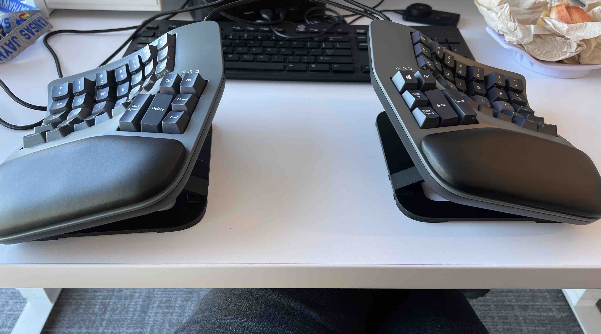
Kinesis Advantage360

[**back to top**](#table-of-contents)

### DjangoCon US 2023 Recap Popularity

I published a [DjangoCon US Recap](https://katherinemichel.github.io/portfolio/djangocon-us-2023-recap.html) in October 2023. It was featured in Django News Newsletter [Issue 205](https://django-news.com/issues/205#start). I learned in January that the recap had been Django News Newsletter's top article for months. 

[**back to top**](#table-of-contents)

## February

### Spring Fun for My Nieces

I want to start doing random, fun things for my nieces. I decided to buy them some board games. 

Games purchased:
* Guess Who?
* Candy Land
* Scrabble
* Clue

I had countless hours of fun playing these when I was a kid.

We FaceTimed while they opened the box. They immediately began playing and loved them. 

[**back to top**](#table-of-contents)

### CFP Connect

Last year, I obtained sponsorship from a JPMorganChase Managing Director to start a monthly departmental meetup in Plano that became known as PS Connect, then CFP Connect. This year, it grew to be a quarterly event typically attended by 100+ plus people, filled with knowledge-sharing, networking, and fun, and supported by top department leadership across Plano. 

It was a pleasure to continue to be part of the core team organizing the events. 

[**back to top**](#table-of-contents)

## March

### DjangoCon US Talk Topics Inspiration List

Every year, fellow DEFNA Board Member Jeff Triplett publishes a list of talk topics he'd like to learn more about at DjangoCon US. He also encourages other DEFNA Board Members to publish their own. 

Last year, I finally got organized and created a [Talk Topics Inspiration List for DjangoCon US 2023](https://katherinemichel.github.io/portfolio/djangocon-us-2023-recap.html). This year, I created a [Talk Topics List for DjangoCon US 2024](https://katherinemichel.github.io/portfolio/djangocon-us-2024-topics-inspiration-list.html). 

Our talk submission stats since I began publishing my list: 
* 2022: 152
* 2023: 189
* 2024: 194

I am confident that my list played a major role in the increase in submissions. I am really proud of that! 

My list was featured in Django News Newsletter [Issue 222](https://django-news.com/issues/222#start), along with [Jeff's list](https://micro.webology.dev/2024/04/28/djangocon-us-talks.html) and DjangoCon US Program Chair [Drew Winstel's list](https://winstel.dev/2024/03/01/talk-ideas-for-dcus-24/). 

[**back to top**](#table-of-contents)

### DjangoCon US Website Design

As a DEFNA Board Member, I help oversee DjangoCon US, including the website design. I am also an avid photographer. 

During DjangoCon US 2023, I walked around downtown Durham and took some photos of the quirky artwork there. During the always-fun website design iteration process, I shared these photos with the website team. 

Snapshots I took in downtown Durham

I am super excited that my photos helped inspire this year's theme. The [website design](https://2024.djangocon.us/) makes me smile, and I hope it makes you smile too! 

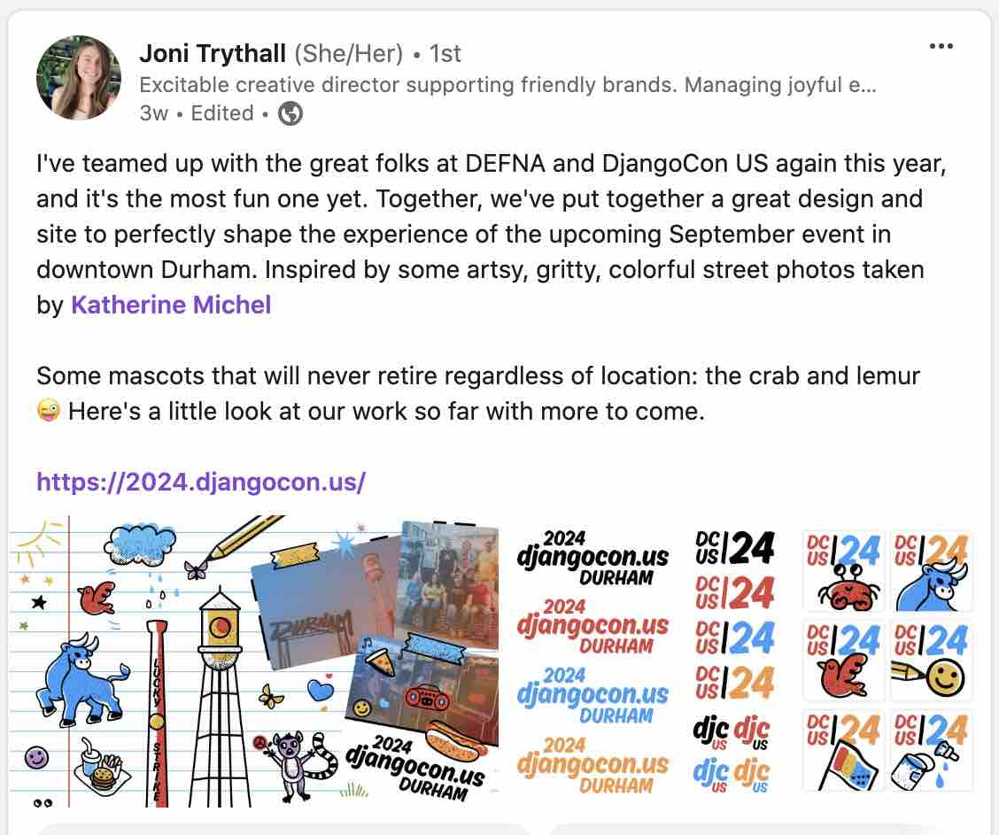
A shoutout from our amazing designer Joni Trythall of YupGup!

Joni did a [DjangoCon US Design Reflection](https://jonitrythall.com/dcus-design-reflection) featuring all of our designs since 2018.

They are so beautiful!

Thank you to Joni for a special recognition at the end of her post.

[**back to top**](#table-of-contents)

### Conference Snapshots

After years of collecting conference snapshots, I got organized and created a page of my [Favorite Conference Snapshots](https://katherinemichel.github.io/portfolio/favorite-conference-snapshots.html) and the stories behind them, as well as a page of [Speaker, Board, and Organizer Photos](https://katherinemichel.github.io/portfolio/speaker-board-and-organizer-photos.html). 

[**back to top**](#table-of-contents)

### Family Tragedy

On April 15, 2022, my [Aunt Judy died](https://www.livingstonfh.com/obituary/judith-k-markel) of pancreatic cancer. On March 29 of this year, my Uncle Edward passed away too. He had been suffering from probable Lyme-disease induced dementia and took a fall, but ultimately, he died of a broken heart. 

A part of me never believed this day could happen, and I wished it never would. Uncle Edward and Aunt Judy were truly larger than life. 

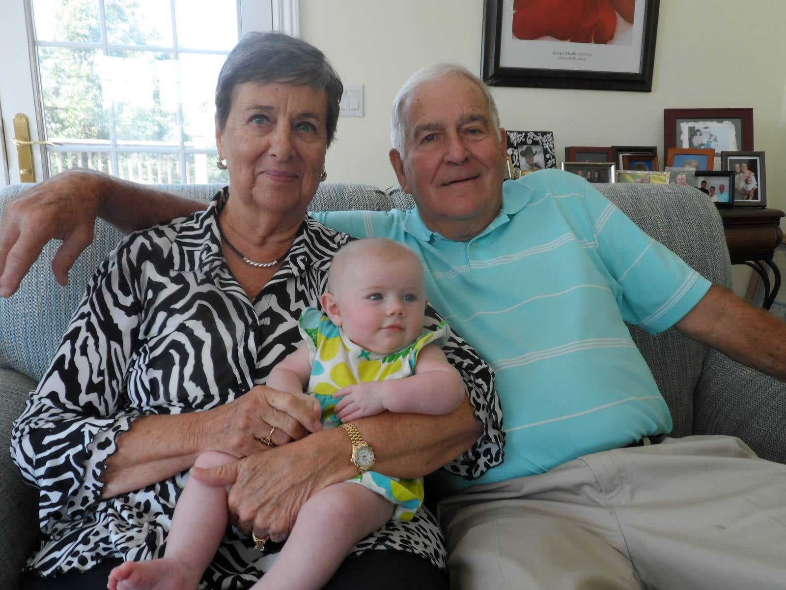
My aunt and uncle in better times

His life was not so easy after Aunt Judy died. He missed his Judy. He died peacefully, and I am comforted by the fact that he had a smile on his face. 

You can learn more about him in his [obituary](https://www.livingstonfh.com/obituary/edward-a-markel) or the [replay of his funeral](https://www.facebook.com/prettyprairieumc/videos/1118062006180755). 

He was one-of-a-kind. He was a brilliant engineer and businessman and the best brother my mother could have ever asked for.

My mom put her heart into providing the funeral music. He would have absolutely loved it.

My uncle was an avid hunter. My cousin Andrea Markel Hastings organized [one last duck call](https://youtu.be/ARt_orgMi3U?si=oFeWc5Qw1Ph3PdDE) for him at the cemetery by a few of his fellow hunting buddies. 

There's something in my eye.

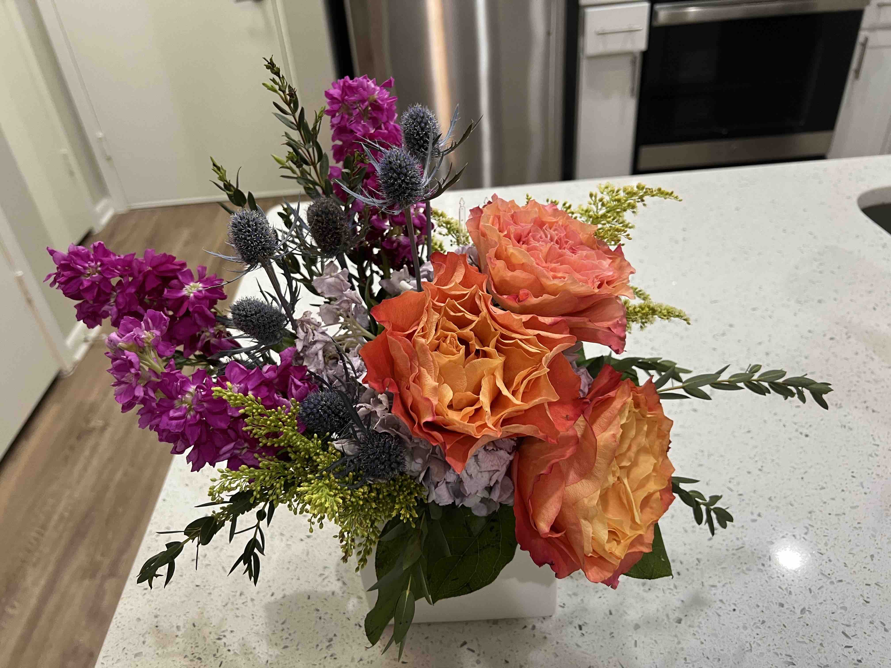
Beautiful sympathy flowers from DEFNA... in a strange coincidence, my cousin pointed out that the roses were one of my uncle's favorite colors

[**back to top**](#table-of-contents)

## April

### Lemurs at Tanganyka Wildlife Park

Because our DjangoCon US host city Durham, North Carolina has the largest population of lemurs outside of Madagascar, we featured a "friendly" lemur on our website last year. 

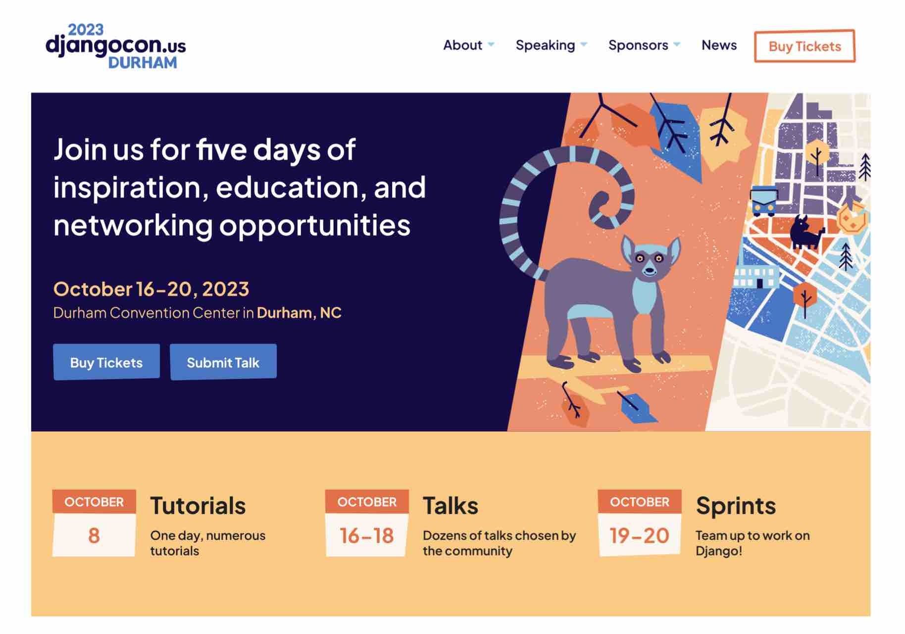
A "friendly" lemur with a smile on its face

After years of hearing about [Tanganyika Wildlife Park](https://twpark.com/) in Goddard, Kansas, mom and I decided to go. I had no idea until I got there that you can feed lemurs. They were so soft and gentle. I loved spending time with these real-life, friendly lemurs!

Mom, me, and the lemurs!

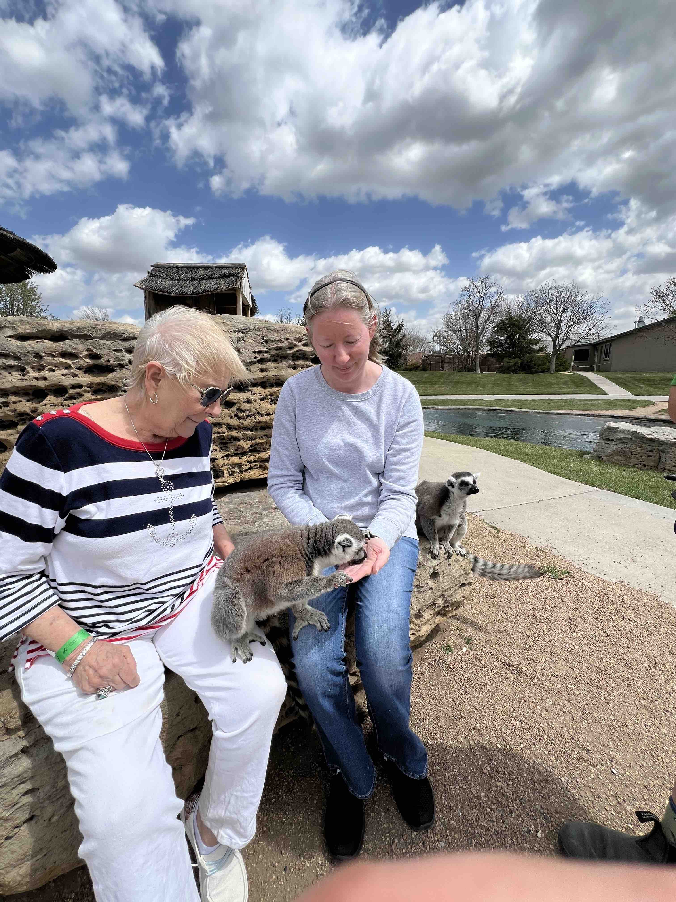
Me feeding a lemur a craisin out of my palm! It's holding my hand. 

[**back to top**](#table-of-contents)

### JPMorganChase Eclipse Watch Party

On my way back to Plano after my uncle's funeral, I got stuck in eclipse travel. I arrived back in Plano in time for the eclipse, but hadn't had time to plan. Fortunately, JPMorganChase had me covered. Eclipse glasses were handed out around campus, and we convened outside for a watch party. It's hard to put into words what it was like to watch the eclipse with what must have been thousands of co-workers. 

Here is [a little taste of the fun](https://youtu.be/vvNfmo0zwDw?si=Tl2xj-TZ29j_Doed). This was a small portion of the crowd. Clouds intermittently covered the sun, but parted in time for the totality. The crowd cheered and Total Eclipse of the Heart played in the background. Super fun!

[**back to top**](#table-of-contents)

### PyTexas 2024

[PyTexas 2024](https://www.pytexas.org/2024/) took place in Austin, Texas from April 19-21. 

PyTexas has been on my bucketlist for years, and I finally went. 

I met Jason Koo at DjangoCon US 2022 in San Diego where he generously helped as an organizer. It was great to see him again, and I look forward to learning more about Neo4j Graph Database! On the bright, sunny, second day of PyTexas, he invited me to be in this photo. 

Nick, Dan, Jason, Josh, me, Carol

It was a pleasure to get a snapshot next to my incredible friend Carol Willing. She had given an amazing keynote that morning. It is a must watch! I was also standing next to Josh Cannon who read the very clever Oh the (Methods) You Can (Make) book by Dunder Seuss.

All of the videos are available on the [PyTexas Youtube channel](https://www.youtube.com/c/PyTexas). 

[**back to top**](#table-of-contents)

### Austin Sightseeing

#### Franklin's Barbecue

On a whim, I went straight from the airport to Franklin's Barbecue for some of their brisket. Many believe it to be the best in the United States. The meat was melt in your mouth with very little fat. It was the best brisket that I've ever had, but I waited in line for an hour and a half to get it. On the bright side, I chatted with an incredibly nice man in line, and he bought my meal.

Franklin's interior

Finally inside Franklin's

The meal!

[**back to top**](#table-of-contents)

#### Downtown Austin

On Friday and Saturday, I explored the downtown. 

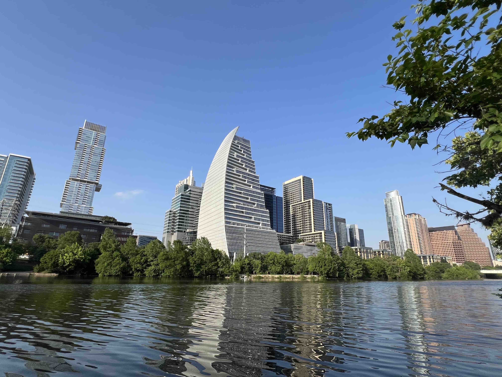
View of Block 185 from Lady Bird Lake Trail

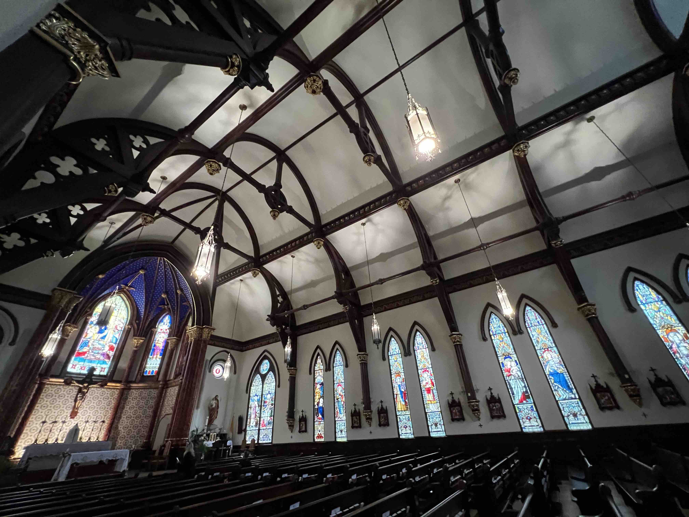
Saint Mary Catholic Cathedral

Texas State Capitol

[**back to top**](#table-of-contents)

#### Lyndon B. Johnson Presidential Library

On Saturday, I visited the LBJ Presidential Library. 

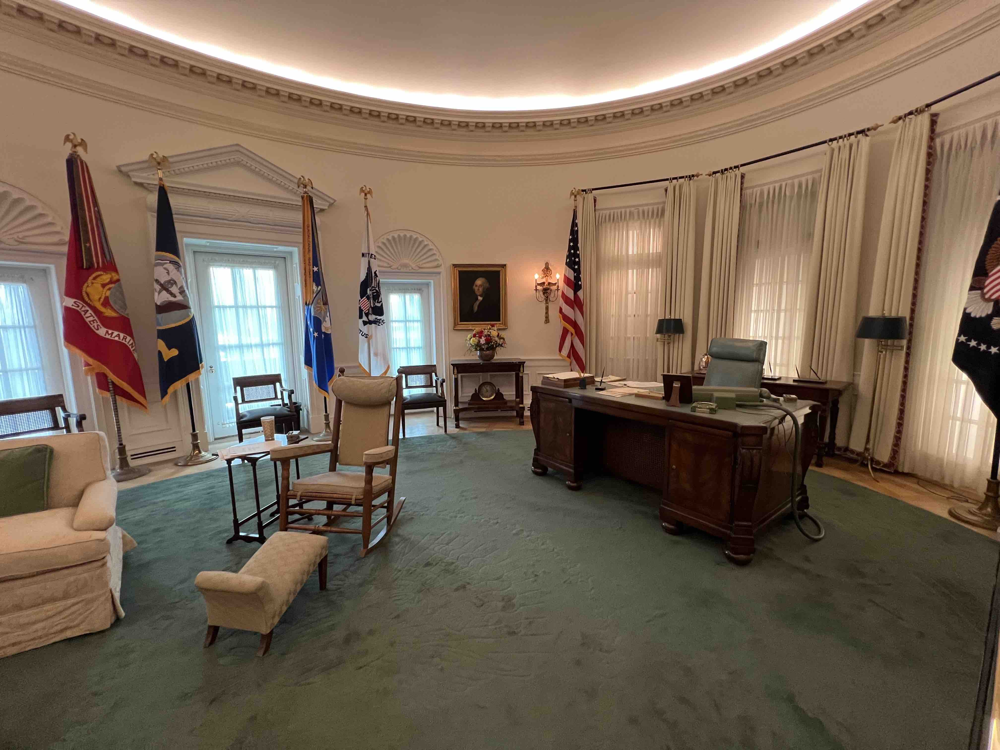
Replica Oval Office

The library included an exibit about the Kennedy assassination. Hear the [commentary](https://youtu.be/r-8P3GjKfPU?si=uwYY28LLu2Z2z00q). 

[**back to top**](#table-of-contents)

#### Bruce Springsteen Foundation Exhibit

As I walked around the LBJ Presidential Library, I nearly missed the premier of an incredible exhibit curated by the Bruce Springsteen Archives called [Music America: Iconic Objects from America's Music History](https://www.lbjlibrary.org/news-and-press/press-releases/music-america-exhibition-opens-at-lbj-library). The exhibit featured "more than one hundred objects representing the best of American music, spanning decades and genres."

It was by far the highlight of my visit and worth the price of admission alone. 

A few of my personal favorites:
* The history of African influence on American music
* Stevie Ray Vaughan's "Number One" Guitar
* Prince's shirt from Purple Rain and "Cloud" guitar
* Ella Fitzgerald's dress
* Elvis Presley's 1956 Tupelo Concert shirt
* Beatles' Shea Stadium concert ticket
* John Coltrane's Saxaphone
* Buddy Holly's suit and letter to his mother
* B.B. King's Lucille guitar
* Dizzie Gillespie's trumpet
* The first rock & roll records ("The Fat Man" and "Rocket 88")

Prince Purple Rain shirt and "Cloud" guitar

Beatles' Shea Stadium concert ticket

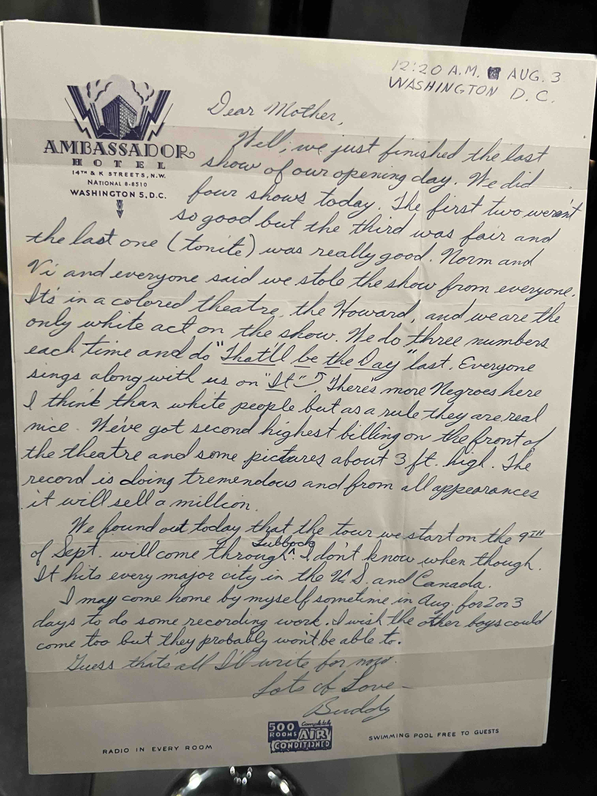
Buddy Holly letter (1957)

[**back to top**](#table-of-contents)

#### Austin Central Library

PyTexas was held in the gorgeous Austin Central Library, a tourist destination in its own right. 

The stunning rooftop garden with a view of the Austin skyline and Colorado River. 

[**back to top**](#table-of-contents)

## May

### Gym

Last year, I'd never been in a gym before and was afraid to go. My friend DeAnna Troutman Anaya talked me into getting started.

A few years ago, she found out that she was on her way to having debilitating illness. She was able to avoid it by getting fit. She regularly lifts weights and has an impressive physique. She is redefining what it means to be a grandmother.

When I started using an elliptical, I limited myself to ~70 steps per minute. Otherwise, I would get winded. Now, I am regularly up to 120+ steps per minute, and when life gets busy for a short time, and I don't exercise regularly, I am able to get back to my top performance within just a few sessions. I would love to know the science behind it. 

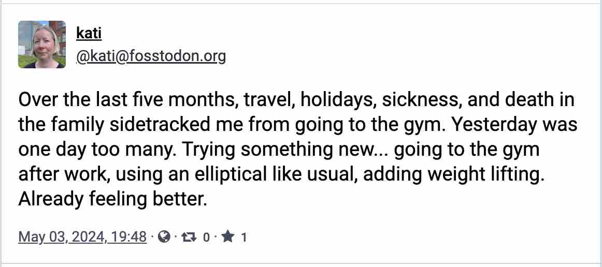
One day too many

I returned to the gym regularly on May 2nd and added light weight lifting. In combination with aerobic activity, I've read that weight lifting has a number of benefits as we age: bone density, muscle mass, coordination and balance, general health. 

By June 1st, I'd already had a personal best on the elliptical and broke that record many times over throughout the year. 

According to my chef friend Sheldon, having a personal trainer has been life-changing for him in his life and work. It is something I am considering. 

[**back to top**](#table-of-contents)

### DjangoCon US Featured Post

I was featured on DjangoCon US social media accounts, along with current Django Fellow Natalia Bidart and former and current DEFNA Board Members Drew Winstel, Tim Schilling, and Koji Idressa. 

[**back to top**](#table-of-contents)

### PyCon US 2024

PyCon US 2024 took place from May 15-23 in Pittsburgh, Pennsylvania. 

Thank you to Bernat Gabor for encouraging me to go! It was well worth it. 

After the conference, I did some "heavy lifting" from conference connections made. A few examples: 
* Based on a conversation with Black Python Devs Founder K. Jay Miller, I liased with DEFNA to further the interests of Black Python Devs at DjangoCon US 2024
* Based on a conversation with PyTexas Chair Mason Egger, I made PyTexas sponsorship pitches to interested parties
* Based on a conversation with Quansight Labs Co-director Tania Allard, I attempted to rekindle a prospective open source process within my network

[**back to top**](#table-of-contents)

## June

### PyCon US 2024 Recap and Hacker News

I wrote a deep dive of my [PyCon US 2024](https://katherinemichel.github.io/portfolio/pycon-us-2024-recap.html) experience. 

As my recap reflects, as far as talks go, I was particularly interested in major new developments around free-threading, per GIL subinterpreters, and JIT compilation. 

Not long after I posted my PyCon US 2024 Recap on social media, I got a rave review from Kenneth Reitz, PSF Fellow and author of Requests Python package (#5 for PyPI downloads, over 10,500,00 downloads/day, depended on by over 2,900,000 repos). 

Unbeknownst to me, Neil Stoker, Senior Director of Ratings AI at Fitch Ratings, had [submitted the recap to Hacker News](https://news.ycombinator.com/item?id=40552621). 

He tweeted to me that it was trending there. It had reached #2! 

#2 on Hacker News... so close to #1. Beaten out by Tim Bray's sofa parable, lol

#2 for nearly an hour

On the "front page" for about 12 hours

It eventually reached 186 points and 91 comments

While the recaps I have written of smaller Python/Django conferences have been widely shared in their own right, I believe that the universal appeal of PyCon US drove the massive popularity of this post. 

The new Python Release Manager Hugo van Kemenade whom I had the pleasure of meeting at the conference included my recap as the must read recap in his [conference recap roundup](https://dev.to/hugovk/pycon-us-2024-a-roundup-of-writeups-26hj).

I also made it to Django Co-creator Simon Willison's blog! Thank you to Simon for the [kudo](https://simonwillison.net/2024/Jun/3/katherine-michels-pycon-us-2024-recap/). 

Validation of my work among the world's leading Python practitioners and global community means a lot to me. 

It was also featured in Django News Newsletter [Issue 236](https://django-news.com/issues/236#start) and [pip Trends Newsletter](https://newsletter.piptrends.com/p/pycon-us-2024-recap-how-llms-work).

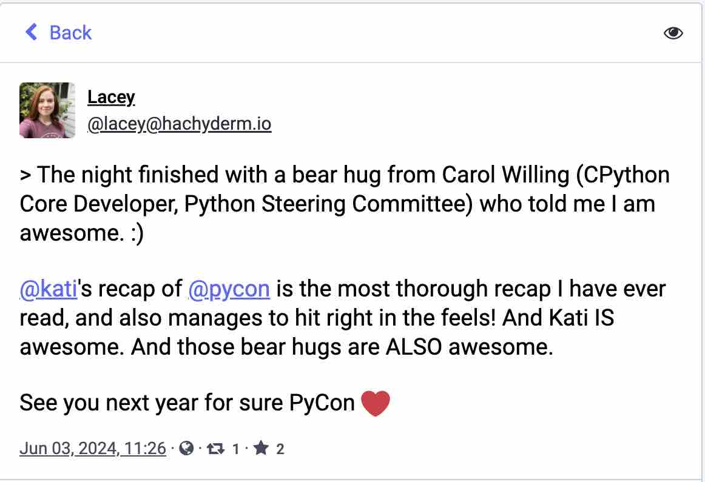
Thank you to the incredible Lacey for this sweet kudo! 

[**back to top**](#table-of-contents)

### DFW Pythoneers

After months of good intentions, I finally committed to attending [DFW Pythoneers](https://www.meetup.com/dfwpython/) meetup. It was a great time! I got to see Kevin Horn for the third time in two months and Broadus Jones for the second time in two months. :) 

I really enjoyed Jim Vogel's talk about Pydantic, MongoDB, Beanie, and FastAPI. 

[**back to top**](#table-of-contents)

### Summer Fun for My Nieces

In keeping with my plan to do more random, fun things for my nieces, I asked my sister what I could buy them for summer. 

Based on her suggestion, I bought them:
* Four X-Shot fast-fill water blasters
* 24 reusable, magnetic, fast-fill water balloons

I've been told the water balloons were a big hit, no pun intended. 

[**back to top**](#table-of-contents)

### Innovation Week Global Hackathon 

It was an amazing Innovation Week at JPMorganChase. I attended presentations Monday, Tuesday, and Wednesday, then finished the week off by participating in the Global Hackathon for the second year in a row. 

My first project fell through. Feeling disheartened, Wednesday night, I looked through the projects again and saw a new one that was highly relevant to my work in the Databases Department. I reached out to the team and joined. It felt meant to be. My team was inspiring! I learned a lot and made some new friends.

Here I am with my Plano-based hackathon teammates.

[**back to top**](#table-of-contents)

## July

### Wellness Screening

Throughout July, August, and September, I took advantage of JPMorganChase employee health and financial services benefits. 

After completing certain wellness activities, JPMorganChase will pay money into my MRA (Medical Reimbursement Account) and reduce my monthly insurance premiums. Although it's not the primary reason to do it, it's a nice incentive. 

In July, I did my wellness screening. My blood pressure and body mass index (BMI) were calculated, and a fingerstick was used to calculate my blood sugar, cholesterol and triglycerides. My bad cholesterol had gone down 22 points since my 2023 screening. 

[**back to top**](#table-of-contents)

## August

### CFP Connect Panel

CFP Connect hosted a women in leadership panel. The world has enough manels. Bring on the wanels. 

Women in Leadership Panel

[**back to top**](#table-of-contents)

### Financial Advisor

Using employee financial services benefits, I began working with a JPMorganChase personal advisor and private banker. 

What I learned from them has helped me understand the larger picture better, create a longterm financial strategy across all of my assets, and better leverage employee benefits. 

I also conveniently paid off my student loans. 

[**back to top**](#table-of-contents)

## September

### Preventative Care

Continuing with my wellness activities, for the first time, my doctor and I created a comprehensive, longterm annual preventative care plan. I completed a full physical, mammogram, colon cancer screening, and got up-to-date with my vaccinations. I feel fortunate to be "healthy as a horse." 

To improve my longterm health, I've cut back on animal products and now "eat the rainbow" often at home and work. 

Beautiful salad bar at JPMorganChase Plano

[**back to top**](#table-of-contents)

### More Good Luck

Last year, I had a modest rent increase. I've been assuming my rent would increase very year until I'd simply be priced out of renting. This year, to my surprise, my rent was significantly lowered. With so much bad news in the world, it's nice to know it's not all doom and gloom. 

[**back to top**](#table-of-contents)

### DjangoCon US 2024

I attended DjangoCon US from September 22-27. It was an absolute blast. I wrote a [recap](https://katherinemichel.github.io/portfolio/djangocon-us-2024-recap.html) about it. 

Thank you to Django News for featuring it in [Issue 254](https://django-news.com/issues/254#start)! 

Standing ovation for organizers

[**back to top**](#table-of-contents)

## October

### CFP Connect and Mo

October CFP Connect served as a forum to get to know new Head of CFP Mo El-Gammal who brings extensive experience from Amazon and Microsoft. It was exciting to see an initiative I started become a platform this powerful. 

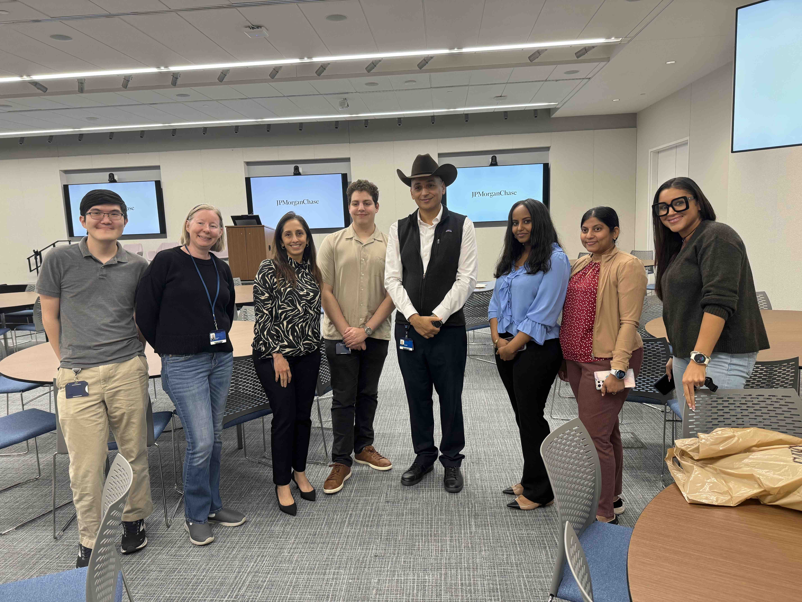
A few of us stragglers enjoyed a photo with Mo after the event

[**back to top**](#table-of-contents)

### CockroachDB Day

As my team's CockroachDB expert, I had the pleasure of attending a JPMorganChase Plano CockroachDB Day. 

[**back to top**](#table-of-contents)

### Sightseeing in Dallas

On October 4, I spent the day sight-seeing in Dallas. I went to the Dallas World Aquarium, the Sixth Floor Museum, Terry Black's Barbecue, then the Dallas Zoo. 

[**back to top**](#table-of-contents)

#### Dallas World Aquarium

The Dallas World Aquarium was unique and amazing. There were a number of awe-inspiring scenes and fun animals. 

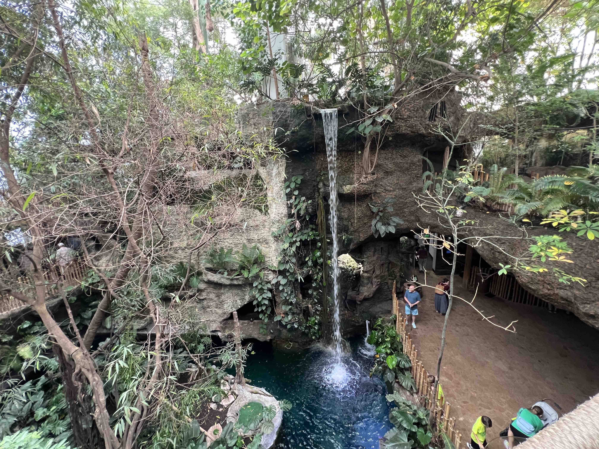
Three story waterfall... wow! 

Fish tunnel... can't believe I took this photo. Magical!

A few years ago, I wrote some code to create artwork for the final project of a Stanford Python course. At the aquarium, I saw a scene that very much reminded me of a favorite "artwork" that my program made. It was a small aquarium filled with sea life from British Columbia.

Sea life from British Columbia

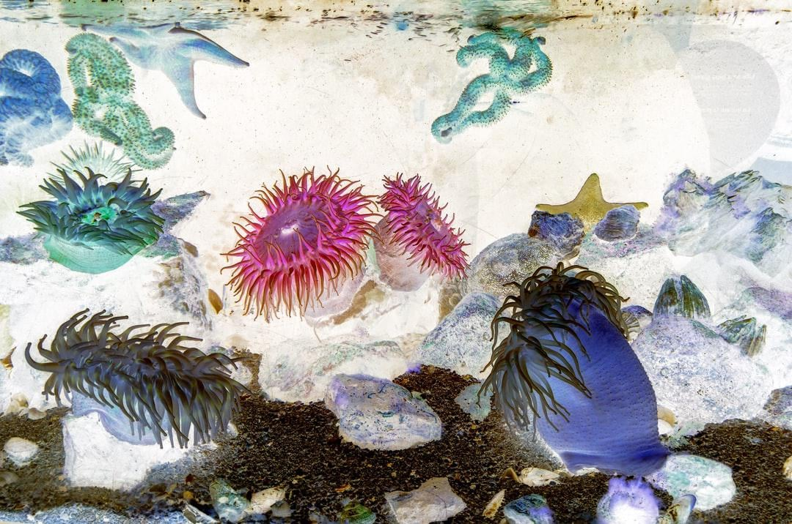
A favorite "artwork" my program made

[**back to top**](#table-of-contents)

#### Sixth Floor Museum

I had no idea what the Sixth Floor Museum would be like. The window where Oswald allegedly stood is behind a glass display. It was surreal to stand at the window nearest to it and look down at a perfect view of the motorcade route below. 

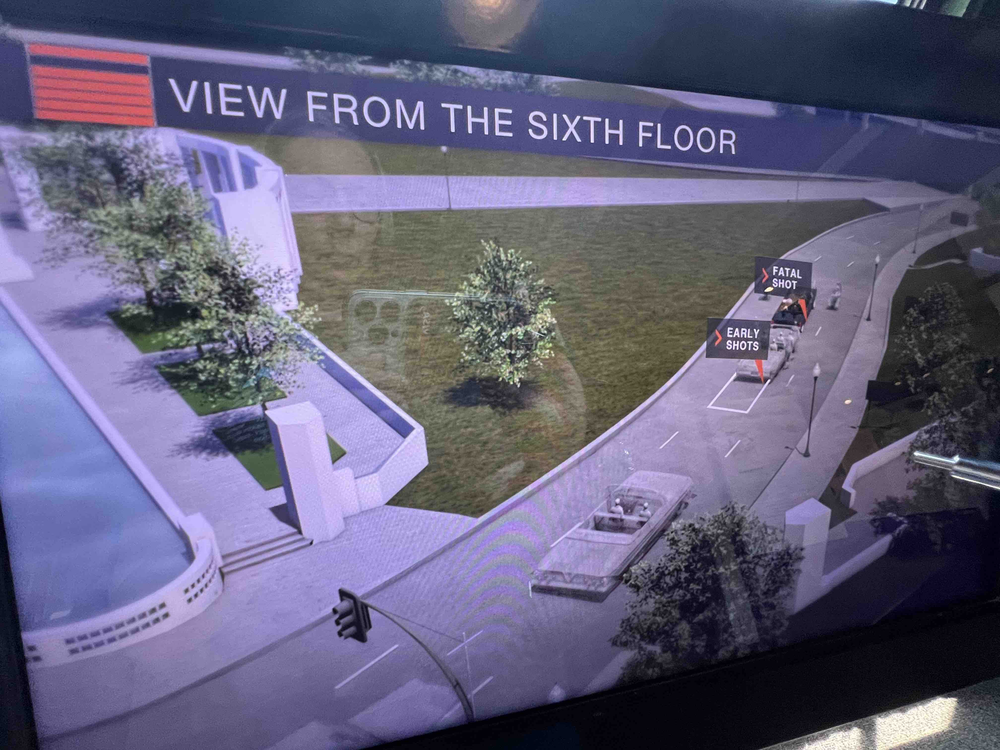
Route simuation

The route

[**back to top**](#table-of-contents)

#### Terry Black's Barbecue

After trying the world famous Franklin's Barbecue in Austin in April, I had the pleasure of trying Terry Black's Barbecue. Terry Black's Barbecue was a very different experience, but also great. The approaches of either establishment were very different! 

Franklin's Barbecue
* Slow moving line with "last man standing" 
* Slow, personal attention at the counter
* High quality, melt in your mouth brisket
* Quiet, small restauraunt atmosphere

Terry Black's Barbecue
* Fast moving line
* Fast service at the counter
* High quality, barked brisket with more fat
* Large, loud, hall-like atmosphere

The perfect barbecue restaurant would be Franklin's Barbecue brisket sold with the fast service and ambience of Terry Black's Barbecue. 

Terry Black's Barbecue

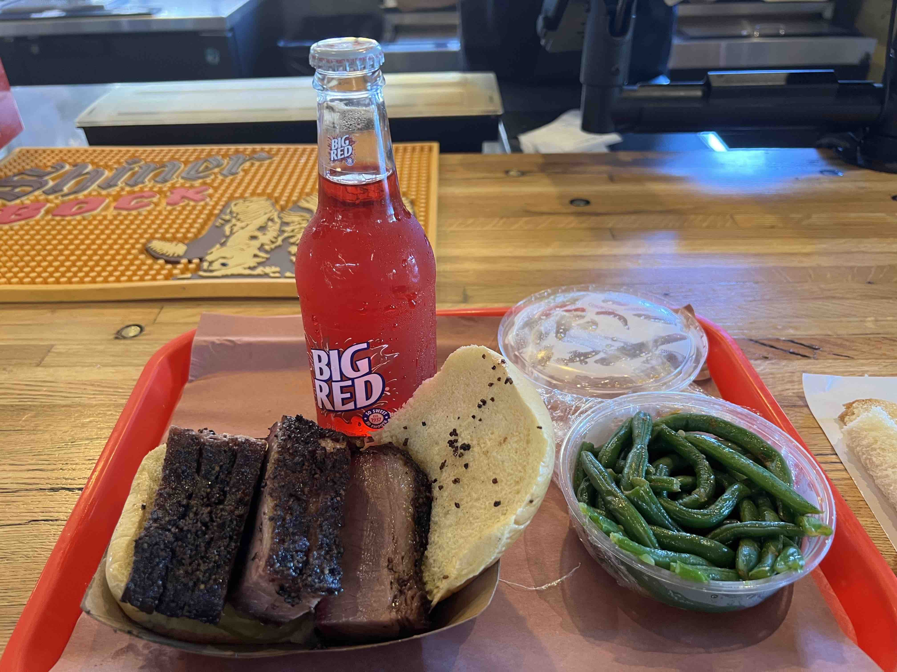
Brisket sandwich, green beans, and a Big Red (haven't had one of those in years!) 

[**back to top**](#table-of-contents)

#### JPMorganChase Dallas Zoo Employee Night

JPMorganChase Plano rented out the Dallas Zoo for an employee night. I had a really fun time! Thank you to everyone who made it unforgettable! 

Feeding a giraffe

A hand-drawn caricature of me

[**back to top**](#table-of-contents)

### Cookbook

My distant relative Kelly Cline is a talented quilter who shares her quilting adventures through her Facebook account and sells products through her online shop. I saw that she was selling a limited number of cookbooks authored by our mutual cousin Bonnie who is said to be a fantastic cook. The cookbook is full of great family and German recipes from the Russell, Kansas area where my Volga German ancestors of the Michel and Reinhardt Families settled. I couldn't resist buying one and having it sent to my sister and her husband who are avid cooks and also love German food. They'll try some recipes and cook a good one when I visit. 

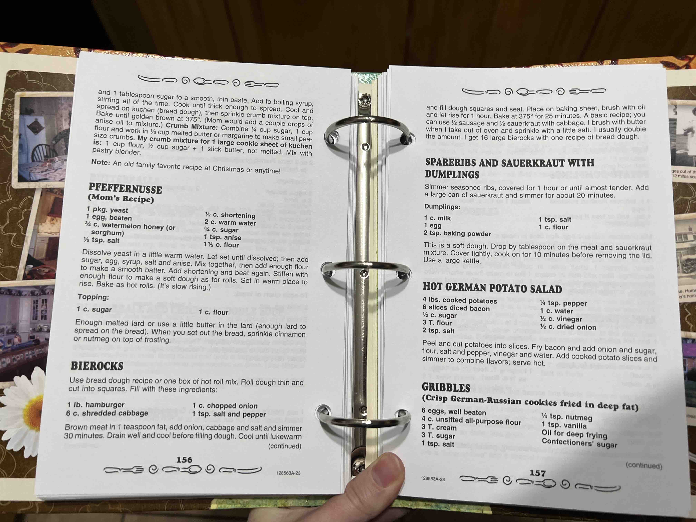
A few of the German recipes

[**back to top**](#table-of-contents)

### Winter Fun for My Nieces

While looking through popular brainteaser toys, I came across a couple that I couldn't resist buying for my nieces: 
* A Learn & Climb Mega Magic Kit for kids with 100s of tricks of all skill levels and a tutorial video
* Kanoodle, a best-selling educational game for all ages

[**back to top**](#table-of-contents)

### DjangoCon US 2025 Venue Selection

Identifying a DjangoCon US 2025 venue has been a challenge this year due to affordability. 

Fellow DEFNA Board Member Adam Fast gave a lightning talk about it at DjangoCon US 2024. The community answered the call by submitting a number of proposals. 

Fellow Board Member Tim Schilling and I collaborated to create an Excel spreadsheet analyzing the options. Reading through and disecting all of the proposals has enabled me to internalize the data and take a more active role in the conversation around venue tradeoffs. 

[**back to top**](#table-of-contents)

## November

November was a month for presentations. I gave three important ones within a week! 

### JPMorganChase PowerUp Conference Presentation

I had a blast presenting at JPMorganChase Plano PowerUp Conference with my team. It was my first time presenting there and a great experience.

Me presenting at PowerUp

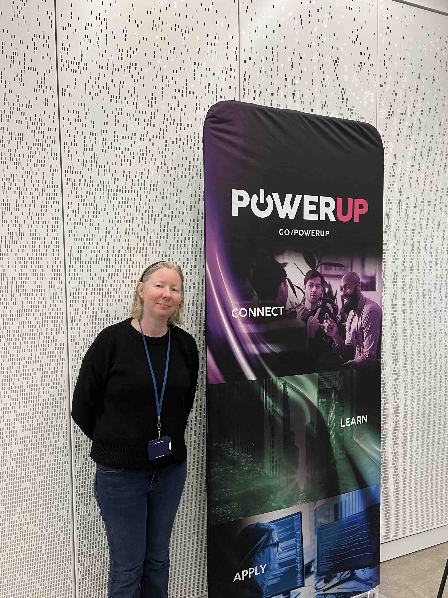
Me standing next to a PowerUp banner

[**back to top**](#table-of-contents)

### JPMorganChase Advent of Code Leadership

My co-worker Julie and I co-lead JPMorganChase Plano Advent of Code for the second year in a row. This year, we expanded it from our department to the entire Dallas Tech Center. We teamed up with two Jersey City AoC co-leads to give an information session. 

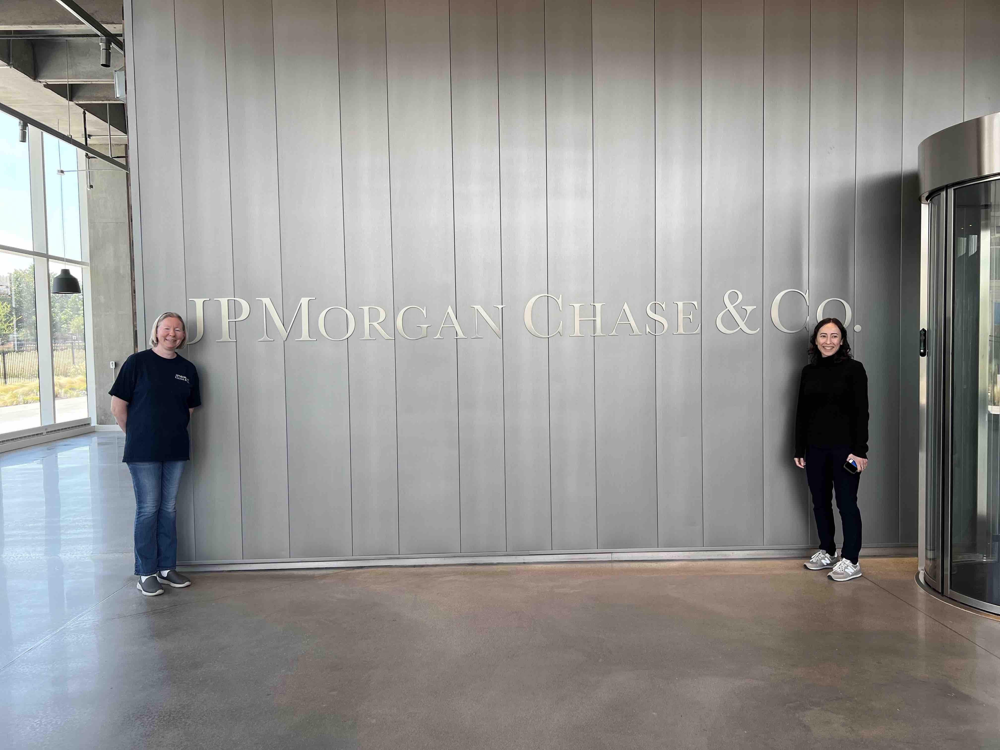
Me and my wonderful co-worker Julie

[**back to top**](#table-of-contents)

### JPMorganChase DjangoCon US Recap Presentation

Considering the popularity of my PyCon US 2024 and DjangoCon US 2024 recaps, I am well-positioned to analyze industry trends.

I distilled my DjangoCon US experience into a DjangoCon US Recap presentation specific to JPMorganChase that I gave to my team, department, and will soon give to the Databases Leadership Team. 

[**back to top**](#table-of-contents)

### Epson FastFoto FF-680W Scanner

Over the holiday break, I wanted to scan family photos and documents. After reading some reviews, I pulled the trigger on the highly-rated Epson FastFoto FF-680W. It is a very fast and powerful machine, and a game changer for scanning a large quantity of photos and documents well in a short amount of time. 

Features
* Fastest personal scanner on the market- able to scan a photo a second
* 300 dpi, 600 dpi, or 1200 dpi available
* Able to consecutively scan a stack of 50+ pages
* Auto-detects a two-sided photo or document and scans both sides at once
* Photo auto-enhancement
* Auto-saves a copy of both the original and enhanced scan
* Document utility that can be used to create custom PDFs and other files
* Ability to upload to Google Drive or Dropbox
* Auto shut-off

Enhanced scan of me and my sister

Original scan of me and my sister

[**back to top**](#table-of-contents)

### Carriage Crossing

The Saturday before our family Thanksgiving, I finally made it to my favorite restaurant Carriage Crossing for their Thanksgiving special. 

Oven roasted turkey and smoked ham, mashed potatoes and turkey gravy, stuffing, vegetable, cranberry sauce, dinner roll and cinnamon butter

[**back to top**](#table-of-contents)

### Two Year Work Anniversary

My two-year work anniversary happened on Thanksgiving. 

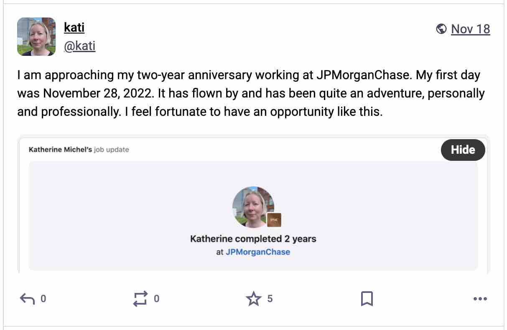

[**back to top**](#table-of-contents)

### New Furnishings

After leasing furnishings for my apartment for a couple of years, I stopped the lease and started picking out my own. 

I couldn't resist buying a Ruggable Patchwork Boho rug on Black Friday. I like the multi-colors and warm, relaxing look, and it's washable. 

<!-- 
Ruggable Patchwork Boho

Fix this
-->

I went to an Ikea for the first time, and it was a wild experience! 

I wanted to try out the Söderhamn sofa. It's modular, washable, pretty comfortable, and can be informally converted into a sleeper. One three-section sofa can be a two-section sofa and separate chaise lounge or chair with an ottoman. I like the Tonerud Gray. 

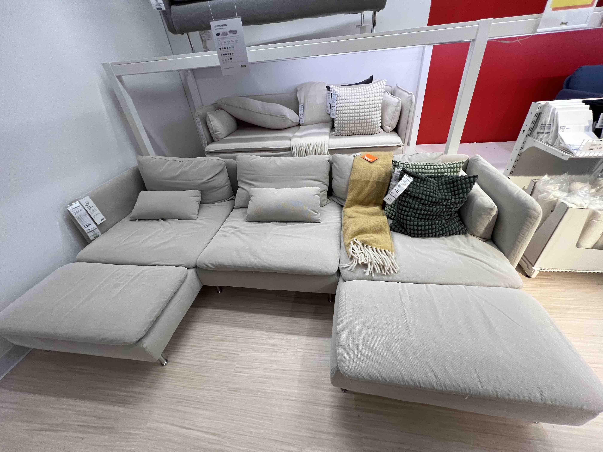
Söderhamn sofa with an ottoman and chaise lounge

Söderhamn chaise lounge in Tonerud Gray... a soft, felt-like material
 
Not only was Ikea teeming with people, but I had no idea that while shopping in an Ikea, you can take a break and eat in a Swedish restaurant. Someone sitting next to me had a plate of Swedish meatballs with Swedish flags stuck in them. 🤣 

I have been living a sheltered life. 

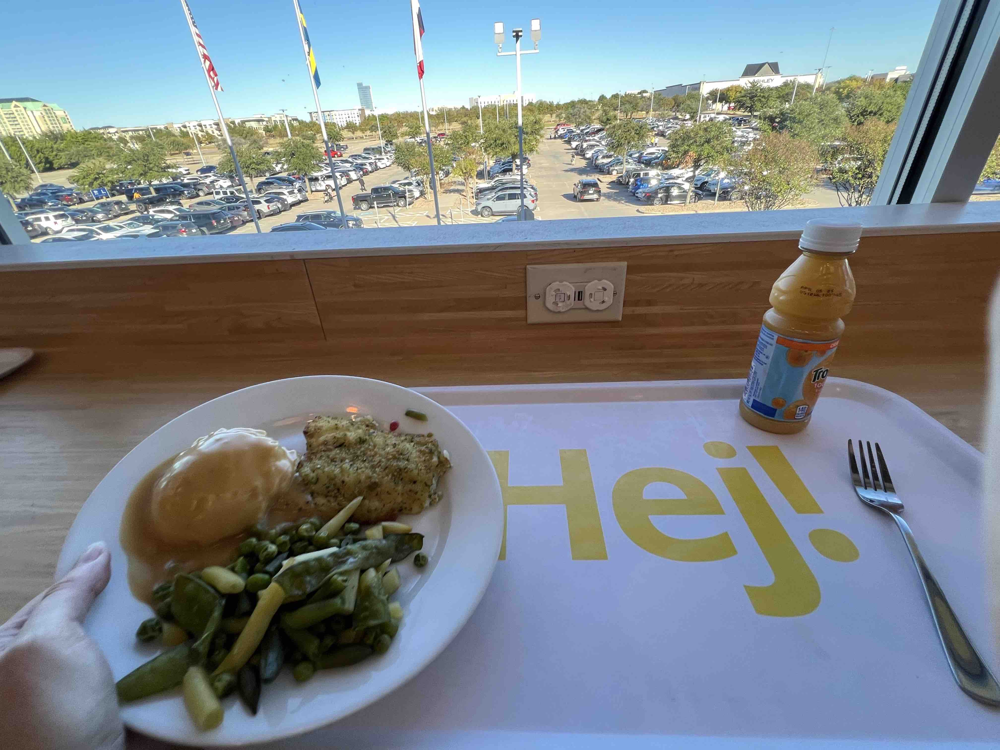
Eating at Ikea

<!--
Other favorite purchases
* Dupray Steam Cleaner
* Cozy earth weighted throw blanket, down-alternative comforter, duvet cover, luxe towels- one of Oprah's "favorite things" brands and significantly discounted on Black Friday
* Spinning brush
-->

[**back to top**](#table-of-contents)

## December

## Parting Thoughts

Thank you to each and everyone one of you, and there are many, who made my year special.

Although I am generally a person who maintains a stable outlook, it was a year of some high highs, and lower than usual lows. In addition to some health problems, the loss of my aunt two years ago, then my uncle this year had a major impact on my extended family. Throughout the year, I often had to prioritize health and family. I am hoping for a more normal 2025 in that respect. 

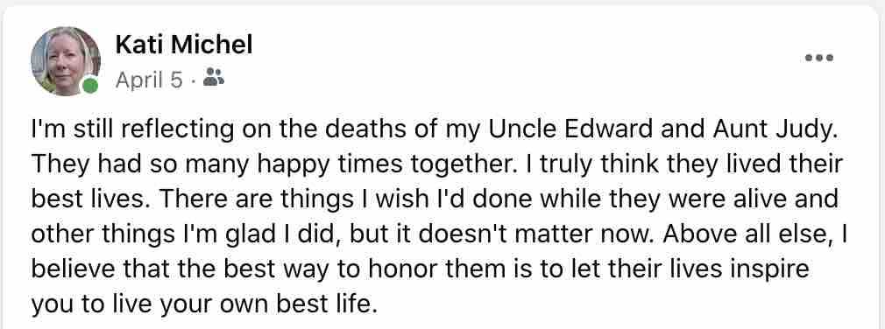

Last photo with my Uncle Edward

These are the "good old days." Live your best life. 

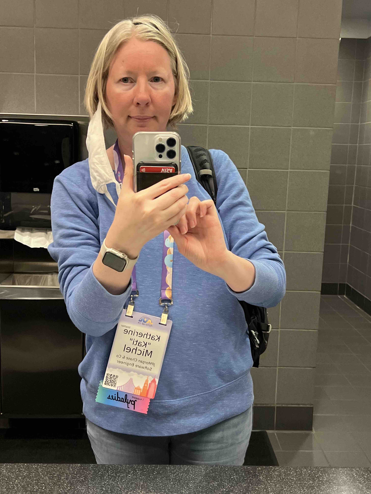
Me at PyCon US

[**back to top**](#table-of-contents)

## More Favorite Snapshots Throughout The Year

### Dallas Love Field Airport

On the road again... walking through Dallas Love Field Airport

[**back to top**](#table-of-contents)

<!--
### Arbor Hills

### Side Car Social
-->

### JPMorganChase Plano Chinese Lunar New Year Celebration

Parade

Cultural attire

[**back to top**](#table-of-contents)

<!--
### JPMorganChase Eclipse Watch Party
-->

### Tanganyka Wildlife Park

Mom turning the tables on me at Tanganyka

[**back to top**](#table-of-contents)

### Austin

Texas State Capitol dome

Moon rock collected during the Apollo 15 mission in 1971

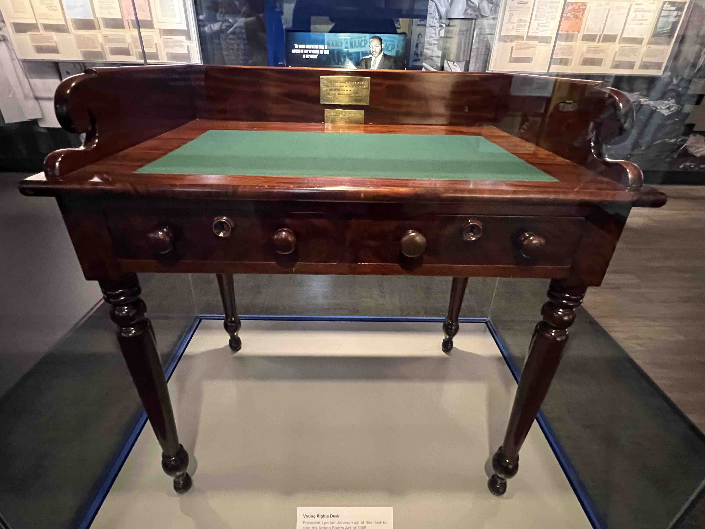
Desk where President Johnson signed the Voting Rights Act

[**back to top**](#table-of-contents)

<!--
### May the 4th

### Side Car Social
-->

### Clouds

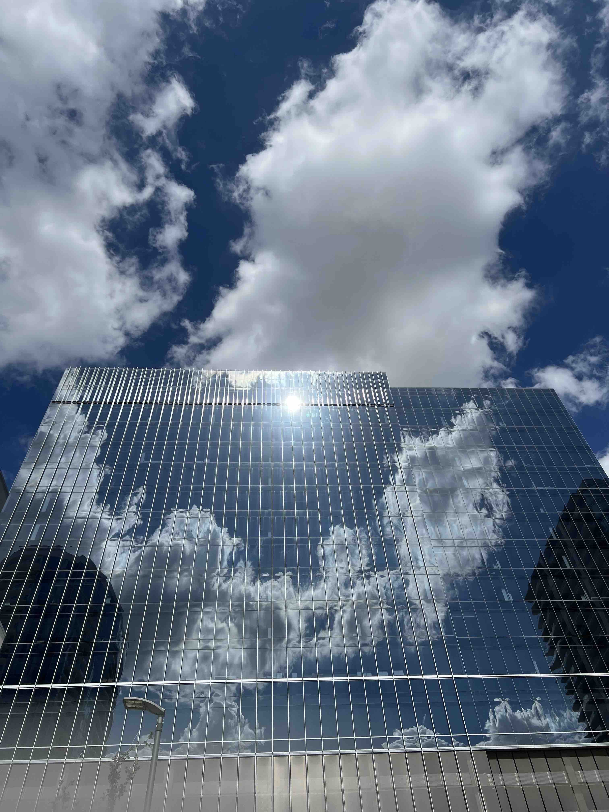
Clouds in Legacy

[**back to top**](#table-of-contents)

### McClaren Sports Cars

McLaren Financial Services had an event at JPMC and brought in two McLaren cars. That is me standing with ~$750k worth of car. 

A "lower-end" Artura

Me with the Artura

A 750S, the equivalent of an F1 car

[**back to top**](#table-of-contents)

### Yoshi Shabu Shabu

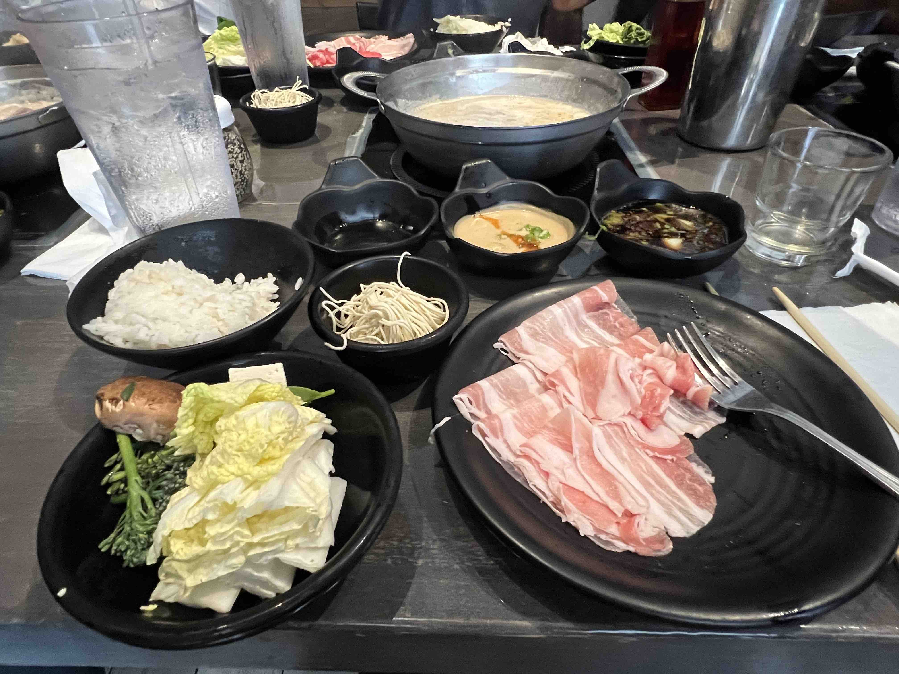
Japanese hotpot with tonkotsu, pork belly, ramen, and goma sesame peanut, citrus ponzu, and roasted garlic teriyaki sauces

Mango sake... first time trying sake! 

[**back to top**](#table-of-contents)

### T Swirl Japanese Crepe

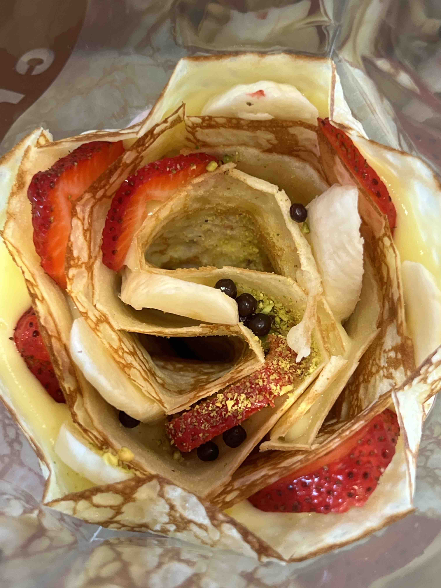
Strawberry banana crepe: sliced strawberries, sliced bananas, custard cream, whipped yogurt, chocolate pearls, crushed pistachios

[Video](https://youtu.be/zvWUkiFdXGI?si=lyunl-E7kim5ol_f)

[**back to top**](#table-of-contents)

### Luci's Bakery

Venezuelan chicken empanada, rice, black beans, fried plantains

[**back to top**](#table-of-contents)

### Darna Mediterranean Eatery

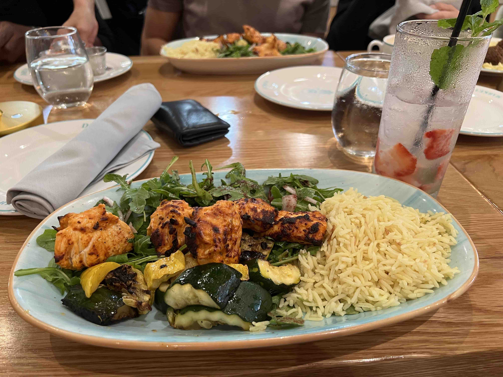
Saffron chicken kebab and mocktail mojito with strawberry flavor

[**back to top**](#table-of-contents)

### Employee Appreciation Week

Me with Dallas Mavs and Frisco RoughRiders mascots at the Employeer Appreciation Week street party

Me lounging in a floating Chase logo... 3D street art by Jan Riggins

Me overtaking a longhorn

Me sitting next to a life-size thank you memo

[**back to top**](#table-of-contents)

### Diwali

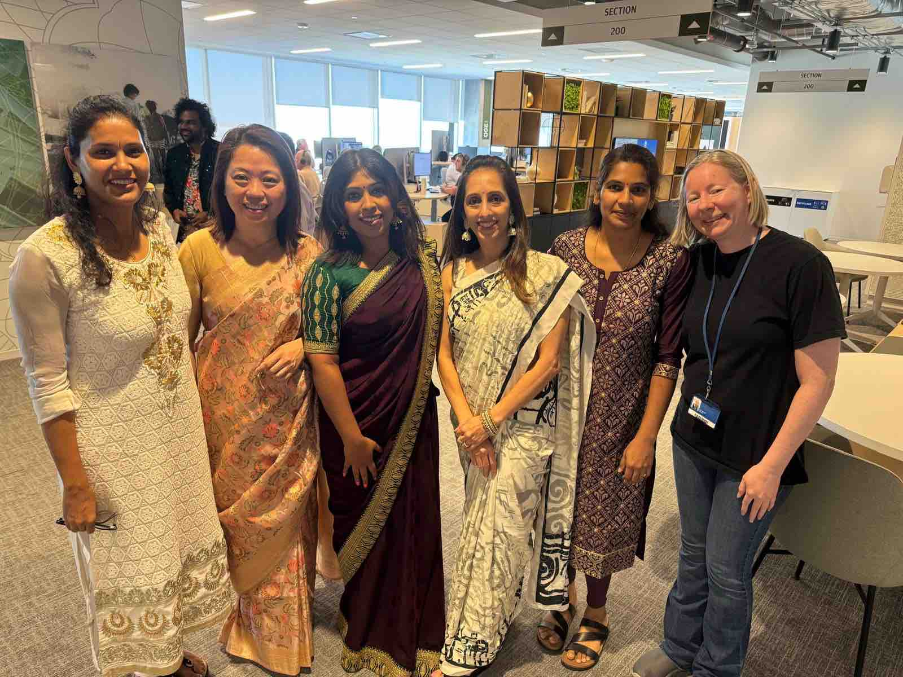
Me standing with co-workers wearing beautiful Diwali attire!

[**back to top**](#table-of-contents)

### Dallas World Aquarium Animals

An ever-so-slow moving sloth

Love flamingos! 

[**back to top**](#table-of-contents)

<!--
### Sixth Floor Museum
-->

### Terry Black's Barbecue Pit

"Pit power"

[**back to top**](#table-of-contents)

### Dallas Zoo

A performer on stilts dancing to reggae

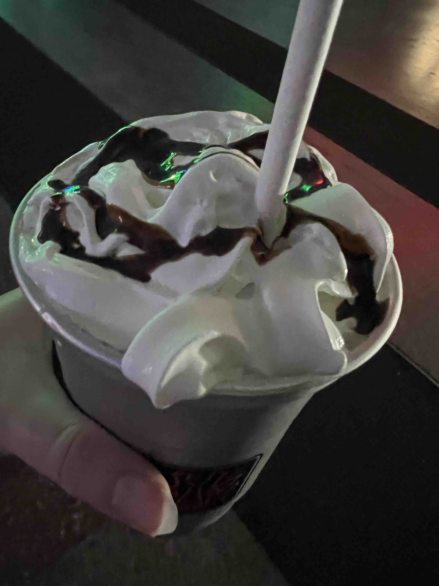
A perfect chocolate milkshake

[**back to top**](#table-of-contents)

### Yoshi Shabu Shabu September

Japanese hotpot with tonkotsu, shrimp, ramen, and goma sesame peanut, citrus ponzu, and roasted garlic teriyaki sauces

Spiked coffee

[**back to top**](#table-of-contents)

### JPMorganChase Plano

Main Street

Morning

[**back to top**](#table-of-contents)
