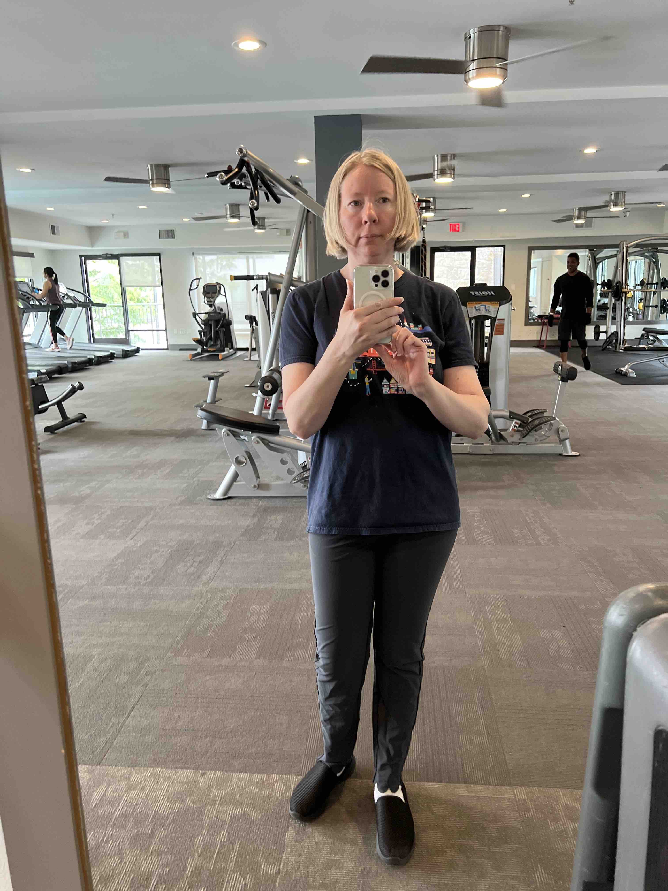

# 2024 Recap

<!--
Cumulative advantage

Charnise

https://fosstodon.org/@kati/112283408437442848
https://www-cnbc-com.cdn.ampproject.org/c/s/www.cnbc.com/amp/2024/04/16/the-best-us-companies-to-work-for-in-2024-according-to-linkedin.html
https://www.linkedin.com/pulse/linkedin-top-companies-2024-50-best-large-workplaces-grow-hmgye%2F/

Led sprint review and demo
Sprint retro
Sprint planning  
Demos

Switched teams

Work highlights- significantly reduced time, n+1
Multi-tenancy

CockroachDB and its dashboard
Profiling
Database optimization
Django optimization
Databus
Pub/sub architecture

Cryptography and security
Operating at scale

Database learning, on the job, at PyCon US during personal conversations and sponsor booths, during Global Hackathon conversations

Cluster creation

Grew in capability- things once more difficult for me became day-to-day tasks
Challenges of scale and security were good for me
Working across teams, learning and sharing knowledge

PR Review
Change Management, Release management
Working with SRE
Worked with lead architect
Architecture and design, tradeoffs, cost analysis
Security, resiliency, failover, restore
Product management, roadmap
User experience

Sick 3 times
March 8
Even as it improved, it continued... 
Feel lucky to be well
Gave me an appreciation

January
DEFNA Contract meeting
DEFNA Hotel Contract Committee

March 3
Talk Topics Inspiration List Django News Newsletter stats?

I was particularly excited to see my list be posted by the DSF account and Vicky, an expert in the open source community. 
https://fosstodon.org/@djangocon/112056987398023068

https://www.linkedin.com/posts/jonitrythall_ive-teamed-up-with-the-great-folks-at-defna-activity-7203812944940294144-6gtJ/?utm_source=share&utm_medium=member_desktop
https://fosstodon.org/@kati/112492859988088102

Conference snapshost
https://fosstodon.org/@kati/112026892390626620

https://www.linkedin.com/posts/katherinemichel_obituary-for-edward-a-ed-markel-at-livingston-activity-7180368920564916225-eXsL/
https://www.linkedin.com/posts/katherinemichel_life-isnt-always-easy-but-consider-me-blessed-activity-7133546031077588992-gadV/

Flowers
https://www.facebook.com/katherine.michel.5/posts/pfbid02RbmuKTnP2kayN7QfovAG78aXT9SpbEno6wSxQPbgVNhtbEbZBZXJSPY3Q7BbSpcal
Reflection
https://www.facebook.com/katherine.michel.5/posts/pfbid0kBMQMeHtXLUCN2A8epG3xvryEXztyGQD8CXN9vfWZjWkso6oeZhvX5wW1ZZyiM5jl

I think you are taking after me. 

https://x.com/KatiMichel/status/1727781095322562783

https://www.linkedin.com/posts/katherinemichel_as-a-defna-board-member-i-help-oversee-djangocon-activity-7182562538193125376-6_EG/

Mom turning the tables on me at Tanganyka
https://www.facebook.com/katherine.michel.5/posts/pfbid034rPSj3TbthnpHvnrfiVS9uFJrXnStHxvoLbuG7zx69WbXdtLMybH3W8MibMhUpuol

Mom turning the tables on me at Tanganyka

April
DEFNA Board Interviews

May
Worthmore session: Networking as a Woman: How to become 2.5x more successful

https://fosstodon.org/@kati/112380066353516377

Featured on DjangoCon US account
https://x.com/djangocon/status/1792933457183527350
https://fosstodon.org/@djangocon/112479673098056641

Databases connections

May

Comments and shares from Trey, Seth etc. 

https://x.com/search?q=https%3A%2F%2Fnews.ycombinator.com%2Fitem%3Fid%3D40552621&src=typed_query
https://x.com/nmstoker/status/1797250668501020962
https://fosstodon.org/@HackerNewsBot@m.einverne.info/112547856756286972
https://fosstodon.org/@hn50@social.lansky.name/112547268058241519
https://fosstodon.org/@kati/112547155288841309
https://fosstodon.org/@kati/112542746775054876
https://fosstodon.org/@kati/112542145378019538
https://fosstodon.org/@kati/112509391686025715
https://fosstodon.org/@kati/112498755031272596
Many DMs
https://fosstodon.org/@kati/112612110567916246
Get Django News Newsletter stats

Thank you to the incredible Lacey for this sweet kudo
https://fosstodon.org/@lacey@hachyderm.io/112553623603409800

June
PyTexas Sponsorship pitch
-->

Disclaimer: the content of this post is a reflection of my career journey and not specific to my work at JPMorganChase.

You can read my [2023 Recap](https://katherinemichel.github.io/portfolio/2023-recap.html) here. 

## This Year's Theme

While writing this recap, I found myself thinking the words, "I finally got organized and" a number of times. I felt a sense of cumulative momentum this year that came from building on prior knowledge and experience. 

A few examples
* Applying task orchestration and distributed system engineering expertise across multiple products
* Finally digging into some of the more advanced industry news such as historic PyCon US talks, Language Summit blog posts, and Seth M Larson's PSF security-in-residence posts
* Making the most of my PyCon US experience, then writing a thorough recap about it that was wildly popular in the Python/Django community
* Doing all of this in a timely manner

<!--
Event momentum

After years of collecting conference snapshots, I got organized and created a page of my [Favorite Conference Snapshots](https://katherinemichel.github.io/portfolio/favorite-conference-snapshots.html) and the stories behind them, as well as a page of [Speaker, Board, and Organizer Photos](https://katherinemichel.github.io/portfolio/speaker-board-and-organizer-photos.html). 

Also, read the Language Summit articles for the first time and was able to grok the content

* Doing some "heavy lifting" from conference connections made
* Using the experience I had acquired from working on a major task orchestration feature to implement more task orchestration features
* Creating a DjangoCon US Talk Topics Inspiration List for the second year in a row

Recognizing that recap's popularity, creating a presentation from it, and using it to launch a Python Guild
-->

## Work

I continued as a Python/Django software engineer doing task orchestration and distributed systems engineering. 

## January 

### Los Angeles 2023 Trip Recap

The dream Los Angeles trip that I took in early December 2023 turned into a [dream recap](https://katherinemichel.github.io/portfolio/los-angeles-2023.html) filled with my favorite stories, photos, and videos. 

My most-viewed Los Angeles videos:
* [Universal Studios Tour- King Kong](https://youtu.be/d3wERBCZHEM?si=P2SAE4GQRgXkhKDI)
* [Santa Monica Pier Carousel](https://youtu.be/TVL2gUfgNGk?si=aJjKWFcPVtTA3YV1)
* [Santa Monica Pier at Night- Ferris Wheel](https://youtu.be/cnWdL9C4ucU?si=G7QbrVFGAfQuWI7a)
* [Universal Studios Tour- Jaws](https://youtu.be/evZHAcfSnqw?si=-1P7Dd3wRPQW3I8F)

### Kinesis Advantage360

In 2020, I bought a Kinesis [Freestyle Pro](https://www.amazon.com/gp/product/B07J1ZJ6XR/) split keyboard. Although the keyboard itself was fairly traditional, I loved the 20'' separation cord and tenting. The unique Kinesis [Advantage2](https://kinesis-ergo.com/keyboards/advantage2-keyboard/) keyboard had long piqued my curiosity as well. When Kinesis came out with the [Advantage360](https://kinesis-ergo.com/keyboards/advantage360/) split version with tenting, I finally pulled the trigger. 

This keyboard is the most comfortable that I have ever used. The contoured shape shortens reach and the thumb presses heavily-used keys, instead of the pinky. 

Having said that, the layout is similar, but not exactly the same as a regular QWERTY, and I do not recommend using it if you have to "hunt and peck." Also, like the Freestyle Pro, it is one-size fits all, and slightly larger for a woman's smaller hands. 

Kinesis Advantage360

### DjangoCon US 2023 Recap

<!--
Get stats- how long at the top and how many views
-->

I published a [DjangoCon US Recap](https://katherinemichel.github.io/portfolio/djangocon-us-2023-recap.html) in October 2023. It was featured in [Django News Newsletter](https://django-news.com/issues/203#start). I learned in January that the recap had been Django News Newsletter's top article for months. 

## February

### Board Games for My Nieces

I want to start doing random, fun things for my nieces. I decided to buy them some board games. 

Games purchased:
* Guess Who?
* Candy Land
* Scrabble
* Clue

I had countless hours of fun playing these when I was a kid.

We FaceTimed while they opened the box. They immediately began playing and loved them. 

### PS Connect

<!--
How many people now?
Sharing, networking, and fun
-->

## March

### DjangoCon US Talk Topics Inspiration List

Every year, fellow DEFNA Board Member Jeff Triplett publishes a list of talk topics he'd like to learn more about at DjangoCon US. He also encourages other DEFNA Board Members to publish their own. 

Last year, I finally got organized and created a [Talk Topics Inspiration List for DjangoCon US 2023](https://katherinemichel.github.io/portfolio/djangocon-us-2023-recap.html). This year, I created a [Talk Topics List for DjangoCon US 2024](https://katherinemichel.github.io/portfolio/djangocon-us-2024-topics-inspiration-list.html). 

Our talk submission stats since I began publishing my list: 
* 2022: 152
* 2023: 189
* 2024: 194

Given the popularity of my articles among the Python/Django community, I'm confident that my list played a major role in the increase in submissions. I am really proud of that! 

My list was featured in [Django News Newsletter](https://django-news.com/issues/222#start), along with [Jeff's list](https://micro.webology.dev/2024/04/28/djangocon-us-talks.html) and DjangoCon US Program Chair [Drew Winstel's list](https://winstel.dev/2024/03/01/talk-ideas-for-dcus-24/). 

### DjangoCon US Website Design

As a DEFNA Board Member, I help oversee DjangoCon US, including the website design. I am also an avid photographer. 

During DjangoCon US 2023, I walked around downtown Durham and took some photos of the quirky artwork there. During the always-fun website design iteration process, I shared these photos with the website team. 

Snapshots I took in downtown Durham

I am super excited that my photos helped inspire this year's theme. The [website design](https://2024.djangocon.us/) makes me smile, and I hope it makes you smile too! 

A shoutout from our amazing designer Joni Trythall of YupGup!

### Conference Snapshots

After years of collecting conference snapshots, I got organized and created a page of my [Favorite Conference Snapshots](https://katherinemichel.github.io/portfolio/favorite-conference-snapshots.html) and the stories behind them, as well as a page of [Speaker, Board, and Organizer Photos](https://katherinemichel.github.io/portfolio/speaker-board-and-organizer-photos.html). 

### Family Tragedy

On April 15, 2022, my [Aunt Judy died](https://www.livingstonfh.com/obituary/judith-k-markel) of pancreatic cancer. On March 29 of this year, my Uncle Edward passed away too. He had been suffering from probable Lyme-disease induced dementia and took a fall, but ultimately, he died of a broken heart. 

A part of me never believed this day could happen, and I wished it never would. Uncle Edward and Aunt Judy were truly larger than life. 

<!--
Photo
Better times
-->

His life was not so easy after Aunt Judy died. He missed his Judy. He died peacefully, and I am comforted by the fact that he had a smile on his face. 

You can learn more about him in his [obituary](https://www.livingstonfh.com/obituary/edward-a-markel) or the [replay of his funeral](https://www.facebook.com/prettyprairieumc/videos/1118062006180755). 

He was one-of-a-kind. He was a brilliant engineer and businessman and the best brother my mother could have ever asked for.

My mom put her heart into providing the funeral music. He would have absolutely loved it.

My uncle was an avid hunter. My cousin Andrea Markel Hastings organized [one last duck call](https://youtu.be/ARt_orgMi3U?si=oFeWc5Qw1Ph3PdDE) for him at the cemetery by a few of his fellow hunting buddies. 

There's something in my eye.

Beautiful sympathy flowers from DEFNA... in a strange coincidence, my cousin pointed out that the roses were one of my uncle's favorite colors

## April

### Lemurs at Tanganyka Wildlife Park

Because our DjangoCon US host city Durham, North Carolina has the largest population of lemurs outside of Madagascar, we featured a "friendly" lemur on our website last year. 

A "friendly" lemur with a smile on its face

After years of hearing about [Tanganyika Wildlife Park](https://twpark.com/) in Goddard, Kansas, mom and I decided to go. I had no idea until I got there that you can feed lemurs. They were so soft and gentle. I loved spending time with these real-life, friendly lemurs!

Mom, me, and the lemurs!

Me feeding a lemur a craisin out of my palm! It's holding my hand. 

### JPMorganChase Eclipse Watch Party

On my way back to Plano after my uncle's funeral, I got stuck in eclipse travel. I arrived back in Plano in time for the eclipse, but hadn't had time to plan. Fortunately, JPMorganChase had me covered. Eclipse glasses were handed out around campus, and we convened outside for a watch party. It's hard to put into words what it was like to watch the eclipse with what must have been thousands of co-workers. 

Here is [a little taste of the fun](https://youtu.be/vvNfmo0zwDw?si=Tl2xj-TZ29j_Doed). This was a small portion of the crowd. Clouds intermittently covered the sun, but parted in time for the totality. The crowd cheered and Total Eclipse of the Heart played in the background. Super fun!

### PyTexas 2024

[PyTexas 2024](https://www.pytexas.org/2024/) took place in Austin, Texas from April 19-21. 

I met Jason Koo at DjangoCon US 2022 in San Diego where he generously helped as an organizer. It was great to see him again, and I look forward to learning more about Neo4j Graph Database! On the bright, sunny, second day of PyTexas, he invited me to be in this photo. 

Nick, Dan, Jason, Josh, me, Carol

It was a pleasure to get a snapshot next to my incredible friend Carol Willing. She had given an amazing keynote that morning. It is a must watch! I was also standing next to Josh Cannon who read the very clever Oh the (Methods) You Can (Make) book by Dunder Seuss.

All of the videos are available on the [PyTexas Youtube channel](https://www.youtube.com/c/PyTexas). 

## May

### Gym

Last year, I'd never been in a gym before and was afraid to go. My friend DeAnna Troutman Anaya talked me into getting started.

A few years ago, she found out that she was on her way to having debilitating illness. She was able to avoid it by getting fit. She regularly lifts weights and has an impressive physique. She is redefining what it means to be a grandmother.

When I started using an elliptical, I limited myself to ~70 steps per minute. Otherwise, I would get winded. Now, I am regularly up to 120+ steps per minute, and when life gets busy, and I go for a few months without exercising properly, I am able to get back to my top performance within just a few sessions. I would love to know the science behind it. 

<!--

One day too many
-->

Personal best... 112 steps per minute

<!--

Gym rat :) 
--> 

A chef friend Sheldon also encouraged me to get a personal trainer, which I have not done (yet). It has been life-changing for him in his life and work.

### DjangoCon US Featured Post

I was featured on DjangoCon US social media accounts, along with current Django Fellow Natalia Bidart and former and current DEFNA Board Members Drew Winstel, Tim Schilling, and Koji Idressa. 

### PyCon US 2024

PyCon US 2024 took place from May 15-23 in Pittsburgh, Pennsylvania. 

Thank you to Bernat Gabor for encouraging me to go! It was extremely worth it. 

After the conference, I did some "heavy lifting" from conference connections made. A few examples: 
* Based on a conversation with Black Python Devs Founder K. Jay Miller, I liased with DEFNA to further the interests of Black Python Devs at DjangoCon US
* Based on a conversation with PyTexas Chair Mason Egger, I made PyTexas sponsorship pitches to interested parties
* Based on a conversation with Quansight Labs Co-director Tania Allard, I attempted to rekindle a prospective open source process within my network

## June

### PyCon US 2024 Recap

I wrote a deep dive of my [PyCon US 2024](https://katherinemichel.github.io/portfolio/pycon-us-2024-recap.html) experience. 

As my recap reflects, as far as talks go, I was particularly interested in major new developments around free-threading, per GIL subinterpreters, and JIT compilation. 

Not long after I posted my PyCon US 2024 Recap on social media, I got a rave review from Kenneth Reitz, PSF Fellow and author of Requests Python package (#5 for PyPI downloads, over 10,500,00 downloads/day, depended on by over 2,900,000 repos). 

Unbeknownst to me, Neil Stoker, Senior Director of Ratings AI at Fitch Ratings, had [submitted the recap to Hacker News](https://news.ycombinator.com/item?id=40552621). 

He tweeted to me that it was trending there. It had reached #2! 

While the recaps I have written of smaller Python/Django conferences have been widely shared in their own right, I believe that the universal appeal of PyCon US drove the massive popularity of this post. 

The new Python Release Manager Hugo van Kemenade whom I had the pleasure of meeting at the conference included my recap as the must read recap in his [conference recap roundup](https://dev.to/hugovk/pycon-us-2024-a-roundup-of-writeups-26hj).

Validation of my work among the world's leading Python practitioners and global community means a lot to me. 

It was also featured in [Django News Newsletter](https://django-news.com/issues/236#start) and [pip Trends Newsletter](https://newsletter.piptrends.com/p/pycon-us-2024-recap-how-llms-work).

#2 on Hacker News... so close to #1. Beaten out by Tim Bray's sofa parable, lol

#2 for nearly an hour

On the "front page" for about 12 hours

<!--

It eventually reached 186 points and 91 comments
-->

Thank you to the incredible Lacey for this sweet kudo

### DFW Pythoneers

After months of good intentions, I finally committed to attending [DFW Pythoneers](https://www.meetup.com/dfwpython/) meetup. It was a great time! I got to see Kevin Horn for the third time in two months and Broadus Jones for the second time in two months. :) 

I really enjoyed Jim Vogel's talk about Pydantic, MongoDB, Beanie, and FastAPI. 

### Summer Fun for My Nieces

In keeping with my plan to do more random, fun things for my nieces, I asked my sister what I could buy them for summer. 

Based on her suggestion, I bought them:
* Four X-Shot fast-fill water blasters
* 24 reusable, magnetic, fast-fill water balloons

### Innovation Week Global Hackathon 

It was an amazing Innovation Week at JPMorganChase. I attended presentations Monday, Tuesday, and Wednesday, then finished the week off by participating in the Global Hackathon for the second year in a row. 

My first project fell through. Feeling disheartened, Wednesday night, I looked through the projects again and saw a new one that was highly relevant to my work in the Databases Department. I reached out to the team and joined. It felt meant to be. My team was inspiring! I learned a lot and made some new friends.

Here I am with my Plano-based hackathon teammates.

## July

### PyCon US 2024 Presentation

Due to the popularity of my PyCon US 2024 Recap, I decided to turn it into a presentation. 

JPMorganChase has a community of guilds called Ignite groups. Although there had long been interest in a Python Ignite Group, it had not come to fruition. 

It is a community that I have personally been yearning for. 

I reached out to a few interested parties, expressed my interest in launching the group, and offered up my presentation to help launch it. 

I've also been approached about hosting a PyLadies event at JPMorganChase Plano. A group like this could help support events like that. 

<!--
What I learned from PS Connect
Coincide with release of videos on youtube
If you are interested in PyLadies DWF, I'd love to hear from you. Drop me a line. :) 
-->

<!--
### Wellness Assessment

### Financial Advisor

### Teaching Python Fundamentals

A couple of colleagues approached me about teaching them more about Python. 

## August

## September

### DjangoCon US

## October

## November

## December

## Self-Care
-->

<!--
Felt I was able to further grow my network and have a deeper understanding of subjects

Update on how I did
Not as much as expected due to issues in first half of year
Picked up in second half of year
https://katherinemichel.github.io/portfolio/what-i-am-paying-attention-to-in-2024.html
-->

## Parting Thoughts

Thank you to each and everyone one of you, and there are many, who made my year special.

These are the "good old days." Live your best life. 

<!--
Simple things poster
-->

## February

### Arbor Hills

### Side Car Social

### Chinese New Year

## March

### JPMorganChase Eclipse Watch Party

## April

### Tanganyka Wildlife Park

Mom turning the tables on me at Tanganyka

### PyTexas 2024 Photos

## May

### May the 4th

### PyCon US 2024 Photos

### Side Car Social

## June

### McClaren Sports Cars

## September

### DjangoCon US 2024 Photos
