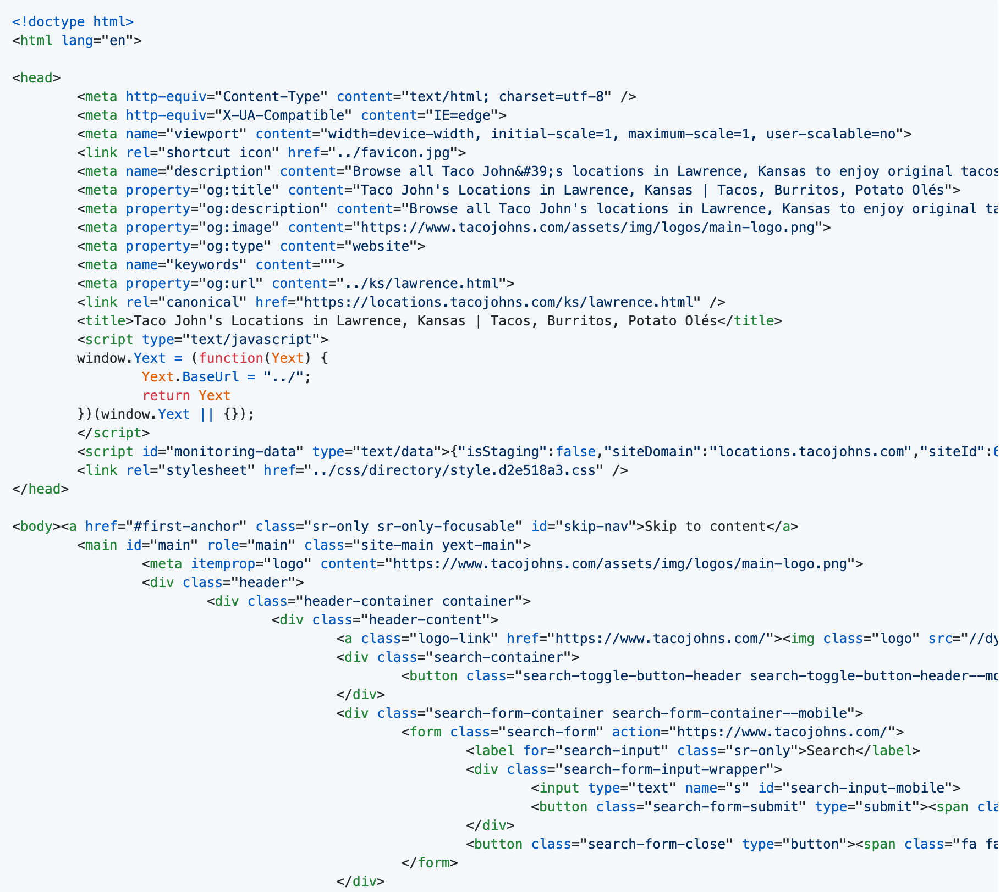

# Building a Taco John's Scraper

## Before I Begin

I created this scraper as a fun programming exercise to solve a hypothetical problem.

A couple of important things to know:

* Scraping is sometimes considered controversial, and can have unintended consequences. For example, I recently read an article about a person being indefinitely locked out of their Google account due to their scraping activity! Be careful out there.

* Some websites have been designed to have a built-in [API (Application Programming Interface)](https://en.wikipedia.org/wiki/API), which enables data to be obtained from the website database in a controlled way. Before scraping, you might want to see if an API exists and whether it serves your purpose. APIs are often well documented. Here are a couple of lists of APIs as examples: https://github.com/public-apis/public-apis and https://github.com/n0shake/Public-APIs

## What is Scraping?

Imagine that a website contains some structured data that you would like to obtain. For example, perhaps you are a data scientist who would like to do an analysis of a store's products, or you are a web developer who would like to create a website that aggregates product information. 

One way to obtain the data is to use a mouse to click through the pages of the website. But, depending on how much data you'd like to obtain, this might not only be inconvenient, it might not be humanly possible!

Perhaps, sometime, while looking through the menu of your website browser, you've clicked on an option that says "View Source" and you've gotten a glimpse of some of the source code, that is normally hidden, that runs a website page.

Clicking on "View Source"


A source code snippet... this source code had been "minified" to improve website performance. I used a formatting tool to un-minify it.



In addition to an official [standard library](https://docs.python.org/library/) that contains all of the commonly used features of the language, [Python](https://www.python.org/) programming language has a rich ecosystem of third-party tools that can be used to do powerful things.

One of the third-party tools in the Python ecosystem is called [Scrapy](https://scrapy.org/). Scrapy can be used to create a Python program that can programatically follow a website's URLs (links) in the source code to obtain, or "scrape" the structured data you are in search of and output it in a form that you can save and use. 

Unlike a human being, a [scraper](https://en.wikipedia.org/wiki/Web_scraping) can hypothetically do this on a massive scale, in a short amount of time, and on a schedule.

## Making a Scraper for Hacktoberfest

[Hacktoberfest](https://hacktoberfest.digitalocean.com/), sponsored by [GitHub](https://github.com/) and Digital Ocean, is a month-long celebration of open-source code. If you submit four pull requests (proposed contributions) to participating open-source projects on GitHub during October, and the pull requests are considered valid and merged, you will receive a t-shirt or have a tree planted in your name, up to the first 70,000 people.

If you are ever interested in getting involved in open source and don't know where to get started, I sometimes give a talk about it called "Get a Jumpstart on Collaboration and Code Review in GitHub." Check out my talk [slides and script](https://github.com/KatherineMichel/get-a-jumpstart-on-collaboration-and-code-review-in-github-pyladies-southwest-florida) in my GitHub account.

While I was looking through GitHub repos (places where code is stored) to identify contributions I could make that would qualify for Hacktoberfest, I came across a repo called [All the Places](https://github.com/alltheplaces/alltheplaces/). All the Places project contains a collection of [Scrapy scripts](https://github.com/alltheplaces/alltheplaces/tree/master/locations/spiders) (a.k.a "spiders") that can be used to scrape business websites for location data.

For a while now, I've been wanting to learn how to make a scraper, so I decided to make one of my own to contribute to the All the Places project for Hacktoberfest.

## Considerations

To begin with, I attempted to make scrapers for several different websites and learned by trial and error about the challenges. 

Firstly, because All the Places scrapers are intended to be used to collect geographical information, it's required that location latitude and longitude information be scraped from the website. But, even if the latitude and longitude information is contained within the website, it's not necessarily easily accessible. If the source code contains a Google Map URL that has the location latitude and longitude information within the URL, that information can be scraped directly. But, in one project I worked on, the Google Map URL contained the location address instead of its latitude and longitude, making that information much less straight forward to obtain. 

Google Map URL that contains latitude and longitude data

```html
https://www.google.com/maps/place/Taco+John's/@38.9728434,-95.2478613,15z/data=!4m5!3m4!1s0x0:0x9ed745c4be038bd6!8m2!3d38.9728434!4d-95.2478613
```

Google Map URL that contains an address

```html
https://www.google.com/maps/dir/Taco+John's,+West+6th+Street,+Lawrence,+KS/
```

Secondly, there is a lot of inconsistency in the way that websites are structured. In an "easier" scenario, the website structure and its URLs will progress in a predictable way. For example, maybe the relevant URLs in a page listing states will only lead to city pages and the URLs in the city pages will only lead to restaurant pages. Unfortunately, the URLs in the Taco John's website are inconsistent, which you'll learn about later.

Thirdly, when scraping information from a page, you are at the mercy of the meticulousness of the developer who wrote the source code. Better structured and documented source code (for instance, that is structured using a [schema](https://schema.org/)) can make your life easier. 

Snippet of HTML structured using [PostalAddress Schema](https://schema.org/PostalAddress)

```html
<div class="information-address-content"><span class="coordinates" itemprop="geo" itemscope itemtype="http://schema.org/GeoCoordinates"><meta itemprop="latitude" content="38.9728433610435"><meta itemprop="longitude" content="-95.24786129593849"></span><address class="c-address" itemscope itemtype="http://schema.org/PostalAddress" itemprop="address"><span class="c-address-street" itemprop="streetAddress"><span class="c-address-street-1">1101 W 6th St </span></span><span class="c-address-city"><span itemprop="addressLocality">Lawrence</span><span class="c-address-city-comma">,</span></span> <abbr title="Kansas" aria-label="Kansas" class="c-address-state" itemprop="addressRegion">KS</abbr> <span class="c-address-postal-code" itemprop="postalCode"> 66044</span> <abbr title="United States" aria-label="United States" class="c-address-country-name c-address-country-us" itemprop="addressCountry">US</abbr></address></div>
```
                                
However... inconsistent website structure and poorly written source code can also strengthen your problem solving muscles.

After a lot of experimentation with websites in the All the Places issues, I decided to identify a site on my own to scrape. I thought about restaurant chains in Kansas and Taco John's immediately came to mind. When I lived in Lawrence, Kansas, I often went through the drive-through of the Taco John's at 1626 W 23rd St (now closed) on Taco Tuesday, and picked up several tacos and an order of Potato Olés®. Yum.

## How Location Pages Work on the Taco John's Website

I set my Taco John's scraper up to begin "crawling" at the main Taco John's locations page. This locations page is an index of states where Taco John's restaurants are located.

Taco John's locations page (https://locations.tacojohns.com/)


Clicking on a URL in the locations page will usually open up an index page showing the cities where Taco John's restaurants are located in the state.

Taco John's state page example (https://locations.tacojohns.com/ks.html)


If a city contains more than one Taco John's restaurant, clicking on the city URL will open an index page showing all of the restaurants in the city. 

Taco John's city page example (https://locations.tacojohns.com/ks/lawrence.html)


Clicking on one of these URLs will open up the restaurant page. 

Taco John's restaurant page example (https://locations.tacojohns.com/ks/lawrence/1101-w-6th-st.html)


If a city contains only one Taco John's restaurant, clicking on the city URL will open up the restaurant page directly.

## The Challenge

I said that clicking on a link in the locations page will usually open up a state page showing the cities where Taco John's restaurants are located. But unfortunately, this is not *always* the case. 

State page links on locations page

```html
https://locations.tacojohns.com/co.html
https://locations.tacojohns.com/id.html
https://locations.tacojohns.com/il.html                            
https://locations.tacojohns.com/in.html
https://locations.tacojohns.com/ia.html
https://locations.tacojohns.com/ks.html                           
https://locations.tacojohns.com/ky.html
https://locations.tacojohns.com/mn.html
https://locations.tacojohns.com/mo.html
https://locations.tacojohns.com/mt.html                       
https://locations.tacojohns.com/ne.html
https://locations.tacojohns.com/nd.html
https://locations.tacojohns.com/oh.html
https://locations.tacojohns.com/sd.html
https://locations.tacojohns.com/tn.html
https://locations.tacojohns.com/wa.html
https://locations.tacojohns.com/wi.html
https://locations.tacojohns.com/wy.html
```

Only one city in Arkansas (Russellville) has any Taco John's location and that city has two. So, a state page is not required, but a city page is. The program needs to skip to a city page, then parse the location pages.

City page link on locations page

```html
https://locations.tacojohns.com/ar/russellville.html
```

Three states (Michigan, Nevada, and New York), only have one restaurant in the state. So state and city pages are not required. The program needs to skip to a restaurant page.

Restaurant page links on locations page

```html
https://locations.tacojohns.com/mi/stevensville/4107-red-arrow-highway.html
https://locations.tacojohns.com/nv/reno/770-s-wells-ave.html
https://locations.tacojohns.com/ny/jamaica/john-f--kennedy-international-airport.html
```

As a result, most of the links on the locations page are for state pages, one is for a city page, and three are for restaurant pages.

In programming, it's important to "catch" [exceptions](https://docs.python.org/3/tutorial/errors.html#exceptions), situations that differ from the norm, and plan for them in advance. Otherwise, the program might literally... not work.

My Scrapy program has specific instructions for how to parse each type of page. If the program always goes in the same order, from location page to state page, to city page, to restaurants page, using the correct set of instructions to parse the correct page, there's no problem.

But, if the program follows a city or restaurant page link, but is parsed using the instructions for parsing a state page, there's a problem. The program doesn't work right, because the instructions don't fit the page.

The program needs to know what type of page it's parsing, so it can use the correct instructions.

## The Solution

My solution involves [regular expressions](https://en.wikipedia.org/wiki/Regular_expression) (regex). 

A regular expression is an abstract pattern that a program can use to identify a combination of letters, numbers, or symbols. 

Within the program, I've used regex to create a `state_pattern`, `city_pattern`, and `location_pattern`, to express the abstract patterns of the website state page, city page, and location page URLs.

State, city, and location page URL regex patterns
    
```python
state_pattern = re.compile("^[a-z]{2}(\.html)$")
city_pattern = re.compile("^[a-z]{2}\/.+(\.html)$")
location_pattern = re.compile("^[a-z]{2}\/.+\/.+(\.html)$")
```

As the program crawls the URLs in the source code page, it will compare each URL to each regex pattern until it matches one. In that way, the program will know if the URL belongs to a state, city, or restaurant page.

The program will then call the function that contains the instructions for parsing that type of page. 

Instead of processing the pages in an order, the program processes the pages by page type. In that way, no matter what path the links take, however long or short, the program will end up at a location page, outputting the data from that page.

## Regex Pattern Explanation

Every location URL begins with ```https://locations.tacojohns.com/```. The `^` character lets the program know that that part of the URL doesn't matter to us. We are only interested in the unique part of each URL. 

The unique part of every URL starts with a state code. The regex pattern `[a-z]{2}` will match any two letters between a and z, inclusive.

Every page ends with `.html`, which is a file ending. We can group this pattern together in parentheses. Because the `.` can be used in regex to match any character, we need to tell the program that we are matching a `.` literally. We can do that by putting a `\` in front of it, to "escape" it. The `$` after `(\.html)` indicates it's the end of the pattern. This pattern will be used in all the regex patterns.

State pattern match example: https://locations.tacojohns.com/ks.html

```python
state_pattern = re.compile("^[a-z]{2}(\.html)$")
```

In the city pattern, the state code is followed by a forward slash (`/`), then a group of characters for a city name. Because the `/` can also be used as a regex character, we need to make it literal by putting a `\` in front of it, to escape it. The `.` can be used to match any character and the `+` indicates that pattern can occur one or more times. 

City pattern match example: https://locations.tacojohns.com/ks/lawrence.html

```python
city_pattern = re.compile("^[a-z]{2}\/.+(\.html)$")
```

The location pattern is similar to the city pattern, but the `\/.+` patterns happens twice, once for a `/` and a city name, and again for a `/` and the location name.

Location pattern match example: https://locations.tacojohns.com/ks/lawrence/1101-w-6th-st.html

```python
location_pattern = re.compile("^[a-z]{2}\/.+\/.+(\.html)$")
```

If you want to get better at Regex, I recommend doing [Regex Crosswords](https://regexcrossword.com/)!

## Stepping Through the Program

This blog post assumes that the Python programming environment required is already set up on the computer.

You can see the public code here: https://github.com/alltheplaces/alltheplaces/blob/master/locations/spiders/taco_johns.py

The Python Standard Library [regex module](https://docs.python.org/3/library/re.html) is imported from Python, as well as the Scrapy package, and a [`GeojsonPointItem()` class](https://github.com/alltheplaces/alltheplaces/blob/master/locations/items.py) that the data properties are passed into. 

```python
import re

import scrapy

from locations.items import GeojsonPointItem
```

The project is set up. Although not extremely relevant for our purposes, Scrapy uses object-oriented programming. `download_delay` is optional, but can make the program performance more consistent.

```python
class TacoJohns(scrapy.Spider):
    name = "taco_johns"
    allowed_domains = ["tacojohns.com"]
    download_delay = 0.2
    start_urls = (
        "https://locations.tacojohns.com/",
    )
```

The state page, city page, and location page URL patterns as regex. These patterns will be used throughout the program.

```python
    state_pattern = re.compile("^[a-z]{2}(\.html)$")
    city_pattern = re.compile("^[a-z]{2}\/.+(\.html)$")
    location_pattern = re.compile("^[a-z]{2}\/.+\/.+(\.html)$")
```

The program begins at the `start_url`, which is the main locations page. The program locates the URLs in the source code, and compares each one to the regex patterns. Depending on which regex pattern the URL matches, the program will call the `parse_state`, `parse_location`, or `parse_city` function next.

```python
    def parse(self, response):
        urls = response.xpath('//li[@class="c-directory-list-content-item"]//@href').extract()
        for url in urls:
            if (self.state_pattern.match(url.strip())):
               yield scrapy.Request(response.urljoin(url), callback=self.parse_state)
            elif (self.location_pattern.match(url.strip())):
                yield scrapy.Request(response.urljoin(url), callback=self.parse_location)
            else:
                yield scrapy.Request(response.urljoin(url), callback=self.parse_city)
```

If the URL matched the `state_pattern` regex pattern, the `parse_state` function has now been called. Because the entries on the state page can lead to either a city page or a location page, the URLs will be compared to the `city_pattern` and `location_pattern` and depending on which regex pattern the URL matches, the program will call the `parse_city` or `parse_location`function next.

```python
    def parse_state(self, response):
        urls = response.xpath('//li[@class="c-directory-list-content-item"]//@href').extract()
        for url in urls:
            if (self.location_pattern.match(url.strip())):
                yield scrapy.Request(response.urljoin(url), callback=self.parse_location)
            else:
                yield scrapy.Request(response.urljoin(url), callback=self.parse_city)
```

If the URL matched the `city_pattern` regex pattern, the `parse_city` function has now been called. These URLs will only lead to a location page, so the `parse_location` function is called.

```python
    def parse_city(self, response):
        urls = response.xpath('//*[@class="c-location-grid-item-link page-link hidden-xs"]//@href').extract()
        for url in urls:
            yield scrapy.Request(response.urljoin(url), callback=self.parse_location)
```

All roads lead to the location page, which will contain the location details. 

See the All the Places project [`DATA_FORMAT`](https://github.com/alltheplaces/alltheplaces/blob/master/DATA_FORMAT.md) file for information about the types of data that can be collected. `properties` creates a structured model for the data and indicates where to find each piece of data within the source code. The scraped `properties` data will be passed into the imported [`GeojsonPointItem()` class](https://github.com/alltheplaces/alltheplaces/blob/master/locations/items.py) as a subclassed [`scrapy.Item`](https://docs.scrapy.org/en/latest/topics/items.html) parameter. The properties will be set as Scrapy fields and outputted in the terminal.

The developers of this website formatted the source code using a [PostalAddress Schema](https://schema.org/PostalAddress), which made the data easier to locate and parse.  

```python
    def parse_location(self, response):

        properties = {
            'ref': response.url,
            'name': response.xpath('//div[@itemprop="name"]//text()').extract_first(),
            'addr_full': response.xpath('normalize-space(//*[@itemprop="streetAddress"]//text())').extract_first(),
            'city': response.xpath('//span[@itemprop="addressLocality"]//text()').extract_first(),
            'state': response.xpath('//*[@itemprop="addressRegion"]//text()').extract_first(),
            'postcode': response.xpath('normalize-space(//span[@itemprop="postalCode"]//text())').extract_first(),
            'country': "USA",
            'phone': response.xpath('//span[@id="telephone"]//text()').extract_first(),
            'website': response.url,
            'lat': response.xpath('//*[@itemprop="latitude"]/@content').extract_first(),
            'lon': response.xpath('//*[@itemprop="longitude"]/@content').extract_first(),
        }

        yield GeojsonPointItem(**properties)
```        
    
One restaurant's data output in the terminal

```javascript
2020-10-25 15:09:08 [scrapy.core.engine] DEBUG: Crawled (200) <GET https://locations.tacojohns.com/ks/lawrence/1101-w-6th-st.html> (referer: https://locations.tacojohns.com/ks/lawrence.html)
2020-10-25 15:09:08 [scrapy.core.scraper] DEBUG: Scraped from <200 https://locations.tacojohns.com/ks/lawrence/1101-w-6th-st.html>
{'addr_full': '1101 W 6th St',
 'city': 'Lawrence',
 'country': 'USA',
 'extras': {'@spider': 'taco_johns'},
 'lat': '38.9728433610435',
 'lon': '-95.24786129593849',
 'name': "Taco John's",
 'phone': '(785) 843-0936',
 'postcode': '66044',
 'ref': 'https://locations.tacojohns.com/ks/lawrence/1101-w-6th-st.html',
 'state': 'KS',
 'website': 'https://locations.tacojohns.com/ks/lawrence/1101-w-6th-st.html'}
```

## Wrapping Up

This was a lot of fun. I know I learned a lot about Scrapy and some new things about how websites work. I hope you learned something too. 

Happy scraping! :)
