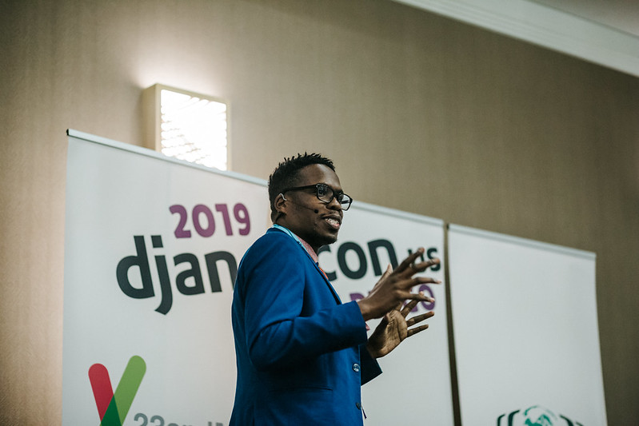
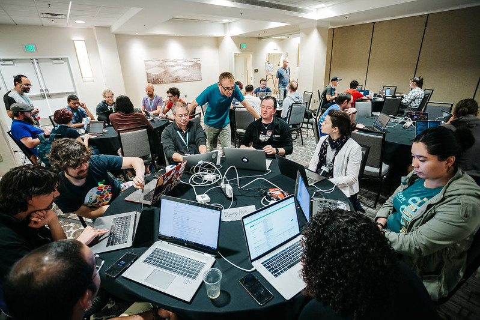
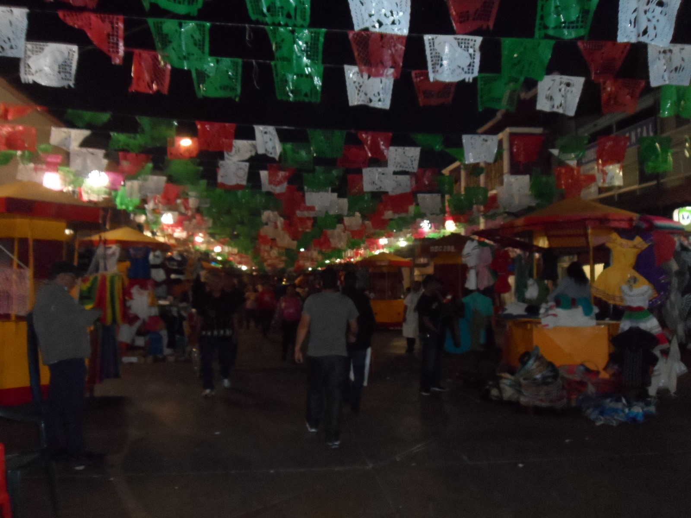
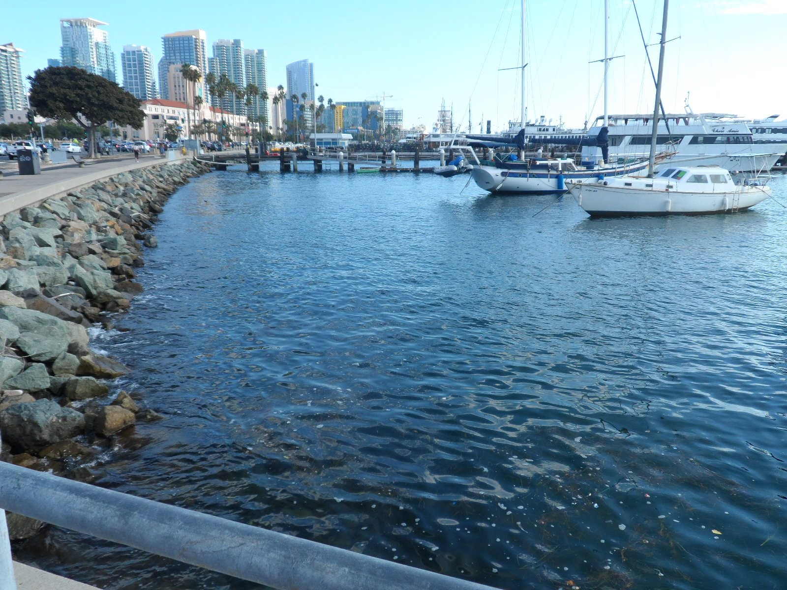

# DjangoCon US 2019 Recap

Published October 28, 2019

### Description

DjangoCon US 2019 took place at Mission Valley Marriott in sunny San Diego from September 22-27. Eldarion’s Katherine Michel shared some insight into what that experience was like and what's on the horizon for Django!

### Blog Post

Conference attendees out by the pool; photo credit: Bartek Pawlik (https://bartpawlik.format.com/)

For the second year in a row, [DjangoCon US](https://2019.djangocon.us/) took place in sunny San Diego and it was great to be back. San Diego is a thriving port city with palm trees, picturesque beaches, and perfect weather year-round. It's hard to imagine anyone not loving this fun location. The conference returned to the gorgeous Mission Valley Marriot, where attendees have a view of a sparkling blue pool in the courtyard surrounded by palm trees.

The format for this year was similar to past years, with one day of tutorials, three days of talks, and two days of sprints, but with one notable difference. One two-track talk day was replaced with a one-track deep-dive day.

The conference was a huge success. Tickets sold out for the second year in a row and the talk lineup was impressive. The deep-dive day in particular was a big hit. Attendees I spoke to enjoyed hearing from experts in the field. The sprint days were also well attended, including a "[How to Contribute to Django](https://2019.djangocon.us/how-to-contribute-django/)" workshop that resulted in quite a few people contributing to Django core.

Also, like DjangoCon US 2018, DjangoCon US 2019 was visibly diverse, I believe the most diverse conference I have ever been to. There were many faces from underrepresented groups in the crowd and I was thrilled to find a line at the women's bathroom throughout the week. It's amazing to see the progress the PyCon US and DjangoCon US communities have made in drastically increasing diversity in just a few years.

### Monday

Kojo Idrissa kicking off DjangoCon with Orientation; photo credit: Bartek Pawlik (https://bartpawlik.format.com/)

Monday kicked off with an [Orientation and Welcome](https://2019.djangocon.us/talk/orientation-and-welcome/) led by [DEFNA](https://www.defna.org/) North American Ambassador and DjangoCon Organizer [Kojo Idrissa](https://twitter.com/Transition). Notably, Kojo asked, what if the audience were primarily black women in their 40s to 60s? White men might start to wonder if they fit there. That is what underrepresented people are dealing with. All are welcome at DjangoCon US.

[Matt Mitchell](https://twitter.com/geminiimatt), a security expert who specializes in working with marginalized groups around the world, gave the opening keynote, "[Building Community and Supporting Others](https://2019.djangocon.us/talk/keynote-matt-mitchelln/)." Matt compared community to the Model/Template/View paradigm (MTV), gave some examples of people and groups who dig deep to find inner strength, including Sheroes, Knowledge House, Torchbox, and Laura Tich of SheHacks, and challenged the audience to see the beauty in the community and be kind to each other.

Matt Mitchell; photo credit: Bartek Pawlik (https://bartpawlik.format.com/)

A few other talks that resonated with me:

In "[The Unspeakable Horror of Discovering You Didn't Write Tests](https://2019.djangocon.us/talks/the-unspeakable-horror-of-discovering-t/)," [Melanie Crutchfield](https://twitter.com/hellomelaniec) explained how she went from not even having one little digusting kale testing leaf in her app Five Up, to wanting to eat that disgusting testing vegetable for real. Yay!

[Peter Baumgartner](https://twitter.com/ipmb) gave a detailed overview of hosting, configuration, web server, and asset options and tradeoffs in "[Prepping Your Project for Production](https://2019.djangocon.us/talks/prepping-your-project-for-production/)," using special slides by [Joni Trythall](https://twitter.com/JoniTrythall), our DjangoCon US Website Designer!

[Casey Faist](https://twitter.com/cfactoid), Heroku's Python Platform Maintainer, gave a great talk, "[Everything you need to know but were afraid to ask about Data Classes](https://2019.djangocon.us/talks/everything-you-need-to-know-but-were-to/)" about the ins and outs of Python Data Classes. Heroku is special to me, as the first platform I ever deployed a Django app to. I'm thrilled that I had the chance to meet Casey at PyCon US and further chat at DjangoCon US! 

After a very popular DjangoCon US 2018 talk about [uncovering gender bias in Harry Potter](https://2018.djangocon.us/talk/a-bossy-sort-of-voice-uncovering-gender/), Eleanor Stribling followed up in 2019 with "[Think Like a Product Manager: Straightforward frameworks for building great products](https://2019.djangocon.us/talks/think-like-a-product-manager-frameworks/)," which provided a product management black box for non-product managers.

Monday ended with an [Opening Reception](https://2019.djangocon.us/social-event/opening-reception/) that evening on the Marriott Lawn. Guests enjoyed drinks and food from buffet-style food stations... the mac and cheese bar was a huge hit!

Opening Reception; photo credit: Bartek Pawlik (https://bartpawlik.format.com/)

### Your Web Framework Needs You

At DjangoCon US 2018, [Carlton Gibson](https://twitter.com/carltongibson), Django Fellow, gave a talk "[Your Web Framework Needs You](https://2018.djangocon.us/talk/your-web-framework-needs-you/)." Carlton acknowleged that the community is more diverse than ever, but the core contributors have continued to be white guys, many of whom have been associated with Django for a very long time and are no longer even contributing. The talk was a call to action to community members to contribute to the Django core code. In short, there is not a quick fix, but change is a priority.

As a side note, after DjangoCon US 2018, a [draft DEP dissolving Django Core](https://github.com/django/deps/pull/47/files) and creating a new model of governance was merged into the Django organization. This DEP is in part intended to fix some of the problems discussed by Carlton in his talk. [James Bennett](https://twitter.com/ubernostrum), the author of the DEP, explained the changes in his blog post "[Core no more](https://www.b-list.org/weblog/2018/nov/20/core/)."

This year, Carlton gave a "[Framework Update](https://2019.djangocon.us/talk/framework-update-carlton-gibson/)." Progress is happening in Django core: the 1328 accepted tickets that existed last year were reduced to 1262 this year, with over 1000 new tickets opened; more than 1200 commits to master branch were made from 290 separate contributors, including new contributors and more contributors overall. Carlton gave examples of areas where individuals or self-organized groups could make improvements to Django core and its docs that could have a massive positive impact. Carlton again extended the invitation, "You're web framework still needs you! Come and join us."

Carlton Gibson; photo credit: Bartek Pawlik (https://bartpawlik.format.com/)

### Tuesday

[Jessica Rose](https://twitter.com/jesslynnrose) kicked off Tuesday with a keynote about a very important topic: "[Burnout and Balance](https://2019.djangocon.us/talk/keynote-jessica-rose/)." Using cognitive psychology and humor, she explained what occupational burnout is, the warning signs (based on the Mayo Clinic diagnostic survey for burnout), and strategies for preventing it or reducing the negative impact of it. I found these strategies very practical and plan to apply them in life. A few strategies in particular: take care of yourself first ("put on your own airmask before helping other people"), invest your energy selectively, and learn to say no.

Jessica Rose giving a burnout demonstration; photo credit: Bartek Pawlik (https://bartpawlik.format.com/)

A few other talks that resonated with me:

In his talk "[Prefetching for Fun and Profit](https://2019.djangocon.us/talks/prefetching-for-fun-and-profit/)," [Mike Hansen](https://github.com/mwhansen/) walked us through what pre-fetching is, the problem it's trying to solve, and how it is implemented. In the process, Mike took a deep dive into the Django code. He suggested that people should dig into the Django internals more often and use their knowledge of it to improve their own code, instead of going directly to Stack Overflow. I like that.

As a maintainer of [Pinax](https://github.com/pinax/), I'm always on the lookout for new ways to improve our process. [Luca Bezerra's](https://twitter.com/lucabezerra_) talk "[Pull Requests: Merging good practices into your project](https://2019.djangocon.us/talks/pull-requests-merging-good-practices/)" provided some good food for thought. Plus, the talk ended with one of Vinta's trademark checklists. I love a good checklist!

### Thank You Dinner

As a [DEFNA Board Member](https://www.defna.org/) and [DjangoCon US Website Chair](https://2019.djangocon.us/), I was treated to dinner on Tuesday evening at the nearby Yard House restaurant, along with speakers, emcees, patrons, and other organizers. It was a pleasure to attend. The atmosphere was warm and relaxed, filled with good conversation and laughs. I got to know my fellow-attendees better. 

Special "thank you" dinner; photo credit: Bartek Pawlik (https://bartpawlik.format.com/)

Plates of appetizers were passed around the tables to share, filled with Wisconsin fried cheese curds, fried mac and cheese, jumbo Bavarian pretezel, fried calimari and poke nachos. I tried calimari, poke, and ahi for the first time. The mini chocolate soufflé cake topped with vanilla ice cream that I had for dessert was divine.

After dinner, a cake was brought out for a special recognition of the longtime service of DjangoCon US volunteer [Ken Whitesell](https://twitter.com/KenWhitesell). Thank you, Ken!

Ken being honored; photo credit: Bartek Pawlik (https://bartpawlik.format.com/)

### Deep-Dive Day

Deep-dive day; photo credit: Bartek Pawlik (https://bartpawlik.format.com/)

Wednesday was the first ever DjangoCon US deep-dive day!

The future of Python and Django has been on the minds of many lately. Community members have been asking how Python can remain relevant and vibrant, instead of becoming a legacy language.

With the async and await keywords having been introduced in Python 3.5, Python is at a crossroads.
The new async model is much more efficient than the traditional sync threading model, and can provide functionality that makes Python and Django hugely scalable and more competitive with major players such as Node and Go.

Unfortunately the sync and async models are largely incompatible.

On the other hand, while sync is operating system managed and async is runtime managed, increasingly more code is being run in the browser. Could Python be run natively in the browser?

What could be more timely than several deep-dive day talks grappling with these subjects?

#### The Natural State of Computers

[Amber Brown](https://twitter.com/hawkieowl), maintainer, and longest standing contributor of the asynchronous networking framework Twisted, started the day with her keynote "[The Natural State of Computers](https://2019.djangocon.us/talk/keynote-amber-brown/)." 

I was thrilled that morning when I met Amber at breakfast. 

Amber Brown; photo credit: Bartek Pawlik (https://bartpawlik.format.com/)

In her keynote, Amber gave a review of the computer architecture and performance landscape. Amber argued that computers are not getting faster and won't. All of the easy options have already been used to improve computer hardware performance. The alternative is to become more efficient, and async IO is far more efficient than traditional techniques that require blocking.

Amber believes that computer performance is driving the async story. She said programming languages need a good async story, or they will lose users. async is nearly universally supported among operating systems and has been around for a long time. In the not so distant past, Node was similar to traditional Python, bound by single thread limits, until async support was added. Python then lost users to Node. 

The tide started turning when async was added to Node. Languages can no longer opt out of async support. While the Python GIL prevents the problems created by multi-threading, it also makes it difficult to use multi-threading in Python. Async is an alternative and can improve the Python async story. 

Amber gave a hat-tip to [Andrew Godwin](https://twitter.com/andrewgodwin) and other contributors who are bringing native async to Django. Amber said adding async to Django will bring async into the Python mainstream. The sky will be the limit. 

#### Async Django

The Django community is embarking on one of the largest changes in Django's history: adding async support to Django core, led by [Andrew Godwin](https://twitter.com/andrewgodwin). 

Andrew's deep-dive day talk "[Just Add Await: Retrofitting Async Into Django](https://2019.djangocon.us/talks/just-add-await-retrofitting-async-into/)" was definitely a highlight of the week for me.

Andrew has done extensive research about how to add async support into Django in a safe, backwards compatible way that maintains the familiarity of the Django API. His approach is detailed in [DEP 0009 (Async in Django)](https://github.com/django/deps/blob/master/accepted/0009-async.rst), which he authored.

Talk slide, current Django high-level architecture plus async

Andrew explained the challenges and opportunities of adding async to Django and gave an update on the work that has been done and is planned for the future:

* Phase One is complete. ASGI support was merged into Django 3.0 ([PR](https://github.com/django/django/pull/11209)), but can't do much yet other than speak to ASGI servers such as Daphne and Uvicorn
* Phase Two is in process. Andrew has async def views working in a branch right now ([branch](https://github.com/django/django/compare/master...andrewgodwin:async_views)), but performance is a struggle at the moment. Once async views are working, a lot of parallel work can begin in bringing async to other parts of Django.
* Phase Three, redefining the ORM for async, involves a lot of research, vision, and implementation work. 

Code development and maintenance are not cheap and an initiative of this scale needs to be properly organized and funded. If you are interesting in helping, Andrew has outlined some ways to help on the [Async Project Page](https://code.djangoproject.com/wiki/AsyncProject)

Andrew had a "Thanks" slide at the end of his talk, but the community should be thanking Andrew for his hard work in bringing async to Django!

In addition to Andrew's talk, I highly recommend watching [Tom Christie](https://twitter.com/_tomchristie)'s DjangoCon Europe 2019 talk, "[Sketching Out a Django Redesign](https://www.youtube.com/watch?v=u8GSFEg5lnU)." Tom contrasted sync and async, explained the benefits of async and why it matters to the longterm success of Django, gave an overview of the ASGI landscape, and praised Andrew's plan of progressively adding async into the Django stack as very achieveable. He believes that while nothing beats Python for productivity, by adding the performance provided by async, Python will hit its sweet spot.

#### Python and WebAssembly

In his talk "[WASM Matter](https://2019.djangocon.us/talks/wasm-matter/)," [Dr. Russell Keith-Magee](https://twitter.com/freakboy3742) talked about the emerging opportunity to use WebAssembly (WASM) to run Python code in the browser. 

Russell told the story of Java and JavaScript. In the mid-90s, Java promised to be the language you could write once and run everywhere, replacing all other programming languages. JavaScript was invented around the same time. Unlike Java, and Python, JavaScript didn't have a standardized byte code format or virtual machine that would make it cross platform. It just worked in the browser. Because of the importance of the browser, developers have tried to "reinvent the universe" using JavaScript. This might have given the appearance that JavaScript would one day become the universal language Java once promised to be. But rather than one language being universal, it might be that the JavaScript runtime becomes universal for programming languages through the use of WASM.

Russell explained what WASM is and how it works. WASM can take code such as Python, that would normally be compiled and run in a virtual machine via a computer operating system, and instead compile it into a ready-to-use binary format that can be run in the browser. Russell gave a review of the landscape, starting with [emscripten](https://emscripten.org/), a tool for compiling code Clang can compile (such as C) into asm.js and WASM binary instead.

Russell gave a few promising ways of using Python and WASM together

* The [Pyodide](https://github.com/iodide-project/pyodide) project uses enscripten to compile the CPython source code to WASM. The result can be used to deploy a Python shell in the browser completely clientside, similarly to a Jupyter notebook session. Because it's big, the smaller implementation Micro Python could be used alternatively.
* Russell's own experiment is [Batavia](https://github.com/beeware/batavia), which implements a CPython virtual machine in pure Javascript, which provides a Python REPL in the browser. Bytecode is run directly, no parsing or compiling needed.

Russell ended by mentioning the great organization [BeeWare](https://beeware.org/).

For a view of the larger picture of the "Black Swan" challenges facing the Python ecosystem as a whole, I also highly recommend watching Russell's excellent [keynote](https://www.youtube.com/watch?v=ftP5BQh1-YM) from PyCon US 2019.

#### Django Framework Deep-Dives

In addition, several stellar talks further explained important aspects of the Django framework itself:

* [Using Django as a Micro-Framework: Hacking on the HTTP handlers and middleware (for fun and profit)](https://2019.djangocon.us/talks/using-django-as-a-micro-framework-on-the/) by [Carlton Gibson](https://twitter.com/carltongibson)
* [The Ins and Outs of Model Inheritance](https://2019.djangocon.us/talks/the-ins-and-outs-of-model-inheritance/) by [Blythe J Dunham](https://github.com/blythedunham/)
* [Generic View? What is that and why would I use it?](https://2019.djangocon.us/talks/generic-view-what-is-that-and-why-would/) by [Felipe Lee](https://twitter.com/felipeleeg)
* [Understanding Django authentication](https://2019.djangocon.us/talks/understanding-django-authentication/) by [Renato Oliveira](https://twitter.com/_renatooliveira)

#### Deep-Dive Day Wrap Up

Deep-dive day ended with [Frank Wiles](https://twitter.com/fwiles) making a call to action for corporate sponsorship of [Django Software Foundation](https://www.djangoproject.com/foundation/).

Conference Chair [Jessica Deatz](https://twitter.com/__deatz__) and Co-Chair [Sara Gore](https://twitter.com/saradgore) then gave the conference closing comments and were presented with special framed photos in appreciation for their hard work.

Jessica and Sara closing out yet another wonderful conference; photo credit: Bartek Pawlik (https://bartpawlik.format.com/)

### Sprints

Sprints took place on Thursday and Friday

On the first day of sprints, Carlton Gibson led a workshop "[How to Contribute to Django](https://2019.djangocon.us/how-to-contribute-django/)." More people than expected showed up and we had to move to a larger area. 

Carlton Gibson helping at a table of sprinters; photo credit: Bartek Pawlik (https://bartpawlik.format.com/)

While we were installing Django, it was pointed out that a bug commonly occurs while installing Django on Mac OS. This bug can be circumvented by using the [django-docker-box](https://github.com/django/django-docker-box) tool. I went ahead and used django-docker-box, which probably sped up my installation process and saved me some frustration. It was great to see so many people sharing knowledge and trouble shooting together.

Later in the day, I made [my first PR](https://github.com/django/django/pull/11838) to Django core. Yay!

In the PR, I [added django-docker-box to the Django docs](https://docs.djangoproject.com/en/2.2/internals/contributing/writing-code/unit-tests/#running-tests-using-django-docker-box) as an installation option. Hopefully, drawing attention to this option will have a big impact in making the local setup process easier for others.

Due to a sick computer and conference travel, Django Fellow [Mariusz Felisiak](https://twitter.com/MariuszFelisiak) assisted me in updating and merging this important PR. I'm proud to have left the campground better than I found it, as my friend Jeff would say.

The [workshop notes](https://github.com/carltongibson/dcus2019sprints) are open source for anyone who would like to use them to contribute!

A special shoutout to Django Core Dev [Chris Beaven](https://twitter.com/SmileyChris) of Lincoln Loop who personally assisted people at my table with troubleshooting.

The Sprints also included an "[Intro to Contributing to Open Source](https://2019.djangocon.us/intro-contributing-open-source/)" workshop led by [Jeffrey Eliasen](https://twitter.com/jeffreyeliasen), as well as a Git Help Desk.

### Sight Seeing

If the conference wasn't amazing enough, I had time to do some spectacular sightseeing in San Diego.

Here are some highlights:

The night of my arrival, I enjoyed a simple, but magical evening in downtown San Diego's [Little Italy district](https://www.littleitalysd.com/). After eating delicious alfredo and zucchini pasta for supper at [Landini's Pizzeria](https://www.landinispizzeria.com/menu/), I wandered through the large, open-air [piazza](https://www.littleitalysd.com/explore/piazza-della-famiglia). People relaxed at tables, eating ice cream and Italian food, under the colorful lights strung overhead, amid the sound of accoustic guitar music and water flowing in a nearby fountain. 

Little Italy piazza; photo credit: Katherine Michel

I happened to look down the street at the marina in the distance. For several breathtaking minutes, I gazed at the boats and water dramatically illuminated by a pastel sunset. Wow!

Looking down the street at the sunset illuminating the marina; photo credit: Katherine Michel

In 2018, I traveled to Coronado Island by bus and got off at the [Hotel del Coronado](https://hoteldel.com/) bus stop in search of Coronado Beach. Having known nothing in advance about the location, I was gobsmacked to find a beach-front hotel that felt like a movie set. Walking around back, I found the greenest of manicured grass, palm trees rising high into the air, and in the distance, Coronado Beach glittering gold under the sun. It was a jawdropping moment that I'll never forget.

This year, I wanted to see some other San Diego beaches, so I traveled to [Mission Beach](https://en.wikipedia.org/wiki/Mission_Beach,_San_Diego) and [Ocean Beach](https://en.wikipedia.org/wiki/Ocean_Beach,_San_Diego).

Walking along Mission Beach boardwalk, for the first time, I experienced the quintessential California culture I had read about and seen on TV. On the strip, there were brightly painted taco, ice cream, and surf shops. The boardwalk was lined with cottages and palm trees. In the distance, beachgoers sunbathed, swam, made sand castles, ran along the water and played beach volleyball. Surfers in body suits carried their surfboards to and from the ocean. Rollerbladers deftly maneuvered through the crowds.

Mission Beach; photo credit: Katherine Michel

At Ocean Beach, I walked to the end of the pier, the longest concrete pier on the west coast at 1,971 feet, for a panoramic view of the ocean and beach.

Walking to the end of Ocean Beach Pier; photo credit: Katherine Michel

Looking out at Ocean Beach from the pier; photo credit: Katherine Michel

Afterward, I returned to San Diego proper and embarked on a tour of [Tijuana](https://en.wikipedia.org/wiki/Tijuana). For me, an important part of having the opportunity to travel is to learn about and enjoy the local culture and this was the perfect opportunity to do that. I was amazed to find out that the border between the US and Mexico can be reached from downtown San Diego in about 45 minutes by Trolley. Led by a tour guide who grew up Tijuana, we were issued one-day visas, then walked into Mexico. We went to the Tijuana Wax Museum, walked the downtown, ate tacos, and went to a club.

Walking through a street market in Tijuana; photo credit: Katherine Michel

Later in the week, I walked the [embarcadero](https://www.portofsandiego.org/where-to-go/embarcadero), went to the [Midway](https://www.midway.org/) museum, and took a cruise of the harbor. With a clear blue sky and water the gorgeous pictures practically take themselves at the embarcadero. The Midway museum was incredible. I particularly enjoying standing at the end of the deck on a walkway suspended above the ocean, then taking the Bridge Tour, which included the Flight Control, Chart Room, Navigation Bridge, and Admiral and Captain's Quarters. And the harbor cruise was a great way to relax at the end. The ship circled the bay with the Captain pointing out the notable sights. The California sea lions were a highlight for me, as well as the stunning San Diego skyline.

Beautiful view along the embarcadero; photo credit: Katherine Michel

Midway Bridge and plane; photo credit: Katherine Michel

View of the Midway Hangar Deck from the Navigation Bridge; photo credit: Katherine Michel

View of the San Diego skyline from harbor cruise; photo credit: Katherine Michel

That night, I went to the [Taco Stand](http://downtown.letstaco.com/) where I enjoyed a Carne Asada Taco and Grilled Pescado Taco (Mahi Mahi). I had never had a fish taco before. The combination of grilled fish, cabbage, and chipotle sauce was delicious in a way I hadn't anticipated. Thank you to [Trey Hunner](https://twitter.com/treyhunner) for one of many great recommendations.

Yummy tacos at Taco Stand; photo credit: Katherine Michel

Afterward, for dessert, I visited [Salt and Straw](https://saltandstraw.com/flavors/#sd) ice cream shop in Little Italy. Their ice cream cups are a familar sight in Little Italy. I am still dreaming of the Sea Salt with Caramel Ribbons ice cream I had there that night. Can't wait to go back sometime.

Delicious Salt and Straw ice cream; photo credit: Katherine Michel

### Join Us?

If you enjoyed this blog post, you might enjoy reading my [PyCon US 2019 blog post](https://eldarion.com/blog/2019/06/01/recap-pycon-us-2019/), or watching the replay of the DjangoCon US 2018 "[State of Django](https://2018.djangocon.us/talk/state-of-django-panel/)" panel, in which several DEFNA Board Members, including myself, and other community members talk about our efforts.

My DjangoCon experience couldn't have been better. I learned a ton, networked with friends new and old, and had some once-in-a-lifetime sight seeing moments. Thank you to Chair [Jessica Deatz](https://twitter.com/__deatz__), Co-Chair [Sara Gore](https://twitter.com/saradgore), and all of the organizers, speakers, and attendees who made DjangoCon US 2019 a special conference.

Join us next year... ?

Organizers, including me; photo credit: Bartek Pawlik (https://bartpawlik.format.com/)
