# DjangoCon US 2023 Recap

Table of Contents
-----------------

- [Intro](#intro)
- [Pre-Conference Activities](#pre-conference-activities)
    - [DEFNA Board Dinner](#defna-board-dinner)
    - [Django Girls Workshop](#django-girls-workshop)
    - [Swag Stuffing](#swag-stuffing)
    - [Django Social](#django-social)
        - [Meeting the New PSF Executive Director Deb Nicholson](#meeting-the-new-psf-executive-director-deb-nicholson)
        - [A Chance to Hang Out with Old Friends and Make New Friends](#a-chance-to-hang-out-with-old-friends-and-make-new-friends)
- [Monday](#monday)
    - [Meeting the New Django Fellow Natalia Bidart](#meeting-the-new-django-fellow-natalia-bidart)
    - [Kojo Idressa and Peter Grandstaff Kick Off the Conference](#kojo-idressa-and-peter-grandstaff-kick-off-the-conference)
    - [Finding Purpose in Open Source Through Community Building](#finding-purpose-in-open-source-through-community-building)
    - [HTML-ivating your Django web app's experience with HTMX, AlpineJS, and streaming HTML](#html-ivating-your-django-web-apps-experience-with-htmx-alpinejs-and-streaming-html)
    - [Fried Green Tomatoes :)](#fried-green-tomatoes-)
    - [What Can the DSF Do for Me? What Can I Do for the DSF?](#what-can-the-dsf-do-for-me-what-can-i-do-for-the-dsf)
    - [Parts and Labor, The Parlour, and Back to the Hotel](#parts-and-labor-the-parlour-and-back-to-the-hotel) 
- [Tuesday](#tuesday)
    - [Hallway Track](#hallway-track)
        - [Django Social T-Shirt](#django-social-t-shirt)
        - [Coherence Demo](#coherence-demo)
    - [Navigating Django's Future: Djangonaut Space](#navigating-djangos-future-djangonaut-space)
    - [Don't Buy the "AI" Hype](#dont-buy-the-ai-hype)
    - [An Approach to Lightweight Tenancy Management Using Django Rest Framework](#an-approach-to-lightweight-tenancy-management-using-django-rest-framework)
    - [Speaker and Organizer Dinner](#speaker-and-organizer-dinner)
- [Wednesday](#wednesday)
    - [Testing Modern Web Apps Like a Champion](#testing-modern-web-apps-like-a-champion)
    - [Inside Out: My Journey of Understanding Inclusion](#inside-out-my-journey-of-understanding-inclusion)
    - [DjangoCon Africa](#djangocon-africa)
    - [Another Great Adventure](#another-great-adventure)
    - [Conference Conclusion](#conference-conclusion)
- [Sight Seeing and More Food](#sight-seeing-and-more-food)
    - [Sarah P. Duke Gardens](#sarah-p-duke-gardens)
    - [Duke Chapel](#duke-chapel)
    - [Museum of Life and Science](#museum-of-life-and-science)
    - [Parizade](#parizade)
    - [Loaf](#loaf)
    - [Pizzeria Toro](#pizzeria-toro)
    - [Simon Says Dip This](#simon-says-dip-this)
    - [Press Coffee, Crepes, and Cocktails](#press-coffee-crepesand-cocktails)
- [In Closing](#in-closing)

## Intro

Disclaimer: the content of this post is a reflection of my career journey and not specific to my work at JPMorganChase.

DjangoCon US 2023 took place from October 16-20 in Durham, North Carolina. It was the sixth DjangoCon US I've had the privilege of attending, and in my opinion, the best one yet. 

Attendees (photo credit: Bartek Pawlik (https://bartpawlik.format.com/))

[**back to top**](#table-of-contents)

## Pre-Conference Activities

### DEFNA Board Dinner

Things got off to a great start with a DEFNA Board dinner at [Parizade](https://www.parizadedurham.com/menus/) on Saturday night. 

According to every person I spoke to who had eaten there before, you can't go wrong. Everything is so good. I'd never eaten linguini and clams before, but it sounded really good. I decided to be adventurous and try it. If you won't do something new on the eve of DjangoCon US, when will you? I chose well.  

It was a rare opportunity to spend time in person with other board members and enjoy a perfect meal. 

Wow...

Apple Pie Mezcal Margarita ("Del Maguey Vida Mezcal, triple sec, lime juice, apple pie syrup, salted rim")

Linguini and clams ("chorizo, cherry tomatoes, toasted garlic, white wine sauce, tarragon bread crumbs")

<!--
https://www.linkedin.com/posts/katherinemichel_thank-you-to-our-defna-president-peter-grandstaff-activity-7119291550492233728-wBC5?utm_source=share&utm_medium=member_desktop
-->

DEFNA Board (photo credit: Bartek Pawlik (https://bartpawlik.format.com/))
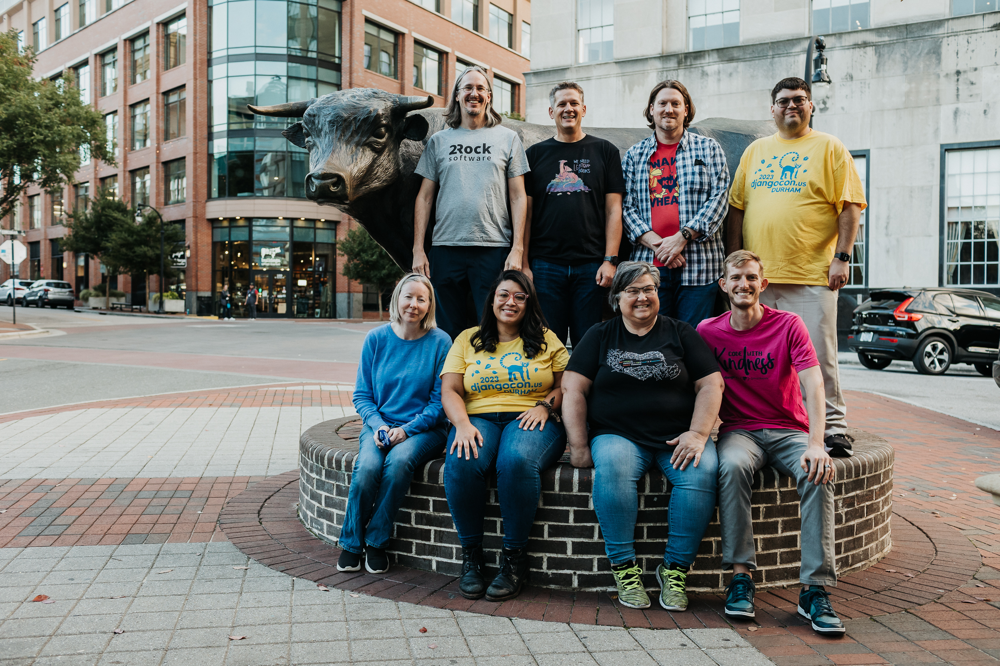

[**back to top**](#table-of-contents)

### Django Girls Workshop

I love a good cup of coffee. On Sunday, I ventured to nearby [Cocoa Cinnamon](https://littlewaves.coffee/pages/old-north-durham) coffee shop. I had a Dr. Durham Latte ([organizer recommended](https://2023.djangocon.us/venue/#places)). 

Cocoa Cinnamon Coffee Shop

Dr. Durham Latte ("House made vanilla bean syrup, maca root, and ginger topped with black lava salt")

With coffee in hand, I was looking for the [Durham Convention Center](https://www.durhamconventioncenter.com/) to help with organizing, got lost, and serendipitously stumbled upon the [Django Girls](https://djangogirls.org/en/durham/) Workshop hosted at the office of our wonderful, longtime partners [Caktus Group](https://www.caktusgroup.com/). I was reunited with my friends Dawn Wages, Jay Miller, Jason Judkins, Rebecca Conway, and Tim Allen. It was a great time at an event where lives are changed. The event featured a majority of Black participants! While at the workshop, I enjoyed food from [Neomonde Mediterranean](https://www.neomonde.com/mediterranean-restaurant-durham/) ([organizer recommended](https://2023.djangocon.us/venue/#places)), caught up with my friends, and picked up some swag! 

So good to be welcomed in by my friend Tim :)

Django Girls lunch from Neomonde Mediterranean

I've always wanted one of these shirts! 

[**back to top**](#table-of-contents)

### Swag Stuffing

I eventually made it to the Durham Convention Center for swag stuffing! Many hands make light work.

Swag stuffing operation (I spy a [DEFNA](https://www.defna.org/) sticker!)

[**back to top**](#table-of-contents)

### Django Social

Later that night, I attended Django Social at [Ponysaurus](https://www.ponysaurusbrewing.com/taproom). The event was hosted by Jason Judkins, DjangoCon US Organizer, and Jon Gould of [Foxley Talent](https://foxleytalent.com/about/), DjangoCon US Sponsors. 

Jon and company have started a network of Django meetups in the UK called Django Social. Jason is starting a [Raleigh-Durham chapter](https://www.meetup.com/djangosocial-raleighdurham/) and this was the kickoff. 

Not being a fan of beer, I had a Ponysaurus signature [Beer Cocktail](https://www.ponysaurusbrewing.com/taproom-menu) called a Gosé Margarita (lime juice, triple sec, & tequila, topped with Gosé beer). 

Gosé Margarita 

[**back to top**](#table-of-contents)

#### Meeting the New PSF Executive Director Deb Nicholson

During the event, I happened to find myself having a conversation with a woman who really knew a lot about open source and events! It turned out to be the new [Python Software Foundation Executive Director Deb Nicholson](https://www.python.org/psf/records/staff/). Serendity strikes again. I love it when that happens. :) She was accessible throughout the conference, and it was a wonderful place to get to know her. Check out her Monday talk [Meet-ups: A Grand Vision for a Humble Endeavor](https://2023.djangocon.us/talks/meet-ups-a-grand-vision-for-a-humble-endeavor/). 

Me and PSF Executive Director Deb Nicholson later in the week 

[**back to top**](#table-of-contents)

#### A Chance to Hang Out with Old Friends and Make New Friends

Hanging out with favorite Python/Django authors Eric Matthes and William Vincent, and my wonderful Revsys friend and fellow DEFNA Board Member Jeff Triplett

[**back to top**](#table-of-contents)

## Monday

### Meeting the New Django Fellow Natalia Bidart

On Monday, I ate breakfast with our new [Django Fellow Natalia Bidart](https://www.djangoproject.com/weblog/2023/mar/31/welcome-our-new-fellow-natalia-bidart/). I was thrilled to meet her! We talked about our work, what her experience has been like so far as a Django Fellow, and she introduced me to the art of drinking [maté](https://en.wikipedia.org/wiki/Mate_(drink)).

[**back to top**](#table-of-contents)

### Kojo Idressa and Peter Grandstaff Kick Off the Conference

DEFNA North America Ambassador Kojo Idressa kicked of the conference with the the kind of [Orientation and Welcome](https://2023.djangocon.us/talks/orientation-and-welcome/) that only he can deliver. 

Thank you Kojo for setting the stage for a wonderful conference. 

Kojo also educated the audience about the concept of a Self Care Sprint. It's important to take time for yourself, as needed. 

Self Care Sprint

During the Opening Remarks, Conference Chair Peter Grandstaff asked everyone to be kind and make this conference a great place for everyone else. "If you see someone engaging in inappropriate behavior, here's a phrase you can use, 'Hey, we don't do that here.'"

A powerful tool borrowed from PyCon Australia and written about by Eric Holscher of [Read the Docs](https://about.readthedocs.com/) and [Write the Docs](https://www.writethedocs.org/) for setting norms: "[Hey, we don't do that here.](https://www.ericholscher.com/blog/2023/feb/10/we-dont-do-that-here/)"

[**back to top**](#table-of-contents)

### Finding Purpose in Open Source Through Community Building

Abigail Mesrenyame Dogbe delivered the keynote [Finding Purpose in Open Source Through Community Building](https://2023.djangocon.us/talks/keynote-finding-purpose-in-open-source-through-community-building/). 

When Abigail was young, she didn't like math, science, and computers. Her parents would show her how to do a chore, then leave her to do it herself. She credits them with having taught her how to bring people into open source. That is her purpose in life. 

In 2017, after her undergraduate studies, she took part in a Django Girls workshop with DjangoCon US Organizer Noah Alorwu as her mentor. She was encouraged to give back by teaching other women how to code. She went on to be an organizer or mentor at 25 events with 500+ participants in cities and and remote areas of Ghana. She was happy to be the first female mentor, but not satisfied. She encouraged other women to become involved. 

Only two years later, at PyCon Africa Django Girls workshop in Ghana, all of the coaches were women. It was a proud moment and a result of that effort. 

Abigail told the stories of six people she had met through her open source work. Some were shy or inexperienced. Others were more established. Some were coders, some weren't. Some had a passion. Others were trying to figure out where they could fit in. She was able to get to know them and see their potential. Like her parents, she taught them how to do tasks, then left them on their own to grow into leadership and perhaps find themselves in the process. She has been able to "10x" her impact this way. 

Abigail talked about some of the challenges faced:  
* Lack of opportunities (especially for junior developers)
* Lack of paid open source work
* Lack of resources
* Travel and visa difficulties

Abigail missed out on some high profile international speaking opportunities due to visa denials. Being a US grad student has opened doors. 

Abigail talked about organizers who have grown the Africa Python/Django community, looked out for her, and pushed her outside of her comfort zone. 

She is currently on a journey to become an open source program manager, using all of her lessons learned. Contributing to open source has helped her develop resilience, embrace discomfort, achieve personal growth, and find purpose. 

Her organizer resume is impressive: Django Girls, PyLadies Ghana, PyData Ghana, PyLadies Morovia, PyLadies Zambia and other PyLadies communities, PyLadies Global, PyCon Ghana 2018, PyCon Africa, PSF internship, Everything Open Research (a non-profit she started), and DE&I research

She invited the audience to DjangoCon Africa in Zanzibar, Tanzania from November 6-11. Another PyCon Africa is also in the works. 

She asked the audience to consider how they are helping bring people into open source, especially people who do not necessarily love coding. She hopes her story will inspire others to give back to their local communities. 

Abigail and I have been following each other on social media for quite a while. I was really excited to meet her in person! 

Me and Abigail
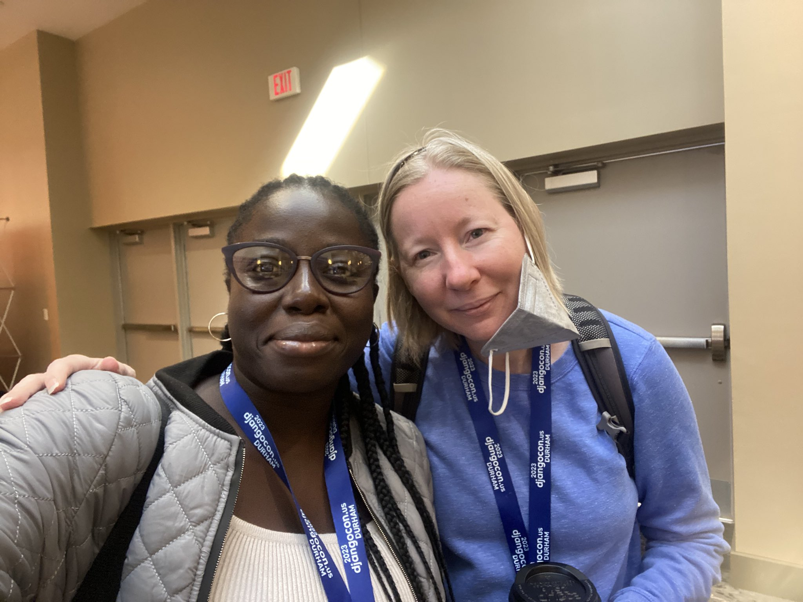

[**back to top**](#table-of-contents)

### HTML-ivating your Django web app's experience with HTMX, AlpineJS, and streaming HTML

Chris May has been a long-time appreciator of the Django community and wants to give back by elevating the experience of your Django app through his talk [HTML-ivating your Django web app's experience with HTMX, AlpineJS, and streaming HTML](https://2023.djangocon.us/talks/html-ivating-your-django-web-app-s-experience-with-htmx-alpinejs-and-streaming-html/).

<!--
Chris was once a graphic designer and learned how user experience could drastically transform any project. He fell in love with Python in 2007, and his passion is helping other people enjoy Python and their websites. 
-->

Chris began by talking about the prevalent architectural pattern of SPAs. 

Chris believes that better user experience drove their popularity.

But, SPAs have been overused. 
!["SPAs incur complexity that simply doesn't exist with traditional server-based websites: issues such as search engine optimization, browser history management, web analytics and first page load time all need to be addressed. Proper analysis and consideration of the trade-offs is required to determine if that complexity is warranted for business or user experience reasons. Too often teams are skipping that trade-off analysis, blindly accepting the complexity of SPAs by default even when business needs don't justify it. "](djangocon-us-2023-recap-images/chris-spa-thoughtworks.png)

<!--
"We still see some developers who aren't aware of an alternative approach because they've spent their entire career in a framework like React." [Thoughtworks on SPAs](https://www.thoughtworks.com/en-us/radar/techniques/spa-by-default#:~:text=SPAs%20incur%20complexity%20that%20simply,all%20need%20to%20be%20addressed.)

As an organizer at [PyRVA](http://www.pyrva.org/), he comes across many people who are excited to learn Python, but discouraged by the common job posting requirement of knowing React or some other JavaScript framework. 
-->

Spa user experience is no longer an advantage. 

Chris referred to a real life case study [Making the world’s fastest website, and other mistakes](https://dev.to/tigt/making-the-worlds-fastest-website-and-other-mistakes-56na) by Taylor Hunt, a developer at a supermarket chain. Taylor knew their web app needed a better experience and wanted to record what customers experienced. 

He bought several popular phones, gave them to people, and recorded them performing a task. He asked them to load either the production web app, super market chain native app, or the competitor amazon.com or walmart.com apps. Once loaded, search for eggs, add the first result to the shopping cart, and start the checkout process. 

Chris showed a video of the results. 

Each app takes a significant amount of time to accomplish the task, sometimes with a lag between the time the user touches the device and app response. The apps took between 59 seconds and 4 minutes to finish. 

<!--
amazon.com takes the lead, returns the wrong response, and finishes in 59 seconds. The native app is slowest to start, but finishes second at 1:21. The other two websites take almost 4 minutes to accomplish the task. 
-->

Ranging from 59 seconds to 4 minutes to finish
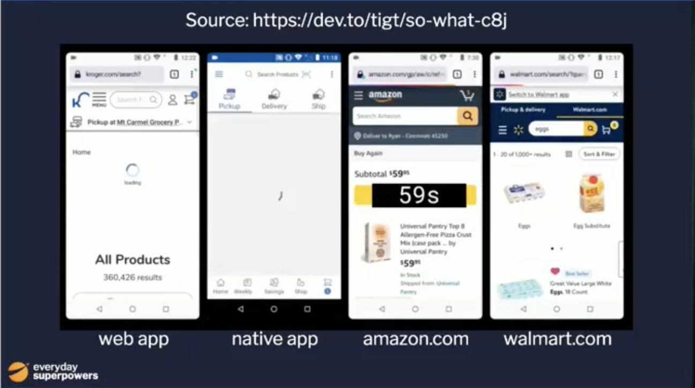

Taylor knew it could be better and had a vision: "Be so fast it’s fun on the worst devices and networks our customers use."

He found some advice from 2017- for optimal website performance, establish a budget of 130 kb or less (first download- HTML, CSS, JavaScript). Due to the third party JavaScript data collection tools and use of ReactJS and Redux in the production app, he could not meet the budget as a SPA app. He decided to focus on HTML, with minimal CSS and laser-focused JavaScript that required complex interactivity. 

His demo app was the functional equivalent of the production app (using same phone, internet, server, APIs, data), with a drastically elevated experience. Much quicker to load and interact with, it finished in 20 seconds. 

20 seconds to finish! 

Due to the capabilities of new tools, Django websites can be just as friendly as SPAs and much easier to maintain. In the talk, Chris would show us how. 

Chris told the story of Caleb, a Laravel developer at Titan, one of the best PHP shops. He realized there was a significant cost and complexity to SPAs, so he decided to default to traditional web apps and only choose a SPA when needed. But, after starting to create a web app, he would always feel a gravitational pull back to SPA. He realized the seminal decision causing this would be when you decide to return JSON from the server. You need JavaScript on the page to receive the request. If you return HTML, you need much less JavaScript on the page to handle it. He created a framework called [Livewire](https://laravel-livewire.com/) for Laravel Developers. 

<!--
[django-unicorn](https://www.django-unicorn.com/) has the same philosophy. 
-->

Python and Django devs have adopted a different framework called [HTMX](https://htmx.org/) that is growing in popularity. HTMX enables JavaScript-like functionality, without the use of JavaScript, such as re-rendering part of a page using AJAX at the cost of just 14 kb. 

Alpine was created to support Livewire. According to Chris, it's an incredible framework that can create rich interactions with very little JavaScript. Its focus is the in-page experience. You can use it to create mobile components, make dynamic forms. It is reactive, so any data on the page associated with HTML will updated when changed. 

HTMX and Alpine together can enable you to give your users a SPA-like experience for less than 30 kb. 

<!--
While both of these frameworks have JavaScript interfaces, they are optimized to use HTML attributes. Instead of working with JavaScript and making it compile, with HTMX and Alpine, you can define the behavior in your HTML file. You can potentially remove the JavaScript build system. 
-->

These two frameworks, along with Tailwind CSS have brought the joy of web dev back to his life. He hadn't realized how much it had faded over time. 

<!--
(this creates locality- see Carlton Gibson's talk)

Chris referred to a talk by David Guillot at DjangoCon Europe. David described his company's transition from React to HTMX. There were no negative tradeoffs. There were positive tradeoffs. By removing React, you can make use of the native browser, which creates many new possibilities such as the capability of rendering large docs. Website performance was also a big win. Django/React interactivity took up to six seconds to render. The Django/HTMX version took up to 2. 
-->
   
Chris then wanted to focus on the "Be fast" component of elevated experience, which he said could trump the rest. 

SPAs using React and other JavaScript frameworks have a hidden cost- time to boot up. 

<!--
While working the HTTP Archive, an archive of as much of the web as possible, Tim Kadlec found that half of all websites built with React took over ten seconds to render on a mobile device. 10% of sites build with React took over 25 seconds to load on mobile, which can lead to significant user experience issues. 
-->

Chris went back to the production app and demonstrated that the JavaScript prep took so much phone resource that it caused the text input to lag. The eggs search was deleted and the app then attempted to find 360,000 items and summarize them on the page instead. The user would then have to research, taking over a minute and a half. 

In the demo app, the transaction happens very quickly, before the app has finished loading. As soo as the search bar appears, it is able to be used for a search. Critical elements are delivered as quickly as possible, and the user is not prevented from accomplishing their goal. 

Chris wants Python developers to be able to do this. 

Currently, Python will obtain all of the data, put it in the template, then send it in the response. This is ok, but can hurt user experience. 

Chris proposes that when the request comes in, we start sending the template as soon as we can and continue sending pieces of it as they become available, until it's done. This can be done using streaming HTML technology that has been around since 1997. Every browser is already optimized to use it. 

<!--
What we want...
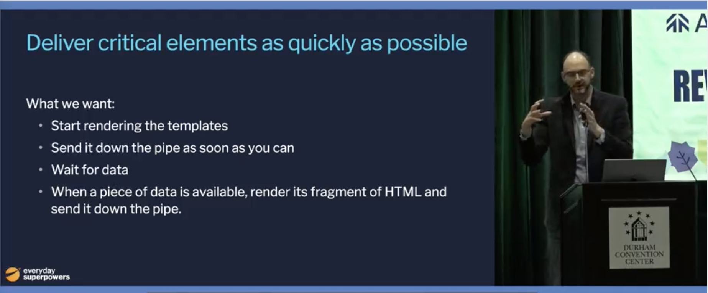
-->

Chris created a recommendation engine and engineered it to take up to five seconds to load recommendations on the homepage. 

<!--
Currently, we won't see anything on the page until all of the template is complete. 
-->

If the CSS container element does not have four items, the page will render the CSS skeleton elements shaped like the eventual content. This will prevent the page from jumping around as it renders. Each recommendation will be sent when it is ready. Meanwhile, the user can use the site. 

<!--
He called this a ridiculous example and acknowledged that all sorts of things outside of our control can slow things down, but said it's a great pattern. He showed an example of this in real life in the wild. In a GitHub repo, when you click on any file to drill down into it, GitHub allows critical elements to appear quickly and does not prevent you from accomplishing your goal, but nice to have details load async. 
-->

He demonstrated how to create the demo functionality in Django using Django 4.2's new `StreamingHttpResponse` async functionality. Unfortunately, as of the conference, this pattern only works with Jinja templates. 

He also showed some patterns that work with Django templates too. 

<!--
HTMX Server-Side Events
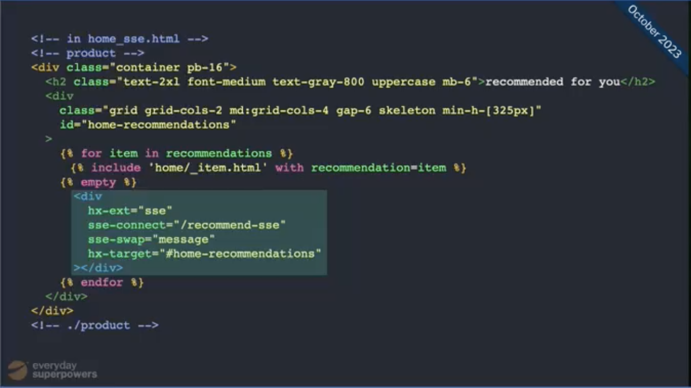
-->

These are not the only options. Chris has created a [web-async-patterns repo](https://github.com/PyHAT-stack/web-async-patterns) in PyHAT-stack GitHub organization. He wants your contributions. He believes that the community can create better patterns that empower us and enable Django to do new things. 

Chris closed by summarizing what created an exception experience. 

[**back to top**](#table-of-contents)

### Fried Green Tomatoes :)

At lunch... trying a fried green tomato for the first time!

[**back to top**](#table-of-contents)

<!--
### Wes Kendall and Maxwell Muoto

[Using database triggers to reliably track model history](https://2023.djangocon.us/talks/using-database-triggers-to-reliably-track-model-history/)
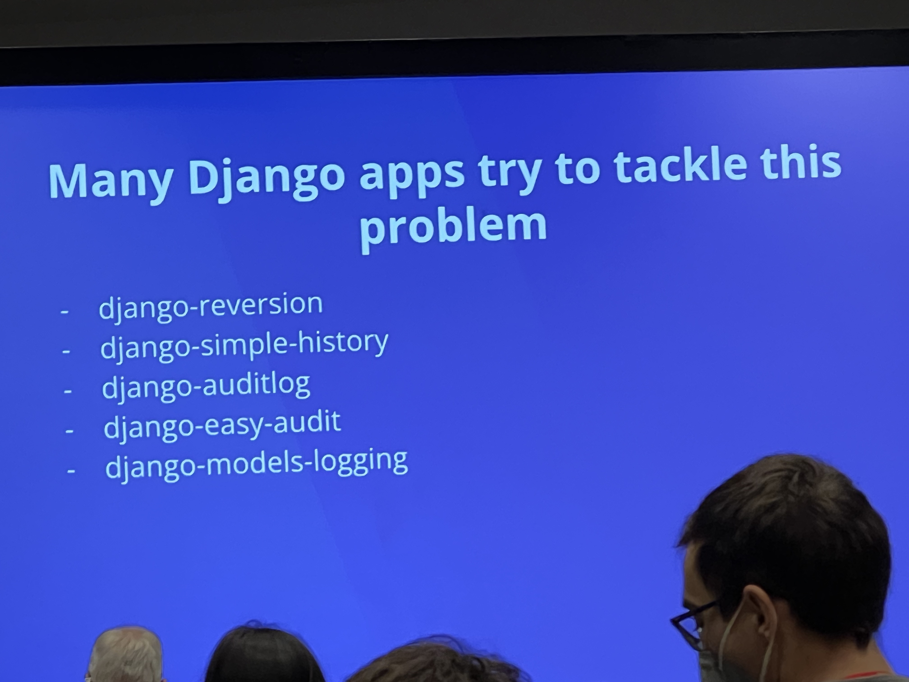

Summary
-->

### What Can the DSF Do for Me? What Can I Do for the DSF?

Chaim Kirby, Django Software Foundation (DSF) President, asked [What Can the DSF Do for Me? What Can I Do for the DSF?](https://2023.djangocon.us/talks/what-can-the-dsf-i-do-for-me-the-dsf/)

What can the DSF do for me? He gave a report card:
* Support development of Django by sponsoring sprints, meetups, gatherings and community events: B
* Promote the use of Django among the World Wide Web development community: D
* Project the intellectual property and the framework's long-term viability: A
* Advance the state of the art in web development: no grade

Chaim gave a special thanks to DSF Board Assistant Catherine Holmes: "Honestly, we could disappear and if Catherine sticks around, things keep going."

What can I do for the DSF?

Chaim announced two new initiatives: 
* Change to DSF membership qualification
* DSF Working Groups

In the past, DSF membership has been available to people who shared IP with the DSF- that is, literally wrote code or documentation. 

DSF membership will now go beyond code or documentation to recognize the myriad of ways that people support the Django community. It will be predicated on making meaningful contributions toward the purpose of the DSF.  

The DSF is also changing how its day-to-day work gets done by re-distributing power from the DSF Board to working groups. The working groups will be tracked in the [DSF Working Groups GitHub repo](https://github.com/django/dsf-working-groups). If you have an idea for how to better achieve a DSF goal, there is a process and template. You can nominate yourself to define a working group and the board will review, with the potential for a budget. 

Chaim gave a special thanks to Jacob Kaplan-Moss for taking the lead on the DSF Working Groups initiative. 

For more info, check out Jacob's blog post [Announcing DSF Working Groups](https://www.djangoproject.com/weblog/2023/oct/13/announcing-dsf-working-groups/).

During the sprint, Jacob also submitted a [pull request](https://github.com/django/deps/pull/81) to update the Django Enhancement Process (DEP) process docs. 

Jacob talking to attendees about the new DSF Working Groups initiative

It's great that the creators and early architects of Django continue to be engaged with and accessible to the community. Check out this DjangoCon 2008 [Schema Evolution Panel](https://fosstodon.org/@simon@simonwillison.net/111310910516740202) that Django Co-Creator Simon Willison recently unearthed featuring himself, Andrew Godwin, and Russell Keith-Magee. :)

[**back to top**](#table-of-contents)

### Parts and Labor, The Parlour, and Back to the Hotel

That night, I walked with a group of fellow conference-goers to [Parts and Labor](https://partsnlabor.com/) for light food and drinks. 

Parts and Labor margarita

Afterward, I had a scoop of chocolate ice cream from [The Parlour](https://theparlour.co/) ([organizer recommended](https://2023.djangocon.us/venue/#places)). 

The Parlour

Parlour flavors

Back at the hotel, a late night chat... great crew :) (© 2023 Paolo Melchiorre CC BY-SA 4.0)

Incidentally, on the first sprint day, Paolo, along with Will Vincent, presented μDjango, a single file Django micro project. Read about its inception on [Paolo's blog](https://www.paulox.net/2023/10/26/udjango_micro_django/#history). 

[**back to top**](#table-of-contents)

## Tuesday

### Hallway track

Ken Whitesell at the registration desk 

[**back to top**](#table-of-contents)

#### Django Social T-Shirt

On Monday, I was fortunate to come into the possession of one of Foxley Talent's Django Social T-shirts. :) 

Me wearing my Django Social T-shirt with Django Social Organizer and Foxley Talent Principal Jon Gould

[**back to top**](#table-of-contents)

#### Coherence Demo

Two members of our party at Parts and Labor had founded a startup called [Coherence](https://www.withcoherence.com/). 

On Tuesday, I stopped by their sponsor table for a demo. 

Coherence demo

Coherence is an alternative to traditional PaaS built on top of AWS and GCP that provides:
* Full-stack previews
* Build pipelines
* Static and production environments
* Cloud IDEs
* Hosted web-based SSH tools for secure & audited access to REPL or databases in each environment
* Polished UI for admin and deployments
* Infrastructure-as-code

Check out the [docs](https://docs.withcoherence.com/)! 

Coherence brand

[**back to top**](#table-of-contents)

<!--
### Pavel Sviridov

https://2023.djangocon.us/talks/decoding-ddd-a-three-tiered-approach-to-django-projects/
-->

### Navigating Django's Future: Djangonaut Space

It was at [DjangoCon US 2018](https://2018.djangocon.us/) that I personally first recall a growing sense of discontent being publicly expressed, for example in this talk that year by former Django Fellow Carlton Gibson, [Your Framework Needs You](https://youtu.be/1BFjg9XtptM?si=oUQr3y2monEzCoud). 

I wrote about it in this [DjangoCon US 2019 recap blog post](https://github.com/KatherineMichel/portfolio/blob/master/conference-blog-posts/recap-of-djangocon-us-2019.md#your-web-framework-needs-you). 

"Carlton acknowleged that the (Django) community is more diverse than ever, but the core contributors have continued to be white guys, many of whom have been associated with Django for a very long time and are no longer even contributing. The talk was a call to action to community members to contribute to the Django core code. In short, there is not a quick fix, but change is a priority."

In the words of Carlton Gibson, "How do we get non-white blokes?"

After DjangoCon US 2018, [DEP 10](https://github.com/django/deps/blob/main/final/0010-new-governance.rst) dissolving Django Core and creating a new model of governance was accepted. This DEP was in part intended to fix some of the problems discussed by Carlton in his talk. James Bennett, the author of the DEP, explained the changes in his blog post [Core no more](https://www.b-list.org/weblog/2018/nov/20/core/). Django project was not attracting enough new contributors to replace the ones becoming inactive and there was a lack of diversity among those new contributors. 

During the [DjangoCon US 2022 State of Django Panel](https://youtu.be/IumYtz0G5v0?si=J6G24BdVXIf-94ZS), this gap was still strongly felt. This was a topic that had come up many times before, but nothing had been done. Django Fellow Mariusz Felisiak said, "My hot take is that we need a mentorship program... for new Django Core Developers." 

Dawn Wages, PSF Chair, and Rachell Calhoun, Django Girls Trustee, knew this was a powerful idea and went to work. 

Also inspired by the DjangoCon US 2022 State of Django Panel, [DEP 12](https://github.com/django/deps/blob/main/final/0012-steering-council.rst) was an effort to encourage diversification of the Django Steering Committee, the governing body that determines the technical direction of Django, but this effort has fallen short in the most recent election. 

In their talk [Navigating Django's Future: Djangonaut Space](https://2023.djangocon.us/talks/navigating-djangos-future-djangonaut-space/), Dawn Wages, PSF Chair, and Rachell Calhoun, Django Girls Trustee, told how Djangonaut Space, an inclusive mentorship program for new Django Core contributors, was kickstarted. 

Dawn and Rachell killing it on stage and keeping it real :) 

Dawn and Rachell talked about their non-traditional paths to becoming Django developers and the huge impact Django Girls has had on their lives. Many Django careers have been started through [Django Girls](https://djangogirls.org/en/).

Being connected with a Python user group got Dawn moving from analyst to developer. [DjangoCon US 2016](https://2016.djangocon.us/) in Philadelphia started her relationship with Django and that's why she is here. She fell in love with Django. Her story is also "not all highlights" and she would like to talk with you more about that.  

Through Rachell's involvement with Django Girls Seoul, she was pushed to become a leader of the organization. This connected her with the wider community and eventually DjangoCons. She was encouraged to submit a talk proposal and gave her first talk at DjangoCon US. Rachell never would have imagined that she could give a successful conference talk.

This was a common a theme that came up throughout the conference that works: invite underrepresented people in, empower them, and encourage them to do things they might not think they are capable of doing. This helps them break their own boundaries. 

Rachell said, "Historically-excluded groups of people are just that. Excluded. And they often don't feel comfortable stepping up or making that first connection. If there's a mentorship program (you need) somebody to be like, 'hey why don't you try this?' or 'hey, you would be great at this!' and just bring them along and include them."

She went on to say, "These policies and initiatives that focus on inclusivity, connection, sponsorship, and accountability are not just points to get. These initiatives... are really important in sustaining community, but also including people that might not have been included before and opening doors. They work, and I'm here and Dawn's here. A lot of people are here and becoming leaders in the community because of these kind of initiatives."

The magic of Django Girls... Dawn and Rachell are alumnae

The Djangonaut Space Organizers were able to take lessons from other mentorship programs that already exist, such as Google Summer of Code, Kubernetes, Underdog Devs, Django Girls, and Outreachy, and apply them to this new problem. 

The first flight was a "roaring success." It lasted 3 months. 

They found an active approach to inclusion to be more effective than a passive one. People will be more likely to participate if you reach out to them directly. 

They focused on high-touch, quality communication, and retention. They supported people with kindness and worked around their lives. 

Dawn and Rachell clarified that Djangonaut Space is not just for underrepresented people, but the goal is to make everyone comfortable. That inclusivity will benefit the entire group. 

They gave examples of accountability, connection, sponsorship, and inclusivity at work in the program: 
* Acountability- regular catch ups and sharing
* Connection- although Django community doesn't "trade on celebrity" it was welcoming and empowering for participants to engage with people who have done "big things"
* Sponsorship- celebrate wins, give a talk, encourage someone to give a talk, make connections, share links and resources, "like" Djangonaut social media posts
* Inclusivity- creating representation in a safe space

Stats
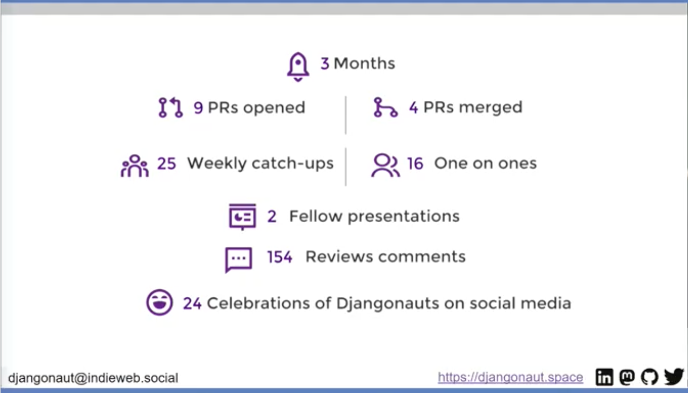

After the program:
* 80% feel more comfortable contributing to Django
* 80% feel more comfortable participating the Django community

What does it take to be a Djangonaut? You don't have to be part of Djangonaut Space. You are doing it now: write, code, raise your hand, give feedback, comment on threads, organize events, speak at events, attend events

Dawn and Rachel gave a call to action to contribute to Djangonaut Space: 
* Be a participant
* Give a talk to future Djangonauts
* Connect your organization as a partner
* Initiate a collaborative session

Djangonaut Space is now [accepting applications](https://www.djangoproject.com/weblog/2023/oct/19/djangonaut-space-now-accepting-applications/) for an eight week session in early 2024! The deadline is November 15. 

Spread the word :)

[**back to top**](#table-of-contents)

### Don't Buy the "AI" Hype

While [DjangoCon US 2022 Chair Logan Kilpatrick](https://2022.djangocon.us/news/introducing-conference-chair-logan/), first DevRel hire at OpenAI, is busy getting OpenAI's first developer conference [OpenAI DevDay](https://openai.com/blog/announcing-openai-devday) off the ground, Tim Allen, gave an impassioned talk [Don't Buy the "AI" Hype](https://2023.djangocon.us/talks/dont-buy-the-ai-hype/) the he had put together at the last minute to fill an open slot. 

Tim has been writing code since 1980. Over the years, he has seen a lot of tech trends and hype, and has been involved in some of it. He has never seen anything like what he calls the "AI" hype cycle. According to Tim, it's next level. At the risk of sounding "like an old man yelling at kids to get off my lawn," he wants to provide a warning.

Tim on stage
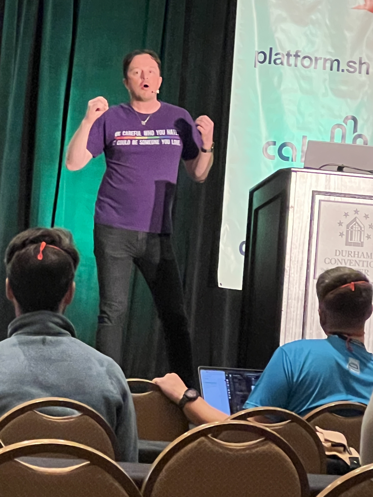

Tim cited a KPMG report that says that 93% of senior business leaders believe that generative AI will provide value for their businesses. He does not dispute that. 

He compared the Gartner Hype Cycle for Emerging Trends 2023 with generative AI at the peak that he calls "Mount Hype" with the Dunning-Kruger effect curve. He believes the similarity is not a coincidence. 

Tim gave an entertaining rundown of technology trends over the past 25 years. They were all useful tools in the technology toolbox, but did not live up to the hype. According to Tim, the media builds the technology up to "Mount Hype" for clickbait, then tears it apart in its descent. By blinding the world with hype and fear, it's impossible to find the true utility of these new technologies and use them to improve the human condition. 

Tim told the story of the startup he built as a web portal for Second Life virtual world. Hyped to the max, Second life was the media's darling, then became its whipping boy. 

He says among generative AI companies, it's now an arms race, and the race to the bottom "is dangerous." He puts "AI" in quotation marks, because he says it's not AI, it's machine learning models, a subset of AI. "It's not artificial and it's not intelligent." It's dangerous to give these attributes to machine learning models. By saying that models "hallucinate" (a.k.a. make things up) we are removing the responsibility of the programmer and model trainer to be ethical. 

With these falsehoods becoming part of the permanent record, we risk the line of collective truth becoming so blurred, it's invisible. 

He believes that a large portion of our population have been left behind by the education system and are easily misled. He fears that we are unprepared for the effect of generative AI on future elections. 

He doesn't have an easy answer, but says that as technologists we must be responsible stewards and do better. 

"We've got to stop falling for it."

[**back to top**](#table-of-contents)

### An Approach to Lightweight Tenancy Management Using Django Rest Framework

Having implemented multi-tenancy myself, I thought Eliana's talk [An Approach to Lightweight Tenancy Management Using Django Rest Framework](https://2023.djangocon.us/talks/an-approach-to-lightweight-tenancy-management-using-django-rest-framework/) would be an interesting one to attend, and it was. 

In a single-tenancy architecture, each tenant has its own application instance and its own database, physically isolated. 

In a multi-tenancy architecture, all tenants share the same database and application instance, but each tenant is isolated from the rest, and you have to implement the isolation. A user can belong to multiple tenants, but can only access resources from the tenants to which they belong. 

"Multitenancy is a software architecture where a single software instance can serve multiple, distinct user groups."- [Red Hat's definition](https://www.redhat.com/en/topics/cloud-computing/what-is-multitenancy#:~:text=Multitenancy%20is%20a%20software%20architecture,an%20example%20of%20multitenant%20architecture.)

According to Eliana, multi-tenancy is more common when a company uses your product and will have its own users, not when you market directly to the end user. 

She referred to Slack as a possible example of multi-tenancy architecture: each workspace is a tenant, isolated from each other, and users can access multiple workspaces, but can only access workspaces to which they belong, and information does not cross from one workspace to another. 

Eliana showed an example app that was an abstraction of the requirements from a number of different multi-tenant websites that she and her colleagues had implemented. 

Example
* The tenants are represented as companies
* The resources are represented as company reports
* The user can access many companies (an example user is a fractional account who does accounting for multiple companies)

Key points
* Effectively nest API routes so resources fall under the specific tenant
* Consistently restrict access to resources 
* Centralize checks in a single place to avoid code duplication

They used [drf-nested-routers](https://github.com/alanjds/drf-nested-routers) package to nest resources under a specific tenant. 

URL example: `tenant/<tenant-id><some-resource/<resource-id>`

In order for this to work, a few lines of code need to be added to urls.py. 

<!--
Screenshot- explain
-->

If there is a `company_id` 23 associated with a report with `id` 1 and a `company_id` 5 associated with a report with `id` 2:

A `GET` request to `companies/23/reports/1` will return a 200 HTTP status
A `GET` request to `companies/5/reports/1` will return a 404 HTTP status

She then explained how they write a custom viewset and overrided the `initial()` method to implement tenancy check functionality to restrict user access to resources. 

First they check that the user is logged in and get the company primary key from the URL. If either is missing an exception is raised. They then get the user from the request. Instead of looking up the company using the primary key, they look for it within the user's set of companies. The company needs to exist and be among the user's set of companies in order for it to be returned. 

Eliana and her colleagues would occasionally forget to filter by company which would result in accidentally leaking information from other tenants. As a bonus, she demonstrated how they created a custom model manager to avoid this. 

They would override the `filter()` method and check if `company_id` or `company` is in the `kwargs`. If not, the `MissingCompanyException` is raised. If either exists, company is filtered like intended with the `kwarg`. 

<!--
Check viewset capitalization, not found error

Limitations 
A different approach using https://github.com/rsinger86/drf-access-policy
-->

[**back to top**](#table-of-contents)

### Speaker and Organizer Dinner

After the conference activities and group photo, I attended the complimentary speaker and organizer dinner at [The Pit](https://www.thepit-durham.com/). The food was really good! 

The Pit dining room

Another delicious southern-style meal! 

A wonderful conference partner [Discover Durham](https://www.discoverdurham.com/) generously provided city guides for swag bags and gift boxes by [City Box Durham](https://cityboxdurham.com/) for organizers and speakers.

City Box Durham gift boxes

[**back to top**](#table-of-contents)

## Wednesday

### Testing Modern Web Apps Like a Champion

My friend Andrew "Pandy" Knight delivered the Wednesday morning keynote [Testing Modern Web Apps Like a Champion](https://2023.djangocon.us/talks/keynote-testing-modern-web-apps-like-a-champion/). 

Andy is a local and learned development through Django. At DjangoCon US 2019, he gave a [Selenium tutorial](https://2019.djangocon.us/tutorials/hands-on-web-ui-testing/). It was special for him to be back four years later giving a keynote about testing. 

Andy introduced us to Suki, his French bulldog. He created [Bulldoggy Reminders app](https://github.com/AutomationPanda/bulldoggy-reminders-app) to help him take care of his dog. 

Users can log in. On the left side are the reminders lists they have created. On the right side are the items in a list. Users can dynamically add items to lists, rename lists, and delete lists. When an item is completed they can strike through it by clicking on it. 

The app was made with FastAPI, HTMX, and stores data in TinyDB. 

Bulldoggy app architecture

Andy singing the praises of HTMX

Testing is an art and a science, Andy said. Development and testing are two sides of the same coin. 

This talk was a bookend for a keynote Andy did at PyTexas that focused on the full-stack Python development of Bulldoggy Reminders app. 

In this talk, Andy would be talking about how to test the app. 

"Testing is hard." 

Testing Challenges

Historically, testing strategy has been built around the Test Pyramid that has probably been around longer than Andy has been in a professional environment. :) 

According to the strategy, we want a lot of unit tests. They are white box, next to the code, low level, very fast, touching the Python methods. Moving up the pyramid, if we have UI, we want to test the widget library as components. Moving up the pyramid, we reach API testing. We make a request, get a response, verify a `200` code. They take a bit longer to run and there could be network issues, but they are ok. We reach UI tests. We want to do as few of them as possible. They are the most complex, longest, slowest, most brittle, most prone to flakiness, the riskiest. 

Test Pyramid Scheme

"We have developed an entire testing strategy with this pyramid around presumptions that certain types of tests are good and bad. And I'm here to tell you today that's bull crap. Every type of test adds value in unique, special ways. To try to label some as good and bad is not healthy for us as we approach the quality of our applications. I could argue that UI tests are the valuable ones because they are the ones that are testing your application as a user would." 

Modern testing goals- let's break away from the pyramid and its preconceived notions

While testing can be challenging, our approach to testing doesn't need to be. 

Writing good tests: follow the Arrange-Act-Assert method:
* *Arrange* things in the system
* *Act* on the target behavior
* *Assert* expected outcomes

Arrange-Act-Assert works for all types of functional tests, whether they are unit, component, API, or UI. This pattern came up over and over again in the talk. 

Can't we just use pytest or unittest? Andy loves pytest. He is a pytest stan and thinks it is the best testing framework in any language, but...

pytest and unnitest cannot test web apps or frameworks. They provide the structure for writing test cases. You need to add the "magic sauce" inside the test cases. pytest alone is not the answer. 

What about Django's testing support? Django has an awesome test client. Django testing support is probably some of the best Andy has seen in a Python web framework, but...

You are going to be limited to "white box" testing of calling methods and functions directly from the code. You're not going to be able to test the app like a user by opening up a browser and clicking around or calling the API with a REST client. 

Andy pointed out the "white box" unit testing at the bottom of the pyramid and "black box" testing of the components above. 

Tools for black box testing... Cypress and Playwright can do all of these things

Focusing on open source tools, Andy went over how to do component, API, and UI testing, with examples and pitfalls from his own personal experience. 

Web Test Automation Tool Comparison
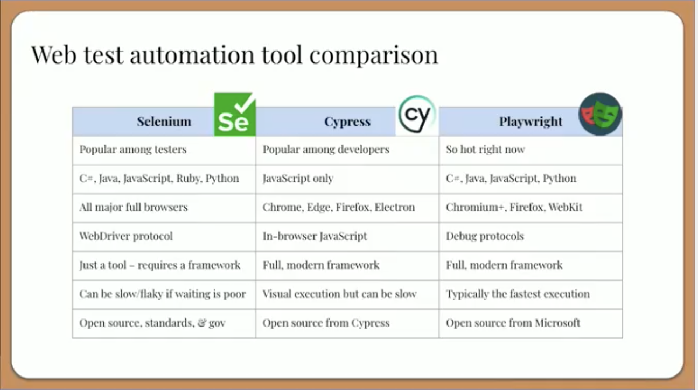

Tips for testing modern web apps like a champion

Afterw the talk, I had the chance to catch up with Andy. His talk has rekindled my desire to get better at testing and reminded me of what a great resource [Test Automation University](https://testautomationu.applitools.com/) is. He gave me a card resource too! 

A gift from my friend Andy

[**back to top**](#table-of-contents)

### Inside Out: My Journey of Understanding Inclusion

This year, along the lines of my fellow DEFNA board member Jeff Triplett's annual [DjangoCon US Talks I'd Like to See](https://jefftriplett.com/2023/djangocon-us-talks-i-d-like-to-see-2023-edition/) list, I created my own [Talk Topic Ideas List](https://github.com/KatherineMichel/portfolio/blob/master/conference-blog-posts/topic-ideas-djangocon-us-2023.md) and posted it on social media. 

Tim Schilling, who has done an incredible job of taking over my former role of DEFNA Corporate Secretary and driving a lot of improvement across DEFNA and DjangoCon US, tooted to me and Natalia in response. 

It kicked off a conversation that led to her giving the talk [Inside Out: My Journey of Understanding Inclusion](https://2023.djangocon.us/talks/inside-out-my-journey-of-understanding-inclusion) on Wednesday. 

In her talk, Natalia gave some examples of prejudice that she has faced as a woman. Thank you Natalia for putting into words the type of that experiences I've also had, but have questioned. 

She explained what unconscious bias is and that we are unaware of it. Her hope is that we will reflect on our unconscious biases to improve the Django community as a whole. 

She then talked about the conflicting standards women are expected to meet. I personally found this to be a very powerful part of her talk. 

Double Bind

Double Bind Paradoxes
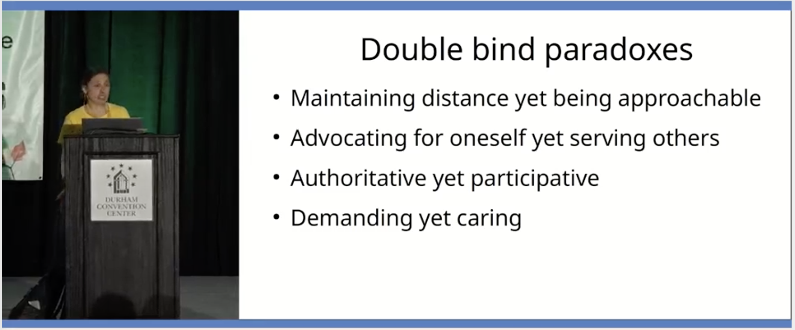

Double Bind from Barbie movie

Natalia went on to talk about cultural aspects too and recommended Ned Batchelder's PyCon US 2023 keynote [People: the API User's Guide](https://nedbatchelder.com/blog/202305/pycon_2023_keynote.html) and the book [The Culture Map](https://www.amazon.com/Culture-Map-Breaking-Invisible-Boundaries-ebook/dp/B00IHGVQ9I/ref=tmm_kin_swatch_0?_encoding=UTF8&qid=1698883387&sr=8-1) by Erin Meyer. 

<!--
https://fosstodon.org/@nessita/110340749235756274
-->

Thank you to Natalia for embracing our community and generously asking for reflection about an important subject. I hope she found our conference to be very welcoming in return.

<!--
https://twitter.com/KatiMichel/status/1714679106510434533
-->

I've chatted with women recently about the additional overhead women and other underrepresented people often have from doing extra work to change the system. It can be exhausting. I am looking forward to getting to know Natalia's development work. 

[**back to top**](#table-of-contents)

### DjangoCon Africa

Daniele Procida has been involved in organizing and attending African PyCons for nearly a decade now. He spoke of the special challenges, including questions of safety. 

Daniele said we should not just be asking these questions about African events. We should be asking them about events in all countries, including our own. Other countries need to come with safety warnings as well. 

African PyCons are creating safe spaces through codes of conduct. It's an investment in courage. "This is what we do and this is how we are." 

He also pointed out that African PyCons and DjangoCon operate on a shoestring budget. For example, PyCon Namibia's total conference budget was less than $7,000 USD. The conference finished with a balance of just over $100 USD. 

Daniele asked DjangoCon Africa Keynoter and Organizers to come up to the stage. 

Wonderful people I am proud to call friends: Daniele Procida, Kojo Idressa, Sheena O'Connell, Abigail Mesrenyame Dogbe, Dawn Wages, Noah Alorwu

Daniele praised DjangoCon US for doing exactly the same work from another part of the world. "I haven't seen so many African and Black faces, non-white faces, as a proportion at an event outside Africa." 

[DjangoCon Africa 2023](https://2023.djangocon.africa/) will take place in Tanzania, Africa in November and [DjangoCon Europe 2024](https://www.djangoproject.com/weblog/2023/oct/14/djangocon-europe-2024/) will take place in Vigo, Spain in June 2024. 

I hope to go to both someday. 

One day at lunch, I had the pleasure of eating with a table of Africans: Richard Ackon, Abigail "Afi" Gbadago, Noah Alorwu, Ntale Geofrey, and Benedict Kofi Amofah. I learned that Ghanians are laid back and Ugandians are tribal. We had the chance to speak at length about our cultures. It was a really fun conversation! 

New friends... beautiful on the inside and out! (photo courtesy of Abigail Mesrenyame Dogbe)

Later in the week, a Black attendee told me that when he attends a conference in the U.S. or Europe, he is sometimes the only Black person in attendance. DjangoCon US was a very different and wonderful experience. 

By one organizer's count, we had around 10 Black speakers. 

Check out the Black Python Devs write-up about their [DjangoCon US experience](https://blackpythondevs.github.io/2023-10-20-djangoconus/). 

[**back to top**](#table-of-contents)

### Another Great Adventure

After conference activities, as usual, hanging around in the lobby led to a great adventure. Hanging around in a lobby once led to me sitting next to Python creator and BDFL Guido van Rossum at an impromptu group dinner and chatting with him about the early days of Python. 

On this night, I ended up having dinner with Jacob Kaplan-Moss, Andrew Godwin (Django Core Dev, Django Async Architect, South creator, and the only person who has attended every DjangoCon US), Frank Wiles (Revsys Founder and Partner, and former DSF President), and Tim and and Charles of the Wharton School, my past client. 

We ate at a restaurant called [It's a Southern Thing](https://getsouthernfood.com/). The food was high quality and the service was great. I had the Crispy Catfish. 

Crispy Catfish ("Crispy cornmeal fried catfish served over a bed of red beans & rice; made with beef sausage, holy trinity, creole spices, finished with a creole mustard aioli")

Our table after an incredible meal!

Afterward, led by Tim, we had ice cream at a novel ice cream shop called [Simon Says Dip This](https://www.simonssaysdipthis.com/). Tim said he's never seen an ice cream shop like this anywhere else. Vanilla soft serve has a core, dip, and topping of your choice. 

Simon Says Dip This Counter

Final product... wow! (chocolate core, bourbon dip, and strawberry topping)

[**back to top**](#table-of-contents)

### Conference Conclusion

I came away from Durham with many new friends, renewed optimism, and some amazing swag. 

<!--
Thank you to my employer JPMorgan Chase & Co. for sponsoring me to attend. 
-->

Conference badge
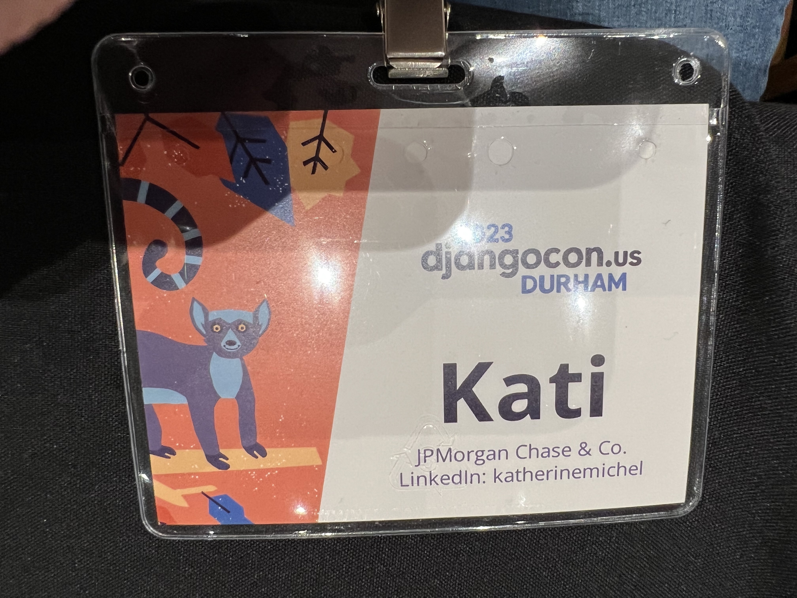

Prized possessions 

Proud to be a DEFNA Board Member and DjangoCon US Organizer

Standing ovation for organizers
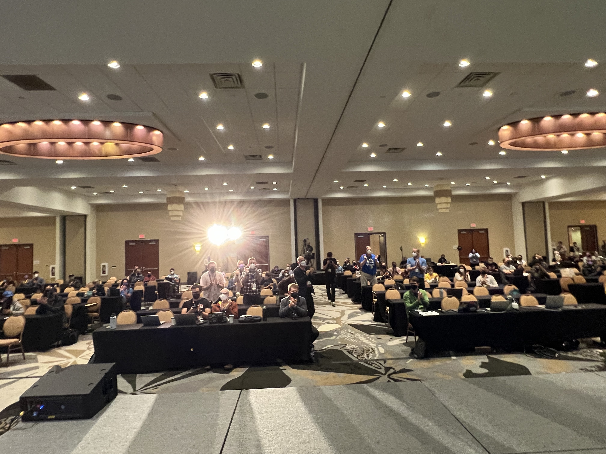

DjangoCon US Organizers (photo credit: Bartek Pawlik (https://bartpawlik.format.com/))

[**back to top**](#table-of-contents)

## Sight Seeing and More Food!

I consider getting to know the host city to be an important part of the conference experience. 

[**back to top**](#table-of-contents)

### Sarah P. Duke Gardens

After doing a bit of research, I chose the [Sarah P. Duke Gardens](https://gardens.duke.edu/) as my top priority for sight seeing. After spending time there, I can personally report that if you are in Durham, it is an absolute must see. Some of the scenes there were simply stunning! A local pointed out to me that it's a different garden every month depending on which plants are in bloom. 

Pink flowers

Glorious nature

H.L. Blomquist Garden of Native Plants Pavilion

Fish pool, historic terraces, and Cindy Brodhead Pergola

South Lawn

Red Bridge

Wooden Bridge

[**back to top**](#table-of-contents)

### Duke Chapel

After visiting the gardens, I made the quick walk over to the [Duke Chapel](https://chapel.duke.edu/). Not only was the chapel gorgeous, but the [Conference for North Carolina Chapter of the American Choral Directors Association](https://chapel.duke.edu/events/conference-north-carolina-chapter-american-choral-directors-association-1697169600) was taking place. A choir that must have been made up of elite children singers happened to be practicing. I've stumbled into some jaw-dropping experiences while traveling. This was another one. Together, the music and surroundings were magical. 

[**back to top**](#table-of-contents)

### Museum of Life and Science

I also visited the [Museum of Life and Science](https://www.lifeandscience.org/). The [Butterfly House](https://www.lifeandscience.org/explore/butterfly-house/) in particular was a really special experience. I was also happy to have a second change to see lemurs. Duke University has the largest population of lemurs in the world outside of Madagascar, but unfortunately, its tours were booked through the rest of the year. The Museum of Life and Science has a [Lemur Exhibit](https://www.lifeandscience.org/explore/lemurs-and-tortoises/). I enjoyed observing these beautiful animals. [The Farmyard](https://www.lifeandscience.org/explore/the-farmyard/), [Insectarium](https://www.lifeandscience.org/explore/insectarium/), and [Aerospace](https://www.lifeandscience.org/explore/aerospace/) exhibits were also really fun and interesting. 

Unfortunately, the [train](https://www.lifeandscience.org/explore/train/) that takes passengers around the museum's 84 acres was not in operation at the time of my visit. I know I would have really enjoyed it. 

Lemurs

Lemur Exhibit

Lemur

Butterfly House path

Butterfly House path

Butterfly House butterfly

Butterflies with "eyes" eating fruit
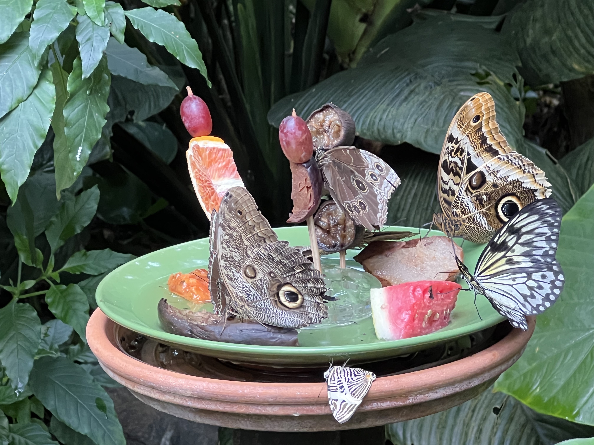

Insectarium- cockroaches

Insectarium- tarantula

[**back to top**](#table-of-contents)

### Parizade

More pics from the incredible Parizade!

Amazing ambiance

Cookie and ice cream desert

[**back to top**](#table-of-contents)

### Loaf

After having read rave reviews about [Loaf](https://www.loafdurham.com/) bakery, I had to pay a visit. It did not disappoint. I ordered a ham and gruyere croissant, a walnut sea salt brownie, a pain au chocolat, and 5 pumpkin chocolate chip cookies. 

Ham and gruyere croissant

Walnut sea salt brownie

[**back to top**](#table-of-contents)

### Pizzeria Toro

For dinner one night, I ordered takeaway from [Pizzeria Toro](https://www.pizzeriatoro.com/), right around the corner from the Marriott. I had a mouthwatering red-sauce pizza with shredded mozzarella, black olives, mixed mushrooms, and fennel sausage. 

Cool atmosphere! 
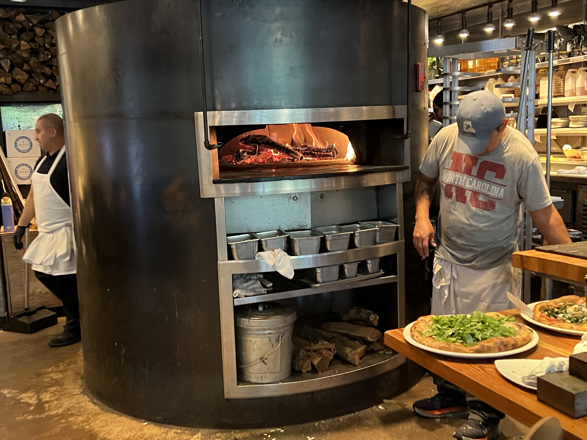

Yum! 

[**back to top**](#table-of-contents)

### Simon Says Dip This

More pics from the amazing Simon Says Dip This!

Dip being poured on

Toppings to choose from

[**back to top**](#table-of-contents)

### Press Coffee, Crepes,and Cocktails

After having read rave reviews about [Press Coffee, Crepes, and Cocktails](https://pressccc.com/locations/durham/) at the [American Tobacco Campus](https://americantobacco.co/), I simply had to visit. I was keen to have a seasonal Black Forest Latte. I finally had the opportunity on the first day of sprints. The atmosphere was bright and cute. The food was excellent. I think this was the first time that I've ever had a savory crepe. 

Coffee Bar

Bar bar 

Black Forest Latte... the foam was silky smooth. Delicious! ("a combination of our house-made chocolate-sauce and cherry syrup")

The Down Home breakfast crepe ("bacon with scrambled eggs and hoop cheese")

The inside 

[**back to top**](#table-of-contents)

## In Closing

The talk replays will be available on the [DjangoCon US YouTube channel](https://www.youtube.com/c/DjangoConUS) in a few weeks. 

Can't wait for next year! :)

!["As usual, I've tried to squeeze every last bit of experience out of DjangoCon US and have done about as much as I humanly can. 🤣 Today is a day for relaxed sprinting, catching up with a few more people, and flying back to Plano. I'll write up a proper blog post soon with thoughts about talks, the people I met, sightseeing, and food. For the moment, suffice it to say, this conference just gets better every year and that is because of the people. Everyone is welcome and everyone makes it a better place. This community is changing the world for the better through shared humanity and technology. And, it's not a coincidence that it started in wonderful Lawrence, Kansas."](djangocon-us-2023-recap-images/as-usual.png)

djurham

[**back to top**](#table-of-contents)
