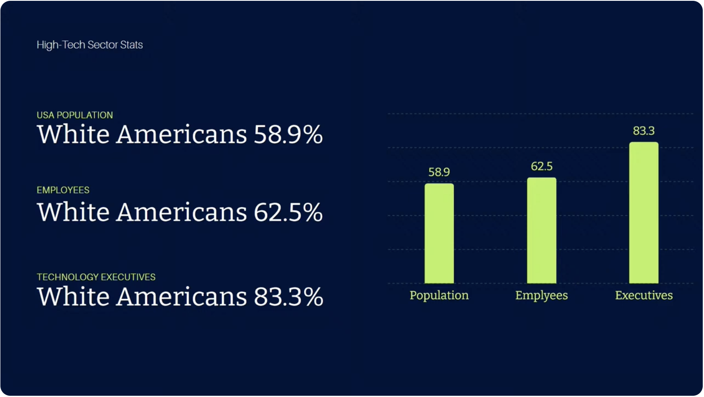
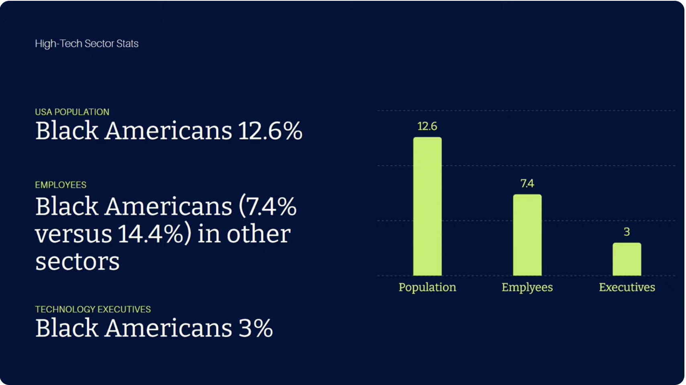

# DjangoCon US 2024 Recap

Table of Contents
-----------------

- [Intro](#intro)
    - [Venue Selection](#venue-selection)
    - [DjangoCon US Website and Design](#djangocon-us-website-and-design)
- [Pre-Conference Activities](#pre-conference-activities)
    - [Sightseeing and Some Great Meals](#sightseeing-and-some-great-meals)
    - [Black Python Devs Leadership Summit](#black-python-devs-leadership-summit)
    - [Rooftop View of Durham](#rooftop-view-of-durham)
    - [Swag Stuffing](#swag-stuffing)
    - [Django Social](#django-social)
- [Monday](#monday)
    - [Monday Morning Talks](#monday-morning-talks)
    - [Shrimp and Grits](#shrimp-and-grits)
    - [Monday Afternoon Talks](#monday-afternoon-talks)
    - [DEFNA Board Dinner](#defna-board-dinner)      
- [Tuesday](#tuesday)
    - [Tuesday Morning Talks](#tuesday-morning-talks)
    - [Tuesday Afternoon Talks](#tuesday-afternoon-talks)
    - [Meeting Lorenzo](#meeting-lorenzo)
    - [Speaker and Organizer Dinner](#speaker-and-organizer-dinner)
    - [The Boxcar Bar and Arcade](#the-boxcar-bar-and-arcade)
- [Wednesday](#wednesday)
    - [Wednesday Morning Talks](#wednesday-morning-talks)
    - [Lightning Talk Cameo](#lightning-talk-cameo)
    - [Wednesday Afternoon Talks](#wednesday-afternoon-talks)
    - [Panel Discussion: Open, friendly, and welcoming: on the history and future of mentoring in Django](#panel-discussion-open-friendly-and-welcoming-on-the-history-and-future-of-mentoring-in-django)
    - [Queeny's](#queenys)
- [Hallway Track](#hallway-track)
    - [Connections Made](#connections-made)
    - [Swag](#swag)
    - [Django Social T-Shirt](#django-social-t-shirt)
    - [Visa Frustration](#visa-frustration)
- [Thursday](#thursday)
    - [Sprints](#sprints)
- [Another Great Adventure](#another-great-adventure)
- [More Sight Seeing and Food](#more-sight-seeing-and-food)
    - [Sarah P. Duke Gardens](#sarah-p-duke-gardens)
    - [Cocoa Cinnamon](#cocoa-cinnamon)
    - [The Can Opener](#the-can-opener)
    - [21c Museum Hotel](#21c-museum-hotel)
    - [The Durham Hotel](#the-durham-hotel)
    - [Mother and Sons](#mother-and-sons)
    - [Durham Food Hall](#durham-food-hall)
    - [Press Coffee, Crepes, and Cocktails](#press-coffee-crepesand-cocktails)
    - [Centerfest](#centerfest)
    - [Durham Market Culture](#durham-market-culture)
    - [Cousins Maine Lobster](#cousins-maine-lobster)
    - [Unscripted Rooftop Pool](#unscripted-rooftop-pool)
    - [The Parlour](#the-parlour)

## Intro

Disclaimer: the content of this post is a reflection of my career journey and not specific to my work at JPMorganChase.

DjangoCon US 2024 took place from September 22-27 in Durham, North Carolina at the Durhan Convention Center. It was the seventh DjangoCon US I've had the privilege of attending and an absolute blast! 

Attendees (photo credit: Bartek Pawlik (https://bartpawlik.format.com/))

[**back to top**](#table-of-contents)

### Venue Selection

If you want to bring DjangoCon US to your city or volunteer, we want to hear from you! 

My fellow DEFNA Board Member Adam Fast gave a lightning talk about our search for a venue for 2025 and beyond. Cost continues to be a challenge and our sponsorship is down.  

As they say in open source, "Given enough eyeballs, all bugs are shallow." Perhaps with the eyeballs of the entire community, we can find an acceptable course of action. 

<!--
Lightning talk link and date/time
Slides
-->

[**back to top**](#table-of-contents)

### DjangoCon US Website and Design

A number of people commented that they really loved the t-shirt and bag this year. 

Our wonderful designer Joni Trythall of YupGup did a [DjangoCon US Design Reflection](https://jonitrythall.com/dcus-design-reflection) featuring all of our designs since 2018. 

As a DEFNA Board Member, I've had the pleasure of collaborating with Joni in bringing all of these designs to life. They are so beautiful!

Thank you to Joni for a special shoutout at the end of her post. 

In addition, we did a refactor of our DjangoCon US website backend this year. It's easier to get up and running and has a well documented style guide. 

Feel free to fork it and use it in line with the license. 

## Pre-Conference Activities

### Sightseeing and Some Great Meals

I feel privileged to be able to travel. I make the most of every opportunity to get to know a place better: seeing the unique sights, experiencing what makes the culture special, and enjoying the celebrated local cuisine. 

In Durham, I had the chance to revisit the incredible Sarah P. Duke Gardens and see a few other attractions for the first time. Also, although most of my meals were provided through the conference, I enjoyed some outstanding meals in downtown Durham restaurants. 
  
Here are a few of my favorite moments from the trip. See more photos and anecdotes later in this post. 

Sarah P. Duke Gardens Red Bridge... jaw dropping scenes

21c Museum Hotel... the bathroom window is transparent until you turn the lock, then it becomes opaque

The Durham Hotel lobby... wow!

Mother and Sons... Squid Ink Tonnarelli, NC Shrimp, uni, fennel, scallions

Press Coffee, Crepes, and Cocktails... oh my, this berries crepe was absolutely delicious. I had a banana bread latte too that was chef's kiss. 

Centerfest... nice visual metaphor taken along the side of the conference hotel during Centerfest

Unscripted rooftop pool

  
### Black Python Devs Leadership Summit

It was an honor to have been invited to attend the [Black Python Devs Leadership Summit](https://blackpythondevs.com/leadership-summit-2024/) as a distinguished guest. 

The event took place at the Caktus office. I attended the afternoon session. 

The session kicked off with a keynote by Wesley Faulkner. 

Wesley gave some sobering stats, then gave practical advice for how to observe, predict, and improve your surroundings, the benefits and risks. 

Interactive speakers
* Loren Crary (filling in for Tim Schilling): PSF
* Afi Gbadago: BPD Open Source Program
* Kudzayi Bamhare: Creating ecosystems- conducting a beginner Python workshop in Zimbabwe in partnership with Uncommon teaching hub

BPD Vice-Executor Velda Kiara led a panel with with community leaders about topics concerning Black Leaders in Python.

Panel participants Benedict Koji Amofah, Jeff Triplett, Loren Crary, Monica Oyugi, and host Velda Kiara

After the panel, we took part in breakout sessions. My group had a thoughtful and spirited conversation about newcomer psychological safety moderated by Alex Oladele and Paul Everitt.

The event ended with a fun happy hour. 

Me, Abigail Afi Gbadago, and Velda Kiara after the summit!

I am so proud of them for the role they played in organizing an outstanding event. It had a lot of heart.

BPF Founder Jay Miller announced that the next leadership summit will be somewhere in Africa. 

The morning and afternoon replays are available on the info page. 

### Rooftop View of Durham

After the summit, a DjangoCon US attendee who lives at One City Center took a group of us up to the 28th floor for an incredible view of the Durham skyline. 

[Video of the skyline](https://youtu.be/8w3ubfRBK5I)

One City Center rooftop pool

[**back to top**](#table-of-contents)

### Swag Stuffing

On Sunday, I continued my tradition of swag stuffing. Conference pro-tip: it's a great opportunity to meet people! 

[**back to top**](#table-of-contents)

### Django Social

For the second year in a row, Foxley Talent spearheaded a Django Social event at [Ponysaurus Brewing Company](https://www.ponysaurusbrewing.com/). Thank you to REVSYS for sponsoring as well. 

A sign of a fantastic event: it was over before I knew it. I had the chance to catch up with "old" friends and meet new ones. 

Djangonauts at Ponysaurus

[**back to top**](#table-of-contents)

## Monday

### Monday Morning Talks

Orientation Chair Kojo Idressa and Conference Chair and DEFNA President Peter Grandstaff kicked off the conference. 

[Keynote - Power to the People who Teach the People](https://2024.djangocon.us/talks/keynote-monday/) by Sheena O'Connell

My points of interest
* Common learning anti-patterns
* The power of compounding over time
* [Make it Stick](https://www.amazon.com/Make-Stick-Science-Successful-Learning/dp/0674729013) book
* If you teach one person, it can impact many others
* Normal classroom and normal distribution versus versus mastery-based learning
* [Bloom's 2 Sigma Problem](https://en.wikipedia.org/wiki/Bloom%27s_2_sigma_problem)
* Mastery-based learning techniques (1:1 tutoring), social contract
* Mastery-based learning helps you master teaching ("did I do a good job of teaching")
* "Education is not the filling of a pail, but the lighting of a fire."
* "You can't each a person to ride a bicycle by riding a bycicle for them."
* Growth mindset versus fixed mindset
* [Huberman Lab Podcast](https://www.hubermanlab.com/podcast)
* You should have a growth mindset about your growth mindset :)
* Mastery-based learning helps people develop a growth mindset
* Growth mindset and [metacognition](https://en.wikipedia.org/wiki/Metacognition)
* Thinking about thinking
* Struggle is good, teach students how to learn
* Some teaching techniques are more powerful than others
* "Trust no one"
* Catalyst further growth- retrieval practice
* Foundational practices and mindsets
* The Protégé Effect
* [The Guild of Educators](https://www.sheenaoc.com/articles/2024-09-12-introducing-goe)
* Learning Sprint tutorial: Django, htmx, playwright, tailwind, maybe alpine 
* Desperation mindset, [stereotype threat](https://en.wikipedia.org/wiki/Stereotype_threat)… sense of belonging
  
[The Magic of Dependencies Installing Themselves](https://2024.djangocon.us/talks/the-magic-of-dependencies-installing-themselves/) by Ilerioluwakiiye Abolade

My points of interest
* [PEP 723](https://peps.python.org/pep-0723/)
* Inline script metadata- specify script related metadata directly within Python files using TOML format
* Specify exact versions
* All requirements visible
* Share a single file instead of multiple files
* Management commands- specify Django versions and other dependencies
* Only include necessary dependencies
* Regularly review and update metadata as your project evolves
* Explain why certain versions or dependencies are required
* Include metadata changes in your commits
* Verify that your metadata works in different environments
* Challenges with traditional Django dependency management and how PEP 723 solves these issues

[Choosing Wisely: SPA vs. HTMX for Your Next Web Project](https://2024.djangocon.us/talks/choosing-wisely-spa-vs-htmx-for-your-next-web-project/) by Chris May

My points of interest
* Last year's talk introduced idea that you can have SPA-like experience in Django using tools other than typical SPA tools like HTMX
* Why would I want to use HTMX versus SPA?
* Are you using a SPA? What would make you change? When do you think you should use a SPA? What tools are you favorite tools? Are you using them well?
* Thoughtworks [SPA by Default](https://www.thoughtworks.com/en-us/radar/techniques/spa-by-default)
* Alex Russell [The Market for Lemons](https://infrequently.org/2023/02/the-market-for-lemons/)
* SPA startup takes too much time
* Spectrum source: [Caprock](https://infrequently.org/2024/08/caprock/)
* [Using Progressive Enhancement](https://www.gov.uk/service-manual/technology/using-progressive-enhancement)
* "Any system that puts Javascript in the critical path starts at a disadvantage." Alex Russell
* "JavaScript costs three more times in processing power byte-for-byte than HTML and CSS and remove the browser's ability to optimize page loading."
* "When using JavaScript you pay a performance tax no less than four times." Tim Kadlec
* Source: [The Cost of JavaScript Frameworks](https://timkadlec.com/remembers/2020-04-21-the-cost-of-javascript-frameworks)
* When SPAs could be worth their weight
* "A massive investment in controlling complexity is the only way to scale JS-driven frontends." Alex Russell
* Bad user experience on slow devices
* How the front-end is coping
* [Katie Sylor-Miller's "Component Islands" pattern](https://jasonformat.com/islands-architecture/)
* CSS view transitions
* Component Island benefits
* What you return from the server- if you return JSON, you are inviting complexity; if you return HTML, you require much less JavaScript
* A new pattern: Streamed HTML components
* [Django Unicorn](https://www.django-unicorn.com/), HTMX, Alpine.js, [django-template-partials](https://github.com/carltongibson/django-template-partials), [django-components](https://pypi.org/project/django-components/), [Datastar](https://datastar.fly.dev/), [Unpoly](https://unpoly.com/) 
* Success stories: [Umuzi](https://www.sheenaoc.com/articles/2024-06-30-htmx), [contexte](https://david.guillot.me/en/posts/tech/following-up-mother-of-all-htmx-demos/), [OpenUnited](https://www.linkedin.com/feed/update/urn:li:activity:7109116330770878464/)
* OpenUnited- dev velocity improved by 500%
* Tayor Hunt's [Making the World's Fastest Website and Other Mistakes](https://dev.to/tigt/making-the-worlds-fastest-website-and-other-mistakes-56na)
* Chris will create a blog post with streaming info

[Error Culture](https://2024.djangocon.us/talks/error-culture/) by Ryan Cheley

My points of interest
* Automated alerts received via email
* Error culture: workers ignore error notifications, creating a culture of reactive firefighting
* Why does it happen? Lack of understanding: what, why, who; error/alert fatique, hero culture
* [Chesterton's Fence](https://fs.blog/chestertons-fence/)
* Is the alert important? No: don't just delete the alert. Delete the mechanism that created the alert.
* Is the alert important? Yes: Is the alert actionable? What does an actionable alert look like?
* It has a verb
* Examples

[**back to top**](#table-of-contents)

### Shrimp and Grits

I tried grits as a kid and didn't like them. I've recently been told by friends that I just haven't had the right grits. 

When I saw grits on the DjangoCon US lunch buffet, I had to try them. I still don't like them, but it was an experience! 

North Carolina-inspired lunch

[**back to top**](#table-of-contents)

### Monday Afternoon Talks

[Troubleshooting is a Lifestyle 😎](https://2024.djangocon.us/talks/troubleshooting-is-a-lifestyle/) by Jack Linke

My points of interest
* "If your only tool is a hammer then everything looks like a nail." Abraham Maslow
* Indicator categories
* Django template error pages
* Django error reporting by email
* Django system checks framework- it's extensible (dj-stripe example)
* Django console and logging, extra context and verbosity (1-3)
* django-debug-toolbar- it's extensible
* django-silk performance profiler
* Error tracking and performance monitoring- Sentry, Rollbar, Newrelic, Honeybadger, Bugsnag, Raygun
* Sentry error page, error message, tags
* django-health-check package (can add Celery, Redis, Postgres)
* django-watchman
* Extend the admin by adding checks
* Celery issues… too few tasks processed. Put panel into admin- last 24 hours how many tasks processed through celery
* The power of isolating variables and narrowing scope
* Frances Elizabeth Holberton- "break the execution- does the system work up to this point"
* Python Debugger (PDB), breakpoints, step through the code and find the issue
* Avoid tunnel vision- seek broad pespectives and alternative approaches
* "A problem well stated is a problem half solved." John Dewey
* Rubber duck debugging
* Knowing when to seek assistance
* Asking for help is a strategy
* How to ask for help effectively
* Minimum Reproducible Example (MRE), examples
* Ken shoutout!
* Document the process

[A Related Matter: Optimizing your webapp by using django-debug-toolbar, select_related(), and prefetch_related()](https://2024.djangocon.us/talks/a-related-matter-optimizing-your-webapp-by-using-django-debug-toolbar-select-related-and-prefetch-related/) by Christopher Adams

My points of interest
* [Code samples](https://github.com/adamsc64/a-related-matter)
* Manage your own expectations for tools
* Querysets are lazy and immutable
* Example of querysets that don't/do hit the database (future instructions)
* Django logging set to debug for db backend to stream results
* Django shell, db all-statement logging (caution: will fill up the logs, for a minute in staging, not prod)
* [django-debug-toolbar](https://django-debug-toolbar.readthedocs.io/en/latest/)
* Install conditionally (if DEBUG)
* Each query has latency going back and forth to database, increased if data is in another datacenter
* Prefetch returns another queryset, can be more efficient than if database does it
* People in the 90th percentile who have a slow machine
* Other django-debug-toolbar uses slide

[Unlocking Performance: Benchmarking and profiling Django for Maximum Efficiency](https://2024.djangocon.us/talks/unlocking-performance-benchmarking-and-profiling-django-for-maximum-efficiency/) by Ron Maravanyika

My points of interest
* Define efficiency
* Benchmarking- looking at time; Profiling- looking at resource usage
* Unix time command: real, user, sys
* Python timeit module
* [pytest-benchmark](https://pytest-benchmark.readthedocs.io/en/latest/) and Weave, benchmark_weave, aspectlib
* [Cookiecutter Template](https://cookiecutter.readthedocs.io/en/stable/)
* profile module, cprofile module
* Live profiling tool- [django-silk](https://github.com/jazzband/django-silk)
* Postgres select * documentation
* Silk Python profiler and binary version- will create an image that shows parallel functions running
* What about profiling small blocks of code (functions and methods)- decorator method and context manager method
* [Dynamic profiling](https://github.com/jazzband/django-silk?tab=readme-ov-file#dynamic-profiling)- used for profiling something you don't have access to

[**back to top**](#table-of-contents)

### DEFNA Board Dinner

DEFNA had a board dinner to discuss business. It was a pleasure to be treated to a gourmet meal at 21c Museum Hotel [Counting House](https://countinghousenc.com/) restaurant. 

I had oysters for the first time and particularly enjoyed the scallops and smoked trout dip. 

The DEFNA Board... wonderful people!

Oysters on the half, blood orange mignonette, cocktail sauce

Smoked trout dip, bread & butter pickle, butter-fried saltine

Diver scallops, pecorino english pea puree, radish & snow pea orzo salad, pea tendrils; Sherry Berry lifts me up, lustau sherry, capelleti, strawberry, aromatic bitters, tonic

Chocolate cremieux, dark chocolate, hazelnut, Italian meringue, decaf coffee

[**back to top**](#table-of-contents)

## Tuesday

### Tuesday Morning Talks

[Keynote - How To Be A Developer and Other Lies We Tell Ourselves](https://2024.djangocon.us/talks/keynote-tuesday/) by Mario Munoz

My points of interest
* I agree that Velda and Mario both have great hair :)
* "I am a person."
* "We all know philosophy and software engineering are the same thing." Abstract thinking, making models of intangible things, trying to apply them to real world scenarios.
* Jacques Lacan- Mirror Stage
* 12 Monkeys Steam Punk Lab
* "Being a developer should in no way rob you of who you are and your own identity"
* Person/Ality personality simulator
* "The biggest lie that we can tell ourselves is that these objects of representation that are outside of us are synonymous with who we are."
* "Everything we tell ourselves about ourselves is always a little bit inadequate"
* "Our strengths can also be our biggest weaknesses." Examples. "You can also turn your weaknesses into your strengths."
* Far greater things... "I am a community. We are a community... The community is my biggest asset."
* "How to be a better developer... be a better person to others." 

[Seamless Transition: How I Converted an Existing MySQL Database to be Fully Managed by Django Migrations Framework](https://2024.djangocon.us/talks/seamless-transition-how-i-converted-an-existing-mysql-database-to-be-fully-managed-by-django-migrations-framework/) by Daniel Ramas

My points of interest
* MySQL
* Django migrations flow
* We have the ability to run custom Python scripts using RunPython
* Common arguments: Apps and schema_editor
* Another common migration class: RunSQL (caution: accepts strings of SQL commands to run on the database; sanitize inputs and beware SQL injection)
* Pattern: migrations have a dependency to the previous migration that is applied before it. This is how Django links migrations and is able to create a tree to describe what the migrations history looks like
* Other way of creating a dependency, create a ForeignKey relationship
* Sync an existing database to Django, Docker Compose
* Take note of the type of primary key fields, primary keys are primarily integers
* DEFAULT_AUTO_FIELD: AutoField is a subclass of IntegerField
* Use inspectdb to generate the models based on schema it can detect: python manage.py inspectdb > <file_structure>
* Why did he delete models?
* class Meta managed=True
* makemigrations
* python manage.py migrate --fake (will fake all migrations that need to be applied)
* python manage.py migrate --fake-initial (multiple migrations need to be run, but only initial migration needs to be faked)
* ForeignKeys that are enforced on the backend not the database
* db_column
* Custom migration
* Use RunPython to do the cleaning of the columns
* apps.get_model
* Operation can't be reversed, so don't need a reverse function
* AlterField

[PostgreSQL Beyond Django: Strategies to Get Max Performance](https://2024.djangocon.us/talks/postgresql-beyond-django-strategies-to-get-max-performance/) by Álvaro Justen

My points of interest
* [Code](https://github.com/PythonicCafe/djpg-example)
* Docker Compose web and db service
* psycopg, postreSQL, rows library
* [cookie-cutter-dokku-django](https://github.com/PythonicCafe/cookiecutter-dokku-django)
* Brasil.IO dataset Manifesto
* First implementation: lazy
* TBC

[Django + Alpine.js + htmx Ups & Downs](https://2024.djangocon.us/talks/django-alpine-js-htmx-ups-downs/) by Karen Tracey

My points of interest
* North Carolina Outerbanks Nags Head
* The promise of a sunny day
* Overlap between frontend frameworks and Django
* The frontend frameworks would expect that instead of sending HTML, the server would be sending JSON. And the frontend frameworks would take the JSON and turn that into HTML.
* Lack of full stack
* "We're all on a walk on the beach"
* Karen would like to encourage sharing of information. 

[If We Had $1,000,000: What Could The DSF Do With 4x Its Budget?](https://2024.djangocon.us/talks/if-we-had-1000000-what-could-the-dsf-do-with-4x-its-budget/) by Jacob Kaplan-Moss

My points of interest
* 

[**back to top**](#table-of-contents)

### Tuesday Afternoon Talks

[Upgrading EOL Django: A Journey from V1 to V5](https://2024.djangocon.us/talks/upgrading-eol-django-a-journey-from-v1-to-v5/) by Michael Riley

My points of interest
* 

[Lessons from E2E Testing Web Applications](https://2024.djangocon.us/talks/lessons-from-e2e-testing-web-applications/) by Avindra Fernando

My points of interest
* 

[Only reliable Data: Protecting Database Integrity](https://2024.djangocon.us/talks/only-reliable-data-protecting-database-integrity/) by Eva Nanyonga

My points of interest
* Some argue atomicity helps the other properties in ACID
* Postman
* Error reporting, two records with the same name and same account
* When the function fails, the record will not go to the database
* Atomic transactions decorator

[Level Up Your Django Performance: Identifying and Taming N+1 Queries](https://2024.djangocon.us/talks/level-up-your-django-performance-identifying-and-taming-n-1-queries/) by Mohammad Ahtasham ul Hassan and Shafqat Farhan Ahmed

My points of interest
* THe database is only access when the query is evaluated
* Django Debug Toolbar, SQL query logging

[How to design and implement extensible software with plugins](https://2024.djangocon.us/talks/how-to-design-and-implement-extensible-software-with-plugins/) by Simon Willison

My points of interest
* 

<!--
https://pluggy.readthedocs.io/en/stable/
https://packaging.python.org/en/latest/specifications/entry-points/
-->

[Faster, leaner, greener: 10x lower website carbon emissions](https://2024.djangocon.us/talks/faster-leaner-greener-10x-lower-website-carbon-emissions/) by Thibaud Colas

My points of interest
* 

[Fighting Homelessness with Django](https://2024.djangocon.us/talks/fighting-homelessness-with-django/) by Benjamin "Zags" Zagorsky

My points of interest
* 

<!--
https://publichousingapplication.ocd.state.ma.us/

https://2024.djangocon.us/talks/operations-missing-django-piece/
-->

[Django UI Components for Perfectionists with Deadlines](https://2024.djangocon.us/talks/reusable-django-template-components-for-perfectionists-with-deadlines/) by Hernan Lozano

My points of interest
* 

[**back to top**](#table-of-contents)

### Meeting Lorenzo

After years of following each other on social media, Lorenzo Peña and I had the chance to meet in person! I was thrilled that he had the chance to present a talk [The art of (not) redirecting](https://2024.djangocon.us/talks/the-art-of-not-redirecting/) and attend the speaker/organizer dinner too. 

A dream come true

Me and Lorenzo

[**back to top**](#table-of-contents)

### Speaker and Organizer Dinner

On Tuesday night, I attended the speaker/organizer dinner at [Greer Street Garden](https://geerstreetgarden.com/about). 

It was a chance to relax, enjoy some good food and conversation. 

Sitting next to Simon Willison, co-creator of Django, I couldn't resist getting a photo!

I wrote about Simon's PyCon US 2024 talk about Imitation Intelligence in my [PyCon US Recap](https://katherinemichel.github.io/portfolio/pycon-us-2024-recap.html#simon-willison-keynote). 

Me and Simon (photo credit: Natalia Bidart)

[**back to top**](#table-of-contents)

### The Boxcar Bar and Arcade

After the speaker/organizer dinner, [Six Feet Up](https://www.sixfeetup.com/) hosted a Mario Kart competition across the street at [The Boxcar Bar and Arcade](https://theboxcarbar.com/). 

I spotted a few favorite old school games too: Super Pac-Man, Ms. Pac-Man, Donkey Kong, BurgerTime, Frogger. 

[Video of Boxcar Arcade](https://youtu.be/gO1CcdgQ9II)

Super Pac-Man

Me standing in front of the bar at Boxcar

<!--
Photo credit
-->

[**back to top**](#table-of-contents)

## Wednesday

Wednesday was deep dive day. 

### Wednesday Morning Talks

[Keynote - The Fellowship of the Pony](https://2024.djangocon.us/talks/keynote-wednesday/) by Natalia Bidart

My points of interest
* 

<!--
Introduction to OpenTelemetry with Django
Jessica Garson
https://2024.djangocon.us/talks/introduction-to-opentelemetry-with-django/
https://opentelemetry.io/
-->

[Hidden gems of Django 5.x](https://2024.djangocon.us/talks/hidden-gems-of-django-5-x/) by Sarah Boyce

My points of interest
* 

<!--
https://docs.djangoproject.com/en/5.1/releases/5.0/
-->

[A Brief History of Django](https://2024.djangocon.us/talks/a-brief-history-of-django/) by Frank Wiles

[**back to top**](#table-of-contents)

### Lightning Talk Cameo

It's no secret that I've been using social media for networking for many years now. Foxley Talent's Jon Gould and I had a conversation about it. Jon was inspired to create a lightning talk about the subject entitled Coffee Break Career Hacks and featured my social media engagement. It was an honor to be included!

Jon during his lightning talk

<!--
Slide screenshot
-->

[**back to top**](#table-of-contents)

### Wednesday Afternoon Talks

[Django & Celery: A love story of async proportions](https://2024.djangocon.us/talks/django-celery-a-love-story-of-async-proportions/) by Hugo Bessa

My points of interest
* 

<!--
https://github.com/celery/celery
-->

[WebRTC with Django, Channels, HTMX, and coturn](https://2024.djangocon.us/talks/webrtc-with-django-channels-htmx-and-coturn/) by Ken Whitesell

My points of interest
* 

<!--
Web Real Time Communications (WebRTC)
https://en.wikipedia.org/wiki/WebRTC
https://github.com/coturn/coturn
-->

[Django User Model: Past, Present, and Future](https://2024.djangocon.us/talks/django-user-model-past-present-and-future/) by Will Vincent

My points of interest
* 

<!--
https://buttondown.com/carlton/archive/evolving-djangos-authuser/
-->

[API Maybe: Bootstrapping a Web Application circa 2024](https://2024.djangocon.us/talks/api-maybe-bootstrapping-a-web-application-circa-2024/) by Carlton Gibson

My points of interest
* Blog and DjangoChat
* Paths: monitoring, evaluation, and learning for development and sustainability projects
* A year and a half in, busy bootstrapping, this talk is about that
* 2018: API first, 

[**back to top**](#table-of-contents)

### Panel Discussion: Open, friendly, and welcoming: on the history and future of mentoring in Django

Our conference ended with a panel of five women, including three women of color, and Carlton Gibson. They owned that stage and the crowd was totally absorbed with what they had to say. I'm proud to be part of a community that is making substantial progress and quickly at that. 

Carlton Gibson, Keanya Phelps, Velda Kiara, Afi Maame Dufie, Sarah Boyce, and host Lacey Henschel

[**back to top**](#table-of-contents)

### Queeny's 

After the conference had ended, I joined a group of Wagtail developers and Eva Nanyonga and walked the short distance to [Queeny's](https://www.queenysdurham.com/), a DjangoCon US institution. No one ever seems to turn down dinner at Queeny's. :) 

Group pic!

[**back to top**](#table-of-contents)

## Hallway track

[**back to top**](#table-of-contents)

### Connections Made

I chatted with Thibaud Colas about his sustainability talk and got some tips from him. 

I listened in on a conversation with Lee Trout and Adam Fast and learned about some new tools. 

I pointed out Chris May's HTMX talk to Philip, a UI developer. He didn't know about HTMX and found it very enlightening. 

I chatted with Jay Miller about how DEFNA could better serve Black Python Devs and reported feedback. 

I found out from Frank Wiles that there is some early talk about a possible Lawrence Django event. 

I chatted with Simon Willison about some of my work duties, and he identified them as senior level. He told me about his excitement for his upcoming trip to see the [V & E Simonetti Historic Tuba Collection](https://www.atlasobscura.com/places/v-e-simonetti-historic-tuba-collection).

I spent some much needed quality time with Lacey Henschel. She told me that I can learn anything. :) 

I met Django Fellow Sarah Boyce for the first time. We chatted about her work and DjangoCon Europe. In addition to her DjangoCon US talk, Sarah recently gave an excellent talk [Django Core Demystified](https://youtu.be/8rIylYYCmSI?si=8RsuP6VX41mVS0p6). 

I connected Thibaud with myself, Nicole, and Peter to talk about DjangoCon US website improvements and using it for other conference sites. 

<!--
Thibaud- caching

After avidly following each other on social media, 
Sanjeets Joodnan

Conversation with Carol

Noah and Jib- MongoDB

Tools list
Sarah's talk link
-->

[**back to top**](#table-of-contents)

### Swag

Velda and John showing off John's DjangoCon US tote bag... "famous" people signed it, including me! 

Black Python Devs Leadership Summit bead lanyard made by an artisan in Kenya (procured by Velda), African bracelet (gift from Velda), Kenyan coffee made with beans from Velda's family's farm (gift from Velda), PostgreSQL hat, Valkey sticker, DjangoCon US shirt, Caktus shirt

[**back to top**](#table-of-contents)

### Django Social T-Shirt

In 2023, Foxley Talent gifted me a Django Social t-shirt. Foxley Talent Recruiter Jon Gould and I took a photo with me wearing it. We recreated the photo! 

Me and Jon

[**back to top**](#table-of-contents)

### Visa Frustration

As our conference becomes more diverse, a common frustration has emerged: difficulty getting a visa to enter the US. People from multiple countries have voiced their frustration about this to me. Django community member Julius Boakye poured his heart into a must-read post about it: [Breaking Barriers: A Tech Speaker’s Plea for Fair Visa Policies](https://medium.com/@theflyboy/breaking-barriers-a-tech-speakers-plea-for-fair-visa-policies-621b5909e496).

[**back to top**](#table-of-contents)

## Thursday

### Sprints

Caktus office around the corner from the Marriott is the perfect sprint venue. 

Me and Carlton

I was racking my brain to figure out what to eat for lunch. I joined a group and walked the short distance to [Pie Pushers](https://www.piepushers.com/). 

A slice of Italian sausage and a simple house salad really hit the spot! It was the best tasting pizza I've had in quite a while. 

Italian sausage and a simple house salad

[**back to top**](#table-of-contents)

## Another Great Adventure

Thank you to my fellow DEFNA Board Members, volunteers, and everyone who made this another wonderful event! 

Thank you card

The talk replays will be available on the [DjangoCon US YouTube channel](https://www.youtube.com/c/DjangoConUS) in a few weeks. 

Keep scrolling for more sightseeing and food! 

[**back to top**](#table-of-contents)

## More Sight Seeing and Food!

[**back to top**](#table-of-contents)

### Sarah P. Duke Gardens

For months, I had been looking forward to making it back to the [Sarah P. Duke Gardens](https://gardens.duke.edu/). It is "the Cadillac" of botanical gardens with jaw dropping scenes everywhere. It's also said to be a different garden with every new season or even new month. I'd visit Durham again just to go back. 

[Video of historic terraces, fish pool, and Cindy Brodhead Pergola](https://youtu.be/ueDuFR4WnS8)

[Video from the Red Bridge](https://youtu.be/CH6c_sWGb84)

[Video of the South Lawn](https://youtu.be/E14VYIGEyS4)

Fish pool, historic terraces, and Cindy Brodhead Pergola

Ducks at the Red Bridge

South Lawn

[**back to top**](#table-of-contents)

### Cocoa Cinnamon

I love [Cocoa Cinnamon](https://littlewaves.coffee/pages/old-north-durham) coffee shop. I first tried it last year and went back several times during DjangoCon US 2024. I don't just love it for the coffee, which is amazing, by the way. On my first visit this year, I was offered a free Chai Latte. As I sat drinking it, they offered a free coffee that was redeemed by a student sitting studying. According to their menu, they also offer reduced price coffees as a service to the community. It's nice to patronize a business that shows kindness. 

Drinks had:
* Chai Latte: "Housemade chai blend of cinnamon, cardamon, ginger, rose, anise, & black pepper served unsweetened or with honey or vanilla syrup"
* Caramelo: "Sweet & creamy latte with with dulce de leche named for Sandra Cisneros' novel" 
* Al Mohka: "Latte with 70% single origin housemade chocolate sauce & cinnamon. Reference to first ever coffee port"

Cocoa Cinnamon... a short walk from the convention center

Yum! 

[**back to top**](#table-of-contents)

### The Can Opener

I acted on a tip from fellow DEFNA Board Member Drew Winstel and visited The Can Opener. 

Built in the 1940s when vehicles weren't as large, [The Can Opener](https://www.atlasobscura.com/places/truck-decapitating-bridge), a railroad trestle bridge, was a mere 11 feet, 8 inches tall until 8 inches were added in 2019. Even with this improvement and warning signs well in advance, the bridge continues to peel the tops off trucks. 

The Can Opener

[**back to top**](#table-of-contents)

### 21c Museum Hotel

Last year, I didn't make it to the [21c Museum Hotel](https://www.21cmuseumhotels.com/) to see the hotel's signature artwork, so I thought it would be a fun experience this year. I was particularly taken by the see-into bathrooms. Also, the bank vault was a fun throwback to the hotel's past as a bank. 

[Video of 21c Museum Hotel See Into Bathroom](https://youtu.be/yeOEAycUvIQ)

Bank vault entry

Bank vault- first room

Bank vault- inner room

[**back to top**](#table-of-contents)

### The Durham Hotel

I went to [The Durham Hotel](https://www.thedurham.com/roof/), because I heard it has the best public view of the Durham skyline in town. I later had a much higher view of the skyline from the private 28th floor of One City Center, but The Durham Hotel architecture and interior design were well worth a visit in their own right.  

Skyline left

Skyline right

[**back to top**](#table-of-contents)

### Mother and Sons

I'd been hungry for good Italian food for a while. [Mother and Sons](https://www.mothersandsonsnc.com/) had very high ratings, so I decided to give it a try. 

I'd planned to play it safe and order the potato gnocchi. I asked the waiter if there was a particular dish that was very popular. He said the squid ink tonnarelli. I told him I'd always wondered what squid ink pasta tasted like, but had been afraid to order it. He said that the squid ink taste was mild. So, I ordered it, and it delicious. It had a lemon-butter shrimp taste. 

[**back to top**](#table-of-contents)

### Durham Food Hall

I'd already eaten, but joined a few attendees to walk over to the [Durham Food Hall](https://durhamfoodhall.com/) so they could eat. It was a thriving place with a lot of great options. 

Looking down at the first floor of the food hall

[**back to top**](#table-of-contents)

### Press Coffee, Crepes, and Cocktails

I love [Press Coffee, Crepes, and Cocktails](https://pressccc.com/). It's a short walk south of the downtown and well worth it. It's a coffeehouse specializing in savory and sweet crepes. The space has a bright, energectic vibe and the food and coffee are very high quality.   

First time eating avocado toast... I went big! This was gourmet quality, for sure. The seasonal salted pistachio mocha latte was to die for. 

[**back to top**](#table-of-contents)

### Centerfest

Serendipitiously, an art festival called [Centerfest](https://durhamarts.org/centerfest/) was taking place on Saturday and Sunday. 

I wandered through the art booths, then stumbled upon one of many musical acts. It was called Heart of Carolina A Capella. It was fun! 

[Video of Heart of Carolina A Capella singing Sweet Caroline](https://youtu.be/89tf1KyUjGs)

[Video of Heart of Carolina A Capella singing Seven Bridges Road](https://youtu.be/_cReCxdjVYk)

[**back to top**](#table-of-contents)

### Durham Market Culture

It's wonderful to see Durham's thriving market and festival culture. In addition to Centerfest, I stumbled upon the [Durham Farmers' Market](https://www.durhamfarmersmarket.com/), [Durham Craft Market](https://durhamcentralpark.org/events/durham-craft-market/), and [Durham Underground Market](https://makrs.com/durham-underground-market) all in the same weekend. 

On Sunday, I was looking for a quick, tasty lunch and decided to try the fare of a [Durham Underground Market](https://makrs.com/durham-underground-market) food truck. 

[Cousins Maine Lobster](https://www.cousinsmainelobster.com/) piqued my interest. According to the truck, the founders had appeared on Shark Tank. 

I ordered a lobster tail, but they were out, so they upgraded me to a lobster roll and tots. It was my first time eating a lobster roll. It was tasty! 

This was the moment when I realized my low cholesterol diet was officially suspended

[**back to top**](#table-of-contents)

### Unscripted Rooftop Pool

I had the chance to spend time at the [Unscripted Hotel](https://www.unscriptedhotels.com/). The rooftop overlooks the downtown and features a pool, bar, and DJ. It was an unforgettable atmosphere. 

[Video of the Unscripted rooftop pool](https://youtu.be/_5-08ssL8Wk)

[**back to top**](#table-of-contents)

### The Parlour

I made a trip to [The Parlour](https://theparlour.co/) for the second year in a row. Last year, I had chocolate and was underwhelmed. This year, I had their most popular flavor- Salted Butter Caramel. It was truly incredible. I hope to make it back to Durham someday and visit The Parlour again! 

Salted Butter Caramel

[**back to top**](#table-of-contents)

<!--
[An Opinionated Guide to Modern Django Forms](https://2024.djangocon.us/talks/an-opinionated-guide-to-modern-django-forms/) by Josh Thomas

My points of interest
* 

[The art of (not) redirecting](https://2024.djangocon.us/talks/the-art-of-not-redirecting/) by Lorenzo Peña

My points of interest
* 

[One Thousand and One Django Sites](https://2024.djangocon.us/talks/one-thousand-and-one-django-sites/) by Vince Salvino

My points of interest
* 

[Pygoat - Learn django security the hard way](https://2024.djangocon.us/talks/pygoat-learn-django-security-the-hard-way/) by Adarsh Divakaran

My points of interest
*

[A Guided Tour Through Postgres Internals](https://2024.djangocon.us/talks/a-guided-tour-through-postgres-internals/) by Elizabeth Garrett Christensen

My points of interest
* 

https://www.postgresql.org/

[Streaming Video in Django | Demystified](https://2024.djangocon.us/talks/streaming-video-in-django-demystified/) by Vaarun Sinha

My points of interest
* 

HLS (HTTP Live Streaming)
MPEG-DASH (Dynamic Adaptive Streaming over HTTP)
HLS vs MPEG-DASH
https://www.ffmpeg.org/
https://channels.readthedocs.io/en/latest/

[You got that nice tech salary, now what?](https://2024.djangocon.us/talks/you-got-that-nice-tech-salary-now-what/) by Tim Schilling

My points of interest
* 
-->

<!--
A few favorite moments
* Trying avocado toast, squid ink pasta, lobster roll, and oysters for the first time
* Being treated to a gourmet meal at 21c Museum Hotel at the DEFNA Board Dinner
* Getting a photo in front of a butterfly artwork

DjangoCon US Organizers (photo credit: Bartek Pawlik (https://bartpawlik.format.com/))

https://www.instagram.com/thecanopenerdurham/?hl=en
https://downtowndurham.com/directory/the-can-opener/
-->

<!--
Julie’s zine
https://wizardzines.com/comics/good-questions-1/
-->

<!--
https://github.com/kolofordjango/kolo
-->

<!--
Transaction atomicity
Concurrency control
Durability through logging
-->

<!--
Videos
Photo credits?

Mother and Sons
Cocoa Cinnamon
Saturday
Bull McCabes Irish Pub
Sunday
Neomonde
https://www.neomonde.com/mediterranean-restaurant-durham/

Talks
Side conversations
Opportunities to connect

Organizers
https://2024.djangocon.us/organizers/

## 9-23

https://2024.djangocon.us/schedule/#Day-2

### Keynote

Keynote - Power to the People who Teach the People
Sheena O'Connell
https://2024.djangocon.us/talks/keynote-monday/
https://2024.djangocon.us/news/introducing-keynote-sheena-oconnell/
https://en.wikipedia.org/wiki/Mastery_learning
https://www.irishtimes.com/news/education/education-is-not-the-filling-of-a-pail-but-the-lighting-of-a-fire-it-s-an-inspiring-quote-but-did-wb-yeats-say-it-1.1560192
https://online.hbs.edu/blog/post/growth-mindset-vs-fixed-mindset
Growth mindset is a spectrum 
https://www.growthengineering.co.uk/protege-effect/
https://www.retrievalpractice.org/
PyCon Namibia questions… hard to get Europeans to ask questions
Anonymous letters… they are telling my story 
Slides at end

### Agenda

Troubleshooting is a Lifestyle 😎
Jack Linke
https://2024.djangocon.us/talks/troubleshooting-is-a-lifestyle/

Error Culture
Ryan Cheley
https://2024.djangocon.us/talks/error-culture/

Pygoat - Learn django security the hard way
Adarsh Divakaran
https://2024.djangocon.us/talks/pygoat-learn-django-security-the-hard-way/
https://owasp.org/www-project-pygoat/
https://github.com/adeyosemanputra/pygoat

One Thousand and One Django Sites
Vince Salvino
https://2024.djangocon.us/talks/one-thousand-and-one-django-sites/

### Agenda- HTMX

Choosing Wisely: SPA vs. HTMX for Your Next Web Project
Chris May
https://2024.djangocon.us/talks/choosing-wisely-spa-vs-htmx-for-your-next-web-project/
https://www.reddit.com/r/django/comments/176882w/results_of_porting_openunited_from_react_to/

### Performance and Optimization

A Related Matter: Optimizing your webapp by using django-debug-toolbar, select_related(), and prefetch_related()
Christopher Adams
https://2024.djangocon.us/talks/a-related-matter-optimizing-your-webapp-by-using-django-debug-toolbar-select-related-and-prefetch-related/

## Recap

Deep Dive
Keynote - The Fellowship of the Pony
Natalia Bidart
https://2024.djangocon.us/talks/keynote-wednesday/
https://2024.djangocon.us/news/introducing-keynote-natalia-bidart/

### DSF News and Django History

If We Had $1,000,000: What Could The DSF Do With 4x Its Budget?
Jacob Kaplan-Moss
https://2024.djangocon.us/talks/if-we-had-1000000-what-could-the-dsf-do-with-4x-its-budget/
https://www.djangoproject.com/foundation/

Deep Dive
A Brief History of Django
Frank Wiles
https://2024.djangocon.us/talks/a-brief-history-of-django/

## Keynotes

Keynote - How To Be A Developer and Other Lies We Tell Ourselves
Mario Munoz
https://2024.djangocon.us/talks/keynote-tuesday/
https://2024.djangocon.us/news/introducing-keynote-mario-munoz/

## Agenda- Django Fellows and Teachers

Deep Dive
Hidden gems of Django 5.x
Sarah Boyce
https://2024.djangocon.us/talks/hidden-gems-of-django-5-x/
https://docs.djangoproject.com/en/5.1/releases/5.0/

Deep Dive
Django User Model: Past, Present, and Future
Will Vincent
https://2024.djangocon.us/talks/django-user-model-past-present-and-future/
https://buttondown.com/carlton/archive/evolving-djangos-authuser/

How to design and implement extensible software with plugins
Simon Willison
https://2024.djangocon.us/talks/how-to-design-and-implement-extensible-software-with-plugins/
https://pluggy.readthedocs.io/en/stable/
https://packaging.python.org/en/latest/specifications/entry-points/

Deep Dive
API Maybe: Bootstrapping a Web Application circa 2024
Carlton Gibson
https://2024.djangocon.us/talks/api-maybe-bootstrapping-a-web-application-circa-2024/

## Cancelled

Django from first principles
Eric Matthes
https://2024.djangocon.us/talks/django-from-first-principles/
https://www.mostlypython.com/django-from-first-principles-2/

## Agenda- Database

PostgreSQL Beyond Django: Strategies to Get Max Performance
Álvaro Justen
https://2024.djangocon.us/talks/postgresql-beyond-django-strategies-to-get-max-performance/

Only reliable Data: Protecting Database Integrity
Eva Nanyonga
https://2024.djangocon.us/talks/only-reliable-data-protecting-database-integrity/
Transaction atomicity
Concurrency control
Durability through logging

## Agenda- Database- Online

Online talk
Seamless Transition: How I Converted an Existing MySQL Database to be Fully Managed by Django Migrations Framework
Daniel Ramas
https://2024.djangocon.us/talks/seamless-transition-how-i-converted-an-existing-mysql-database-to-be-fully-managed-by-django-migrations-framework/
https://www.mysql.com/

## Agenda

Faster, leaner, greener: 10x lower website carbon emissions
Thibaud Colas
https://2024.djangocon.us/talks/faster-leaner-greener-10x-lower-website-carbon-emissions/

Fighting Homelessness with Django
Benjamin "Zags" Zagorsky
https://2024.djangocon.us/talks/fighting-homelessness-with-django/
https://publichousingapplication.ocd.state.ma.us/

Lessons from E2E Testing Web Applications
Avindra Fernando
https://2024.djangocon.us/talks/lessons-from-e2e-testing-web-applications/
https://www.cypress.io/
https://playwright.dev/
Andy's comprehensive keynote
https://2023.djangocon.us/talks/keynote-testing-modern-web-apps-like-a-champion/

An Opinionated Guide to Modern Django Forms
Josh Thomas
https://2024.djangocon.us/talks/an-opinionated-guide-to-modern-django-forms/

## Agenda- Online

Deep Dive
Online talk
Django & Celery: A love story of async proportions
Hugo Bessa
https://2024.djangocon.us/talks/django-celery-a-love-story-of-async-proportions/
https://github.com/celery/celery

Online talk
Upgrading EOL Django: A Journey from V1 to V5
Michael Riley
https://2024.djangocon.us/talks/upgrading-eol-django-a-journey-from-v1-to-v5/

Online talk
The Magic of Dependencies Installing Themselves
Ilerioluwakiiye Abolade
https://2024.djangocon.us/talks/the-magic-of-dependencies-installing-themselves/
https://peps.python.org/pep-0723/

## Agenda- Performance and Optimization- Online

Online talk
Unlocking Performance: Benchmarking and profiling Django for Maximum Efficiency
Ron Maravanyika
https://2024.djangocon.us/talks/unlocking-performance-benchmarking-and-profiling-django-for-maximum-efficiency/
https://github.com/jazzband/django-silk
https://github.com/kolofordjango/kolo
https://pytest-benchmark.readthedocs.io/en/latest/

Online talk
Level Up Your Django Performance: Identifying and Taming N+1 Queries
Mohammad Ahtasham ul Hassan
Shafqat Farhan Ahmed
https://2024.djangocon.us/talks/level-up-your-django-performance-identifying-and-taming-n-1-queries/
https://django-debug-toolbar.readthedocs.io/en/latest/
SQL logging

## Agenda- HTMX

Django + Alpine.js + htmx Ups & Downs
Karen Tracey
https://2024.djangocon.us/talks/django-alpine-js-htmx-ups-downs/

## Personal

Deep Dive
WebRTC with Django, Channels, HTMX, and coturn
Ken Whitesell
https://2024.djangocon.us/talks/webrtc-with-django-channels-htmx-and-coturn/
Web Real Time Communications (WebRTC)
https://en.wikipedia.org/wiki/WebRTC
https://github.com/coturn/coturn

path('/user/<user.username:user>/', view_profile)
Willem Van Onsem
Junior Ballroom
https://2024.djangocon.us/talks/path-user-user-username-user-view-profile/

## Personal- Online

Deep Dive
Online talk
Introduction to OpenTelemetry with Django
Jessica Garson
https://2024.djangocon.us/talks/introduction-to-opentelemetry-with-django/
https://opentelemetry.io/

You got that nice tech salary, now what?
Tim Schilling
https://2024.djangocon.us/talks/you-got-that-nice-tech-salary-now-what/

## Agenda- Database- Less Relevant

Deep Dive
A Guided Tour Through Postgres Internals
Elizabeth Garrett Christensen
https://2024.djangocon.us/talks/a-guided-tour-through-postgres-internals/
https://www.postgresql.org/

## Personal- Online- Less Relevant

Deep Dive
Online talk
Streaming Video in Django | Demystified
Vaarun Sinha
https://2024.djangocon.us/talks/streaming-video-in-django-demystified/
HLS (HTTP Live Streaming)
MPEG-DASH (Dynamic Adaptive Streaming over HTTP)
HLS vs MPEG-DASH
https://www.ffmpeg.org/
https://channels.readthedocs.io/en/latest/

Online talk
Django UI Components for Perfectionists with Deadlines
Hernan Lozano
https://2024.djangocon.us/talks/reusable-django-template-components-for-perfectionists-with-deadlines/

Open-source Python tools to visualize and analyse geospatial data.
Samweli Mwakisambwe
https://2024.djangocon.us/talks/open-source-python-tools-to-visualize-and-analyse-geospatial-data/

Maps with Django
Paolo Melchiorre
https://2024.djangocon.us/talks/maps-with-django/
GeoDjango
Spatialite/SQLite
PostGIS/PostgreSQL

Django Ledger | Uniting Developers and Accountants for Innovation.
Miguel Sanda
https://2024.djangocon.us/talks/django-ledger-uniting-developers-and-accountants-for-innovation/
https://github.com/arrobalytics/django-ledger

### Personal- Less Relevant

Passkeys: Your password-free future
Ryan Hiebert
https://2024.djangocon.us/talks/passkeys-your-password-free-future/
OpenID (remember that?), Federation, Single Sign-on, Magic Links, and Login Codes
Passkeys

## DSF News and Django History

Deep Dive
Panel Discussion: Open, friendly, and welcoming: on the history and future of mentoring in Django
Lacey Henschel
https://2024.djangocon.us/talks/panel-discussion-mentoring-django/
https://2024.djangocon.us/news/introducing-discussion-panel/

## Additional

Online talk
Project Management in Open Source
Harmony Elendu
https://2024.djangocon.us/talks/project-management-in-open-source/

Online talk
Empowering Tertiary Students: Introducing PyClubs for Enhanced Python Skills and Community Engagement
Johanan Oppong Amoateng
https://2024.djangocon.us/talks/empowering-tertiary-students-introducing-pyclubs-for-enhanced-python-skills-and-community-engagement/

Product 101 for Techies and Tech Teams
Amanda Savluchinske
https://2024.djangocon.us/talks/product-101-for-techies-and-tech-teams/

Django: the web framework that changed my life
Sage Abdullah
https://2024.djangocon.us/talks/django-the-web-framework-that-changed-my-life/

Finding 2.0
Marc Gibbons
https://2024.djangocon.us/talks/finding-2-0/

Optimizing remote work: Pull Requests, Stand-ups, and emojis
Kasey Kelly
https://2024.djangocon.us/talks/optimizing-remote-work-pull-requests-stand-ups-and-emojis/

Deploying Django migrations at Kraken scale
Tim Bell
https://2024.djangocon.us/talks/deploying-django-migrations-at-kraken-scale/

## Cancelled

Django from a Rails Perspective
Lisa Ciaccio
https://2024.djangocon.us/talks/django-from-a-rails-perspective/
