# DjangoCon US 2024 Recap

Table of Contents
-----------------

- [Intro](#intro)
- [Pre-Conference Activities](#pre-conference-activities)
    - [Sightseeing and Some Great Meals](#sightseeing-and-some-great-meals)
    - [Black Python Devs Leadership Summit](#black-python-devs-leadership-summit)
    - [Rooftop View of Durham](#rooftop-view-of-durham)
    - [Swag Stuffing](#swag-stuffing)
    - [Django Social](#django-social)
- [Monday](#monday)
    - [Shrimp and Grits](#shrimp-and-grits)
    - [DEFNA Board Dinner](#defna-board-dinner)      
- [Tuesday](#tuesday)
    - [Meeting Lorenzo](#meeting-lorenzo)
    - [Speaker and Organizer Dinner](#speaker-and-organizer-dinner)
    - [The Boxcar Bar and Arcade](#the-boxcar-bar-and-arcade)
- [Wednesday](#wednesday)
    - [Lightning Talk Cameo](#lightning-talk-cameo)
    - [Panel Discussion: Open, friendly, and welcoming: on the history and future of mentoring in Django](#panel-discussion-open-friendly-and-welcoming-on-the-history-and-future-of-mentoring-in-django)
    - [Thank You](#thank-you)
    - [Queeny's](#queenys)
- [Hallway Track](#hallway-track)
    - [Connections Made](#connections-made)
    - [Swag](#swag)
    - [Django Social T-Shirt](#django-social-t-shirt)
    - [Visa Frustration](#visa-frustration)
- [Thursday](#thursday)
    - [Sprints](#sprints)
- [Another Great Adventure](#another-great-adventure)
- [Sight Seeing and More Food](#sight-seeing-and-more-food)
    - [Sarah P. Duke Gardens](#sarah-p-duke-gardens)
    - [Cocoa Cinnamon](#cocoa-cinnamon)
    - [The Can Opener](#the-can-opener)
    - [21c Museum Hotel](#21c-museum-hotel)
    - [The Durham Hotel](#the-durham-hotel)
    - [Mother and Sons](#mother-and-sons)
    - [Durham Food Hall](#durham-food-hall)
    - [Press Coffee, Crepes, and Cocktails](#press-coffee-crepesand-cocktails)
    - [Centerfest](#centerfest)
    - [Durham Farmers Market and Craft Market](#durham-farmers-market-and-craft-market)
    - [Durham Underground Market](#durham-underground-market)
    - [Cousins Maine Lobster](#cousins-maine-lobster)
    - [Unscripted Rooftop Pool](#unscripted-rooftop-pool)
    - [The Parlour](#the-parlour)

## Intro

Disclaimer: the content of this post is a reflection of my career journey and not specific to my work at JPMorganChase.

DjangoCon US 2024 took place from September 22-27 in Durham, North Carolina. It was the seventh DjangoCon US I've had the privilege of attending and an absolute blast! 

If you want to bring DjangoCon US to your city or volunteer, we want to hear from you! 

Fellow Board Member Adam Fast gave a lightning talk about our search for a venue for 2025 and beyond. Cost continues to be a challenge. As they say in open source, "Given enough eyeballs, all bugs are shallow." Perhaps with the eyeballs of the entire community, we can find an acceptable course of action. 

<!--
Lightning talk link and date/time
-->

Attendees (photo credit: Bartek Pawlik (https://bartpawlik.format.com/))

[**back to top**](#table-of-contents)

## Pre-Conference Activities

### Sightseeing and Some Great Meals

I feel privileged to be able to travel. I make the most of every opportunity to get to know a place better: seeing the unique sights, experiencing what makes the culture special, and enjoying the celebrated local cuisine. 

In Durham, I had the chance to revisit the incredible Sarah P. Duke Gardens and see a few other attractions for the first time. Also, although most of my meals were provided through the conference, I enjoyed some outstanding meals in downtown Durham restaurants. 

A few favorite moments
* Trying avocado toast, squid ink pasta, lobster roll, and oysters for the first time
* Being treated to a gourmet meal at 21c Museum Hotel at the DEFNA Board Dinner
* Getting a photo in front of a butterfly artwork

<!--
Other ones
-->
  
### Black Python Devs Leadership Summit

It was an honor to have been invited to attend the [Black Python Devs Leadership Summit](https://blackpythondevs.com/leadership-summit-2024/) as a distinguished guest. 

<!--
More about talks
Panel descriptions
-->

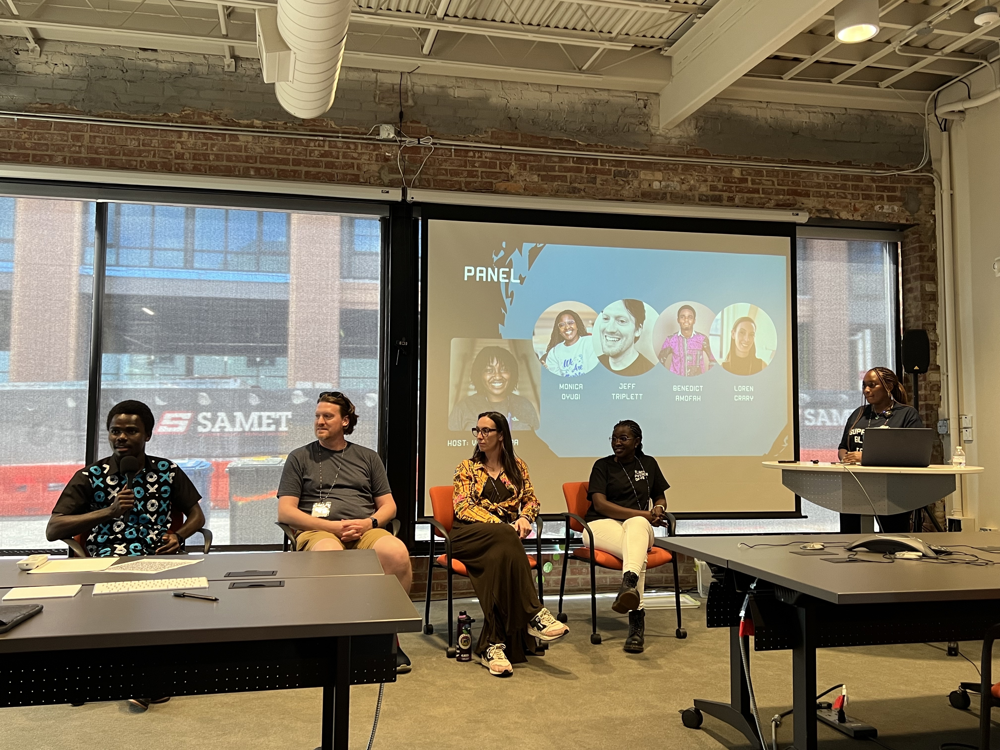

Me, Abigail Afi Gbadago, and Velda Kiara after Black Python Devs Leadership Summit! 
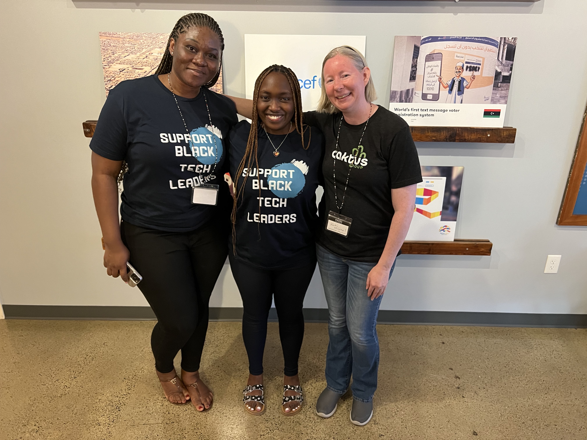

I am so proud of them for the role they played in organizing an outstanding event. It had a lot of heart.

The morning and afternoon replays are available on the info page. 

### Rooftop View of Durham

After the summit, a DjangoCon US attendee who lives at One City Center took a group of us up to the 28th floor for an incredible view of the Durham skyline. 

[Video of the skyline](https://youtu.be/8w3ubfRBK5I)

One City Center rooftop pool
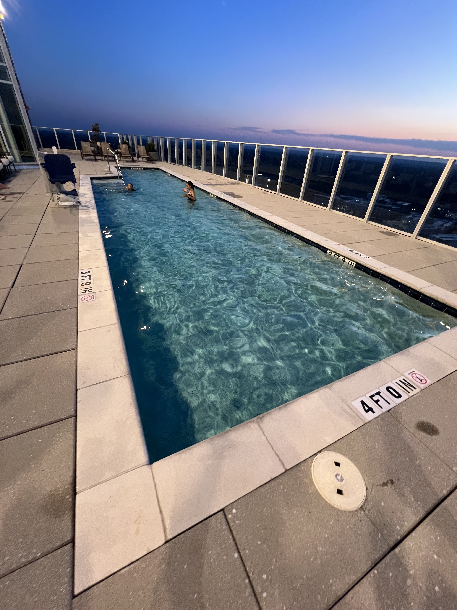

[**back to top**](#table-of-contents)

### Swag Stuffing

On Sunday, I continued my tradition of swag stuffing. Conference pro-tip: it's a great opportunity to meet people! 

[**back to top**](#table-of-contents)

### Django Social

For the second year in a row, Foxley Talent spearheaded a Django Social event at [Ponysaurus Brewing Company](https://www.ponysaurusbrewing.com/). 

A sign of a fantastic event: it was over before I knew it. I had the chance to catch up with "old" friends and meet new ones. 

Djangonauts at Ponysaurus
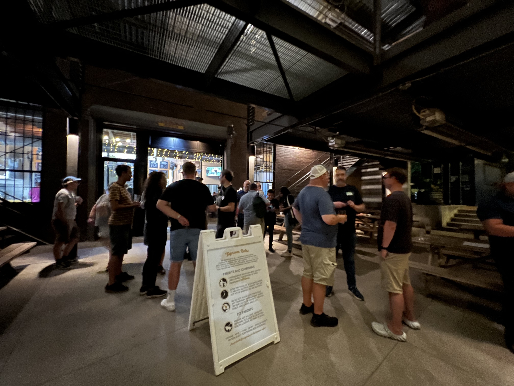

[**back to top**](#table-of-contents)

## Monday

<!--
Keynote - Power to the People who Teach the People
Sheena O'Connell
https://2024.djangocon.us/talks/keynote-monday/

Choosing Wisely: SPA vs. HTMX for Your Next Web Project
Chris May
https://2024.djangocon.us/talks/choosing-wisely-spa-vs-htmx-for-your-next-web-project/

Error Culture
Ryan Cheley
https://2024.djangocon.us/talks/error-culture/

Troubleshooting is a Lifestyle 😎
Jack Linke
https://2024.djangocon.us/talks/troubleshooting-is-a-lifestyle/

A Related Matter: Optimizing your webapp by using django-debug-toolbar, select_related(), and prefetch_related()
Christopher Adams
https://2024.djangocon.us/talks/a-related-matter-optimizing-your-webapp-by-using-django-debug-toolbar-select-related-and-prefetch-related/

https://2024.djangocon.us/talks/the-art-of-not-redirecting/

One Thousand and One Django Sites
Vince Salvino
https://2024.djangocon.us/talks/one-thousand-and-one-django-sites/

Pygoat - Learn django security the hard way
Adarsh Divakaran
https://2024.djangocon.us/talks/pygoat-learn-django-security-the-hard-way/

### Kojo Idressa and Peter Grandstaff Kick Off the Conference

[**back to top**](#table-of-contents)
-->

### Shrimp and Grits

I tried grits as a kid and didn't like them. I've recently been told by friends that I just haven't had the right grits. 

When I saw grits on the DjangoCon US lunch buffet, I had to try them. I still don't like them, but it was an experience! 

North Carolina-inspired lunch
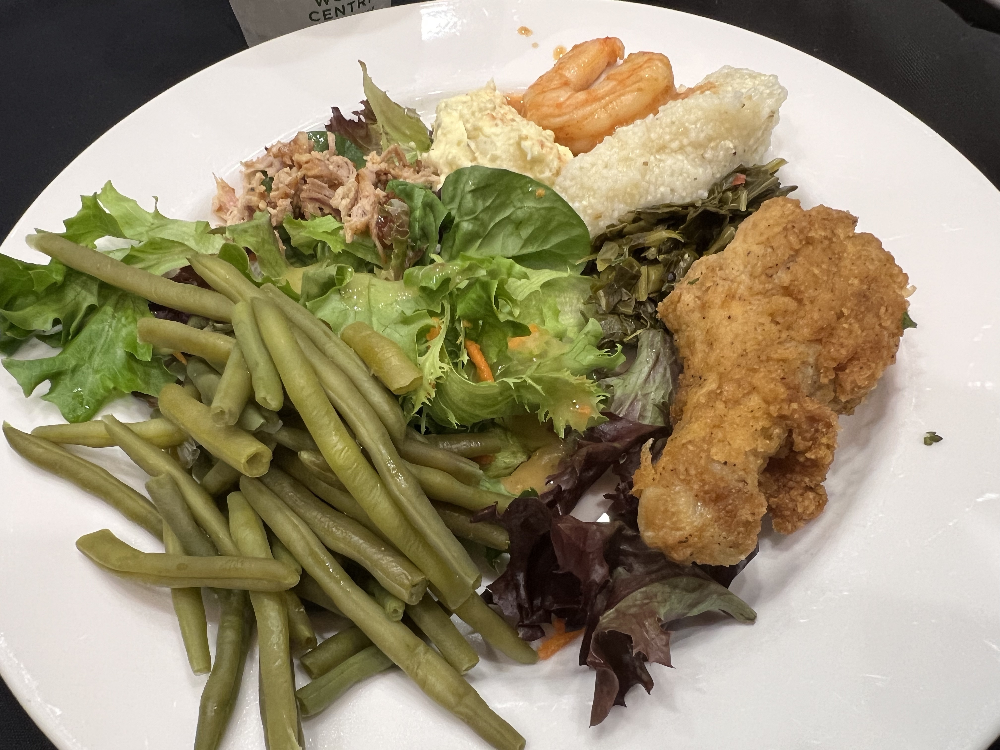

[**back to top**](#table-of-contents)

### DEFNA Board Dinner

DEFNA had a board dinner to discuss business. It was a pleasure to be treated to a gourmet meal at 21c Museum Hotel [Counting House](https://countinghousenc.com/) restaurant. 

I had oysters for the first time and particularly enjoyed the scallops and smoked trout dip. 

The DEFNA Board... wonderful people!
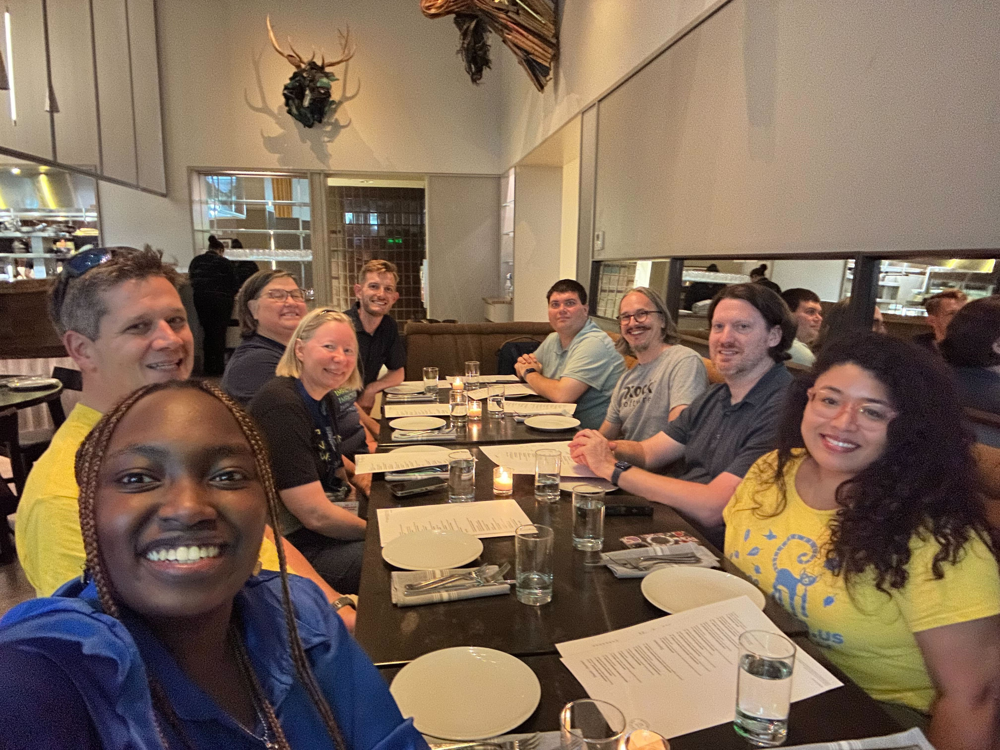

Oysters on the half, blood orange mignonette, cocktail sauce
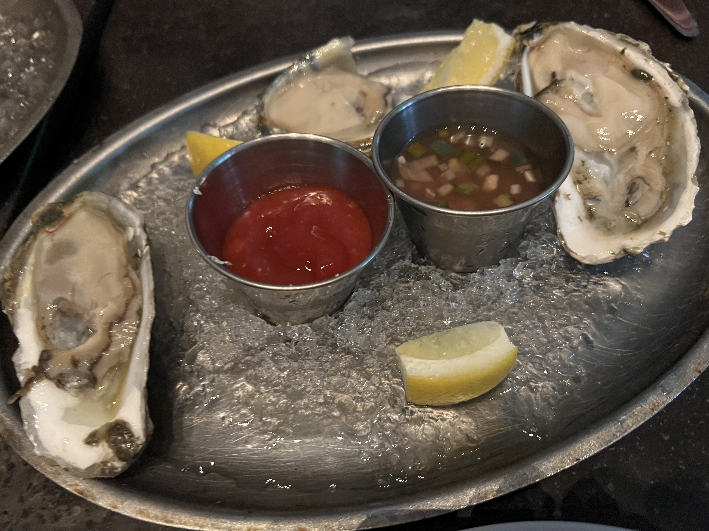

Smoked trout dip, bread & butter pickle, butter-fried saltine
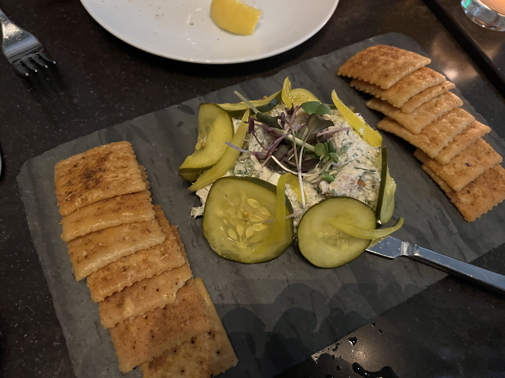

Diver scallops, pecorino english pea puree, radish & snow pea orzo salad, pea tendrils; Sherry Berry lifts me up, lustau sherry, capelleti, strawberry, aromatic bitters, tonic
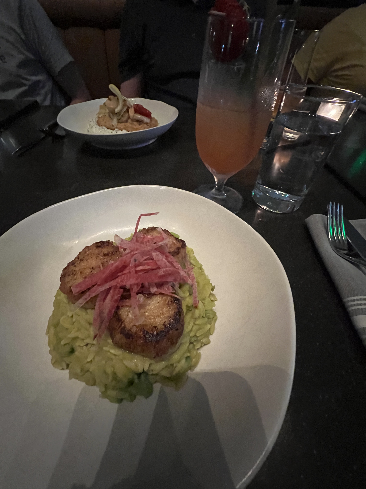

Chocolate cremieux, dark chocolate, hazelnut, Italian meringue, decaf coffee

[**back to top**](#table-of-contents)

## Tuesday

<!--
Keynote - How To Be A Developer and Other Lies We Tell Ourselves
Mario Munoz
https://2024.djangocon.us/talks/keynote-tuesday/
https://2024.djangocon.us/news/introducing-keynote-mario-munoz/

Django + Alpine.js + htmx Ups & Downs
Karen Tracey
https://2024.djangocon.us/talks/django-alpine-js-htmx-ups-downs/

PostgreSQL Beyond Django: Strategies to Get Max Performance
Álvaro Justen
https://2024.djangocon.us/talks/postgresql-beyond-django-strategies-to-get-max-performance/

If We Had $1,000,000: What Could The DSF Do With 4x Its Budget?
Jacob Kaplan-Moss
https://2024.djangocon.us/talks/if-we-had-1000000-what-could-the-dsf-do-with-4x-its-budget/

Lessons from E2E Testing Web Applications
Avindra Fernando
https://2024.djangocon.us/talks/lessons-from-e2e-testing-web-applications/

Only reliable Data: Protecting Database Integrity
Eva Nanyonga
https://2024.djangocon.us/talks/only-reliable-data-protecting-database-integrity/
Transaction atomicity
Concurrency control
Durability through logging

How to design and implement extensible software with plugins
Simon Willison
https://2024.djangocon.us/talks/how-to-design-and-implement-extensible-software-with-plugins/
https://pluggy.readthedocs.io/en/stable/
https://packaging.python.org/en/latest/specifications/entry-points/

Faster, leaner, greener: 10x lower website carbon emissions
Thibaud Colas
https://2024.djangocon.us/talks/faster-leaner-greener-10x-lower-website-carbon-emissions/

Fighting Homelessness with Django
Benjamin "Zags" Zagorsky
https://2024.djangocon.us/talks/fighting-homelessness-with-django/
https://publichousingapplication.ocd.state.ma.us/
-->

### Meeting Lorenzo

After years of following each other on social media, Lorenzo Peña and I had the chance to meet in person! It was wonderful to hear about his dream trip to DjangoCon US. 

Lorenzo's social media post
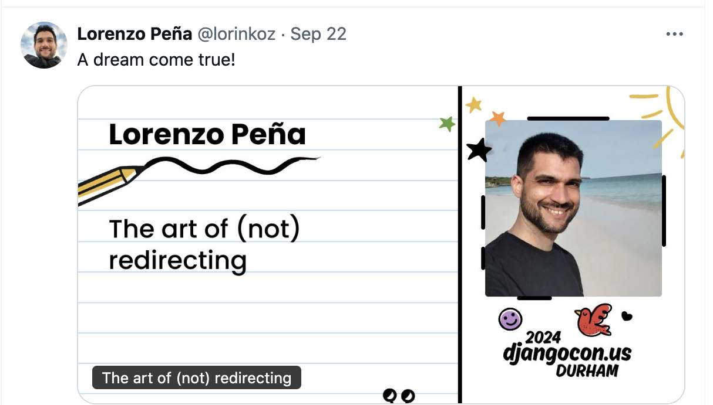

I was thrilled that he had the chance to present a talk [The art of (not) redirecting](https://2024.djangocon.us/talks/the-art-of-not-redirecting/) and attend the speaker/organizer dinner too. 

Me and Lorenzo

[**back to top**](#table-of-contents)

### Speaker and Organizer Dinner

On Tuesday night, I attended the speaker/organizer dinner at [Greer Street Garden](https://geerstreetgarden.com/about). 

It was a chance to relax, enjoy some good food and conversation. 

Sitting next to Simon Willison, co-creator of Django, I couldn't resist getting a photo!

I wrote about Simon's PyCon US 2024 talk about Imitation Intelligence in my [PyCon US Recap](https://katherinemichel.github.io/portfolio/pycon-us-2024-recap.html#simon-willison-keynote). 

Me and Simon (photo credit: Natalia Bidart)
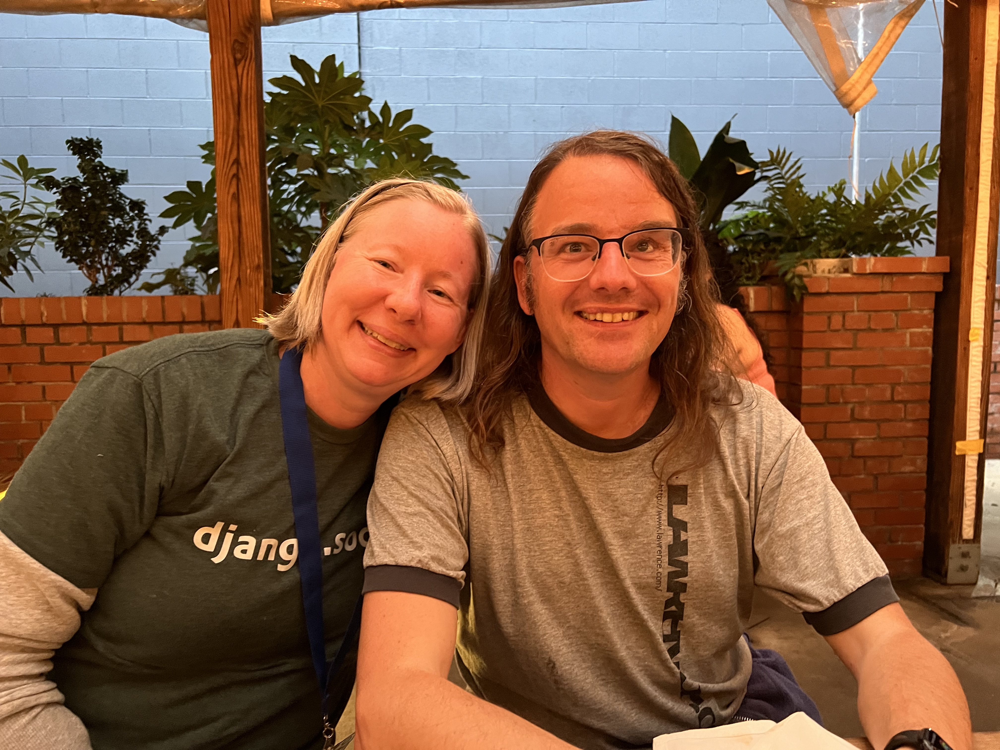

[**back to top**](#table-of-contents)

### The Boxcar Bar and Arcade

After the speaker/organizer dinner, [Six Feet Up](https://www.sixfeetup.com/) hosted a Mario Kart competition across the street at [The Boxcar Bar and Arcade](https://theboxcarbar.com/). 

I spotted a few favorite old school games too: Super Pac-Man, Ms. Pac-Man, Donkey Kong, BurgerTime, Frogger. 

[Video of Boxcar Arcade](https://youtu.be/gO1CcdgQ9II)

Super Pac-Man

Me standing in front of the bar at Boxcar
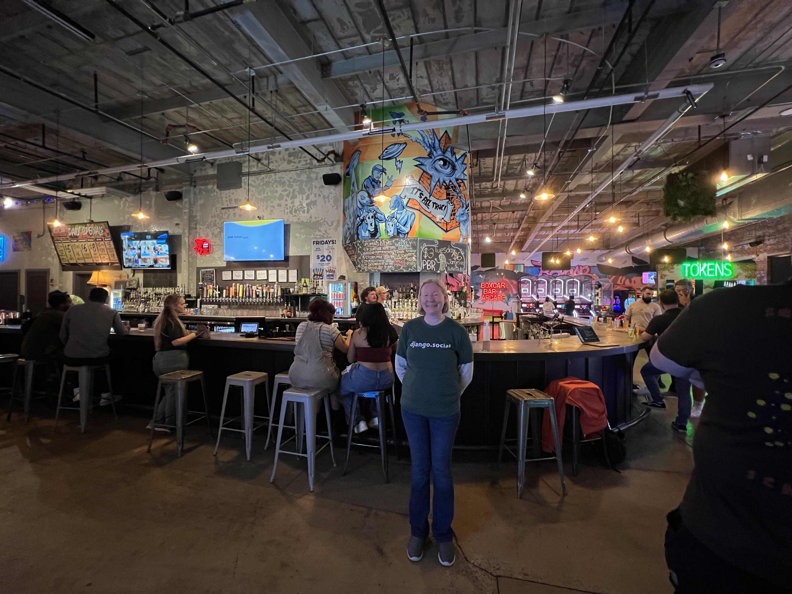

[**back to top**](#table-of-contents)

## Wednesday

<!--
Deep Dive
Keynote - The Fellowship of the Pony
Natalia Bidart
https://2024.djangocon.us/talks/keynote-wednesday/
https://2024.djangocon.us/news/introducing-keynote-natalia-bidart/

Deep Dive
Hidden gems of Django 5.x
Sarah Boyce
https://2024.djangocon.us/talks/hidden-gems-of-django-5-x/
https://docs.djangoproject.com/en/5.1/releases/5.0/

Deep Dive
A Brief History of Django
Frank Wiles
https://2024.djangocon.us/talks/a-brief-history-of-django/

Deep Dive
WebRTC with Django, Channels, HTMX, and coturn
Ken Whitesell
https://2024.djangocon.us/talks/webrtc-with-django-channels-htmx-and-coturn/
Web Real Time Communications (WebRTC)
https://en.wikipedia.org/wiki/WebRTC
https://github.com/coturn/coturn

Deep Dive
A Guided Tour Through Postgres Internals
Elizabeth Garrett Christensen
https://2024.djangocon.us/talks/a-guided-tour-through-postgres-internals/
https://www.postgresql.org/

Deep Dive
Django User Model: Past, Present, and Future
Will Vincent
https://2024.djangocon.us/talks/django-user-model-past-present-and-future/
https://buttondown.com/carlton/archive/evolving-djangos-authuser/

Deep Dive
API Maybe: Bootstrapping a Web Application circa 2024
Carlton Gibson
https://2024.djangocon.us/talks/api-maybe-bootstrapping-a-web-application-circa-2024/

Panel Discussion: Open, friendly, and welcoming: on the history and future of mentoring in Django
-->

### Lightning Talk Cameo

It's no secret that I've been using social media for networking for many years now. During a lightning talk entitled Coffee Break Career hFoxley Talent's Jon Gould features one of my posts i 

Jon included me in lightning talk

<!--
Slide screenshot

Video
-->

[**back to top**](#table-of-contents)

### Panel Discussion: Open, friendly, and welcoming: on the history and future of mentoring in Django

<!--
Lacey Henschel
Keanya Phelps
Afi Maame Dufie
Sarah Boyce
Carlton Gibson
Velda Kiara
-->

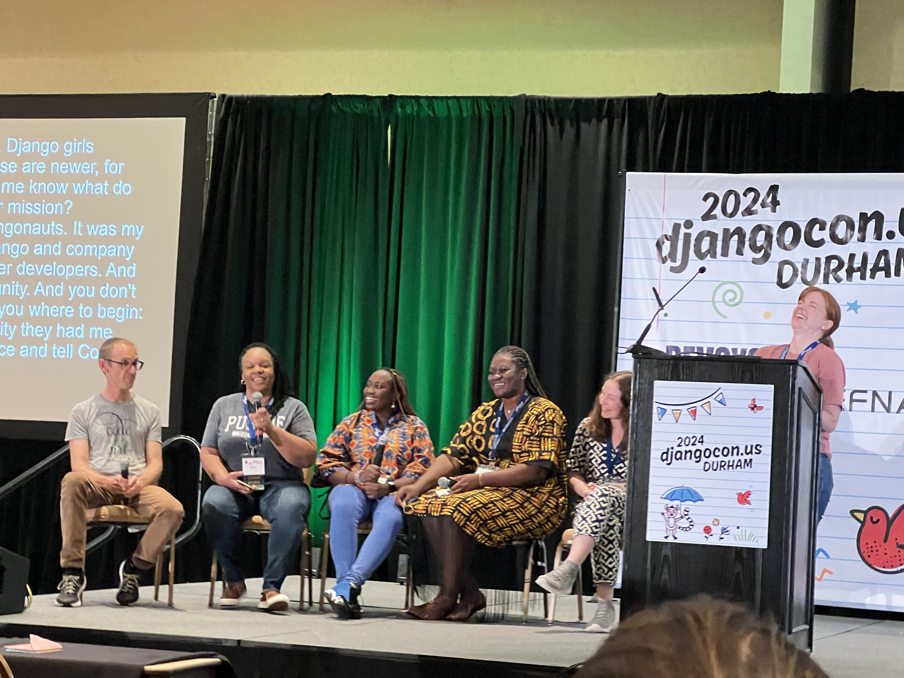

[**back to top**](#table-of-contents)

### Thank You

Thank you to my fellow DEFNA Board Members, volunteers, and everyone who made this another wonderful event! 

Thank you card
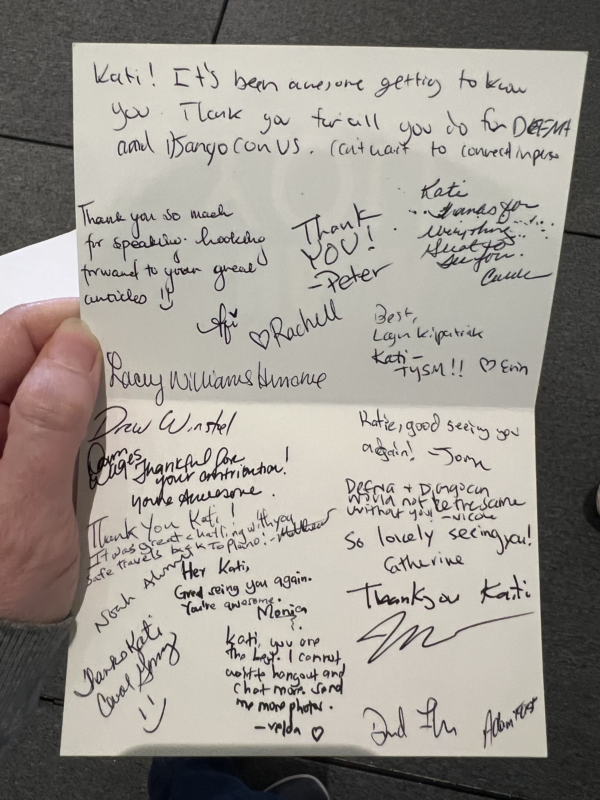

[**back to top**](#table-of-contents)

### Queeny's 

After the conference had ended, I joined a group of Wagtail developers and Eva Nanyonga and walked the short distance to [Queeny's](https://www.queenysdurham.com/), a DjangoCon US institution. No one ever seems to turn down dinner at Queeny's. :) 

Group pic!
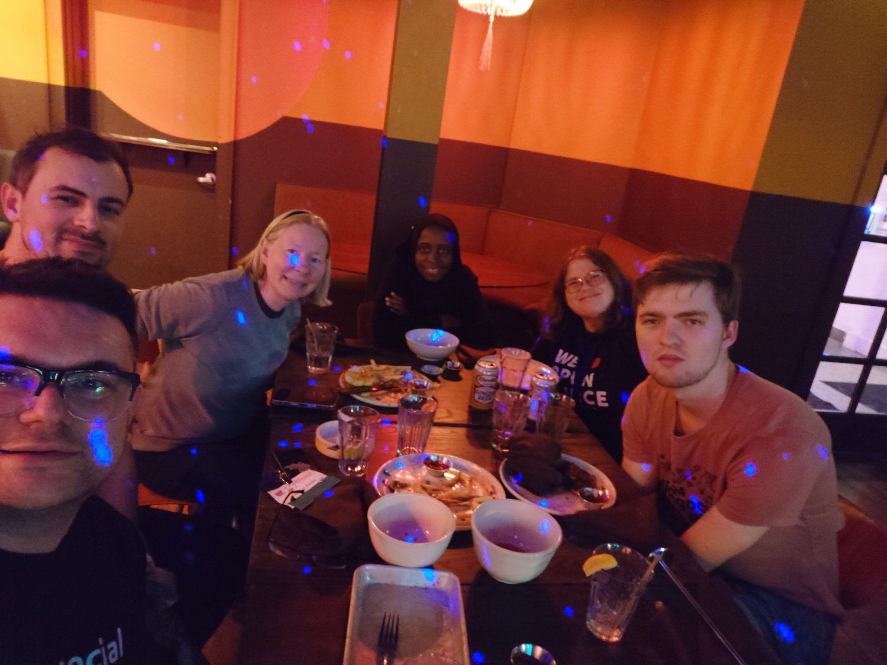

[**back to top**](#table-of-contents)

## Hallway track

<!--
Comment
-->

[**back to top**](#table-of-contents)

### Connections Made

<!--
Jay- earlier process
Thibaud- sustainability, DjangoCon Europe website
Frank- rumblings of a Lawrence Django event
Paul, Alex psychological safety for newcomers
Lee, Adam and tools
Simon- senior level and tuba museum
Lacey- I can learn anything
Noah and Jib- MongoDB
Sanjeets Joodnan
Meeting the new Django Fellow Sarah Boyce
-->

[**back to top**](#table-of-contents)

### Swag

Velda and John showing off John's DjangoCon US tote bag... "famous" people signed it, including me! 
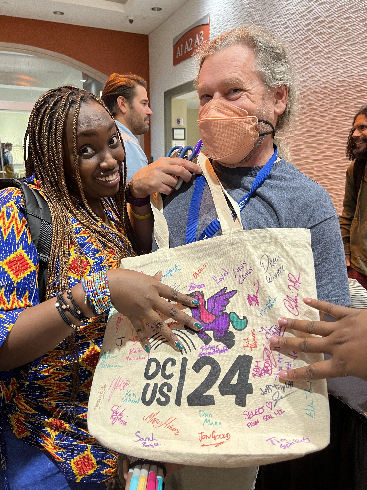

Black Python Devs Leadership Summit bead lanyard made by an artisan in Kenya, African bracelet, Kenyan coffee made with beans from Velda's family's farm, PostgreSQL hat, Valkey sticker, DjangoCon US shirt, Caktus shirt
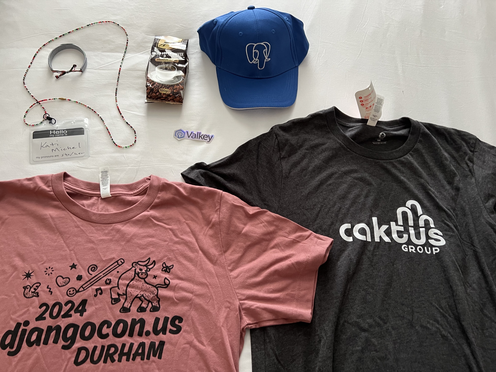

[**back to top**](#table-of-contents)

### Django Social T-Shirt

In 2023, Foxley Talent gifted me a Django Social t-shirt. Foxley Talent Recruiter Jon Gould and I took a photo with me wearing it. We recreated the photo! 

Me and Jon
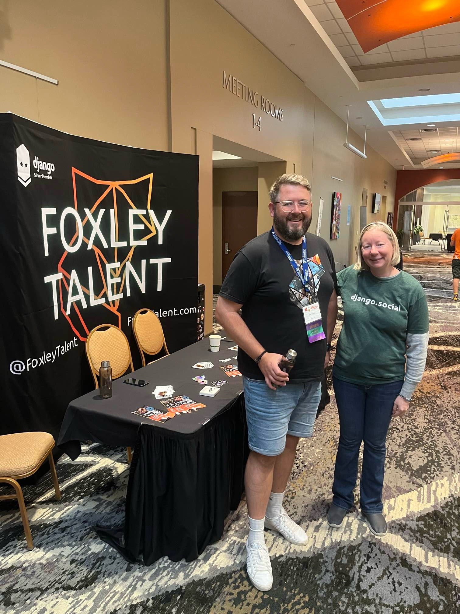

[**back to top**](#table-of-contents)

### Visa Frustration

As our conference becomes more diverse, a common frustration has emerged: difficulty getting a visa to enter the US. People from multiple countries have voiced their frustration about this to me. Django community member Julius Boakye poured his heart into a must-read post about it: [Breaking Barriers: A Tech Speaker’s Plea for Fair Visa Policies](https://medium.com/@theflyboy/breaking-barriers-a-tech-speakers-plea-for-fair-visa-policies-621b5909e496).

[**back to top**](#table-of-contents)

## Thursday

### Sprints

Caktus offices around the corner from the Marriott are the perfect sprint venue. 

Me and Carlton
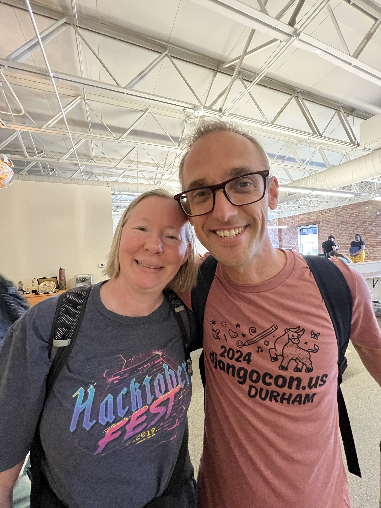

I was racking brain to figure out what to eat for lunch. I joined a group and walked the short distance to [Pie Pushers](https://www.piepushers.com/). 

A slice of Italian susage and a simple house salad really hit the spot! It was the best tasting pizza I've had in quite a while. 

Italian susage and a simple house salad
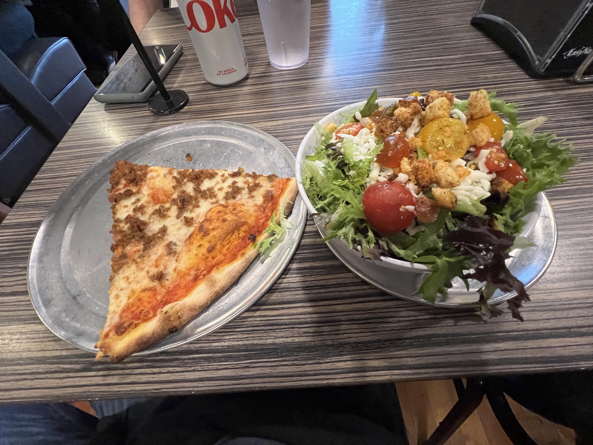

[**back to top**](#table-of-contents)

## Another Great Adventure

The talk replays will be available on the [DjangoCon US YouTube channel](https://www.youtube.com/c/DjangoConUS) in a few weeks. 

Nice visual metaphor taken along the side of the conference hotel during Centerfest

<!--
DjangoCon US Organizers (photo credit: Bartek Pawlik (https://bartpawlik.format.com/))

-->

[**back to top**](#table-of-contents)

## Sight Seeing and More Food!

[**back to top**](#table-of-contents)

### Sarah P. Duke Gardens

For months, I had been looking forward to making it back to the [Sarah P. Duke Gardens](https://gardens.duke.edu/). It is "the Cadillac" of botanical gardens with jaw dropping scenes everywhere. It's also said to be a different garden with every new season or even new month. I'd visit Durham again just to go back. 

<!--
Video
-->

Fish pool, historic terraces, and Cindy Brodhead Pergola
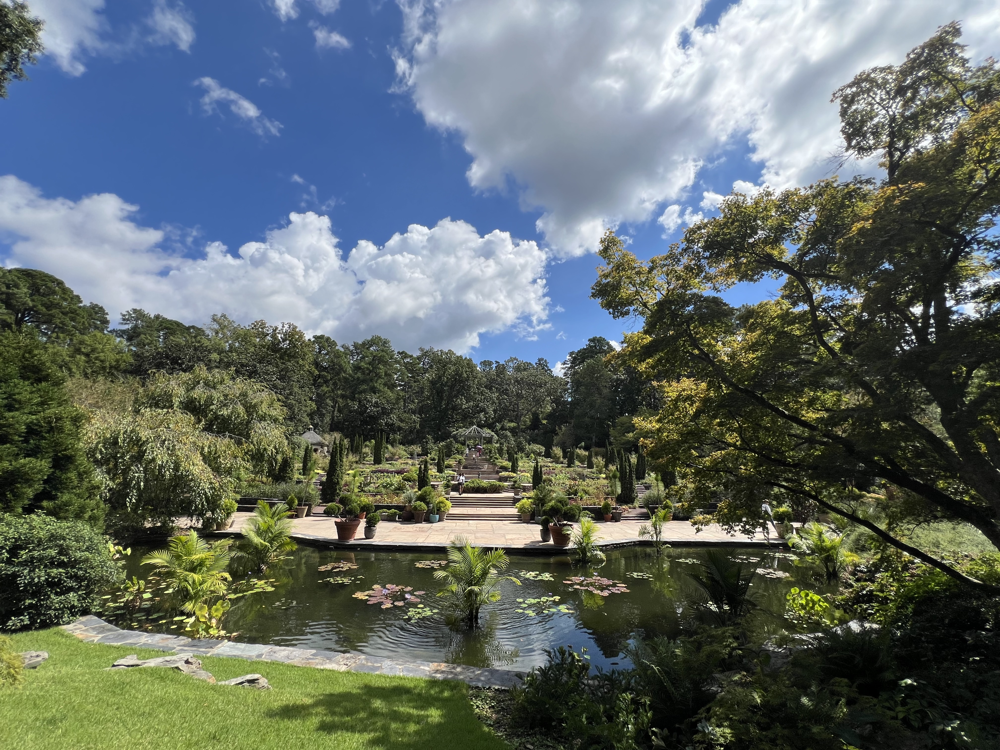

Red Bridge

Ducks at the Red Bridge

South Lawn

[**back to top**](#table-of-contents)

### Cocoa Cinnamon

I love [Cocoa Cinnamon](https://littlewaves.coffee/pages/old-north-durham) coffee shop. I first tried it last year and went back several times during DjangoCon US. I don't just love it for the coffee, which is amazing, by the way. On my first visit this year, I was offered a free Chai Latte. As I sat drinking it, they offered a free coffee that was redeemed by a student sitting studying. According to their menu, they also offer reduced price coffees as a service to the community. It's nice to patronize a business that shows kindness. 

Drinks had:
* Chai Latte: "Housemade chai blend of cinnamon, cardamon, ginger, rose, anise, & black pepper served unsweetened or with honey or vanilla syrup"
* Caramelo: "Sweet & creamy latte with with dulce de leche named for Sandra Cisneros' novel" 
* Al Mohka: "Latte with 70% single origin housemade chocolate sauce & cinnamon. Reference to first ever coffee port"

Cocoa Cinnamon... a short walk from the convention center

Yum! 

[**back to top**](#table-of-contents)

### The Can Opener

I acted on a tip from fellow DEFNA Board Member Drew Winstel and visited The Can Opener. 

Build in the 1940s when vehicles weren't as large, [The Can Opener](https://www.atlasobscura.com/places/truck-decapitating-bridge), a railroad trestle bridge, was a mere 11 feet, 8 inches tall until 8 inches were added in 2019. Even with this improvement and warning signs well in advance, the bridge continues to peel the tops off trucks. 

The Can Opener

<!--
https://www.instagram.com/thecanopenerdurham/?hl=en
https://downtowndurham.com/directory/the-can-opener/
-->

[**back to top**](#table-of-contents)

### 21c Museum Hotel

Last year, I didn't make it ot the [21c Museum Hotel](https://www.21cmuseumhotels.com/) to see the artwork, so I thought it would be a fun experience this year. The hotel is filled with artwork. I was particularly taken by the see-into bathrooms, and the bank vault was a fun throwback to the hotel's past as a bank. 

<!--
Video
-->

The bathroom window is transparent until you turn the lock, then it becomes opaque
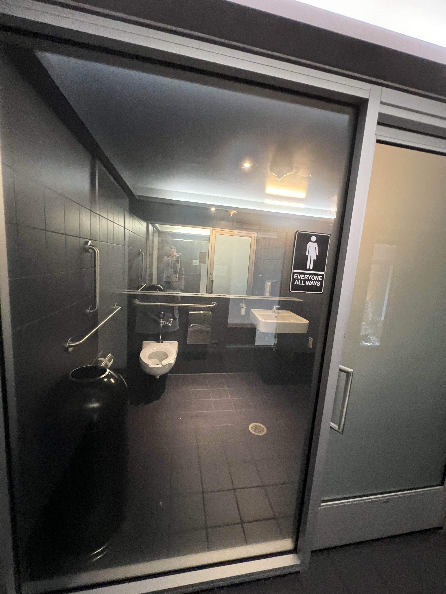

Bank vault entry

Bank vault- first room

Bank vault- inner room

[**back to top**](#table-of-contents)

### The Durham Hotel

I went to [The Durham Hotel](https://www.thedurham.com/roof/), because I heard it has the best public view of the Durham skyline in town. I later had a much higher view of the skyline from the private 28th floor of One City Center, but The Durham Hotel architecture and interior design were well worth a visit in their own right.  

Wow! I love this lobby. 
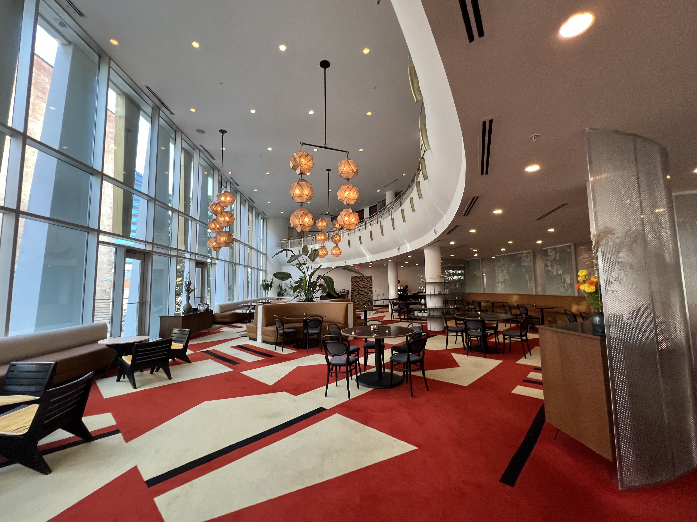

Skyline left

Skyline right
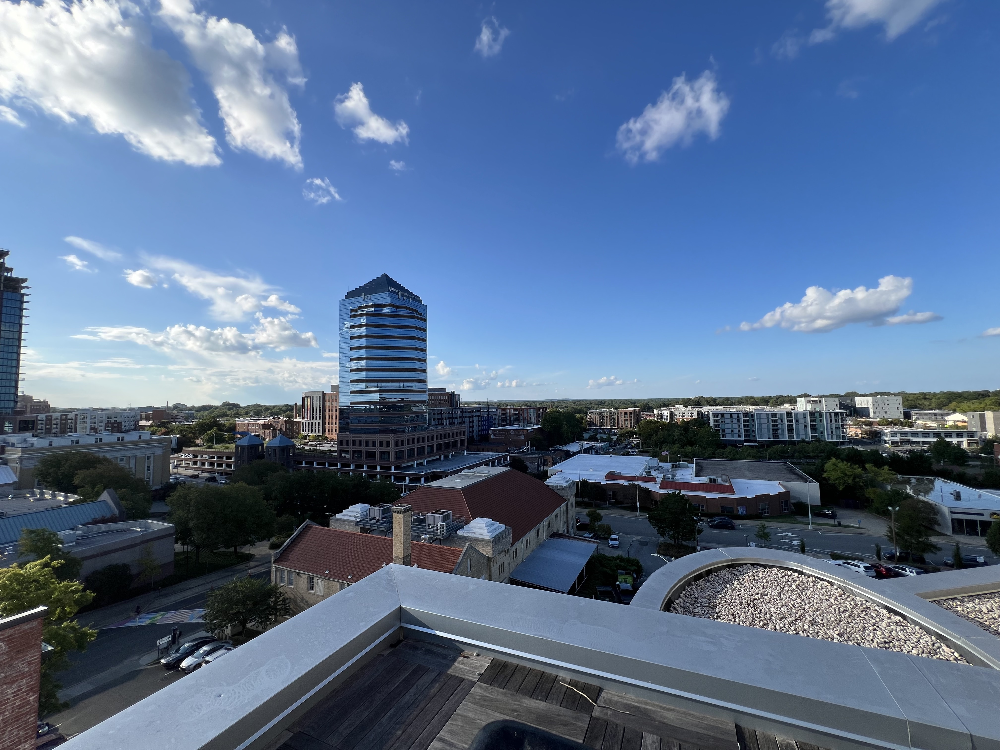

[**back to top**](#table-of-contents)

### Mother and Sons

[Mother and Sons](https://www.mothersandsonsnc.com/)

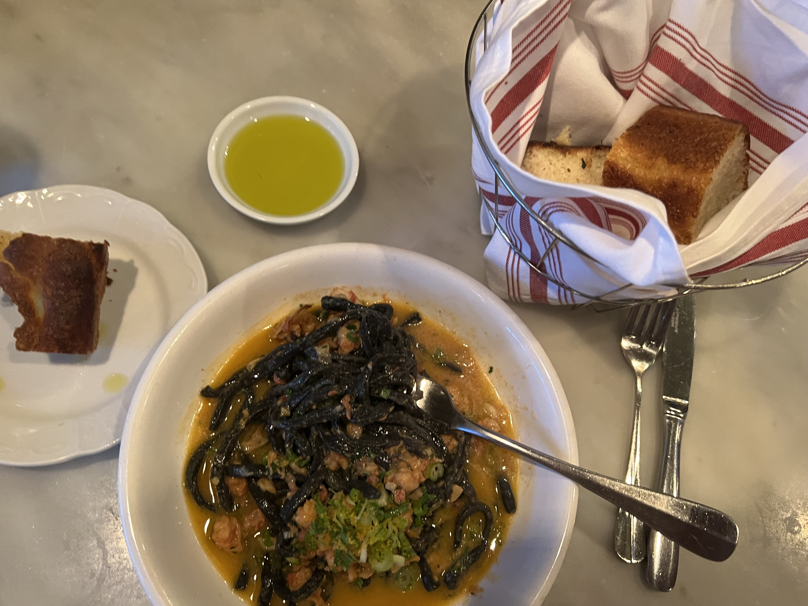

[**back to top**](#table-of-contents)

### Durham Food Hall

I'd already eaten, but joined a few attendees to walk over to the [Durham Food Hall](https://durhamfoodhall.com/) so they could eat. It was a thriving place with a lot of great options. 

Looking down at the first floor of the food hall
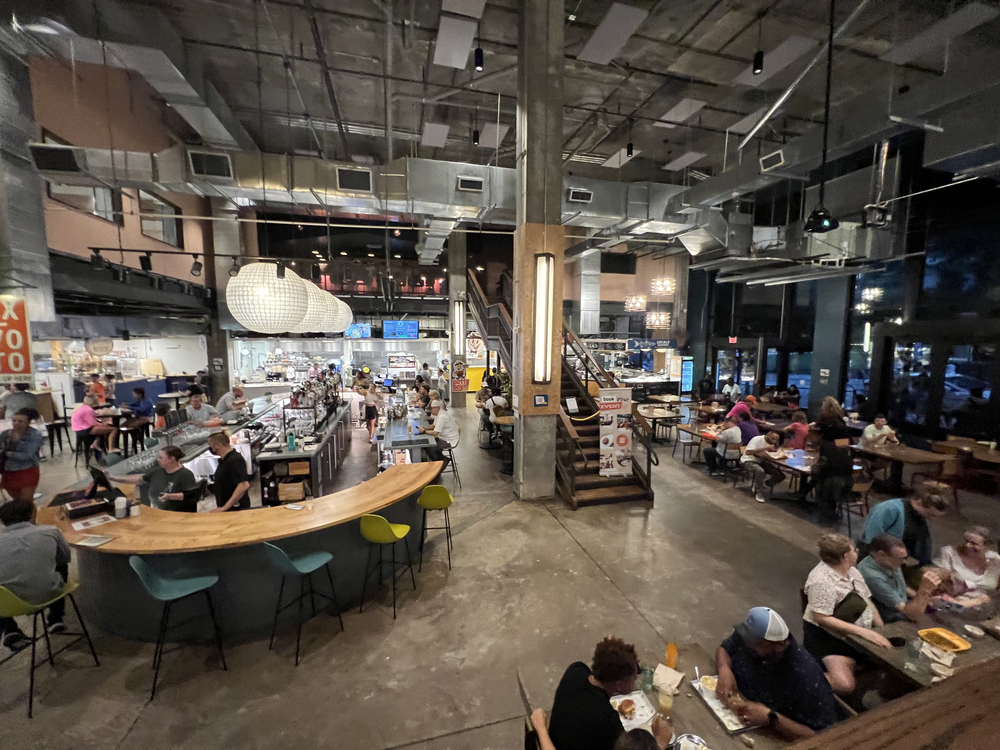

[**back to top**](#table-of-contents)

### Press Coffee, Crepes,and Cocktails

I love [Press Coffee, Crepes, and Cocktails](https://pressccc.com/). It's a short walk south of the downtown and well worth it. It's a coffeehouse specializing in savory and sweet crepes. The space has a bright, energectic vibe and the food and coffee are very high quality.   

First time eating avocado toast... I went big! This was gourmet quality, for sure. The seasonal salted pistachio mocha latte was to die for. 
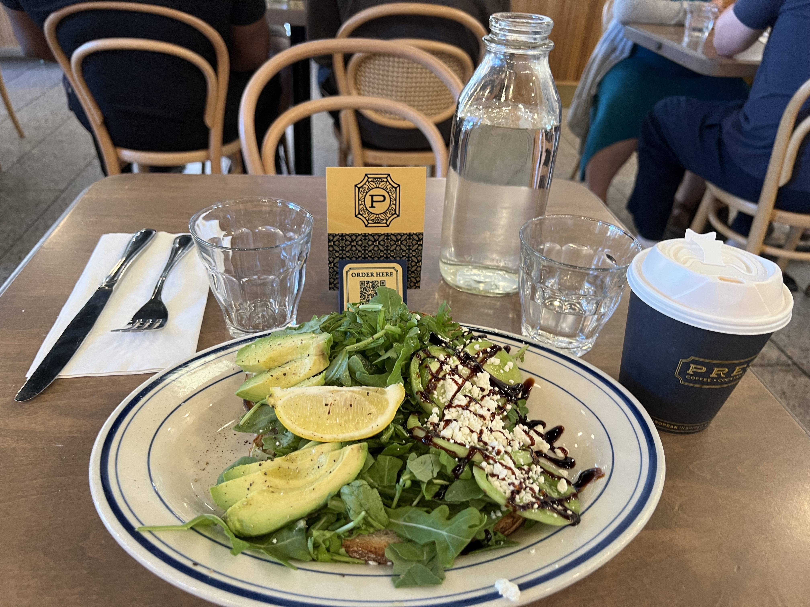

Oh my, this berries crepe was absolutely delicious. I had a banana bread latte too that was chef's kiss. 

[**back to top**](#table-of-contents)

### Centerfest

It's wonderful to see Durham's thriving market and festival culture. 

[Centerfest](https://durhamarts.org/centerfest/)

<!--
Barber Shop Quartet video
-->

[**back to top**](#table-of-contents)

### Durham Farmers Market and Craft Market

[Durham Farmer's Market](https://www.durhamfarmersmarket.com/)

[Durham Craft Market](https://durhamcentralpark.org/events/durham-craft-market/)

[**back to top**](#table-of-contents)

### Durham Underground Market

I was looking for a quick, tasty lunch and stumbled upon the [Durham Underground Market](https://makrs.com/durham-underground-market) food trucks. 

[Cousins Maine Lobster](https://www.cousinsmainelobster.com/) piqued my interest. According to the truck, the founders had appeared on Shark Tank. 

I ordered a lobster tail, but they were out, so they upgraded me to a lobster roll and tots. It was my first time eating a lobster roll. It was tasty! 

This was the moment when I realized my low cholesterol diet was officially suspended
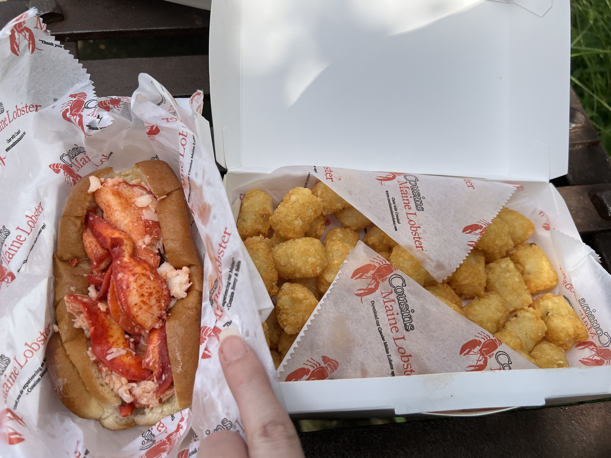

[**back to top**](#table-of-contents)

### Unscripted Rooftop Pool

I had the chance to spend time at the [Unscripted Hotel](https://www.unscriptedhotels.com/). The rooftop overlooks the downtown and features a pool, bar, and DJ. It was an unforgettable atmosphere. 

[Video of the Unscripted rooftop pool](https://youtu.be/_5-08ssL8Wk)

Unscripted rooftop pool
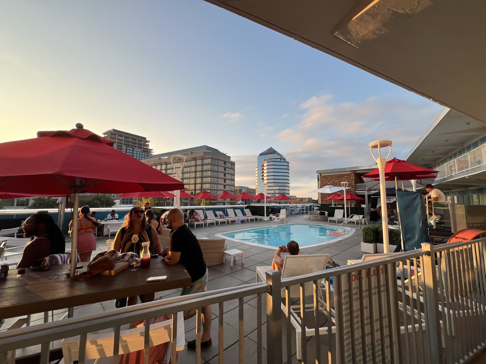

[**back to top**](#table-of-contents)

### The Parlour

I made a trip to [The Parlour](https://theparlour.co/) for the second year in a row. Last year, I had chocolate and was underwhelmed. This year, I had their most popular flavor- Salted Butter Caramel. It was truly incredible. Hope to make it back to Durham someday and visit The Parlour again! 

Salted Butter Caramel
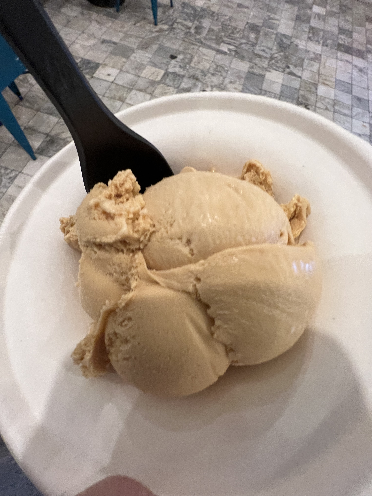

[**back to top**](#table-of-contents)

Videos
Photo credits?

Mother and Sons
Cocoa Cinnamon
Saturday
Bull McCabes Irish Pub
Sunday
Neomonde
https://www.neomonde.com/mediterranean-restaurant-durham/

Talks
Side conversations
Opportunities to connect

Organizers
https://2024.djangocon.us/organizers/

Schedule
https://2024.djangocon.us/schedule/

Hackathon
https://2024.djangocon.us/hackathon/

Board Game Night

Tutorials / Sunday, Sep 22

Lightning Talks
Andrew Mshar

Orientation
Kojo Idrissa

Opening Remarks
Closing Remarks
Peter Grandstaff

https://2024.djangocon.us/talks/the-art-of-not-redirecting/
https://2024.djangocon.us/talks/operations-missing-django-piece/

## 9-23

https://2024.djangocon.us/schedule/#Day-2

### Keynote

Keynote - Power to the People who Teach the People
Sheena O'Connell
https://2024.djangocon.us/talks/keynote-monday/
https://2024.djangocon.us/news/introducing-keynote-sheena-oconnell/
Bloom’s 2 sigma problem
https://en.wikipedia.org/wiki/Bloom%27s_2_sigma_problem
Mastery based learning 
https://en.wikipedia.org/wiki/Mastery_learning
"Education is not the filling of a pail, but the lighting of a fire"
https://www.irishtimes.com/news/education/education-is-not-the-filling-of-a-pail-but-the-lighting-of-a-fire-it-s-an-inspiring-quote-but-did-wb-yeats-say-it-1.1560192
Growth mindset versus fixed mindset
https://online.hbs.edu/blog/post/growth-mindset-vs-fixed-mindset
Growth mindset is a spectrum 
Foster a growth mindset 
Huberman Lab Podcast
https://www.hubermanlab.com/podcast
MLB and growth mindset effects
Meta cognition 
https://en.wikipedia.org/wiki/Metacognition
Protege effect
https://www.growthengineering.co.uk/protege-effect/
Retrieval practice
https://www.retrievalpractice.org/
The Guild of Educators
https://www.sheenaoc.com/articles/2024-09-12-introducing-goe
Learning Sprint tutorial: Django, htmx, playwright, tailwind, maybe alpine 
PyCon Namibia questions… hard to get Europeans to ask questions
Desperation mindset 
Stereotype threat… sense of belonging
https://en.wikipedia.org/wiki/Stereotype_threat
Anonymous letters… they are telling my story 
Slides at end

### Agenda

Troubleshooting is a Lifestyle 😎
Jack Linke
https://2024.djangocon.us/talks/troubleshooting-is-a-lifestyle/

Error Culture
Ryan Cheley
https://2024.djangocon.us/talks/error-culture/
Error culture definition 
https://fs.blog/chestertons-fence/
Actionable alert

Pygoat - Learn django security the hard way
Adarsh Divakaran
https://2024.djangocon.us/talks/pygoat-learn-django-security-the-hard-way/
https://owasp.org/www-project-pygoat/
https://github.com/adeyosemanputra/pygoat

One Thousand and One Django Sites
Vince Salvino
https://2024.djangocon.us/talks/one-thousand-and-one-django-sites/

### Agenda- HTMX

Choosing Wisely: SPA vs. HTMX for Your Next Web Project
Chris May
https://2024.djangocon.us/talks/choosing-wisely-spa-vs-htmx-for-your-next-web-project/
Unicorn
https://www.django-unicorn.com/
htmx
alpine.js 
django-template-partials
https://github.com/carltongibson/django-template-partials
django-components
https://pypi.org/project/django-components/
Datastar
https://datastar.fly.dev/
Unpoly
https://unpoly.com/
Unuzi- Sheena
https://www.sheenaoc.com/articles/2024-06-30-htmx
Context- David Guillot
OpenUnited- dev velocity improved by 500%
https://www.reddit.com/r/django/comments/176882w/results_of_porting_openunited_from_react_to/
Taylor Hunt
https://dev.to/tigt/making-the-worlds-fastest-website-and-other-mistakes-56na
Chris will create a blog post with streaming info

### Performance and Optimization

A Related Matter: Optimizing your webapp by using django-debug-toolbar, select_related(), and prefetch_related()
Christopher Adams
https://2024.djangocon.us/talks/a-related-matter-optimizing-your-webapp-by-using-django-debug-toolbar-select-related-and-prefetch-related/
https://django-debug-toolbar.readthedocs.io/en/latest/
Other django-debut-toolbar uses

### Personal

Passkeys: Your password-free future
Ryan Hiebert
https://2024.djangocon.us/talks/passkeys-your-password-free-future/
OpenID (remember that?), Federation, Single Sign-on, Magic Links, and Login Codes
Passkeys

## Recap

Deep Dive
Keynote - The Fellowship of the Pony
Natalia Bidart
https://2024.djangocon.us/talks/keynote-wednesday/
https://2024.djangocon.us/news/introducing-keynote-natalia-bidart/

### DSF News and Django History

If We Had $1,000,000: What Could The DSF Do With 4x Its Budget?
Jacob Kaplan-Moss
https://2024.djangocon.us/talks/if-we-had-1000000-what-could-the-dsf-do-with-4x-its-budget/
https://www.djangoproject.com/foundation/

Deep Dive
A Brief History of Django
Frank Wiles
https://2024.djangocon.us/talks/a-brief-history-of-django/

Deep Dive
Panel Discussion: Open, friendly, and welcoming: on the history and future of mentoring in Django
Lacey Henschel
https://2024.djangocon.us/talks/panel-discussion-mentoring-django/
https://2024.djangocon.us/news/introducing-discussion-panel/

## Keynotes

Keynote - How To Be A Developer and Other Lies We Tell Ourselves
Mario Munoz
https://2024.djangocon.us/talks/keynote-tuesday/
https://2024.djangocon.us/news/introducing-keynote-mario-munoz/

## Agenda- Django Fellows and Teachers

Deep Dive
Hidden gems of Django 5.x
Sarah Boyce
https://2024.djangocon.us/talks/hidden-gems-of-django-5-x/
https://docs.djangoproject.com/en/5.1/releases/5.0/

Deep Dive
Django User Model: Past, Present, and Future
Will Vincent
https://2024.djangocon.us/talks/django-user-model-past-present-and-future/
https://buttondown.com/carlton/archive/evolving-djangos-authuser/

How to design and implement extensible software with plugins
Simon Willison
https://2024.djangocon.us/talks/how-to-design-and-implement-extensible-software-with-plugins/
https://pluggy.readthedocs.io/en/stable/
https://packaging.python.org/en/latest/specifications/entry-points/

Deep Dive
API Maybe: Bootstrapping a Web Application circa 2024
Carlton Gibson
https://2024.djangocon.us/talks/api-maybe-bootstrapping-a-web-application-circa-2024/

## Cancelled

Django from first principles
Eric Matthes
https://2024.djangocon.us/talks/django-from-first-principles/
https://www.mostlypython.com/django-from-first-principles-2/

## Agenda- Database

PostgreSQL Beyond Django: Strategies to Get Max Performance
Álvaro Justen
https://2024.djangocon.us/talks/postgresql-beyond-django-strategies-to-get-max-performance/

Only reliable Data: Protecting Database Integrity
Eva Nanyonga
https://2024.djangocon.us/talks/only-reliable-data-protecting-database-integrity/
Transaction atomicity
Concurrency control
Durability through logging

Deep Dive
A Guided Tour Through Postgres Internals
Elizabeth Garrett Christensen
https://2024.djangocon.us/talks/a-guided-tour-through-postgres-internals/
https://www.postgresql.org/

## Agenda- Database- Online

Online talk
Seamless Transition: How I Converted an Existing MySQL Database to be Fully Managed by Django Migrations Framework
Daniel Ramas
https://2024.djangocon.us/talks/seamless-transition-how-i-converted-an-existing-mysql-database-to-be-fully-managed-by-django-migrations-framework/
https://www.mysql.com/

## Agenda

Faster, leaner, greener: 10x lower website carbon emissions
Thibaud Colas
https://2024.djangocon.us/talks/faster-leaner-greener-10x-lower-website-carbon-emissions/

Fighting Homelessness with Django
Benjamin "Zags" Zagorsky
https://2024.djangocon.us/talks/fighting-homelessness-with-django/
https://publichousingapplication.ocd.state.ma.us/

Lessons from E2E Testing Web Applications
Avindra Fernando
https://2024.djangocon.us/talks/lessons-from-e2e-testing-web-applications/
https://www.cypress.io/
https://playwright.dev/
Andy's comprehensive keynote
https://2023.djangocon.us/talks/keynote-testing-modern-web-apps-like-a-champion/

An Opinionated Guide to Modern Django Forms
Josh Thomas
https://2024.djangocon.us/talks/an-opinionated-guide-to-modern-django-forms/

## Agenda- Online

Deep Dive
Online talk
Django & Celery: A love story of async proportions
Hugo Bessa
https://2024.djangocon.us/talks/django-celery-a-love-story-of-async-proportions/
https://github.com/celery/celery

Online talk
Upgrading EOL Django: A Journey from V1 to V5
Michael Riley
https://2024.djangocon.us/talks/upgrading-eol-django-a-journey-from-v1-to-v5/

Online talk
The Magic of Dependencies Installing Themselves
Ilerioluwakiiye Abolade
https://2024.djangocon.us/talks/the-magic-of-dependencies-installing-themselves/
https://peps.python.org/pep-0723/

## Agenda- Performance and Optimization- Online

Online talk
Unlocking Performance: Benchmarking and profiling Django for Maximum Efficiency
Ron Maravanyika
https://2024.djangocon.us/talks/unlocking-performance-benchmarking-and-profiling-django-for-maximum-efficiency/
https://github.com/jazzband/django-silk
https://github.com/kolofordjango/kolo
https://pytest-benchmark.readthedocs.io/en/latest/

Online talk
Level Up Your Django Performance: Identifying and Taming N+1 Queries
Mohammad Ahtasham ul Hassan
Shafqat Farhan Ahmed
https://2024.djangocon.us/talks/level-up-your-django-performance-identifying-and-taming-n-1-queries/
https://django-debug-toolbar.readthedocs.io/en/latest/
SQL logging

## Agenda- HTMX

Django + Alpine.js + htmx Ups & Downs
Karen Tracey
https://2024.djangocon.us/talks/django-alpine-js-htmx-ups-downs/

## Personal

Deep Dive
WebRTC with Django, Channels, HTMX, and coturn
Ken Whitesell
https://2024.djangocon.us/talks/webrtc-with-django-channels-htmx-and-coturn/
Web Real Time Communications (WebRTC)
https://en.wikipedia.org/wiki/WebRTC
https://github.com/coturn/coturn

path('/user/<user.username:user>/', view_profile)
Willem Van Onsem
Junior Ballroom
https://2024.djangocon.us/talks/path-user-user-username-user-view-profile/

## Personal- Online

Deep Dive
Online talk
Introduction to OpenTelemetry with Django
Jessica Garson
https://2024.djangocon.us/talks/introduction-to-opentelemetry-with-django/
https://opentelemetry.io/

Deep Dive
Online talk
Streaming Video in Django | Demystified
Vaarun Sinha
https://2024.djangocon.us/talks/streaming-video-in-django-demystified/
HLS (HTTP Live Streaming)
MPEG-DASH (Dynamic Adaptive Streaming over HTTP)
HLS vs MPEG-DASH
https://www.ffmpeg.org/
https://channels.readthedocs.io/en/latest/

Online talk
Django UI Components for Perfectionists with Deadlines
Hernan Lozano
https://2024.djangocon.us/talks/reusable-django-template-components-for-perfectionists-with-deadlines/

Open-source Python tools to visualize and analyse geospatial data.
Samweli Mwakisambwe
https://2024.djangocon.us/talks/open-source-python-tools-to-visualize-and-analyse-geospatial-data/

Maps with Django
Paolo Melchiorre
https://2024.djangocon.us/talks/maps-with-django/
GeoDjango
Spatialite/SQLite
PostGIS/PostgreSQL

Django Ledger | Uniting Developers and Accountants for Innovation.
Miguel Sanda
https://2024.djangocon.us/talks/django-ledger-uniting-developers-and-accountants-for-innovation/
https://github.com/arrobalytics/django-ledger

You got that nice tech salary, now what?
Tim Schilling
https://2024.djangocon.us/talks/you-got-that-nice-tech-salary-now-what/

## Additional

Online talk
Project Management in Open Source
Harmony Elendu
https://2024.djangocon.us/talks/project-management-in-open-source/

Online talk
Empowering Tertiary Students: Introducing PyClubs for Enhanced Python Skills and Community Engagement
Johanan Oppong Amoateng
https://2024.djangocon.us/talks/empowering-tertiary-students-introducing-pyclubs-for-enhanced-python-skills-and-community-engagement/

Product 101 for Techies and Tech Teams
Amanda Savluchinske
https://2024.djangocon.us/talks/product-101-for-techies-and-tech-teams/

Django: the web framework that changed my life
Sage Abdullah
https://2024.djangocon.us/talks/django-the-web-framework-that-changed-my-life/

Finding 2.0
Marc Gibbons
https://2024.djangocon.us/talks/finding-2-0/

Optimizing remote work: Pull Requests, Stand-ups, and emojis
Kasey Kelly
https://2024.djangocon.us/talks/optimizing-remote-work-pull-requests-stand-ups-and-emojis/

Deploying Django migrations at Kraken scale
Tim Bell
https://2024.djangocon.us/talks/deploying-django-migrations-at-kraken-scale/

## Cancelled

Django from a Rails Perspective
Lisa Ciaccio
https://2024.djangocon.us/talks/django-from-a-rails-perspective/
