# DjangoCon US 2024 Recap

Table of Contents
-----------------

- [Intro](#intro)
    - [Venue Selection](#venue-selection)
    - [DjangoCon US Website and Design](#djangocon-us-website-and-design)
- [Pre-Conference Activities](#pre-conference-activities)
    - [Sightseeing and Some Great Meals](#sightseeing-and-some-great-meals)
    - [Black Python Devs Leadership Summit](#black-python-devs-leadership-summit)
    - [Rooftop View of Durham](#rooftop-view-of-durham)
    - [Swag Stuffing](#swag-stuffing)
    - [Django Social](#django-social)
- [Monday](#monday)
    - [Keynote- Power to the People who Teach the People](#keynote-power-to-the-people-who-teach-the-people)
    - [Choosing Wisely: SPA vs. HTMX for Your Next Web Project](#choosing-wisely-spa-vs-htmx-for-your-next-web-project)
    - [Error Culture](#error-culture)
    - [Shrimp and Grits](#shrimp-and-grits)
    - [Troubleshooting is a Lifestyle üòé](#troubleshooting-is-a-lifestyle)
    - [A Related Matter: Optimizing your webapp by using django-debug-toolbar, select_related(), and prefetch_related()](#a-related-matter-optimizing-your-webapp-by-using-django-debug-toolbar-select-related-and-prefetch-related)
    - [Unlocking Performance: Benchmarking and profiling Django for Maximum Efficiency](#unlocking-performance-benchmarking-and-profiling-django-for-maximum-efficiency)
    - [DEFNA Board Dinner](#defna-board-dinner)      
- [Tuesday](#tuesday)
    - [Keynote- How To Be A Developer and Other Lies We Tell Ourselves](#keynote-how-to-be-a-developer-and-other-lies-we-tell-ourselves)
    - [PostgreSQL Beyond Django: Strategies to Get Max Performance](#postgresql-beyond-django-strategies-to-get-max-performance)
    - [If We Had $1,000,000: What Could The DSF Do With 4x Its Budget?](#if-we-had-1-000-000-what-could-the-dsf-do-with-4x-its-budget)
    - [django-mongodb](#django-mongodb)
    - [Faster, leaner, greener: 10x lower website carbon emissions](#faster-leaner-greener-10x-lower-website-carbon-emissions)
    - [Meeting Lorenzo](#meeting-lorenzo)
    - [Speaker and Organizer Dinner](#speaker-and-organizer-dinner)
    - [The Boxcar Bar and Arcade](#the-boxcar-bar-and-arcade)
- [Wednesday](#wednesday)
    - [Keynote- The Fellowship of the Pony](#keynote-the-fellowship-of-the-pony)
    - [Hidden gems of Django 5.x](#hidden-gems-of-django-5-x)
    - [Lightning Talk Cameo](#lightning-talk-cameo)
    - [API Maybe: Bootstrapping a Web Application circa 2024](#api-maybe-bootstrapping-a-web-application-circa-2024)
    - [Panel Discussion: Open, friendly, and welcoming: on the history and future of mentoring in Django](#panel-discussion-open-friendly-and-welcoming-on-the-history-and-future-of-mentoring-in-django)
    - [Queeny's](#queenys)
- [Hallway Track](#hallway-track)
    - [Connections Made](#connections-made)
    - [Swag](#swag)
    - [Django Social T-Shirt](#django-social-t-shirt)
    - [Visa Frustration](#visa-frustration)
- [Thursday](#thursday)
    - [Sprints](#sprints)
- [Another Great Adventure](#another-great-adventure)
- [More Sight Seeing and Food](#more-sight-seeing-and-food)
    - [Sarah P. Duke Gardens](#sarah-p-duke-gardens)
    - [Cocoa Cinnamon](#cocoa-cinnamon)
    - [The Can Opener](#the-can-opener)
    - [21c Museum Hotel](#c-museum-hotel)
    - [The Durham Hotel](#the-durham-hotel)
    - [Mother and Sons](#mother-and-sons)
    - [Durham Food Hall](#durham-food-hall)
    - [Press Coffee, Crepes, and Cocktails](#press-coffee-crepes-and-cocktails)
    - [Centerfest](#centerfest)
    - [Durham Market Culture](#durham-market-culture)
    - [Cousins Maine Lobster](#cousins-maine-lobster)
    - [Unscripted Rooftop Pool](#unscripted-rooftop-pool)
    - [The Parlour](#the-parlour)

## Intro

Disclaimer: the content of this post is a reflection of my career journey and not specific to my work at JPMorganChase.

DjangoCon US 2024 took place from September 22-27 in Durham, North Carolina at the Durham Convention Center. It was the seventh DjangoCon US I've had the privilege of attending and an absolute blast! 

Attendees (photo credit: Bartek Pawlik (https://bartpawlik.format.com/))

[**back to top**](#table-of-contents)

### Venue Selection

If you want to bring DjangoCon US to your city or volunteer, we want to hear from you! 

My fellow DEFNA Board Member Adam Fast gave a lightning talk about our search for a venue for 2025 and beyond. Affordability is a challenge.  

<!--
Volunteers
Written form details
-->

As they say in open source, "Given enough eyeballs, all bugs are shallow." Perhaps with the eyeballs of the entire community, we can find an acceptable course of action. 

[Written long-form proposal details](https://www.defna.org/announcements/2024/5/9/djangocon-us-call-for-venue-proposal-2025/)

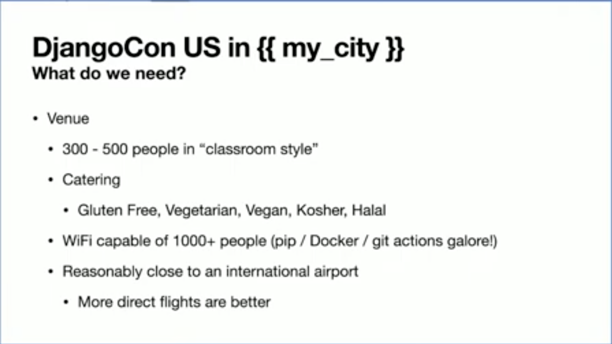

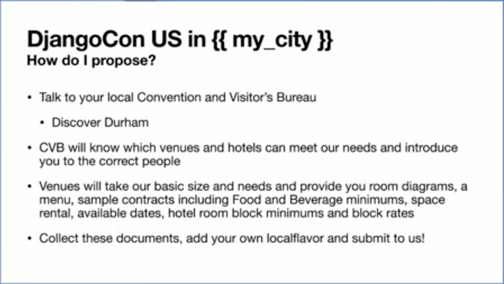

<!--

-->

[**back to top**](#table-of-contents)

### DjangoCon US Website and Design

A number of people have commented that they've really loved the conference t-shirt and bag this year. 

Our wonderful designer Joni Trythall of YupGup did a [DjangoCon US Design Reflection](https://jonitrythall.com/dcus-design-reflection) featuring all of our designs since 2018. 

As a DEFNA Board Member, I've had the pleasure of collaborating with Joni in bringing all of these designs to life. They are so beautiful!

Thank you to Joni for a special shoutout at the end of her post. 

In addition, we did a refactor of our DjangoCon US website backend this year. It's easier to get up and running and has a well documented style guide. 

Feel free to fork it and use it in line with the license. 

[**back to top**](#table-of-contents)

## Pre-Conference Activities

[**back to top**](#table-of-contents)

### Sightseeing and Some Great Meals

I feel privileged to be able to travel. I make the most of every opportunity to get to know a place better: seeing the unique sights, experiencing what makes the culture special, and enjoying the celebrated local cuisine. 

In Durham, I had the chance to revisit the incredible Sarah P. Duke Gardens and see a few other attractions for the first time. Also, although most of my meals were provided through the conference, I enjoyed some outstanding meals in downtown Durham restaurants. 
  
Here are a few of my favorite moments from the trip. See more photos and anecdotes at the end of this post. 

Sarah P. Duke Gardens Red Bridge... jaw dropping scenes

21c Museum Hotel... the bathroom window is transparent until you turn the lock, then it becomes opaque
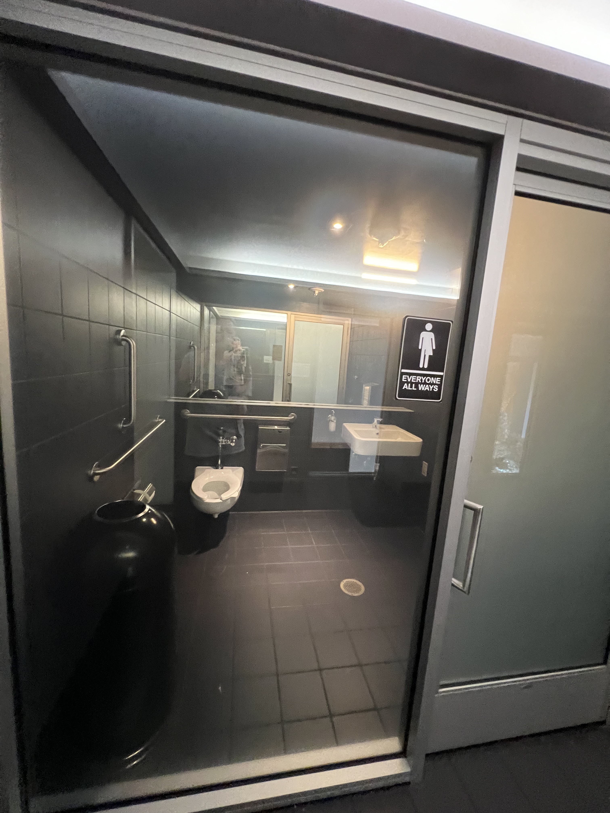

The Durham Hotel lobby... wow!
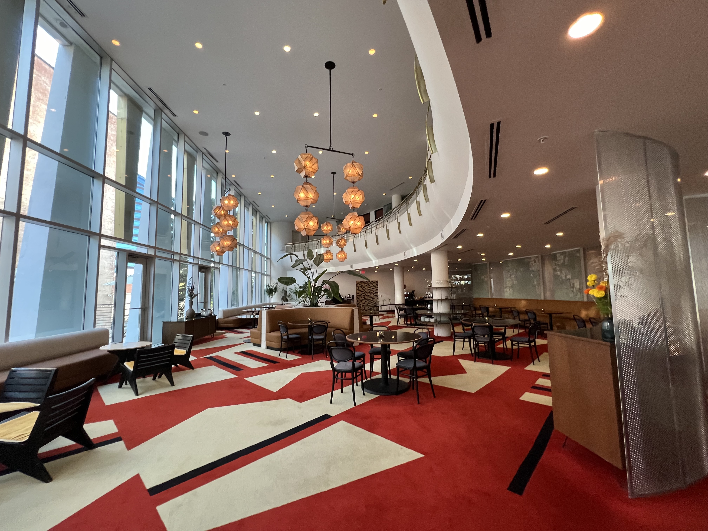

Mother and Sons... Squid Ink Tonnarelli, NC Shrimp, uni, fennel, scallions

Press Coffee, Crepes, and Cocktails... oh my, this berries crepe was absolutely delicious. I had a banana bread latte too that was chef's kiss. 

I've always wanted one of these! A nice visual metaphor taken along the side of the conference hotel during Centerfest Fine Art Festival. 

Unscripted rooftop pool

[**back to top**](#table-of-contents)

### Black Python Devs Leadership Summit

It was an honor to have been invited to attend the [Black Python Devs Leadership Summit](https://blackpythondevs.com/leadership-summit-2024/) as a distinguished guest. 

The event took place at the Caktus office. I attended the afternoon session. 

The session kicked off with a keynote by Wesley Faulkner. 

Wesley gave some sobering stats, then gave practical advice for how to observe, predict, and improve your surroundings, the benefits and risks. 

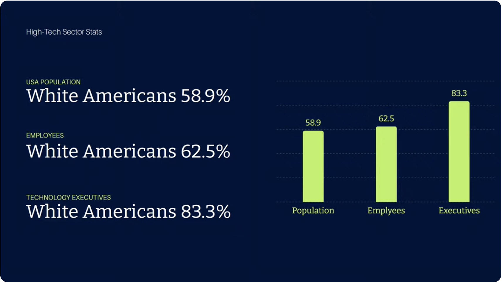

Interactive speakers
* Loren Crary (filling in for Tim Schilling): PSF
* Afi Gbadago: BPD Open Source Program
* Kudzayi Bamhare: Creating ecosystems- conducting a beginner Python workshop in Zimbabwe in partnership with Uncommon teaching hub

BPD Vice-Executor Velda Kiara led a panel with with community leaders about topics concerning Black Leaders in Python.

Panel participants Benedict Kofi Amofah, Jeff Triplett, Loren Crary, Monica Oyugi, and host Velda Kiara

After the panel, we took part in breakout sessions. My group had a thoughtful and spirited conversation about newcomer psychological safety moderated by Alex Oladele and Paul Everitt.

The event ended with a fun happy hour. 

Me, Abigail Afi Gbadago, and Velda Kiara after the summit!

I am so proud of them for the role they played in organizing an outstanding event. It had a lot of heart.

BPD Founder Jay Miller announced that the next leadership summit will be somewhere in Africa. 

The morning and afternoon replays are available on the info page. 

[**back to top**](#table-of-contents)

### Rooftop View of Durham

After the summit, a DjangoCon US attendee who lives at One City Center took a group of us up to the 28th floor for an incredible view of the Durham skyline. 

[Video of the skyline](https://youtu.be/8w3ubfRBK5I)

One City Center rooftop pool

[**back to top**](#table-of-contents)

### Swag Stuffing

On Sunday, I continued my tradition of swag stuffing. Conference pro-tip: it's a great opportunity to meet people! 

[**back to top**](#table-of-contents)

### Django Social

For the second year in a row, a Django Social event took place at [Ponysaurus Brewing Company](https://www.ponysaurusbrewing.com/). Thank you to REVSYS for sponsoring. 

A sign of a fantastic event: it was over before I knew it. I had the chance to catch up with old friends and meet new ones. 

Djangonauts at Ponysaurus

[**back to top**](#table-of-contents)

## Monday

Orientation Chair Kojo Idressa and Conference Chair and DEFNA President Peter Grandstaff kicked off the conference. 

[**back to top**](#table-of-contents)

### Keynote- Power to the People who Teach the People

Sheena O'Connell has been an educator since childhood and began working for an education non-profit called Umuzi in 2018. She is interested in [metacognition](https://en.wikipedia.org/wiki/Metacognition), how people learn. 

She began her talk by describing the education status quo: common learning anti-patterns, what a normal classroom looks like, and normal success distribution. 

She introduced [Bloom's 2 Sigma Problem](https://en.wikipedia.org/wiki/Bloom%27s_2_sigma_problem). "The average student tutored one-to-one using mastery learning techniques performed two standard deviations better than students educated in a classroom environment."

Mastery learning techniques
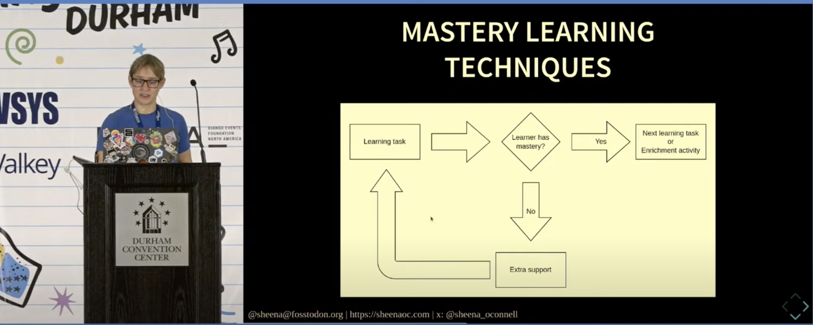

A few advantages of mastery-based learning:
* Social contract- students are more motivated due to buy-in
* It helps students develop a growth mindset 
* It helps the teacher master teaching ("did I do a good job of teaching?")

A few thoughts on learning
* If you teach one person, it can impact many others
* Struggle is good, teach students how to learn
* Some teaching techniques are more powerful than others
* "Trust no one"
* "You can't teach a person to ride a bicycle by riding a bicycle for them."

"Education is not the filling of a pail, but the lighting of a fire."

Sheena has started [The Guild of Educators](https://www.sheenaoc.com/articles/2024-09-12-introducing-goe). 

More useful to me resources
* [Make it Stick](https://www.amazon.com/Make-Stick-Science-Successful-Learning/dp/0674729013) book
* [Huberman Lab Podcast](https://www.hubermanlab.com/podcast)
* [Retrieval practice](https://www.retrievalpractice.org/why-it-works)
* [The Protégé Effect](https://www.growthengineering.co.uk/protege-effect)
* [Stereotype threat](https://en.wikipedia.org/wiki/Stereotype_threat)

[**back to top**](#table-of-contents)

### Choosing Wisely: SPA vs. HTMX for Your Next Web Project

Last year, in his talk HTML-ivating your Django web app’s experience with HTMX, AlpineJS, and streaming HTML, Chris May introduced the idea that you can have a SPA-like experience in Django without using SPA tools. 

I wrote about it in my [DjangoCon US 2023 Recap](https://katherinemichel.github.io/portfolio/djangocon-us-2023-recap.html#html-ivating-your-django-web-app-s-experience-with-htmx-alpinejs-and-streaming-html). 

In that talk, he referenced a Thoughtworks article [SPA by Default](https://www.thoughtworks.com/en-us/radar/techniques/spa-by-default) and Tayor Hunt's [Making the World's Fastest Website and Other Mistakes](https://dev.to/tigt/making-the-worlds-fastest-website-and-other-mistakes-56na)

According to Thoughtworks, "Too often teams are skipping [that] trade-off analysis, blindly accepting the complexity of SPAs by default even when business needs don't justify it."

Taylor Hunt refactored a React/Redux grocery store SPA app for a much improved experience by using just HTML, CSS, and laser-focused JavaScript. 

Chris started this year's talk off by asking some questions: Are you using a SPA? What would make you change? When do you think you should use a SPA? Why would you want to use HTMX versus SPA? What tools are you favorite tools? Are you using them well?

SPA downsides
* Slow startup time
* Bad user experience on slow devices
* "A massive investment in controlling complexity is the only way to scale JS-driven frontends." Alex Russell in [The Market for Lemons](https://infrequently.org/2023/02/the-market-for-lemons/)
* "Not only does JavaScript cost 3x more in processing power, byte-for-byte, than HTML and CSS, but it also removes the browser's ability to parallelise page loading." Alex Russell in [Caprock](https://infrequently.org/2024/08/caprock/)
* "When using JavaScript you pay a performance tax no less than four times." Tim Kadlec in [The Cost of JavaScript Frameworks](https://timkadlec.com/remembers/2020-04-21-the-cost-of-javascript-frameworks)

How the front-end is coping

When SPAs could be worth their weight (Alex Russell in [Caprock](https://infrequently.org/2024/08/caprock/))

When or when-not to SPA (Alex Russell in [Caprock](https://infrequently.org/2024/08/caprock/))
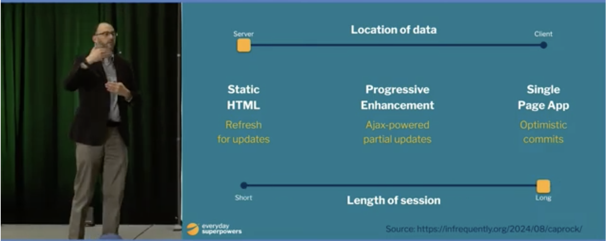

Chris pointed out [Katie Sylor-Miller's "Component Islands" pattern](https://jasonformat.com/islands-architecture/) as showing promise. "Removing the need for a root JavaScript component greatly reduces complexity. The browser can handle most things without JavaScript." 

Streamed HTML Components

Chris introduced tools that can be used to create a SPA-like experience
* CSS view transitions
* [Django Unicorn](https://www.django-unicorn.com/)
* [HTMX](https://htmx.org/)
* [Alpine.js](https://alpinejs.dev/)
* [django-template-partials](https://github.com/carltongibson/django-template-partials)
* [django-components](https://pypi.org/project/django-components/)
* [Datastar](https://datastar.fly.dev/)
* [Unpoly](https://unpoly.com/) 

Three HTMX success stories
* [Umuzi](https://www.sheenaoc.com/articles/2024-06-30-htmx)
* [contexte](https://david.guillot.me/en/posts/tech/following-up-mother-of-all-htmx-demos/)
* [OpenUnited](https://www.linkedin.com/feed/update/urn:li:activity:7109116330770878464/)

Notably, OpenUnited developer velocity improved by at least 500% after switching to HTMX. 
  
Chris will follow up with a blog post with more info about streaming HTML components. 

[**back to top**](#table-of-contents)

### Error Culture

Ryan Cheley defined Error Culture: workers ignore automated email alerts, creating a culture of reactive firefighting. 

Why does it happen? Lack of understanding, error/alert fatigue, hero culture. 

If an alert is not important: don't just delete the alert. Delete the mechanism that created the alert. 

Make sure an alert is... actionable, important, sent to the right people

What, why, who, verb

More useful to me resources
* [Chesterton's Fence](https://fs.blog/chestertons-fence/)

[**back to top**](#table-of-contents)

### Shrimp and Grits

I tried grits as a kid and didn't like them. I've recently been told by friends that I just haven't had the right grits. 

When I saw grits on the DjangoCon US lunch buffet, I had to try them. I still don't like them, but it was an experience! 

North Carolina-inspired lunch

[**back to top**](#table-of-contents)

### Troubleshooting is a Lifestyle üòé

Jack Linke started off the talk with a quote and described indicator categories. 

"If your only tool is a hammer then everything looks like a nail." Abraham Maslow

Jack started with some Django built-in troubleshooting tools
* Template error pages
* Error reporting by email
* System checks framework (it's extensible- dj-stripe is an example)
* Console and logging (for extra context, use verbosity settings 1-3)

Django System Checks Framework
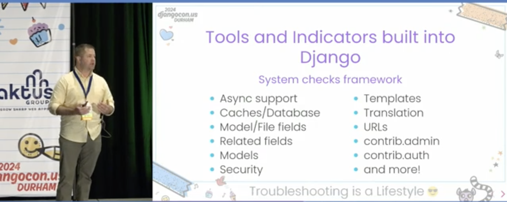

He then moved on to some third-party packages and tools
* [django-debug-toolbar](https://github.com/jazzband/django-debug-toolbar) (also extensible)
* [django-silk](https://github.com/jazzband/django-silk) performance profiler
* Error tracking and performance monitoring- Sentry, Rollbar, Newrelic, Honeybadger, Bugsnag, Raygun
* He gave a demo of [Sentry](https://sentry.io/welcome/) dashboard with error page, error message, tags
* [django-health-check](https://github.com/revsys/django-health-check) package (can add Celery, Redis, Postgres)
* [django-watchman](https://github.com/mwarkentin/django-watchman)

He gave an example of extending the Django admin by adding checks. He had an issue with Celery- too few tasks were processed. He put a panel into the admin to capture the last 24 hours of tasks processed through Celery. 

He gave some general tips for troubleshooting
* Use the power of isolating variables and narrowing scope
* Be like Frances Elizabeth Holberton- "break the execution- does the system work up to this point." Similarly, Python Debugger (PDB) can be used to create breakpoints to step through the code to find the issue. 
* Avoid tunnel vision- seek broad perspectives and alternative approaches

Strategies for dissecting complex issues
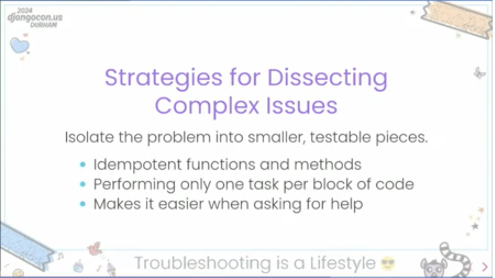

"A problem well stated is a problem half solved." John Dewey

Troubleshooting often involves stating the problem and asking for help
* Rubber duck debugging
* Know when to seek assistance
* Learn how to ask for help effectively
* Learn how to create a Minimum Reproducible Example (MRE) to increase your odds of getting help

How to effectively ask for help

Oh no
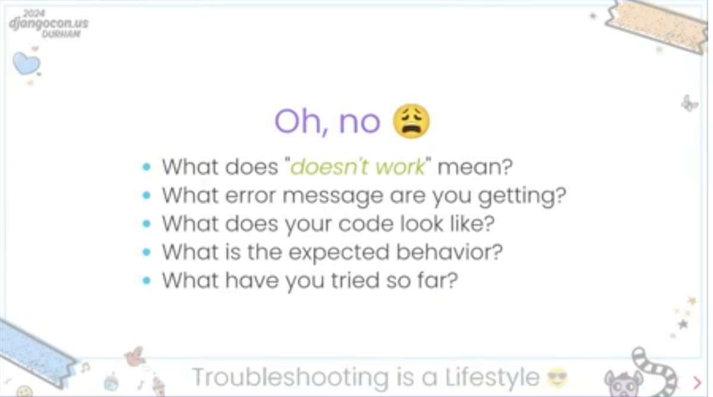

Yep!

Where to get help

Jack gave a shout out to Ken Whitesell for his prolific question- answering in the Django Forum!

Jack encouraged the audience to document your process. 

 
[**back to top**](#table-of-contents)

### A Related Matter: Optimizing your webapp by using django-debug-toolbar, select_related(), and prefetch_related()

Because I am already familiar with diagnosing and fixing N+1 problems, I watched Christopher Adams's to pick up new tips. 

A few reminders
* Querysets are immutable
* Querysets are lazy (they do not hit the database until they are evaluated). Chris showed examples. 

A few ways to profile SQL queries
* Set Django logging to debug and stream results
* DB all-statement logging (caution- this will fill up the logs, so perhaps run it for a minute or so in staging, not prod)
* [django-debug-toolbar](https://django-debug-toolbar.readthedocs.io/en/latest/) (install conditionally)
  
Good points about select_related() and prefetch_related()
* Database transaction latency is increased if the data is in another datacenter
* Prefetch returns another queryset and this can be more efficient than if the database does it
* People in the 90th percentile who have a slow machine can benefit

Other django-debug-toolbar uses
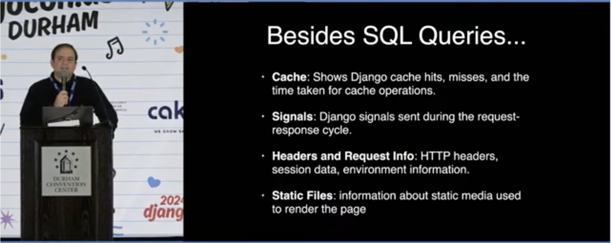

[Code samples](https://github.com/adamsc64/a-related-matter)

[**back to top**](#table-of-contents)

### Unlocking Performance: Benchmarking and profiling Django for Maximum Efficiency

Ron Maravanyika said that firstly, we need to define efficiency. 

Benchmarking is looking at time. Profiling is looking at resource usage. 

Process to follow

 
Ron explained some possible tools and gave demos
* Unix time command: real, user, sys
* Python timeit module
* [pytest-benchmark](https://pytest-benchmark.readthedocs.io/en/latest/) and benchmark_weave, aspectlib
* Python profile module
* Python cprofile module
* Live profiling tool [django-silk](https://github.com/jazzband/django-silk)
* django-silk profiler and binary version can be used to create an image that shows parallel functions running
* django-silk decorator method and context manager method can be used to profile small blocks of code
* django-silk [Dynamic profiling](https://github.com/jazzband/django-silk?tab=readme-ov-file#dynamic-profiling) can be used to profile something you don't have access to

Summary
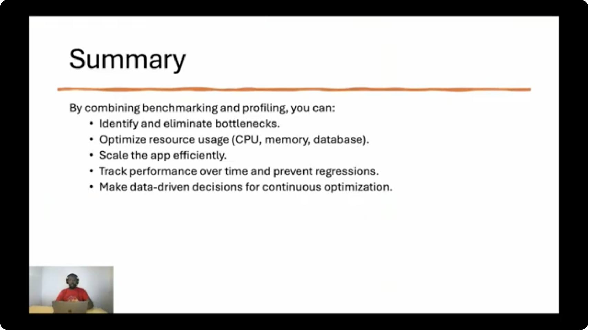
 
[**back to top**](#table-of-contents)

### DEFNA Board Dinner

DEFNA had a board dinner to discuss business. It was a pleasure to be treated to a gourmet meal at 21c Museum Hotel [Counting House](https://countinghousenc.com/) restaurant. It was an unforgettable experience. 

I had oysters for the first time and particularly enjoyed the scallops and smoked trout dip. 

The DEFNA Board... wonderful people!

Oysters on the half, blood orange mignonette, cocktail sauce

Smoked trout dip, bread & butter pickle, butter-fried saltine

Diver scallops, pecorino english pea puree, radish & snow pea orzo salad, pea tendrils; Sherry Berry lifts me up, lustau sherry, capelleti, strawberry, aromatic bitters, tonic

Chocolate cremieux, dark chocolate, hazelnut, Italian meringue, decaf coffee

[**back to top**](#table-of-contents)

## Tuesday

[**back to top**](#table-of-contents)

### Keynote- How To Be A Developer and Other Lies We Tell Ourselves

Mario Munoz started off his keynote by introducing himself. "I am a person." He went on to talk about the diverse experiences that have contributed to who he is today. 

Mario's talk was philosophical. He acknowledged, "We all know philosophy and software engineering are the same thing." Both involve abstract thinking, making models of intangible things, trying to apply them to real world scenarios. 

He talked about The Mirror Stage, a concept in Jacques Lacan's psychoanalytic theory. It refers to the time when a child identifies their own image. 

Mario then used a Person/Ality personality simulator. Images, as though from the subconscious, appeared on the screen as he talked about experiences he'd had as a developer. Afterward, he analyzed each experience.  

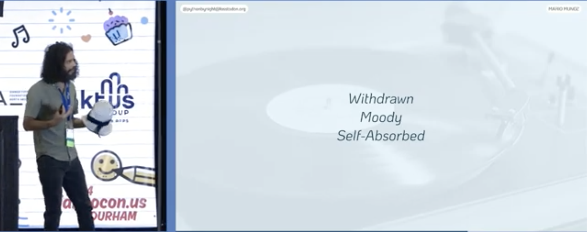

Throughout the talk, he reflected
* "Being a developer should in no way rob you of who you are and your own identity."
* "The biggest lie that we can tell ourselves is that these objects of representation that are outside of us are synonymous with who we are."
* "Everything we tell ourselves about ourselves is always a little bit inadequate."
* Our strengths can be our biggest weakness and our weaknesses can be turned into our strengths.

At the end, he revealed, "I am a community. We are a community... The community is my biggest asset."

"How to be a better developer... be a better person to others." 

[**back to top**](#table-of-contents)

### PostgreSQL Beyond Django: Strategies to Get Max Performance

Álvaro Justen showed some lesser known ways to improve the performance of PostgreSQL.

[Example code](https://github.com/PythonicCafe/djpg-example)

He explained each method, including profiling results, then ran a demo. 

Some of his suggested methods
* Use UUID field as primary key field and avoid creating two columns. You do not need a sequential ID, because of the UUID hash. You can index UUID. 
* Starting at Django 3.2, the ID of each field went from 4 to 8 bytes. In settings, use the default AutoField instead of BigAutoField.
* Alvaro prefers to create his own ID. See urlid.org for his methodology.
* Use SQL min/max to check the size of table values. Use SmallIntegerField instead of IntegerField.
* Column order can affect space used. Use fixed-size columns (bigger, then smaller), then variable-size. See [Data alignment in Postgres](https://www.enterprisedb.com/postgres-tutorials/data-alignment-postgresql). 
* Full text search and search vector field scenarios
* Trigger- perform operations inside of the database more quickly than in the app. Don't put much business logic in the trigger.

[**back to top**](#table-of-contents)

### If We Had $1,000,000: What Could The DSF Do With 4x Its Budget?

Jacob Kaplan-Moss is a retired Django BDFL and current DSF Treasurer. He showed the current $255,000 DSF budget breakdown. Most of the budget goes to the salary for fellows (health of project) and admin (health of foundation). 

If the budget were quadrupled to $1,000,000, he has a personal wishlist: hire an executive director, expand the fellowship and grants programs, including feature grants
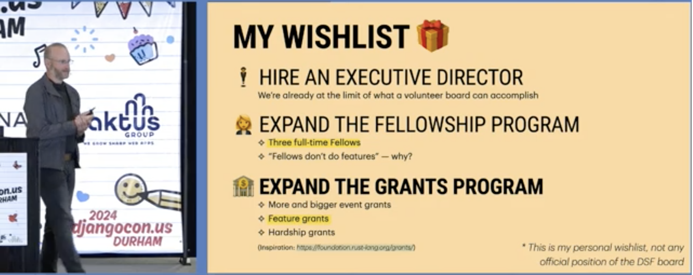

How do we get there? We probably need to target major donors versus many small-funders, and that's probably ok. 

Major donors are:
* Corporations
* High-net worth individuals
* Government grants
* Private foundation grants

TL;DR hire experts (executive director, grant writer, etc.) and pay them to get the money. 

Easy actions to take
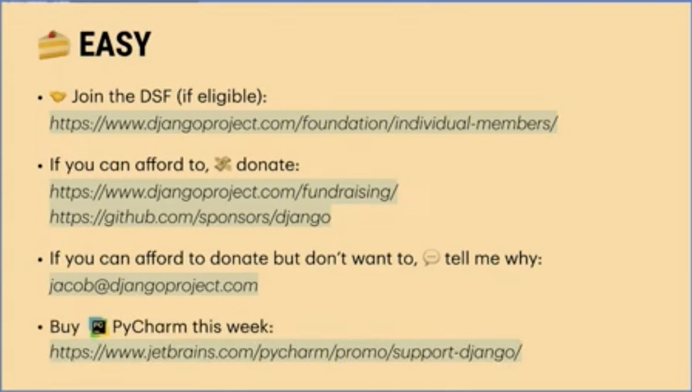

Medium actions to take

Hard actions to take
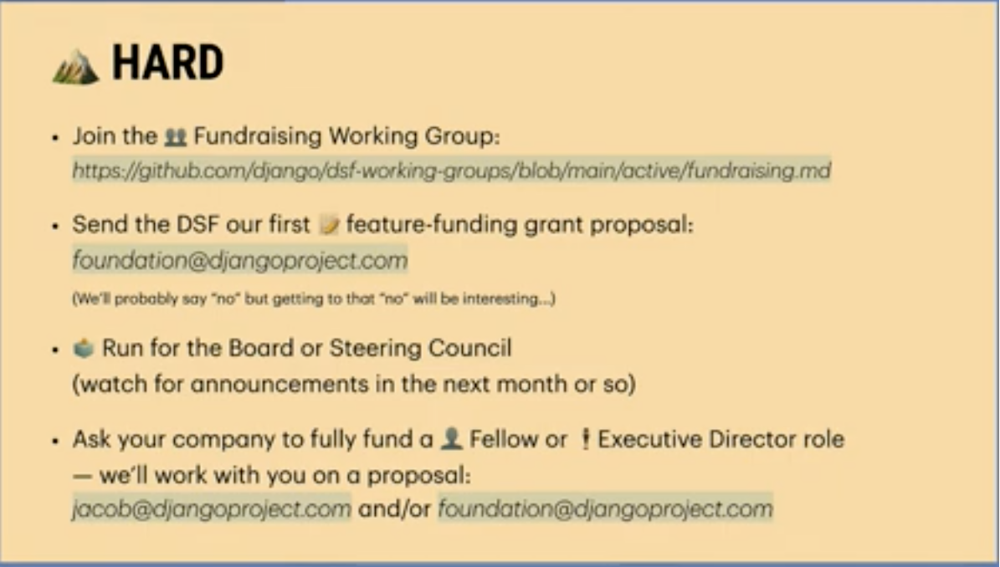

If the answer is "no", Jacob would like to know why. Email him. 

More useful to me resources
* Sue Gardner's [What's Really Wrong With Non-Profits and How We Can Fix It?](https://suegardner.org/2013/10/20/whats-really-wrong-with-nonprofits-and-how-we-can-fix-it/)

[**back to top**](#table-of-contents)

### django-mongodb

After Jacob Kaplan-Moss referenced [django-mongodb](https://github.com/mongodb-labs/django-mongodb) in his presentation Q&A, I chatted with co-creator Jib Adegunloye. He explained the architecture and verified that it will support joins. He gave a lightning talk about it soon thereafter. 

Jib and his friends founded ByBlack. They wanted to use Django, but were too invested in MongoDB. A year ago, he was hired at MongoDB. They eventually hit him with a Django pitch. It felt personal. He wanted it to work. 

Motivations...
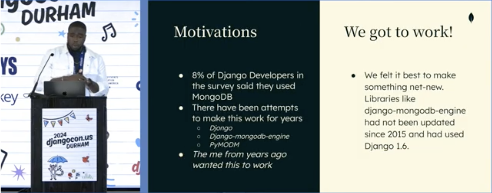

How does it work
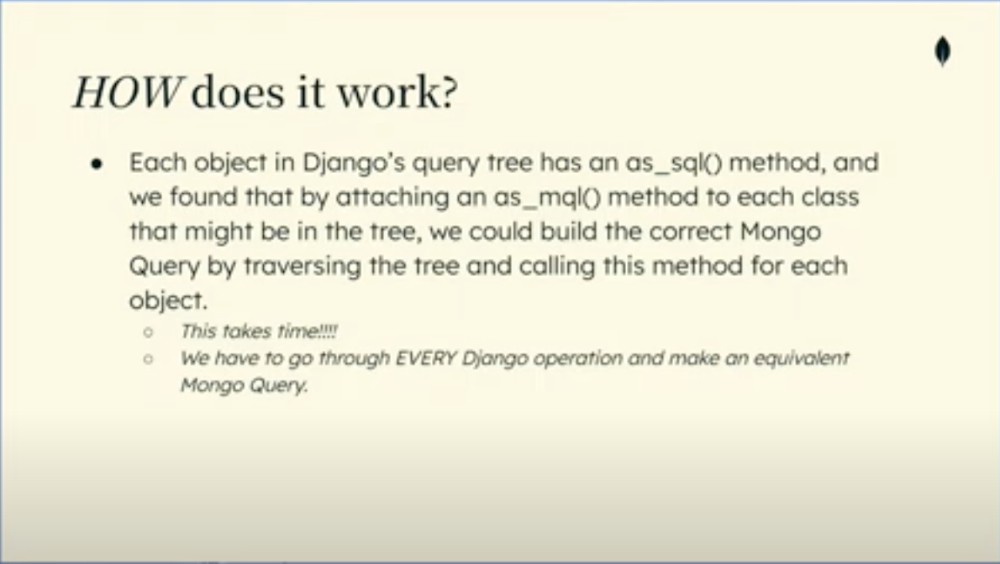

[**back to top**](#table-of-contents)

### Faster, leaner, greener: 10x lower website carbon emissions

Thank you to Thibaud Colas, DSF Board Member and Wagtail Developer, for this important talk. 

Slides: [wagtail.org/10x-lower](https://docs.google.com/presentation/d/1rmRFk5Kt4BraK4eRE7kmq8R5OoprXqMKVm9aPLVUXMg/edit)

Thibaud estimates 119,120 tC02e/year emissions for 52,531 Django sites. 
 
Where emissions come from
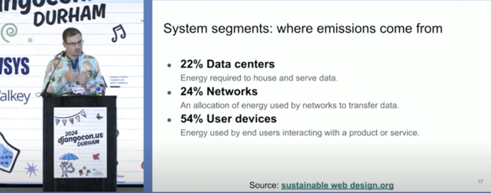

Greenhouse gas emissions by system segment

Things we can do

Facade pattern
* [lite-youtube-embed](https://github.com/paulirish/lite-youtube-embed) is 95% less than original

Display brightness
* Dark mode and OLED- dark mode is 60% less than light (and also happens to be good for accessibility)
* Apple will complete the switch from LCD to OLED next year and start the switch for laptops in 2026

Best attempt to chart how high emissions are based on how dark or light 
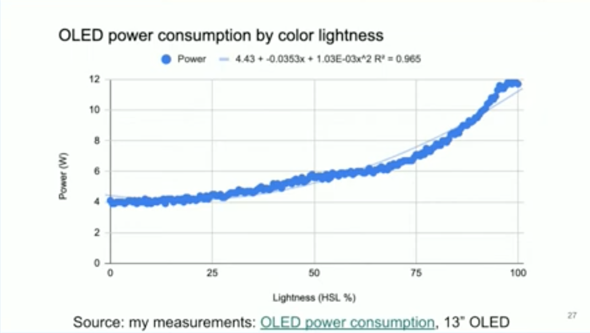

Image optimizations
* Jpegli (new encoder from Google) is 33% less than JPEG
* AVIF is 76% less than JPEG
* PDF example- AVIF-optimized version was 10x less

Responsive images
* A mobile display size image was 78% less than an original image

Image packages that can be used to implement improvements
* [django-imagekit](https://django-imagekit.readthedocs.io/en/latest/)
* [django-pictures](https://github.com/codingjoe/django-pictures)

Site architecture

The more JavaScript you use, the higher the emissions

Over provisioning a server with more CPUs than it needs
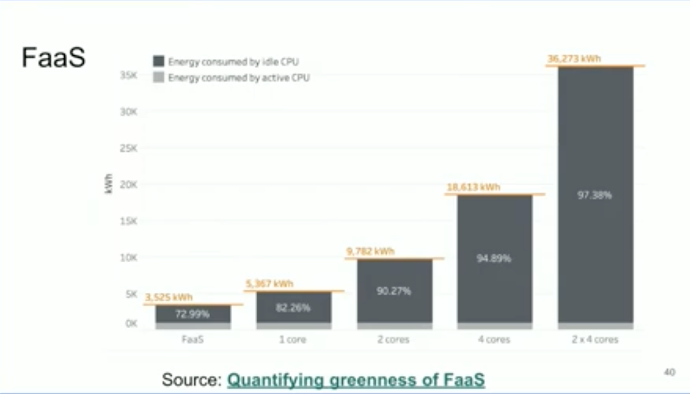

Data center regions and their carbon grid intensity- moving from useast1 to northamerica-northeast1 is 280x lower

Resources

[**back to top**](#table-of-contents)

### Meeting Lorenzo

After years of following each other on social media, Lorenzo Peña and I had the chance to meet in person! I was thrilled that he had the chance to present a talk [The art of (not) redirecting](https://2024.djangocon.us/talks/the-art-of-not-redirecting/) and attend the speaker/organizer dinner too. 

A dream come true

Me and Lorenzo

[**back to top**](#table-of-contents)

### Speaker and Organizer Dinner

On Tuesday night, I attended the speaker/organizer dinner at [Greer Street Garden](https://geerstreetgarden.com/about). 

It was a chance to relax, enjoy some good food and conversation. 

Sitting next to Simon Willison, co-creator of Django, I couldn't resist getting a photo!

I wrote about Simon's PyCon US 2024 talk about Imitation Intelligence in my [PyCon US Recap](https://katherinemichel.github.io/portfolio/pycon-us-2024-recap.html#simon-willison-keynote). 

Me and Simon (photo credit: Django Fellow Natalia Bidart)

[**back to top**](#table-of-contents)

### The Boxcar Bar and Arcade

After the speaker/organizer dinner, [Six Feet Up](https://www.sixfeetup.com/) hosted a Mario Kart competition across the street at [The Boxcar Bar and Arcade](https://theboxcarbar.com/). 

I spotted a few favorite old school games too: Super Pac-Man, Ms. Pac-Man, Donkey Kong, BurgerTime, Frogger. 

[Video of Boxcar Arcade](https://youtu.be/gO1CcdgQ9II)

Super Pac-Man

Me standing in front of the bar at Boxcar

[**back to top**](#table-of-contents)

## Wednesday

Wednesday was deep dive day. 

[**back to top**](#table-of-contents)

### Keynote- The Fellowship of the Pony

Using Lord of the Rings, Django Fellow Natalia Bidart (a.k.a. necessita) gave a comprehensive explanation of what Django Fellowship is. 

Her breakdown of fellow and community tasks is a treasure trove. This is a great addition to Django Fellow Sarah Boyce's recent talk [Django Core Demystified](https://youtu.be/8rIylYYCmSI?si=8RsuP6VX41mVS0p6). 

Natalia described the Django community as being lovable, open, tolerant, and receptive. She has felt welcome in the community from the first moment and called it a safe space. 

Django is looking for volunteers. Check out the info in Natalia's talk about how you can help and consider applying to Djangonaut Space. 

What a Django Fellow does, according to ChatGPT

Do you see a pattern? :)

Label, observe, track, reproduce
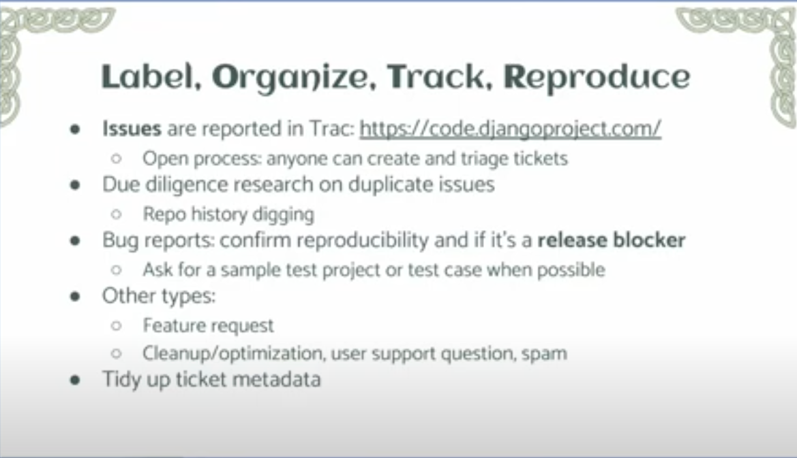

Launch, operate, throw, release

Layout, outshine, target, reasses
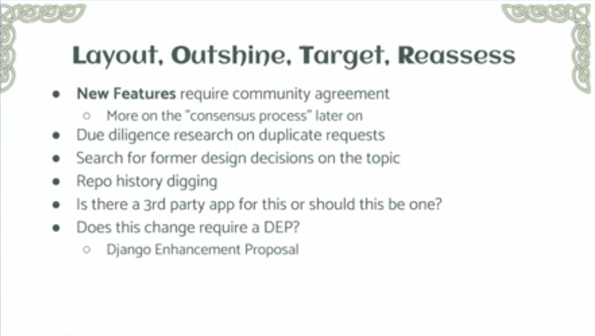

Learn, overlook, test, regulate

Liase, onboard, train, recognize
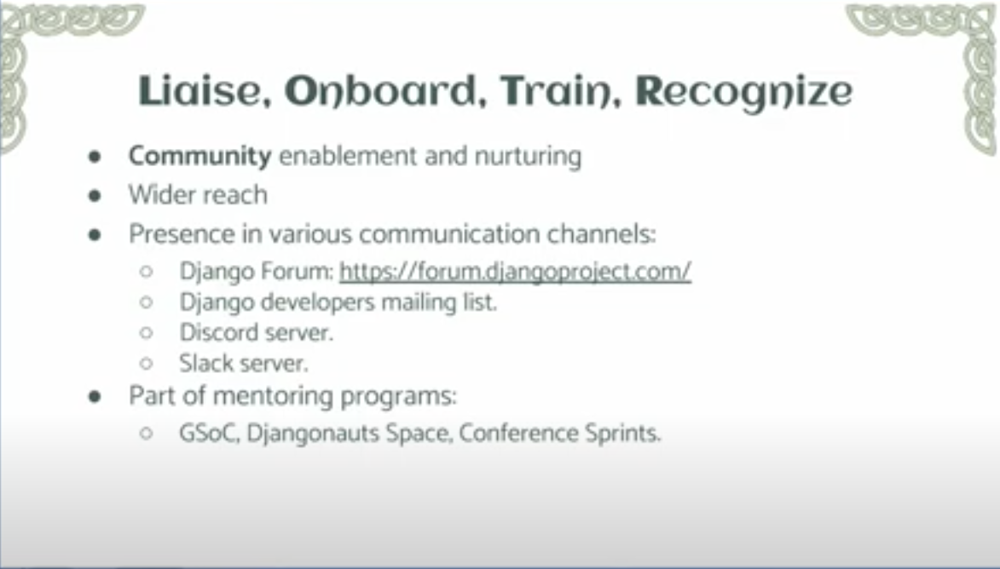

<!--
Lint, optimize, trim, refine
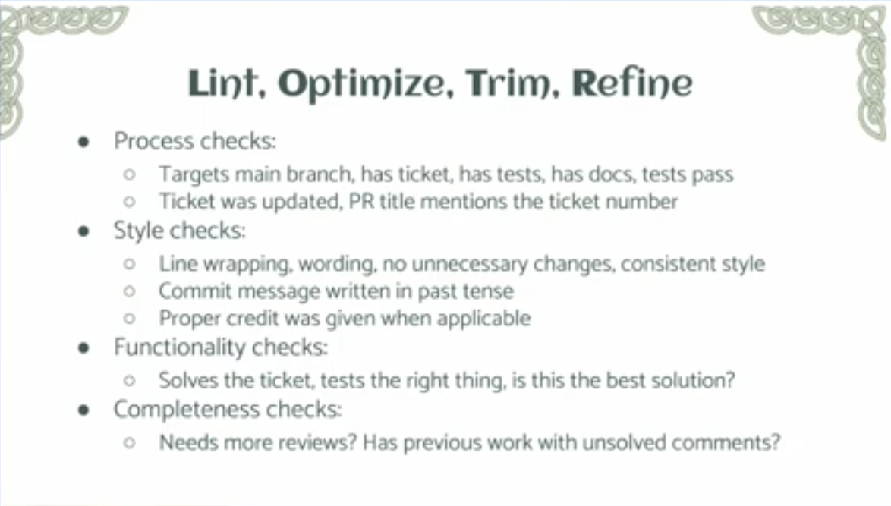

List, outline, testify, report
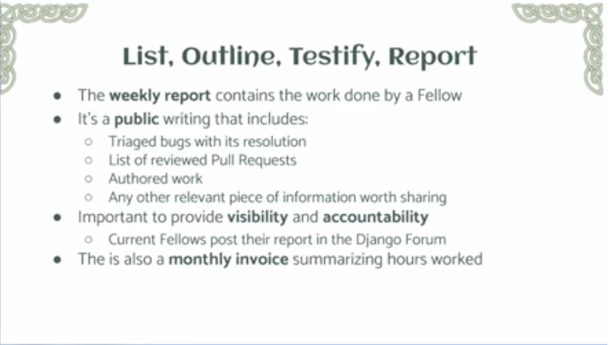
-->

Load, overee, triage, review
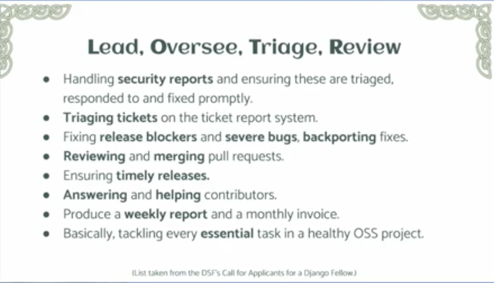

<!--
Locate, overcome, tackle, remedy
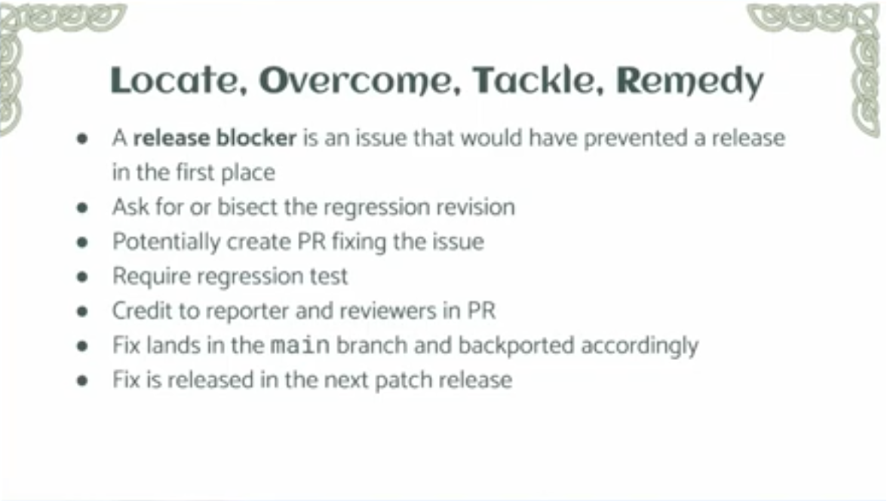

Lock, observe, trace, reveal
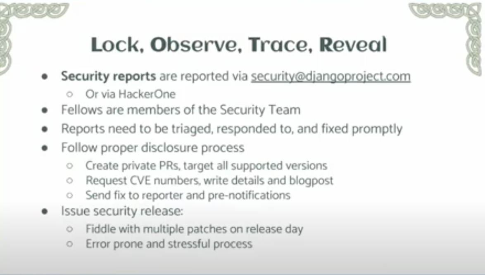
-->

[**back to top**](#table-of-contents)

### Hidden gems of Django 5.x

Django Fellow Sarah Boyce pointed out that work on [Django 5.x](https://docs.djangoproject.com/en/dev/releases/5.0/) began in January 2023, and from her perspective, is almost done. 
 

Although Django release notes are the source of truth for info about releases, "need to know" information that you see in the release notes only constitutes 13% of the work done. 

Need to know versus want to know

A few examples of what you didn't see in the release notes
* A screen reader experience demo showing improved logical structure, navigation, announcement of relevant info in Django Admin
* Accessibility Contributor Guide by Thibaud Colas
* Code references in docs now have links to source code on GitHub
* Django performance graph- as Python becomes faster, by simply upgrading it, the performance of your code improves
* Significantly faster Django benchmarks for individual commits

Admin accessibility improvements

Sarah recognized the huge amount of work done by many people and gave an [example ticket](https://code.djangoproject.com/ticket/35102) collaborated on by Marisuz, Anthony, Simon. 

364 people contributed to Django 5.0 and 5.1. 

Please give the team feedback so they can work with you to make the experience better. 

After the conference, Sarah also published a [DSF Initiatives I'd Like to See](https://gist.github.com/sarahboyce/68ffaaeae24d2501cf27a914f77fb97c) list for DSF Board Election candidates. Take a look and be inspired! 

[**back to top**](#table-of-contents)

### Lightning Talk Cameo

It's no secret that I've been using social media for networking for many years now. Foxley Talent's Jon Gould and I had a conversation about it. Jon was inspired to create a lightning talk about the subject entitled Coffee Break Career Hacks and featured my social media engagement. It was an honor to be included!

Jon during his lightning talk

[**back to top**](#table-of-contents)

### API Maybe: Bootstrapping a Web Application circa 2024

Carlton Gibson, former Django Fellow, is the only worker on the tech side at his startup Paths: monitoring, evaluation, and learning for development and sustainability projects. 

2018 was API first. 2024 is "HTML over the wire" and the economic climate has changed. 
  
With tech funding having dried up, teams have limited budget and time. 

He said that "Django really shines when the money is tight. Django is the framework for perfectionists with deadlines. When these deadlines are financial, all the more so. Django is the perfect framework for our post zero interest rate world. "

By leveraging Django, you can get as much done as teams using more complex stacks. 

"Locality of behavior is a way of thinking about and assessing code. Everything you need to understand that code is there in front of you in one place. Creating locality of behavior makes code easier to reason about, easier to maintain, easier to iterate on."

"Use your judgement as to when you sacrifice a bit of locality of behavior as your code scales to gain in maintainability. 

Locality of behavior is a starting point, not a destination. 

"Holding the line on locality of behavior can really pay dividends."

When working on new code that is likely to change, by focusing on locality of behavior, you can stablilize the code and let the deeper patterns emerge. Quickly refactoring to DRY code can create premature optimization that leaves the code "stuck in the local optima." 

Leaning into Django... 

Django templates and the component ecosystem- a vibrant and exciting time
* [django-unicorn](https://www.django-unicorn.com/)
* [slippers](https://github.com/mixxorz/slippers)
* [django-cotton](https://django-cotton.com/)
* [dj-angles](https://github.com/adamghill/dj-angles)

Carlton's recommended stack, which focuses on locality of behavior
* [HTMX](https://htmx.org/)- HTMX can get us a long way and save a lot of time
* [django-template-partials](https://github.com/carltongibson/django-template-partials)- HTMX utility
* [Tailwind CSS](https://tailwindcss.com/)
* [Alpine.js](https://alpinejs.dev/)- only weighs a few kilobytes, state management, reactivity, closest he's been to jQuery in a long time
* Alpine.js and forms
* [Neopolitan](https://github.com/carltongibson/neapolitan)- to quote William Vincent, 90% of apps are basic CRUD views

These tools have enbled Carlton to create a GVP (Genuinely Viable Product). Carlton is having the time of his life. 

More useful to me resources
* [Django Chat](https://djangochat.com/)
* [Protected Variations](https://www.martinfowler.com/ieeeSoftware/protectedVariation.pdf) architecture pattern
* Luke Plant's [Programming Mantras are Proverbs](https://lukeplant.me.uk/blog/posts/programming-mantras-are-proverbs/)

[**back to top**](#table-of-contents)

### Panel Discussion: Open, friendly, and welcoming: on the history and future of mentoring in Django

Our conference ended with a panel of five women, including three women of color, and Carlton Gibson. They owned that stage and the crowd was totally absorbed with what they had to say. I'm proud to be part of a community that is making substantial progress and quickly at that. 

Carlton Gibson, Keanya Phelps, Velda Kiara, Afi Maame Dufie, Sarah Boyce, and host Lacey Henschel

[**back to top**](#table-of-contents)

<!--
### Many More Great Talks
-->

### Queeny's 

After the conference had ended, I joined a group of Wagtail developers and conference speaker Eva Nanyonga and walked the short distance to [Queeny's](https://www.queenysdurham.com/), a DjangoCon US institution. No one ever seems to turn down dinner at Queeny's. :) 

Group pic!

[**back to top**](#table-of-contents)

## Hallway track

[**back to top**](#table-of-contents)

### Connections Made

I chatted with Thibaud Colas about his sustainability talk and got some tips from him. 

I listened in on a conversation with Lee Trout and Adam Fast and learned about some tools tips. 

I had the chance to catch up with Carol Ganz, fellow DEFNA Board Member. 

I pointed out Chris May's HTMX talk to Philip, a UI developer. He didn't know about HTMX and found it very enlightening. 

I found out from Frank Wiles that there is some early talk about a possible Lawrence Django event. 

I chatted with Simon Willison about some of my work duties, and he identified them as senior level. He told me about his excitement for his upcoming trip to see the [V & E Simonetti Historic Tuba Collection](https://www.atlasobscura.com/places/v-e-simonetti-historic-tuba-collection). He did a [write-up](https://www.niche-museums.com/112) about the experience on his Niche Museums site. 

After avidly following each other on social media for years, Sangeeta Jadoonanan and I finally met in person! 

I spent some much needed quality time with Lacey Henschel. She told me that I can learn anything. :) 

I met Django Fellow Sarah Boyce for the first time. We chatted about her work and DjangoCon Europe. 

I chatted with Jay Miller about how DEFNA could better serve Black Python Devs and reported feedback. 

I connected Thibaud with myself, Nicole, and Peter to talk about DjangoCon US website improvements and using it for other conference sites. 

[**back to top**](#table-of-contents)

### Swag

Velda and John showing off John's DjangoCon US tote bag... "famous" people signed it, including me! 
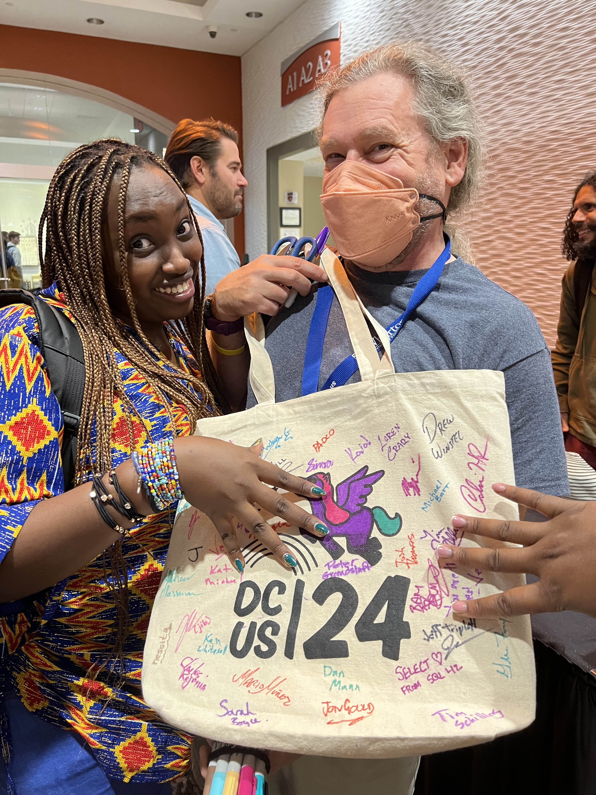

Black Python Devs Leadership Summit bead lanyard made by an artisan in Kenya (procured by Velda), African bracelet (gift from Velda), Kenyan coffee made with beans from Velda's family's farm (gift from Velda), PostgreSQL hat, Valkey sticker, DjangoCon US shirt, Caktus shirt
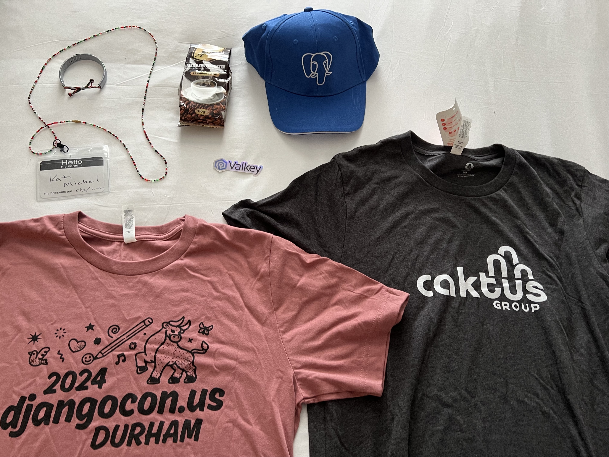

[**back to top**](#table-of-contents)

### Django Social T-Shirt

In 2023, Foxley Talent gifted me a Django Social t-shirt. Foxley Talent Recruiter Jon Gould and I took a photo with me wearing it. We recreated the photo! 

Me and Jon
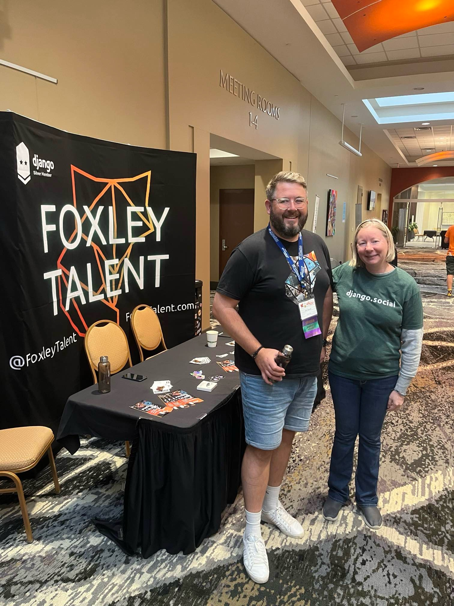

[**back to top**](#table-of-contents)

### Visa Frustration

As our conference becomes more diverse, a common frustration has emerged: difficulty getting a visa to enter the US. People from multiple countries have voiced their frustration about this to me. Django community member Julius Boakye poured his heart into a must-read post about it: [Breaking Barriers: A Tech Speaker’s Plea for Fair Visa Policies](https://medium.com/@theflyboy/breaking-barriers-a-tech-speakers-plea-for-fair-visa-policies-621b5909e496).

[**back to top**](#table-of-contents)

## Thursday

[**back to top**](#table-of-contents)

### Sprints

Caktus office around the corner from the Marriott is the perfect sprint venue. 

Me and Carlton

I was racking my brain to figure out what to eat for lunch. I joined a group and walked the short distance to [Pie Pushers](https://www.piepushers.com/). 

A slice of Italian sausage and a simple house salad really hit the spot! It was the best tasting pizza I've had in quite a while. 

Italian sausage and a simple house salad
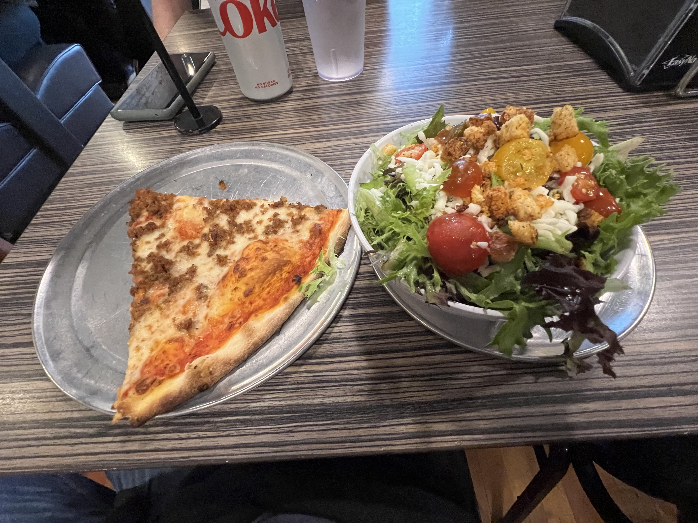

[**back to top**](#table-of-contents)

## Another Great Adventure

Thank you to my fellow DEFNA Board Members, volunteers, and everyone who made this another wonderful event! 

Thank you card

The talk replays will be available on the [DjangoCon US YouTube channel](https://www.youtube.com/c/DjangoConUS) in a few weeks. 

Keep scrolling for more sightseeing and food! 

[**back to top**](#table-of-contents)

## More Sight Seeing and Food!

[**back to top**](#table-of-contents)

### Sarah P. Duke Gardens

For months, I had been looking forward to making it back to the [Sarah P. Duke Gardens](https://gardens.duke.edu/). It is "the Cadillac" of botanical gardens with jaw dropping scenes everywhere. It's also said to be a different garden with every new season or even new month. I'd visit Durham again just to go back. 

[Video of historic terraces, fish pool, and Cindy Brodhead Pergola](https://youtu.be/ueDuFR4WnS8)

[Video from the Red Bridge](https://youtu.be/CH6c_sWGb84)

[Video of the South Lawn](https://youtu.be/E14VYIGEyS4)

Fish pool, historic terraces, and Cindy Brodhead Pergola

Ducks at the Red Bridge

South Lawn

[**back to top**](#table-of-contents)

### Cocoa Cinnamon

I love [Cocoa Cinnamon](https://littlewaves.coffee/pages/old-north-durham) coffee shop. I first tried it last year and went back several times during DjangoCon US 2024. I don't just love it for the coffee, which is amazing, by the way. On my first visit this year, I was offered a free Chai Latte. As I sat drinking it, they offered a free coffee that was redeemed by a student sitting studying. According to their menu, they also offer reduced price coffees as a service to the community. It's nice to patronize a business that shows kindness. 

Drinks had:
* Chai Latte: "Housemade chai blend of cinnamon, cardamon, ginger, rose, anise, & black pepper served unsweetened or with honey or vanilla syrup"
* Caramelo: "Sweet & creamy latte with with dulce de leche named for Sandra Cisneros' novel" 
* Al Mohka: "Latte with 70% single origin housemade chocolate sauce & cinnamon. Reference to first ever coffee port"

Cocoa Cinnamon... a short walk from the convention center

Yum! 

[**back to top**](#table-of-contents)

### The Can Opener

I acted on a tip from fellow DEFNA Board Member Drew Winstel and visited The Can Opener. 

Built in the 1940s when vehicles weren't as large, [The Can Opener](https://www.atlasobscura.com/places/truck-decapitating-bridge), a railroad trestle bridge, was a mere 11 feet, 8 inches tall until 8 inches were added in 2019. Even with this improvement and warning signs well in advance, the bridge continues to peel the tops off trucks. 

The Can Opener

[**back to top**](#table-of-contents)

### 21c Museum Hotel

Last year, I didn't make it to the [21c Museum Hotel](https://www.21cmuseumhotels.com/) to see the hotel's signature artwork, so I thought it would be a fun experience this year. I was particularly taken by the see-into bathrooms. Also, the bank vault was a fun throwback to the hotel's past as a bank. 

[Video of 21c Museum Hotel See-Into Bathroom](https://youtu.be/yeOEAycUvIQ)

Bank vault entry

Bank vault- first room

Bank vault- inner room

[**back to top**](#table-of-contents)

### The Durham Hotel

I went to [The Durham Hotel](https://www.thedurham.com/roof/), because I heard it has the best public view of the Durham skyline in town. I later had a much higher view of the skyline from the private 28th floor of One City Center, but The Durham Hotel architecture and interior design were well worth a visit in their own right.  

Skyline left

Skyline right

[**back to top**](#table-of-contents)

### Mother and Sons

I'd been hungry for good Italian food for a while. [Mother and Sons](https://www.mothersandsonsnc.com/) had very high ratings, so I decided to give it a try. 

I'd planned to play it safe and order the potato gnocchi. I asked the waiter if there was a particular dish that was very popular. He said the squid ink tonnarelli. I told him I'd always wondered what squid ink pasta tasted like, but had been afraid to order it. He said that the squid ink taste was mild. So, I ordered it, and it was delicious. It had a lemon-butter shrimp taste. 

[**back to top**](#table-of-contents)

### Durham Food Hall

I'd already eaten, but joined a few attendees to walk over to the [Durham Food Hall](https://durhamfoodhall.com/) so they could eat. It was a thriving place with a lot of great options. 

Looking down at the first floor of the food hall

[**back to top**](#table-of-contents)

### Press Coffee, Crepes, and Cocktails

I love [Press Coffee, Crepes, and Cocktails](https://pressccc.com/). It's a short walk south of the downtown and well worth it. It's a coffeehouse specializing in savory and sweet crepes. The space has a bright, energetic vibe and the food and coffee are very high quality.   

First time eating avocado toast... I went big! This was gourmet quality, for sure. The seasonal salted pistachio mocha latte was to die for. 

[**back to top**](#table-of-contents)

### Centerfest

Serendipitously, an art festival called [Centerfest](https://durhamarts.org/centerfest/) was taking place on Saturday and Sunday. 

I wandered through the art booths, then stumbled upon one of many musical acts. It was called Heart of Carolina A Cappella. It was fun! 

[Video of Heart of Carolina A Cappella singing Sweet Caroline](https://youtu.be/89tf1KyUjGs)

[Video of Heart of Carolina A Cappella singing Seven Bridges Road](https://youtu.be/_cReCxdjVYk)

[**back to top**](#table-of-contents)

### Durham Market Culture

It's wonderful to see Durham's thriving market and festival culture. In addition to Centerfest, I stumbled upon the [Durham Farmers' Market](https://www.durhamfarmersmarket.com/), [Durham Craft Market](https://durhamcentralpark.org/events/durham-craft-market/), and [Durham Underground Market](https://makrs.com/durham-underground-market) all in the same weekend. 

[**back to top**](#table-of-contents)

### Cousins Maine Lobster

On Sunday, I was looking for a quick, tasty lunch and decided to try the fare of a [Durham Underground Market](https://makrs.com/durham-underground-market) food truck. 

[Cousins Maine Lobster](https://www.cousinsmainelobster.com/) piqued my interest. According to the truck, the founders had appeared on Shark Tank. 

I ordered a lobster tail, but they were out, so they upgraded me to a lobster roll and tots. It was my first time eating a lobster roll. It was tasty! 

This was the moment when I realized my low cholesterol diet was officially suspended

[**back to top**](#table-of-contents)

### Unscripted Rooftop Pool

I had the chance to spend time at the [Unscripted Hotel](https://www.unscriptedhotels.com/). The rooftop overlooks the downtown and features a pool, bar, and DJ. It was an unforgettable atmosphere. 

[Video of the Unscripted rooftop pool](https://youtu.be/_5-08ssL8Wk)

[**back to top**](#table-of-contents)

### The Parlour

I made a trip to [The Parlour](https://theparlour.co/) for the second year in a row. Last year, I had chocolate and was underwhelmed. This year, I had their most popular flavor- Salted Butter Caramel. It was truly incredible. I hope to make it back to Durham someday and visit The Parlour again! 

Salted Butter Caramel

[**back to top**](#table-of-contents)
