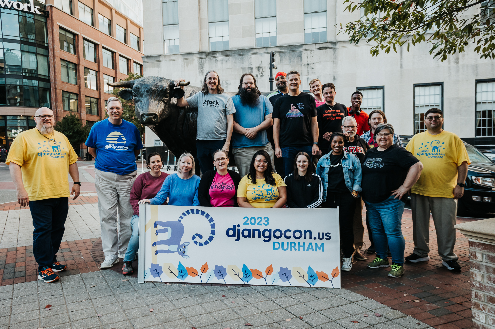

# DjangoCon US 2024 Recap

Table of Contents
-----------------

- [Intro](#intro)
- [Pre-Conference Activities](#pre-conference-activities)
    - [Black Python Devs Leadership Summit](#black-python-devs-leadership-summit)
    - [Swag Stuffing](#swag-stuffing)
    - [Rooftop View of Durham](#rooftop-view-of-durham)
    - [Django Social](#django-social)
        - [A Chance to Hang Out with Old Friends and Make New Friends](#a-chance-to-hang-out-with-old-friends-and-make-new-friends)
- [Monday](#monday)
      
    - [Meeting the New Django Fellow Natalia Bidart](#meeting-the-new-django-fellow-natalia-bidart)
    - [Kojo Idressa and Peter Grandstaff Kick Off the Conference](#kojo-idressa-and-peter-grandstaff-kick-off-the-conference)
    - [HTML-ivating your Django web app's experience with HTMX, AlpineJS, and streaming HTML](#html-ivating-your-django-web-apps-experience-with-htmx-alpinejs-and-streaming-html)
    - [Fried Green Tomatoes :)](#fried-green-tomatoes-)
    - [What Can the DSF Do for Me? What Can I Do for the DSF?](#what-can-the-dsf-do-for-me-what-can-i-do-for-the-dsf)
    - [Parts and Labor, The Parlour, and Back to the Hotel](#parts-and-labor-the-parlour-and-back-to-the-hotel)
      
    - [DEFNA Board Dinner](#defna-board-dinner)

- [Tuesday](#tuesday)

    - [Meeting Lorenzo](#meeting-lorenzo)

<!--
    - [Hallway Track](#hallway-track)
        - [Django Social T-Shirt](#django-social-t-shirt)
-->

    - [Speaker and Organizer Dinner](#speaker-and-organizer-dinner)
    - [Boxcar Arcade](#boxcar-arcade)

- [Wednesday](#wednesday)
    - [Panel](#panel)
    - [Thank You](#thank-you)
    - [John's Bag](#johns-bag)
    - [Queeny's](#queenys)
    - [Another Great Adventure](#another-great-adventure)
    - [Conference Conclusion](#conference-conclusion)

- [Thursday](#thursday)
    - [Sprints](#sprints)

- [Sight Seeing and More Food](#sight-seeing-and-more-food)
    - [Sarah P. Duke Gardens](#sarah-p-duke-gardens)
    - [The Can Opener](#the-can-opener)
    - [21c Museum Hotel](#21c-museum-hotel)
    - [The Durham Hotel](#the-durham-hotel)
    - [Mother and Sons](#mother-and-sons)
    - [Durham Food Hall](#durham-food-hall)
    - [Press Coffee, Crepes, and Cocktails](#press-coffee-crepesand-cocktails)
    - [Centerfest](#centerfest)
    - [Durham Farmers Market and Craft Market](#durham-farmers-market-and-craft-market)
    - [Cousins Maine Lobster](#cousins-maine-lobster)
    - [Unscripted Rooftop](#unscripted-rooftop)

- [In Closing](#in-closing)

## Intro

Disclaimer: the content of this post is a reflection of my career journey and not specific to my work at JPMorganChase.

DjangoCon US 2023 took place from October 16-20 in Durham, North Carolina. It was the sixth DjangoCon US I've had the privilege of attending, and in my opinion, the best one yet. 

Attendees (photo credit: Bartek Pawlik (https://bartpawlik.format.com/))

[**back to top**](#table-of-contents)

## Pre-Conference Activities

### Black Python Devs Leadership Summit

<!--
Tweet
-->

### Rooftop View of Durham

[**back to top**](#table-of-contents)

### Swag Stuffing

[**back to top**](#table-of-contents)

### Django Social

<!--
Ponysaurus Django Social
-->

[**back to top**](#table-of-contents)

#### A Chance to Hang Out with Old Friends and Make New Friends

[**back to top**](#table-of-contents)

## Monday

<!--
### Meeting the New Django Fellow Natalia Bidart

[**back to top**](#table-of-contents)

### Kojo Idressa and Peter Grandstaff Kick Off the Conference

[**back to top**](#table-of-contents)

### Finding Purpose in Open Source Through Community Building

[**back to top**](#table-of-contents)

### HTML-ivating your Django web app's experience with HTMX, AlpineJS, and streaming HTML

[**back to top**](#table-of-contents)

### Shrimp and Grits :)

[**back to top**](#table-of-contents)

### What Can the DSF Do for Me? What Can I Do for the DSF?

[**back to top**](#table-of-contents)

### Parts and Labor, The Parlour, and Back to the Hotel

[**back to top**](#table-of-contents)
-->

### DEFNA Board Dinner

<!--
Counting House
https://countinghousenc.com/
-->

[**back to top**](#table-of-contents)

## Tuesday

### Meeting Lorenzo

Me and Lorenzo

[**back to top**](#table-of-contents)

<!--
### Hallway track

[**back to top**](#table-of-contents)

#### Django Social T-Shirt

[**back to top**](#table-of-contents)
-->

### Speaker and Organizer Dinner

Me and Simon

[**back to top**](#table-of-contents)

### Boxcar Arcade

Me standing in front of the bar at Boxcar Arcade

[**back to top**](#table-of-contents)

## Wednesday

<!--
https://2024.djangocon.us/talks/lightning-talks-wednesday/

John included me in lightning talk- screenshot

-->

### Panel

<!--
Panel Discussion: Open, friendly, and welcoming: on the history and future of mentoring in Django
Lacey Henschel, moderator, former Django Girls contributor and organizer
Keanya Phelps, Django Girls organizer and participant, mentor in Djangonaut Space
Afi Maame Dufie, involved in Django Girls, PyLadies, and Black Python Devs
Sarah Boyce, Django Fellow, co-founder and mentor in Djangonaut Space
Carlton Gibson, former Django Fellow, mentor in Djangonaut Space, mentor and coordinator of Django's efforts in Google Summer of Code, and Django Girls coach and advisory board member.
Velda Kiara, DEFNA director, former AnitaB.org Kenya Community Lead, former Open Source Community Africa Nairobi organizer and contributor, participant in Djangonaut Space, and current contributor and leader of Black Python Devs
-->

[**back to top**](#table-of-contents)

### Thank You

Thank you card

[**back to top**](#table-of-contents)

### John's Bag

[**back to top**](#table-of-contents)

### Queeny's 

[**back to top**](#table-of-contents)

## Thursday

### Sprints

Me and Carlton

[**back to top**](#table-of-contents)

<!--
### Another Great Adventure

[**back to top**](#table-of-contents)
-->

### Conference Conclusion

DjangoCon US Organizers (photo credit: Bartek Pawlik (https://bartpawlik.format.com/))

[**back to top**](#table-of-contents)

## Sight Seeing and More Food!

[**back to top**](#table-of-contents)

### Sarah P. Duke Gardens

Fish pool, historic terraces, and Cindy Brodhead Pergola

Red Bridge

Ducks at the Red Bridge

South Lawn

[**back to top**](#table-of-contents)

### The Can Opener

The Can Opener

[**back to top**](#table-of-contents)

### 21c Museum Hotel

[**back to top**](#table-of-contents)

### The Durham Hotel

<!--
The best view in town
https://www.thedurham.com/roof/
-->

[**back to top**](#table-of-contents)

### Mother and Sons

[**back to top**](#table-of-contents)

### Durham Food Hall

[**back to top**](#table-of-contents)

### Press Coffee, Crepes,and Cocktails

[**back to top**](#table-of-contents)

### Centerfest

[**back to top**](#table-of-contents)

### Durham Farmers Market and Craft Market

[**back to top**](#table-of-contents)

### Durham Underground Market

[**back to top**](#table-of-contents)

### Cousins Maine Lobster

[**back to top**](#table-of-contents)

### Unscripted Rooftop

<!--
Unscripted Hotel
https://www.unscriptedhotels.com/
-->

[**back to top**](#table-of-contents)

### Cocoa Cinnamon

[**back to top**](#table-of-contents)

## In Closing

The talk replays will be available on the [DjangoCon US YouTube channel](https://www.youtube.com/c/DjangoConUS) in a few weeks. 

[**back to top**](#table-of-contents)

Selfie with John

Mother and Sons
Cocoa Cinnamon
Saturday
Barber Shop Quartet
Saturday
Bull McCabes Irish Pub
Sunday
Neomonde
Monday
DjangoCon
Tuesday
Greer Street

Talks
Side conversations
Opportunities to connect

Organizers
https://2024.djangocon.us/organizers/

Neomonde
https://www.neomonde.com/mediterranean-restaurant-durham/

Schedule
https://2024.djangocon.us/schedule/

Hackathon
https://2024.djangocon.us/hackathon/

https://2024.djangocon.us/news/black-python-devs/

Board Game Night

Tutorials / Sunday, Sep 22

Lightning Talks
Andrew Mshar

Orientation
Kojo Idrissa

Opening Remarks
Peter Grandstaff

Closing Remarks
Peter Grandstaff

https://2024.djangocon.us/talks/the-art-of-not-redirecting/
https://2024.djangocon.us/talks/operations-missing-django-piece/

## 9-23

https://2024.djangocon.us/schedule/#Day-2

### Keynote

Keynote - Power to the People who Teach the People
Sheena O'Connell
https://2024.djangocon.us/talks/keynote-monday/
https://2024.djangocon.us/news/introducing-keynote-sheena-oconnell/
Bloom’s 2 sigma problem
https://en.wikipedia.org/wiki/Bloom%27s_2_sigma_problem
Mastery based learning 
https://en.wikipedia.org/wiki/Mastery_learning
"Education is not the filling of a pail, but the lighting of a fire"
https://www.irishtimes.com/news/education/education-is-not-the-filling-of-a-pail-but-the-lighting-of-a-fire-it-s-an-inspiring-quote-but-did-wb-yeats-say-it-1.1560192
Growth mindset versus fixed mindset
https://online.hbs.edu/blog/post/growth-mindset-vs-fixed-mindset
Growth mindset is a spectrum 
Foster a growth mindset 
Huberman Lab Podcast
https://www.hubermanlab.com/podcast
MLB and growth mindset effects
Meta cognition 
https://en.wikipedia.org/wiki/Metacognition
Protege effect
https://www.growthengineering.co.uk/protege-effect/
Retrieval practice
https://www.retrievalpractice.org/
The Guild of Educators
https://www.sheenaoc.com/articles/2024-09-12-introducing-goe
Learning Sprint tutorial: Django, htmx, playwright, tailwind, maybe alpine 
PyCon Namibia questions… hard to get Europeans to ask questions
Desperation mindset 
Stereotype threat… sense of belonging
https://en.wikipedia.org/wiki/Stereotype_threat
Anonymous letters… they are telling my story 
Slides at end

### Agenda

Troubleshooting is a Lifestyle 😎
Jack Linke
https://2024.djangocon.us/talks/troubleshooting-is-a-lifestyle/

Error Culture
Ryan Cheley
https://2024.djangocon.us/talks/error-culture/
Error culture definition 
https://fs.blog/chestertons-fence/
Actionable alert

Pygoat - Learn django security the hard way
Adarsh Divakaran
https://2024.djangocon.us/talks/pygoat-learn-django-security-the-hard-way/
https://owasp.org/www-project-pygoat/
https://github.com/adeyosemanputra/pygoat

One Thousand and One Django Sites
Vince Salvino
https://2024.djangocon.us/talks/one-thousand-and-one-django-sites/

### Agenda- HTMX

Choosing Wisely: SPA vs. HTMX for Your Next Web Project
Chris May
https://2024.djangocon.us/talks/choosing-wisely-spa-vs-htmx-for-your-next-web-project/
Unicorn
https://www.django-unicorn.com/
htmx
alpine.js 
django-template-partials
https://github.com/carltongibson/django-template-partials
django-components
https://pypi.org/project/django-components/
Datastar
https://datastar.fly.dev/
Unpoly
https://unpoly.com/
Unuzi- Sheena
https://www.sheenaoc.com/articles/2024-06-30-htmx
Context- David Guillot
OpenUnited- dev velocity improved by 500%
https://www.reddit.com/r/django/comments/176882w/results_of_porting_openunited_from_react_to/
Taylor Hunt
https://dev.to/tigt/making-the-worlds-fastest-website-and-other-mistakes-56na
Chris will create a blog post with streaming info

### Performance and Optimization

A Related Matter: Optimizing your webapp by using django-debug-toolbar, select_related(), and prefetch_related()
Christopher Adams
https://2024.djangocon.us/talks/a-related-matter-optimizing-your-webapp-by-using-django-debug-toolbar-select-related-and-prefetch-related/
https://django-debug-toolbar.readthedocs.io/en/latest/
Other django-debut-toolbar uses

### Personal

Passkeys: Your password-free future
Ryan Hiebert
https://2024.djangocon.us/talks/passkeys-your-password-free-future/
OpenID (remember that?), Federation, Single Sign-on, Magic Links, and Login Codes
Passkeys

## Recap

Deep Dive
Keynote - The Fellowship of the Pony
Natalia Bidart
https://2024.djangocon.us/talks/keynote-wednesday/
https://2024.djangocon.us/news/introducing-keynote-natalia-bidart/

### DSF News and Django History

If We Had $1,000,000: What Could The DSF Do With 4x Its Budget?
Jacob Kaplan-Moss
https://2024.djangocon.us/talks/if-we-had-1000000-what-could-the-dsf-do-with-4x-its-budget/
https://www.djangoproject.com/foundation/

Deep Dive
A Brief History of Django
Frank Wiles
https://2024.djangocon.us/talks/a-brief-history-of-django/

Deep Dive
Panel Discussion: Open, friendly, and welcoming: on the history and future of mentoring in Django
Lacey Henschel
https://2024.djangocon.us/talks/panel-discussion-mentoring-django/
https://2024.djangocon.us/news/introducing-discussion-panel/

## Keynotes

Keynote - How To Be A Developer and Other Lies We Tell Ourselves
Mario Munoz
https://2024.djangocon.us/talks/keynote-tuesday/
https://2024.djangocon.us/news/introducing-keynote-mario-munoz/

## Agenda- Django Fellows and Teachers

Deep Dive
Hidden gems of Django 5.x
Sarah Boyce
https://2024.djangocon.us/talks/hidden-gems-of-django-5-x/
https://docs.djangoproject.com/en/5.1/releases/5.0/

Deep Dive
Django User Model: Past, Present, and Future
Will Vincent
https://2024.djangocon.us/talks/django-user-model-past-present-and-future/
https://buttondown.com/carlton/archive/evolving-djangos-authuser/

How to design and implement extensible software with plugins
Simon Willison
https://2024.djangocon.us/talks/how-to-design-and-implement-extensible-software-with-plugins/
https://pluggy.readthedocs.io/en/stable/
https://packaging.python.org/en/latest/specifications/entry-points/

Deep Dive
API Maybe: Bootstrapping a Web Application circa 2024
Carlton Gibson
https://2024.djangocon.us/talks/api-maybe-bootstrapping-a-web-application-circa-2024/

## Cancelled

Django from first principles
Eric Matthes
https://2024.djangocon.us/talks/django-from-first-principles/
https://www.mostlypython.com/django-from-first-principles-2/

## Agenda- Database

PostgreSQL Beyond Django: Strategies to Get Max Performance
Álvaro Justen
https://2024.djangocon.us/talks/postgresql-beyond-django-strategies-to-get-max-performance/

Only reliable Data: Protecting Database Integrity
Eva Nanyonga
https://2024.djangocon.us/talks/only-reliable-data-protecting-database-integrity/
Transaction atomicity
Concurrency control
Durability through logging

Deep Dive
A Guided Tour Through Postgres Internals
Elizabeth Garrett Christensen
https://2024.djangocon.us/talks/a-guided-tour-through-postgres-internals/
https://www.postgresql.org/

## Agenda- Database- Online

Online talk
Seamless Transition: How I Converted an Existing MySQL Database to be Fully Managed by Django Migrations Framework
Daniel Ramas
https://2024.djangocon.us/talks/seamless-transition-how-i-converted-an-existing-mysql-database-to-be-fully-managed-by-django-migrations-framework/
https://www.mysql.com/

## Agenda

Faster, leaner, greener: 10x lower website carbon emissions
Thibaud Colas
https://2024.djangocon.us/talks/faster-leaner-greener-10x-lower-website-carbon-emissions/

Fighting Homelessness with Django
Benjamin "Zags" Zagorsky
https://2024.djangocon.us/talks/fighting-homelessness-with-django/
https://publichousingapplication.ocd.state.ma.us/

Lessons from E2E Testing Web Applications
Avindra Fernando
https://2024.djangocon.us/talks/lessons-from-e2e-testing-web-applications/
https://www.cypress.io/
https://playwright.dev/
Andy's comprehensive keynote
https://2023.djangocon.us/talks/keynote-testing-modern-web-apps-like-a-champion/

An Opinionated Guide to Modern Django Forms
Josh Thomas
https://2024.djangocon.us/talks/an-opinionated-guide-to-modern-django-forms/

## Agenda- Online

Deep Dive
Online talk
Django & Celery: A love story of async proportions
Hugo Bessa
https://2024.djangocon.us/talks/django-celery-a-love-story-of-async-proportions/
https://github.com/celery/celery

Online talk
Upgrading EOL Django: A Journey from V1 to V5
Michael Riley
https://2024.djangocon.us/talks/upgrading-eol-django-a-journey-from-v1-to-v5/

Online talk
The Magic of Dependencies Installing Themselves
Ilerioluwakiiye Abolade
https://2024.djangocon.us/talks/the-magic-of-dependencies-installing-themselves/
https://peps.python.org/pep-0723/

## Agenda- Performance and Optimization- Online

Online talk
Unlocking Performance: Benchmarking and profiling Django for Maximum Efficiency
Ron Maravanyika
https://2024.djangocon.us/talks/unlocking-performance-benchmarking-and-profiling-django-for-maximum-efficiency/
https://github.com/jazzband/django-silk
https://github.com/kolofordjango/kolo
https://pytest-benchmark.readthedocs.io/en/latest/

Online talk
Level Up Your Django Performance: Identifying and Taming N+1 Queries
Mohammad Ahtasham ul Hassan
Shafqat Farhan Ahmed
https://2024.djangocon.us/talks/level-up-your-django-performance-identifying-and-taming-n-1-queries/
https://django-debug-toolbar.readthedocs.io/en/latest/
SQL logging

## Agenda- HTMX

Django + Alpine.js + htmx Ups & Downs
Karen Tracey
https://2024.djangocon.us/talks/django-alpine-js-htmx-ups-downs/

## Personal

Deep Dive
WebRTC with Django, Channels, HTMX, and coturn
Ken Whitesell
https://2024.djangocon.us/talks/webrtc-with-django-channels-htmx-and-coturn/
Web Real Time Communications (WebRTC)
https://en.wikipedia.org/wiki/WebRTC
https://github.com/coturn/coturn

path('/user/<user.username:user>/', view_profile)
Willem Van Onsem
Junior Ballroom
https://2024.djangocon.us/talks/path-user-user-username-user-view-profile/

## Personal- Online

Deep Dive
Online talk
Introduction to OpenTelemetry with Django
Jessica Garson
https://2024.djangocon.us/talks/introduction-to-opentelemetry-with-django/
https://opentelemetry.io/

Deep Dive
Online talk
Streaming Video in Django | Demystified
Vaarun Sinha
https://2024.djangocon.us/talks/streaming-video-in-django-demystified/
HLS (HTTP Live Streaming)
MPEG-DASH (Dynamic Adaptive Streaming over HTTP)
HLS vs MPEG-DASH
https://www.ffmpeg.org/
https://channels.readthedocs.io/en/latest/

Online talk
Django UI Components for Perfectionists with Deadlines
Hernan Lozano
https://2024.djangocon.us/talks/reusable-django-template-components-for-perfectionists-with-deadlines/

Open-source Python tools to visualize and analyse geospatial data.
Samweli Mwakisambwe
https://2024.djangocon.us/talks/open-source-python-tools-to-visualize-and-analyse-geospatial-data/

Maps with Django
Paolo Melchiorre
https://2024.djangocon.us/talks/maps-with-django/
GeoDjango
Spatialite/SQLite
PostGIS/PostgreSQL

Django Ledger | Uniting Developers and Accountants for Innovation.
Miguel Sanda
https://2024.djangocon.us/talks/django-ledger-uniting-developers-and-accountants-for-innovation/
https://github.com/arrobalytics/django-ledger

You got that nice tech salary, now what?
Tim Schilling
https://2024.djangocon.us/talks/you-got-that-nice-tech-salary-now-what/

## Additional

Online talk
Project Management in Open Source
Harmony Elendu
https://2024.djangocon.us/talks/project-management-in-open-source/

Online talk
Empowering Tertiary Students: Introducing PyClubs for Enhanced Python Skills and Community Engagement
Johanan Oppong Amoateng
https://2024.djangocon.us/talks/empowering-tertiary-students-introducing-pyclubs-for-enhanced-python-skills-and-community-engagement/

Product 101 for Techies and Tech Teams
Amanda Savluchinske
https://2024.djangocon.us/talks/product-101-for-techies-and-tech-teams/

Django: the web framework that changed my life
Sage Abdullah
https://2024.djangocon.us/talks/django-the-web-framework-that-changed-my-life/

Finding 2.0
Marc Gibbons
https://2024.djangocon.us/talks/finding-2-0/

Optimizing remote work: Pull Requests, Stand-ups, and emojis
Kasey Kelly
https://2024.djangocon.us/talks/optimizing-remote-work-pull-requests-stand-ups-and-emojis/

Deploying Django migrations at Kraken scale
Tim Bell
https://2024.djangocon.us/talks/deploying-django-migrations-at-kraken-scale/

## Cancelled

Django from a Rails Perspective
Lisa Ciaccio
https://2024.djangocon.us/talks/django-from-a-rails-perspective/
