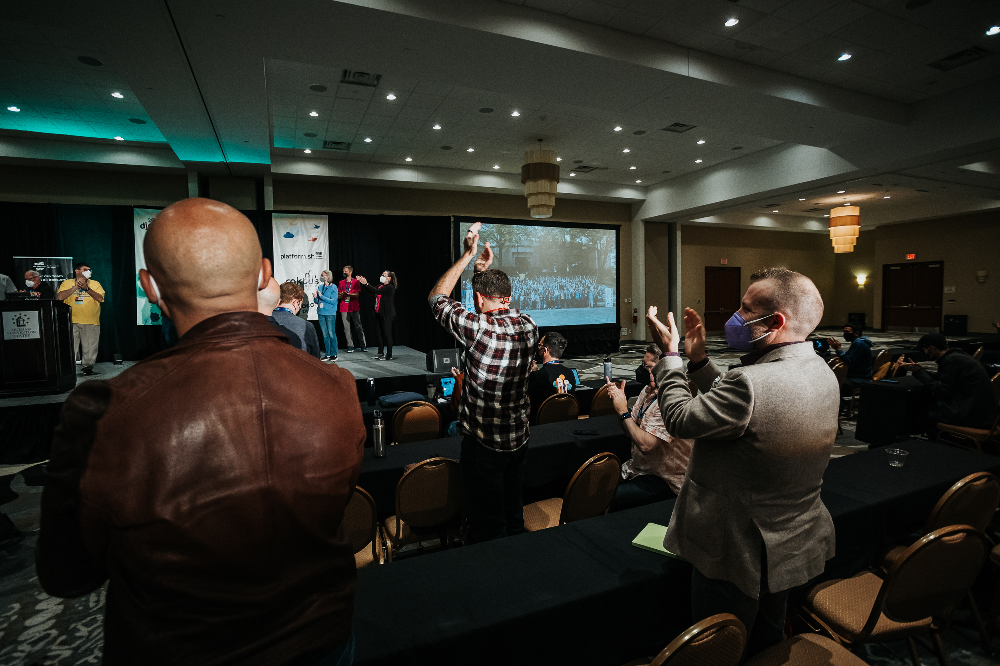
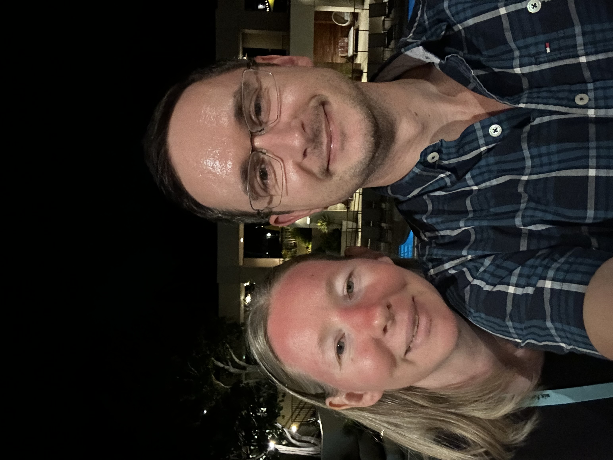

# Favorite Conference Photos

## DjangoCon US 2023

Wonderful people... DjangoCon US Organizers

Standing ovation for organizers during the final remarks... one of many standing ovations over the years. Always a nice feeling. 

Me and Deb Nicholson, PSF Executive Director

Me and Abigail Mesrenyame Dogbe. She is bringing open source to Ghana in a big way. 

Me with Jon Gould of Foxley Talent. I was lucky to be gifted this Django Social t-shirt. 

Hanging out with some amazing attendees, including fellow organizers and favorite Python/Django authors

DEFNA Board Dinner at the incredible Parizade... a perfect evening

## DjangoCon US 2022

One night while I was having dinner with favorite author Eric Matthes and now DEFNA Board Member Tim Schilling, former DEFNA Board Member Craig Bruce showed up unexpectedly. What a wonderful surprise! 

Me captured through the window enjoying the "hallway track"

Me with wonderful fellow organizer Noah Alorwu

## PyCascades 2020

Hanging out with Guido at the sprints

I was lucky to be invited to dinner. Guido happened to be in attendance. What a magical evening! 

## GitHub Universe 2019

At PyGotham 2019, within just a few hours of time, attendes invited me to tour Twitter, GitHub, and Salesforce Tower. During GitHub Universe 2019, I toured Twitter and GitHub. Unfortunately, my friend who worked at Salesforce was ill, so I didn't tour the tower. 

Me at GitHub

Me and Jigyasa Grover having tea after lunch at Twitter

Me at Twitter 

## DjangoCon US 2019

Happy times! 

Selfie with our wonderful Ken Whitesell. 

## DjangoCon US 2018

Happy times! 

After the conference, I flew to San Francisco. I visited my friend Betty Junod at Docker Headquarters. Fun! 

I heard there was a Twitter Tweet Up. I went there and met Jack and a bunch of other Twitter, Inc executives, investors, and fans. Amazing night! 

## DjangoCon US 2017

A treasured head shot taken by my friend Melanie Arbor
