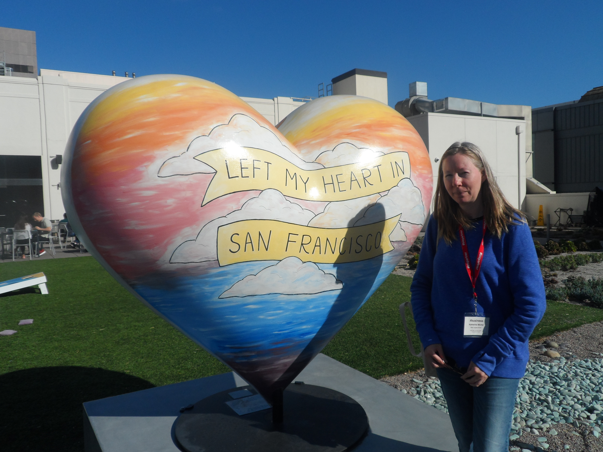
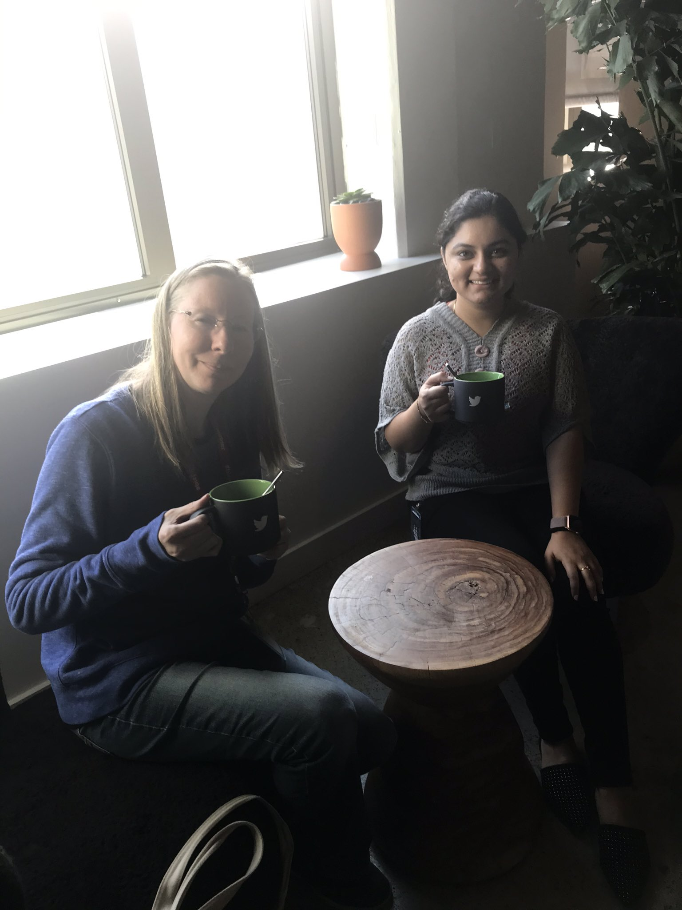
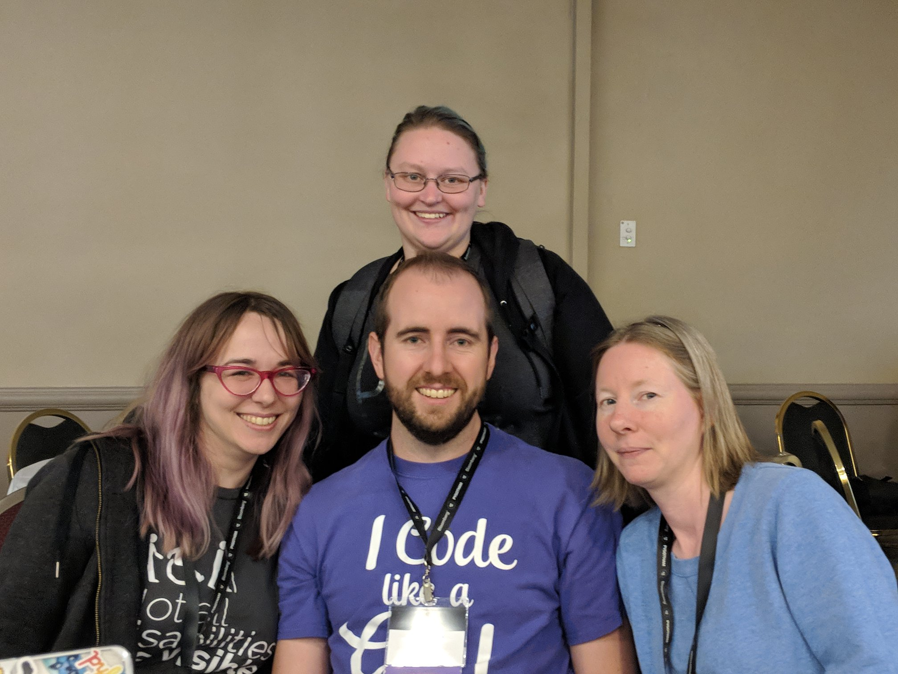
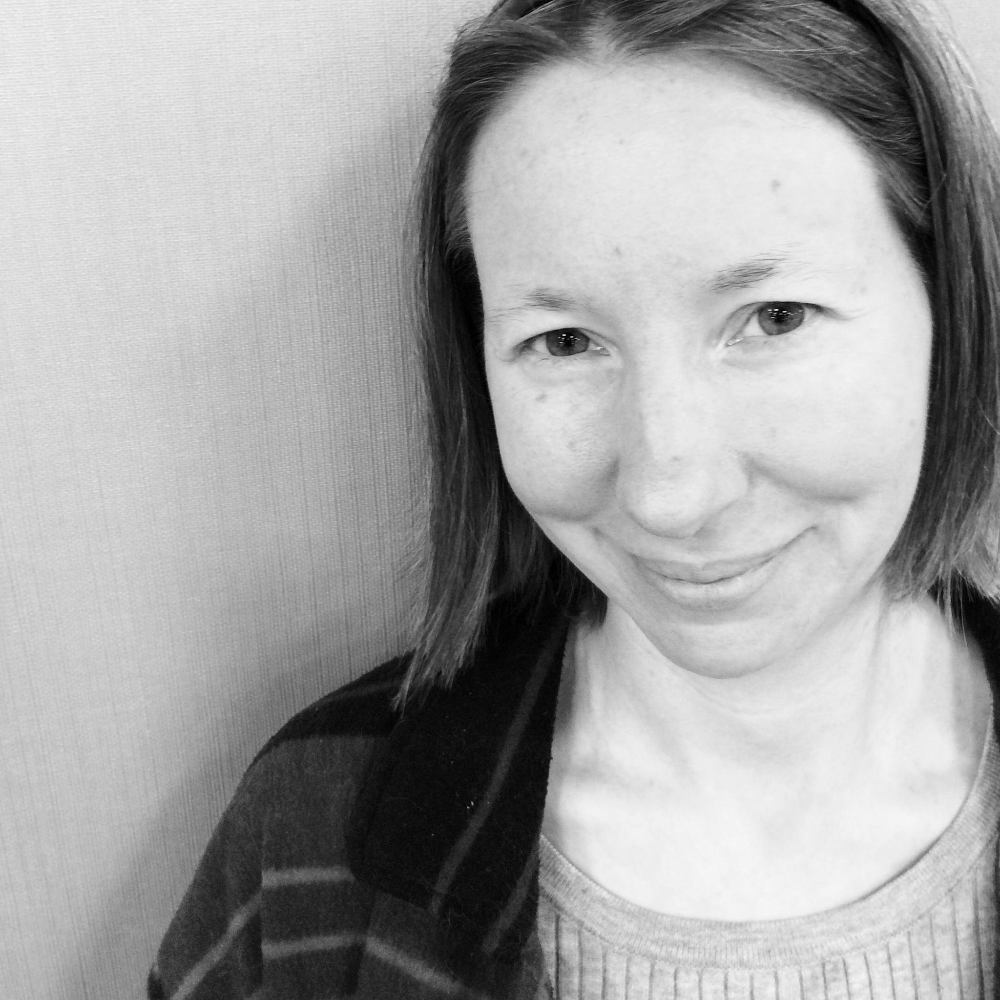

# Favorite Conference Photos

## DjangoCon US 2023

Wonderful people... DjangoCon US Organizers; photo credit: Bartek Pawlik (https://bartpawlik.format.com/)

Standing ovation for organizers during the final remarks... one of many standing ovations over the years. Always a nice feeling. Photo credit: Bartek Pawlik (https://bartpawlik.format.com/)

Me and Deb Nicholson, new PSF Executive Director... I met Deb unexpectedly at the pre-conference Django Social. It was a pleasure to get the chance to hang out with her throughout the week! I hope to do it again soon. 

Me and Abigail Mesrenyame Dogbe. She is bringing open source to Ghana in a big way. 

Me with Jon Gould of Foxley Talent. I was lucky to be gifted this Django Social t-shirt. 

Hanging out with some amazing attendees late into the evening, including fellow organizers and favorite Python/Django authors

DEFNA Board Dinner at the incredible Parizade... a perfect evening

## DjangoCon US 2022

One night while I was having dinner with favorite author Eric Matthes and now DEFNA Board Member Tim Schilling, former DEFNA Board Member Craig Bruce showed up unexpectedly. What a wonderful surprise! During all of the time that we'd been fellow board members, we'd never actually met in person. As usual, I'd been to the beach earlier in the week and gotten a bit too much sun. :) 

Me captured through the window enjoying the "hallway track"; photo credit: Bartek Pawlik (https://bartpawlik.format.com/)

Me with wonderful fellow organizer Noah Alorwu; photo credit: Bartek Pawlik (https://bartpawlik.format.com/)

## PyCascades 2020

At the end of a conference day, I was hanging out in the lobby among other stragglers and was invited to dinner by my friends Vicky and Jonan. Guido happened to be in attendance. What a magical evening! 

Hanging out with Guido at the sprints

## GitHub Universe 2019

At PyGotham 2019, within just a few hours of time, attendees invited me to tour Twitter, GitHub, and Salesforce Tower. During GitHub Universe 2019, I toured Twitter and GitHub. Unfortunately, my friend who worked at Salesforce was ill, so I didn't tour the tower. Here I am at GitHub in front of the iconic Octocat statue. 

Me at Twitter

Me and Jigyasa Grover, machine learning engineer, having tea after lunch at Twitter

Me at Twitter 

## DjangoCon US 2019

Happy times!; photo credit: Bartek Pawlik (https://bartpawlik.format.com/)

Selfie with our wonderful Ken Whitesell. For years, he has been the face that welcomes attendee to DjangoCon US and is a recipient of the Malcolm Tredinnick Memorial Prize. 

## Strange Loop 2019

My longtime Twitter friend Marcia Dorsey was volunteering at an event outside the Strange Loop venue. I couldn't pass up an opportunity to take a break from the conference and meet her in person. I told her how fun it had been to meet Jack at a tweet up the year before! I tried to get her to set me up on a date with him, but it didn't happen, lol. 

## PyCon US 2019

Me with one of my Python besties Mariatta (PyCon US 2023/2024 Chair and CPython Core Dev) :)

Proud to have represented DEFNA Board at PyCon Charlas. Here I am with Joel Rivera and the PyLatam logo! 

## DjangoCon US 2018

Happy times! Photo credit: Bartek Pawlik (https://bartpawlik.format.com/)

After the conference, I flew to San Francisco. I visited my friend Betty Junod at Docker Headquarters. Fun! 

Before I went to Docker, Jack Dorsey tweeted that there would be a tweet up in San Francisco later in the day. When I left Docker, I went to the tweet up. I met Jack, Twitter co-founder Biz Stone, and a bunch of other Twitter, Inc principals, including then CFO Ned Segal, Head of Product Kayvon Beykpour, early investor Bijan Sabet, and Recode journalist Kurt Wagner. Amazing night! Jack was shockingly nice. When I walked up to the gaggle around him, he asked me my name. Later, I took a pic with him. 

## PyGotham 2018

Incredibly, the day before the conference started, I was walking around mid-town Manhattan alone and saw my friend Tim! What are the odds? He invited me to dinner at one of his favorite restaurants. Here I am with Trey, Tim, Kenneth (DjangoCon US 2018 Co-Chair), and Lindsey. A treasured memory.   

Me with the incredible Lacey (DjangoCon US 2017 Chair) :)

Me with Lindsey, Trey, and Nic (DjangoCon US 2018 Co-Chair) during the conference

## DjangoCon US 2017

A treasured head shot taken by my friend Melanie Arbor during the sprints
