# Favorite Conference Snapshots

Although these snapshots do not include all of the people who are special to me, they give a taste of the fun and serendipity of my conference travels over the years. In the Python community, as they say, the world is your oyster. A huge thank you to everyone who has made these incredible experiences possible over the years. 

## DjangoCon US 2024

September 22-27, Durham, North Carolina

DjangoCon US organizers making the "bull city" hand sign; photo credit: Bartek Pawlik (https://bartpawlik.format.com/)

DEFNA Board watching as Velda jumps: Bartek Pawlik (https://bartpawlik.format.com/)

Me in front of a banner; photo credit: Bartek Pawlik (https://bartpawlik.format.com/)
 
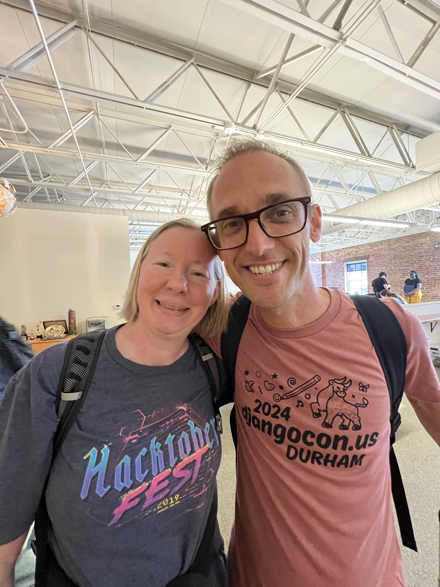
Me and Carlton Gibson, former Django Fellow, at the first day of sprints

After the conference had ended, I joined a group of Wagtail developers and conference speaker Eva Nanyonga for dinner at nearby Queeny’s.

Sitting next to Simon Willison, co-creator of Django, at the speaker/organizer dinner, I couldn’t resist getting a photo! I wrote about Simon's PyCon US 2024 talk about Imitation Intelligence in my [PyCon US Recap](https://katherinemichel.github.io/portfolio/pycon-us-2024-recap.html#simon-willison-keynote). (photo credit: Django Fellow Natalia Bidart)

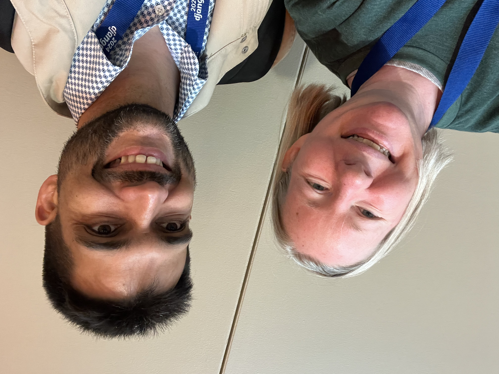
After years of following each other on social media, Lorenzo Peña and I had the chance to meet in person! I was thrilled that he had the chance to present a talk and attend the speaker/organizer dinner too. It was a dream come true for him. Stories like that make my day!

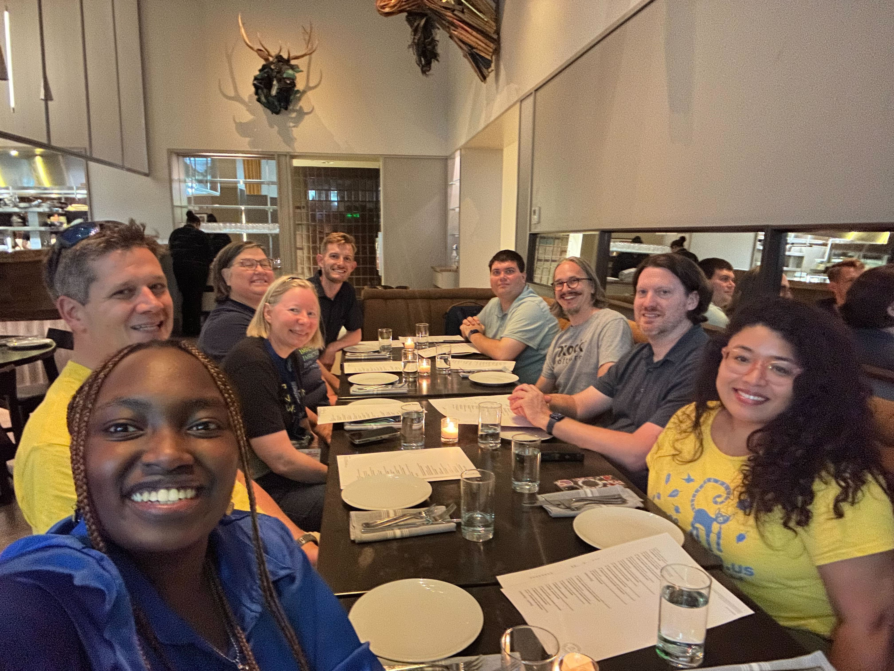
Wonderful people... the DEFNA Board dinner at 21c Museum Hotel Counting House. An unforgettable meal. 

Me, Abigail Afi Gbadago, and Velda Kiara after Black Python Devs Leadership Summit! I am so proud of them for the role they played in organizing an outstanding event. It had a lot of heart.

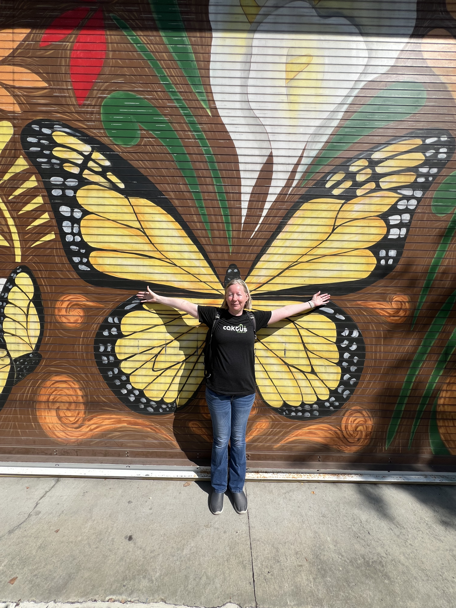
I've always wanted one of these! A nice visual metaphor taken along the side of the conference hotel during Centerfest Fine Art Festival. 

## PyCon US 2024

May 15-20, Pittsburgh, Pennsylvania

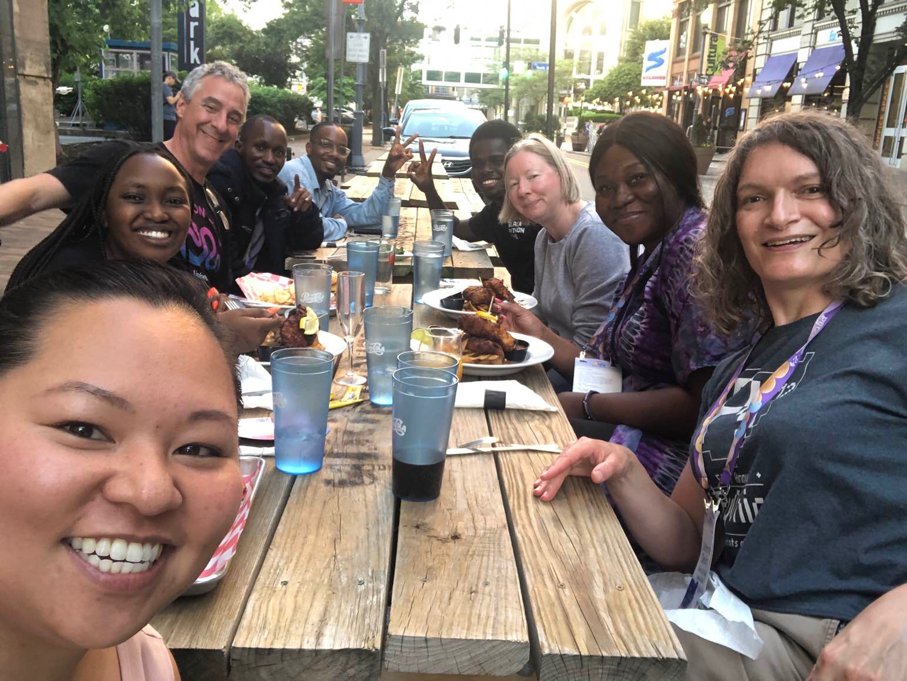
After the conference ended on Sunday night, I found myself chatting with a group of old friends and new friends. They invited me to dinner, and I decided to join. It was a wonderful time, as you can tell from the photo. :) Pictured: Tammy Do, Velda Kiara, Jim Anderson, Ngazetungue Muheue, Kudzayi Bamhare, Benedict Kofi Amofah, me, Afi Gbagado, and Catherine Devlin

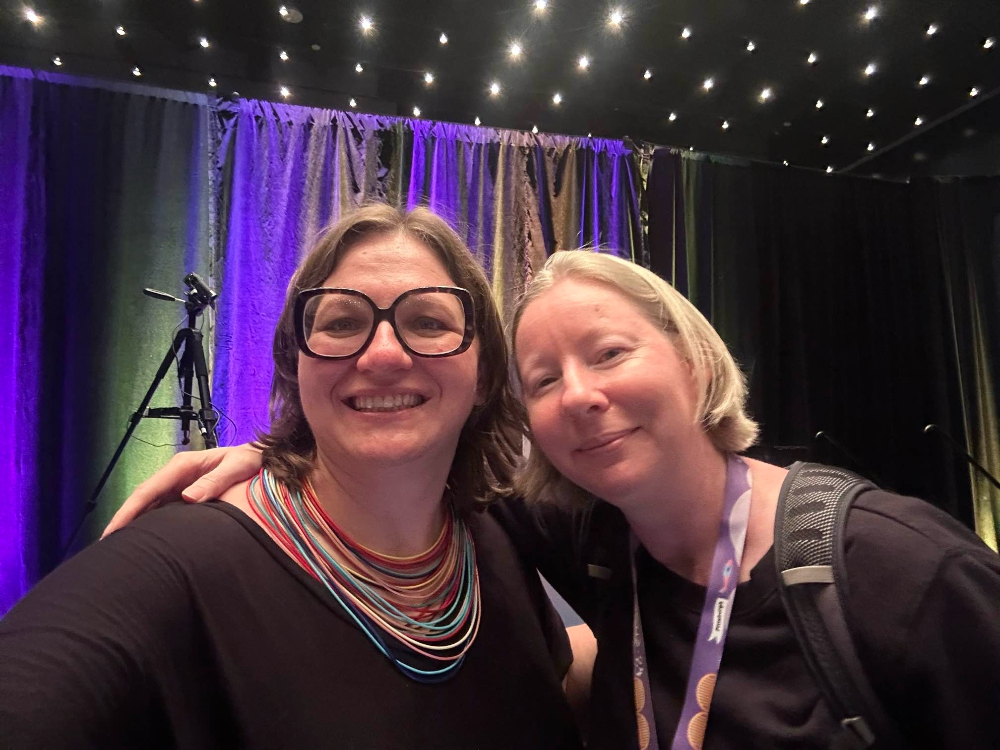
Me and Jackie Kazil :) 

Not only does Ned Batchelder maintain a powerful Python package and give popular conference talks, he is also a juggling enthusiast. When I saw his juggling open space in progress, I couldn't resist stopping. I juggled for the first time in probably decades!

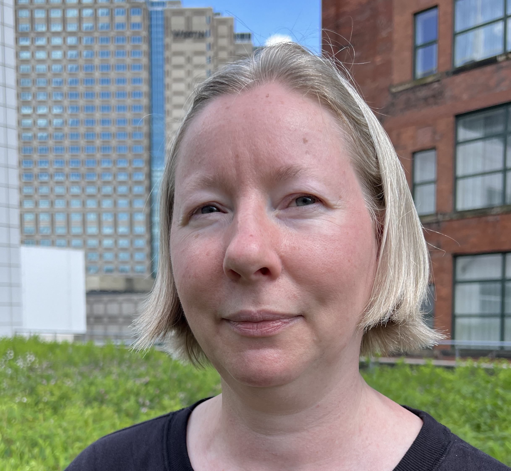
My friend Melanie Arbor takes great profile pics. At DjangoCon US 2017, she took my pic, and I loved it. I've used it as my social media profile pic since then, but it's getting a bit dated. I saw her at PyCon US and asked her if she would be willing to take a new profile pic of me. It turned out that she had already created a "Profile Pic Palooza" open space for Saturday at 3 pm. As a bonus, I got to catch up with Chalmer Lowe for the first time since PyCon 2019. 

When I create this page of favorite conference snapshots, Benedict Kofi Amofah tweeted to me that he'd be in the gallery soon. I took him up on it. :) 

Although not a typical snapshot, this screenshot from K. Jay Miller's keynote about Black Python Devs is special to me. They are snapshots from DjangoCon US 2023 in Durham, North Carolina. Jay highlighted DjangoCon US as a place where Black Python Devs were empowered.

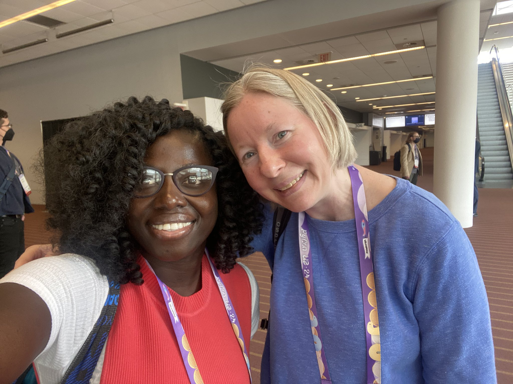
Me and Abigail Mesrenyame Dogbe

## PyTexas 2024

April 19-21, Austin, Texas

I met Jason Koo at DjangoCon US 2022 in San Diego where he generously helped as an organizer. It was great to see him again, and I look forward to learning more about Neo4j Graph Database! On the bright, sunny, second day of PyTexas, he invited me to be in this photo. It was a pleasure to get a snapshot next to my incredible friend Carol Willing. She had given an amazing keynote that morning. It is a must watch! I was also standing next to Josh Cannon who read the very clever Oh the (Methods) You Can (Make) book by Dunder Seuss. 

## DjangoCon US 2024

September 22-27, 2024, Durham, North Carolina

As a DEFNA Board Member, I help oversee DjangoCon US, including the website design. Because our host city Durham, North Carolina has the largest population of lemurs outside of Madagascar, we featured a "friendly" lemur on our website last year. After years of hearing about Tanganyika Wildlife Park in Goddard, Kansas, mom and I decided to go on April 6. I had no idea until I got there that you can feed lemurs. They were so soft and gentle. I loved spending time with these real-life, friendly lemurs!

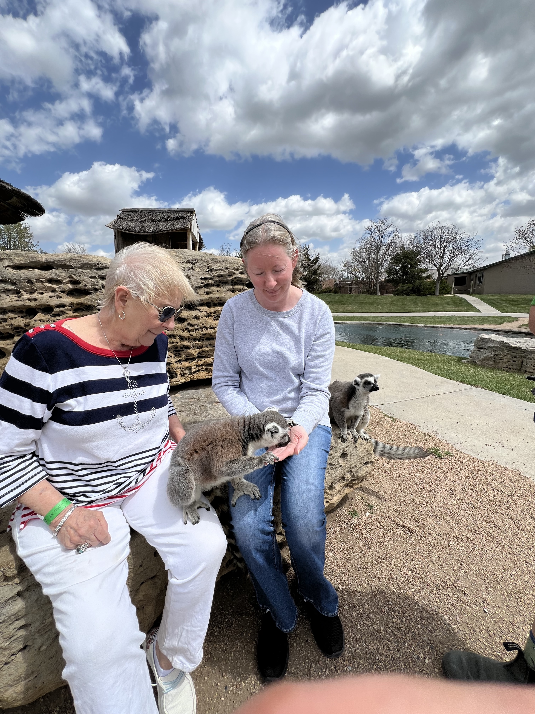
A lemur holding hold my hand while it eats a Craisin out of my palm! 

## DjangoCon US 2023

October 16-20, Durham, North Carolina

Wonderful people... DjangoCon US Organizers; photo credit: Bartek Pawlik (https://bartpawlik.format.com/)

Standing ovation for organizers during the final remarks... one of many standing ovations over the years. Always a nice feeling. Photo credit: Bartek Pawlik (https://bartpawlik.format.com/)

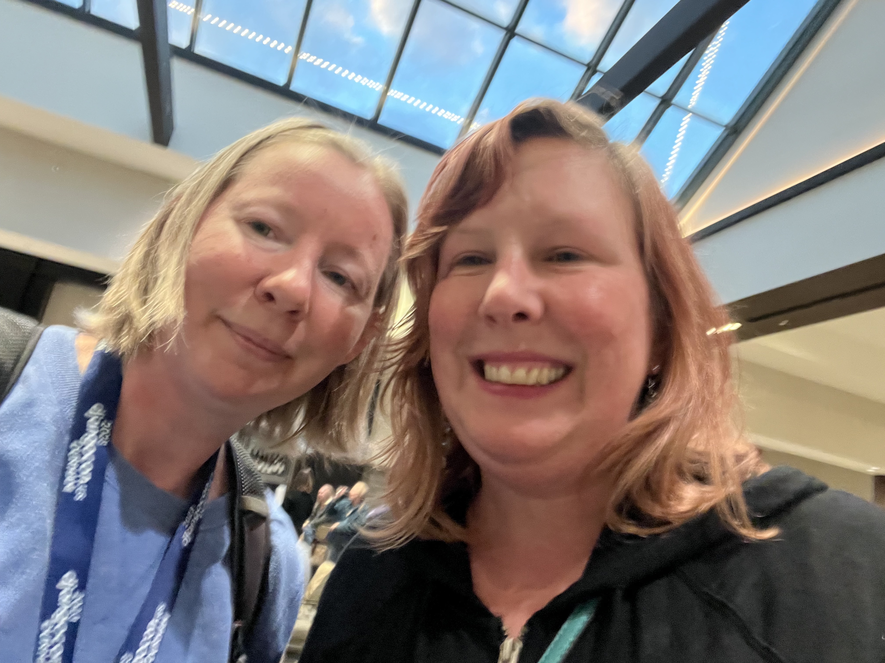
Me and Deb Nicholson, new PSF Executive Director... I met Deb unexpectedly at the pre-conference Django Social. It was a pleasure to get the chance to hang out with her throughout the week! I hope to do it again soon. 

Me and Abigail Mesrenyame Dogbe. She is bringing open source to Ghana in a big way. 

Me with Jon Gould of Foxley Talent. I was lucky to be gifted this Django Social t-shirt by Jon. 

Hanging out with some amazing attendees late into the evening, including fellow DjangoCon US Organizer Drew Winstel and favorite Python/Django authors Eric Matthes and William Vincent. Photo credit: Paolo Melchiorre

DEFNA Board Dinner at the incredible Parizade with Peter Grandstaff and Nichole Dominguez... a perfect evening. 

## DjangoCon US 2022

October 16-21, San Diego, California

One night while I was having dinner with favorite author Eric Matthes and now DEFNA Board Member Tim Schilling, former DEFNA Board Member Craig Bruce showed up unexpectedly. What a wonderful surprise! During all of the time that we'd been fellow board members, we'd never actually met in person. As usual, I'd been to the beach earlier in the week and gotten a bit too much sun. :) 

Me captured through the window enjoying the "hallway track" standing next to Eric Holscher of Read the Docs and Write the Docs; photo credit: Bartek Pawlik (https://bartpawlik.format.com/)

Me with wonderful fellow organizer Noah Alorwu; photo credit: Bartek Pawlik (https://bartpawlik.format.com/)

## DjangoCon US 2021

October 21-23, online

Following in the footsteps of PyCon US and with multiple Spanish-speakers on our DEFNA Board, we decided to have a Charlas track. Giving a talk in Spanish had been on my bucket list for quite some time. I decided to submit a proposal and it was accepted. I ended up recording the talk in both Spanish and English, and they were both played simultaneously. My pre-recorded talk Get a Jumpstart on Collaboration and Code Review in GitHub playing in English. 

My pre-recorded talk Get a Jumpstart on Collaboration and Code Review in GitHub playing in Spanish
 
## PyCascades 2020

February 8-9, Portland, Oregon

At the end of a conference day, I was hanging out in the lobby among other stragglers and was invited to dinner by my friends Vicky Tuite and Jonan Scheffler. Python creator and BDFL Guido van Rossum happened to be in attendance. What a magical evening! 

Hanging out with Guido at the sprints

## GitHub Universe 2019

November 13-14, San Francisco, California

After Nat Friedman, then GitHub CEO, tweeted to me that he'd love meet, I had the chance to talk to him briefly. It was super fun to hear from him in person. Love open source! 

At PyGotham 2019, within just a few hours of time, attendee Jigyasa Grover invited me to tour Twitter, Froi Irizarry Rivera invited me to tour GitHub, and Casey Faist invited me to Salesforce Tower. During GitHub Universe 2019, I toured Twitter and GitHub. Unfortunately, Casey was ill, so I didn't tour the tower. Here I am at GitHub in front of the iconic Octocat statue. 

Me and Jigyasa Grover, machine learning engineer, having tea after lunch at Twitter

Me at Twitter

Me at Twitter 

## DjangoCon US 2019

September 22-27, San Diego, California

Happy times!; photo credit: Bartek Pawlik (https://bartpawlik.format.com/)

Selfie with our wonderful Ken Whitesell. For years, he has been the face that welcomes attendee to DjangoCon US and is a recipient of the Malcolm Tredinnick Memorial Prize. 

## Strange Loop 2019

September 13-14, Saint Louis, Missouri

My longtime Twitter friend Marcia Dorsey was volunteering at an event outside the Strange Loop venue. I couldn't pass up an opportunity to take a break from the conference and meet her in person. I told her how fun it had been to meet her son Twitter and Square co-founder Jack Dorsey at a tweet up the year before! I tried to get her to set me up on a date with him, but it didn't happen, lol. 

## PyCon US 2019

May 1-9, Cleveland, Ohio

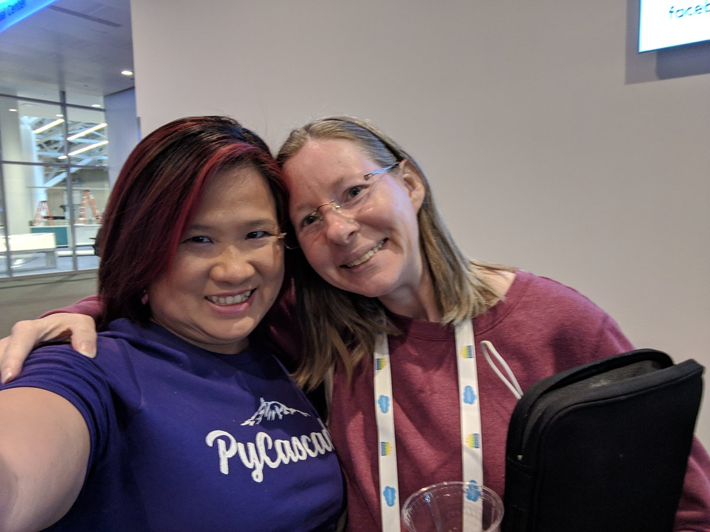
Me with one of my Python besties Mariatta (PyCon US 2023/2024 Chair and CPython Core Dev) :)

Proud to have represented DEFNA Board at PyCon Charlas (Spanish talks). Here I am with Joel Rivera and the PyLatam logo! 

## DjangoCon US 2018

October 14-19, San Diego, California

Taking part in the State of Django Panel; photo credit: Bartek Pawlik (https://bartpawlik.format.com/)
 

Happy times! Me front row, left. Photo credit: Bartek Pawlik (https://bartpawlik.format.com/)

After the conference, I flew to San Francisco. I visited my friend Betty Junod at Docker Headquarters. Fun! 

Before I went to Docker, Jack Dorsey tweeted that there would be a tweet up in San Francisco later in the day. When I left Docker, I went to the tweet up at Tacolicious. I met Jack, Twitter co-founder Biz Stone, and a bunch of other Twitter, Inc principals, including then CFO Ned Segal, Head of Product Kayvon Beykpour, early investor Bijan Sabet, and Recode journalist Kurt Wagner. Amazing night! When I walked up to the gaggle around Jack, he was shockingly nice. Later, I took a pic with him. 

## PyGotham 2018

October 5-6, New York, New York

Incredibly, the day before the conference started, I was walking around mid-town Manhattan alone and saw my friend Tim! What are the odds? He invited me to dinner at one of his favorite restaurants. Here I am with Trey Hunner, Tim Allen, Kenneth Love (DjangoCon US 2018 Co-Chair), and Lindsey Dragun. A treasured memory.   

Me with the incredible Lacey Williams Henschel (DjangoCon US 2017 Chair). She was giving a talk What if Jane Austen had been an engineer? :)

Me with Lindsey Dragun, Trey Hunner, and Nicholle James (DjangoCon US 2018 Co-Chair) during the conference

## PyGotham 2017

October 6-7, New York, New York

My second ever conference, treated to dinner by local attendees who wanted to make new friends and thank out-of-towners for coming. 

## DjangoCon US 2017

August 13-18, Spokane, Washington

Me giving my talk Get a Jumpstart on Collaboration and Code Review in GitHub. I gave my first conference talk at the first conference that I ever attended. I practiced using the AV system at a local church. I realized later that I had a lot of room for improvement (the speaker ahead of me was a veteran public speaker and technologist and watching her made me see how well it could be done), but it was a start. DjangoCon US loves to be the place where people get their start giving talks. :) Photo credit: Adam Gregory (https://atomimages509.wixsite.com/atom)

Speaker photo... representing Lawrence, Kansas, the birthplace of Django with a KU Basketball t-shirt; photo credit: Adam Gregory (https://atomimages509.wixsite.com/atom)

A treasured head shot taken by my friend Melanie Arbor during the sprints
