# Los Angeles 2023

<!--
 
Michael Jackson autograph on the Thiller jacket
-->

<!--
### Trader Joe's

I had to visit Los Angeles to go to a Trader Joe's for the first time. Bought supper and snacks there. 
-->

<!--
https://allthatsinteresting.com/cecil-hotel-los-angeles

I wore a different outfit everyday, but because I took a handful of sweatshirts and wore them over t-shirts to stay warm, I look like I had on the same outfit everyday. 🤷â€â™€ï¸
-->

Table of Contents
-----------------

- [Intro](#intro)
- [My Top Picks](#my-top-picks)
- [Wednesday](#wednesday)
    - [Travel Serendipity](#travel-serendipity)
    - [Santa Monica Pier at Night](#santa-monica-pier-at-night)
    - [North Italia](#north-italia)
- [Thursday](#thursday)
    - [Blue Daisy](#blue-daisy)
    - [Santa Monica and Venice Beaches](#santa-monica-and-venice-beaches)
- [Friday](#friday)
    - [Warner Brothers Studio Tour](#warner-brothers-studio-tour)
    - [Hollywood Walk of Fame, TCL Theatre, Hollywood Sign, Dolby Theater](#hollywood-walk-of-fame-tcl-theatre-hollywood-sign-dolby-theater)
    - [Dolby Theater Tour](#dolby-theater-tour)
    - [Santa Monica Beach at Sunset and Pier Burger](#santa-monica-beach-at-sunset-and-pier-burger)
- [Saturday](#saturday)
    - [Republique](#republique)
    - [Academy Museum of Motion Pictures](#academy-museum-of-motion-pictures)
    - [Petersen Automotive Museum](#petersen-automotive-museum)      
- [Sunday](#sunday)
    - [The Getty Center](#the-getty-center)
    - [Tacos 1986 and Santa Monica Beach at Sunset](#tacos-1986-and-santa-monica-beach-at-sunset)      
- [Monday](#monday)
    - [Republique](#id1)
    - [The Grammy Museum](#the-grammy-museum)
    - [The Cecil Hotel](#the-cecil-hotel)
    - [Downtown Los Angeles](#downtown-los-angeles)
    - [Los Angeles City Hall Observation Deck](#los-angeles-city-hall-observation-deck)
    - [Bruno's Ristorante Italiano](#brunos-ristorante-italiano)
- [Tuesday](#tuesday)
    - [Universal Theme Park](#universal-theme-park)
    - [The Griffith Observatory](#the-griffith-observatory)
    - [Comedy in English](#comedy-in-english)
- [Wednesday](#id2)
    - [Hollywood Walk of Fame](#hollywood-walk-of-fame)
    - [Celebrity Homes Bus Tour](#celebrity-homes-bus-tour)
    - [Rodeo Drive](#rodeo-drive)
    - [Via Alloro](#via-alloro)
    - [Bruno's Ristorante Italiano](#brunos-ristorante-italiano-1)
- [Thursday](#id4)
    - [Ice at Santa Monica](#ice-at-santa-monica)
    - [Mel's Drive-In](#mel-s-drive-in)
    - [End of Santa Monica Pier at Sunset](#end-of-santa-monica-pier-at-sunset)
    - [Santa Monica Pier Carousel](#santa-monica-pier-carousel)
    - [Santa Monica Promenade](#santa-monica-promenade)
- [Friday](#id5)
    - [Back to Kansas for Christmas](#back-to-kansas-for-christmas)
- [Takeaways](#takeaways)
- [Warner Brothers Studio Tour versus Universal Studios Tour](#warner-brothers-studio-tour-versus-universal-studios-tour)
    - [What Warner Brothers Had Going For It](#what-warner-brothers-had-going-for-it)
    - [What Universal Studios Tour Had Going For It](#what-universal-studios-tour-had-going-for-it)
      
## Intro

I finished my work year with a successful presentation to my department (see my [2023 Recap](https://katherinemichel.github.io/portfolio/2023-recap.html) for a review of my year!). A few hours later, I arrived at LAX. With Santa Monica as my "home base," I spent 9 days seeing the city. It was the first non-business trip that I'd taken in years. I had a general idea of the things I wanted to do, but hadn't done much planning. I played it by ear, and it worked. 

## My Top Picks

TL;DR

Hollywood experience
* [Dolby Theater Tour](https://dolbytheatre.com/tours/tour-information/)
* [Warner Brothers Studio Tour](https://www.wbstudiotour.com/tickets/)
* [Universal Studios Tour](https://www.universalstudioshollywood.com/web/en/us/things-to-do/rides-and-attractions/the-world-famous-studio-tour)
* [Academy Museum of Motion Pictures](https://www.academymuseum.org/en)
* [Celebrity Homes Bus Tour](http://hollywoodbustours.com/)
* [Via Alloro](https://www.viaalloro.com/)

Great views, artwork, and science
* [The Getty Center](https://www.getty.edu/visit/center/)
* [The Griffith Observatory](https://griffithobservatory.org/)

Beach fun
* [Santa Monica](https://www.santamonica.com/things-to-do/santa-monica-beach/) and [Venice Beaches](https://www.visitveniceca.com/), [Santa Monica Pier](https://www.santamonicapier.org/) (day and night)

Fascinating
* [Petersen Automotive Museum](petersen.org)

Good food
* [Bruno's Ristorante Italiano](https://brunossantamonica.com/)
* [République](https://republiquela.com/)

[**back to top**](#table-of-contents)

## Wednesday

### Travel Serendipity

I've had a lot of what I call travel serendipity. My trip kicked off with some incredible entertainment business serendipity! 

Immediately upon arriving in Los Angeles, I had the good fortune to randomly meet award show producer Charnise Love Jones! She has worked on the Daytime Emmys, Children and Family Emmys, Grammys, BET Awards, Soultrain Awards, Stellar Awards, NAACP Image Awards, American Music Awards, and many other fun productions. Wow!

We've connected on LinkedIn, and I can't wait to get to know her work better and follow her adventures! Check out her [Instagram](https://www.instagram.com/lovejonesproduction/) and [YouTube](https://www.youtube.com/@Lovejonesproductions/videos) channel. 

[**back to top**](#table-of-contents)

### Santa Monica Pier at Night

I arrived in Santa Monica after dark. I was staying about a block from the pier, so I walked there to get a good look at it at night. It was magical!

Santa Monica Pier at night
 
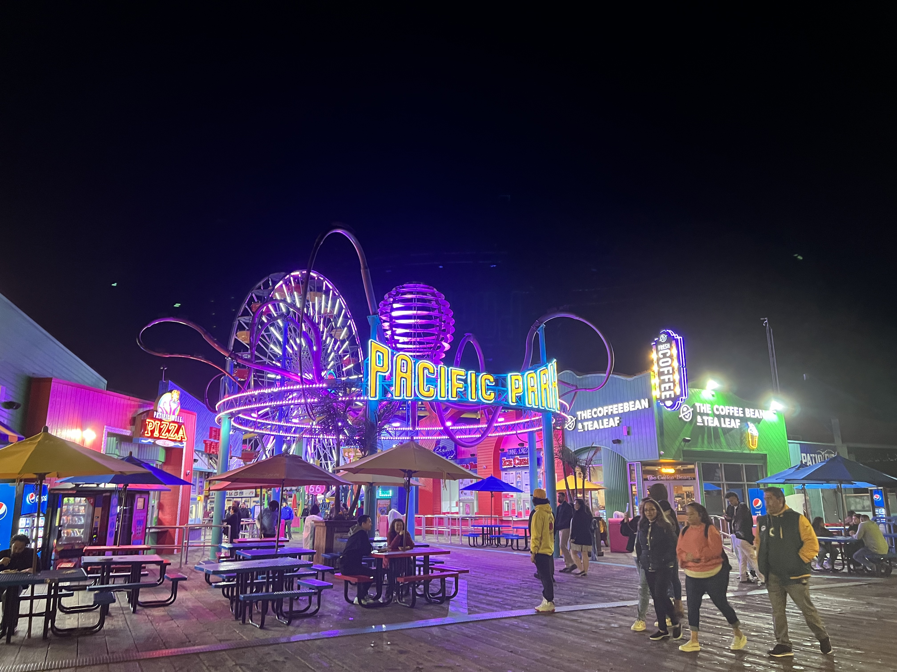
Pacific Park Amusement Park

Pacific Park ferris wheel overlooking the ocean waves...

[Video](https://youtu.be/GP4Td4SUH0M?si=XDPxScs8KR0mg2fj) of walking along Santa Monica Pier

[Video](https://youtu.be/_KTMAmlOzqQ?si=6b8YhK7_jpLKBhiN) of Santa Monica Pier looking east

[Video](https://youtu.be/cnWdL9C4ucU?si=_5bCR2RdHMWjLTbO) of ferris wheel and roller coaster

[Video](https://youtu.be/08xtEKQ8Yjg?si=oVrTxLtU4tAqe9FC) of north of the Santa Monica Pier

[Video](https://youtu.be/53oLr76JxuY?si=W2jQtuxPaf7SNMy5) of south of the Santa Monica Pier

[**back to top**](#table-of-contents)

### North Italia

I was looking for a convenient, but decent place to eat dinner. I stumbled upon [North Italia](https://www.northitalia.com/) while walking down the street. The food is handmade with the best ingredients, and it was good, but a bit high falutin' Italian for my taste. Later in the week, I discovered another Italian restaurant nearby called [Bruno's Ristorante Italiano](https://brunossantamonica.com/). North Italia did not compare to the simple, delicious authenticity of Bruno's. Bruno's perfectly hit the spot for me. Sorry, North Italia. 

North Italia Crushed Meatball Ragu: beef meatball, porchetta, blistered onion, wild oregano, bucatini, pecorino

[**back to top**](#table-of-contents)

## Thursday

### Blue Daisy

On Thursday, I ate breakfast at [Blue Daisy](https://www.bluedaisycafe.com/brunch-santa-monica/). I picked it on the spur of the moment, because it was nearby and the reviews I read were positive. The staff were wonderful, but the food was underwhelming.

I had 3 eggs scrambled with mushroom, which came with zucchini hash and a plain crepe with jam. 

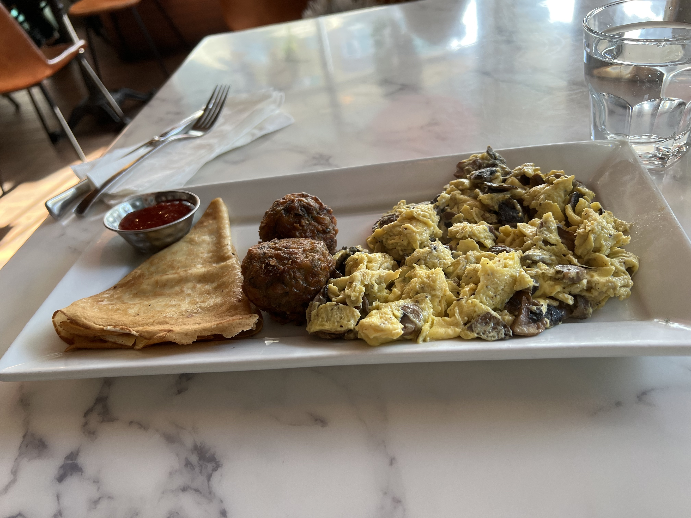
Breakfast...

I asked the waiter if the zucchini hash came from another culture. He laughed and said it's something the chef invented to make breakfast healthier. Sounds like an Los Angeles thing. I don't know if I want my breakfast to be that healthy. 

The best part of the meal was a delicious Turkish Latte ("creamy and a touch of sweetness"). 

Turkish latte... beautiful and yummy!

[**back to top**](#table-of-contents)

### Santa Monica and Venice Beaches

Perhaps because I have spent most of my life in a landlocked state, when I arrive in a city on the coast, I can't wait to get to the ocean. 

On my first full day in Los Angeles, I walked from Santa Monica Pier to Venice Beach Pier via the boardwalk, then back to Santa Monica Pier via the ocean. 

The San Diego beaches that I've been to have been more breathtaking (south of La Jolla Cove) and more California-y (Pacific and Ocean Beaches Boardwalks), but it was great to be near the ocean again. 

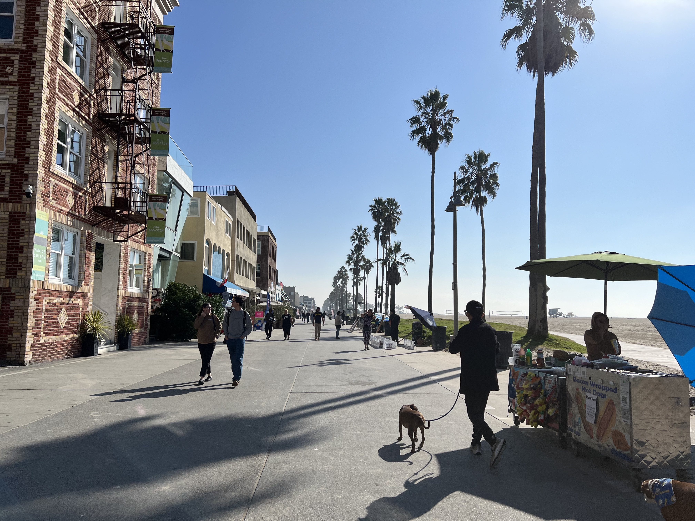
Venice Beach Boardwalk

Venice Beach Skateboard Park, near the Muscle Gym

<!--
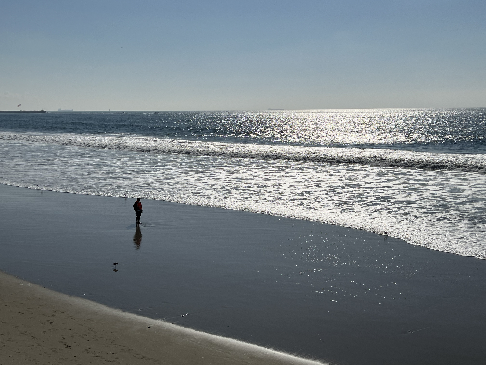
At the Venice Beach Pier... same, buddy
-->

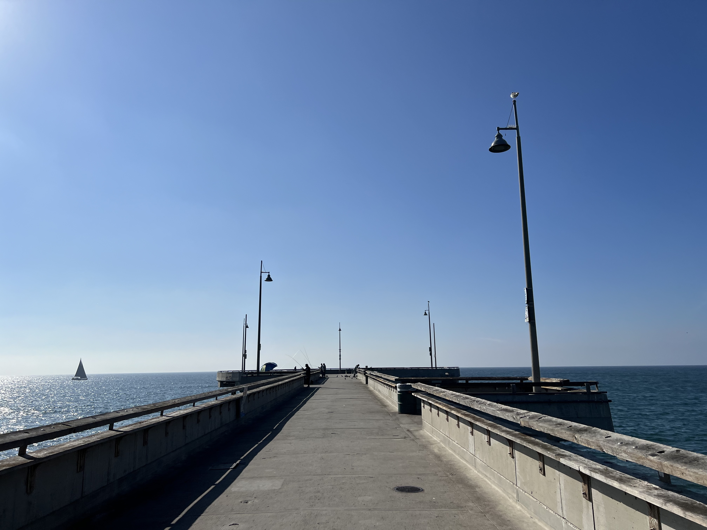
Venice Beach Pier... love the sight of a sailboat!

Venice Beach waves crashing

Venice Beach waves crashing

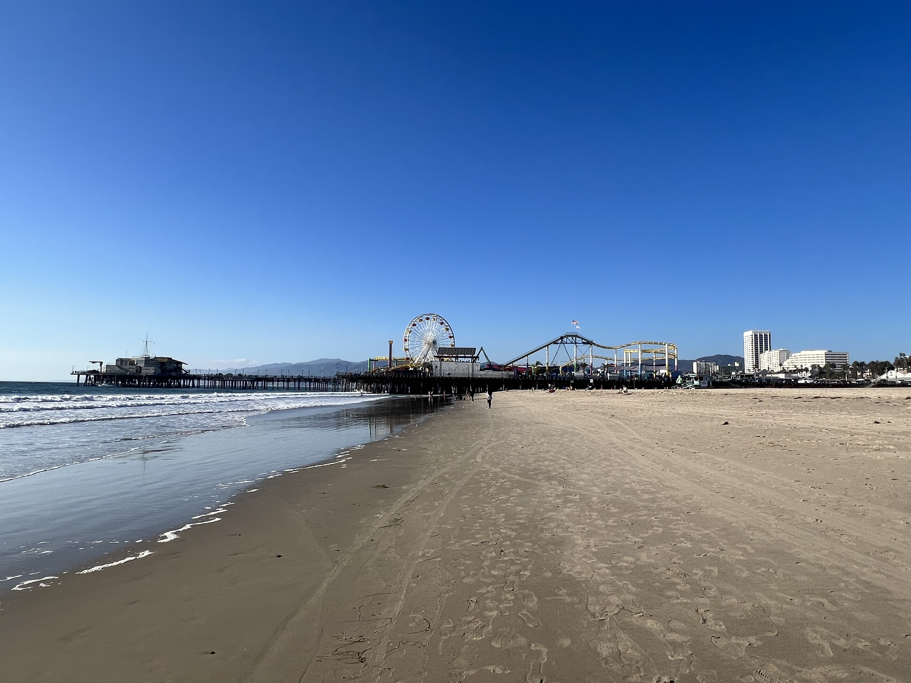
Santa Monica Beach looked toward the pier

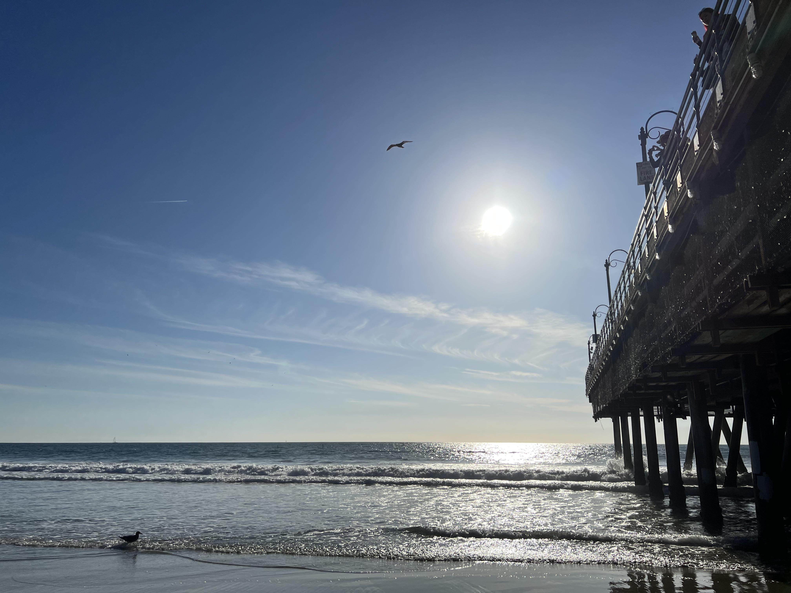
Santa Monica Pier... the sun is going down. 

[Video](https://youtu.be/WtmDbIY2Ieo?si=Ceo0xQmuELsoQAQ) of birds flying around Santa Monica Beach

[Video](https://youtu.be/KwIrQjfX-V4?si=4_Ry7O-1ObcdP_bx) of walking along Santa Monica Pier

[Video](https://youtu.be/svqLyz8D2uM?si=_0ziKygwuCW4jcWS) of Venice Beach Boardwalk

[Video](https://youtu.be/AUqmrRV7teE?si=ZBpTh3dFF_Y0ivTc) of Venice Beach Skatepark

[Video](https://youtu.be/TLsb7qy8kyY?si=EOogWOqHwtV2SGFw) of a bird flying above Venice Beach Pier

[Video](https://youtu.be/cJEZFFnFlng?si=rQCBZOJ3st627zSB) of a sailboat at Venice Beach Pier

[Video](https://youtu.be/MAdhUKSJbbg?si=E43wzKHu5W-n3QDG) of Venice Beach north of the pier

[Video](https://youtu.be/aZfZ09UInL8?si=V_2mktPdKua1GsRd) of Venice Beach south of the pier

[Video](https://youtu.be/qO44Inr0C48?si=DVb-wguV6vt81JGV) of Venice Beach sand pipers

[Video](https://youtu.be/oFwZHgMXFIc?si=4F8TWCy2DFphuYnd) of good waves at Venice/Santa Monica Beaches

[Video](https://youtu.be/kQFnozP3w_I?si=YTc9aYrPt0YRq4ez) of a dog running along Santa Monica Beach

[Video](https://youtu.be/WFSL7NGoi8w?si=oZu2eSMt4OWFLY4D) of Santa Monica Beach with a view of the pier

[Video](https://youtu.be/Fzv0tZ1zzQU?si=AmMmtc6kuHH13b7N) of Santa Monica Pier at sunset

[**back to top**](#table-of-contents)

## Friday

### Warner Brothers Studio Tour

See the end of this blog post for a comparison between Warner Brothers Studio Tour and Universal Studios Tour. 

After some quick research, I settled on [Warner Brothers Studio Tour](https://www.wbstudiotour.com/tour/studio/) as a top priority. It was an incredible, in-depth experience. 

Because I hadn't read up on the details of the tour ahead of time, I had no idea what I would see. 

Having my photo taken on the real Friends was a really fun surprise and gave me a feeling of childlike delight. What a great way to kick off my Hollywood sightseeing. 

In addition to a tour of city and town backlots, the Friends soundstage, and a photo in front of the Friends fountain, there were multiple large exhibits packed full of costumes, props, vehicles, and interactive experiences from Superman, Wonder Woman, Justice League, Batman, Game of Thrones, Harry Potter, Gilmore Girls, Big Bang Theory, My Fair Lady, Casablanca, and many others. 

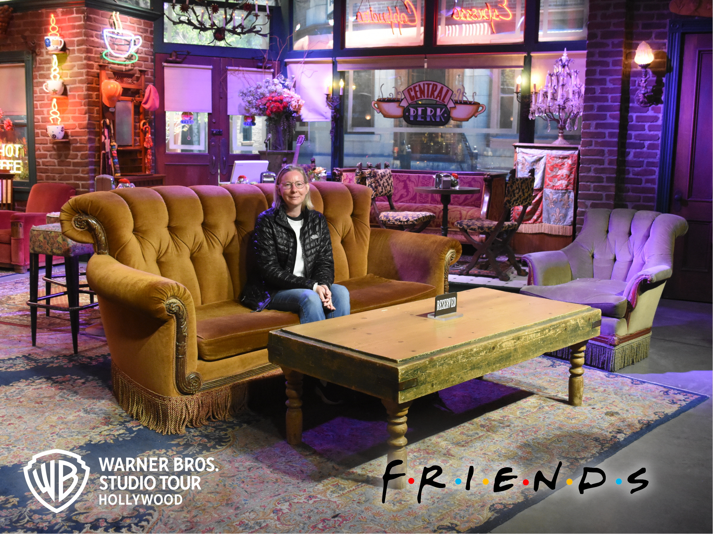
Me on the real Friends set... I don't usually buy these, but couldn't resist this time!

Me sitting in front of the real Friends fountain... the sofa looks soft, but was actually hard as a rock. The fountain was also used in Wonder Woman (Lynda Carter leapt over it) and the Bewitched pilot.

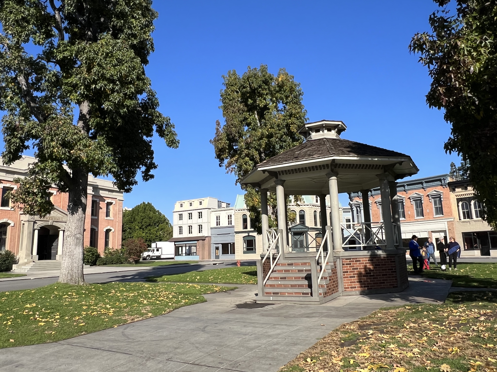
Town backlot with gazebo

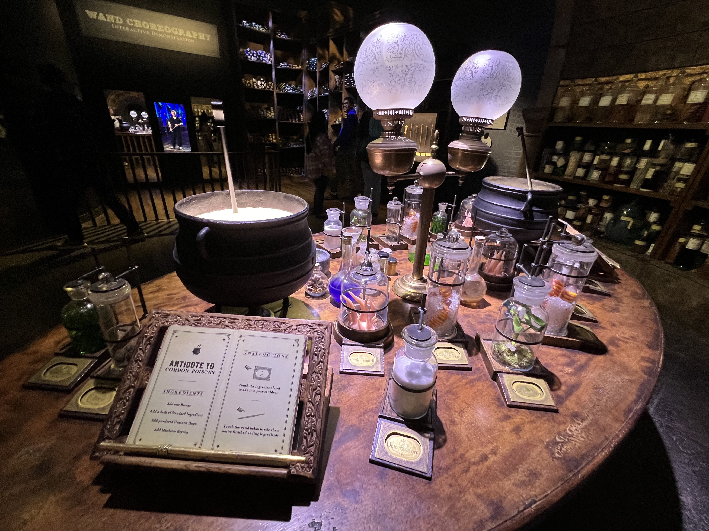
Harry Potter spells

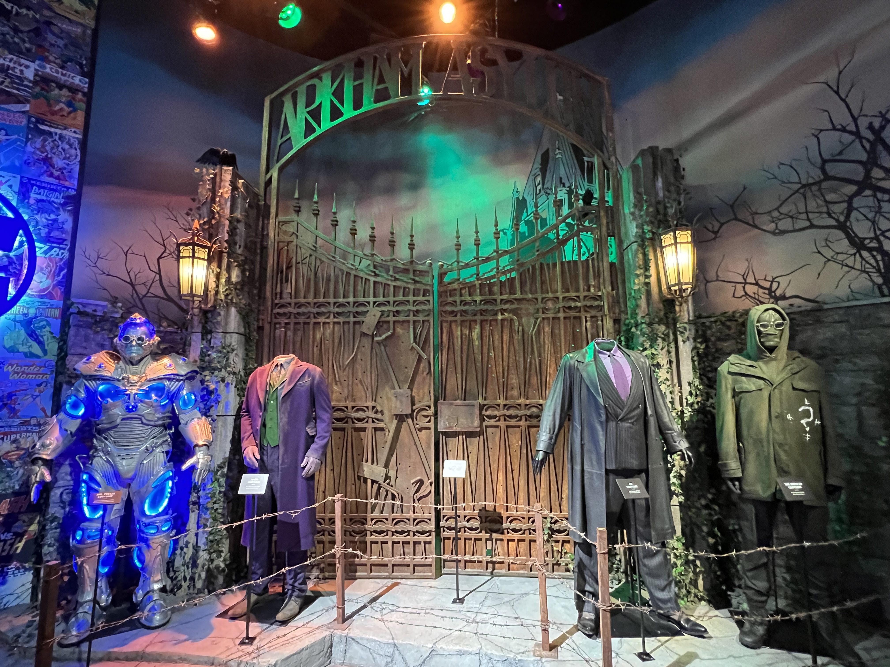
Mr. Freeze, Joker, Oz, and Riddler costumes in front of the Arkham Asylum gates
 

Warner Brothers Studio awards

[Video](https://youtu.be/4aTxOa3chcs?si=r4nBfIcyBcqmhqzs) of Friends set

[Video](https://youtu.be/wNWcuESAZDE?si=_4TjbCbo0CUcXOPE) of the Friends fountain

[Video](https://youtu.be/iL-cWXCyAsE?si=vg80ZuUTMV5A59Vg) of casting spells in Wizarding World

[**back to top**](#table-of-contents)

### Hollywood Walk of Fame, TCL Theatre, Hollywood Sign, Dolby Theater

After the Warner Brothers Studio Tour, I traveled over to Hollywood Boulevard and walked around.

Hollywood Boulevard

[TCL Chinese Theater](https://www.tclchinesetheatres.com/)

Michael Jackson's handprints, glove prints, and footprints

Hollywood Sign as seen from the upper floor of [Ovation Shopping Center](https://www.ovationhollywood.com/). 

On Oscar night, Hollywood Boulevard becomes a red carpet walkway for the stars. What is normally the entrance to the Ovation Shopping Center will become a grand, elaborately decorated hall that the Academy Awards Ceremony attendees will walk down. 

The steps leading up to the [Dolby Theater Tour](https://dolbytheatre.com/), where the Academy Awards Ceremony takes place

[Video](https://youtu.be/r-C5N_mtsb8?si=DD_4C_2tPkIu2ko8) walking into Ovation Shopping Center up to Dolby Theater

[Video](https://youtu.be/ihaYNCC3sU4?si=9IS5N8DZwYQ2lXkD) walking around Hollywood Boulevard

[**back to top**](#table-of-contents)

### Dolby Theater Tour

Afterward, I took the [Dolby Theater Tour](https://dolbytheatre.com/tours/tour-information/). I really enjoyed it. It was one of the most fun things that I've ever done. 

My tour guide was a long-time Academy Awards Ceremony crew member. We walked in the footsteps of the A-list stars into the theater, then backstage and on stage where we had a view of the audience from where the presenters stand. We exited stage left, then took the red carpet "Winner's Walk" that only Academy Award winners and tour participants get to take. All the while, our tour guide gave some inside stories from her years of working at the ceremony. 

Me standing where the presenters stand with a view of the audience behind me... the photos on chairs represent the A-list guests who sat there recently.

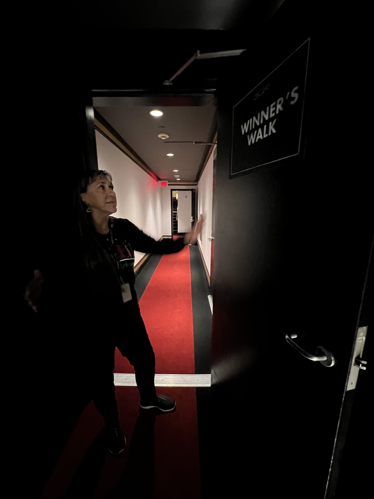
Having exited stage left just like the Academy Award winners do, we are walking in their footsteps down the "Winner's Walk." 

This red carpet leads the winners to their press interview. 

[**back to top**](#table-of-contents)

### Santa Monica Beach at Sunset and Pier Burger

I made it back to Santa Monica for sunset at the beach.

The view from Ocean Avenue

Walking from the pier down to Santa Monica Beach

Santa Monica Beach sunset
 

Tourist be touristing... I gave in and ate an overpriced hamburger, fries, and strawberry milkshake at [Pier Burger](https://www.pierburger.com/). 

[Video](https://youtu.be/tYtLZPSjdJQ?si=YTT-1avfxxbQuDxR) of walking to the Santa Monica Pier at sunset

[Video](https://youtu.be/y_R55NwD5PA?si=FTA12rl3sTd4p1s6) of Santa Monica Beach at sunset

[**back to top**](#table-of-contents)

## Saturday

### Republique

I started Saturday by eating breakfast at a bakery/café called [République](https://republiquela.com/) in a building that Charlie Chaplin had built. République is owned by two chefs awarded a Michelin Star and a James Beards award and one of whom worked with Alain Ducasse of the Dorchester Collection, my old stomping grounds. A foodie colleague and friend Wooyong Ee recommended it. It was excellent. 

Much of the building's original architecture is intact, as seen in these [photos](https://martinturnbull.com/2020/06/02/charlie-chaplins-italian-villa-inspired-building-at-624-s-la-brea-ave-los-angeles-circa-late-1920s/). The restaurant floor appears to be in what was an open courtyard, with the arches still in existence. Imagine walking the same grounds as Charlie Chaplin. Mind blowing.

Brownie, pumpkin spice danish, pain au chocolat, ham croissant

Regular breakfast: bacon steak, fingerling potatoes, baguette, french butter, jam, eggs over hard

République courtyard... a good view of the front of the original Charlie Chaplin building

République front

[**back to top**](#table-of-contents)

### Academy Museum of Motion Pictures

[The Academy Museum of Motion Pictures](https://www.academymuseum.org/en) had an extensive collection of photos, costumes, props, artifacts, and equipment that explored the various types of craft that go into movie making. 

One large exhibit was devoted to the creation of The Godfather. 

The museum also had a number of famous movie costumes and puppets. I particularly enjoyed the The Dark Crystal puppets. I hadn't thought about that movie since I watched it as a child and was instantly transported back to childhood. 

The Godfather office

The Godfather rehearsal horse head... not something you see everyday! 

Alien xenomorph

The Dark Crystal's Skeksis

Terminator 2: Judgement Day animatronic... the team that created this won an Academy Award for Visual Effects

Academy Award statues room

[Video](https://youtu.be/BM8AMYP3mL0?si=Jpd-JnuRdGW-eT4u) of the Academy Award statues room

[**back to top**](#table-of-contents)

### Petersen Automotive Museum

Even though I am far from an expert in cars, with the [Petersen Automotive Museum](https://www.petersen.org/) being just across the street from the Academy Museum of Motion pictures, I decided to give it a try. 

A Lyft driver later pointed out to me that Notorious B.I.G. was shot at the intersection between the two museums. It's incredible how many famous landmarks are "hiding in plain sight" in Los Angeles. 

As suggested, I started on the third floor of the museum and worked my way down. The first floor was almost completely devoted to Tesla. 

I regret not having added the basement "vault" tour to my ticket. It was more than I could do at the time. Perhaps I'll go back sometime. 

While I am sure there were more technically impressive classic cars there, the many Hollywood cars in the collection caught my eye. 

Thelma and Louise Car

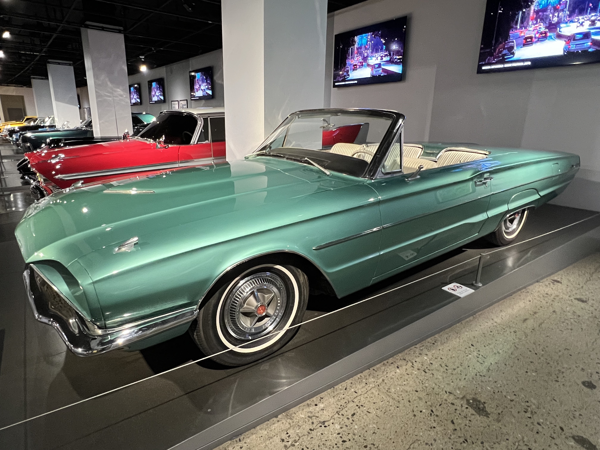
Thelma and Louise Car

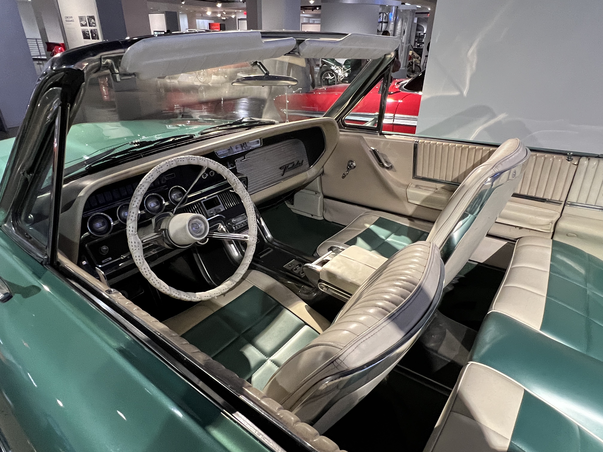
Thelma and Louise Car

Back to the Future DeLorean

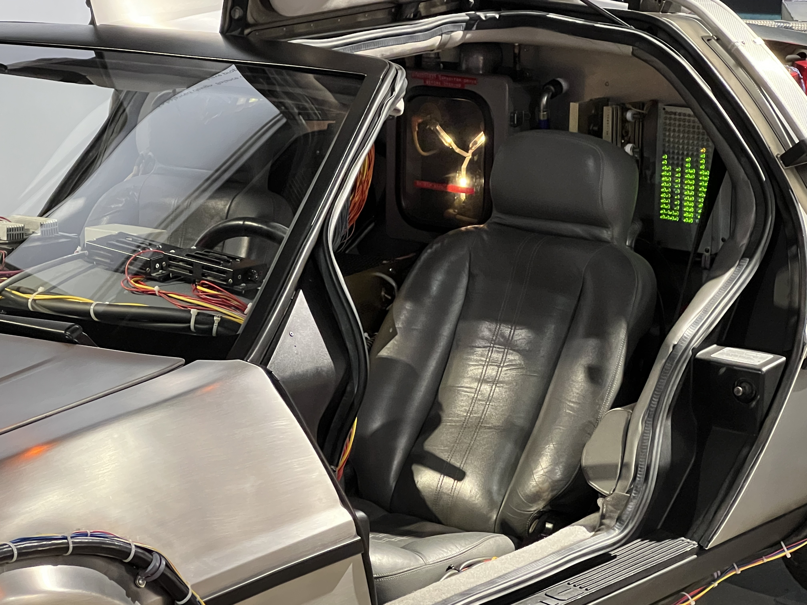
Back to the Future flux capacitor!

[**back to top**](#table-of-contents)

## Sunday

### The Getty Center

[The Getty Center](https://www.getty.edu/visit/center/) experience was well worth the trip. The architecture, art, and views were all simply jaw dropping.

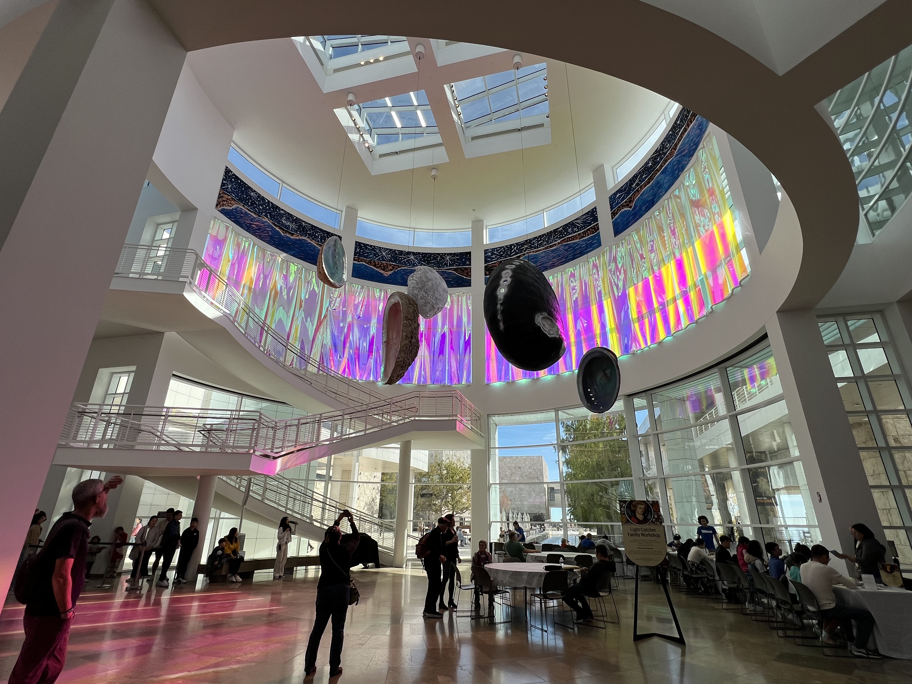
The entrance hall

One of the highlights of the collection: [Vincent Van Gogh's Irises](https://www.getty.edu/art/collection/object/103JNH)

[Central Garden](https://www.getty.edu/visit/center/top-things-to-do/gardens/): a garden with an incredible view. I almost overlooked it. Fortunately, I came back a second time and ventured to the other side of the garden.

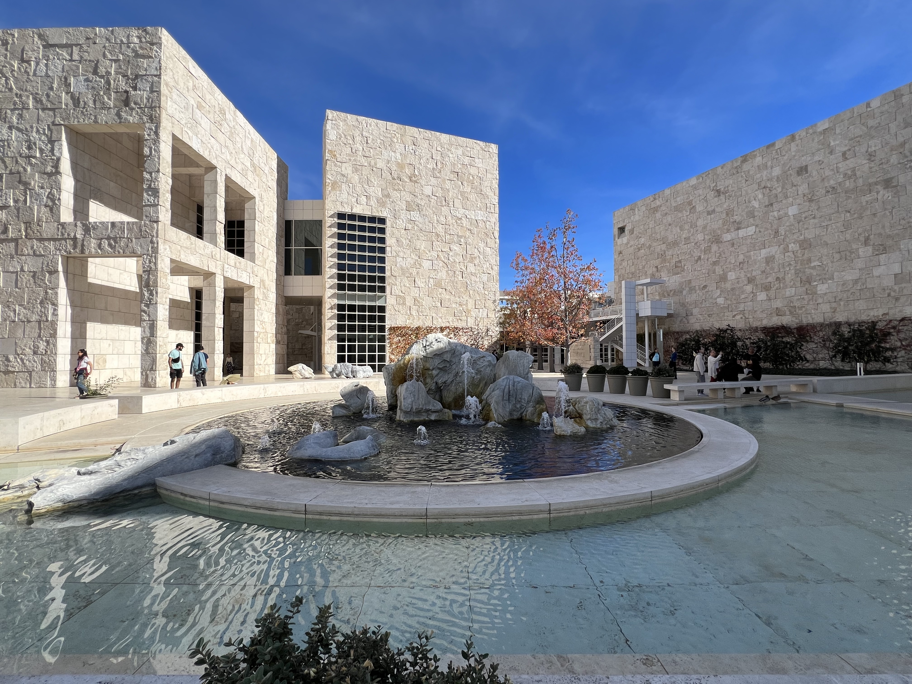
Example of the beautiful architecture

Although I enjoyed the view of Los Angeles from the main Getty Center terrace, the consensus from locals was that the view from the The Griffith Observatory is much better. 

[Video](https://youtu.be/vngC0TWpU0Q?si=nnghFglziVyW2WwK) of The Getty Center main terrace

[Video](https://youtu.be/1-OcUMCII3o?si=luk7utrXz2LnaQff) of the Central Garden

[Video](https://youtu.be/x8CULebm0bY?si=fIBpoVIoVCZCmAth) walking through Central Garden

[Video](https://youtu.be/ZzHO8MQLE9U?si=ADCgfmAaY8KrLPvw) of a Getty Center fountain

[Video](https://youtu.be/TwIPtk2IA9A?si=ub_cBZedXZhjluZQ) of the ride down from The Getty Center

[**back to top**](#table-of-contents)

### Tacos 1986 and Santa Monica Beach at Sunset

I grabbed some tacos and hurried to the Santa Monica Beach for some incredible sunset. 

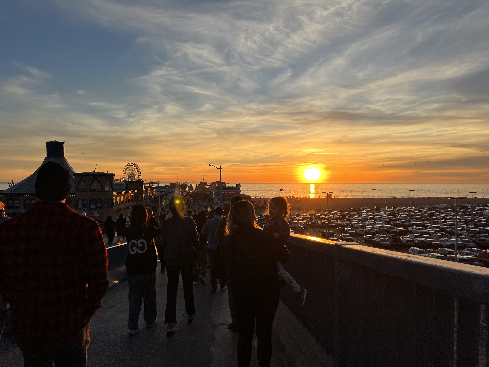
Walking to the pier

Tacos on the beach

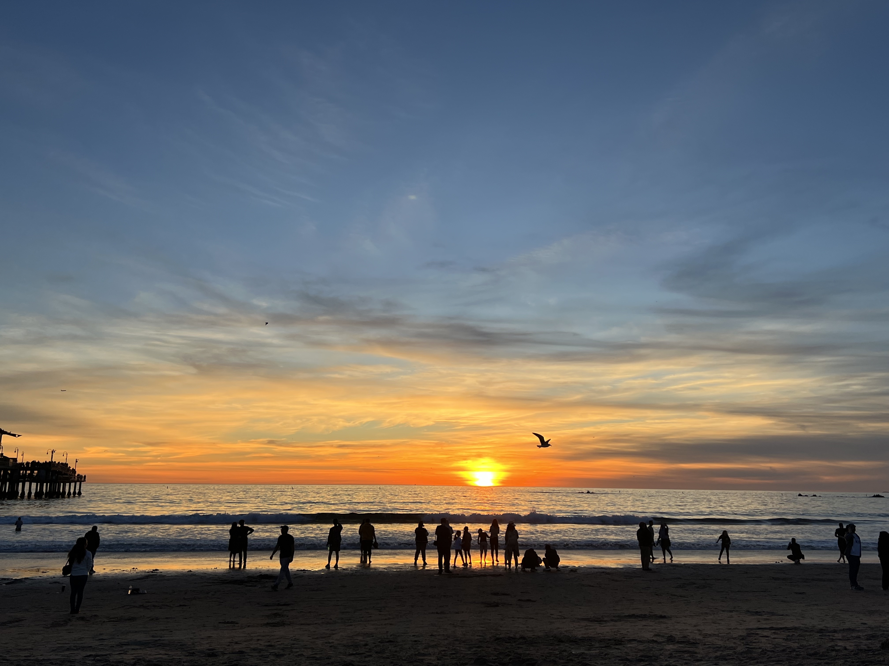
Sunset across the ocean

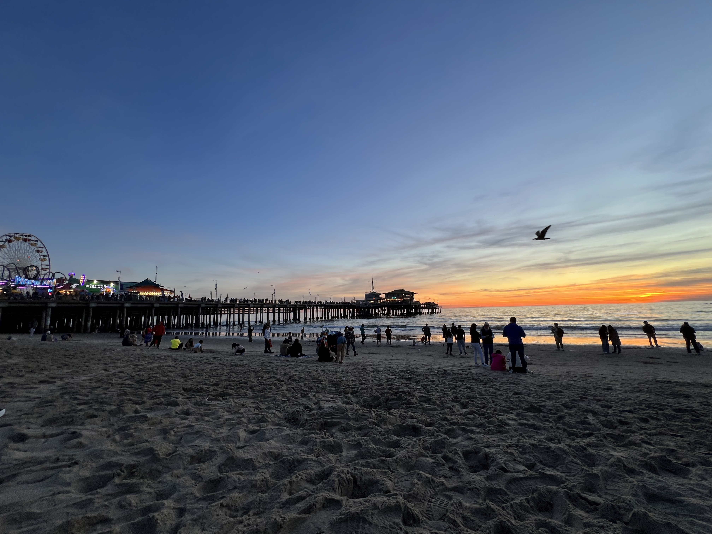
The pier

[Video](https://youtu.be/f1WSSYzchX0?si=puikvTz5-5LNqe-N) of walking to Santa Monica Pier at sunset

[Video](https://youtu.be/hgm-Dc5btlA?si=rZATV0HqXm3hNext) of the Santa Monica beach at sunset

[**back to top**](#table-of-contents)

## Monday

### Republique

On my way to the Grammy Museum, I stopped at [République](https://republiquela.com/) again for breakfast. I regretted that I hadn't ordered Shrimp and Grits (anson mills grits, calabrian chilies, pork belly sausage, hooks cheddar, fried egg) on Saturday, then realized that dish is only served at weekend brunch and wasn't available on a Monday. I will have to go back sometime and try it. 

I did have some absolutely incredible tasting granola. It was beautifully presented, and although some of the fruit was unfamiliar to me, it was bursting with flavor, and definitely in the running for the most delicious breakfast that I have ever eaten. 

Granola: straus organic yogurt, farmer’s market fruit, wildflower honey

[**back to top**](#table-of-contents)

### The Grammy Museum

[The Grammy Museum](https://grammymuseum.org/) was small, but fun. 

As suggested, I started on the third floor with the temporary Hip-Hop America exhibit. The exhibit was packed with memorabilia from Tupak Shakur, Flava Flav, Shock G., LL Cool J, Run-DMC, Grandmaster Flash, Wyclef Jean, Eminem, MCLite, Ceelo Green, Chuck D, and among many others.

My favorite part of the museum was the impressive collection of Michael Jackson memorabilia on the second floor, including an autographed Thriller jacket. 

The museum also had temporary Shakira and The Roxy exhibits. 

A portion of the Michael Jackson collection, including autographed Thriller jacket

Thriller Album of the Year nomination

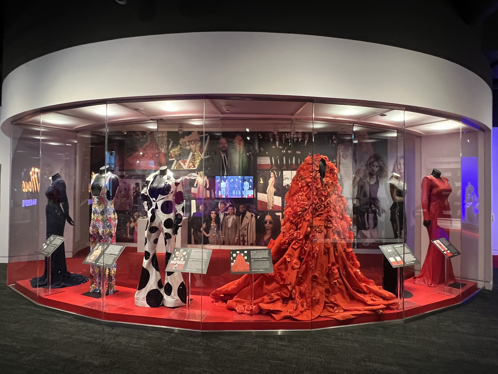
Grammy outfits worn by Taylor Swift, Harry Styles, Shania Twain, Lizzo, Olivia Rodrigo, and Samara Joy

[**back to top**](#table-of-contents)

### The Cecil Hotel

I have been fascinated by true crime going back to childhood, when I started watching [48 Hours](https://www.cbsnews.com/48-hours/full-episodes/), my all-time favorite show. 

While I was walking from the Grammy Museum to the to City Hall Observatory Deck, I stopped at Hotel Cecil along the way. 

Hotel Cecil (a.k.a "Hotel Death") was the subject of a Netflix documentary called [Crime Scene: The Vanishing at the Cecil Hotel](https://www.netflix.com/title/81183727). The documentary focused on the case of [Elisa Lam](https://en.wikipedia.org/wiki/List_of_deaths_and_violence_at_the_Cecil_Hotel), a Canadian student suffering from bi-polar disease who drowned in a water tank on the roof. Members of the public crowd-sourced an investigation into what happened to Elisa. The hotel has a long history of murder, suicide, and unexplained deaths. In a strange twist, Richard Ramirez, a serial killer profiled in another Netflix documentary [Night Stalker](https://www.netflix.com/title/81025701), stayed at Hotel Cecil. 

The hotel is shuttered with a "private property" sign on one door. There were a few people nearby. Not sure if they were workers or loitering.

The infamous water tanks where Elisa Lam drowned... it was speculated that she might have taken the stairs on the front of the hotel to the roof.

[Video](https://youtu.be/4Jyj94ut0Mk?si=Gd6toD3jRr4On6tR) of the Hotel Cecil

[**back to top**](#table-of-contents)

### Downtown Los Angeles

While I was walking from the Grammy Museum to the to City Hall Observatory Deck, I walked to the edge of [Skid Row](https://en.wikipedia.org/wiki/Skid_Row,_Los_Angeles). Having heard of Skid Row for years, I wanted to see it for myself. I walked by barbed wire, sidewalk tent encampments, homeless, and a mission providing social services. 

Strangely, Skid Row is next to the Toy and Fashion Districts. I can't get over the extreme opulence and poverty co-existing across Los Angeles. 

The homelessness in Los Angeles was a sad reality. A local told me it increased greatly due to the pandemic.

[**back to top**](#table-of-contents)

### Los Angeles City Hall Observation Deck

I heard that the Los Angeles City Hall Observation Deck is one of the city's best kept secrets, so I had to go. The building architecture was more fancy-schmancy than I expected. The observation deck triggered my fear of heights, so I didn't stay long out there, but it was a great view!

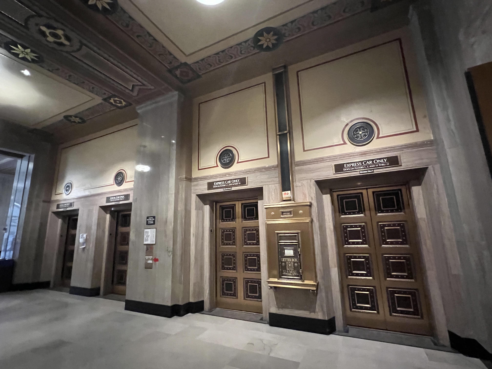
Fancy schmancy

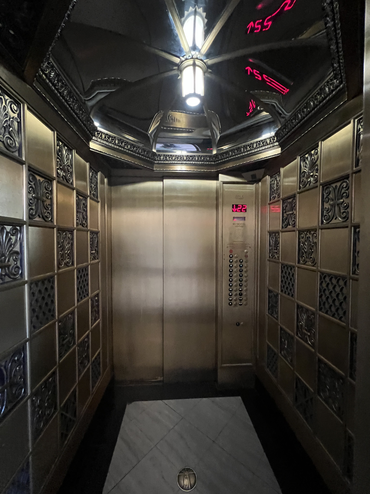
Riding in style

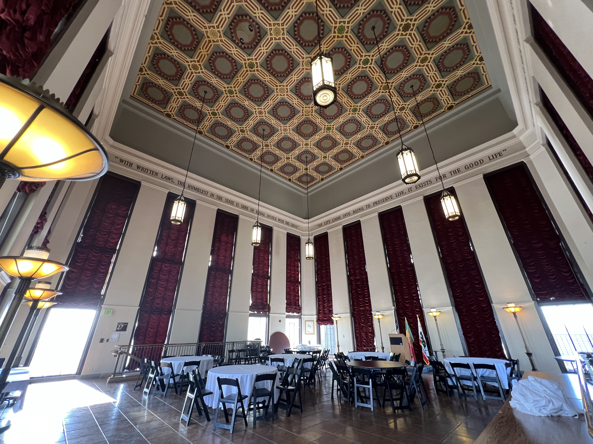
This banquet room has doors that lead out to the observation deck. 

A view from one of the four sides

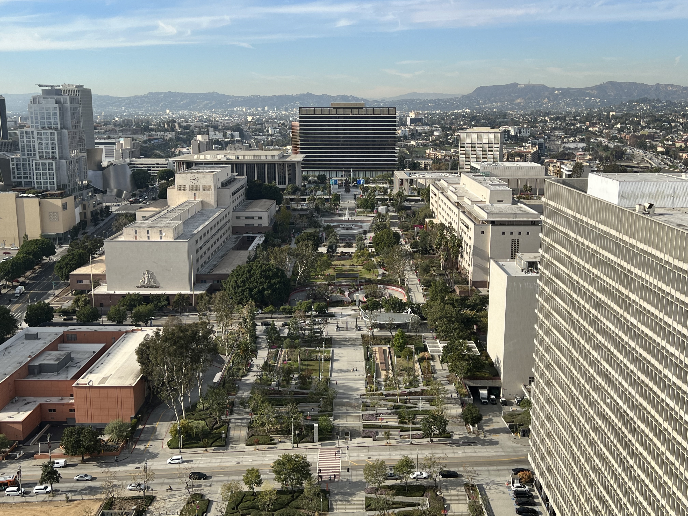
A view from one of the four sides

[Video]([https://youtu.be/mGme3_W_BQc?si=xZ_PfOAzYDDktxUF) of the view from the City Hall Observation Deck

[**back to top**](#table-of-contents)

### Bruno's Ristorante Italiano

After a few failed Google searches for restaurants in the area, I stumbled upon the absolute gem [Bruno's Ristorante Italiano](https://brunossantamonica.com/)

Oh boy, I wish I lived nearby so that I could eat there regularly. The fettucchine alfredo was the best that I've ever tasted. It arrived at the table fresh, hot, and authentic, with a generous half loaf of bread. I sat on the patio. The weather was perfect with a view of the pier. The waitstaff was kind and efficient. I returned before the trip was over. 

Fettuccine Alfredo with chicken... so good!

[**back to top**](#table-of-contents)

## Tuesday

### Universal Theme Park

Although I wanted to take the [Universal Studios Tour](https://www.universalstudioshollywood.com/web/en/us/things-to-do/rides-and-attractions/the-world-famous-studio-tour), I was irked that I would have to buy an entire [Universal Theme Park](https://www.universalstudioshollywood.com/web/en/us) ticket to take it. After multiple people told me how fun the theme park is including a Lyft driver who said it's the best, because you are "in the movies," I decided to go. I know what she means now that I've experienced the incredible, immersive, 3-D experiences that included having water splashed on you. Anyhow, it's not everyday that you have the chance to visit a theme park like that. 

I guess I got my money's worth for the studio tour alone. I went twice... riding on either side of the cart to get a good look at everything. 

Having been an [Alfred Hitchcock](https://en.wikipedia.org/wiki/Alfred_Hitchcock) fan since I was a kid (I had probably read every [Alfred Hitchcock Presents](https://en.wikipedia.org/wiki/Alfred_Hitchcock_Presents) book at the Fredonia Public Library while I was still in grade school), I really enjoyed seeing the Bates Motel and mother's house from [Psycho](https://en.wikipedia.org/wiki/Psycho_(1960_film)).

I walked most of the park. It was fun, but geared more toward kids. 

[Universal CityWalk](https://www.universalstudioshollywood.com/web/en/us/things-to-do/lands/citywalk)

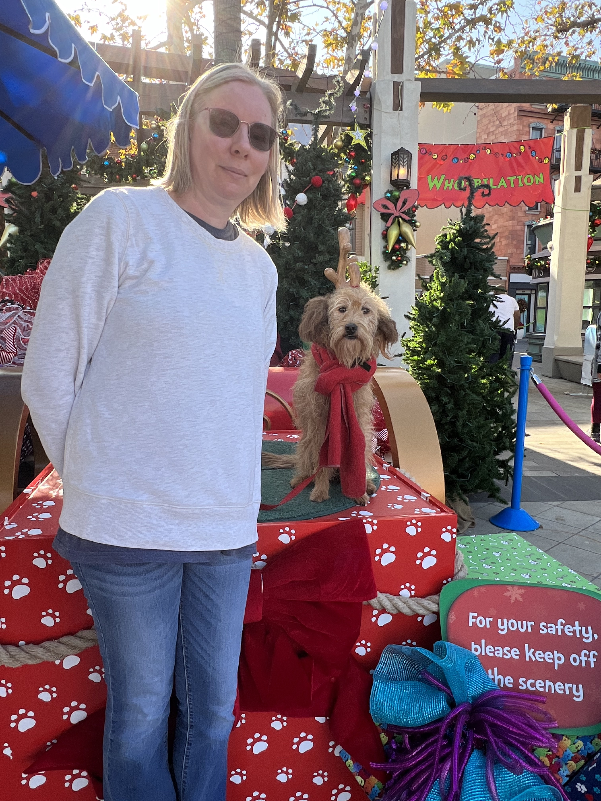
Finally spotted a celebrity and even got a pic. Here I am with "Max" from The Grinch.

Bates Motel from Psycho

Mother's house from Psycho

[Video](https://youtu.be/9uv5BZtSHNA?si=R2pd8kGSKy9brRnG) of the Universal sign

[Video](https://youtu.be/d3wERBCZHEM?si=YHK-vpGaG7TKclwF) of 3-D King King experience, designed by Peter Jackson and team!

[Video](https://youtu.be/evZHAcfSnqw?si=B279b284H-g0lZDn) of the Jaws experience!

[Video](https://youtu.be/VVTMQafABCA?si=Q2x-n0jO9UIFyq1J) of Norman Bates

[Video](https://youtu.be/402GcUXZ01c?si=HJ51z3y9jCnwu-Ti) of "Wisteria Lane"

[Video](https://youtu.be/r5AzrhSoNRo?si=NIepFiPXdL0puQB2) of a simulated flood

<!--
https://www.universalstudioshollywood.com/web/en/us/things-to-do/lands/the-wizarding-world-of-harry-potter
https://www.universalstudioshollywood.com/web/en/us/things-to-do/rides-and-attractions/king-kong-360-3-d
https://www.universalstudioshollywood.com/web/en/us/things-to-do/rides-and-attractions/fast-furious-supercharged
-->

[**back to top**](#table-of-contents)

### The Griffith Observatory

Although [The Griffith Observatory](https://griffithobservatory.org/) museum was much smaller than I expected, the building was beautiful and had an amazing view. 

Entrance hall which includes a [Foucault Pendulum](https://griffithobservatory.org/exhibits/w-m-keck-foundation-central-rotunda/foucault-pendulum/)

What a view...

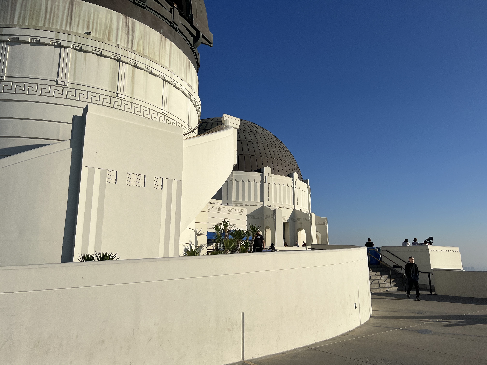
Beautiful architecture...

Multiple Lyft drivers told me the view is "spectacular" after dark, but frankly, I was too tired to stay that long. I will go back sometime. 

[Video](https://youtu.be/WxTooLaosq4?si=ZJENLG-pFEtw86m8) riding through the Hollywood Hills to The Griffith Observatory

[Video](https://youtu.be/hlTgWcAXSXk?si=075mQ_nmLtIOpH2g) of the view around The Griffith Observatory

[Video](https://youtu.be/_nZQzYq1Pnc?si=U7bHzHmFENE5ZAZP) of the Foucault Pendulum

[**back to top**](#table-of-contents)

### Comedy in English

That night, I attended a comedy show for the first time. It was called [Comedy in English](https://www.facebook.com/Comineng/) and features comedians who have appeared on The Tonight Show, Conan, Comedy Central, and Netflix. 

There were awkward, confrontational jokes, excruciating silences, and big laughs. What a raw exercise!

The comedian before him was scream-y... this one was quiet and thoughtful. I thought he'd bomb, but he didn't! 

[**back to top**](#table-of-contents)

## Wednesday

### Hollywood Walk of Fame

Before the celebrity homes bus tour, I walked around Hollywood Boulevard again. I attempted to go to the [Chaplin-Keaton-Lloyd Alley](https://www.atlasobscura.com/places/chaplin-keaton-lloyd-alley) which I read about on the wonderful Atlas Obscura website, but it was closed off. 

Alfred Hitchcock's star

Hollywood Boulevard was closed to cars due to the [Rebel Moon](https://en.wikipedia.org/wiki/Rebel_Moon) Premier

[Video](https://youtu.be/owiHq5D2QRU?si=60DeIfk0kEvQhF4b) of the Rebel Moon Premier set up

[**back to top**](#table-of-contents)

### Celebrity Homes Bus Tour

I went on a [Celebrity Homes Bus Tour](http://hollywoodbustours.com/), and it was an absolute blast. I’ve never taken a bus tour like it before. I loved every minute. The tour guide Mark was so fun and knew all of the famous spots. We drove all around the Hollywood Hills and Bel Air looking at celebrity homes, through Beverly Hills, Rodeo Drive, West Hollywood, Sunset Strip, and Hollywood. Although I couldn't verify the authenticity of every home afterward, I believe that Mark knew his stuff. 

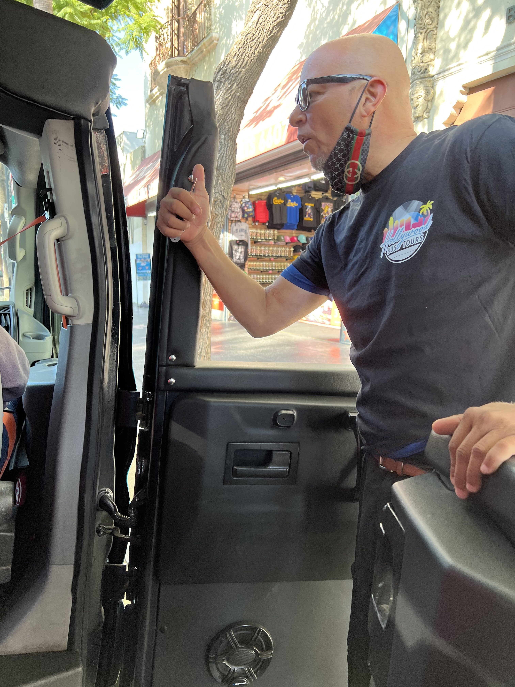
Our tour guide Mark
 

Pretty Woman balcony. Las Palmas Hotel, 1738 N Las Palmas Ave, Los Angeles, CA 90028

Jack Nicholson's house... that's a tennis court on stilts! 

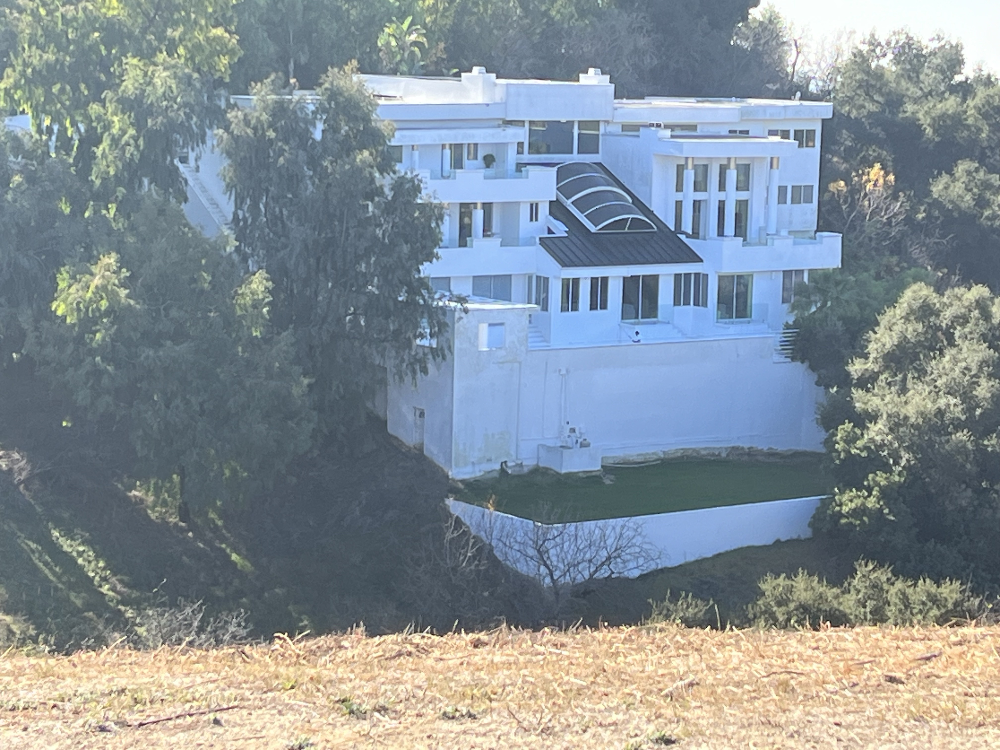
Leonardo DiCaprio's house

[Video](https://youtu.be/CetaKXxeulU?si=-wciRXebAL2qQ9uP) of bus stopping for Hollywood Sign

[Video](https://youtu.be/52_T3K6Fc7c?si=DuYZs3tEoSCWRRSa) driving past homes in Beverly Hills

[Video](https://youtu.be/idbC9zhvkxk?si=yWPyfS_X_hJY86N6) of Rodeo Drive, part 1

[Video](https://youtu.be/m5H2epDZf4Y?si=e9AJ9xj-U9jtIRVL) of Rodeo Drive, part 2 

[**back to top**](#table-of-contents)

### Rodeo Drive

After the tour ended, I went back to Rodeo Drive and walked down the entire street taking pics. 

Dior

Valentino

Harry Winston

[Video](https://youtu.be/aPwa4OlnCP0?si=P2X4uJ25YaVcFLYy) of Rodeo Drive Giorgio Armani storefront

[**back to top**](#table-of-contents)

### Via Alloro

While I was on the celebrity home bus tour, we drove around Beverly Hills. As we drove past a restauraunt named [Via Alloro](https://www.viaalloro.com/) just off of Rodeo Drive, the tour guide said it's a major celebrity hotspot and that he'd seen Steven Spielberg there, among others. Someone on the bus asked if you had to be dressed up to go in. The tour guide said no, and that he'd had passengers literally call while on the bus and make a reservation. 

After taking pics on Rodeo Drive, I decided to eat at Via Alloro. I knew if I didn't, I'd regret that I hadn't taken the opportunity to "rub shoulders" with the stars. 

The prices were surprisingly reasonable and the food was delicious. It felt like a surprisingly normal experience. The waiter told me that they do have "too many" celebs around. Sometimes, everywhere you look. A quick [google search](https://www.google.com/search?q=via+alloro+daily+mail&sca_esv=595179528&sxsrf=AM9HkKl7xam2HHlNbSzt-XLzlojjw9_Jug:1704229408712&source=lnms&sa=X&ved=2ahUKEwjvmpakzb-DAxWpkmoFHQsSDt0Q0pQJegQIBhAC&biw=1440&bih=699&dpr=2#ip=1) reveals some of the many celebs. 

I had the Fettuccini Boscaiola. Having never heard of this dish, I wasn't quite sure what it would be like, but I thought it sounded good. It was delicious! 

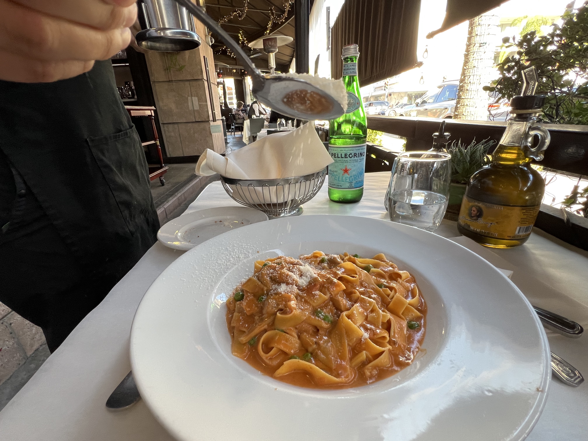
Fettuccini Boscaiola: homemade fettuccini pasta with meat sauce, cream, green peas, mushrooms for $26.50

[**back to top**](#table-of-contents)

### Bruno's Ristorante Italiano

That night, I couldn't resist returning to [Bruno's Ristorante Italiano](https://brunossantamonica.com/) for another meal. It was another hit. 

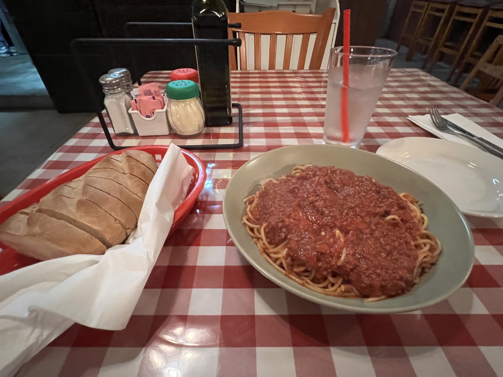
Spaghetti with meat sauce

I'll be back. 

[**back to top**](#table-of-contents)

## Thursday

### Ice at Santa Monica 

If I hadn't already done enough... I went ice skating for the first time! 

I went to [Ice at Santa Monica](https://iceatsantamonica.com/). 

It was fun, and I skated for a good 30 minutes, but when another skater wiped out badly, I decided that I'd pushed my luck long enough and stopped. The rink workers said the skates weren't great anyway, because they provided very little support. Nevertheless, I'm glad I tried it, and perhaps I'll try again sometime.

Santa Monica's Ice skating rink

[Video](https://youtu.be/udvcou-cgV0?si=NXMn2PaAy2Vt917-) of ice skating

[**back to top**](#table-of-contents)

### Mel's Drive-In

I saw a [Mel's Drive-in](https://melsdrive-in.com/) at Universal Studios Theme Park and another one just off Hollywood Boulevard. Because I kept hearing about it so much, I decided to eat at one in Santa Monica. I later realized that I had Mel's Drive-in mixed up with Mel's Diner. Mel's Drive-in was made famous by the movie [American Graffiti](https://melsdrive-in.com/about/#story). [Mel's Diner](https://www.alicehyatt.com/) was a television show. Haha. Nevertheless, the chocolate milkshake was the best that I've ever had. 

Mel's Drive-in counter

The best chocolate milkshake that I've ever had. 

[Video](https://youtu.be/jTq31Q2034Q?si=NsgiEQ77am7aedDf) at the counter in Mel's Drive-in

[**back to top**](#table-of-contents)

### End of Santa Monica Pier at Sunset

I made it back to Santa Monica Beach for one last sunset. It was a doozy. 

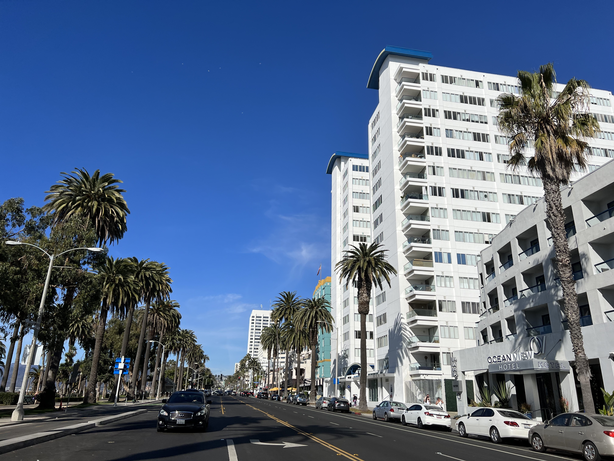
Ocean Avenue

Love the strange vintage look of this beach landscape. It was facing the sunset.

The sun setting beyond the end of the pier

<!--
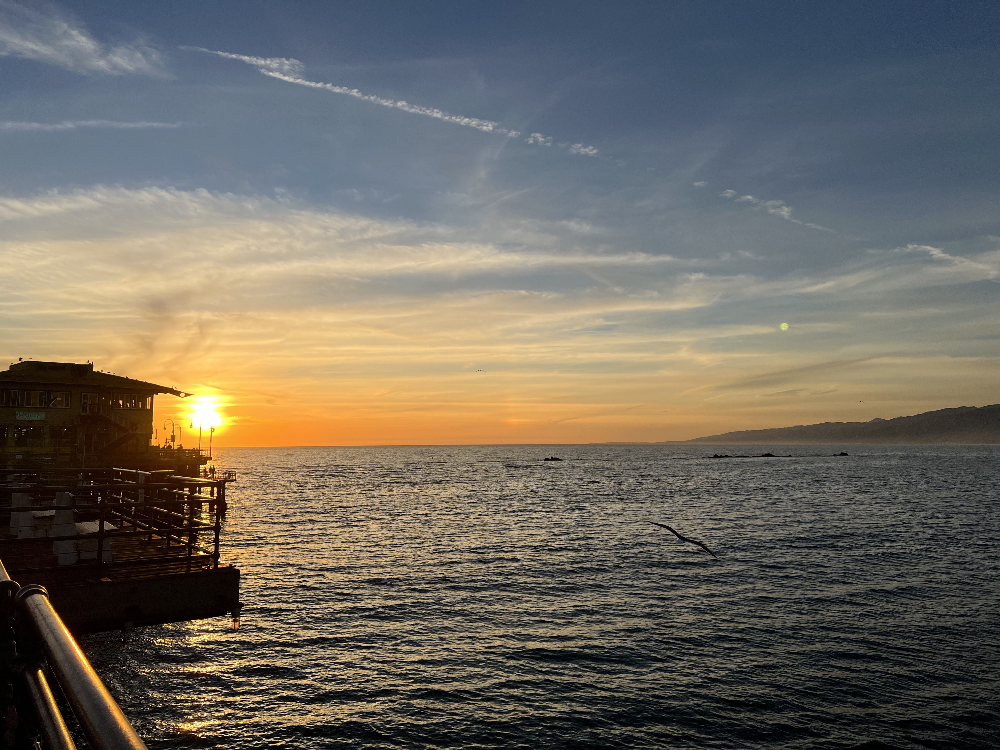
Gorgeous...
-->

Venturing to the end of the pier for sunset...

The rippling waves were like abstract art...

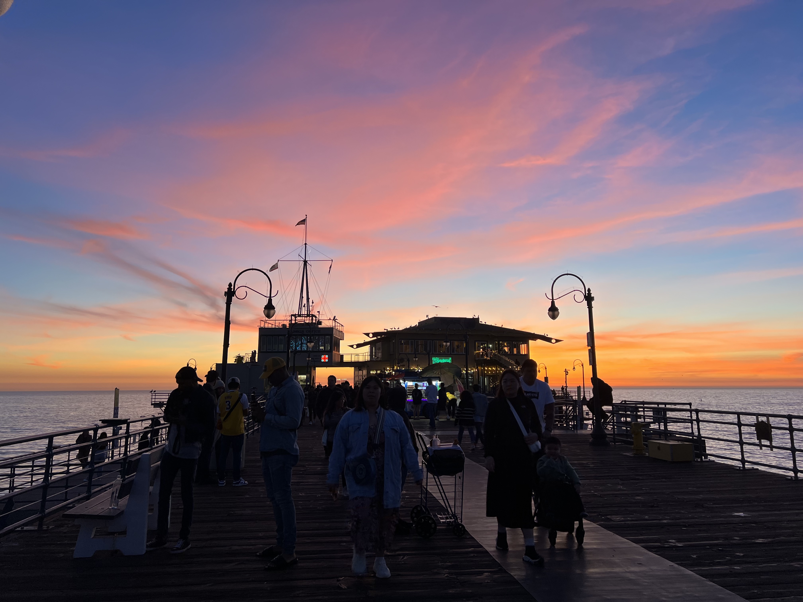
The end of the pier... wow!

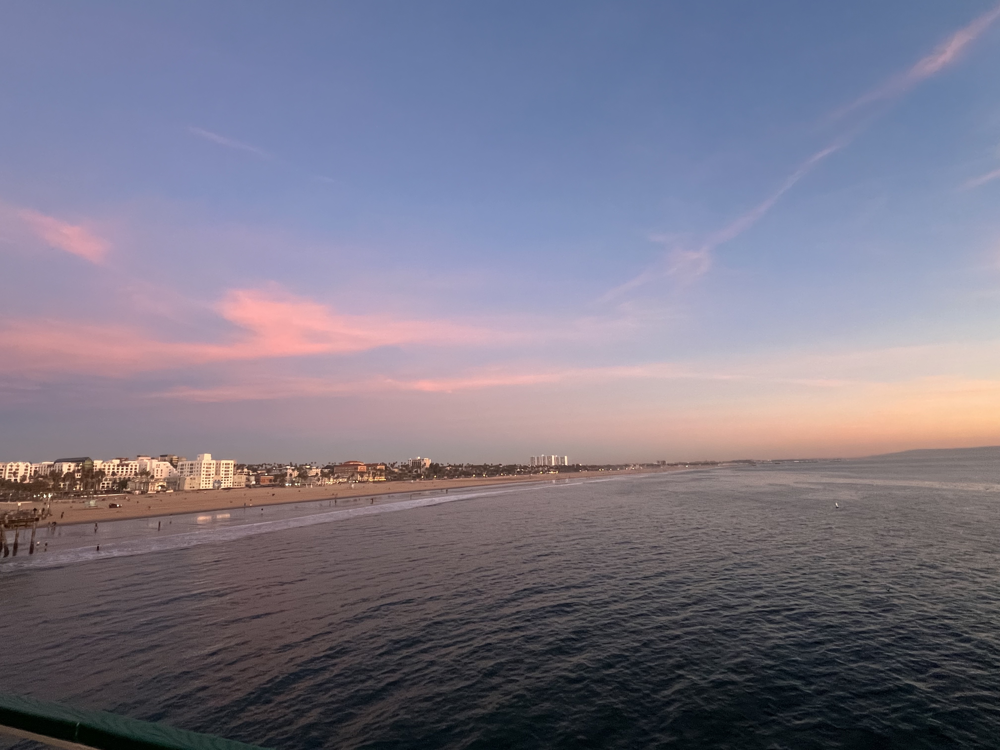
Pink cityscape

People watching

[Video](https://youtu.be/dPPWp-k3kIE?si=mELmyVOv6elfcVWr) of Santa Monica Pier at sunset

[Video](https://youtu.be/NK2FCOE9ZGA?si=dJTLWqB0KCtadn7V) of Santa Monica Pier at sunset

[Video](https://youtu.be/KxvcWh8gzg4?si=kVukmFdxZy3GXXXA) of the end of the pier at sunset

[Video](https://youtu.be/bFZlSN-wjWg?si=KRM_pPzfLflQLAJX) of Santa Monica Beach at sunset

[Video](https://youtu.be/xyXs-FP-3n4?si=UgdO0TWjZ5fcvAYR) of ferris wheel with Santa Claus

[**back to top**](#table-of-contents)

### Santa Monica Pier Carousel

Santa Monica Pier Carousel... Paul Newman worked there in the Sting. I rode it!

[Video](https://youtu.be/TVL2gUfgNGk?si=CHgmEYUToBc9Eerr) riding Paul Newman's carousel :)

[**back to top**](#table-of-contents)

### Santa Monica Promenade

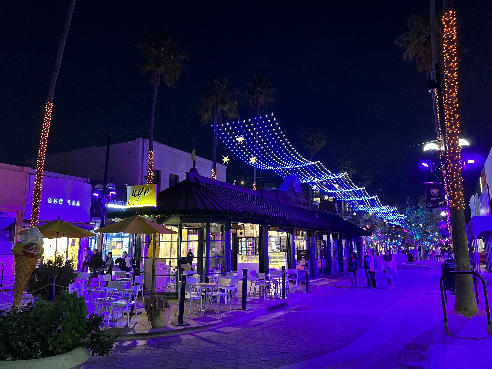
Christmas decorations

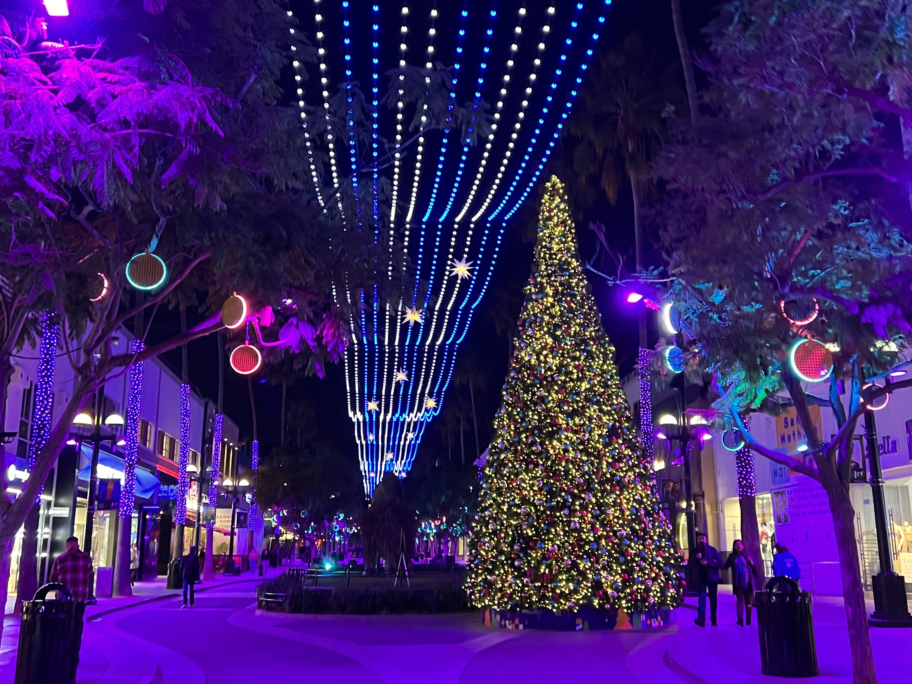
Christmas decorations

[**back to top**](#table-of-contents)

## Friday

### Back to Kansas for Christmas

Bye bye, LA… 

Santa Monica, Venice, and Playa Del Rey Beaches, I believe

I made it home from Los Angeles with one last momento: bronchitis. I believe it was caused by the smog. Walking for miles over nine days and riding around in an open air bus for two hours couldn't have helped. 

[**back to top**](#table-of-contents)

## Takeaways

I love San Diego's thriving Little Italy. I love the plaza, with its beautiful, flowing fountain, live music, open air dining, and great restaurants surrounding it. I love the sight and sound of people enjoying the good things in life. I thought Santa Monica would be like this, but it wasn't. I was shocked by the isolated, distributed feeling of Los Angeles. I did not feel a real sense of community anywhere. 

Never have I been to a place where there is so much poverty and opulence co-existing. Never have I been to a place where there is so much pretending. People pretending by living above their means. The entertainment industry is pretending too. The things that look magical on screen look more ordinary in real life than I expected. 

I'm not completely sure that I liked Los Angeles... yet, I can't wait to go back. Haha. 

For one thing, I'd like to go back for the food. I learned from my friend Wooyong that I should research the food before I arrive. Next time, I want to go to the great restaurants, not just restaurants that I find on the spur of the moment. 

Things to do next time:
* Plan in advance to go to great restaurants
* Take the Paramount Studio Tour (it was one too many studio tours for this trip)
* Go to The Griffith Observatory at night
* Take the scenic Coast Starlight train
* Visit Redondo Beach and Santa Barbara

[**back to top**](#table-of-contents)

## Warner Brothers Studio Tour versus Universal Studios Tour

The Warner Brothers tour guides immediately established their tour as "better" than Universal's. Although it was lighthearted banter, I did detect a real hint of competition. 

### What Warner Brothers Had Going For It

The Warner Brothers tour was a personalized, small group experience. At the start of the tour, the tour guide asked us which Warner Brothers shows or movies we were fans of so that the tour could be tailored to our interests. During the guided part of the tour, we were all on one cart in close proximity to the tour guide and could ask questions as we went. We get off several times to tour city lots, a sound stage, residential street, and house. 

There were multiple photo ops, including the Friends set, Big Bang Theory set, and Friends fountain. 

Before and after the guided part of the tour, we had the opportunity to walk at our own pace through exhibits packed with incredible costumes, props, and immersive experiences. 

I spent 3 hours on the Warner Brothers tour. 

[**back to top**](#table-of-contents)

### What Universal Studios Tour Had Going For It

In contrast, the Universal Studios tour consisted of one large group riding on a group of connected carts with a pre-recorded commentary by Jimmy Fallon. Although tour guides had the freedom to provide their own additional commentary, group members did not have the opportunity to ask questions or get off the cart to take a closer look. 

However, the Universal Studios tour did include some very iconic backlots, and nothing at Warner Brothers compared to Universal's immersive, 3-D experiences. 

I spent approximately 45 minutes on the Universal Studios Tour.  

[**back to top**](#table-of-contents)
