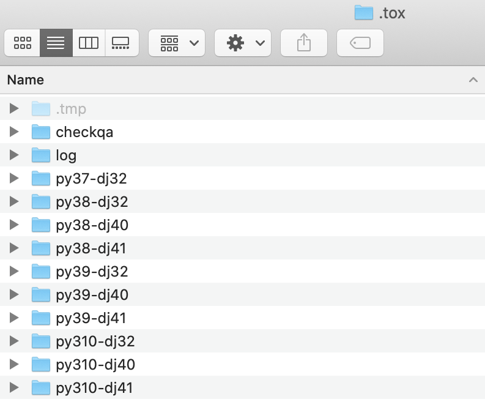
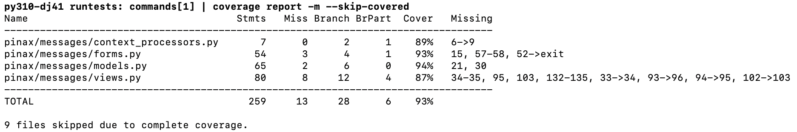

# Pinax Release Tutorial

Pinax has been a popular group of projects, apps, and themes for around 15 years and still has many users. 

A request was made recently to add support for Django 4.0 and 4.1. I decided it's time to create a new Pinax release plan. I've also created this tutorial to teach others how Pinax releases are done. Let's get started! 

## TL;DR

* You will need to be able to install and access multiple Python interpreters locally
* Determine which Python and Django versions to use
* Using these Python and Django versions, create updated configurations for the CircleCI `config.yml` and `tox.ini` files
* Clone a Pinax App repo locally, cd, and create a new branch
* Update the CircleCI `config.yml` and `tox.ini` files in that Pinax App directory with the new configurations
* Run tox
* Fix the errors 
* When tox is successful, push your changes to GitHub
* Open a pull request
* When all of the updates are made to a Pinax App, the app release will be tagged
* Then, a package will be created and published to PyPI

## Background

Pinax includes a group of Django projects called [Pinax Starter Projects](https://github.com/pinax/pinax-starter-projects) that can be installed using [Pinax CLI](https://github.com/pinax/pinax-cli). These Pinax Starter Projects include relevant Pinax Apps that can be found in the [Pinax GitHub organization](https://github.com/pinax) or on PyPI via [Pinax keyword search](https://pypi.org/search/?q=pinax). 

This tutorial will focus on app release. 

## Required Setup

In order to test code locally and make the updates required for the release, you will need to be able to access a Python interpreter for every version used in the release. The Pinax way of doing this is to install [pyenv](https://github.com/pyenv/pyenv) on a MacBook. This will enable you to install multiple versions of Python on your computer and make them globally available using the command: 

```bash
$ pyenv global 3.10.0 3.9.0 3.8.0 3.7.0
```

## Release Plan

I create a release plan for each release. This serves several purposes. 

* It provides instructions for how to complete the release as it happens
* It enables newcomers to contribute more easily to a release
* It serves as a reference for future releases

Here is the WIP [Pinax 22.12 Release Plan](https://github.com/pinax/pinax/wiki/Pinax-22.12-Release-Plan/).

## Why Do a New Release? 

Pinax is based on the [Django](https://www.djangoproject.com/) framework, which is based on the [Python](https://www.python.org/) programming language. Like other software, Python and Django evolve over time. Features are added, bugs are fixed, and security flaws are patched. New releases of Python and Django are then published. By incorporating new versions of Python and Django into Pinax, Pinax can benefit from these new features, bug fixes, and security patches. This is done through a release. Pinax releases can also include new features, bug fixes, and security patches. 

## Knowing Which Versions of Python and Django to Include

We will want to use Python and Django versions that are being actively supported. For one thing, unsupported versions of Python and Django no longer receive security patches. It's best to drop these versions and add new, supported versions. 

In order to determine which versions of Python and Django are being actively supported, check out the [Python downloads](https://www.python.org/downloads/) and [Django downloads](https://www.djangoproject.com/download/) pages.

Current Python support schedule


Current Django support schedule


Not all versions of Python and Django are compatible together. In order to determine which Python and Django versions are compatible, check out the "[What Python version can I use with Django?](https://docs.djangoproject.com/en/4.1/faq/install/#what-python-version-can-i-use-with-django)" section of the Django FAQs. This will help us create the test matrix and release documentation. 

Python and Django compatibility


We now know that the Python 3.7, 3.8, 3.9, 3.10 and Django 3.2, 40, and 4.1 are supported. 

Python 3.8, 3.9, and 3.10 are compatible with all versions of Django. 
    
Python 3.7 is not compatible with Django 4.0 or 4.1. 
    
## Test Matrix Configurations

Once we know which Python and Django versions to use, we can create updated configurations for the CircleCI `config.yml` and `tox.ini` files that will be in each Pinax App repo. Although CircleCI and tox can be used together, it is primarily tox that we will be interested in for this tutorial, because it's the tool we will use to update the code locally.

In addition to testing against Python and Django, Pinax tox configuration includes a few other tools to maintain code quality. 

These tools are:
* [Flake8](https://flake8.pycqa.org/en/latest/): check your codebase style and complexity
* [Black](https://black.readthedocs.io/) (being added in this release): check your codebase style and reformat in place
* [isort](https://pycqa.github.io/isort/): sort Django imports
* [Coverage](https://coverage.readthedocs.io/): measures the percentage of code per file that is covered by tests

Invariably, these other tools will have had new releases of their own between Pinax releases. As a result, additional changes will need to be made to the configuration. For some examples, check out the WIP [Pinax 22.12 Release Plan](https://github.com/pinax/pinax/wiki/Pinax-22.12-Release-Plan/).

## Running the Test Matrix Locally Using tox

Once the configurations are documented, we will be able to clone a Pinax App repo, update its CircleCI `config.yml` and `tox.ini` files, run tox, then fix the errors that result from the incompatibility between the existing code and the new Python and Django versions we are testing against. 

Clone the repo using the command line tool of your choice

```bash
$ git clone https://github.com/pinax/pinax-messages
```

Change directory

```bash
$ cd pinax-messages
```

Run the tox test matrix using the Makefile

```bash
$ Make
```

Alternatively, run tox directly

```bash
$ tox
```

## tox Test Environments

Pinax tox configuration includes several test environments that it will run. 

```tox
[tox]
envlist =
    checkqa,
    py{37}-dj{32}
    py{38, 39, 310}-dj{32, 40, 41}
```

The first one, called `checkqa`, runs the formatting tools Flake8, Black, and isort. 

A special `[testenv:checkqa]` configuration specifies which version of each tool tox should use and the commands needed to run each one. Instead of running the tools ourselves manually via the command line, tox will run them as it executes. 

Here, it's specified that Flake8 and Black will run in the `pinax` directory. The isort `--check-only` and `--diff` flags indicate proposed changes should be outputted in the terminal, rather than the files being modified. The isort `--settings-path` is explicitly set. For more information about isort options, see the [isort Configuration Options page](https://pycqa.github.io/isort/docs/configuration/options.html). 

```tox
[testenv:checkqa]
commands =
    flake8 pinax
    isort --check-only --diff pinax --settings-path tox.ini
    black pinax
deps =
    flake8 == 5.0.4
    flake8-quotes == 3.3.1
    isort == 5.10.01
    black == 22.8.0
```

Separate `[flake8]` and `[isort]` configurations document choices specific to Pinax such as which tool formatting rules to ignore. 

Here, it's specified that tox should ignore the default [Flake8 rules](https://www.flake8rules.com/) that a colon should not have a space before it, that a block comment should have a space before the pound sign and comment, that there is no need for backslashes between brackets, and that a line break should occur before a binary operator. [`max-line-length`](https://flake8.pycqa.org/en/2.5.5/config.html#settings) can be up to 100 characters, rather than the 79 suggested by [PEP 8](https://peps.python.org/pep-0008/). [`max-complexity`](https://flake8.pycqa.org/en/2.5.5/#quickstart) can be up to 10 (more than 10 is believed to be too complex). Migrations files should be excluded from formatting. `inline-quotes` should be double, not single. 

```tox
[flake8]
ignore = E203,E265,E501,W504
max-line-length = 100
max-complexity = 10
exclude = **/*/migrations/*
inline-quotes = double
```

[`multi_line_output`](https://pycqa.github.io/isort/docs/configuration/multi_line_output_modes.html) should be formatted as a vertical hanging indent. 

```tox
[isort]
multi_line_output=3
known_django=django
known_third_party=appconf,pinax
sections=FUTURE,STDLIB,DJANGO,THIRDPARTY,FIRSTPARTY,LOCALFOLDER
include_trailing_comma=True
skip_glob=**/*/migrations/*
```

After `checkqa` is finished running, tox will iterate through each Python/Django combination, creating an environment to test that combination. 

tox environments created within the Pinax App directory `.tox` folder



This will include a coverage report for each combination. 

```tox
[testenv]
passenv = CI CIRCLECI CIRCLE_*
deps =
    coverage==6.5.0
    codecov
    dj32: Django>=3.2,<4.0
    dj40: Django>=4.0,<4.1
    dj41: Django>=4.1,<4.2
    master: https://github.com/django/django/tarball/master
```

Separate `[coverage:run]` and `[coverage:report]` configurations document coverage choices specific to Pinax. 

Here, it is specified that coverage should run in the `pinax` directory. `conf.py`, `tests`, `migrations`, and `admin.py` folders and files should be ignored. 

```tox
[coverage:run]
source = pinax
omit = **/*/conf.py,**/*/tests/*,**/*/migrations/*,**/*/admin.py
branch = true
data_file = .coverage
```

`conf.py`, `tests`, `migrations`, and `admin.py` folders and files should be ignored. The `--show-missing` flag indicates that the report should show the file line numbers missing coverage. 

```tox
[coverage:report]
omit = **/*/conf.py,**/*/tests/*,**/*/migrations/*,**/*/admin.py
exclude_lines =
    coverage: omit
show_missing = True
```

## tox Output

When `checkqa` runs, tox will output any formatting errors in the terminal. 

For each Python/Django combination, tox will output the incompability errors. 

tox will show one error at a time. Fix that error, and rerun tox. 

If needed, refer to the [Django 3.2 release notes](https://docs.djangoproject.com/en/4.1/releases/3.2/), [Django 4.0 release notes](https://docs.djangoproject.com/en/4.0/releases/4.0/#features-removed-in-4-0), and [Django 4.1 release notes](https://docs.djangoproject.com/en/4.1/releases/4.1/) for more info about the changes made in those releases. Google and Stack Overflow can also help. 

To see some example errors, check out the WIP [Pinax 22.12 Release Plan](https://github.com/pinax/pinax/wiki/Pinax-22.12-Release-Plan/).

Once all of the errors are fixed, tox will show all green. 

tox success! :) 


## Coverage Report

For each Python/Django combination, tox will also show a coverage report. The report will show the percentage of coverage for each file. Files with 100% coverage will be ignored.

Example coverage report



## CircleCI

## Tagging and Publishing
