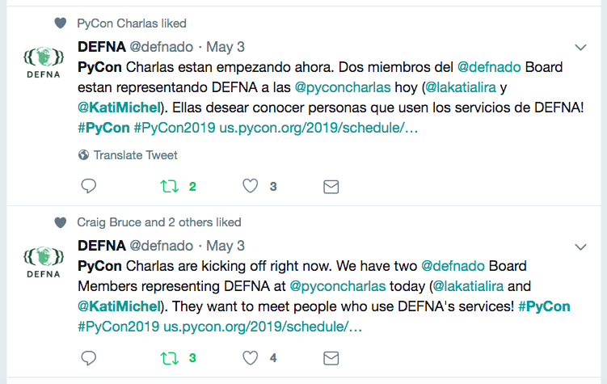
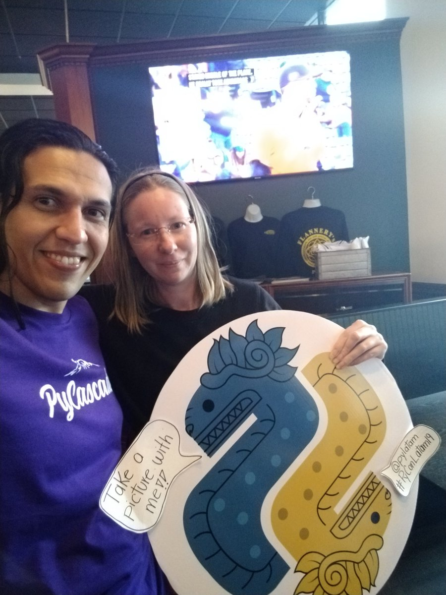

# PyCon US 2019 Recap

Published June 1, 2019

### Description

PyCon US 2019 took place at Huntington Convention Center in downtown Cleveland, Ohio from May 1-10. Eldarion’s Katherine Michel wrote about what it was like to experience PyCon US for the first time!

### Blog Post

Cleveland script sign at Edgewater Park, with a lovely view of downtown Cleveland as a backdrop; photo credit: Katherine Michel

This was my first PyCon and I had a blast! It was one of the most fun and inspiring experiences of my life.

While PyCon 2018 was going on, I regretted not having gone when I realized via Twitter that many of the Pythonistas I had been getting to know were there. I was kicking myself for missing the chance to connect with them. So, I was thrilled to have the opportunity to go to [PyCon US 2019](https://us.pycon.org/2019/).

Perhaps because of my FOMO in 2018, I didn’t want to have any regrets after PyCon US 2019 and I don’t. I both challenged and enjoyed myself to the max. I returned home having made many new friends, (including people I have long admired), learned new things, and found new ideas for [Pinax](https://github.com/pinax), an open source ecosystem of Django starter projects and apps that I help maintain.

### Getting Ready

Even though I didn’t know what to expect at PyCon, I knew there would be more going on than I could do. So ahead of time, I did some prioritizing that helped me make the most of my time, without doing too much:

* I made a schedule of the talks and events that I was most interested in attending.
* I made a list of people with whom I wanted to reconnect or meet for the first time.
* And I chose three sights around Cleveland that were a priority to see.

### It’s Going to Be Great

As people began to tweet that they were on their way to Cleveland, the anticipation began to build. Kushal Das [tweeted](https://twitter.com/KatiMichel/status/1123277599348707328) that SFO was filling up for PyCon, including the BDFL [Guido van Rossum](https://twitter.com/gvanrossum)! I replied, “I’m getting so excited!” I was gobsmacked when Guido then followed me on Twitter. I immediately felt quite welcome and certain that I would have a great PyCon!

My tweet after being followed on Twitter by Guido

### Thursday

I arrived in Cleveland on Thursday, around noon. I headed to the conference floor to register and see what was going on. Quite a few conference-goers were mingling in the hallway. It was an advantage for me that I had gone to smaller, regional Python conferences before PyCon. I immediately saw some friends I’ve made through [DjangoCon US](https://2019.djangocon.us/) and [PyGotham](https://2019.pygotham.org/) and was excited to see them. I also immediately began to see people I had hoped to meet for the first time and chatted with them. The atmosphere was upbeat and everyone was super friendly. A group of us walked to nearby [Mabel’s BBQ](http://www.michaelsymon.com/mabels-bbq). The food was delicious.

When we returned to the convention center, I decided to join the [swag stuffing line](https://us.pycon.org/2019/about/volunteers/#swag). I was surprised to meet Larry Hastings and [Paul Hildebrandt](https://twitter.com/paulhildebrandt) there and began to realize that I was going to stumble across people I admire everywhere I went! While taking a break from swag stuffing, I also chatted with some Bloomberg friends I’d met through PyGotham, including being given an impromptu black hole simulation made using Python by [Pablo Galindo Salgado](https://twitter.com/pyblogsal). Very cool and timely!

The [Opening Reception](https://us.pycon.org/2019/events/opening-reception/) started at 5:30 pm in the [Exhibit Hall](https://us.pycon.org/2019/sponsors/exhibit-hall/). I’d never seen anything quite like the Exhibit Hall in real life, only on television! It was an industrial-size space filled with row after row of booths. Conference-goers ate, networked, and walked around chatting to sponsors and picking up swag. I saw Guido there for the first time and said hello! I was thrilled to meet him. Throughout the week, it became rather normal to see him around, chatting and working. I began to think of him more as a human being, not just a famous tech person.

### Friday

The main conference kicked off on Friday, with an [impressive keynote](https://www.youtube.com/watch?v=ftP5BQh1-YM) by [Dr. Russell Keith-Magee](https://twitter.com/freakboy3742) about Python black swans. I had come across some of the ideas in his talk before. I was amazed at how he wove them into one coherent theme, often using masterful storytelling. I felt inspired to become a better public speaker by finding connections between ideas and improving my storytelling skills.

That morning, I began fulfilling one of my goals as a [DEFNA](https://www.defna.org/) Board Member. DEFNA is the Django Events Foundation North America. We oversee DjangoCon US and facilitate outreach and local events across all of North America, including Canada, the U.S., Mexico, and a number of other countries and territories. I represented DEFNA at the [PyCon Charlas](https://us.pycon.org/2019/hatchery/charlas/). I’m thrilled that throughout the week I got to know many members of the Mexican and Latin American communities who can benefit from DEFNA’s services.

Tweets in Español and English for DEFNA representation at PyCon Charlas

Me and Joel Rivera with the PyLatam Logo

On Friday evening, I attended the [Art of Python](https://us.pycon.org/2019/hatchery/artofpython/), a mini arts festival that is part of the [PyCon Hatchery Program](https://us.pycon.org/2019/hatchery/). The performances were funny and thought-provoking. I’m glad I went.

### Saturday

Saturday kicked off with two very special keynotes by [Shadeed “Sha” Wallace-Stepter](https://restorecal.org/sha/) and [Jessica McKellar](https://twitter.com/jessicamckellar).

Sha told the story of his troubled childhood in San Francisco. He turned to street crime for a feeling of empowerment. It was only after he was sent to prison for 27 years that he realized the same skills that he had used on the street could be channeled into entrepreneurship and tech. After producing a vast body of journalistic content while in prison, his sentence was commuted. Sha said that open source is “love.” Open source accepts people like him. He received a standing ovation. I was proud to see the community embrace someone who could easily be rejected elsewhere.

Jessica McKellar’s keynote was a call to action to the Python community to help break the cycle of incarceration and help former inmates re-integrate. She is a powerful voice for change. You might remember that under Jessica’s leadership as PyCon US Diversity Chair, talk gender diversity [rose from 1% to 40%](https://twitter.com/jessicamckellar/status/737299461563502595) in just a few years. I’m glad that after Jessica’s talk I had the chance to personally thank her for that and also thank [Chris Neugebauer](https://twitter.com/chrisjrn) for making it a priority as a PSF Director to tie [PSF event support to diversity and inclusion targets](https://wiki.python.org/moin/PythonSoftwareFoundation/BoardCandidates2018#christopher-neugebauer).

Later that morning, I spent as much time as I could at the [Maintainer’s Summit](https://us.pycon.org/2019/hatchery/maintainers/). Thanks to my time as Pinax Maintainer and [DjangoCon US](https://2019.djangocon.us/) Website Chair, I felt right at home. I especially enjoyed the table discussion I took part in where we shared our approaches in some of the practical aspects of maintaining projects. Other maintainers and I had faced many of the same challenges. I hope to attend another summit like this sometime.

On Saturday afternoon, even though I hadn’t had time to check out the [Open Spaces](https://us.pycon.org/2019/events/open-spaces/) board, I’m quite pleased to say I ended up at an open space for chocolate! A friend alerted me to the open space as it was going on and of course, as a chocolate lover, I couldn’t resist immediately heading there to sample some.

A selection of chocolate on the table at the Chocolate Open Space; photo credit: Katherine Michel

After the Chocolate Open Space I spent time as a volunteer at the [PyLadies](https://www.pyladies.com/) Booth. I hadn’t realized how many people I would meet as a booth volunteer! It was a lot of fun and I highly recommend it. So many people came up to the booth to pick up stickers, buy t-shirts, ask questions about PyLadies, and inquire about [PyLadies Auction](https://us.pycon.org/2019/events/auction/) tickets. Fortunately and unfortunately, the PyLadies Auction tickets were sold out. Although I hated to turn people away, it was great to see an abundance of support for PyLadies.

Incredibly, I also randomly met one of the original Pinax authors at the PyLadies Booth! It was a pleasure to chat with [Jannis Leidel](https://twitter.com/jezdez) about the early days of Pinax. I have some new insight into the history of the Pinax ecosystem now. He also gave me some input for our next release.

After I was finished at the booth, I attended the PyLadies Auction. The auction took place at 6:30 pm in a ballroom in the Hilton Hotel connected to the Huntington Convention Center. The atmosphere was filled with good will and humor. A highlight was seeing the smile on Guido’s face after a portrait of him went for the highest ever bid. I really appreciate that he proactively supports underrepresented people.

Another highlight of PyCon for me was meeting [Dr. Naomi Ceder](https://twitter.com/NaomiCeder), [Lorena Mesa](https://twitter.com/loooorenanicole), [Jackie Kazil](https://twitter.com/JackieKazil), [Katie Cunningham](https://twitter.com/kcunning), and [Lynn Root](https://twitter.com/roguelynn), all of whom play an important role in the PyLadies Auction and in promoting diversity in the Python community.

The portrait of Guido being carried around by PyLadies; photo credit: Katherine Michel

### Sunday

On Sunday, I attended the [PyLadies Lunch](https://us.pycon.org/2019/events/pyladieslunch/). The lunch was a time to meet in a fun, relaxed atmosphere to network and share common experiences. Throughout the lunch, women went to the front of the room and shared things they had done that they were proud of. Too often, women downplay their accomplishments. This was a time to celebrate ourselves and applaud one another!

After the PyLadies Lunch, I walked from the convention center a few blocks to take a [30 minute self-guided tour of the Terminal Tower Observation Deck](https://www.eventbrite.com/e/terminal-tower-observation-deck-self-guided-tour-tickets-33127241471). When I was researching the sights around Cleveland, I’d had a hunch that I would enjoy seeing the Cleveland skyline from the top of this famous landmark and I did!

Cleveland skyline as seen from the Terminal Tower Observation Deck; photo credit: Katherine Michel

### Development Sprints and More Sight Seeing

The main conference ended on Sunday and the [Development Sprints](https://us.pycon.org/2019/community/sprints/) began on Monday.

After several overcast days, the sun finally came out on Monday morning. Even though I would miss a bit of sprinting, I decided to take advantage of the nice weather and visit one of the sight seeing spots I had chosen, [Edgewater Park](https://www.clevelandmetroparks.com/parks/visit/parks/lakefront-reservation/edgewater-park) along [Lake Erie](https://en.wikipedia.org/wiki/Lake_Erie). Having lived in Kansas most of my life, it’s always a pleasure to enjoy a beach and something I make a priority.

A peaceful scene at Edgewater Park; photo credit: Katherine Michel

Back at the sprints, I spent time in the CPython Sprint. I remember back to the 2016 [PyLadies tweet](https://twitter.com/mariatta/status/737689052736978945) that led [Mariatta](https://twitter.com/mariatta) to become a CPython Core Developer. She's one of my heroes and I love having the chance to see her in person!

Mariatta and I taking a selfie for her self-care Selfie Sprint!

Throughout the week, I had the chance to meet a number of CPython and Django Core Devs for the first time, including [Cheryl Sabella](https://twitter.com/cherylsabella) and [Emily Morehouse-Valcarcel](https://twitter.com/emilyemorehouse). I’m particularly excited to see the rapid progress happening in CPython gender diversity now that it’s a priority.

On my last full day of PyCon, I left the sprints to spend a large part of the day at the [Rock and Roll Hall of Fame Museum](https://www.rockhall.com/). The museum has an incredible collection of rock and roll memorabilia and I highly recommend going, if you get the chance. A few of my favorite items were John Lennon and Paul McCartney’s In My Life handwritten lyrics and Hey Jude descriptive score, Elvis Presley’s gold lamé suit, and Michael Jackson’s Dangerous Tour “Billie Jean” glove.

The Beatles Exhibit at the Rock and Roll Hall of Fame Museum; photo credit; Katherine Michel

On Wednesday, my last evening in Cleveland, being invited to eat at [Flannery’s Irish Pub](https://www.flannerys.com/) with a group of CPython Core Devs and other Pythonistas was a wonderful way to end a magical week.

### It’s Not the End

A few things really surprised me about PyCon.

Firstly, although the crowd at PyCon was huge, it still had the same warm feeling of a small conference for me. Secondly, I had found everyone, including the most accomplished CPython Core Devs and Pythonistas, to be extremely kind and encouraging. I left feeling as inspired as ever. Thirdly, I found myself naturally chatting with the authors and maintainers of code important to Pinax and me. This brought some unexpected clarification to my work. Next time, I will plan ahead to do more of this!

Also, I found the planning I had done in advance of PyCon to have been very helpful. Nevermind that by the end of the week, I had walked and stood so much, I had a blister on my foot to prove it! I made it to the talks and events that were the highest priority for me. I chatted with nearly everyone I had wanted to reconnect with or meet for the first time, plus many more. And I had seen the sights most important to me in Cleveland.

I met so many people that I created a [Twitter list](https://twitter.com/KatiMichel/lists/pycon-us-2019/members) to keep track of as many of them as I could find. I borrowed this idea from Trey Hunner, who also happens to have written a wonderful blog post [How to Have a Great First PyCon](https://treyhunner.com/2018/04/how-to-make-the-most-of-your-first-pycon/). By the way, if I met you at PyCon and you’re not in my Twitter list, please let me know, so I can add you! I want to build on the new relationships I formed and when I attend PyCon in the future, grow my network even more. I’m also making my way through talk videos I missed due to the “hallway track” and finding more insights to apply to our next major Pinax release.

A special thank you to [PyCon Chair Ernest Durbin III](https://twitter.com/EWDurbin) and the many other people who made PyCon US 2019 happen. I can’t wait to go again!

