# PyCon US 2024 Recap

Table of Contents
-----------------

- [Intro](#intro)
- [Wednesday](#wednesday)
    - [Sightseeing Downtown](#sightseeing-downtown)
    - [Allegheny Riverfront](#allegheny-riverfront)
    - [Fig and Ash](#fig-and-ash)
- [Thursday](#thursday)
    - [Noticeable Sightings at the Conference Center](#noticeable-sightings-at-the-conference-center)
    - [Andy Warhol Museum](#andy-warhol-museum)
    - [Heinz History Center](#heinz-history-center)
    - [Duquesne Incline](#duquesne-incline)
    - [Opening Reception at the Expo Hall](#opening-reception-at-the-expo-hall)
    - [Expo Hall Booths Thursday and Friday](#expo-hall-booths-thursday-and-friday)
- [Friday](#friday)
    - [Breakfast](#breakfast)
    - [K. Jay Miller Keynote](#k-jay-miller-keynote)
    - [Hallway Track and Expo Hall](#hallway-track-and-expo-hall)
    - [Photos and Tea](#photos-and-tea)
    - [Condado Tacos](#condado-tacos)
- [Saturday](#saturday)
    - [Breakfast](#breakfast-1)
    - [Simon Willison Keynote](#simon-willison-keynote)
    - [Hallway Track](#hallway-track)
    - [Overcoming GIL with subinterpreters and immutability](#overcoming-gil-with-subinterpreters-and-immutability)
    - [Measuring the performance of CPython](#measuring-the-performance-of-cpython)
    - [PSF Members Luncheon](#psf-members-luncheon)
    - [Profile Pic](#profile-pic)
    - [Juggling](#juggling)
    - [Hallway Track and Expo Hall](#hallway-track-and-expo-hall-1)
    - [PyLadies Auction](#pyladies-auction)
- [Sunday](#sunday)
    - [Posters](#posters)
    - [Ethan Smith](#ethan-smith)
    - [PyLadies Lunch](#pyladies-lunch)
    - [Building a JIT compiler for CPython](#building-a-jit-compiler-for-cpython)
    - [Unlocking the Parallel Universe: Subinterpreters and Free-Threading in Python 3.13](#unlocking-the-parallel-universe-subinterpreters-and-free-threading-in-python-313)
    - [Sync vs. Async in Python: Tools, Benchmarks, and ASGI/WSGI Explained](#sync-vs-async-in-python-tools-benchmarks-and-asgiwsgi-explained)
    - [Sumana Harihareswara Keynote](#sumana-harihareswara-keynote)
    - [Steering Council Updates](#steering-council-updates)
        - [Barry Warsaw: Steering Council Overview](#barry-warsaw-steering-council-overview)
        - [Gregory P. Smith: Steering Council Expenditures Update](#gregory-p-smith-steering-council-expenditures-update)
        - [Emily Morehouse: Councils and Working Groups Update](#emily-morehouse-councils-and-working-groups-update)
        - [Thomas Wouters: Overview of Python 3.13](#thomas-wouters-overview-of-python-313)
        - [Pablo Galindo Salgado: Free-Threading Update (a.k.a. No GIL)](#pablo-galindo-salgado-free-threading-update-aka-no-gil)
    - [Dinner and Ice Cream](#dinner-and-ice-cream)
- [Monday](#monday)
- [Until Next Time](#until-next-time)

## Intro

Disclaimer: the content of this post is a reflection of my career journey and not specific to my work at JPMorgan Chase & Co.

PyCon US 2024 was truly incredible. If you ever have the chance to attend, I highly recommend it. 

I am thankful for and proud of my friend Mariatta (PyCon US Chair) who oversaw it. 

This was my second time attending an in-person PyCon US. My first one was in 2019. I remember being awestruck by the ocean of people. I was glad that I had already attended DjangoCon US and some regional conferences. I recognized some people in the crowd, and it made it feel like a smaller event. 

This time, I was better prepared. I knew what to expect and leveraged my time better, all while having a ton of fun.

üîù [**back to top**](#table-of-contents)

## Wednesday

### Sightseeing Downtown

I arrived on Wednesday, settled in, and immediately took some time to see the [David L. Lawrence Convention Center](https://www.pittsburghcc.com/) and the downtown. 

This was my first time in Pittsburgh, and I didn't know what to expect. Downtown Pittsburgh, with its many steel bridges and brick buildings surrounded by riverfront, was a surprisingly gorgeous scene. 

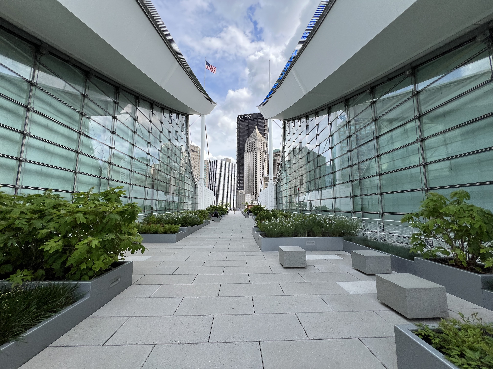
David L. Lawrence Convention Center Rooftop Terrace

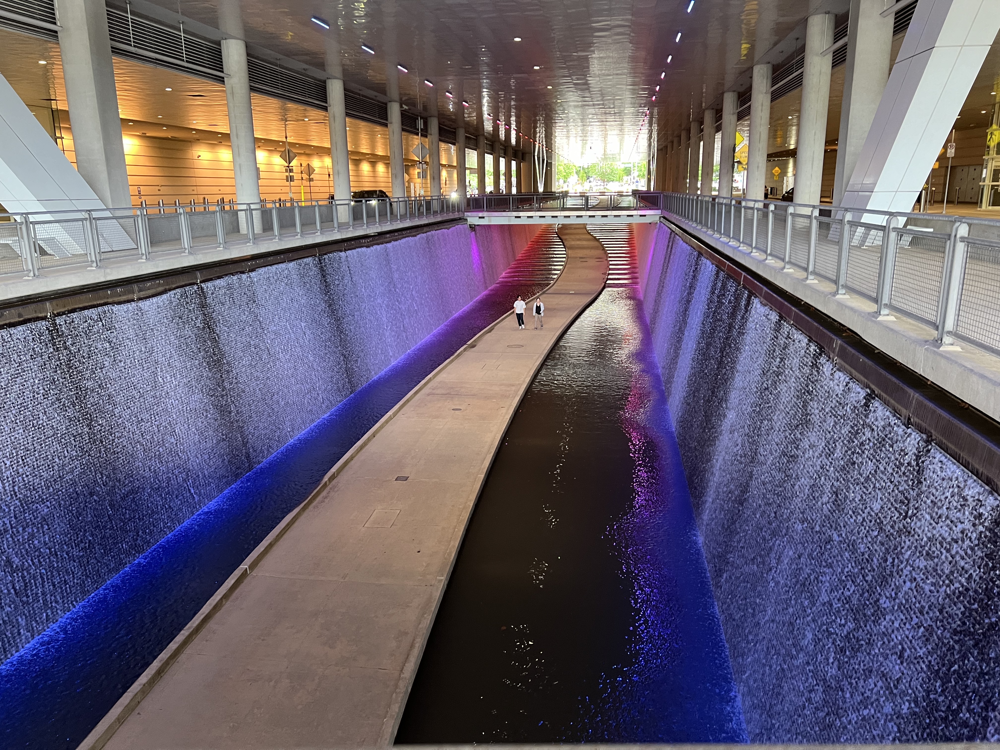
10th Street Water Feature

üîù [**back to top**](#table-of-contents)

### Allegheny Riverfront

Standing on a bridge on the Allegheny River with a view of the downtown and one of the many other bridges

üîù [**back to top**](#table-of-contents)

### Fig and Ash

After a busy day, I was tempted to get some cheap takeaway for supper, but I thought twice, and decided I should enjoy the best this city has to offer. So, I googled "best restaurant in Pittsburgh." The top result was [Fig & Ash](https://figandashpgh.com/), a short walk away. I went there and had an incredible meal. 

Spaghetti with Maine lobster cream, crab, nantucket bay scallops, arugula

A piping hot cast iron Kahlua fudge brownie with coffee ice cream and sea salt for dessert

üîù [**back to top**](#table-of-contents)

## Thursday

I took the day off to sightsee. 

As I was walking down the riverfront, I saw a man taking photos. He looked familiar. I was pretty sure we had been following each other on social media for a while. I couldn't resist approaching him. It was Peter Wang (Anaconda Co-founder). It was really fun to meet him, and I found out that he and my friend Andy Fundinger had been consultants at JPMorgan Chase years ago.  

üîù [**back to top**](#table-of-contents)

### Noticeable Sightings at the Conference Center

I couldn't resist stopping at the convention center to see what was going on. 

Once inside, I soon saw Guido van Rossum (Python Creator and BDFL) walking nearby. He sat down next to me, and I had the chance to chat with him about life and work. I thanked him for spending the time, and he thanked me. I've had the chance to spend time with him at three conferences now, and it's always fun. The Python community is lucky to have a BDFL who actively engages with us and cares. 

I was thrilled to catch up with some of my DjangoCon US friends: Afi Gbagado (DjangoCon US), Abigail Mesrenyame Dogbe (Technology Chief of Staff and Open Source Founder), Noah Alorwu (Marygold and Co.), Felipe de Morais (AfroPython), Jeff Triplett (RevSys, DEFNA Board Member), Eric Matthes (Author of [Python Crash Course](https://nostarch.com/python-crash-course-3rd-edition)), and Trey Hunner (Python Trainer, Python Morsels). I made a new friend Amanda Viera (AfroPython). 

Me and Abigail Mesrenyame Dogbe

As usual, Trey had an interesting gaggle of people around him that included Marie Roald and Yngve Mardal Moe ([Turtle Thread](https://turtlethread.com/)) and Rodrigo Gir√£o Serr√£o ([Python Math Teacher](https://mathspp.com/)). 

It was good to chat with Mason Eggers (PyTexas Chair), Kevin Horn (Dallas Fortworth Pythoneers Co-founder and PyTexas Organizer), Josh Schneider (PyTexas Organizer), Andy Fundinger (Bloomberg), and Heather Crawford (Bloomberg) again so soon after seeing them at the wonderful PyTexas conference I attended in April. Andy and I first met at PyGotham, another one of my favorite conferences. 

Inspired by Andy, Mason and I later talked PyTexas sponsorships. 

Although they were hard at work, I also got to see Deb Nicholson (Python Software Foundation Executive Director) for the first time again since DjangoCon US 2023, Ee Durbin (PSF Director of Infrastructure), Christopher Ngeuebauer (PSF Board Member), and Mariatta. :) 

üîù [**back to top**](#table-of-contents)

### Andy Warhol Museum

On the way to the [Andy Warhol Museum](https://www.warhol.org/), I saw my friend Andy Knight (Automation Panda), and we walked there together. Andy had given a tutorial "[def test_crash_course_with_pytest():](https://us.pycon.org/2024/schedule/presentation/37/)". 

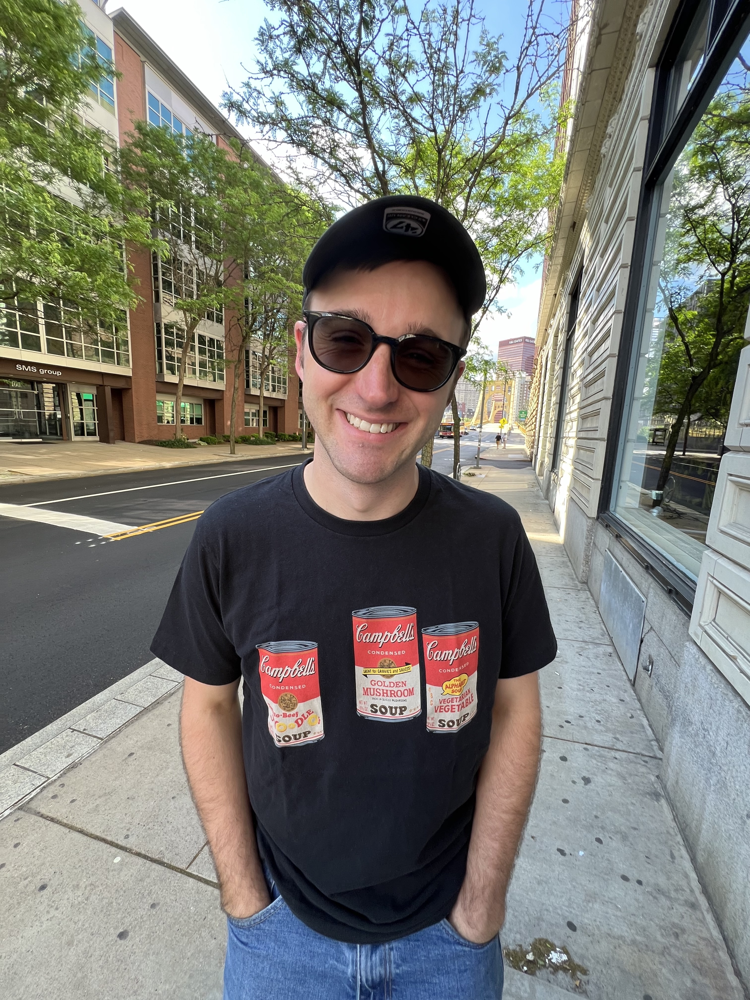
Andy wearing an Andy Warhol-inspired shirt

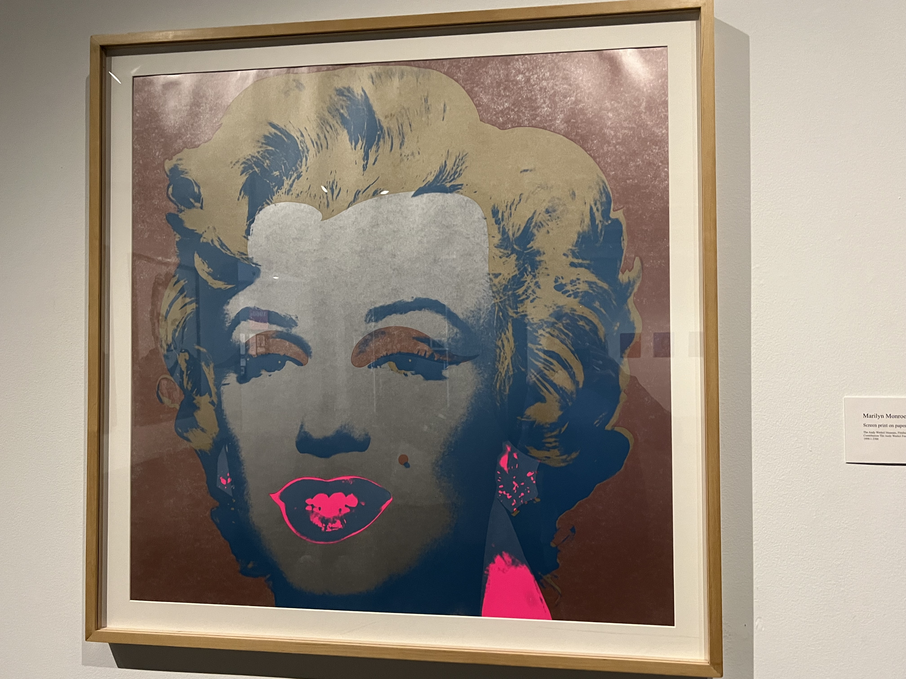
A favorite from the Andy Warhol Museum

üîù [**back to top**](#table-of-contents)

### Heinz History Center

When I heard that the [Heinz History Center](https://heinzhistorycenter.org/) has the Mister Rogers set, I had to go. 

Mr. Rogers Neighborhood set

üîù [**back to top**](#table-of-contents)

### Duquesne Incline

I had all of my travel plans in place to attend PyCon US 2020 in Pittsburgh and planned to ride the [Duquesne Incline](https://www.duquesneincline.org/), but the in-person conference was canceled due to Covid. I finally had the chance to ride it! 

View from the station at the bottom

View from the Duquesne Incline Observation Deck

üîù [**back to top**](#table-of-contents)

### Opening Reception at the Expo Hall

I gave my first conference talk at the first conference I ever attended. It was DjangoCon US 2017 in Spokane, Washington. I distinctly remember that Roger Masse (United States Senate) and Mark Lavin (Nvidia) attended my talk. At the PyCon US 2024 opening reception, while catching up with Jon Banafato (PyGotham Chair), I saw Mark walking by and couldn't resist stopping him to introduce myself and thank him years later for going to my first talk. :) 

After years of following each other on social media, it was wonderful to meet Anthony Shaw (Microsoft) in person. Along with Iqbal Abdullah (LaLoka Labs, PyCon JP), we talked about the [CPython Internals](https://realpython.com/products/cpython-internals-book/) book Anthony wrote and my desire to understand CPython better. Anthony later suggested that I submit to the CfP next year, and I have to admit that it's tempting. 

It was a pleasure to chat with Simon Willison (Django Co-founder) again briefly before he left to work on his keynote. I knew he would nail it. 

I got to hang out with Meagan Voss (Wagtail) and Nic James (DjangoCon US 2019 Chair) and talk about our work. 

It was so good to see my friend Jess Garson (Elastic, formerly Twitter) at the Elastic booth and meet Philip Krenn (Elastic). Jess and I first met at PyGotham 2019, and she introduced me to many aspects of the Twitter Developer Program. :) 

The night finished with a bear hug from Carol Willing (CPython Core Developer, Python Steering Committee) who told me I am awesome. :) 

Expo Hall in full swing

üîù [**back to top**](#table-of-contents)

### Expo Hall Booths Thursday and Friday

In the Expo hall, I did a tour of database companies and other fun tools. 

At Datadog booth, Julian Levi Hernandez (Datadog, formerly CockroachDB) gave me a demo of a dashboard using Cockroach audit logs to further drill down into metrics. 

At the Edge DB booth, Yury Selivanov (Edge DB Co-founder) told me that Django will be supported in a few months and showed me the impressive performance improvement created by Edge DB. Looking forward to learning more! 

At the Oracle booth, Gary Brenner (Oracle Senior Cloud Engineer) told me about Oracle Cloud and self-managing Oracle databases. 

At MongoDB booth, I caught up with my friend Mark Smith (MongoDB) and obtained some [learning resources](https://www.mongodb.com/developer/events/pycon-us-2024/) from Rita Rodrigues (Director of Developer Relations at MongoDB). 

At Snowflake booth, I learned about [Snowflake Quickstarts](https://quickstarts.snowflake.com/) and using Snowflake tasks for orchestration. 

At the Crunch Data booth, I met Elizabeth Garrett Christensen. I know of Elizabeth through the talks she has given at DjangoCon US: "[How to Be a Postgres DBA in a Pinch](https://2022.djangocon.us/talks/how-to-be-a-postgres-dba-in-a-pinch/)" and "[Postgres Performance: From Slow to Pro](https://2023.djangocon.us/talks/postgres-performance-from-slow-to-pro/)". Crunch Data provides Enterprise PostgreSQL support, including fully managed Postgres as a Service. 

As a fellow Lawrence native, Elizabeth seems to be hoping for a Lawrence Django conference as much as I am. :) I missed the [Lawrence Technology Conference](https://lawrencetechconference.splashthat.com/) this year, but hope to make it next year at least, if there is one. 

At the PostgreSQL community booth, I obtained some learning resources, including a paper version of [PostgreSQL FAQs](https://www.postgresql.org/about/press/faq/).

At the [Coiled](https://www.coiled.io/) booth, I learned about using Dask for parallel computing. Dask was a projects cited in the Measuring the performance of CPython. 

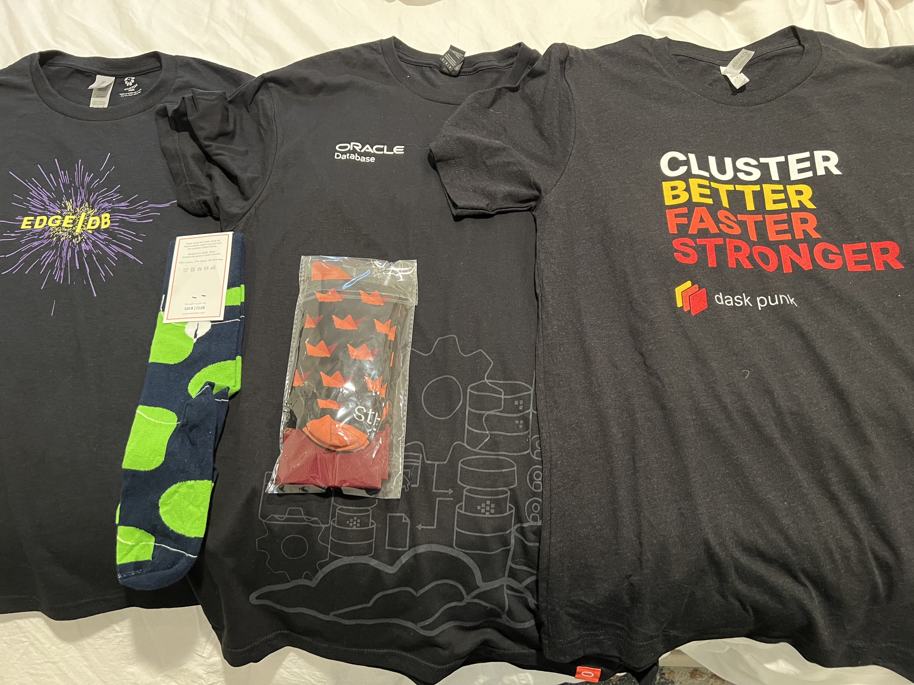
EdgeDB, Oracle, Dask, Streamlit socks, MongoDB socks? 

üîù [**back to top**](#table-of-contents)

## Friday

### Breakfast

At breakfast, I met Loren Crary (PSF) for the first time after following each other on social media for quite some time and saw Al Sweigart (Author of [Automate the Boring Stuff with Python](https://nostarch.com/automate-boring-stuff-python-3rd-edition)), one of my favorite authors and presenters, again. I also finally met Tania Allard (Quansight, formerly Microsoft) and learned more about her work, including consulting at JPMorgan Chase. It was a pleasure to meet Daniel Graham (SauceLabs) and Jing Cao (National Microbiome Data Collaborative), too. 

üîù [**back to top**](#table-of-contents)

### K. Jay Miller Keynote
 
Jay knows two staff developer advocates who are Black and he is one of them. When he sees another Black developer on stage, it's not just another Pythonista. 

Jay talked about beautiful moments from DjangoCon US 2023 in Durham, North Carolina: Black leaders, from all around the world, getting on stage, getting in front of their booths. They showed up and showed out for who they were. 

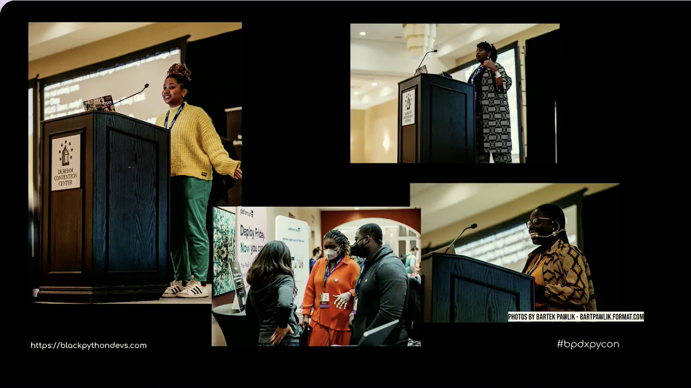
Black Python Devs at DjangoCon US 2023

Jay was happy to not be the first Black person keynoting PyCon US. But, at PyCon US 2022, Jay counted only 12 Black people among thousands. He talked to them. They had to have a reason to be there. He thought of the keynoters who came before him. They came, they spoke, they left. He wondered if "the juice wasn't worth the squeeze." 

Many people go to conferences to hang out with their friends. If you don't have that kind of experience, there's no reason to attend. 

Jay asked, how do we get more black people to experience the PyCon community, build friendship, and become repeat attendees? 

Jay decided to create something that would serve as a Wakanda for Black Python devs. Something that would be worth staying for. It's called [Black Python Devs](https://blackpythondevs.com/). 

Jay listened to people in the community who had experience running non-profits, starting communities, running conferences: Marlene, Dawn, Kojo. He needed to make the community safe, equitable, accessible. This goes beyond a code of conduct to issues that Black people think about everyday like physical safety in public. He also wants to prevent burnout. 

Jay started working behind the scenes to get as many Black people as possible to PyCon US 2023. There were 3x more than in 2022. They were able to be in the same room together and talk about the experiences they have as Black Python devs that others can't comprehend, not about how to increase diversity. 

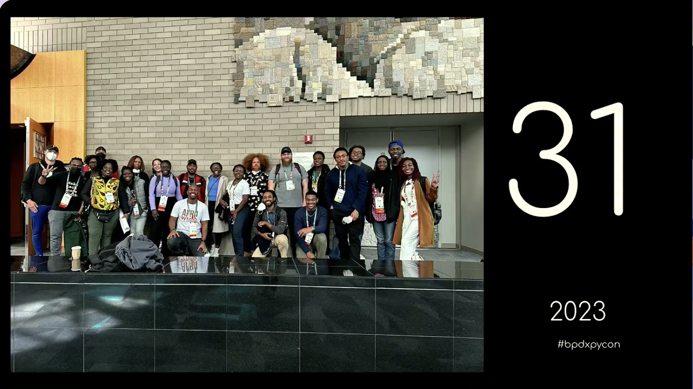
3x attendance at PyCon US 2022

Five members launched a discord. There are 427 members now. Their only plan was to be there for each other. 

They are now officially a non-profit powered by the GNOME Foundation. 

The leadership model is "diversity by inclusion." Global leaders are represented at the table: from many countries, speaking different languages, 50/50 gender parity. It's members are people who are already around you in PSF, DFS, Djangonauts, Pylades, DjangoGirls. Because the community came from Africa, its leaders do too. 

"Your reach may extend beyond your grasp." Kojo Idressa

The Python community can extend the reach further and Black Python Devs can help change perceptions in communities. 

A few examples of solidarity
* Facilitating four leaders traveling to their first PyCon US
* Converting community sponsorship into tickets for first time attendees who are Black Python Devs members
* Providing 75 student tickets to Python Nigeria
* Convening leaders from across the globe at conference lunchtime to help understand the situation happening in Africa and what could be done to assist
* Helped Vice Chair Velda Kiara on stage when her laptop didn't work
* Supporting a Django Girls event that gave not just Black women devs, but Black girls a wonderful first interaction with the Python community

"Say it loud." Everything they do is out in the open, proudly showing up for each other, saying, we've got this, and celebrating. 

Black Python devs had a goal of sponsoring seven local conferences in Black communities and hoped to raise $5,000 at PyCon US. They raised over $15,300 from 282 donations. 

Things you can do to help
* Donate money
* Donate time, mentor
* Connect with Black Python Devs
* Open doors, have conversations, make connections

üîù [**back to top**](#table-of-contents)
 
### Hallway Track and Expo Hall

At PyCon US 2019, Pablo Galindo Salgado (CPython Release Manager, Bloomberg) was one of the first people I met as a wide-eyed newcomer. It was the Thursday night before the conference talks began, and I was at the conference hall for the swag stuffing, which is a great place to meet people. Scientists had recently photographed a black hole for the first time. Pablo, a physicist, invited me to a table nearby where he demoed some Python astronomy software for me. I later met Barry Warsaw (Python Steering Committee, Nvidia) at the sprints and talked to him about my career. At the time, I was a part-time open source maintainer of Pinax. 

I saw Pablo and Barry together at the PyCon US 2024 Opening Reception. It was wonderful to be able to share with them five years later how my career has taken off. 

It was great to see Andrew Godwin (Django Async Architecture) and Dave Forgac (PyOhio) again. 

I had the chance to say hello to Sarah Kuchinsky (PyCon US Organizer) for the first time since PyCon US 2019. She was recently the technical reviewer for Al Sweigart's great book about recursion called "[The Recursive Book of Recursion](https://inventwithpython.com/recursion/)". I really enjoyed it! 

I found out that Julia Ferraioli (AWS Open Source) was at the conference. I was ecstatic and hurried over to meet her. I had hoped to meet Julia in person for years. In March of 2021, I reached the final round of a Twitter Open Source Program Manager interview process. I was disappointed when I was not offered the job, but later found out that I had been considered alongside Julie and was honored. In a twist of fate, in August of 2022, Julia kindly met with me via Zoom and gave me excellent career advice. 

It was also a pleasure to meet Brianne Wilhelmi (Springboard) and Aaron Clark (Hamilton Beach) at lunch, and see Ashia Zawaduk (Muck Rack) again after PyCascades 2020. 

üîù [**back to top**](#table-of-contents)

### Photos and Tea

Earlier this year, I created a [page of favorite conference snapshots](https://katherinemichel.github.io/portfolio/favorite-conference-snapshots.html). Benedict Kofi Amofah (Python Ghana, DjangoCon US) tweeted to me that he'd be in the gallery soon. I took him up on it. :) 

Me and Benedict

Abdur-Rahmaan Janhangeer (Python Usergroup of Mauritius (PyMUG)) and I have been following each other on social media for quite some time, but I didn't know what he looked like. Fortunately, he found me and gave me a wonderful gift of Chartreuse tea, the best selling tea in Mauritius. Thank you! 

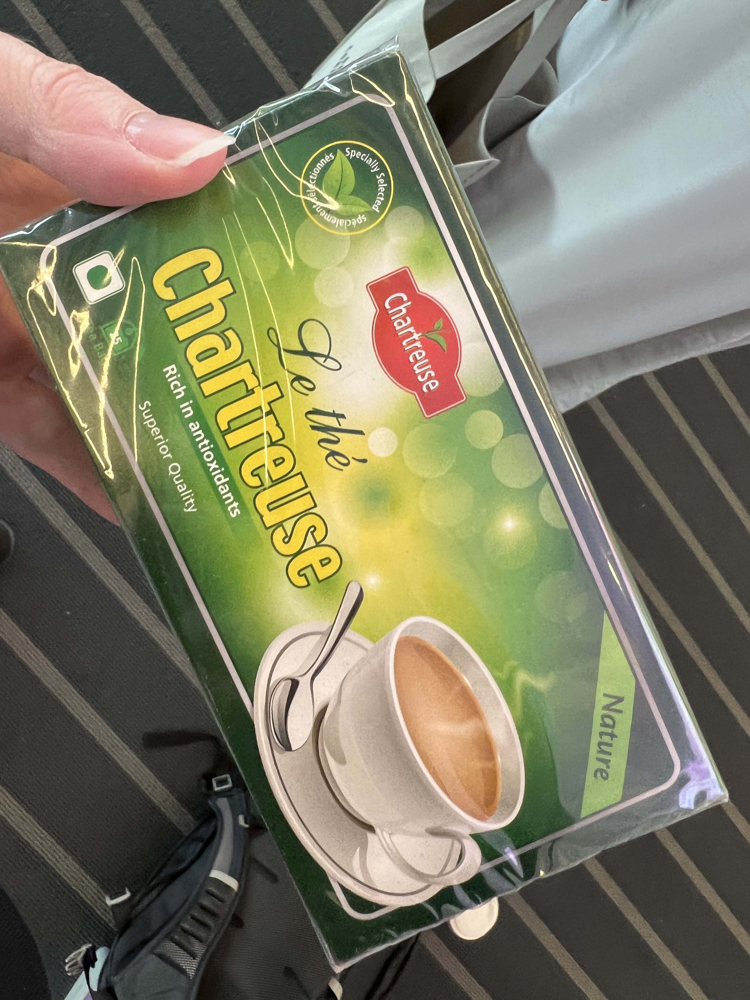
Chartreuse Tea! 

üîù [**back to top**](#table-of-contents)

### Condado Tacos

After my incredible meal on Thursday night at Fig and Ash, I wanted to do something simple for supper. Based on a tip from another conference attendee, I ended up across the street from the convention center at [Condado Tacos](https://condadotacos.com/). The food was pretty good, but the best part was sitting and chatting with Bloomberg Python Trainers Heather Crawford and Scott Irwin. I met Scott at PyGotham 2018 where I attended a talk he gave "[Dataclasses are here. Now what?](https://www.youtube.com/watch?v=zHY1oaYxxjA)". I met Heather at PyTexas 2024 where she did an awesome talk "[Python Code Versus Pythonic Code: What Experienced Developers Find Challenging About Learning Python](https://www.youtube.com/watch?v=RdkhRfRizf0)", which she also gave at PyCon US. 

üîù [**back to top**](#table-of-contents)

## Saturday

### Breakfast

Koushik Krishnan (Microsoft Azure Cosmos DB Engineer) gave his talk "[Rest Easy with Jupyrest: Deploy notebooks as web services](https://youtu.be/HWIPkipolUk?si=ozxHi5N7RwY19hVh)" at PyTexas. When I saw during the talk that he works on [Microsoft Azure Cosmo DB](https://azure.microsoft.com/en-us/products/cosmos-db), I was keen to meet him and did. He gave the talk at PyCon US too. It was a pleasure to have the chance to chat with him about different databases over breakfast. I also had the chance to promote [Bar Camp Philly](https://2023.barcampphilly.org/), organized by Tim Allen and now Dawn Wages' wife. 

üîù [**back to top**](#table-of-contents)

### Simon Willison Keynote

Simon talked about Large Language Models such as Chat GPT, Google Gemini, Claude, and Llama.

He does not think of them as Artificial Intelligence. He thinks of them as Imitation Intelligence. They predict the next word in a sentence. When they get good at that, it's spooky what they can do. He acknowledged that they are flawed, but just because a tool is flawed, doesn't mean it's not useful. 

When evaluating a new technology, Simon asks, what can I build with this that I couldn't have built with it before? LLMs open up new options unlike anything he has ever seen. 

How can we tell which of these models works best? Vibes. Simon recommends using [LMSYS Org Chatbot Arena](https://arena.lmsys.org/). You vote on which model gave the best response to a prompt, then they are scored using Elo rating system. Simon is relieved, because "openly" licensed models are beginning to rank. 

LLMs can be run on smartphones now, even with no internet connection. An app called MLC Chat will give you access to Mistral, one of the best openly licensed models. 

Simon has deep respect for what is known as prompt engineering. It's not easy to get LLMs to do what you want them to do. Building something simple is easy. Building something production ready can take months and is much harder than people expect. 

A few tricks
* Chat prompting
* Retrieval Augmented Generate (RAG)
* Function calling ("tools") in a loop

Simon coined the term "Prompt Injection" after SQL Injection. He believes that we are not seeing digital assistants, because no one knows how to build them securely. 99% effective isn't good enough. Never mix untrusted text with access to tools. 

Simon showed how he gave the LLM a GeoJSON file with different line segments and prompted it to turn it into a single polygon. This "side project" took 3 1/2 minutes to complete

Simon showed how he had created a counter that incremented each time he said AI or artificial intelligence. It took 6 minutes to get to prototype and 20 minutes to get it polished. 

Simon walked through how he passed structured data from the PSF Board Resolutions page into an LLM to parse it into a structured data table that could be filtered. He used a plugin he had been developing called llm.datasette.io. 

Simon has been able to use LLM to more quickly build things that he couldn't justify spending the time to build by hand. 

Tips
* Ask it to give options (it's more likely to give a better answer)
* It will rarely get the answer right. Ask it to "do better." 

LLMs make mistakes. It's up to you to verify. The tool gets you 90% of the way there. 

Rather than Generative AI, Simon likes to think of these tools as Transformative AI. 

Personal AI ethics: Simon came across the term "slop" and likes it. Similar to spam, ask yourself, am I creating unwanted junk or am I using these tools in a responsible way?

Simon pondered if using LLMs is cheating. We care if students cheat, because it hurts them and they have an unfair advantage. 

LLMs feel different. Simon's whole career has been about getting things done more quickly, including by using open source code.

A few rules of thumb
* Never commit any code that you couldn't actively explain to someone else
* LLMs are good at explaining code. Give it code in a language you don't understand and it will explain it with 90% accuracy
* Then, help people understand how you did it!

He said software engineers are uniquely positioned to take advantage of LLMs, because LLMs are good at generating code, and you can check the code by running it. 

Simon is optimistic. You need to have a CS degree or spend a lot of time learning to do the simplest of computer tasks. 

LLMs opens programming up to a much wider community. Simon believes that we have a responsibility to not leave anyone behind. 

üîù [**back to top**](#table-of-contents)

### Hallway Track

It was wonderful to see Moshe Zadka at PyTexas where he gave a talk "[Iterate, iterate, iterate](https://www.youtube.com/watch?v=WMK7pTOdECQ)" and again at PyCon US where he gave me a Moleskin journal from Anthropic for recording convo starters for next-generation AI assistant [Claude](https://www.anthropic.com/news/introducing-claude). 

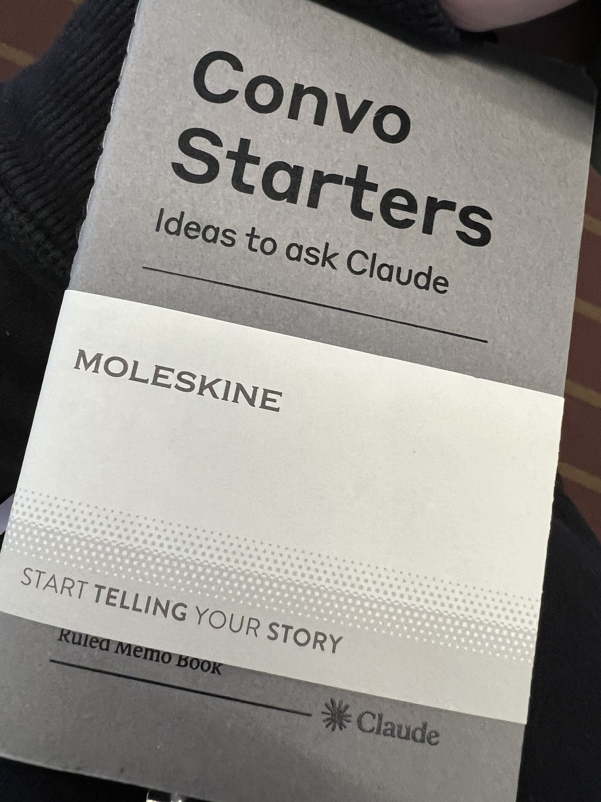
Moleskin from Moshe

At DjangoCon US 2023, Marc Gibbons gave a wonderful talk called "[Empathetic testing: Developing with compassion and humility](https://2023.djangocon.us/talks/empathetic-testing-developing-with-compassion-and-humility/)". Not only was it his first conference talk, but after 44 chemo treatments, 15 fractions of radiation, and a stem cell transplant to treat Hodgkin Lymphoma, he had been given a clean bill of health the week before. It was wonderful to have the chance to catch up with him at PyCon US. 

üîù [**back to top**](#table-of-contents)

### Overcoming GIL with subinterpreters and immutability

Yury Selivanov showed a screen with a single Python process running 10 async IO event loops saturating the 10 CPU cores on his laptop, all sharing memory and exchanging values between them from 1 million keys and values and done fairly efficiently. Yury said it is possible to build fast things with Python. 

Yury kind of likes the GIL. When he tries to do free-threading or multi-thread programming, bad things happen. 

Free-threading will take a couple of years to be stable. Python subinterpreters are relatively new. You can run these subinterpreters in the same process, side-by-side, isolated from each other, each with its own GIL and occupying one CPU core, sharing the same memory space. 

One of the subinterpreters will be the main one and will spawn workers and perhaps can have queues between workers and spawn tasks. 

What if we could safety share state between the subinterpreters with the potential for lots of it and without using pickle, because it's slow?

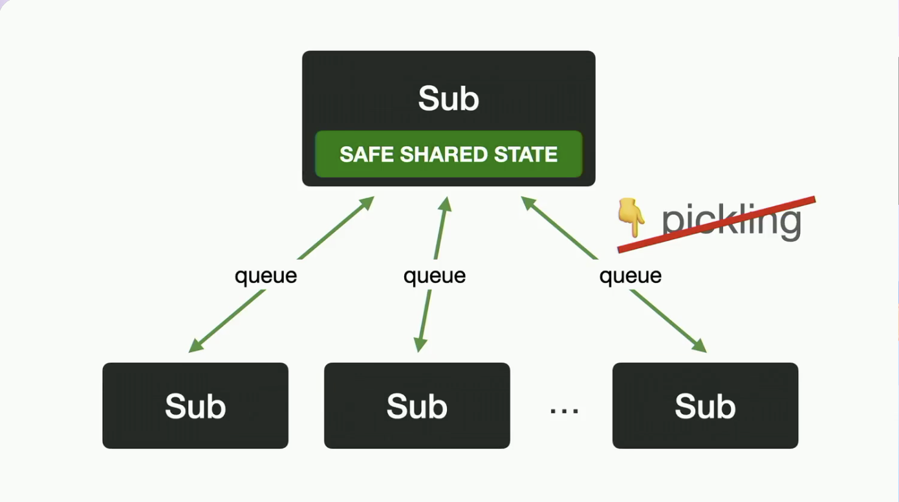
Safe shared state... no pickle

Yury has created a minimal library called [memhive](https://github.com/edgedb/memhive) that enables efficient data sharing between isolated subinterpreters.

He showed a code snippet. 

Architecture
* Level 1: simple protocol that enables you to send Python data across subinterpreter boundary
* Level 2: higher level API (queues and sychronization primitives)
* Level 3: async IO bridge

Create memhive and define the async workers that will be running in each separate subinterpreter, each with its own async IO loop. They can access shared state, listen to messages, send messages, spawn worker subinterpreters. The main interpreter will initialize the shared state, broadcast signals to all subinterpreters, push work so that one starts working on a task, listen to messages. 

Rather than how it works, Yury felt it was more important to talk about how it's implemented. 

3 things to talk about
* Immutability
* Efficient immutability
* How we can benefit from it

Immutability
* Python has immutable types: str, int, floates, bytes, tuples
* You cannot change an existing object. You have to create a new object out of the existing object. 
* There is no immutable dictionary or mapping in CPython, which Yury says is a shame. 

Efficient immutability
* Creating a new tuple out of an existing one is efficient (O(n)), but you are not usually dealing with a lot of records. 
* The same inefficiency would be very bad for a dictionary, because we are potentially putting millions of items in them. 
* Dictionaries can be used as caches, but rebuilding it every time would be unacceptably slow. 
* Fortunately smart people created a nice algorithm that can implement this with O(log n)

The trick Yury would show used trees behind the scenes. 

As keys and values are added to an empty root node of the tree, when a key conflict happens, another node on the second level is created and the key is added to it instead. The tree will get bigger and bigger as items are added. 

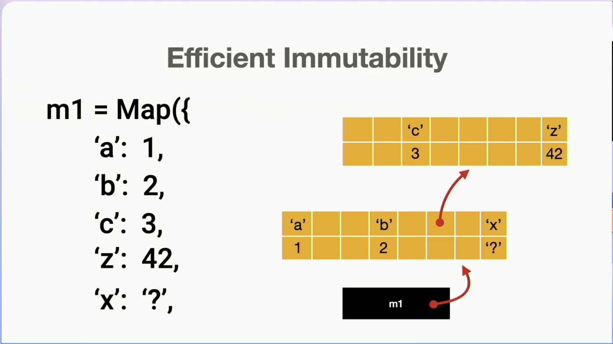
Linking a second level node by reference

Imagine that we want to mutate this tree. We run the algorithm to figure out where to put the key, then need to copy the root node (it's immutable, so we can't mutate it). 

This is where the magic happens. 

We don't have to copy the second level of the tree. We can re-use it. We just need the reference. 

In a mapping with billions of keys, perhaps five nodes out of 10,000 change. 

This is called structured sharing. The algorithm is called HAMT (Hash Array Mapped Trie). Yury implemented it in the Python Standard Library. It can be found in contextvars module. The [hamt.c file](https://github.com/python/cpython/blob/13a5fdc72f701c053b96abea48cd8f2775e9418e/Python/hamt.c) has a 200 line comment explaining in detail how this data structure works. 

How we can benefit from it
* All subinterpreters run in the same OS process so they share the same memory space 
* If we want to access this tree from the main subinterpreter, we just look into the memory directly. It is immutable and will not change. 
* If we want to add a key, we don't have to copy the entire tree, we just create the missing new branches and reference others
* If we have a tree with billions of keys, we just create a couple of tree nodes in a worker subinterpreter, the rest can be re-used. 
* Key: using immutable things, we can access the underlying memory safely without locks, as long as we can guarantee that the data would not be garbage collected.
* memcopy is used and is really fast. 

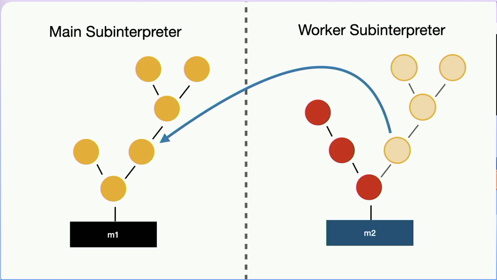
Create tree nodes in the worker subintrepreter and re-use the rest

Yury performed a benchmark. Structured sharing is significantly faster than using pickle, potentially 6x to 150,000x faster. 

Yury talked about some of the implementation details icluding incref and decref. incref keeps Python objects alive when the ref count goes to zero. The data sharing mechanism has to guarantee safety. 

The hard part of this is implemented in memhive, but some bugs need to be fixed. Do not use it in production. 

Yury is building this for Edge DB to optimize cloud deployments. 

üîù [**back to top**](#table-of-contents)

### Measuring the performance of CPython

"Measuring the Performance of CPython" by Michael Droettboom (Microsoft CPython Performance Engineering Team, Faster CPython Team)

I did not watch this full talk, because I left early to go to the PSF Members Luncheon. 

A few key takeaways from what I did watch: 
* The Faster CPython Team has made Python 3.11 20-60% faster depending on what you are doing
* This talk was born out of a need to benchmark in order to determine if they were working on the right things to impact Python performance
* In the Python world, benchmarks are in pyperformance suite (a little over 100 benchmarks, some 30 or 40 years old)
* Not all benchmarks are created equal

Other projects that have aimed to make faster Pythons over the years

[Computer Architecture: A Quantitative Approach](https://www.amazon.com/Computer-Architecture-Quantitative-Approach-Kaufmann/dp/0128119055) has a useful chapter for looking at benchmarks and categorizing what they are useful for
* Toy benchmarks: simple, less than 100 lines of code, cool, but not a common use case
* Real applications: take some code that runs in production, maybe on a massive scale and running it in a benchmark suite
* Microbenchmarks (not in the textbook): measuring a narrow feature of the language

Sub-topics of real applications benchmarks: 
* Modified application: change it slightly to make it better as a benchmark
* Application kernel: taking one subsystem of application and benchmarking that specifically

üîù [**back to top**](#table-of-contents)

### PSF Members Luncheon

I attended the PSF Members Luncheon.

I sat at a table that included Naomi Cedar (Author of [The Quick Python Book](https://www.manning.com/books/the-quick-python-book-third-edition)), Tres Seaver (Zope), Chris Brousseau (PyBay), and Phebe Polk (PyBay Piggies). 

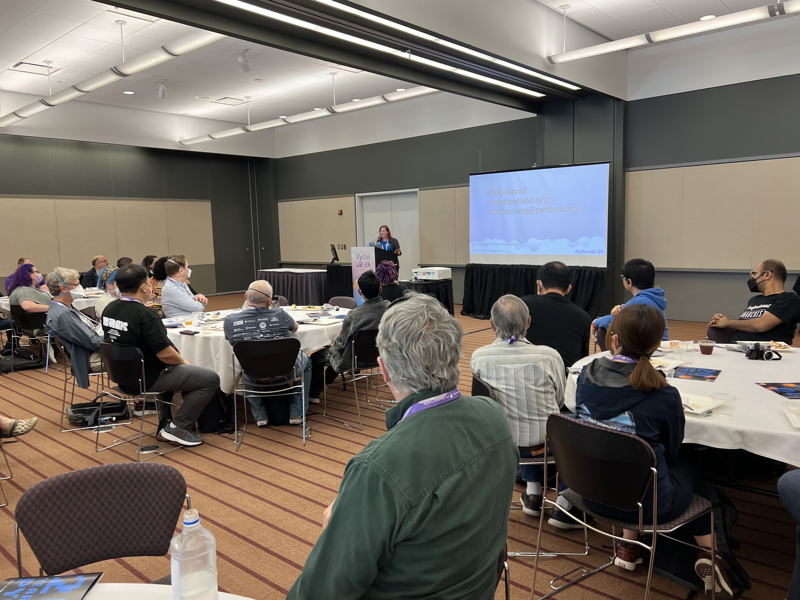
I really enjoyed the presentation. 

At the luncheon, I had the chance to chat with Jannis Leidel (Anaconda) again. At PyCon US 2019, I met him serendipitously while I was working at the PyLadies booth. Once upon a time, he worked on Pinax, an open source library that I later helped maintained. I was able to learn more about the history of the project from him. 

I later went over to Hynek Schlawack (prolific open source maintainer) who remembered we had met at PyGotham 2019 where I attended a talk he gave! While chatting with him, he introduced me to Hugo van Kemenade, the CPython 3.14 and 3.15 Release Manager. It was very cool to meet him, and it turns out that he maintains [Pillow](https://pillow.readthedocs.io/en/stable/) package. I am a big fan of Pillow. I used it to create my Twitter art bot which is very special to me. :) 

üîù [**back to top**](#table-of-contents)

### Profile Pic

My friend Melanie Arbor (O'Reilly Media) takes great profile pics. At DjangoCon US 2017, she took my pic, and I loved it. I've used it as my social media profile pic since then, but it's getting a bit dated. I saw her at PyCon US and asked her if she would be willing to take a new profile pic of me. It turned out that she had already created a "Profile Pic Palooza" open space for Saturday at 3 pm. As a bonus, I got to catch up with Chalmer Lowe (Google) for the first time since PyCon 2019. 

New profile pic :) 

üîù [**back to top**](#table-of-contents)

### Juggling

Not only does Ned Batchelder ([coverage.py](https://coverage.readthedocs.io/) Maintainer) maintain a powerful Python package and give popular conference talks (check out [People: The API User's Guide](https://nedbatchelder.com/text/key23.html)), he is also a juggling enthusiast. When I saw his juggling open space in progress, I couldn't resist stopping. I juggled for the first time in probably decades! It was also great to catch up with Paul Ganssle (Google, CPython Core Dev, pytz maintainer), and meet Rob Ludwick (Bank of NY Mellon) and William Higgins (Consumer Financial Protection Bureau). 

[Video](https://www.youtube.com/shorts/TJfENk2653c) of me juggling! 

üîù [**back to top**](#table-of-contents)

### Hallway Track and Expo Hall

It was great to see Jacob Kaplan-Moss (early Django Engineer) and Frank Wiles (RevSys, former DSF President) again. 

I saw Glyph Kefkowitz's badge and immediately knew he was probably the same Glyph ([Twisted](https://twisted.org/) Project Leader) I'd come across on social media. I learned more about Twisted when Amber Brown gave a keynote at DjangoCon US US 2019 "[The Natural State of Computers](https://2019.djangocon.us/talk/keynote-amber-brown/)". Glyph and I talked about the role of Twisted in the async world and the possibility of using Twisted for async orchestration. 

Speaking of my DjangoCon US 2017 talk, Russell Keith-Magee (Beeware Founder, former DSF President, prolific public speaker) was my speaker mentor at the time. At PyCon US 2024, I had the chance to catch up with him before the PyLadies Auction. I congratulated him on the acceptance of [PEP 730: Adding iOS as a supported platform](https://peps.python.org/pep-0730). Python now runs on iOS without a patch! Russell's [Beeware](https://beeware.org/) Project enables you to write an app in Python and release it on multiple platforms, including desktop and mobile! Check out his PyCon US 2019 [Python Black Swans Keynote](https://www.youtube.com/watch?v=ftP5BQh1-YM)) and many Beeware talks. 

üîù [**back to top**](#table-of-contents)

### PyLadies Auction

The [PyLadies Auction](https://us.pycon.org/2024/events/pyladies-auction/) is always a roaring good time.

Not long after I sat down, I was excited to see Reuven Lerner ([Python Trainer](https://lerner.co.il/)) walking past. He sat down next to me, and it was a pleasure to get to know him. I also enjoyed chatting with Danielle Casper (Amazon) about systems engineering and with Scott Karlin (Princeton). 

A cuckoo clock donated by Capital One sold for $3,400. A "stupid" pen sold for $700. 

The auction raised $60,000, $15,000 more than it ever had before. The community showed up in a big way! 

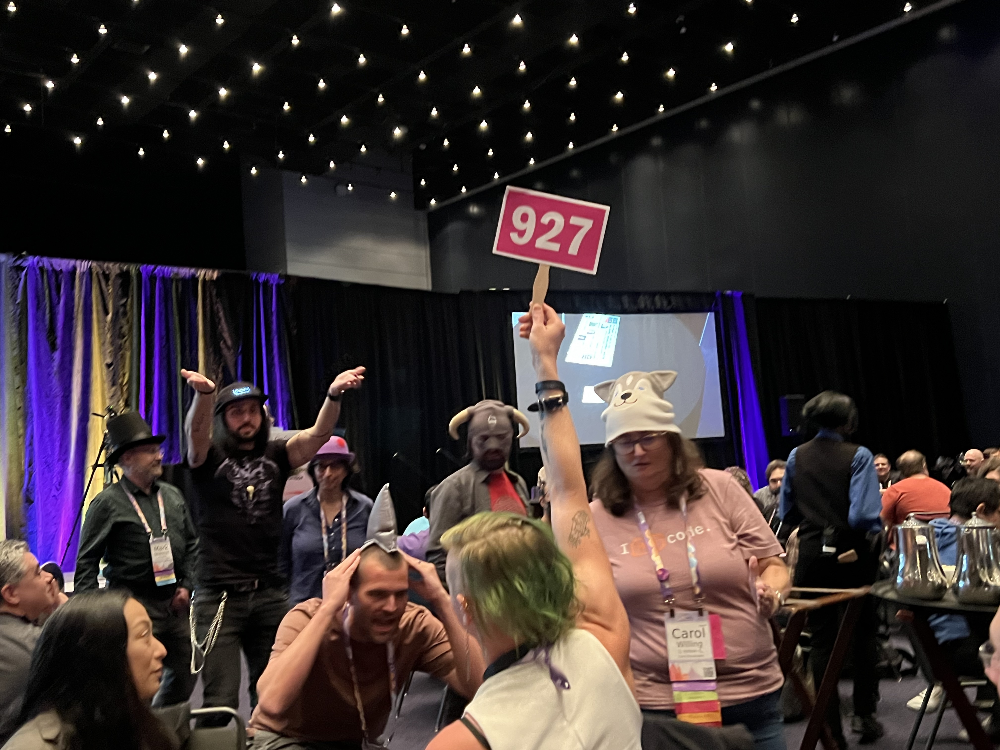
[CPython Release Stream](https://www.youtube.com/watch?v=PGZPSWZSkJI) participants showing off their hats

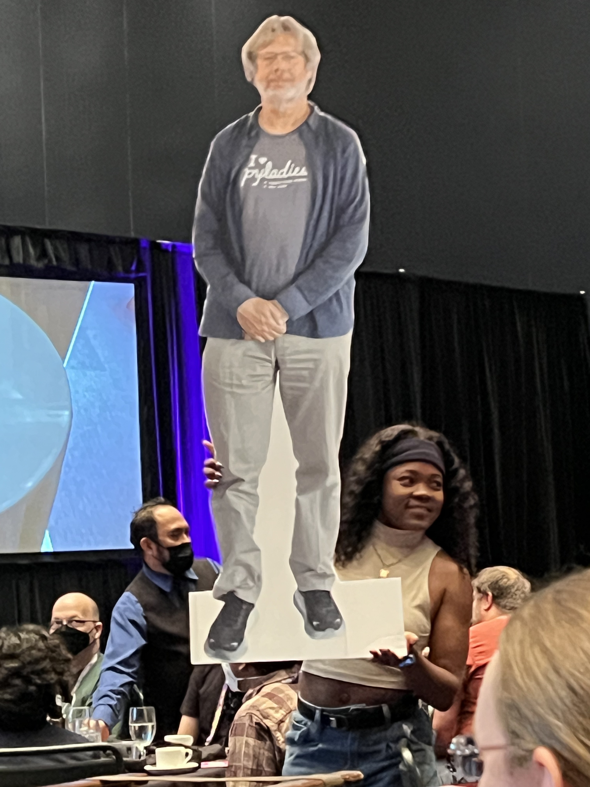
A miniature cutout of Guido for selfies and rubber duck debugging :) 

Thank you to my friends Jackie Kazil (Bana Solutions, Project Mesa), Lorena Mesa (Netflix, PyLadies Chicago), and Lynn Root (Spotify) for all of the hard work they put into the auction this year and every year, and to Doug Napoleone for emceeing and Kushal Das for taking pics! 

A PyLadies Grant helped me attend PyCon US 2019. 

Me and Jackie Kazil :) 

üîù [**back to top**](#table-of-contents)

## Sunday

### Posters

I started Sunday morning by checking out all of the posters. 

üîù [**back to top**](#table-of-contents)

### Ethan Smith

Ethan Smith (Nvidia, formerly Sentry) and I have been following each other on social media for a while. We met in person and talked about his packaging work at Nvidia.

He was working on a draft Packaging PEP (Python Enhancement Proposal) "Supporting Symlinks in Wheels" sponsored by Barry Warsaw. 

üîù [**back to top**](#table-of-contents)

### PyLadies Lunch

On Sunday, I attended the [PyLadies Luncheon](https://us.pycon.org/2024/events/pyladies-lunch/). It was wonderful, as usual. 

Thank you to Marie Roald, Sydney Runkle (Pydantic), Kim Tendulkar, Erika Ambrosio (Tampa Bay Lightning), Sierra Brown, Grace (Muck Rack) (and a few others whose names I did not catch) for a really wonderful conversation over lunch. 

I learned from Sydney who leads open source at Pydantic that [Pydantic](https://docs.pydantic.dev/latest/) is often used with Django Rest Framework. I am looking forward to learning more! Check out Sydney's PyCon US talk "[Pydantic Power-up: Performance Tips for Lightning-Fast Python Applications](https://us.pycon.org/2024/schedule/presentation/84/)". 

Lynn Root, PyLadies Global Council, addressing the crowd

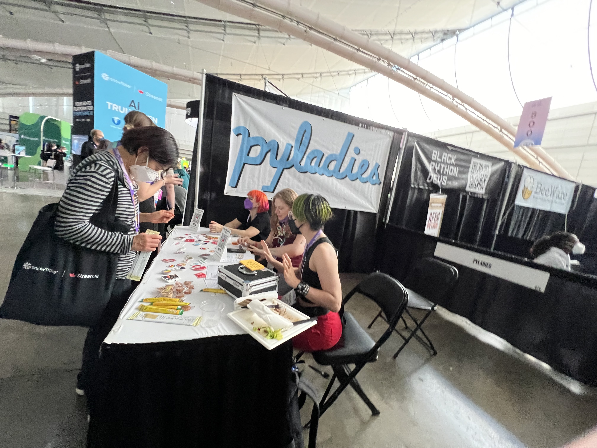
PyLadies Booth in the Expo Hall

Beautiful PyLadies t-shirt :) 

üîù [**back to top**](#table-of-contents)

### Building a JIT compiler for CPython

Brandt Bucher (Microsoft CPython Performance Engineering Team)

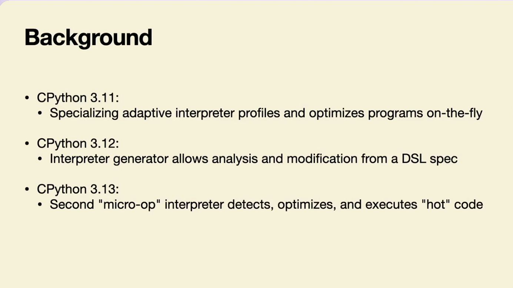
Updates that provided the foundation for a copy and patch JIT Compiler. 

In Python 3.13, a [JIT Compiler](https://peps.python.org/pep-0744/) was implemented. This was only possible, because of the work done in Python 3.11 and 3.12. 

In Python 3.11, a [Specializing Adaptive Interpreter](https://peps.python.org/pep-0659/) was implemented that brought a 25% performance improvement on average. At PyCon US 2023, Brandt gave a talk about it "[Inside CPython 3.11's new specializing, adaptive interpreter](https://www.youtube.com/watch?v=shQtrn1v7sQ)". 

In Python 3.12, infrastructure was implemented to automatically generate an interpreter from a DSL spec. This allowed for some repetitive, tedious, error-prone boilerplate to be removed from the main interpreter loop and different bytecode instructions to be analyzed. 

In Python 3.13, a second ["micro-op" interpreter](https://github.com/faster-cpython/ideas/issues/580) was implemented. It's an entirely separate execution pipeline that detects hot code paths and lowers them to a new bytecode format called "micro-ops." They are optimized and executed in another dedicated interpreter. 

Brandt showed how the pipeline works using a Fibonacci function as an example. He showed the code, the code's bytecode, and the stack. 

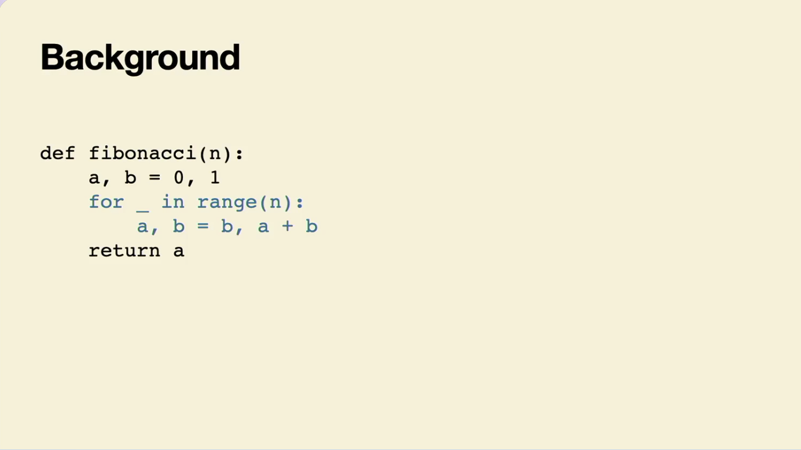
Fibonacci code

This is where specialized bytecode comes in. If the operation is generalized to accommodate many use cases, but the code's actual use case is simple, the bytecode can be "specialized" to fit that simpler use case. The resulting bytecode instructions are more specific to the the actual values, types of the code. 

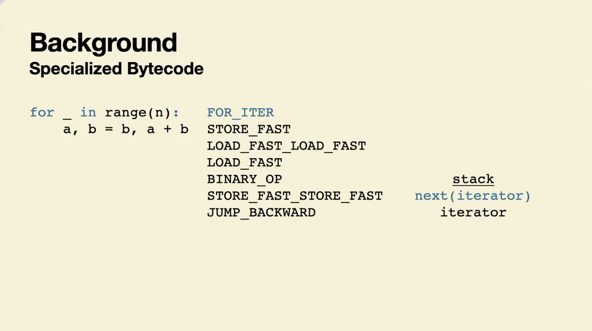
Implementing specialized bytecode

These instructions will now be broken down into smaller, more easily optimized parts called "micro-op traces." Instructions that are necessary in some cases, but not this case, can be removed. The result will be the essential instructions to execute the code. 

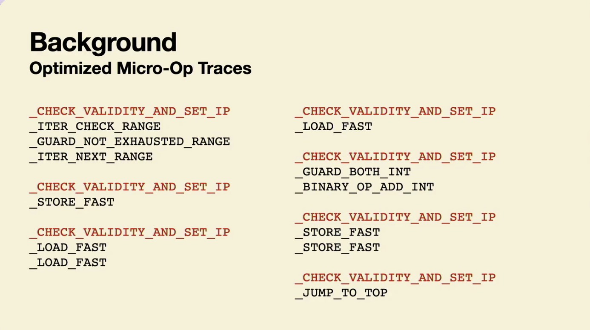
"micro-op traces"

Unfortunately, this new instruction format is more complex than basic bytecode instruction. Although each instruction is doing less work, there are more instructions. This is 20% slower than if we'd done nothing. Decoding each individual instruction in the micro-op interpreter is a lot more expensive. 

That is where JIT compilation comes in. 

Rather than decoding individual instructions in the interpreter, we can compile these optimized traces directly into machine code. 

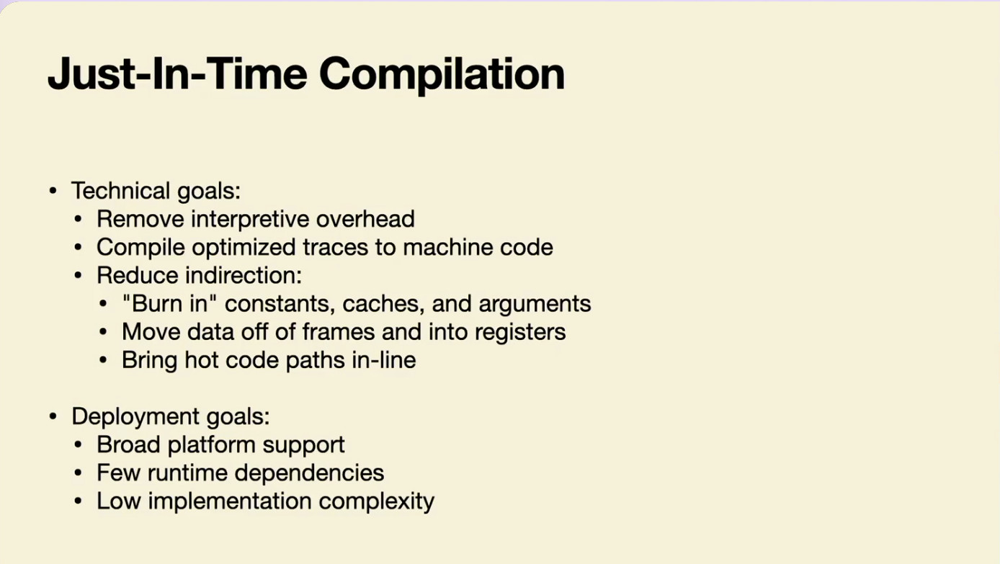
Just-in-time compilation

Python frame objects live out in heap memory. Instead, the stack can be moved to the register where it is immediately available and there is no latency. Rather than having a generic interpreter that needs to handle every possible micro-op, the hot code path can be transformed in a straight line sequence of the exact code needed. 

Although we want to make the faster, we need to trade peak performance for implementation simplicity that can enable Python to run in many places with few runtime dependencies and be easily maintained, improved, and extended upon by volunteers. 

While JIT compilers are historically complex, copy and patch compilation meets these requirements satisfying way. 

The technique is explained in a 30 page paper "[Copy and Patch Compilation](https://sillycross.github.io/assets/copy-and-patch.pdf)" and a blog post "[Building a baseline JIT for Lua](https://sillycross.github.io/2023/05/12/2023-05-12/)" by the same author. 

In a nutshell, it's a way of automatically turning a C interpreter into a fast template JIT compiler

Copy and patch can enable us to take a sequence of bytecode instructions and translate it into fast machine code as quickly as possible. 

At runtime, walk over a sequence of bytecode instructions. For each, we can do something we have long been able to do when linking or reloading a relocatable object file
* Copy some static, pre-compiled machine code into executable memory
* Patch up instructions that need to have runtime data encoded into them (things like relocation records for extern symbols)

Brandt walked through an example of how to go from micro op instruction to code we JIT at runtime. 

At build time, when we are building the Python interpreter, the body of the instruction is extracted. It is put inside of its own function to be compiled in isolation. It won't compile yet, because we are accessing objects with no values. These can be dynamically passed into the function as arguments. In terms of the "undefined locals" that will be the same once JIT-ed, and the frame and pointer that needs to be passed on so that we can JIT any additional micro-ops that we are JIT-ing, copy and patch gives an elegant solution for handling these: externs. Externs are similar to Python imports. You trust them to be defined at runtime. 

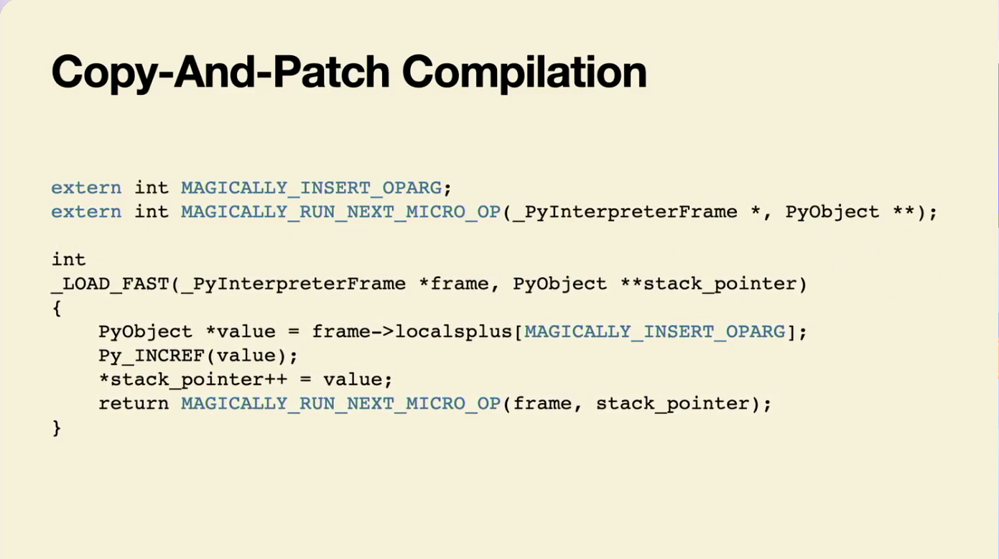
externs

When compile this in Clang, the ELF file will have the raw bytes of machine code to execute the micro-op instruction and exactly where and how to patch values. 

We then have the opportunity to perform some localized optimizations until it is the essential micro-op. This can be parsed out of the ELF file and put directly into code generated in a C header file. We have a function that can be called and it will JIT the instruction for us by copying bytes and patching the load. 

This is super fast. 

Because [LLVM](https://llvm.org/) is used, there is a lot of platform support out of the box.

In order to build this yourself, you need to have LLVM 18 installed and follow the instructions in the CPython repo. 

üîù [**back to top**](#table-of-contents)

### Unlocking the Parallel Universe: Subinterpreters and Free-Threading in Python 3.13

Anthony Shaw created a [gist](https://gist.github.com/tonybaloney/24d545ed855a3c90f844209152835f07) with the excellent pre-requisites for his talk. 

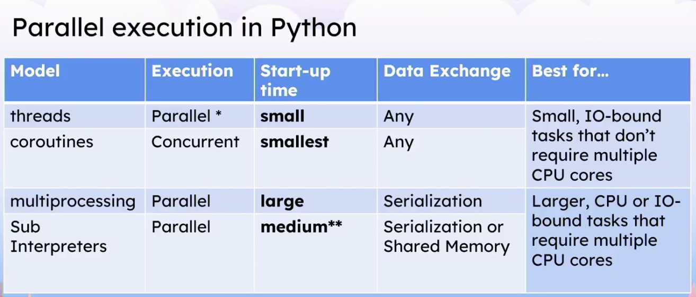
Parallel execution options in Python; In concurrency, multiple tasks share the same resource, while in parallelism, multiple resources execute multiple tasks. 

In Python 3.11, the GIL lived in the interpreter and we had one GIL per Python process. Multi-processing was used to achieve parallel code execution. If a task were split in half, it would take twice as long, because only one process could run at a time. 

In Python 3.12, because of a new API, the GIL is per interpreter. We can have multiple interpreters running at the same time with multiple threads. The operating system will figure out which core is available and schedule so they run in parallel. 

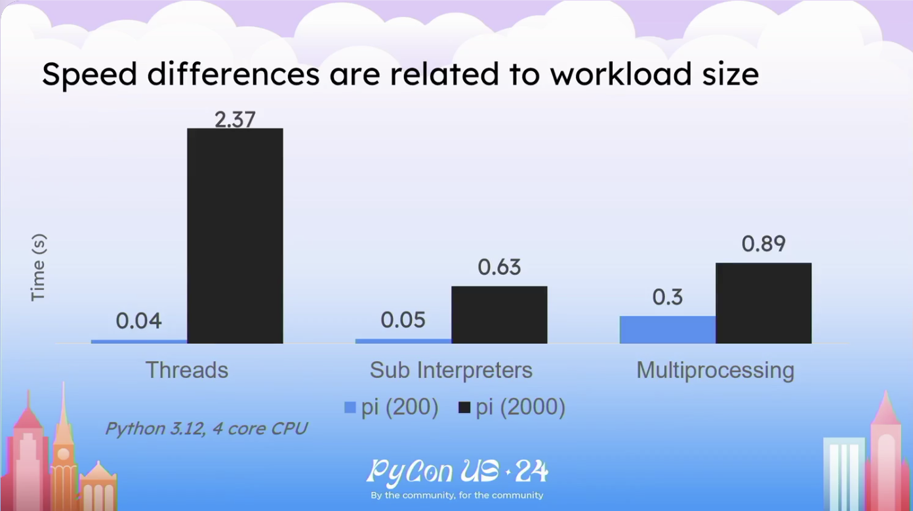
Speed differences

Quick conclusion: a subinterpreter is like "multiprocessing with less overhead and shared memory"

In Python 3.13, we can disable the GIL and have a single interpreter running multiple threads at the same time. A task split in half will run more quickly now, because it will run in parallel. 

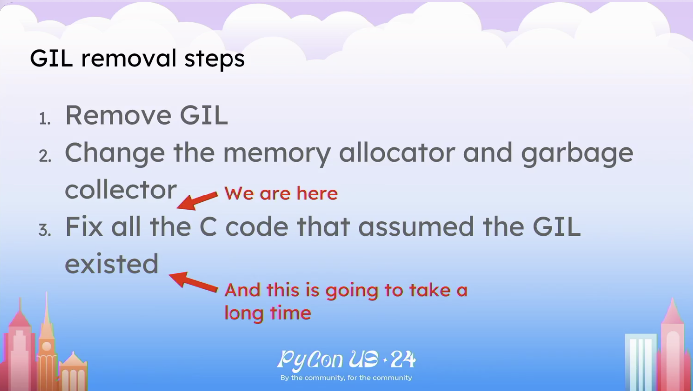
Steps to remove GIL

Free-threading introduces a new ABI that requires special wheels and a special build for CPython, creating compatibility issues. The ABI (application binary interface) is used to load a module that is being compiled in a language like C. 

The GIL exists for thread-safety. We need to fix all of the C code that assumed the GIL existed and is not thread safe. 

If everything is in pure Python, the Python team has full control over the interpreter. C extension compatibility poses a major challenge. Ironically, we have so many C extensions, because people optimized code, because they couldn't run it in parallel. 

At the moment, disabling the GIL generally makes Python code run slower. There are optimizations that have been disabled when the GIL is turned off, because they need to be made thread-safe before they can be used. 

Anthony gave a demo followed by some closing thoughts with Terms and Conditions. 

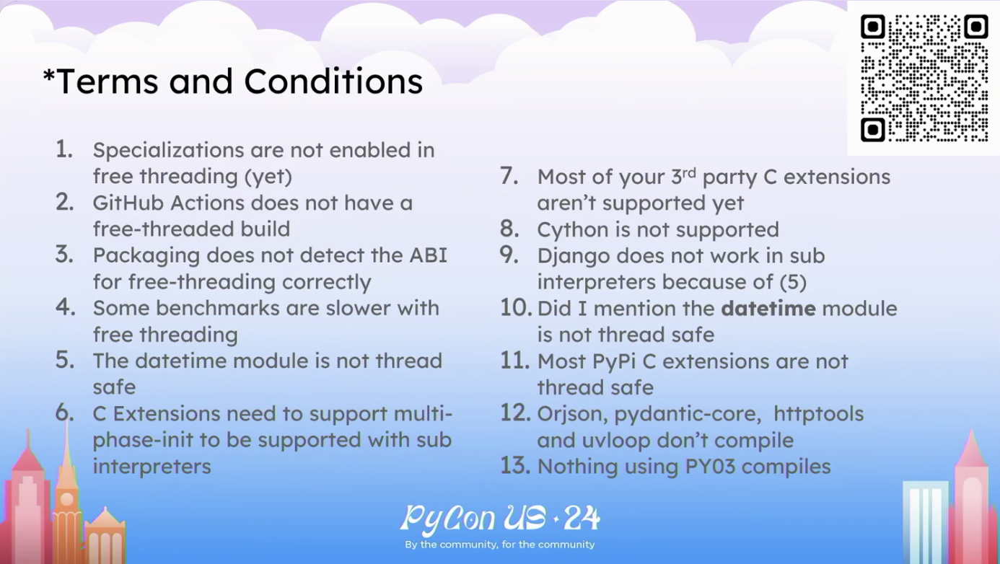
Terms and conditions

üîù [**back to top**](#table-of-contents)

### Sync vs. Async in Python: Tools, Benchmarks, and ASGI/WSGI Explained

This talk by Arun Suresh Kamar was going on while I was in Anthony's talk. It is at the top of my list to watch on demand. 

üîù [**back to top**](#table-of-contents)

### Sumana Harihareswara Keynote

"Untold Stories from Six Years Working on Python Packaging"

I met Sumana (Changeset Consulting, Python packaging, Recurse Center) at PyGotham 2017 and attended the [Art of Python](https://pycon-archive.python.org/2019/hatchery/artofpython/) miniature arts festival that she organized at PyCon US 2019. It was wonderful to see her in her element at PyCon US 2024, on stage talking about Python packaging. 

From 2017 to 2022, Sumana was a paid packaging project manager. She worked on things we use a lot, like pip. 

Key takeaways
* A chance meeting led Sumana to help obtain funding from Mozilla and overhall PyPI to Warehouse, finishing on time and on budget and unblocking more improvements
* The strength of weak ties, cross pollination are possible because of the kind of conversations that happen at places like PyCon US
* Infrastructure is hard, it's often invisible. People depend on it, but don't know that they depend on it. Sumana compared it to being a water user. 
* If volunteers try to get the word out about changes and even ask for your feedback, treat them like people. We are all in this together. 
* When PSF gets funding, it gets results (see a list in the [PyPI sponsors page](https://pypi.org/sponsors/)) 
* Organizations that rely on this infrastructure (and may have entitled opinions) can do a lot more to help
* What seems like failure can prepare the ground for success: building organization, networks, knowledge, skill can be crucial for future successes you can't foresee at the time
* Sumana revised a bill to the NY City Council until it passed: The HEART Act to make Automated External Defibrillators more accessible to New Yorkers.
* She wasn't a Python packaging expert, but also wasn't a public health expert. She planned and asked the right question until she got an answer. 
* You too can be the paddles that revive something that is stuck, in open source, local government
  
Homework
* Renew a connection: reply to an old friend or colleague
* Practice [Volunteer Responsibility Amnesty Day](volunteeramnestyday.net): on June 20th have a 20 minute meeting with yourself to think about your choices
* Consider solidarity

Sumana created a page with all of her excellent [keynote references](https://harihareswara.net/posts/2024/references-pycon-us-keynote/). 

I got to say hello after the keynote and also had the chance to meet her husband Leonard Richardson, who authored [Beautiful Soup](https://beautiful-soup-4.readthedocs.io/en/latest/), another one of my favorite packages. :) 

Leonard handed me a mini-zine called "Tool Safety" that he had written. After I got home and started looking through it, I saw that it had a beautiful message. You can see the online version [here](https://www.crummy.com/software/BeautifulSoup/zine/).

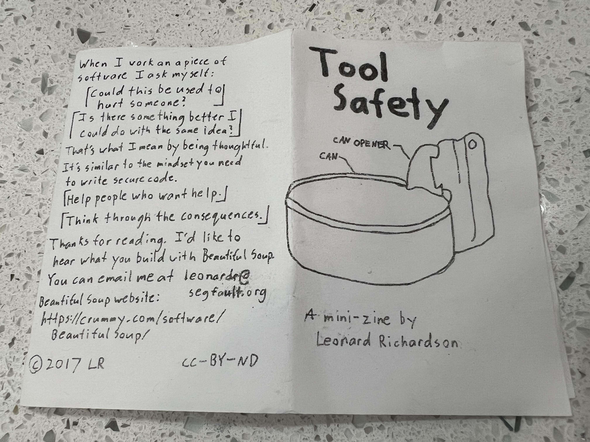
Tool Safety mini-zine cover and page 3

As a bonus, before the talk began, I met Brian Walker who was sitting in my row. He's a "Digital Billboard Jedi Master" software engineer working at Watchfire. 

üîù [**back to top**](#table-of-contents)

### Steering Council Updates

Current Python Steering Council Members: Emily Morehouse (Cuttlesoft), Barry Warsaw, Pablo Galindo Salgado, Thomas Wouters (Google), Gregory P. Smith (To be determined)

üîù [**back to top**](#table-of-contents)

#### Barry Warsaw: Steering Council Overview

The steering council is a five-person elected governance body responsible for the technical direction of Python: the evolution of the Python language, the CPython interpreter, and standard library. Elections happen annually, roughly aligned with Python releases. 

Steering council members serve for one year and can run for re-election with no term limits. They are typically nominated and elected by CPython Core Devs, but you don't have to be a CPython Core Dev to serve. No more than two members can work for the same company.

The steering council meets almost every week for 90 minutes. They are regularly joined by Deb Nicholson and Łukasz Langa. They discuss many topics which often come to their attention through the public GitHub tracker. A few of their important tasks: determining release cycle, choosing next release manager, pronouncing PEPs. The steering council has the final say on PEPs.  

[PEP 13](https://peps.python.org/pep-0013/) outlines how the Python Steering Council operates. 

üîù [**back to top**](#table-of-contents)

#### Gregory P. Smith: Steering Council Expenditures Update

How the steering council has spent PSF money to improve CPython
* Developer in Residence (team of 3 now: Łukasz Langa, Petr Viktorin, Serhiy Storchaka)
* Security Developer in Residence: Seth Michael Larson
* Steering Council Secretary: offer recently extended to Velda Kiara
* Annual Core Developer Sprints

üîù [**back to top**](#table-of-contents)

#### Emily Morehouse: Councils and Working Groups Update

Firstly, Emily explained their role. As Python evolves, the requirements for helping change. Councils and working group members are experts in complex, specialized subjects. These groups report to the steering council and are able to help with decision making and management, such as reviewing and pre-approving PEPs. 

Three working group changes
* [PEP 732: The Python Documentation Editorial Board](https://peps.python.org/pep-0732/)
* [PEP 731: C API Working Group Charter](https://peps.python.org/pep-0731/) (CPython's API exposes certain aspects of Python internals and gives direct access to the Python interpreter from C and C++)
* [PEP 729: Typing Governance Process](https://peps.python.org/pep-0729/)

The C API Working Group has a new [repo](https://github.com/capi-workgroup). 

üîù [**back to top**](#table-of-contents)

#### Thomas Wouters: Overview of Python 3.13

Thomas Wouters, Python 3.12 and 3.13 Release Manager, gave an overview of 3.13

Breaking changes
* [PEP 594: Removing dead batteries from the standard library](https://peps.python.org/pep-0594/) (might put some back if too disruptive)
* Removed many deprecated functions and classes
* "Removed" many private C functions

Type Annotation
* [PEP 696: Type Defaults for Type Parameters](https://peps.python.org/pep-0696) (James Hilton-Balfe)
* [PEP 702: Marking deprecations using the type system](https://peps.python.org/pep-0702/) (Jelle Zijlstra)
* [PEP 705: TypedDict: Read-only items](https://peps.python.org/pep-0705/) (Alice Purcell)
* [PEP 742: Narrowing types with Typels](https://peps.python.org/pep-0742) (Jelle Zijlstra)

Platform Support
* [PEP 602: Annual Release Cycle for Python](https://peps.python.org/pep-0602/) (Łukasz Langa)
* [PEP 730: Adding iOS as a supported platform](https://peps.python.org/pep-0730/) (Russell Keith-Magee)
* [PEP 738: Adding Android as a supported platform](https://peps.python.org/pep-0738/) (Malcolm Smith)
* macOS on Apple Silicon (M1/M2/M3) is now Tier 1

Despite saying there are no major new features in Python 3.13, Thomas acknowledged some exciting new developments. 
* A new interactive interpreter based on PyPY's, with color, multi-line editing, and paste support
* [PEP 744: JIT Compilation](https://peps.python.org/pep-0744/) (Brandt Bucher)
* [PEP 703: Making the Global Interpreter Lock Optional in CPython](https://peps.python.org/pep-0703/) (Sam Gross)

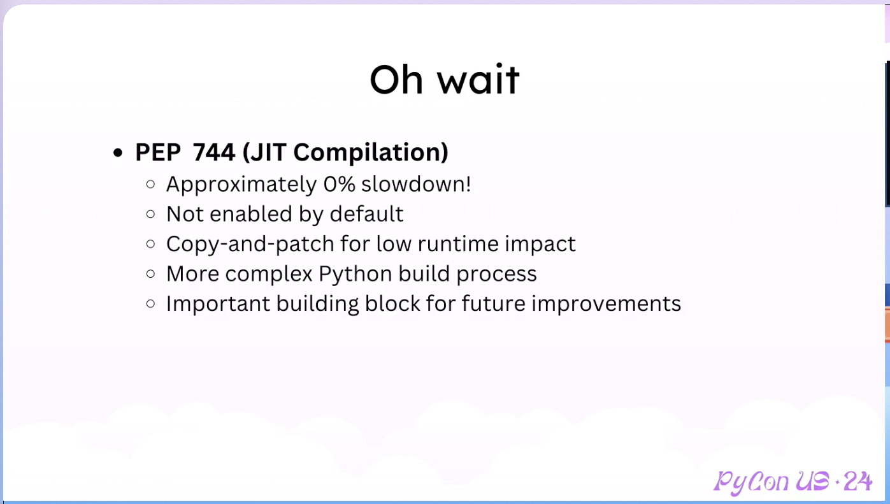

Why even upgrade?
* Improved error messages (again)
* Many bug fixes (not all of them can be backported to 3.12)
* Many new features in standard lib modules
* Stepping stone for future improvements
* Discover what newly deprecated APIs you are using

The 3.13 beta is out now! See the full release notes at [What's New in Python 3.13](https://bit.ly/python313). 

Thomas noted that incoming release manager Hugo van Kemenade has proposed switching to CalVer. He gave a talk "[Should Python adopt CalVer](https://hugovk.github.io/python-calver/)" at the Language Summit. 

üîù [**back to top**](#table-of-contents)

#### Pablo Galindo Salgado: Free-Threading Update (a.k.a. No GIL)

Pablo outlined the free-threading plan. 

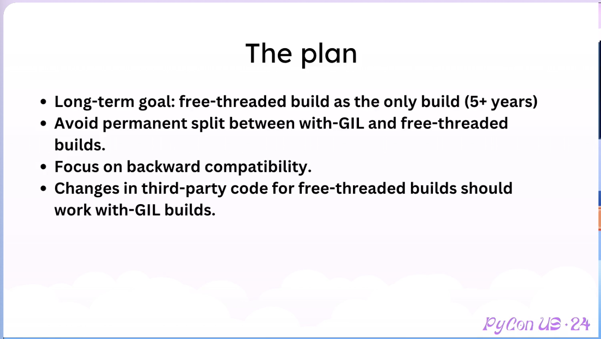
The plan

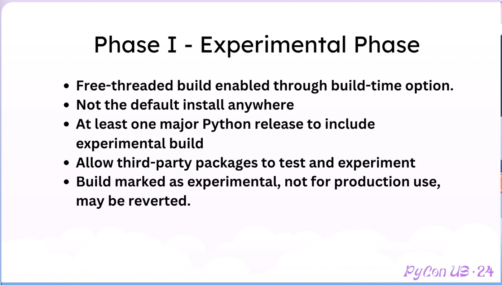
Experimental phase

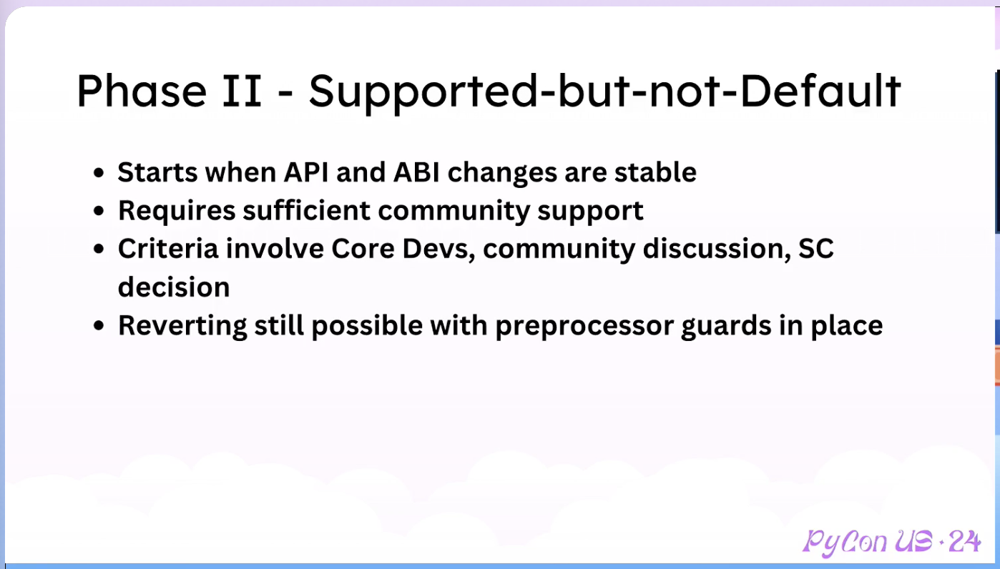
Supported, but not default

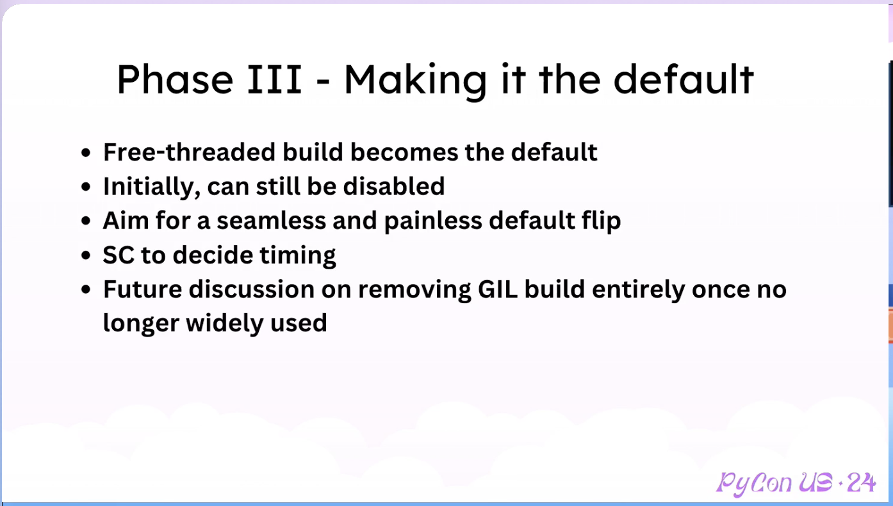
Making it default

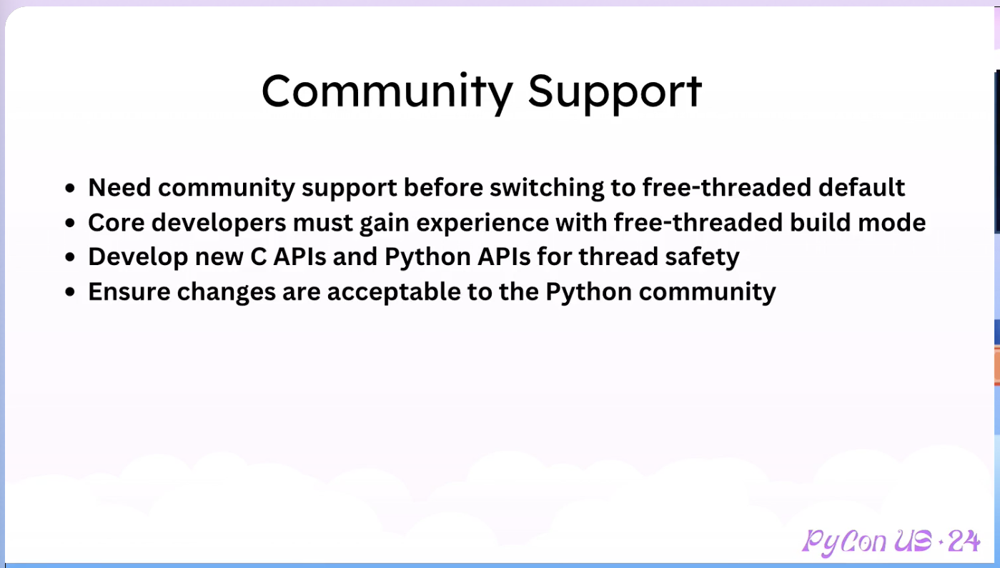
Community

Closing thoughts
* The CPython Core Team will regularly assess progress and work to prevent prolonged backward compatibility struggle
* If things become problematic, it can be called off
* Lessons have been learned. This will be neither Python 2 to 3, nor Python 4.
* Free-threading is available on Python 3.13 with an optional flag and environmental variable

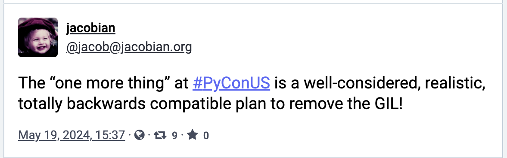

This thing is really happening. It feels like we went from Brett Cannon's "put up or shut up" to this pretty quickly, lol.

üîù [**back to top**](#table-of-contents)
 
### Dinner and Ice Cream

After the conference ended on Sunday night, I found myself chatting with a group of old friends and new friends. They invited me to dinner, and I decided to join. It was a wonderful time, as you can tell from the photo. :) 

Tammy Do (Code Fellows), Velda Kiara (DEFNA Board Member, Python Steering Council Secretary), Jim Anderson (Motorola Solutions, Real Python), Ngazetungue Muheue (LaLoka Labs, DjangoCon Africa), Kudzayi Bamhare, Benedict Kofi Amofah, me, Afi Gbagado, and Catherine Devlin (Corning, formerly Disney)

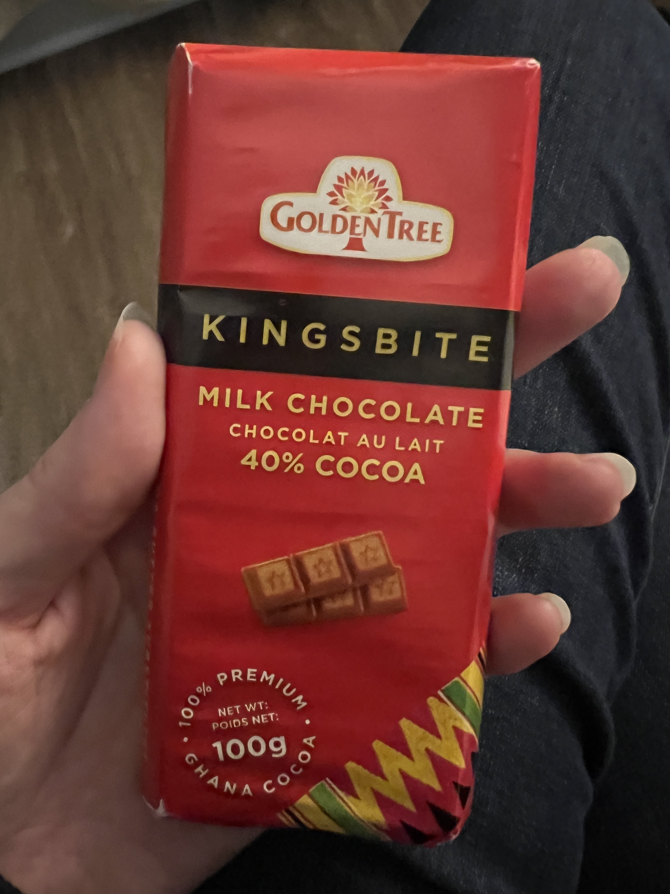
Chocolate bar made by a Ghanian company and given to me by Afi :) 

PyCon US had a [challenge](https://us.pycon.org/2024/about/pycon-us-challenge/). You could get points for completing certain activities and redeem them for an ice cream card. I was able to complete the challenge, because I had organized a Python-related conference (DjangoCon US 2023) and attended a regional Python conference (PyTexas 2024) since last PyCon US. After dinner, I went to [Milley's Homemade Ice Cream at Market Square](https://www.millieshomemade.com/location/market-square/) and used the ice cream card. I had Best Chocolate. Yummy! 

Best Chocolate :) 

üîù [**back to top**](#table-of-contents)

## Monday

At PyCon US 2019, on my last night in Cleveland, I spontaneously joined Sviatoslav Sydorenko (Ansible Core Developer), Stéphane Wirtel (CPython Core Developer), and a few other conference attendees at Flannery's Pub for dinner. It was magical.  

On the first day of the PyCon US 2024 Sprints, Sviatoslav Sydorenko and I found each other for a catch up. I suddenly made the connection that he is a core developer of [Ansible](https://github.com/ansible), a tool that I use. Mind blown. :) He gave me some insight about being a programmer versus engineer and distributed systems. It was a very enlightening conversation for me. 

I also met Seth Michael Larson (PSF Security Developer in Residence) in person in the packaging sprints room. I have been following his security work, which has included [Visualizing the CPython release process](https://sethmlarson.dev/security-developer-in-residence-weekly-report-9), [making CPython source release Software Bill-of-Materials (SBOMs) available](https://pyfound.blogspot.com/2024/02/software-bill-of-materials-now-available-for-cpython.html), and [getting the PSF set up as a CVE Numbering Authority](https://www.cve.org/Media/News/item/news/2023/08/29/Python-Software-Foundation-Added-as-CNA). He told me more about his background and work. His [blog](https://sethmlarson.dev/) is an awesome source of info, and I highly recommend following him for news! 

Interactions like these brought to mind a post by Frank Wiles: 

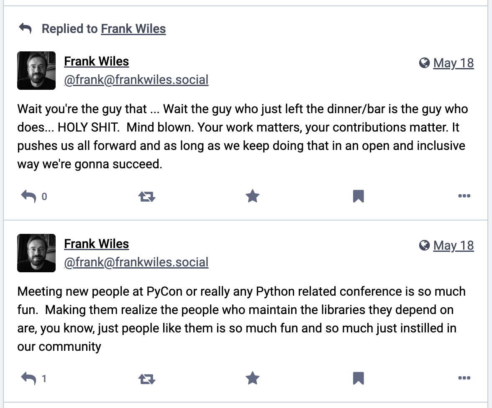

üîù [**back to top**](#table-of-contents)

## Until Next Time

Thank you to everyone for making this a truly epic experience. The talk replays should be public soon. 

If you are looking for another conference experience, check out the mega-regional conference list in the closing presentation. 

After chatting with a PSF Staff Member a few years ago about location selection, I assumed that PyCon US would never be held in a high cost of living city. 

It was announced that PyCon US 2026 will be in Long Beach, California. 

Last year, I treated myself by taking [my dream Los Angeles vacation](https://katherinemichel.github.io/portfolio/los-angeles-2023.html) in December. I loved it, and I can't wait to go back for PyCon US! :)

In the meantime, I hope to see you all in Pittsburgh next year!

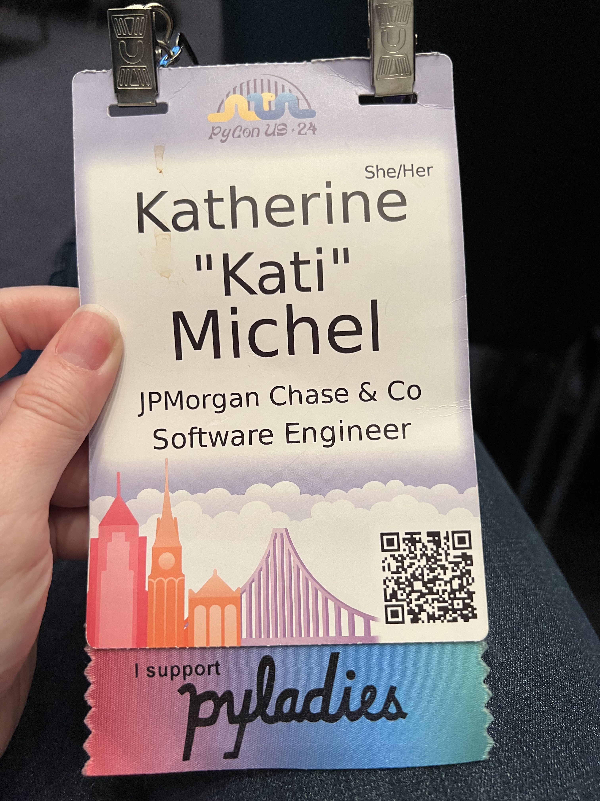

üîù [**back to top**](#table-of-contents)
