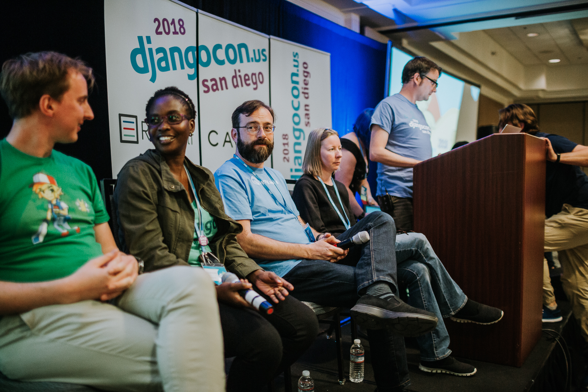
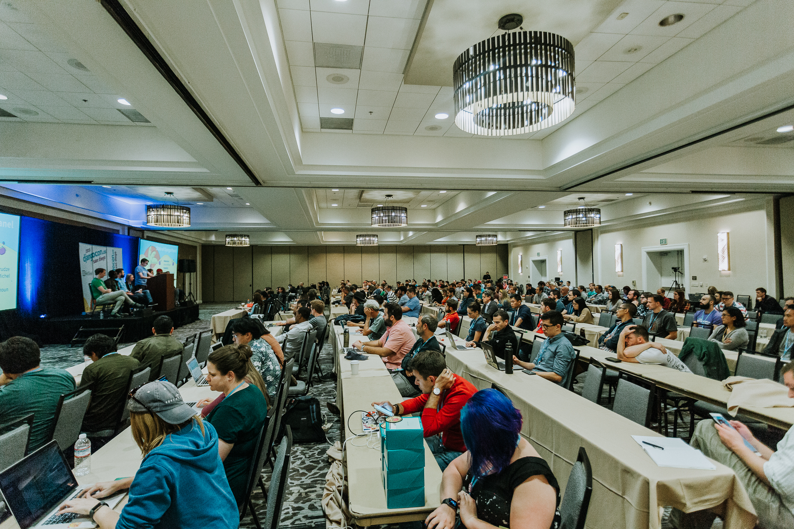

# Speaker, Board, and Organizer Photos

Table of Contents
-----------------

- [Speaker Photos](#speaker-photos)
- [Board Photos](#board-photos)
- [Organizer Photos](#organizer-photos)
  
## Speaker Photos

### JPMorgan Chase 2023- DjangoCon US Recap

### DjangoCon US 2021

October 21-23, online

My pre-recorded talk Get a Jumpstart on Collaboration and Code Review in GitHub playing simultaneously in English and Spanish

My pre-recorded talk Get a Jumpstart on Collaboration and Code Review in GitHub playing simultaneously in English and Spanish

### DjangoCon US 2018- State of Django Panel

On stage; photo credit: Bartek Pawlik (https://bartpawlik.format.com/)

Speaking; photo credit: Bartek Pawlik (https://bartpawlik.format.com/)

Panel and crowd; photo credit: Bartek Pawlik (https://bartpawlik.format.com/)

Panel and crowd; photo credit: Bartek Pawlik (https://bartpawlik.format.com/)

### DjangoCon US 2017- Get a Jumpstart on Collaboration and Code Review in GitHub Talk

On stage; photo credit: Adam Gregory (https://atomimages509.wixsite.com/atom)

On stage

Speaker photo; photo credit: Adam Gregory (https://atomimages509.wixsite.com/atom)

### DevICT Hacktoberfest Meetup- Get a Jumpstart on Collaboration and Code Review in GitHub Talk

Speaker photo

## Board Photos

### DjangoCon US 2023

DEFNA Board group photo; photo credit: Bartek Pawlik (https://bartpawlik.format.com/)

## Organizer Photos

### DjangoCon US 2023

October 16-20, Durham, North Carolina

Organizers group photo; photo credit: Bartek Pawlik (https://bartpawlik.format.com/)

Organizers during closing remarks (I am hidden behind Dawn lol); photo credit: Bartek Pawlik (https://bartpawlik.format.com/)

### DjangoCon US 2022

October 16-21, San Diego, California

Organizers group photo; photo credit: Bartek Pawlik (https://bartpawlik.format.com/)

Organizers during closing remarks; photo credit: Bartek Pawlik (https://bartpawlik.format.com/)

### DjangoCon US 2019

September 22-27, San Diego, California

Organizers group photo; photo credit: Bartek Pawlik (https://bartpawlik.format.com/)

Organizers during closing remarks; photo credit: Bartek Pawlik (https://bartpawlik.format.com/)

### DjangoCon US 2018

October 14-19, San Diego, California

Organizers group photo; photo credit: Bartek Pawlik (https://bartpawlik.format.com/)

Organizers during closing remarks; photo credit: Bartek Pawlik (https://bartpawlik.format.com/)

Organizers during closing remarks; photo credit: Bartek Pawlik (https://bartpawlik.format.com/)

### DjangoCon US 2017

August 13-18, Spokane, Washington

Organizers during closing remarks; photo credit: Adam Gregory (https://atomimages509.wixsite.com/atom)
