# 2023 Recap

## Daily Work

Throughout the year, I led/co-led the completion of a variety of substantial code features at JPMorgan Chase. I had the opportunity to lead team meetings such as Sprint Retro and Sprint Review and Demo. I gave code deep dives and demos to team members and managers. 

I was an onsite liaison to Gaia Gemfire Team. 

I went further in my understanding of multitenancy and orchestration. 

This knowledge and experience led to some wonderful, impromptu conversations at DjangoCon US with former Canonical employee, now new Django Fellow Natalia Bidart and a group of Red Hat employees I had the good fortune to sit with at lunch. 

## Quality, Standards, Inner source

Throughout the year, I documented Python/Django standards and code quality tools. 

I shared my open source experience. I documented best-in-class open source and inner source governance resources and methods. 

I mentored an apprentice in doing so. 

In November, a co-worker and I co-presented about Advent of Code and increased the number of participants within our department. 

Advent of Code Presentation

## New Certifications

Continuous learning is important to me. This year, I earned three new certifications. 

In May, I obtained an [AWS Cloud Practitioner Certification](https://aws.amazon.com/certification/certified-cloud-practitioner/). This certification has enabled me to better "speak" the common language of AWS. 

In July, I obtained CockroachDB [Introduction to Distributed SQL and CockroachDB](https://university.cockroachlabs.com/courses/course-v1:crl+intro-to-distributed-sql-and-cockroachdb+self-paced/about) and [Practical First Steps with CockroachDB](https://university.cockroachlabs.com/courses/course-v1:crl+practical-first-steps-with-crdb+self-paced/about) certifications. I really enjoyed [CockroachDB University](https://university.cockroachlabs.com/). The lessons were succint, yet very well communicated how CockroachDB works and what sets it apart from Postgres. 

## Tangential Learning

I learned the term "tangential learning" from my colleague and friend Neetu Jain who also happens to be the DFW Women in Product Chapter Lead/Chair. 

Throughout the year, I attended JPMorgan Chase Product Ignite and DFW Women in Product events. The content was outstanding, and I thoroughly enjoyed the focus on user. 

During the second quarter, I took part in a five-part security competition and finished close to the top 10%. 

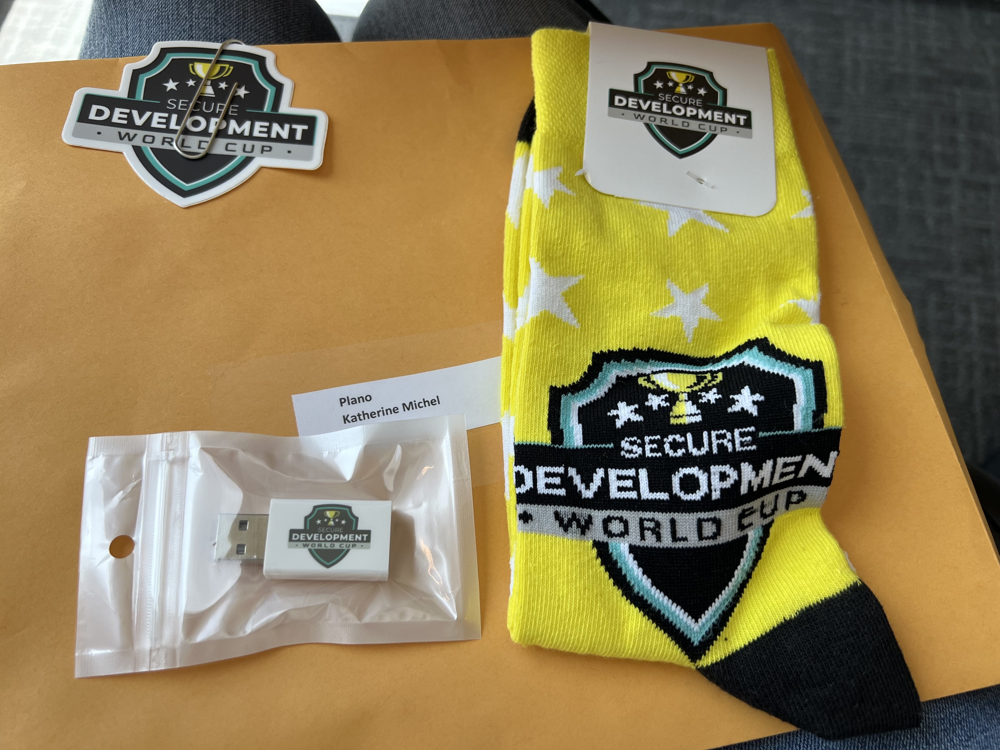
Secure Code swag

## PS Connect

In July, I obtained sponsorship from a JPMorgan Chase Managing Director to start a monthly departmental meetup in Plano that became known as PS Connect. I have had the opportunity to work with tech leads across teams to execute a highly successful launch and continue to grow it into a fun, sustainable, and value adding event. 

I was invited to give a DjangoCon US Recap presentation at our PS Connect Christmas Party December 6. It was a great opportunity to do some public speaking and get to know my department colleagues better.

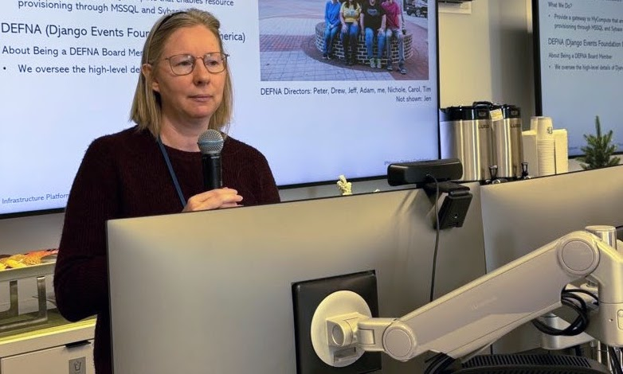  
Christmas Party presentation

  
Christmas Party presentation

I am looking forward to seeing the new connections yet to come. 

## Diversity and Inclusion

During the second quarter, I completed a JPMorgan Chase [Women on the Move](https://www.jpmorganchase.com/impact/people/women-on-the-move) (WoTM) Career Development Program. This outstanding program featured high impact modules on subjects such as fixed versus growth mindset, skill inventory, and an outstanding negotiation workshop led by Kathryn Valentine of [Worthmore Strategies](https://worthmorestrategies.com/). 

Throughout the year, I had the opportunity to attend a number of powerful, internal WoTM and Take It Forward (TIF) events. 

In June, I took part in the JPMorgan Chase Innovation Week Global Hackathon with a project in the DE&I category. My teammates' backgrounds ranged from product to user experience and design. We participated in the finals. Although we did not win, it was a great experience, and I made some new friends. 

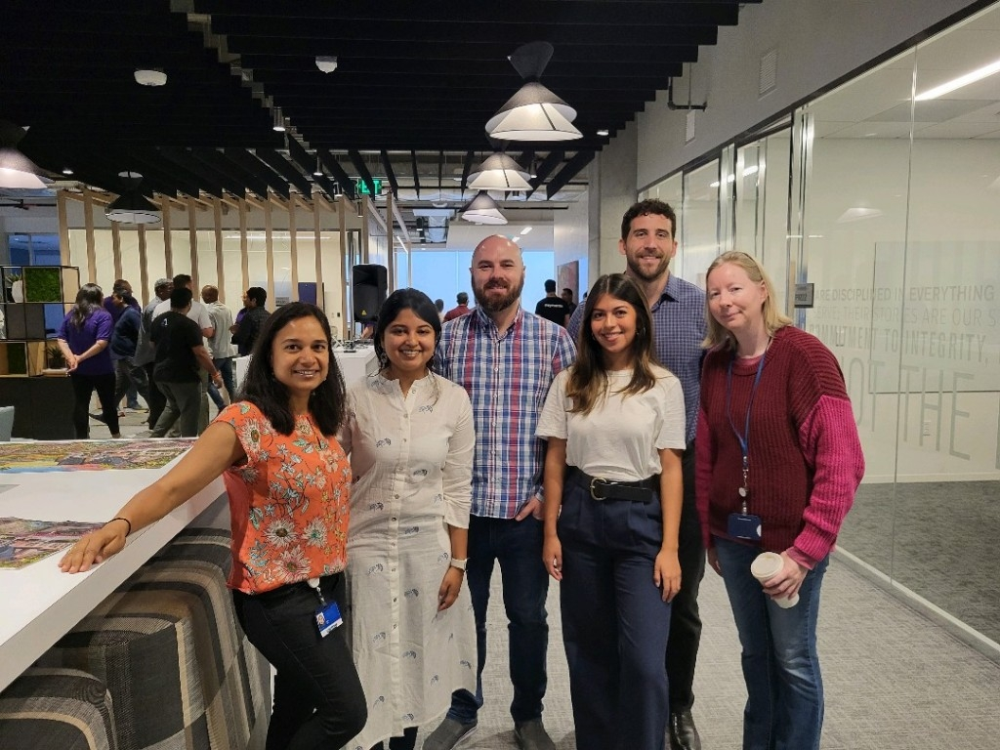
My wonderful hackathon Team... so talented and passionate!

Beautiful Take It Forward (TIF) Cup

## DEFNA

I served another year as a [DEFNA](https://www.defna.org/) Board Member. I challenged myself to do more "heavy lifting." 

During the first quarter, I helped oversee the [DjangoCon US](https://2023.djangocon.us/) website design by publishing our CfP, working to secure a web design contractor, and taking part in website design meetings. 

In May, I created a [DjangoCon US Talk Topics Inspiration List](https://github.com/KatherineMichel/portfolio/blob/master/conference-blog-posts/topic-ideas-djangocon-us-2023.md) that was widely shared among leaders in the Django community and undoubtedly contributed to the number of DjangoCon US talk proposals increasing from 158 the year before to 185. 

The list kickstarted a conversation that led to a talk by new Django Fellow Natalia Bidart: "[Inside Out: My Journey of Understanding Inclusion](https://www.youtube.com/watch?v=jYAeO37-420)." 

I went further in my understanding of our location/venue considerations, budget, and contract negotiations. 

I also identified an outstanding board candidate who later joined.

## DjangoCon US

In October, I attended DjangoCon US and made the most of the experience. 

In addition to being there as a DEFNA Board member, as an attendee, I made many new connections (including [Python Software Foundation (PSF) Executive Director Deb Nicholson](https://www.python.org/psf/records/staff/) and [Django Fellow Natalia Bidart](https://www.djangoproject.com/weblog/2023/mar/31/welcome-our-new-fellow-natalia-bidart/)), acquired new knowledge, and supported diversity and inclusion. 

See my [DjangoCon US Recap](https://github.com/KatherineMichel/portfolio/blob/master/conference-blog-posts/recap-of-djangocon-us-2023.md) for more info. 

<!--

DjangoCon US Organizers... a truly incredible group of people!
-->

## Django News Newsletter

Django News Newsletter is a fabulous newsletter published every Friday and filled with all of the most important Django news. I was honored to be included twice this year, first in May for my [DjangoCon US Talk Topics Inspiration List](https://github.com/KatherineMichel/portfolio/blob/master/conference-blog-posts/topic-ideas-djangocon-us-2023.md) and second in November for my [DjangoCon US Recap](https://github.com/KatherineMichel/portfolio/blob/master/conference-blog-posts/recap-of-djangocon-us-2023.md). 

## Stanford Code in Place Article

In April, Stanford Engineering featured me an article "[Stanford Engineering offers free online introductory programming course](https://engineering.stanford.edu/magazine/stanford-engineering-offers-free-online-introductory-programming-course)". I talked about my experience learning and teaching Python programming language as a Stanford Code in Place student in 2020 and section leader in 2021. It was an honor to be selected to take part from among thousands of participants. 

For more about my experience, check out my student recap "[Reflections on Stanford Code in Place](https://github.com/KatherineMichel/portfolio/blob/master/regular-blog-posts/reflections-on-stanford-code-in-place.md)" or my section leader [recap slides](https://github.com/KatherineMichel/stanford-code-in-place-section-leader). 

## Harvest Moon

On September 29 at 7:14 am, I happened to be walking down the campus main street, which I don't normally do. I looked up and saw the harvest moon. I snapped this stunning photo. 

Harvest Moon

## Travel, Food, and Fun

Throughout the year, I enjoyed what Plano had to offer. Thank you to my Plano friends for some great times! See a few pics at the end of this post. 

In December, I took the Los Angeles trip that I've been dreaming of taking for years. I'd had this trip planned twice before and cancelled, once due to wild fires, and once due to the pandemic. It was the last major US city on my bucket list. With Santa Monica as my "home base," I spent 9 days seeing the city. I plan to do a separate write-up of the trip soon. Stay tuned! 

Me on the Friends set during Warner Brothers Studio Tour

## Looking Ahead

I look forward to taking on increasingly more leadership on my team. 

I look forward to empowering engineers, including me, to produce higher quality code, be more productive, and engage with the wider community. 

A co-worker has invited me to teach beginner/intermediate Django to our colleagues at JPMorgan Chase. I hope to finish the curriculum in early 2024 and teach multiple sessions throughout the year. This is in addition to an offer to teach Python. 

I plan to attend [PyTexas](https://www.pytexas.org/) in Austin in April. It's a stone's throw from Plano and a conference I have wanted to attend for quite a few years. The conference will have a stellar kickoff with keynotes by [Carol Willing and Lynn Root](https://www.pytexas.org/2024/schedule/keynotes/)! 

I have yet to determine which other conference(s) I will attend, if any. Other conferences on my radar: PyCon US, DjangoCon US, DjangoCon Europe, PyCon Africa, PyGotham. 

I hope to visit Europe. It's next on my bucket list. :) 

## Plano Fun

Brasão Brazilian Steakhouse

Brasão Brazilian Steakhouse... many tasty meats brought to your table and sliced for you

Brasão Brazilian Steakhouse... authentic Brazilian side dishes

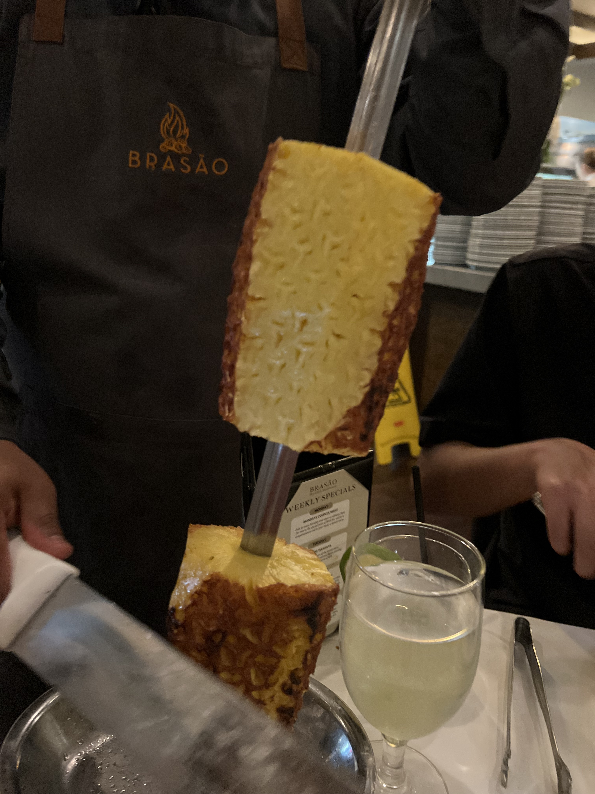
Brasão Brazilian Steakhouse... forget about the meat, the grilled pineapple is to die for!

Rodeo Goat... Burger Battle

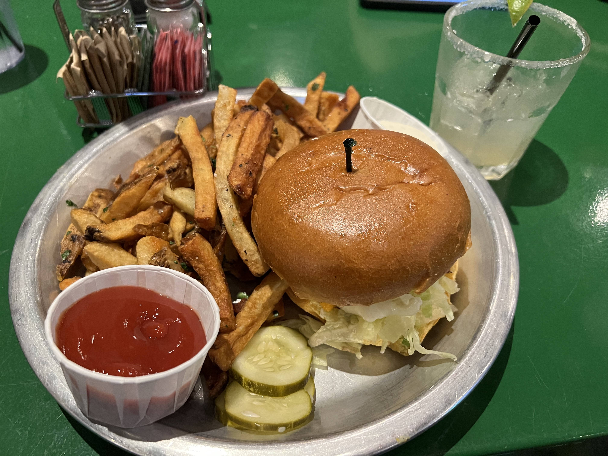
Rodeo Goat... yummy!

<!--
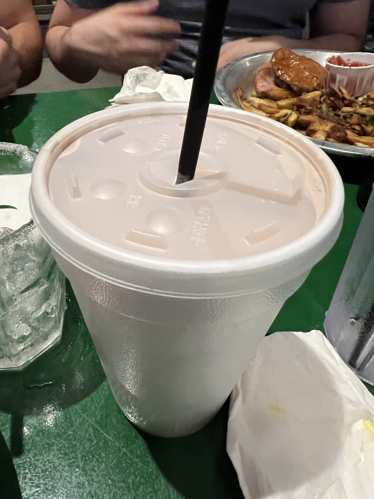
Rodeo Goat
-->

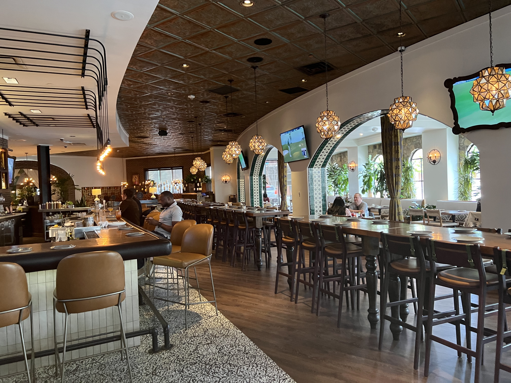
Mexican Sugar

Mexican Sugar... brunch! Yummy pork chop breakfast, including chips and their distinctive tasting salsa and pour over coffee

<!--
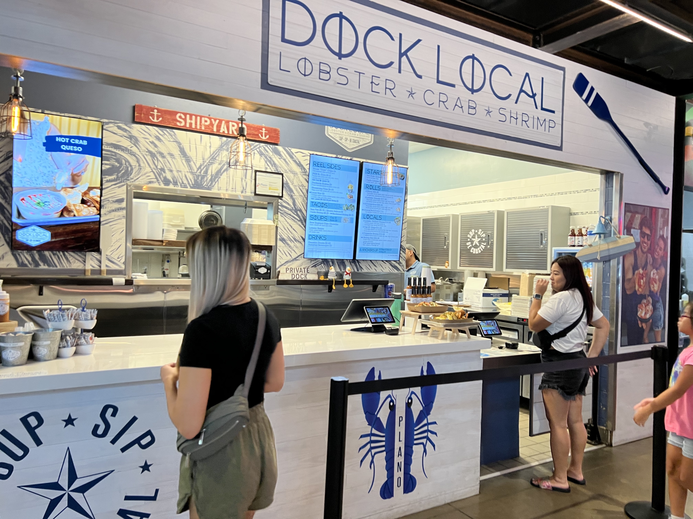
Dock Local
-->

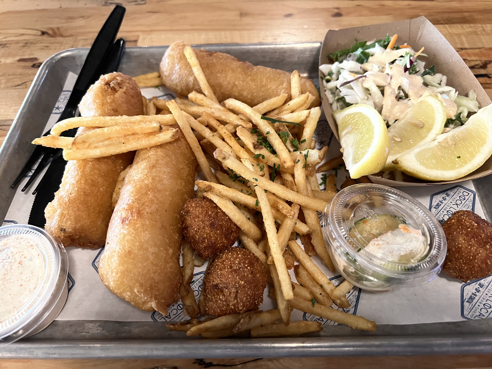
Dock Local fish and chips... highly rated seafood counter in Legacy Town Hall

Main Street Bakery in Legacy Shops... lots of beautiful and tasty treats!

<!--
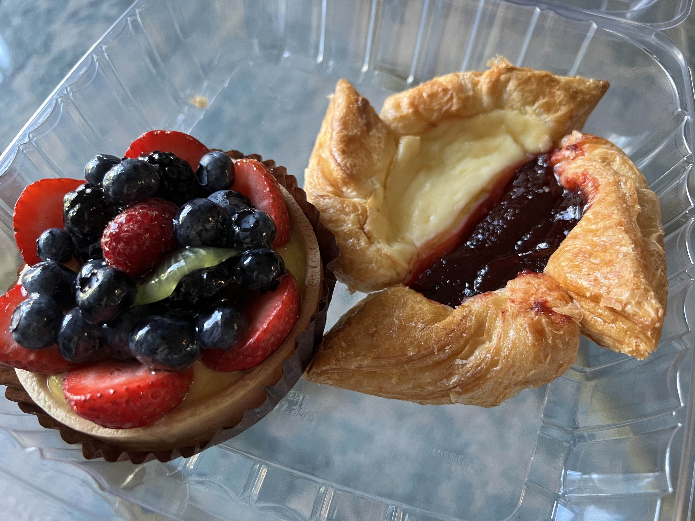
Main Street Bakery
-->

Bamboo House

Bamboo House Peking Duck... not my favorite food, but an interesting experience

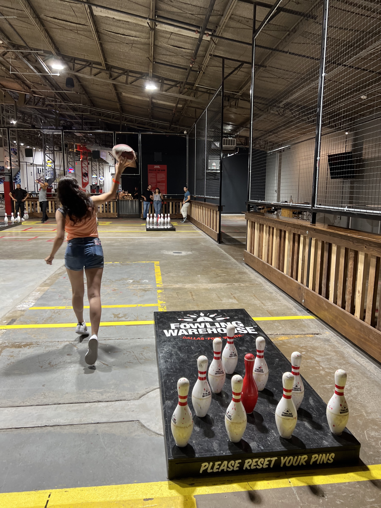
Fowling (football bowling... more difficult than it looks!)
