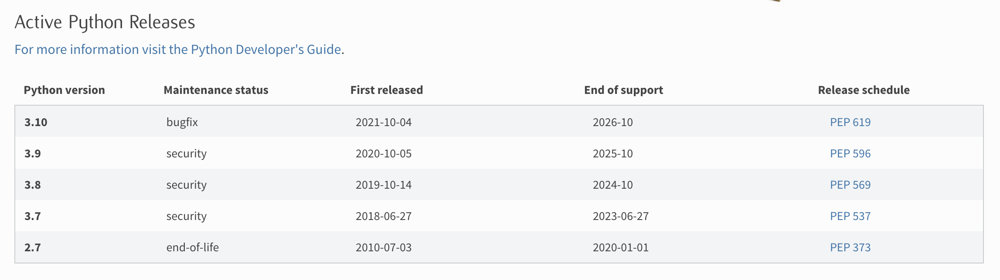

# Pinax Release Tutorial

Pinax has been a popular group of projects, apps, and themes for around 15 years and still has many users. 

A request was made recently to add support for Django 4.0 and 4.1. I decided it's time to create a new Pinax release plan. I've also created this tutorial to teach others how Pinax releases are done. Let's get started! 

## Background

Pinax includes a group of Django projects called [Pinax Starter Projects](https://github.com/pinax/pinax-starter-projects) that can be installed using [Pinax CLI](https://github.com/pinax/pinax-cli). These Pinax Starter Projects include relevant Pinax Apps that can be found in the [Pinax GitHub organization](https://github.com/pinax) or on PyPI via [Pinax keyword search](https://pypi.org/search/?q=pinax). 

This tutorial will focus on app release. 

## Release Plan

I create a release plan for each release. This serves several purposes. 

* It provides instructions for how to complete the release as it happens
* It enables newcomers to contribute more easily to a release
* It serves as a reference for future releases

Here is the WIP [Pinax 22.12 Release Plan](https://github.com/pinax/pinax/wiki/Pinax-22.12-Release-Plan/).

## Why Do a New Release? 

Pinax is based on the [Django](https://www.djangoproject.com/) framework, which is based on the [Python](https://www.python.org/) programming language. Like other software, Python and Django evolve over time. Features are added, bugs are fixed, and security flaws are patched. New releases of Python and Django are then published. By incorporporating new versions of Python and Django into Pinax, Pinax can benefit from these new features, bug fixes, and security patches. This is done through a release. Pinax releases can include new features, bug fixes, and security patches as well. 

## Knowing Which Versions of Python and Django to Include

In order to determine which Python and Django versions to incorporate into the release, check out the [Python downloads](https://www.python.org/downloads/) page, [Django downloads](https://www.djangoproject.com/download/) page, and [What Python version can I use with Django?](https://docs.djangoproject.com/en/4.1/faq/install/#what-python-version-can-i-use-with-django) section of the Django FAQs. 

We will want to include the Python and Django versions that are being actively supported. For one thing, unsupported versions of Python and Django no longer receive security patches. It's best to drop these versions and add new, supported versions. 

Current Python support schedule

Current Django support schedule

Not all versions of Python and Django are compatible together. Check out the "What Python version can I use with Django?" section of Django FAQs to see which Python and Django versions are compatible. This will help us create the test matrix and release documentation. 

Python and Django compatibility

## CircleCI and Tox

Tox environments created within the Pinax app directory `.tox` folder

Tox success! :) 

