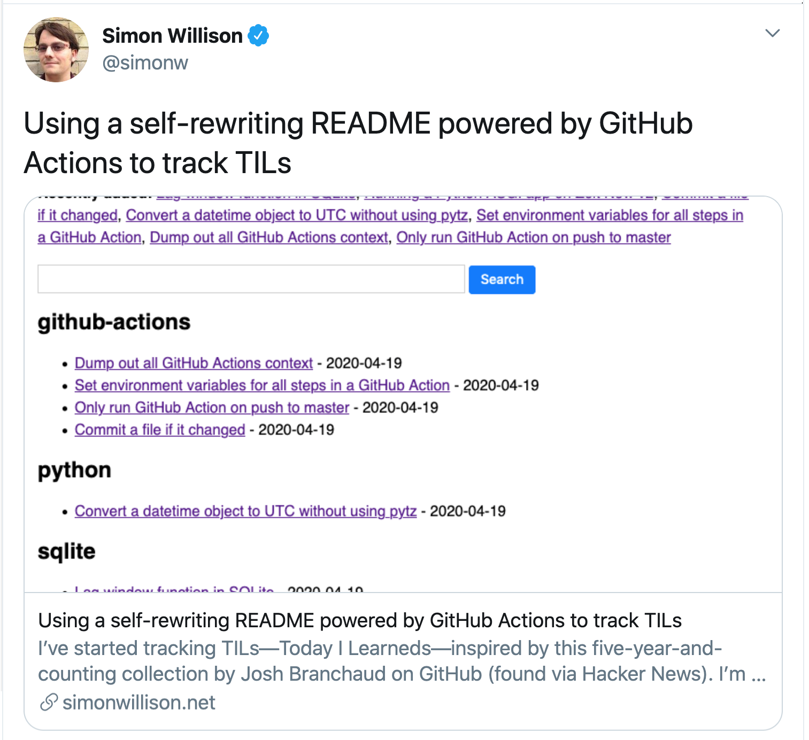
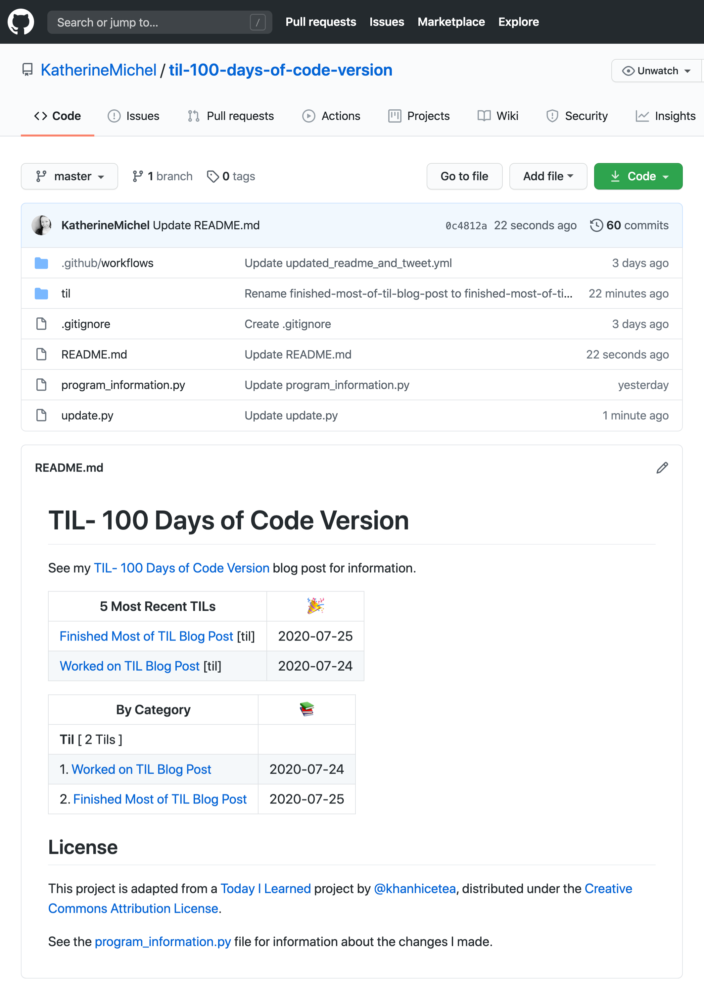

# TIL- 100 Days of Code Version

In April, I was looking through my Twitter newsfeed and came across a [tweet](https://twitter.com/simonw/status/1252050046566055937) by Simon Willison that piqued my curiosity.  



Caption: Simon's tweet

I had the good fortune to get to know [Simon](https://github.com/simonw/) when he was the moderator of a ["State of Django" panel](https://youtu.be/TrAFQW7Wza0) that I took part in at [DjangoCon US 2018](https://2018.djangocon.us/) and I've been following him on Twitter ever since. One of the original creators of the [Django](https://en.wikipedia.org/wiki/Django_(web_framework)) web development framework at the Lawrence Journal World, Simon can often be found discovering novel ways of doing things. So, when he comes across an "interesting" idea, I tend to take notice.

While looking at Hacker News, Simon had come across the idea of a self-rewriting README.md. The idea originated from a project called [TIL (Today I Learned)](https://github.com/jbranchaud/til), created by [Josh Branchaud](https://github.com/jbranchaud/) that was inspired by a [thoughtbot](https://github.com/thoughtbot/til) project of the same name. 

Simon re-implemented the idea in Python and wrote about it in a [blog post](https://simonwillison.net/2020/Apr/20/self-rewriting-readme/). 

In a nutshell, Simon's TIL repo contains a README.md and subject folders filled with TIL files. When Simon learns something new, he can open a corresponding subject folder, create a new markdown TIL file, and fill in what he has learned. When the new file is saved, a program runs and finds the change. In the README.md, each folder name is listed as a category with the names of the files contained in the folder listed below the category as TIL hyperlinks. The program rewrites the README.md, adding the new TIL file name under its category.


Caption: The beginning of Simon's TIL README.md

## Lightbulb Moment

There is so much to be learned from tech that for years now, I've been curating what I've learned in README.mds the old fashioned way, by hand, as a memory device. I've long known there was undoubtedly a more efficient way of doing it, but hadn't come across a specific better way, and my way worked well enough for the time being. 

Now that I knew about the self-writing README.md, it was clear that a similar implementation could be very helpful to me. I bookmarked the idea as something I would revisit.

## TIL- 100 Days of Code Version

Around the time of Simon's tweet, I was just beginning [Stanford's Code in Place](https://github.com/KatherineMichel/portfolio/blob/master/regular-blog-posts/reflections-on-stanford-code-in-place.md) course. When Code in Place ended, I wanted to continue building small, fun apps regularly. So, I started taking part in a popular initiative called [100 Days of Code](https://www.100daysofcode.com/). 

100 Days of Code participants spend 1 hour a day, most days, working on code-related learning and are encouraged to fork the official [100 Days of Code repo](https://github.com/kallaway/100-days-of-code) to keep a record of their work, as well as tweet their progress from day to day, in order to stay accountable. 

It's a great initiative and I can definitely feel my coding muscles becoming stronger over time. 

However, 100 Days of Code is largely self-guided, and at the beginning, I found myself having difficult settling into a routine. After a couple of weeks of feeling disorganized, I suddenly remembered the idea of a self-rewriting TIL. I had an ephiphany that I could create a TIL- 100 Days of Code version, to keep what I had worked on and learned from day to day organized.

I felt super excited at the thought of creating my own TIL implementation. What better sort of project could there be than to create a programmatic solution to my own problem?

## My TIL Requirements

Requirements for my own TIL:

Basic Features
* TILs listed by category, with a name and hyperlink for each (this is a traditional TIL feature)
* Total number of TILs and total by category (nice to have)
* Ability to add/edit TILs in the browser (I want to be able to do a quick and easy update)
* Powered by a GitHub Action (no need to run this locally)

Special 100 Days of Code Features
* TILs ordered by date, name, and hyperlink, most recently modified first (ordering by date will help keep me accountable)
* Ability to open the most recently modified TIL and tweet a status update (I'll no longer need to manually tweet my progress)

## Implementations I Considered

The first thing I did was spend some time looking at different TIL implementations hosted on GitHub. My intention was not to adopt another person's solution outright, but to get a general idea of what approaches people had taken, and perhaps, why. Ultimately, I wanted to take code apart and go through my own process of discovery and learning, so that I would fully understand how what I was using worked. I also wanted to create an implementation unique to my own needs, including features incorporated specifically for 100 Days of Code. 

The upside of looking at different TIL implementations was that I immediately began to experiment and problem solve by creating my own versions. The downside was that I overlooked a potentially important performance issue. See the "[What I Learned About Performance](https://github.com/KatherineMichel/portfolio/blob/master/regular-blog-posts/til-100-days-of-code-version.md#what-i-learned-about-performance)" section later in this blog post for more information about that.

I considered four major approaches implemented in Python:

* Simon Willison's [TIL implementation](https://github.com/simonw/til)
* Andrei Cioara's [TIL Implementation](https://github.com/aicioara/til/) 
* Raegon Kim's [TIL implementation](https://github.com/raycon/til/)
* KhanhIceTea's [TIL implementation](https://github.com/khanhicetea/today-i-learned/)

### Contrasting the Implementations

Simon's [TIL implementation](https://github.com/simonw/til) uses [Datasette](https://datasette.readthedocs.io/), an SQL tool he created and develops as part of a John S. Knight Journalism Fellowship at Stanford. Although I have no doubt that Simon's implementation is a stellar approach that leverages a very cool and useful tool (I plan to use it in the future in a project of my own!), I wanted to start from a blank slate and beginner mindset. 

I felt his implementation was too opinionated for my current needs.

So, I moved on to Andrei Cioara's [TIL implementation](https://github.com/aicioara/til/) and Raegon Kim's [TIL implementation](https://github.com/raycon/til/).

#### `os.walk()` and Program Structure

Both implementations use `os.walk()` to traverse the directories and files, but the programs are structured very differently. For me, Andrei Cioara's implementation was the simplest of the four to understand and Raegon Kim's the most difficult. 

In Andrei Cioara's implementation, the bulk of the program exists within `main()` and executes from beginning to end, like a consecutive list of instructions. The program executes `os.walk()` once to create a simple list of categories and file links. 

```python
# Andrei Cioara's `os.walk()`

def main():
    # Other stuff

    for root, dirs, files in os.walk("."):
        dirs.sort()
        if root == '.':
            for dir in ('.git', '.github'):
                try:
                    dirs.remove(dir)
                except ValueError:
                    pass
            continue
            
        # Other stuff    
            
        for file in files:
        # Other stuff
```

Unlike the procedural approach taken by Andrei Cioara, Raegon Kim splits the program into functions. Encapsulated in a function, `os.walk()` is called twice, to create both "Recently Modified" and "Categories" sections. He also creates a "Categories" table of contents with entries that link to the categories in the README.md via `relative` path.

```python
# Raegon Kim's `os.walk()`, encapsulated in `tils()`

excludes = (root, "drafts", "archive")

# Other stuff

def tils(root):
    for (path, dirs, files) in os.walk(root):
        dirs[:] = [d for d in dirs if d not in excludes and not d.startswith(".")]
        paths = [os.path.join(path, f) for f in files if f.endswith(".md")]
        if path != root:
            yield relative(root, path), paths
```

Raegon Kim's entire program begins and ends in the same small block of code near the end of the file, when, the highest-order function `readme()` is called. A number of other functions, some nested within one another, are called from within `readme()`. These other functions create relative and absolute paths, titles, hyperlinks, TIL `count`, and a `modified` list that returns the most recent entries.

```python
# Raegon Kim's `readme()` calls `tils()` and other functions

def readme():
    # Other stuff

    # Recents
    lines.append("## Recently Modified\n")
    for date, filename in recent(flat(tils(root)), 15):
        date = datetime.utcfromtimestamp(date).strftime("%Y-%m-%d")
        l = link(root, filename)
        lines.append(f"- *{date}* : {l}")

    # Categories
    lines.append("\n## Categories\n")
    lines.append("Total `%s` TILs\n" % total(root))
    for relative, paths in tils(root):
        count = len(paths)
        lines.append(f"- [{relative}](#{relative}) *({count})*")

    # Links
    for relative, paths in tils(root):
        lines.append(f"\n### {relative}\n")
        for path in paths:
            l = link(root, path)
            lines.append(f"- {l}")

    # Other stuff
```

#### `os.listdir()`, TIL Dictionary, and Python Standard Library

I later came across KhanhIceTea's [TIL implementation](https://github.com/khanhicetea/today-i-learned/), which is the approach I finally settled on. KhanhIceTea's implementation uses `os.listdir()` to iterate through the directories and files, instead of `os.walk()`. 

```python
# KhanhIceTea uses `os.listdir()` to create and sort a list of categories and iterate through their TIL files

def convert_til_2_readme(source, template_file, dest):
    excluded_folders = [".git", ".vscode"]
    categories = [f for f in os.listdir(source) if os.path.isdir(f) and f not in excluded_folders]
    categories.sort()
    # Other stuff

    for cat in categories:
        # Other stuff
        for file in os.listdir(os.path.join(source, cat)):
```

Each TIL file is split into pieces and passed into a `parse_article()` function and the front matter and header are parsed using the Python `find()` function, with a dictionary created that stores the `date`, `category`, `tags`, and `title`. Each dictionary is added to both a `cat_articles` and `all_articles` list, which are sorted by chronological and reverse date.

```python
# `parse_article()` parses the file front matter and header and returns a dictionary containing the data

def parse_article(content, category):
    pos1 = content.find('- Date : ')
    pos2 = content.find('- Tags : ', pos1)
    pos3 = content.find("\n", pos2)
    pos4 = content.find("##", pos3)
    pos5 = content.find("\n", pos4)
    post = {
        "date": datetime.strptime(content[pos1+9:pos2].strip(), "%Y-%m-%d"),
        "category": category,
        "tags": [t[1:] for t in content[pos2+9:pos3].strip().split(' ')],
        "title": content[pos4+3:pos5].strip(),
    }

    return post
```

While Andrei Cioara and Raegon Kim use Python Standard Library built-in functions to identify the variables used to create the README.md entries, KhanhIceTea's implementation accesses that data from the TIL dictionaries using index and variables instead.

```python
# Iterating through the `cat_articles` and `all_articles` lists and accessing the data by index and variable

        # Other stuff
        
        for article in cat_articles:
            count += 1
            cat_content += "| {}. [{}]({}/{}) | {} |\n".format(
                count, article['title'], article['category'], article['file_name'],
                article['date'].strftime('%Y-%m-%d'))

    # Other stuff
    for article in all_articles[0:5]:
        content += "| [{}]({}/{}) [{}] | {} |\n".format(
            article['title'], article['category'],
            article['file_name'], article['category'],
            article['date'].strftime('%Y-%m-%d'))
```

#### Writing Content Using String Versus List

One other seemingly incidental difference between implementations that could affect performance is how content is written to the README.md.

Andrei Cioara creates an empty string called `content` and uses an addition assignment operator to append new strings to `content`, starting with a README.md header via a global `HEADER` variable assigned to a multiline, triple-double-quote string. At the end of the program, all of the `content` is written into the README.md at once. KhanhIceTea uses the same method.

```python
# README.md header stored in a multiline, triple-double-quote string

# Other stuff

HEADER="""# TIL
> Today I Learned
A collection of software engineering tips that I learn every day.
---
"""
```

```python
# New strings are appended to `content`, then all of the `content` is written into the README.md at once. 

def main():
    content = ""
    content += HEADER

    # Other stuff
    
        category = os.path.basename(root)

        content += "### {}\n\n".format(category)

        for file in files:
            name = os.path.basename(file).split('.')[0]
            name = " ".join(word.capitalize() for word in name.split('-'))
            content += "- [{}]({})\n".format(name, os.path.join(category, file))
        content += "\n"

    with open("README.md", "w") as fd:
        fd.write(content)
```

In Raegon Kim's implementation, at the beginning of `readme()`, an empty list called `lines` is created. As the program progresses through `readme()`, and new lines are generated, the built-in list function `append()` is used to append the new lines to `lines` as strings. The `lines` list is returned by `readme()` and line by line, written into the README.md.

```python
# Content is appended to `lines` as strings and `lines` is returned

def readme():
    lines = []
    lines.append("# TIL\n")
    lines.append("> Today I Learned\n")

    # Recents
    lines.append("## Recently Modified\n")
    for date, filename in recent(flat(tils(root)), 15):
        date = datetime.utcfromtimestamp(date).strftime("%Y-%m-%d")
        l = link(root, filename)
        lines.append(f"- *{date}* : {l}")

    # Other examples

    return lines    
```

```python
# Content stored within `lines` is written into the README.md, line by line

output = open(os.path.join(root, "README.md"), 'w', encoding='UTF-8')
for line in readme():
    output.write(line)
    output.write('\n')
output.close()
```

## My Journey Through Implementations

I had heard positive things about `os.walk()` and immediately thought it would be a great approach for my TIL. So, I began by creating my own TIL implementation loosely based on Andrei Cioara's approach. 

However, I ran into difficulty when I attempted to add a section for most recently modified files, in addition to categories. I realized that `os.walk()` needed to "walk" the directories and files twice. Adding a second `os.walk()` without using a function seemed like overkill.

So, I began to study Raegon Kim's implementation, to see how he had added a "Recently Modified" category using functions. Although I nearly completed a similar implementation, I wasn't quite happy with the result. I felt it was overly complex.

At that point, I began looking through more examples on GitHub and came across KhanhIceTea's implementation.

I immediately liked the way it looked, because of its fun use of markdown tables and emojis, plus it ticked the boxes of having both "Recently Modified" and "Category" sections. 

So, I created my own [TIL- 100 Days of Code Version](https://github.com/KatherineMichel/til-100-days-of-code-version).



Caption: My [TIL- 100 Days of Code Version](https://github.com/KatherineMichel/til-100-days-of-code-version) repo


Caption: An example file in my [TIL- 100 Days of Code Version](https://github.com/KatherineMichel/til-100-days-of-code-version) repo

I'm undecided about the use of front matter and the `find()` function to parse it. I feel it might be unnecessarily manual, but I also have confidence in it. One major advantage of KhanhIceTea's approach of using a TIL dictionary is that I found it to be very straightforward to work with and was able to quickly add a `status` variable and implement auto-status tweet. 

For more information about the changes I made to KhanhIceTea's implementation, check out the "Changes I Made" section of the [program_information.py](https://github.com/KatherineMichel/til-100-days-of-code-version/blob/master/program_information.py) file.

## What I Learned About Performance

Although based on existing implementations, `os.walk()` seemed like the obvious choice at first, it can perform poorly. This was explained in [PEP 0471](https://www.python.org/dev/peps/pep-0471), which introduced `os.scandir()`, added to the Python Standard Library in Python 3.5.

> "This PEP proposes including a new directory iteration function, os.scandir(), in the standard library. This new function adds useful functionality and increases the speed of os.walk() by 2-20 times (depending on the platform and file system) by avoiding calls to os.stat() in most cases.
> 
> Python's built-in os.walk() is significantly slower than it needs to be, because -- in addition to calling os.listdir() on each directory -- it executes the stat() system call or GetFileAttributes() on each file to determine whether the entry is a directory or not."

Although my implementation uses `os.listdir()` directly, which is an improvement over `os.walk()`, according to the `os.listdir()` documentation, `os.scandir()` gives better performance than `os.listdir()` for many common use cases.

For a small, open-source app like mine, performance might not be as much of an issue as it would be for a large-scale system or one that runs the risk of maxing out on resource, such as an app in a private repo using up all of its GitHub Action minutes.

But, knowing what I know now, if I were to start over, I would probably use `os.scandir()`. Perhaps, I will create a new version using it.

## Make Your Own

How would you create a TIL project and why? Is `os.listdir()` preferable to `os.walk()`? Which is the best method of storing and writing README.md content: string concatenation, list `append()`, or another method? Is front matter parsing an anti-pattern? 

Let me know what you think on Twitter [@KatiMichel](https://twitter.com/KatiMichel), in a [GitHub issue](https://github.com/KatherineMichel/til-100-days-of-code-version), or by email kthrnmichel@gmail.com.

Stay tuned for a TIL- 100 Days of Code Version tutorial for step-by-step instructions for setting up your own TIL. 

Happy learning! :)
